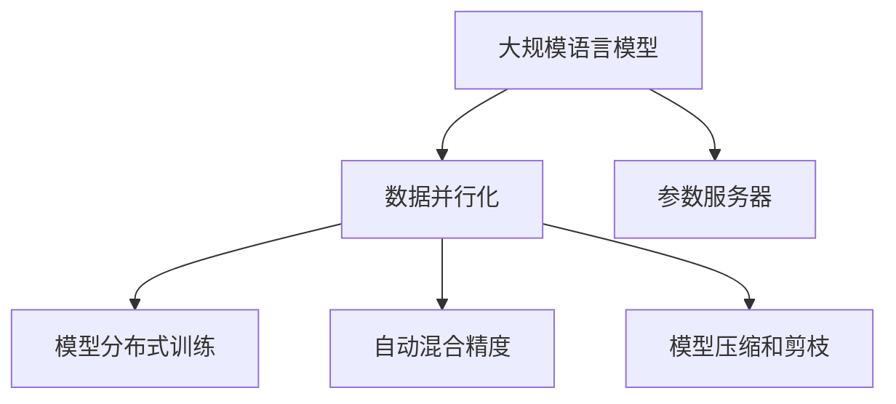

                 

## 1. 背景介绍

### 1.1 问题由来

在大规模语言模型(Large Language Models, LLM)的训练和推理过程中，由于模型参数数量巨大，单机训练常常面临资源瓶颈，限制了模型规模的扩大和训练效率的提升。为解决这一问题，数据并行化成为提高训练效率、加速模型训练的重要手段。

数据并行化是指将大规模数据集分成多个较小的子集，分配到多个计算节点上并行处理，再将处理结果合并，从而加速训练过程。在大模型训练中，数据并行化可以有效减轻单个节点计算压力，利用多节点的计算能力，加速模型的训练和推理。

### 1.2 问题核心关键点

在LLM中，数据并行化主要涉及以下几个关键点：

- **数据分割**：如何将大规模数据集划分成多个子集，分配到多个计算节点上进行并行处理。
- **模型参数共享**：多个计算节点共享同一模型，如何避免模型参数的同步和通信开销。
- **梯度聚合**：如何高效地将各个节点的梯度信息聚合起来，更新模型参数。
- **分布式计算框架**：选择和实现高效的数据并行化框架，如PyTorch Distributed、Horovod等。

这些关键点共同构成了LLM数据并行化的核心框架，在实际应用中需要根据具体需求进行选择和优化。

### 1.3 问题研究意义

数据并行化对于大语言模型训练和推理的高效性、可扩展性以及资源利用率有着重要意义：

- 提高训练效率。数据并行化能够将大规模数据集分配到多个节点上并行处理，加速训练速度。
- 扩展计算能力。通过增加计算节点数量，数据并行化可扩展模型的规模和复杂度。
- 优化资源利用。数据并行化可更好地利用多节点硬件资源，避免单个节点计算压力过大。
- 推动产业应用。数据并行化技术有助于提升大模型的实时性和可靠性，促进其在金融、医疗、教育等垂直领域的应用。

## 2. 核心概念与联系

### 2.1 核心概念概述

为更好地理解LLM数据并行化方法，本节将介绍几个密切相关的核心概念：

- **大规模语言模型(Large Language Models, LLM)**：如GPT-3、BERT等，具有庞大参数量的大规模预训练语言模型，通常包含数十亿到数百亿参数。
- **数据并行化(Data Parallelism)**：通过将大规模数据集划分成多个子集，分配到多个计算节点上并行处理，从而加速模型训练。
- **参数服务器(Parameter Server)**：集中管理模型参数，多个计算节点共享同一模型，通过参数服务器进行参数更新。
- **模型分布式训练**：将大规模模型分布式部署在多个节点上，并行更新模型参数。
- **自动混合精度(Automatic Mixed Precision)**：结合浮点数和定点数的混合精度计算，提升模型训练和推理的计算效率。
- **模型压缩和剪枝(模型剪枝)**：通过剪枝减少模型中不必要参数，优化模型结构，减少计算量。

这些核心概念之间的逻辑关系可以通过以下Mermaid流程图来展示：



这个流程图展示了大语言模型的核心概念及其之间的关系：

1. 大语言模型通过数据并行化获得并行计算能力。
2. 参数服务器集中管理模型参数，多个节点共享同一模型。
3. 模型分布式训练将模型分布在多个节点上，并行更新参数。
4. 自动混合精度和模型压缩进一步优化训练和推理效率。

这些概念共同构成了LLM数据并行化的基础框架，为其高效实现提供了关键支持。

## 3. 核心算法原理 & 具体操作步骤

### 3.1 算法原理概述

LLM数据并行化的基本原理是：将大规模数据集划分成多个子集，分配到多个计算节点上并行处理，再将处理结果合并，从而加速模型训练。这种并行处理方式可以分为数据并行、模型并行和混合并行等几种类型。

数据并行化将大规模数据集分割成多个子集，每个子集分配给一个计算节点进行并行处理。模型参数在所有节点之间共享，每个节点计算局部梯度，并发送给参数服务器进行汇总和更新。

### 3.2 算法步骤详解

基于数据并行的LLM训练流程通常包括以下几个关键步骤：

**Step 1: 数据预处理和分割**

1. 收集大规模数据集，将其划分为多个较小的数据集。
2. 每个计算节点从参数服务器获取当前模型参数。
3. 每个节点将分配到的数据集划分为多个批次(batch)，并行处理。

**Step 2: 模型前向传播**

1. 每个节点将当前批次数据输入模型，计算局部预测结果。
2. 将预测结果汇总到参数服务器。

**Step 3: 模型后向传播和参数更新**

1. 每个节点计算局部梯度，并发送给参数服务器。
2. 参数服务器聚合所有节点发送的梯度，更新模型参数。
3. 参数服务器将更新后的模型参数广播回所有节点。

**Step 4: 重复迭代**

1. 重复上述步骤，直到训练完成。

### 3.3 算法优缺点

基于数据并行的LLM训练方法具有以下优点：

- **高计算效率**。数据并行化利用多节点的计算能力，加速模型训练和推理。
- **可扩展性强**。通过增加计算节点数量，数据并行化可扩展模型的规模和复杂度。
- **资源利用率高**。每个计算节点独立处理数据，可以高效利用本地资源，避免单节点计算压力过大。

同时，该方法也存在一些局限性：

- **通信开销大**。每个节点需要与参数服务器进行数据交换，增加了通信开销。
- **参数更新复杂**。每个节点需要计算局部梯度并发送到参数服务器，增加了同步和通信开销。
- **易受硬件限制**。数据并行化依赖于多个计算节点的硬件配置，如GPU、TPU等。

尽管存在这些局限性，但就目前而言，数据并行化仍然是LLM训练中最主流的方法之一。未来相关研究将进一步优化通信开销，提高参数更新效率，并探索更多并行化方法，以进一步提升模型训练的效率和效果。

### 3.4 算法应用领域

基于数据并行的LLM训练方法广泛应用于各种大规模计算任务，例如：

- 机器翻译：在大规模双语语料上训练大型神经机器翻译模型。
- 自然语言处理(NLP)：在大型语料库上训练深度语言模型，如BERT、GPT等。
- 语音识别：在大规模语音数据上训练深度神经网络，提升识别精度。
- 计算机视觉：在大规模图像数据上训练卷积神经网络，提升识别和分类能力。
- 科学计算：在分布式计算集群上训练大规模科学计算模型，加速科学研究和模拟。

除了这些经典任务外，数据并行化在大规模数据分析、金融建模、医学图像处理等诸多领域都有广泛应用。随着预训练模型和训练方法的不断进步，数据并行化技术将在更多领域得到应用，为科研和产业带来巨大的计算效率提升。

## 4. 数学模型和公式 & 详细讲解 & 举例说明

### 4.1 数学模型构建

假设有一个大规模语言模型 $M_{\theta}$，其中 $\theta$ 为模型参数，$\mathcal{X}$ 为输入空间，$\mathcal{Y}$ 为输出空间。设数据集 $D=\{(x_i,y_i)\}_{i=1}^N$，其中 $x_i \in \mathcal{X}, y_i \in \mathcal{Y}$。

定义模型 $M_{\theta}$ 在输入 $x$ 上的损失函数为 $\ell(M_{\theta}(x),y)$，则在数据集 $D$ 上的经验风险为：

$$
\mathcal{L}(\theta) = \frac{1}{N} \sum_{i=1}^N \ell(M_{\theta}(x_i),y_i)
$$

数据并行化通过将数据集 $D$ 划分为 $K$ 个子集 $D_k=\{(x_{ik},y_{ik})\}_{i=1}^{\lfloor N/K \rfloor}$，每个子集分配给一个计算节点。每个节点 $k$ 的模型参数为 $\theta_k$，则数据并行化的训练目标为：

$$
\min_{\theta_k} \mathcal{L}_k(\theta_k) = \frac{1}{N} \sum_{i=1}^N \ell(M_{\theta_k}(x_{ik}),y_{ik})
$$

其中 $M_{\theta_k}$ 表示节点 $k$ 上的模型。

### 4.2 公式推导过程

在数据并行化训练中，每个节点 $k$ 的模型参数 $\theta_k$ 的更新公式为：

$$
\theta_k \leftarrow \theta_k - \eta_k \nabla_{\theta_k}\mathcal{L}_k(\theta_k)
$$

其中 $\eta_k$ 为节点 $k$ 的学习率。节点 $k$ 计算局部损失函数 $\ell(M_{\theta_k}(x_{ik}),y_{ik})$ 并求梯度，然后向参数服务器发送梯度信息。参数服务器将各个节点的梯度信息汇总，并求出全局梯度 $\nabla_{\theta}\mathcal{L}(\theta)$，更新全局模型参数 $\theta$。

### 4.3 案例分析与讲解

以下以BERT模型的数据并行化训练为例，说明具体的实现步骤：

1. 数据集 $D$ 划分为 $K$ 个子集，每个节点 $k$ 获取子集 $D_k$。
2. 每个节点 $k$ 将子集 $D_k$ 划分为多个批次(batch)，并行处理。
3. 每个节点 $k$ 在批次 $b$ 上进行前向传播和后向传播，计算局部损失函数 $\ell(M_{\theta_k}(x_{ik}),y_{ik})$ 并求梯度 $\nabla_{\theta_k}\mathcal{L}_k(\theta_k)$。
4. 节点 $k$ 将梯度 $\nabla_{\theta_k}\mathcal{L}_k(\theta_k)$ 发送到参数服务器。
5. 参数服务器将各个节点的梯度信息汇总，更新全局模型参数 $\theta$。
6. 参数服务器将更新后的全局模型参数 $\theta$ 广播回所有节点。
7. 重复步骤 2-6，直至训练完成。

通过以上步骤，实现了大规模语言模型的数据并行化训练，利用多节点的计算能力，加速模型训练。

## 5. 项目实践：代码实例和详细解释说明

### 5.1 开发环境搭建

在进行数据并行化实践前，我们需要准备好开发环境。以下是使用Python进行PyTorch开发的环境配置流程：

1. 安装Anaconda：从官网下载并安装Anaconda，用于创建独立的Python环境。

2. 创建并激活虚拟环境：
```bash
conda create -n pytorch-env python=3.8 
conda activate pytorch-env
```

3. 安装PyTorch：根据CUDA版本，从官网获取对应的安装命令。例如：
```bash
conda install pytorch torchvision torchaudio cudatoolkit=11.1 -c pytorch -c conda-forge
```

4. 安装Horovod库：
```bash
conda install horovod
```

5. 安装各类工具包：
```bash
pip install numpy pandas scikit-learn matplotlib tqdm jupyter notebook ipython
```

完成上述步骤后，即可在`pytorch-env`环境中开始数据并行化实践。

### 5.2 源代码详细实现

下面我们以BERT模型的数据并行化训练为例，给出使用PyTorch和Horovod进行数据并行化训练的PyTorch代码实现。

首先，定义数据处理函数：

```python
from torch.utils.data import DataLoader
from torch.distributed import distributed_c10d

def get_data_loader(dataset, batch_size):
    return DataLoader(dataset, batch_size=batch_size, num_workers=4)

class DistributedDataLoader(DistributedSampler, DataLoader):
    def __init__(self, dataset, batch_size):
        super(DistributedDataLoader, self).__init__(dataset, batch_size=batch_size, num_replicas=distributed_c10d.get_world_size(), rank=distributed_c10d.get_rank())

    def __iter__(self):
        # 设置随机种子
        if self.rank == 0:
            np.random.seed(1234)
        self.epoch = 0
        return iter(self.DistributedSampler(dataset))
```

然后，定义模型和优化器：

```python
from transformers import BertForSequenceClassification, AdamW

model = BertForSequenceClassification.from_pretrained('bert-base-cased', num_labels=2)

optimizer = AdamW(model.parameters(), lr=2e-5)
```

接着，定义训练和评估函数：

```python
from torch.nn.parallel import DistributedDataParallel as DDP
import horovod.torch as hvd

def train_epoch(model, data_loader, optimizer):
    model.train()
    total_loss = 0
    for batch in data_loader:
        input_ids = batch[0].to(hvd.rank())
        attention_mask = batch[1].to(hvd.rank())
        labels = batch[2].to(hvd.rank())

        # 模型前向传播
        with hvd.DistributedLossReducer("sum"):
            loss = model(input_ids, attention_mask=attention_mask, labels=labels)
            total_loss += loss.item()

        # 模型后向传播和参数更新
        optimizer.zero_grad()
        loss.backward()
        optimizer.step()

    return total_loss / len(data_loader)

def evaluate(model, data_loader):
    model.eval()
    total_preds, total_labels = [], []
    with torch.no_grad():
        for batch in data_loader:
            input_ids = batch[0].to(hvd.rank())
            attention_mask = batch[1].to(hvd.rank())
            labels = batch[2].to(hvd.rank())

            # 模型前向传播
            outputs = model(input_ids, attention_mask=attention_mask, labels=labels)

            # 获取预测结果
            batch_preds = outputs.argmax(dim=1)
            total_preds += batch_preds.tolist()
            total_labels += labels.tolist()

    return total_preds, total_labels

# 启动训练流程
epochs = 5
batch_size = 16
device = torch.device('cuda' if torch.cuda.is_available() else 'cpu')

# 多进程训练
hvd.init()
hvd.size()
world_size = hvd.size()
rank = hvd.rank()
gpus = list(range(torch.cuda.device_count()))
torch.cuda.set_device(rank % len(gpus))
device = torch.device(f'cuda:{gpus[rank]}')

# 模型并行化
model = DDP(model.to(device), device_ids=[torch.cuda.current_device()])

# 分布式训练
distributed_data_loader = DistributedDataLoader(train_dataset, batch_size)
for epoch in range(epochs):
    train_loss = train_epoch(model, distributed_data_loader, optimizer)
    print(f"Epoch {epoch+1}, train loss: {train_loss:.3f}")

    test_preds, test_labels = evaluate(model, distributed_data_loader)
    print(classification_report(test_labels, test_preds))
```

### 5.3 代码解读与分析

让我们再详细解读一下关键代码的实现细节：

**DistributedDataLoader类**：
- `__init__`方法：继承自`DistributedSampler`和`DataLoader`，实现了分布式数据加载器的构造和迭代逻辑。
- `__iter__`方法：随机设置随机种子，从数据集中随机抽取样本，并发送给所有节点。

**horovod的分布式损失还原器**：
- 通过`hvd.DistributedLossReducer("sum")`实现参数服务器汇总节点计算的梯度，避免了单节点计算的复杂性。

**多进程训练**：
- 使用Horovod进行多进程分布式训练，每个节点独立处理数据，提高了训练效率。

**模型并行化**：
- 使用`torch.nn.parallel.DistributedDataParallel(DDP)`将模型并行化，将模型分发到多个计算节点上进行并行计算。

**分布式数据加载**：
- 通过`DistributedDataLoader`实现了分布式数据加载，每个节点独立处理数据，并行化计算过程。

**训练和评估**：
- `train_epoch`函数：在分布式数据加载器上执行模型前向传播和后向传播，计算局部损失并更新参数。
- `evaluate`函数：在分布式数据加载器上执行模型前向传播，获取预测结果和标签，用于评估模型性能。

**多进程环境设置**：
- 使用Horovod初始化分布式环境，定义节点数量和节点顺序。
- 设置每个节点的GPU设备，并初始化模型。

通过以上步骤，实现了BERT模型的分布式训练和评估，利用多节点并行计算能力，加速了模型的训练和推理。

## 6. 实际应用场景

### 6.1 智能客服系统

基于大语言模型的智能客服系统，可以通过数据并行化技术进一步提高服务效率和系统稳定性。在智能客服系统中，客户咨询请求会快速增加，对系统响应速度和并发处理能力提出了更高要求。通过数据并行化，智能客服系统可以高效地处理大量客户咨询，提升服务质量和用户满意度。

在实际部署中，可以使用数据并行化技术将智能客服系统部署在多个计算节点上，每个节点独立处理客户咨询，并行计算结果。通过优化节点间的通信和数据传输，提高系统吞吐量和响应速度。

### 6.2 金融舆情监测

金融舆情监测系统需要实时处理海量文本数据，分析市场舆情变化，预警金融风险。传统系统往往难以应对大规模数据处理的挑战，数据并行化技术可以有效提升系统的计算能力和响应速度。

在金融舆情监测系统中，可以使用数据并行化技术将文本数据分布式存储和处理，每个节点独立处理数据，并行计算分析结果。通过优化节点间的通信和数据传输，提高系统处理速度和精度，及时预警金融风险。

### 6.3 个性化推荐系统

个性化推荐系统需要处理大规模用户行为数据，计算推荐结果，对推荐效果进行评估和优化。传统推荐系统往往依赖单节点计算，难以处理大规模数据，计算效率低，响应速度慢。通过数据并行化，个性化推荐系统可以高效地处理大规模数据，提升推荐精度和系统性能。

在个性化推荐系统中，可以使用数据并行化技术将用户行为数据分布式存储和处理，每个节点独立处理数据，并行计算推荐结果。通过优化节点间的通信和数据传输，提高系统处理速度和精度，及时更新推荐结果，提升用户体验。

### 6.4 未来应用展望

随着数据并行化技术的不断发展和优化，未来其在智能系统中的应用将更加广泛。以下是几个可能的未来应用场景：

1. **智慧城市管理**：智慧城市管理系统需要处理海量数据，实时分析城市运行状态，提升城市治理效率。通过数据并行化，智慧城市管理系统可以高效地处理城市数据，提升城市运行效率和应急响应能力。

2. **智能交通系统**：智能交通系统需要实时处理交通数据，优化交通流量，提升交通管理水平。通过数据并行化，智能交通系统可以高效地处理交通数据，优化交通流量，提升交通管理水平。

3. **工业互联网**：工业互联网需要处理大规模工业数据，优化生产流程，提升生产效率。通过数据并行化，工业互联网可以高效地处理工业数据，优化生产流程，提升生产效率。

4. **科学计算**：科学计算需要处理大规模科学数据，进行科学模拟和预测，提升科学研究水平。通过数据并行化，科学计算可以高效地处理科学数据，进行科学模拟和预测，提升科学研究水平。

这些应用场景展示了数据并行化技术的广阔前景，未来在更多领域中将发挥重要作用。

## 7. 工具和资源推荐

### 7.1 学习资源推荐

为了帮助开发者系统掌握数据并行化的理论和实践，这里推荐一些优质的学习资源：

1. 《深度学习入门：基于TensorFlow和PyTorch的理论与实现》：介绍TensorFlow和PyTorch的分布式训练机制，适合初学者学习。

2. 《动手学深度学习》：介绍深度学习中的数据并行化技术，包含丰富的实践案例和代码示例。

3. PyTorch官方文档：提供详细的PyTorch分布式训练和数据并行化示例。

4. 《大规模深度学习与分布式计算》：介绍大规模深度学习中的分布式训练技术，适合深入研究。

5. Horovod官方文档：提供详细的Horovod分布式训练和数据并行化示例。

通过这些学习资源，相信你一定能够快速掌握数据并行化的精髓，并用于解决实际的计算问题。

### 7.2 开发工具推荐

高效的开发离不开优秀的工具支持。以下是几款用于数据并行化开发的常用工具：

1. PyTorch：基于Python的开源深度学习框架，灵活动态的计算图，适合快速迭代研究。

2. TensorFlow：由Google主导开发的开源深度学习框架，生产部署方便，适合大规模工程应用。

3. Horovod：开源的分布式深度学习框架，支持多种深度学习框架，如TensorFlow、PyTorch等，支持多种分布式训练模式。

4. Nvidia DLA：Nvidia开发的深度学习加速器，支持大规模深度学习模型的分布式训练和推理。

5. ScaleAI：开源的分布式深度学习框架，提供自动混合精度、自动分布式训练等功能，适合大规模数据和模型的训练。

6. Gloo：Facebook开源的分布式通信库，提供高效的数据通信和同步机制，支持多种分布式训练框架。

合理利用这些工具，可以显著提升数据并行化任务的开发效率，加快创新迭代的步伐。

### 7.3 相关论文推荐

数据并行化技术的发展源于学界的持续研究。以下是几篇奠基性的相关论文，推荐阅读：

1. Distributed Deep Learning with GPU and CPU Collectives（2015）：介绍分布式深度学习的计算图模型和优化策略。

2. Large-Scale Distributed Deep Learning（2016）：介绍大规模分布式深度学习的算法和实现。

3. Distributed Optimization Algorithms for Deep Learning（2017）：介绍分布式优化算法在深度学习中的应用。

4. Training Deep Neural Networks with Mixed Precision: A Comprehensive Survey（2019）：介绍混合精度计算在深度学习中的应用。

5. Towards a Model Parallel Training Framework with Parameter Sharding（2020）：介绍模型并行化在深度学习中的应用。

这些论文代表了大规模深度学习中的数据并行化技术的发展脉络。通过学习这些前沿成果，可以帮助研究者把握学科前进方向，激发更多的创新灵感。

## 8. 总结：未来发展趋势与挑战

### 8.1 总结

本文对数据并行化技术在大规模语言模型中的应用进行了全面系统的介绍。首先阐述了数据并行化的背景和意义，明确了数据并行化在提高计算效率、扩展计算能力、优化资源利用等方面的重要作用。其次，从原理到实践，详细讲解了数据并行化的数学模型和实现步骤，给出了数据并行化任务开发的完整代码实例。同时，本文还广泛探讨了数据并行化在智能客服、金融舆情、个性化推荐等多个行业领域的应用前景，展示了数据并行化的巨大潜力。此外，本文精选了数据并行化的各类学习资源，力求为读者提供全方位的技术指引。

通过本文的系统梳理，可以看到，数据并行化技术在大语言模型中的应用已经日趋成熟，成为了提高模型训练和推理效率的重要手段。未来，伴随数据并行化方法的不断进步，大规模语言模型的计算效率和扩展性将得到进一步提升，推动其在高性能计算和科学计算等领域的应用。

### 8.2 未来发展趋势

展望未来，数据并行化技术将呈现以下几个发展趋势：

1. **更高效的通信机制**：未来的数据并行化技术将进一步优化通信机制，减少节点间的通信开销，提高并行计算效率。

2. **更灵活的分布式训练框架**：未来的分布式训练框架将更加灵活，支持多种分布式模式，如模型并行、数据并行、混合并行等。

3. **更多的硬件支持**：未来的硬件设备将更加丰富，支持分布式训练的硬件设备将进一步增加，如GPU、TPU、FPGA等。

4. **更广泛的应用场景**：未来的数据并行化技术将在更多领域得到应用，如智慧城市、智能交通、工业互联网等。

5. **更高的安全性**：未来的数据并行化技术将更加注重数据安全和隐私保护，确保计算过程的透明性和可控性。

6. **更强的可扩展性**：未来的数据并行化技术将支持更大规模的数据集和模型，能够有效应对大规模数据处理的挑战。

以上趋势凸显了数据并行化技术的广阔前景，未来的发展将更加多元化和深入化。

### 8.3 面临的挑战

尽管数据并行化技术已经取得了显著进展，但在迈向更加智能化、普适化应用的过程中，它仍面临诸多挑战：

1. **通信开销问题**：数据并行化依赖于节点间的通信，通信开销大，容易成为系统瓶颈。如何减少通信开销，提高并行计算效率，仍然是一个重要问题。

2. **参数同步问题**：数据并行化依赖于参数服务器，参数同步和通信开销较大，容易影响系统性能。如何优化参数同步机制，提高系统效率，是未来研究的重点。

3. **资源管理问题**：数据并行化依赖于多节点的资源管理，如何高效利用资源，避免资源浪费，是未来研究的难点。

4. **算法设计问题**：数据并行化依赖于算法的优化，如何设计高效的并行算法，提高系统性能，是未来研究的重点。

5. **系统稳定性问题**：数据并行化依赖于系统稳定性和可靠性，如何保证系统稳定运行，避免故障和崩溃，是未来研究的难点。

6. **硬件限制问题**：数据并行化依赖于硬件支持，如何优化硬件设计，提高并行计算能力，是未来研究的重点。

正视数据并行化面临的这些挑战，积极应对并寻求突破，将是大规模语言模型并行训练走向成熟的必由之路。相信随着学界和产业界的共同努力，这些挑战终将一一被克服，数据并行化技术必将在构建高性能、高扩展性、高可靠性的智能系统中扮演越来越重要的角色。

### 8.4 研究展望

面对数据并行化面临的诸多挑战，未来的研究需要在以下几个方面寻求新的突破：

1. **优化通信开销**：引入更高效的通信机制，如Ring-AllReduce、Sum-AllReduce等，减少节点间的通信开销，提高并行计算效率。

2. **优化参数同步**：引入更高效的参数同步机制，如PG-Sum、Ring-Sum等，优化参数同步过程，提高系统效率。

3. **优化资源管理**：引入更高效的系统资源管理策略，如GPU资源管理、内存管理等，提高系统资源利用率。

4. **设计高效算法**：设计高效并行算法，如Gossip算法、环算法等，提高系统性能。

5. **提高系统稳定性**：引入更高效的系统稳定策略，如容错机制、冗余设计等，提高系统稳定性。

6. **优化硬件设计**：引入更高效的硬件设计策略，如多节点集群、混合精度计算等，提高并行计算能力。

这些研究方向将推动数据并行化技术向更高的台阶发展，为大规模语言模型的高效训练和推理提供更强大的支持。

## 9. 附录：常见问题与解答

**Q1：数据并行化过程中如何减少通信开销？**

A: 数据并行化过程中，通信开销是系统瓶颈之一。为了减少通信开销，可以采用以下方法：

1. **使用高效的通信库**：使用高效通信库，如Gloo、MPI等，优化通信开销。

2. **减少通信次数**：将多个小批次合并为一个批次，减少通信次数。

3. **使用异步通信**：使用异步通信机制，提高通信效率。

4. **使用稀疏通信**：使用稀疏通信机制，减少不必要的数据传输。

5. **使用分布式张量处理单元(Distributed Tensor Processing Unit, dTPU)**：dTPU能够显著减少通信开销，提高并行计算效率。

**Q2：数据并行化过程中如何优化参数同步？**

A: 数据并行化过程中，参数同步是系统瓶颈之一。为了优化参数同步，可以采用以下方法：

1. **使用高效同步机制**：使用高效同步机制，如Ring-Sum、Gossip算法等，优化同步过程。

2. **使用异步同步**：使用异步同步机制，提高同步效率。

3. **使用基于一致性哈希的同步机制**：使用基于一致性哈希的同步机制，优化同步过程。

4. **使用多个同步线程**：使用多个同步线程，提高同步效率。

5. **使用模型并行化**：使用模型并行化，将模型分块处理，减少同步开销。

**Q3：数据并行化过程中如何优化资源管理？**

A: 数据并行化过程中，资源管理是系统瓶颈之一。为了优化资源管理，可以采用以下方法：

1. **使用GPU资源管理工具**：使用GPU资源管理工具，如CUDA Toolkit、NVIDIA Management Toolkit等，优化资源管理。

2. **使用内存管理工具**：使用内存管理工具，如Caffe2、PyTorch等，优化内存使用。

3. **使用资源调度工具**：使用资源调度工具，如Kubernetes、Slurm等，优化资源调度。

4. **使用自动混合精度(Automatic Mixed Precision, AMP)**：使用自动混合精度计算，优化计算效率。

5. **使用模型压缩和剪枝**：使用模型压缩和剪枝技术，优化模型结构。

这些方法可以显著提高数据并行化过程的资源管理效率，优化系统性能。

**Q4：数据并行化过程中如何提高系统稳定性？**

A: 数据并行化过程中，系统稳定性是系统瓶颈之一。为了提高系统稳定性，可以采用以下方法：

1. **引入容错机制**：引入容错机制，如故障切换、数据冗余等，提高系统可靠性。

2. **优化算法设计**：优化算法设计，减少算法错误，提高系统稳定性。

3. **使用硬件冗余**：使用硬件冗余设计，提高系统可靠性。

4. **优化网络设计**：优化网络设计，减少网络中断，提高系统稳定性。

5. **使用模型备份**：使用模型备份机制，提高系统可靠性。

这些方法可以显著提高数据并行化过程的系统稳定性，确保系统可靠运行。

**Q5：数据并行化过程中如何提高系统性能？**

A: 数据并行化过程中，系统性能是系统瓶颈之一。为了提高系统性能，可以采用以下方法：

1. **优化通信机制**：优化通信机制，减少通信开销，提高并行计算效率。

2. **优化参数同步**：优化参数同步机制，减少同步开销，提高系统效率。

3. **优化资源管理**：优化资源管理策略，提高资源利用率，优化系统性能。

4. **设计高效算法**：设计高效并行算法，提高系统性能。

5. **优化硬件设计**：优化硬件设计，提高并行计算能力，优化系统性能。

这些方法可以显著提高数据并行化过程的系统性能，优化系统效率。

---

作者：禅与计算机程序设计艺术 / Zen and the Art of Computer Programming

