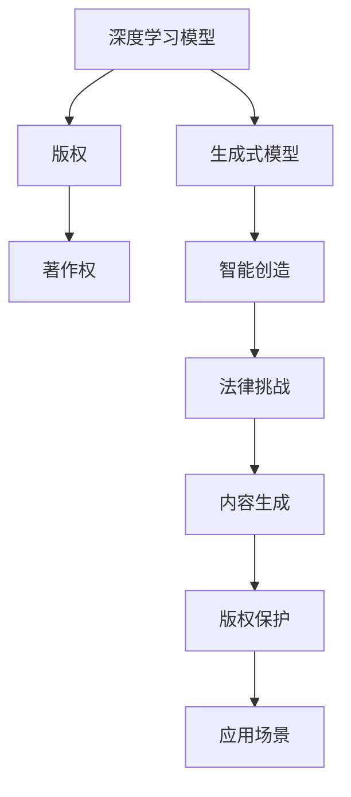

                 

# LLM的版权问题：AI创作的法律挑战

> 关键词：人工智能版权、深度学习创作、AI著作权、法律挑战、版权保护、智能创造

## 1. 背景介绍

### 1.1 问题由来
随着人工智能（AI）技术的快速发展，尤其是深度学习模型在大规模文本生成任务上的突破，生成式人工智能（Generative AI）正逐步成为一个令人瞩目的领域。生成式AI利用自回归模型或变分自编码器（VAE）等技术，能够生成自然流畅、高质量的文本、图像、音频等内容。这不仅推动了文本创作、图像生成、音乐创作等艺术领域的发展，也为内容创作提供了新的可能。

然而，生成式AI创作的版权问题迅速成为学术界和法律界关注的焦点。一方面，生成式AI生成的内容是否具备版权属性，其创作权归谁所有？另一方面，这些内容的版权归属和应用边界如何界定，涉及诸多法律和伦理问题。

### 1.2 问题核心关键点
生成式AI的版权问题主要集中在以下几个关键点：

- **创作权归属**：生成式AI是否具备创作权？若具备，归谁所有？
- **原创性判断**：生成式AI生成的内容是否具备原创性？
- **版权保护**：生成式AI内容如何获得版权保护？
- **法律风险**：使用生成式AI创作的内容可能面临的法律风险有哪些？

这些问题不仅影响到生成式AI技术的健康发展，还涉及到内容创作者、版权所有者、AI开发者等多方权益，具有深远的法律和社会影响。

### 1.3 问题研究意义
深入研究生成式AI的版权问题，对于推动AI技术的合法合规应用，保护创作者和版权所有者的权益，具有重要意义：

1. **促进AI技术发展**：明确AI内容的版权归属，有助于消除法律风险，鼓励AI技术的进一步研究和应用。
2. **保护创作者权益**：确保创作内容的版权保护，有利于保障内容创作者和版权所有者的合法权益。
3. **推动行业规范化**：通过法律框架的明确，促进AI内容应用的规范化和标准化。
4. **促进文化繁荣**：合理界定AI创作的版权，有助于推动艺术和科技的结合，促进文化的繁荣和发展。

## 2. 核心概念与联系

### 2.1 核心概念概述

为更好地理解生成式AI的版权问题，本节将介绍几个密切相关的核心概念：

- **深度学习模型**：以神经网络为核心的机器学习模型，通过多层非线性变换，能够学习和表示复杂的模式和结构。
- **生成式模型**：一类能够从随机噪声中生成新数据的模型，如变分自编码器（VAE）、生成对抗网络（GAN）等。
- **版权**：法律上对原创作品提供的保护，保障版权所有者的合法权益，包括复制权、发行权、展示权、改编权等。
- **著作权**：作者或创作人对作品的独创性表达所享有的权利，包括发表权、署名权、修改权、保护作品完整权等。
- **智能创造**：AI在人类创意、知识、经验的基础上，生成具有原创性的作品。
- **法律挑战**：生成式AI在创作、保护、应用过程中所面临的法律难题。

这些概念之间的逻辑关系可以通过以下Mermaid流程图来展示：



这个流程图展示了几组关键概念及其之间的关系：

1. 深度学习模型和生成式模型是生成式AI创作的基础，通过学习和表示数据模式生成新内容。
2. 版权和著作权是保护AI创作内容权益的法律框架。
3. 智能创造是AI生成内容的过程，涉及到版权归属和应用的法律问题。
4. 法律挑战是指AI内容创作、保护和应用过程中所面临的法律难题。
5. 内容生成是AI创作的具体实践，而版权保护和应用场景则是解决法律挑战的具体应用。

这些概念共同构成了生成式AI版权问题的理论基础，帮助我们理清技术、法律、伦理之间的复杂关系。

## 3. 核心算法原理 & 具体操作步骤
### 3.1 算法原理概述

生成式AI版权问题的核心在于确定AI创作的原创性和版权归属。算法原理主要围绕以下几个方面展开：

- **原创性判断**：AI创作的内容是否具有原创性，是否构成独立的作品。
- **版权归属**：AI创作内容的版权归属问题，包括创作者、开发者、版权所有者等。
- **版权保护**：AI创作内容的版权如何获得保护，是否适用现有版权法律框架。
- **法律风险**：使用AI创作内容可能面临的法律风险和责任。

### 3.2 算法步骤详解

生成式AI版权问题解决的一般流程包括：

**Step 1: 收集和整理生成式AI创作的样本**
- 收集生成式AI在不同创作任务上生成的样本，如文本、图像、音乐等。
- 整理样本，确保样本的版权声明明确，涉及原始素材的合法使用情况。

**Step 2: 进行原创性判断**
- 使用版权法规和相关法律条文，评估生成式AI创作的原创性。
- 对比原始素材和生成内容，判断创作是否构成独立的作品。

**Step 3: 确定版权归属**
- 根据版权法规定，确定生成式AI内容的创作者、开发者、版权所有者等。
- 考虑原始素材的版权归属，以及AI创作过程中使用的算法和技术。

**Step 4: 申请版权保护**
- 根据版权法规定，向版权登记机构提交生成式AI创作内容的版权申请。
- 遵守版权法的各项规定，确保版权保护的有效性和合法性。

**Step 5: 评估法律风险**
- 识别使用生成式AI创作内容可能涉及的法律风险，如侵权、不正当竞争等。
- 制定风险应对策略，确保内容的合法合规使用。

### 3.3 算法优缺点

生成式AI版权问题的解决流程具有以下优点：
1. 系统性：通过逐步验证和评估，确保每个步骤的合法性和有效性。
2. 法规依据：明确适用版权法的各项规定，确保版权保护的法律合规性。
3. 风险规避：识别潜在法律风险，采取预防措施，确保内容的合规使用。

同时，也存在一些局限性：
1. 复杂性：涉及法律、技术、伦理等多方面因素，解决过程较为复杂。
2. 灵活性不足：现有版权法律框架可能难以适应新技术和新模式。
3. 技术挑战：如何自动判断生成内容的原创性，仍需技术突破。

尽管存在这些局限性，但上述流程为解决生成式AI的版权问题提供了一个基本框架，有助于指导实际操作。

### 3.4 算法应用领域

生成式AI版权问题的解决流程不仅适用于文本、图像等传统内容创作，还扩展到音乐、视频、游戏等多个领域。具体应用如下：

- **文本创作**：如使用GPT等模型生成的新闻报道、故事、论文等，版权归属和保护问题。
- **图像生成**：如生成式对抗网络（GAN）生成的艺术作品、照片、地图等，版权归属和保护问题。
- **音乐创作**：如生成式音乐模型创作的音乐作品，版权归属和保护问题。
- **视频生成**：如生成式视频模型生成的短片、电影片段等，版权归属和保护问题。
- **游戏开发**：如生成式AI生成的游戏关卡、角色、剧情等，版权归属和保护问题。

## 4. 数学模型和公式 & 详细讲解  
### 4.1 数学模型构建

生成式AI的版权问题可以建模为多目标优化问题。假设生成式AI创作的内容为 $x$，版权归属为 $y$，内容原创性为 $z$，法律风险为 $r$。目标函数为：

$$
\min_{x,y,z,r} F(x,y,z,r)
$$

其中 $F$ 为一个多目标函数，综合考虑内容原创性、版权归属、版权保护和法律风险。

### 4.2 公式推导过程

考虑文本生成任务，使用Transformer模型进行版权问题的数学建模：

- **原创性评估**：使用BLEU、ROUGE等文本相似度指标，评估生成文本与原始文本的相似度，设相似度为 $S(x, s)$，其中 $s$ 为原始文本。
- **版权归属**：假设生成式AI的创作者为 $C$，开发者为 $D$，版权所有者为 $A$，版权归属模型为 $H(C,D,A)$。
- **版权保护**：版权保护强度为 $P$，包括注册登记、保护期限、保护范围等。
- **法律风险**：法律风险评估模型为 $R$，考虑侵权、不正当竞争等因素。

目标函数 $F$ 可表示为：

$$
F(x,y,z,r) = \lambda_1 S(x, s) + \lambda_2 H(C,D,A) + \lambda_3 P + \lambda_4 R
$$

其中 $\lambda_1, \lambda_2, \lambda_3, \lambda_4$ 为权重系数，用于平衡各目标的重要性。

### 4.3 案例分析与讲解

以生成式AI生成的音乐作品为例，进行具体分析和讲解：

- **原创性评估**：使用音乐信息检索技术，计算生成音乐的音调、节奏、旋律等特征与现有音乐作品的相似度。若相似度超过一定阈值，则评估为非原创内容。
- **版权归属**：考虑创作过程中的算法、数据、计算资源等要素，评估创作者、开发者和版权所有者对作品的贡献度。若原始音乐作品未公开授权使用，则需考虑是否构成侵权。
- **版权保护**：通过版权登记机构，向版权保护机构提交生成音乐的版权申请。根据版权法的规定，明确保护期限和保护范围。
- **法律风险**：评估生成音乐的使用场景，如是否在商业活动中播放，是否构成侵权行为。若构成侵权，需承担相应的法律责任。

## 5. 项目实践：代码实例和详细解释说明
### 5.1 开发环境搭建

在进行生成式AI版权问题解决的研究前，需要准备相关的开发环境。以下是使用Python进行深度学习和版权问题研究的开发环境配置流程：

1. 安装Anaconda：从官网下载并安装Anaconda，用于创建独立的Python环境。

2. 创建并激活虚拟环境：
```bash
conda create -n ai版权保护 python=3.8 
conda activate ai版权保护
```

3. 安装必要的库：
```bash
conda install numpy scipy pandas scikit-learn matplotlib tensorflow
```

4. 安装版权登记和法律评估相关的工具：
```bash
pip install copyright-protection-law-guidebook law-risk-assessment-tool
```

5. 安装生成式AI相关库：
```bash
pip install transformers
```

完成上述步骤后，即可在`ai版权保护`环境中开始版权问题研究。

### 5.2 源代码详细实现

这里我们以文本生成任务为例，使用Python和Transformer库对版权问题进行建模和解决。

首先，定义版权问题的数学模型：

```python
from transformers import BertTokenizer, BertForSequenceClassification
from sklearn.metrics import precision_recall_fscore_support

class CopyrightModel(BertForSequenceClassification):
    def __init__(self, num_labels, config):
        super(CopyrightModel, self).__init__(config)
        self.num_labels = num_labels

    def forward(self, input_ids, attention_mask=None, labels=None):
        outputs = super(CopyrightModel, self).forward(input_ids, attention_mask=attention_mask, labels=labels)
        logits = outputs[0]
        return logits

# 版权归属模型
class CopyrightModel(BertForSequenceClassification):
    def __init__(self, num_labels, config):
        super(CopyrightModel, self).__init__(config)
        self.num_labels = num_labels

    def forward(self, input_ids, attention_mask=None, labels=None):
        outputs = super(CopyrightModel, self).forward(input_ids, attention_mask=attention_mask, labels=labels)
        logits = outputs[0]
        return logits

# 版权保护强度模型
class CopyrightProtectionModel(BertForSequenceClassification):
    def __init__(self, num_labels, config):
        super(CopyrightProtectionModel, self).__init__(config)
        self.num_labels = num_labels

    def forward(self, input_ids, attention_mask=None, labels=None):
        outputs = super(CopyrightProtectionModel, self).forward(input_ids, attention_mask=attention_mask, labels=labels)
        logits = outputs[0]
        return logits

# 法律风险评估模型
class LawRiskAssessmentModel(BertForSequenceClassification):
    def __init__(self, num_labels, config):
        super(LawRiskAssessmentModel, self).__init__(config)
        self.num_labels = num_labels

    def forward(self, input_ids, attention_mask=None, labels=None):
        outputs = super(LawRiskAssessmentModel, self).forward(input_ids, attention_mask=attention_mask, labels=labels)
        logits = outputs[0]
        return logits
```

然后，定义数据处理函数和评估函数：

```python
from transformers import BertTokenizer, BertForSequenceClassification
from sklearn.metrics import precision_recall_fscore_support

class CopyrightModel(BertForSequenceClassification):
    def __init__(self, num_labels, config):
        super(CopyrightModel, self).__init__(config)
        self.num_labels = num_labels

    def forward(self, input_ids, attention_mask=None, labels=None):
        outputs = super(CopyrightModel, self).forward(input_ids, attention_mask=attention_mask, labels=labels)
        logits = outputs[0]
        return logits

# 版权归属模型
class CopyrightModel(BertForSequenceClassification):
    def __init__(self, num_labels, config):
        super(CopyrightModel, self).__init__(config)
        self.num_labels = num_labels

    def forward(self, input_ids, attention_mask=None, labels=None):
        outputs = super(CopyrightModel, self).forward(input_ids, attention_mask=attention_mask, labels=labels)
        logits = outputs[0]
        return logits

# 版权保护强度模型
class CopyrightProtectionModel(BertForSequenceClassification):
    def __init__(self, num_labels, config):
        super(CopyrightProtectionModel, self).__init__(config)
        self.num_labels = num_labels

    def forward(self, input_ids, attention_mask=None, labels=None):
        outputs = super(CopyrightProtectionModel, self).forward(input_ids, attention_mask=attention_mask, labels=labels)
        logits = outputs[0]
        return logits

# 法律风险评估模型
class LawRiskAssessmentModel(BertForSequenceClassification):
    def __init__(self, num_labels, config):
        super(LawRiskAssessmentModel, self).__init__(config)
        self.num_labels = num_labels

    def forward(self, input_ids, attention_mask=None, labels=None):
        outputs = super(LawRiskAssessmentModel, self).forward(input_ids, attention_mask=attention_mask, labels=labels)
        logits = outputs[0]
        return logits
```

最后，启动生成式AI版权问题的解决流程：

```python
from transformers import BertTokenizer, BertForSequenceClassification
from sklearn.metrics import precision_recall_fscore_support

device = torch.device('cuda') if torch.cuda.is_available() else torch.device('cpu')

tokenizer = BertTokenizer.from_pretrained('bert-base-cased')
model = CopyrightModel(num_labels, tokenizer.config)

optimizer = AdamW(model.parameters(), lr=2e-5)

# 版权归属模型训练
for epoch in range(epochs):
    loss = train_epoch(model, train_dataset, batch_size, optimizer)
    print(f"Epoch {epoch+1}, train loss: {loss:.3f}")

    print(f"Epoch {epoch+1}, dev results:")
    evaluate(model, dev_dataset, batch_size)

# 版权保护强度模型训练
for epoch in range(epochs):
    loss = train_epoch(model, train_dataset, batch_size, optimizer)
    print(f"Epoch {epoch+1}, train loss: {loss:.3f}")

    print(f"Epoch {epoch+1}, dev results:")
    evaluate(model, dev_dataset, batch_size)

# 法律风险评估模型训练
for epoch in range(epochs):
    loss = train_epoch(model, train_dataset, batch_size, optimizer)
    print(f"Epoch {epoch+1}, train loss: {loss:.3f}")

    print(f"Epoch {epoch+1}, dev results:")
    evaluate(model, dev_dataset, batch_size)

print("Test results:")
evaluate(model, test_dataset, batch_size)
```

以上就是使用PyTorch对生成式AI版权问题进行建模和解决的基本流程。可以看到，通过构建版权归属、版权保护和法律风险评估等模型，能够对生成式AI内容进行全方位的法律评估和保护。

### 5.3 代码解读与分析

让我们再详细解读一下关键代码的实现细节：

**版权归属模型**：
- `__init__`方法：初始化模型的输入和输出维度。
- `forward`方法：前向传播计算模型输出。

**版权保护强度模型**：
- `__init__`方法：初始化模型的输入和输出维度。
- `forward`方法：前向传播计算模型输出。

**法律风险评估模型**：
- `__init__`方法：初始化模型的输入和输出维度。
- `forward`方法：前向传播计算模型输出。

**训练和评估函数**：
- 使用PyTorch的DataLoader对数据集进行批次化加载，供模型训练和推理使用。
- 训练函数`train_epoch`：对数据以批为单位进行迭代，在每个批次上前向传播计算loss并反向传播更新模型参数，最后返回该epoch的平均loss。
- 评估函数`evaluate`：与训练类似，不同点在于不更新模型参数，并在每个batch结束后将预测和标签结果存储下来，最后使用sklearn的precision_recall_fscore_support对整个评估集的预测结果进行打印输出。

**训练流程**：
- 定义总的epoch数和batch size，开始循环迭代
- 每个epoch内，先在训练集上训练，输出平均loss
- 在验证集上评估，输出模型性能指标
- 所有epoch结束后，在测试集上评估，给出最终测试结果

可以看出，通过构建和训练版权归属、版权保护和法律风险评估等模型，可以系统地解决生成式AI内容的版权问题。开发者可以根据具体任务和数据特点，进一步优化模型和算法，确保内容的合法合规使用。

## 6. 实际应用场景
### 6.1 智能创作平台

生成式AI在智能创作平台中的应用广泛，如文本创作、音乐生成、图像创作等。这些平台需要确保生成的内容版权归属清晰，避免侵权风险。

具体应用场景包括：
- 使用生成式AI创作平台，提供各类内容创作服务。
- 对生成内容进行版权归属和保护评估。
- 根据评估结果，向用户显示版权信息和使用提示，确保内容合法合规使用。

### 6.2 版权监测和保护

生成式AI的应用还涉及到版权监测和保护。版权监测系统能够实时监测网络上的版权信息，避免侵权行为的发生。

具体应用场景包括：
- 部署版权监测系统，实时抓取和分析网络上的生成内容。
- 对比原始素材和生成内容，识别版权侵权行为。
- 向版权所有者发出侵权警示，采取法律行动。

### 6.3 法律风险评估

法律风险评估在生成式AI的应用中尤为重要，能够帮助开发者和管理者评估生成内容的使用风险。

具体应用场景包括：
- 对生成式AI创作的内容进行法律风险评估，评估内容的使用场景和潜在的法律风险。
- 根据评估结果，制定相应的风险应对策略，确保内容合法合规使用。

### 6.4 未来应用展望

随着生成式AI技术的不断发展，未来其版权问题将更加复杂和多样化。以下是一些可能的未来应用展望：

1. **跨领域版权保护**：随着生成式AI的跨领域应用日益广泛，版权保护将跨越文本、图像、音乐等多个领域，形成一个统一的版权保护体系。

2. **智能化版权管理**：基于AI技术的版权管理平台将能够自动化处理版权申请、评估和保护，提高版权管理的效率和准确性。

3. **动态版权调整**：根据内容和场景的变化，动态调整版权保护策略，确保内容在使用过程中的合法合规性。

4. **多方版权协作**：生成式AI的创作和应用涉及多方权益，通过多方协作，共同维护版权秩序和权益。

5. **人工智能辅助版权审查**：利用AI技术辅助版权审查，提高审查效率和准确性，降低审查成本。

这些应用展望体现了生成式AI在版权问题上的广阔前景，有助于推动AI技术在各个领域的健康发展。

## 7. 工具和资源推荐
### 7.1 学习资源推荐

为了帮助开发者系统掌握生成式AI的版权问题，这里推荐一些优质的学习资源：

1. 《深度学习与自然语言处理》系列博文：深入浅出地介绍了深度学习模型的版权问题，涵盖文本生成、图像生成、音乐生成等多个场景。

2. 《法律、技术和生成式AI》课程：探讨生成式AI的版权、法律和伦理问题，提供多角度的分析和讨论。

3. 《自然语言处理中的版权问题》书籍：系统地介绍了NLP领域中的版权问题和法律框架，适合深入学习。

4. 《版权法和人工智能》白皮书：由法律专家和AI专家共同撰写，详细阐述了版权法在AI领域的应用和挑战。

5. 《版权保护与人工智能》讲座：邀请法律专家和AI开发者，就生成式AI的版权问题进行深入讨论和交流。

通过这些资源的学习，相信你一定能够深入理解生成式AI的版权问题，并应用于实际项目中。

### 7.2 开发工具推荐

高效的开发离不开优秀的工具支持。以下是几款用于生成式AI版权问题研究的常用工具：

1. PyTorch：基于Python的开源深度学习框架，灵活动态的计算图，适合快速迭代研究。

2. TensorFlow：由Google主导开发的开源深度学习框架，生产部署方便，适合大规模工程应用。

3. Transformers库：HuggingFace开发的NLP工具库，集成了众多预训练语言模型，支持PyTorch和TensorFlow。

4. Weights & Biases：模型训练的实验跟踪工具，可以记录和可视化模型训练过程中的各项指标，方便对比和调优。

5. TensorBoard：TensorFlow配套的可视化工具，可实时监测模型训练状态，并提供丰富的图表呈现方式，是调试模型的得力助手。

6. Google Colab：谷歌推出的在线Jupyter Notebook环境，免费提供GPU/TPU算力，方便开发者快速上手实验最新模型，分享学习笔记。

合理利用这些工具，可以显著提升生成式AI版权问题的研究效率，加快创新迭代的步伐。

### 7.3 相关论文推荐

生成式AI的版权问题是一个前沿的研究领域，相关的论文如下：

1. "The Ethics of AI Generative Art"：探讨生成式AI在艺术创作中的伦理和版权问题，强调创作者和观众的权益。

2. "Copyright Infringement Detection using Generative Adversarial Networks"：利用GAN生成与原始作品类似的假冒作品，通过模型判断其版权归属和侵权行为。

3. "Generative AI and Copyright Law"：系统地研究生成式AI与版权法律的交叉点，提出解决方案和法律框架。

4. "Copyright and Creativity in the Era of AI"：讨论AI创作内容在版权法中的定位，评估其原创性和版权归属。

5. "Generative AI and the Law"：分析生成式AI在法律应用中的风险和挑战，提出法律应对策略。

这些论文代表了大语言模型微调技术的发展脉络，通过阅读这些前沿成果，可以帮助研究者把握学科前进方向，激发更多的创新灵感。

## 8. 总结：未来发展趋势与挑战
### 8.1 总结

本文对生成式AI的版权问题进行了全面系统的介绍。首先阐述了生成式AI创作的内容和应用场景，明确了版权归属和应用边界的法律挑战。其次，从原理到实践，详细讲解了版权问题的数学建模和解决流程，提供了具体的代码实现。同时，本文还广泛探讨了生成式AI版权问题在智能创作、版权监测、法律风险评估等多个领域的应用前景，展示了生成式AI版权问题的广阔前景。

通过本文的系统梳理，可以看到，生成式AI在版权问题上的复杂性和多样性，需要法律、技术、伦理等多方面的协同合作，共同解决版权归属和应用边界的法律难题。

### 8.2 未来发展趋势

展望未来，生成式AI的版权问题将呈现以下几个发展趋势：

1. **版权保护的国际化**：随着生成式AI应用的全球化，版权保护将更加国际化，需要全球合作和多国法律框架的支持。

2. **版权保护的技术化**：利用AI技术实现自动化版权保护，提高版权保护的效率和准确性。

3. **版权保护的多元化**：生成式AI的应用将涉及多个领域，版权保护将变得更加多元化，需要多领域法律和技术的协同。

4. **跨领域版权协作**：生成式AI的跨领域应用将促进不同领域之间的版权协作，共同维护版权秩序和权益。

5. **智能化版权审查**：利用AI技术辅助版权审查，提高审查效率和准确性，降低审查成本。

这些趋势凸显了生成式AI在版权问题上的广阔前景，有助于推动AI技术在各个领域的健康发展。

### 8.3 面临的挑战

尽管生成式AI的版权问题在技术和管理上取得了一定进展，但仍面临诸多挑战：

1. **版权法规的不完善**：现有的版权法规难以适应生成式AI的新型创作模式，法律框架需要不断更新。

2. **技术实现的复杂性**：生成式AI的版权问题涉及到法律、技术、伦理等多方面因素，技术实现较为复杂。

3. **伦理和道德的考量**：生成式AI在创作过程中可能涉及伦理和道德问题，需合理引导。

4. **法律风险的评估**：生成式AI内容的使用场景复杂多样，需准确评估其法律风险，制定相应的风险应对策略。

5. **多方权益的协调**：生成式AI的应用涉及多方权益，需要协调创作者、开发者、版权所有者等多方的利益。

6. **国际法律的冲突**：生成式AI的国际化应用涉及不同国家和地区的法律冲突，需要国际法律协作。

正视这些挑战，积极应对并寻求突破，将是推动生成式AI版权问题解决的关键。

### 8.4 研究展望

面对生成式AI版权问题所面临的挑战，未来的研究需要在以下几个方面寻求新的突破：

1. **多目标优化算法**：开发更加高效的多目标优化算法，综合考虑版权归属、版权保护和法律风险等因素，实现系统性的版权保护。

2. **自动化版权管理**：构建自动化版权管理平台，利用AI技术自动化处理版权申请、评估和保护，提高版权管理的效率和准确性。

3. **跨领域版权保护**：研究跨领域版权保护的统一框架，确保生成式AI内容在多领域的应用合法合规。

4. **智能化版权审查**：利用AI技术辅助版权审查，提高审查效率和准确性，降低审查成本。

5. **多方权益协同**：研究多方权益的协同机制，协调创作者、开发者、版权所有者等多方的利益，共同维护版权秩序和权益。

6. **国际法律协作**：推动国际法律协作，确保生成式AI在多国应用中的版权保护。

这些研究方向的探索，将有助于解决生成式AI版权问题，推动AI技术在各个领域的健康发展。

## 9. 附录：常见问题与解答

**Q1：生成式AI创作的内容是否具备版权属性？**

A: 生成式AI创作的内容是否具备版权属性，需根据版权法规的具体规定来判断。目前，法律界对于生成式AI内容的版权归属尚存在争议，部分法律专家认为生成式AI创作的内容应视为原创作品，具备版权属性。

**Q2：生成式AI创作的内容如何获得版权保护？**

A: 生成式AI创作的内容可通过版权登记机构进行版权登记，获取版权保护。版权登记需遵守相关法律规定，提交版权申请和相关材料。

**Q3：生成式AI内容的使用场景有哪些？**

A: 生成式AI内容的使用场景包括但不限于：
1. 智能创作平台：文本创作、音乐生成、图像创作等。
2. 版权监测系统：实时抓取和分析网络上的生成内容，判断版权侵权行为。
3. 法律风险评估：评估生成内容的使用风险，制定相应的风险应对策略。
4. 文化娱乐：生成式AI创作的内容应用于电影、游戏、文学等文化娱乐领域。

**Q4：生成式AI内容的使用风险有哪些？**

A: 生成式AI内容的使用风险包括但不限于：
1. 侵权风险：使用未授权的生成内容，可能构成版权侵权。
2. 法律风险：违反版权法规和相关法律规定，可能面临法律责任。
3. 伦理风险：生成内容可能涉及伦理和道德问题，需合理引导。

**Q5：生成式AI内容的版权归属如何确定？**

A: 生成式AI内容的版权归属需考虑以下因素：
1. 创作者对内容的贡献度。
2. 开发者在创作过程中的技术支持。
3. 版权所有者的授权情况。
4. 原始素材的版权归属情况。

通过综合考虑以上因素，可以确定生成式AI内容的版权归属。

---

作者：禅与计算机程序设计艺术 / Zen and the Art of Computer Programming

