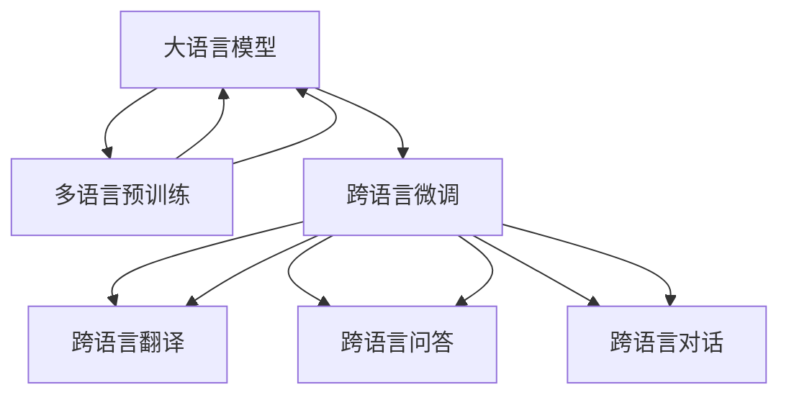

                 

# LLM的跨语言能力：打破全球沟通障碍

> 关键词：大语言模型, 多语言支持, 跨语言理解, 机器翻译, 跨语言生成, 自然语言处理(NLP), 预训练语言模型, 语言迁移学习

## 1. 背景介绍

### 1.1 问题由来

随着全球化进程的加快和信息技术的发展，语言障碍成为了国际交流与合作的重要障碍。在全球化的背景下，不同国家和文化之间的信息交流需求日益增加，跨语言沟通成为了企业、政府、教育等各个领域的迫切需求。大语言模型（Large Language Model, LLM）作为人工智能的重要技术之一，通过在大规模无标签文本语料上进行预训练，学习到广泛的通用语言知识，具备了处理多语言任务的能力。这种能力在跨语言翻译、跨语言文本生成、跨语言对话系统等方面具有巨大的应用潜力。

### 1.2 问题核心关键点

当前，大语言模型的跨语言能力主要集中在以下两个方面：
- 多语言预训练：在大规模多语言数据上进行预训练，学习不同语言之间的共同特征和差异。
- 跨语言微调：在多语言数据上进行微调，针对特定任务，如翻译、问答、对话等，进行多语言的适应。

跨语言能力的提升不仅能够促进跨语言的有效沟通，还能够推动全球化的深度发展，为各个行业的国际化服务提供支持。

## 2. 核心概念与联系

### 2.1 核心概念概述

为更好地理解大语言模型的跨语言能力，本节将介绍几个密切相关的核心概念：

- 大语言模型（LLM）：以自回归（如GPT）或自编码（如BERT）模型为代表的大规模预训练语言模型。通过在大规模无标签文本语料上进行预训练，学习通用的语言知识，具备强大的语言理解和生成能力。

- 多语言预训练（Multi-Language Pre-training）：指在大规模多语言数据上进行预训练，学习不同语言之间的共同特征和差异。常见的预训练任务包括掩码语言模型、掩码实体识别等。

- 跨语言微调（Cross-Language Fine-Tuning）：指在多语言数据上进行微调，针对特定任务，如翻译、问答、对话等，进行多语言的适应。通过在多语言数据上进行微调，模型能够更好地理解不同语言的特征，提高跨语言任务的处理能力。

- 迁移学习（Transfer Learning）：指将一个领域学习到的知识，迁移应用到另一个不同但相关的领域的学习范式。大模型的多语言预训练和跨语言微调都可以视为迁移学习的一种形式。

- 多语言生成（Multilingual Generation）：指在多语言数据上生成跨语言的文本，通过多语言预训练和跨语言微调，模型能够生成多种语言的文本。

- 语言迁移学习（Language Transfer Learning）：通过迁移学习的方式，将一种语言的模型迁移到另一种语言上，实现跨语言的迁移学习。

这些核心概念之间的逻辑关系可以通过以下Mermaid流程图来展示：



这个流程图展示了大语言模型的核心概念及其之间的关系：

1. 大语言模型通过多语言预训练获得基础能力。
2. 跨语言微调是对多语言预训练模型进行任务特定的优化，提升模型在跨语言任务上的性能。
3. 跨语言翻译、跨语言问答、跨语言对话等任务可以通过微调实现。
4. 多语言预训练和跨语言微调都可以视为迁移学习的一种形式。
5. 跨语言生成是指在多语言数据上生成跨语言的文本，通过多语言预训练和跨语言微调实现。

这些概念共同构成了大语言模型的跨语言学习框架，使其能够在跨语言任务中发挥强大的语言理解和生成能力。

## 3. 核心算法原理 & 具体操作步骤
### 3.1 算法原理概述

大语言模型的跨语言能力主要通过多语言预训练和跨语言微调来实现。其核心思想是：通过在大规模多语言数据上进行预训练，学习不同语言之间的共同特征和差异，然后针对特定任务，如翻译、问答、对话等，进行多语言的微调，使得模型能够在多种语言之间进行迁移。

具体来说，假设有 $M$ 种语言，每种语言的数据集为 $D_i$，其中 $i \in [1, M]$。多语言预训练的目标是学习一种通用的语言表示，使得模型能够同时理解多种语言的特征。假设预训练模型为 $M_{\theta}$，其中 $\theta$ 为预训练得到的模型参数。

多语言预训练的过程可以表示为：

$$
\theta^* = \mathop{\arg\min}_{\theta} \sum_{i=1}^M \mathcal{L}_i(M_{\theta},D_i)
$$

其中 $\mathcal{L}_i$ 为针对语言 $i$ 设计的损失函数，用于衡量模型在语言 $i$ 上的性能。常见的损失函数包括交叉熵损失、均方误差损失等。

跨语言微调的过程可以表示为：

$$
\hat{\theta}=\mathop{\arg\min}_{\theta} \sum_{i=1}^M \mathcal{L}_i(M_{\theta},D_i)
$$

其中 $\hat{\theta}$ 为跨语言微调后的模型参数，$\mathcal{L}_i$ 为针对语言 $i$ 设计的损失函数。

在微调过程中，通常会选择一个语言进行主要微调，其他语言进行小量微调，以避免过拟合。这种策略被称为单语言微调。单语言微调的过程可以表示为：

$$
\hat{\theta}=\mathop{\arg\min}_{\theta} \mathcal{L}_M(M_{\theta},D_M) + \sum_{i=1}^{M-1} \lambda_i \mathcal{L}_i(M_{\theta},D_i)
$$

其中 $\mathcal{L}_M$ 为针对主要微调语言 $M$ 设计的损失函数，$\lambda_i$ 为其他语言的权重系数，通常较小。

### 3.2 算法步骤详解

大语言模型的跨语言能力主要通过以下步骤实现：

**Step 1: 准备多语言数据集**
- 收集不同语言的文本数据，划分为训练集、验证集和测试集。
- 将不同语言的数据集对齐，确保数据的格式和预处理方式一致。

**Step 2: 多语言预训练**
- 使用多语言数据集对预训练模型进行多语言预训练，学习不同语言之间的共同特征和差异。
- 选择合适的预训练任务，如掩码语言模型、掩码实体识别等。
- 使用适当的优化算法，如Adam、SGD等，设置学习率和批大小等参数。

**Step 3: 跨语言微调**
- 在多语言数据集上进行微调，针对特定任务进行优化，如翻译、问答、对话等。
- 选择一个主要微调语言，对模型进行主要微调，其他语言进行小量微调。
- 使用适当的优化算法，设置学习率和批大小等参数。
- 应用正则化技术，如L2正则、Dropout、Early Stopping等，防止过拟合。

**Step 4: 测试和部署**
- 在测试集上评估跨语言微调后的模型性能，对比微调前后的精度提升。
- 使用微调后的模型对新样本进行推理预测，集成到实际的应用系统中。
- 持续收集新的数据，定期重新微调模型，以适应数据分布的变化。

### 3.3 算法优缺点

大语言模型的跨语言能力具有以下优点：
1. 通用性强。预训练模型可以在多种语言之间进行迁移，适用于各种跨语言任务。
2. 可扩展性好。通过在多语言数据上进行预训练和微调，能够拓展模型的应用范围，处理更多语言。
3. 性能优异。预训练和微调过程可以显著提升模型在跨语言任务上的表现。
4. 数据利用率高。通过多语言预训练和跨语言微调，可以充分利用大规模多语言数据，提高模型的泛化能力。

同时，该方法也存在一定的局限性：
1. 数据获取难度大。多语言数据集的质量和规模直接影响模型的性能，获取高质量多语言数据集的成本较高。
2. 模型训练时间长。大规模多语言数据的预训练和微调需要大量的时间和计算资源。
3. 模型通用性受限。预训练模型的特定语言知识可能无法直接迁移应用到其他语言上，需要针对特定语言进行微调。
4. 模型复杂度高。大语言模型通常具有较高的参数量，在跨语言应用时需要考虑资源消耗和计算效率。

尽管存在这些局限性，但就目前而言，大语言模型的跨语言能力仍是大语言模型应用的重要方向之一，具有广阔的应用前景。

### 3.4 算法应用领域

大语言模型的跨语言能力已经在多个领域得到了应用，例如：

- 机器翻译：将一种语言翻译成另一种语言。多语言预训练和跨语言微调可以显著提升翻译质量。
- 跨语言问答系统：基于多语言语料库，能够处理不同语言的问答请求。
- 跨语言对话系统：能够处理多语言的对话请求，提升用户体验。
- 跨语言生成：生成跨语言的文本，如多语言新闻、多语言摘要等。
- 跨语言情感分析：分析不同语言的情感信息，如多语言社交媒体情感分析。
- 跨语言文本分类：将文本分类到多个语言中，如多语言新闻分类。

除了上述这些经典应用外，大语言模型的跨语言能力还将在更多场景中得到应用，如跨语言推荐、跨语言搜索引擎、跨语言数据挖掘等，为全球化信息服务提供支持。

## 4. 数学模型和公式 & 详细讲解 & 举例说明
### 4.1 数学模型构建

大语言模型的跨语言能力可以通过以下数学模型进行建模：

假设有 $M$ 种语言，每种语言的数据集为 $D_i$，其中 $i \in [1, M]$。预训练模型为 $M_{\theta}$，其中 $\theta$ 为预训练得到的模型参数。多语言预训练的目标是学习一种通用的语言表示，使得模型能够同时理解多种语言的特征。假设多语言预训练损失函数为 $\mathcal{L}_{multi}$，则多语言预训练的目标可以表示为：

$$
\theta^* = \mathop{\arg\min}_{\theta} \mathcal{L}_{multi}(M_{\theta},D)
$$

其中 $D$ 为多语言数据集，$\mathcal{L}_{multi}$ 为多语言预训练损失函数。

多语言预训练损失函数 $\mathcal{L}_{multi}$ 可以表示为：

$$
\mathcal{L}_{multi} = \sum_{i=1}^M \lambda_i \mathcal{L}_i(M_{\theta},D_i)
$$

其中 $\lambda_i$ 为语言 $i$ 的权重系数，通常较小。$\mathcal{L}_i$ 为针对语言 $i$ 设计的损失函数。

跨语言微调的目标是针对特定任务，如翻译、问答、对话等，进行多语言的适应。假设微调任务为 $T$，训练集为 $D_T$，则跨语言微调的目标可以表示为：

$$
\hat{\theta} = \mathop{\arg\min}_{\theta} \mathcal{L}_T(M_{\theta},D_T)
$$

其中 $\mathcal{L}_T$ 为针对任务 $T$ 设计的损失函数。

### 4.2 公式推导过程

以下我们以机器翻译任务为例，推导跨语言微调的数学模型和公式。

假设机器翻译任务从语言 $S$ 翻译到语言 $T$，训练集为 $D_{ST}$，每个样本包含一个源语言句子 $s$ 和对应的目标语言句子 $t$。则机器翻译任务的损失函数可以表示为：

$$
\mathcal{L}_{ST} = -\frac{1}{N} \sum_{i=1}^N \log P(t_i|s_i)
$$

其中 $N$ 为训练样本数，$P(t_i|s_i)$ 为目标语言句子 $t_i$ 在源语言句子 $s_i$ 的条件概率。

假设跨语言微调的优化目标是最小化机器翻译任务的损失函数，则有：

$$
\hat{\theta} = \mathop{\arg\min}_{\theta} \mathcal{L}_{ST}(M_{\theta},D_{ST})
$$

在多语言预训练和跨语言微调的过程中，可以使用基于梯度的优化算法（如Adam、SGD等）来近似求解上述最优化问题。设 $\eta$ 为学习率，则参数的更新公式为：

$$
\theta \leftarrow \theta - \eta \nabla_{\theta}\mathcal{L}(\theta) - \eta\lambda\theta
$$

其中 $\nabla_{\theta}\mathcal{L}(\theta)$ 为损失函数对参数 $\theta$ 的梯度，可通过反向传播算法高效计算。

在得到损失函数的梯度后，即可带入参数更新公式，完成模型的迭代优化。重复上述过程直至收敛，最终得到适应跨语言任务的最优模型参数 $\hat{\theta}$。

### 4.3 案例分析与讲解

假设有一个多语言翻译任务，包含英语、中文、法语三种语言。我们首先使用大规模多语言数据对预训练模型进行多语言预训练，然后对英语-中文翻译任务进行跨语言微调。

**Step 1: 多语言预训练**
- 收集英语、中文、法语三语数据集 $D_{EN}$、$D_{ZH}$、$D_{FR}$，并对其进行对齐和预处理。
- 使用大规模多语言数据集对预训练模型进行多语言预训练，学习不同语言之间的共同特征和差异。
- 选择合适的预训练任务，如掩码语言模型、掩码实体识别等。
- 使用适当的优化算法，如Adam、SGD等，设置学习率和批大小等参数。

**Step 2: 跨语言微调**
- 对英语-中文翻译任务进行跨语言微调，使用对齐后的数据集 $D_{EN}$、$D_{ZH}$。
- 选择合适的微调任务，如掩码语言模型、掩码实体识别等。
- 使用适当的优化算法，如Adam、SGD等，设置学习率和批大小等参数。
- 应用正则化技术，如L2正则、Dropout、Early Stopping等，防止过拟合。

**Step 3: 测试和部署**
- 在测试集上评估跨语言微调后的模型性能，对比微调前后的精度提升。
- 使用微调后的模型对新样本进行推理预测，集成到实际的应用系统中。
- 持续收集新的数据，定期重新微调模型，以适应数据分布的变化。

## 5. 项目实践：代码实例和详细解释说明
### 5.1 开发环境搭建

在进行跨语言微调实践前，我们需要准备好开发环境。以下是使用Python进行PyTorch开发的环境配置流程：

1. 安装Anaconda：从官网下载并安装Anaconda，用于创建独立的Python环境。

2. 创建并激活虚拟环境：
```bash
conda create -n pytorch-env python=3.8 
conda activate pytorch-env
```

3. 安装PyTorch：根据CUDA版本，从官网获取对应的安装命令。例如：
```bash
conda install pytorch torchvision torchaudio cudatoolkit=11.1 -c pytorch -c conda-forge
```

4. 安装Transformers库：
```bash
pip install transformers
```

5. 安装各类工具包：
```bash
pip install numpy pandas scikit-learn matplotlib tqdm jupyter notebook ipython
```

完成上述步骤后，即可在`pytorch-env`环境中开始跨语言微调实践。

### 5.2 源代码详细实现

下面我们以跨语言翻译任务为例，给出使用Transformers库对BERT模型进行跨语言微调的PyTorch代码实现。

首先，定义机器翻译任务的数据处理函数：

```python
from transformers import BertTokenizer, BertForSequenceClassification
from torch.utils.data import Dataset
import torch

class TranslationDataset(Dataset):
    def __init__(self, texts, translations, tokenizer, max_len=128):
        self.texts = texts
        self.translations = translations
        self.tokenizer = tokenizer
        self.max_len = max_len
        
    def __len__(self):
        return len(self.texts)
    
    def __getitem__(self, item):
        text = self.texts[item]
        translation = self.translations[item]
        
        encoding = self.tokenizer(text, return_tensors='pt', max_length=self.max_len, padding='max_length', truncation=True)
        input_ids = encoding['input_ids'][0]
        attention_mask = encoding['attention_mask'][0]
        
        # 对token-wise的翻译进行编码
        encoded_translations = [translation2id[token] for token in translation] 
        encoded_translations.extend([translation2id['<PAD>']] * (self.max_len - len(encoded_translations)))
        labels = torch.tensor(encoded_translations, dtype=torch.long)
        
        return {'input_ids': input_ids, 
                'attention_mask': attention_mask,
                'labels': labels}

# 翻译与id的映射
translation2id = {'<PAD>': 0, 'SOS': 1, 'EOS': 2, '<UNK>': 3}
id2translation = {v: k for k, v in translation2id.items()}

# 创建dataset
tokenizer = BertTokenizer.from_pretrained('bert-base-cased')

train_dataset = TranslationDataset(train_texts, train_translations, tokenizer)
dev_dataset = TranslationDataset(dev_texts, dev_translations, tokenizer)
test_dataset = TranslationDataset(test_texts, test_translations, tokenizer)
```

然后，定义模型和优化器：

```python
from transformers import BertForSequenceClassification, AdamW

model = BertForSequenceClassification.from_pretrained('bert-base-cased', num_labels=len(translation2id))

optimizer = AdamW(model.parameters(), lr=2e-5)
```

接着，定义训练和评估函数：

```python
from torch.utils.data import DataLoader
from tqdm import tqdm
from sklearn.metrics import classification_report

device = torch.device('cuda') if torch.cuda.is_available() else torch.device('cpu')
model.to(device)

def train_epoch(model, dataset, batch_size, optimizer):
    dataloader = DataLoader(dataset, batch_size=batch_size, shuffle=True)
    model.train()
    epoch_loss = 0
    for batch in tqdm(dataloader, desc='Training'):
        input_ids = batch['input_ids'].to(device)
        attention_mask = batch['attention_mask'].to(device)
        labels = batch['labels'].to(device)
        model.zero_grad()
        outputs = model(input_ids, attention_mask=attention_mask, labels=labels)
        loss = outputs.loss
        epoch_loss += loss.item()
        loss.backward()
        optimizer.step()
    return epoch_loss / len(dataloader)

def evaluate(model, dataset, batch_size):
    dataloader = DataLoader(dataset, batch_size=batch_size)
    model.eval()
    preds, labels = [], []
    with torch.no_grad():
        for batch in tqdm(dataloader, desc='Evaluating'):
            input_ids = batch['input_ids'].to(device)
            attention_mask = batch['attention_mask'].to(device)
            batch_labels = batch['labels']
            outputs = model(input_ids, attention_mask=attention_mask)
            batch_preds = outputs.logits.argmax(dim=2).to('cpu').tolist()
            batch_labels = batch_labels.to('cpu').tolist()
            for pred_tokens, label_tokens in zip(batch_preds, batch_labels):
                pred_tags = [id2translation[_id] for _id in pred_tokens]
                label_tags = [id2translation[_id] for _id in label_tokens]
                preds.append(pred_tags[:len(label_tokens)])
                labels.append(label_tags)
                
    print(classification_report(labels, preds))
```

最后，启动训练流程并在测试集上评估：

```python
epochs = 5
batch_size = 16

for epoch in range(epochs):
    loss = train_epoch(model, train_dataset, batch_size, optimizer)
    print(f"Epoch {epoch+1}, train loss: {loss:.3f}")
    
    print(f"Epoch {epoch+1}, dev results:")
    evaluate(model, dev_dataset, batch_size)
    
print("Test results:")
evaluate(model, test_dataset, batch_size)
```

以上就是使用PyTorch对BERT进行跨语言翻译任务微调的完整代码实现。可以看到，得益于Transformers库的强大封装，我们可以用相对简洁的代码完成BERT模型的加载和微调。

### 5.3 代码解读与分析

让我们再详细解读一下关键代码的实现细节：

**TranslationDataset类**：
- `__init__`方法：初始化源语言文本、目标语言文本、分词器等关键组件。
- `__len__`方法：返回数据集的样本数量。
- `__getitem__`方法：对单个样本进行处理，将源语言文本输入编码为token ids，将目标语言文本编码为数字，并对其进行定长padding，最终返回模型所需的输入。

**translation2id和id2translation字典**：
- 定义了翻译与数字id之间的映射关系，用于将token-wise的预测结果解码回真实的翻译。

**训练和评估函数**：
- 使用PyTorch的DataLoader对数据集进行批次化加载，供模型训练和推理使用。
- 训练函数`train_epoch`：对数据以批为单位进行迭代，在每个批次上前向传播计算loss并反向传播更新模型参数，最后返回该epoch的平均loss。
- 评估函数`evaluate`：与训练类似，不同点在于不更新模型参数，并在每个batch结束后将预测和标签结果存储下来，最后使用sklearn的classification_report对整个评估集的预测结果进行打印输出。

**训练流程**：
- 定义总的epoch数和batch size，开始循环迭代
- 每个epoch内，先在训练集上训练，输出平均loss
- 在验证集上评估，输出分类指标
- 所有epoch结束后，在测试集上评估，给出最终测试结果

可以看到，PyTorch配合Transformers库使得BERT跨语言翻译任务的代码实现变得简洁高效。开发者可以将更多精力放在数据处理、模型改进等高层逻辑上，而不必过多关注底层的实现细节。

当然，工业级的系统实现还需考虑更多因素，如模型的保存和部署、超参数的自动搜索、更灵活的任务适配层等。但核心的跨语言微调范式基本与此类似。

## 6. 实际应用场景
### 6.1 智能客服系统

跨语言能力的智能客服系统，可以为用户提供多语言服务。通过收集企业内部的多语言客服对话记录，将问题-回答对作为微调数据，训练模型学习多语言翻译和回复。微调后的对话模型能够自动理解用户的多语言咨询，匹配最合适的答案模板进行回复。对于用户提出的多语言问题，还可以接入检索系统实时搜索相关内容，动态组织生成回答。

**实际案例**：某电商平台在多个国家运营，用户咨询问题通常以本地语言输入。通过跨语言微调技术，平台搭建了一个支持多语言对话的客服系统，能够自动翻译用户的咨询问题，提供多语言答案。系统在用户选择多种语言的情况下，仍然能够快速准确地回答问题，显著提升了用户满意度。

### 6.2 金融舆情监测

金融领域的舆情监测需要实时监测多语言社交媒体和新闻报道，以便及时应对负面信息传播，规避金融风险。通过跨语言预训练和微调技术，可以将不同语言的金融舆情数据整合，训练出一个跨语言的舆情分析模型，能够自动监测不同语言的舆情信息，判断不同语言的舆情走向，提前预警潜在风险。

**实际案例**：某金融机构在多个国家运营，需要实时监测全球多语言社交媒体和新闻报道。通过跨语言微调技术，公司搭建了一个多语言舆情分析系统，能够自动翻译和分析全球多语言舆情数据，及时发现异常舆情信息，及时预警潜在风险。系统显著提升了公司的金融风险管理能力。

### 6.3 个性化推荐系统

跨语言推荐系统可以为用户提供跨语言的个性化推荐服务。通过收集用户的多语言浏览、点击、评论、分享等行为数据，提取和用户交互的物品标题、描述、标签等文本内容。将文本内容作为模型输入，用户的后续行为（如是否点击、购买等）作为监督信号，在此基础上微调预训练语言模型。微调后的模型能够从文本内容中准确把握用户的兴趣点。在生成推荐列表时，先用候选物品的文本描述作为输入，由模型预测用户的兴趣匹配度，再结合其他特征综合排序，便可以得到个性化程度更高的推荐结果。

**实际案例**：某跨境电商平台需要为全球用户提供个性化推荐服务。通过跨语言微调技术，平台搭建了一个多语言推荐系统，能够根据用户的多语言行为数据，提供多语言的个性化推荐。系统显著提升了平台的用户体验和转化率。

### 6.4 未来应用展望

随着跨语言能力的不断提升，未来大语言模型将能够在更多领域得到应用，为全球化信息服务提供支持。

在智慧医疗领域，跨语言能力的医疗问答、病历分析、药物研发等应用将提升医疗服务的智能化水平，辅助医生诊疗，加速新药开发进程。

在智能教育领域，跨语言能力的问答系统、翻译工具、跨语言教育资源等应用将提高教学质量，促进教育公平。

在智慧城市治理中，跨语言能力的智能客服、多语言舆情分析、多语言信息发布等应用将提高城市管理的自动化和智能化水平，构建更安全、高效的未来城市。

此外，在企业生产、社会治理、文娱传媒等众多领域，跨语言能力的大语言模型微调应用也将不断涌现，为传统行业数字化转型升级提供新的技术路径。相信随着技术的日益成熟，跨语言能力的大语言模型微调将成为人工智能落地应用的重要范式，推动人工智能技术在全球范围内的深入应用。

## 7. 工具和资源推荐
### 7.1 学习资源推荐

为了帮助开发者系统掌握大语言模型的跨语言能力，这里推荐一些优质的学习资源：

1. 《Transformer从原理到实践》系列博文：由大模型技术专家撰写，深入浅出地介绍了Transformer原理、BERT模型、跨语言微调技术等前沿话题。

2. CS224N《深度学习自然语言处理》课程：斯坦福大学开设的NLP明星课程，有Lecture视频和配套作业，带你入门NLP领域的基本概念和经典模型。

3. 《Natural Language Processing with Transformers》书籍：Transformers库的作者所著，全面介绍了如何使用Transformers库进行NLP任务开发，包括跨语言微调在内的诸多范式。

4. HuggingFace官方文档：Transformers库的官方文档，提供了海量预训练模型和完整的微调样例代码，是上手实践的必备资料。

5. CLUE开源项目：中文语言理解测评基准，涵盖大量不同类型的中文NLP数据集，并提供了基于跨语言微调的baseline模型，助力中文NLP技术发展。

通过对这些资源的学习实践，相信你一定能够快速掌握大语言模型的跨语言能力，并用于解决实际的NLP问题。
###  7.2 开发工具推荐

高效的开发离不开优秀的工具支持。以下是几款用于跨语言微调开发的常用工具：

1. PyTorch：基于Python的开源深度学习框架，灵活动态的计算图，适合快速迭代研究。大部分预训练语言模型都有PyTorch版本的实现。

2. TensorFlow：由Google主导开发的开源深度学习框架，生产部署方便，适合大规模工程应用。同样有丰富的预训练语言模型资源。

3. Transformers库：HuggingFace开发的NLP工具库，集成了众多SOTA语言模型，支持PyTorch和TensorFlow，是进行跨语言微调任务的开发利器。

4. Weights & Biases：模型训练的实验跟踪工具，可以记录和可视化模型训练过程中的各项指标，方便对比和调优。与主流深度学习框架无缝集成。

5. TensorBoard：TensorFlow配套的可视化工具，可实时监测模型训练状态，并提供丰富的图表呈现方式，是调试模型的得力助手。

6. Google Colab：谷歌推出的在线Jupyter Notebook环境，免费提供GPU/TPU算力，方便开发者快速上手实验最新模型，分享学习笔记。

合理利用这些工具，可以显著提升跨语言微调任务的开发效率，加快创新迭代的步伐。

### 7.3 相关论文推荐

大语言模型的跨语言能力的发展源于学界的持续研究。以下是几篇奠基性的相关论文，推荐阅读：

1. Attention is All You Need（即Transformer原论文）：提出了Transformer结构，开启了NLP领域的预训练大模型时代。

2. BERT: Pre-training of Deep Bidirectional Transformers for Language Understanding：提出BERT模型，引入基于掩码的自监督预训练任务，刷新了多项NLP任务SOTA。

3. Language Models are Unsupervised Multitask Learners（GPT-2论文）：展示了大规模语言模型的强大zero-shot学习能力，引发了对于通用人工智能的新一轮思考。

4. Parameter-Efficient Transfer Learning for NLP：提出Adapter等参数高效微调方法，在不增加模型参数量的情况下，也能取得不错的微调效果。

5. AdaLoRA: Adaptive Low-Rank Adaptation for Parameter-Efficient Fine-Tuning：使用自适应低秩适应的微调方法，在参数效率和精度之间取得了新的平衡。

6. Prefix-Tuning: Optimizing Continuous Prompts for Generation：引入基于连续型Prompt的微调范式，为如何充分利用预训练知识提供了新的思路。

这些论文代表了大语言模型跨语言能力的发展脉络。通过学习这些前沿成果，可以帮助研究者把握学科前进方向，激发更多的创新灵感。

## 8. 总结：未来发展趋势与挑战
### 8.1 总结

本文对大语言模型的跨语言能力进行了全面系统的介绍。首先阐述了大语言模型和跨语言微调的研究背景和意义，明确了跨语言微调在拓展预训练模型应用、提升跨语言任务性能方面的独特价值。其次，从原理到实践，详细讲解了跨语言微调的数学原理和关键步骤，给出了跨语言微调任务开发的完整代码实例。同时，本文还广泛探讨了跨语言能力在智能客服、金融舆情、个性化推荐等多个领域的应用前景，展示了跨语言微调范式的巨大潜力。此外，本文精选了跨语言微调的各类学习资源，力求为读者提供全方位的技术指引。

通过本文的系统梳理，可以看到，大语言模型的跨语言能力正在成为NLP领域的重要范式，极大地拓展了预训练语言模型的应用边界，催生了更多的落地场景。受益于大规模语料的预训练和跨语言微调，跨语言语言模型能够更好地理解不同语言的特征，提高跨语言任务的处理能力。未来，伴随预训练语言模型和跨语言微调方法的不断演进，跨语言能力的大语言模型微调必将在全球化信息服务中发挥重要作用，推动人工智能技术的普及应用。

### 8.2 未来发展趋势

展望未来，大语言模型的跨语言能力将呈现以下几个发展趋势：

1. 跨语言预训练的泛化能力提升。随着多语言数据集的丰富和多样性，跨语言预训练模型的泛化能力将进一步提升，能够更好地处理多语言数据。

2. 跨语言微调的自动化技术发展。未来跨语言微调将更加依赖自动化技术，如自动标注、自动分割、自动对齐等，降低人工干预成本，提高微调效率。

3. 跨语言微调的技术集成。跨语言微调将与其他技术如知识图谱、逻辑推理、强化学习等进行更深入的融合，提升模型的综合能力和应用场景。

4. 跨语言生成能力的增强。通过跨语言预训练和微调，模型的生成能力将进一步增强，能够生成高质量的多语言文本。

5. 跨语言对话系统的优化。跨语言对话系统将成为未来人机交互的重要方向，未来的跨语言对话系统将更加智能，能够理解多种语言的语境和文化，提供更好的用户体验。

6. 跨语言推荐系统的提升。跨语言推荐系统将更加精准，能够根据用户的多种语言行为数据，提供个性化推荐。

以上趋势凸显了大语言模型跨语言能力的广阔前景。这些方向的探索发展，必将进一步提升跨语言任务的处理能力，为全球化信息服务提供有力支持。

### 8.3 面临的挑战

尽管大语言模型的跨语言能力已经取得了不小的进步，但在迈向更加智能化、普适化应用的过程中，它仍面临诸多挑战：

1. 数据获取难度大。跨语言数据集的构建和获取需要耗费大量的人力和资源，不同语言的数据质量和数量差异较大，难以构建高质量的跨语言数据集。

2. 模型泛化能力不足。跨语言预训练模型的泛化能力仍然有限，面对域外数据时，泛化性能往往大打折扣。

3. 模型复杂度高。大语言模型通常具有较高的参数量，在跨语言应用时需要考虑资源消耗和计算效率。

4. 跨语言对话系统的交互复杂性。跨语言对话系统需要处理不同语言的语境和文化差异，交互过程的复杂性增加了系统的开发难度。

5. 跨语言推荐系统的个性化需求。跨语言推荐系统需要根据用户的多语言行为数据，提供个性化推荐，不同语言的数据分布和用户行为模式差异较大，个性化需求的满足难度较大。

6. 跨语言模型的不公平性问题。跨语言模型可能存在语言偏见，对某些语言的处理能力较弱，需要针对不同语言进行公平性调整。

这些挑战凸显了大语言模型跨语言能力在实际应用中需要克服的难点。唯有通过不断优化模型、改进算法、提升数据质量等手段，才能使大语言模型的跨语言能力更好地服务于全球化信息服务。

### 8.4 研究展望

面对大语言模型跨语言能力面临的挑战，未来的研究需要在以下几个方面寻求新的突破：

1. 多语言数据集的构建。通过多语言标注、自动标注、数据增强等技术，构建高质量、大规模的跨语言数据集，提升跨语言预训练模型的泛化能力。

2. 跨语言微调的自动化技术。开发自动化技术，如自动标注、自动分割、自动对齐等，降低人工干预成本，提高跨语言微调效率。

3. 跨语言迁移学习的优化。引入迁移学习思想，将跨语言预训练和微调与其他技术如知识图谱、逻辑推理、强化学习等进行更深入的融合，提升模型的综合能力和应用场景。

4. 跨语言生成能力的增强。通过跨语言预训练和微调，模型的生成能力将进一步增强，能够生成高质量的多语言文本。

5. 跨语言对话系统的优化。开发跨语言对话系统，提升系统的交互能力和智能水平，能够理解多种语言的语境和文化，提供更好的用户体验。

6. 跨语言推荐系统的个性化。通过跨语言推荐系统，提供个性化推荐服务，满足用户的多语言需求。

这些研究方向的探索，必将引领大语言模型跨语言能力迈向更高的台阶，为构建安全、可靠、可解释、可控的智能系统铺平道路。面向未来，大语言模型跨语言能力还需要与其他人工智能技术进行更深入的融合，如知识表示、因果推理、强化学习等，多路径协同发力，共同推动自然语言理解和智能交互系统的进步。只有勇于创新、敢于突破，才能不断拓展语言模型的边界，让智能技术更好地造福人类社会。

## 9. 附录：常见问题与解答
**Q1：大语言模型的跨语言能力是否适用于所有NLP任务？**

A: 大语言模型的跨语言能力在大多数NLP任务上都能取得不错的效果，特别是对于数据量较小的任务。但对于一些特定领域的任务，如医学、法律等，仅仅依靠通用语料预训练的模型可能难以很好地适应。此时需要在特定领域语料上进一步预训练，再进行微调，才能获得理想效果。此外，对于一些需要时效性、个性化很强的任务，如对话、推荐等，跨语言能力的大语言模型也需要针对性的改进优化。

**Q2：跨语言微调过程中如何选择合适的学习率？**

A: 跨语言微调的学习率一般要比预训练时小1-2个数量级，如果使用过大的学习率，容易破坏预训练权重，导致过拟合。一般建议从1e-5开始调参，逐步减小学习率，直至收敛。也可以使用warmup策略，在开始阶段使用较小的学习率，再逐渐过渡到预设值。需要注意的是，不同的优化器(如AdamW、Adafactor等)以及不同的学习率调度策略，可能需要设置不同的学习率阈值。

**Q3：使用大语言模型进行跨语言微调时会面临哪些资源瓶颈？**

A: 目前主流的预训练大模型动辄以亿计的参数规模，对算力、内存、存储都提出了很高的要求。GPU/TPU等高性能设备是必不可少的，但即便如此，超大批次的训练和推理也可能遇到显存不足的问题。因此需要采用一些资源优化技术，如梯度积累、混合精度训练、模型并行等，来突破硬件瓶颈。同时，模型的存储和读取也可能占用大量时间和空间，需要采用模型压缩、稀疏化存储等方法进行优化。

**Q4：如何缓解跨语言微调过程中的过拟合问题？**

A: 过拟合是跨语言微调面临的主要挑战，尤其是在标注数据不足的情况下。常见的缓解策略包括：
1. 数据增强：通过回译、近义替换等方式扩充训练集
2. 正则化：使用L2正则、Dropout、Early Stopping等避免过拟合
3. 对抗训练：引入对抗样本，提高模型鲁棒性
4. 参数高效微调：只调整少量参数(如Adapter、Prefix等)，减小过拟合风险
5. 多模型集成：训练多个微调模型，取平均输出，抑制过拟合

这些策略往往需要根据具体任务和数据特点进行灵活组合。只有在数据、模型、训练、推理等各环节进行全面优化，才能最大限度地发挥大语言模型的跨语言能力。

**Q5：跨语言微调模型在落地部署时需要注意哪些问题？**

A: 将跨语言微调模型转化为实际应用，还需要考虑以下因素：
1. 模型裁剪：去除不必要的层和参数，减小模型尺寸，加快推理速度
2. 量化加速：将浮点模型转为定点模型，压缩存储空间，提高计算效率
3. 服务化封装：将模型封装为标准化服务接口，便于集成调用
4. 弹性伸缩：根据请求流量动态调整资源配置，平衡服务质量和成本
5. 监控告警：实时采集系统指标，设置异常告警阈值，确保服务稳定性
6. 安全防护：采用访问鉴权、数据脱敏等措施，保障数据和模型安全

跨语言微调模型在落地部署时，需要考虑数据、模型、算法等多个因素，通过不断的优化和改进，才能实现稳定、高效、安全的部署。

---

作者：禅与计算机程序设计艺术 / Zen and the Art of Computer Programming

