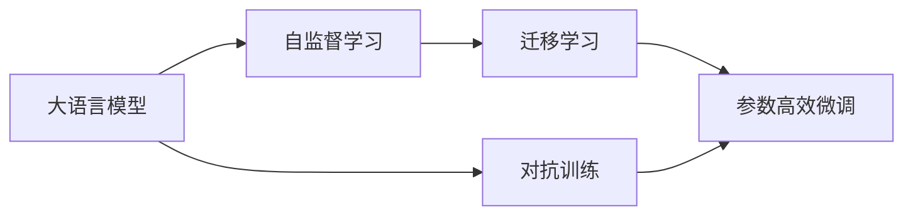
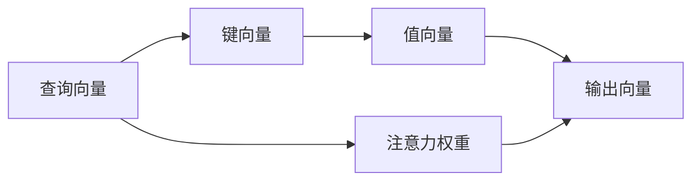

                 

# LLM系统内核：新一代AI的中枢

## 1. 背景介绍

### 1.1 问题由来

随着人工智能技术的迅速发展，大语言模型（Large Language Model，简称LLM）成为了AI领域的研究热点。LLM系统凭借其强大的语言理解和生成能力，在自然语言处理（Natural Language Processing，NLP）、机器翻译、对话系统等领域取得了显著的进展。但是，构建一个有效的LLM系统并不容易。从数据准备、模型训练到系统优化，每一个环节都需要精心设计和管理。因此，构建一个性能优异的LLM系统需要深入理解LLM的内核机制，掌握从数据处理到模型优化的一整套流程。

### 1.2 问题核心关键点

一个成功的LLM系统内核需要具备以下几个核心关键点：

- **数据准备**：如何高效地收集、处理和标注数据，是构建LLM系统的基础。
- **模型训练**：如何选择合适的模型架构，设计合理的训练流程，优化模型参数，是提高LLM性能的关键。
- **系统优化**：如何对LLM系统进行调优，提升运行效率，增强鲁棒性，是实现高性能LLM应用的保障。

本文将详细介绍大语言模型内核的构建方法，从数据准备、模型训练到系统优化，全面展示LLM系统的核心技术。

## 2. 核心概念与联系

### 2.1 核心概念概述

在构建LLM系统内核时，需要理解以下核心概念：

- **大语言模型（LLM）**：一种基于深度学习的语言模型，能够自动学习语言知识和规律，并生成高质量的自然语言文本。
- **Transformer模型**：一种基于自注意力机制的神经网络模型，广泛应用于NLP任务中。
- **自监督学习（SSL）**：一种无需标注数据即可进行模型训练的学习方式，通过预训练语言模型获得通用语言表示。
- **迁移学习（TL）**：将模型在某个任务上学习到的知识迁移到另一个任务上，以减少训练时间和标注成本。
- **参数高效微调（PEFT）**：只更新少量模型参数进行微调，减少过拟合风险，提升模型效率。
- **对抗训练（AD）**：通过对抗样本训练模型，提升模型鲁棒性和泛化能力。

这些概念之间的关系可以通过以下Mermaid流程图来展示：



### 2.2 核心概念原理和架构

#### 2.2.1 Transformer模型

Transformer模型是LLM系统内核的核心组成部分。它由编码器和解码器两部分组成，其中编码器用于提取输入文本的特征表示，解码器用于生成目标文本。Transformer模型通过自注意力机制，能够自动学习输入文本中的长距离依赖关系，具有很好的语言建模能力。

Transformer模型的结构如图1所示：


#### 2.2.2 自监督学习

自监督学习是LLM系统内核中重要的预训练方法。通过在大规模无标签文本数据上进行预训练，模型可以学习到语言的通用表示，从而在微调时能够更快地适应新的任务。常见的自监督学习任务包括语言建模、掩码语言模型等。

语言建模任务是指给定一个文本序列，预测下一个单词的概率分布。掩码语言模型任务则是在文本中随机屏蔽部分单词，让模型预测被屏蔽的单词。


#### 2.2.3 迁移学习

迁移学习是将模型在某个任务上学习到的知识迁移到另一个任务上。在LLM系统中，通常先进行自监督学习预训练，然后在特定任务上进行微调，以提高模型在该任务上的性能。


#### 2.2.4 参数高效微调

参数高效微调是指在微调过程中只更新少量模型参数，以减少过拟合风险，提升模型效率。在LLM系统中，通常只微调顶层部分，而保留底层的预训练权重不变。


#### 2.2.5 对抗训练

对抗训练是指在训练过程中加入对抗样本，提高模型的鲁棒性和泛化能力。在LLM系统中，对抗训练可以帮助模型更好地识别和处理攻击性文本，提高模型的鲁棒性。


### 2.3 核心概念之间的联系

以上概念之间相互关联，共同构成了LLM系统内核的核心技术体系。自监督学习预训练为模型提供了通用的语言表示，迁移学习使得模型能够适应不同的任务，参数高效微调和对抗训练则进一步提升了模型的鲁棒性和泛化能力。

## 3. 核心算法原理 & 具体操作步骤

### 3.1 算法原理概述

LLM系统内核的构建过程可以分为以下几个步骤：

1. **数据准备**：收集和标注大规模无标签文本数据，进行预处理和清洗。
2. **模型训练**：使用自监督学习任务对模型进行预训练，获得通用语言表示。
3. **微调优化**：在特定任务上对预训练模型进行微调，提升模型在该任务上的性能。
4. **系统优化**：对微调后的模型进行调优，提升运行效率和鲁棒性。

### 3.2 算法步骤详解

#### 3.2.1 数据准备

数据准备是构建LLM系统的第一步，主要包括以下几个方面：

1. **数据收集**：收集大规模无标签文本数据，包括维基百科、新闻文章、小说等。
2. **数据清洗**：去除噪声数据，如HTML标签、乱码等。
3. **数据预处理**：将文本数据转换为模型所需的输入格式，包括分词、标准化等。

#### 3.2.2 模型训练

模型训练过程包括以下几个步骤：

1. **模型选择**：选择合适的预训练模型架构，如BERT、GPT等。
2. **预训练任务**：选择适当的自监督学习任务，如语言建模、掩码语言模型等。
3. **预训练流程**：使用大规模无标签数据进行预训练，获得通用语言表示。

#### 3.2.3 微调优化

微调优化的过程包括以下几个步骤：

1. **任务适配**：根据具体任务，设计合适的输出层和损失函数。
2. **微调超参数设置**：选择合适的优化算法、学习率、批大小等超参数。
3. **模型微调**：使用少量标注数据对预训练模型进行微调，提升模型在该任务上的性能。

#### 3.2.4 系统优化

系统优化的过程包括以下几个步骤：

1. **模型裁剪**：去除不必要的层和参数，减小模型尺寸，加快推理速度。
2. **量化加速**：将浮点模型转为定点模型，压缩存储空间，提高计算效率。
3. **服务化封装**：将模型封装为标准化服务接口，便于集成调用。
4. **弹性伸缩**：根据请求流量动态调整资源配置，平衡服务质量和成本。
5. **监控告警**：实时采集系统指标，设置异常告警阈值，确保服务稳定性。
6. **安全防护**：采用访问鉴权、数据脱敏等措施，保障数据和模型安全。

### 3.3 算法优缺点

LLM系统内核具有以下优点：

1. **高效性**：通过预训练和微调，能够快速适应新的任务，减少训练时间和标注成本。
2. **通用性**：适用于多种NLP任务，包括文本分类、机器翻译、对话系统等。
3. **鲁棒性**：通过对抗训练等方法，提升模型的鲁棒性和泛化能力。
4. **灵活性**：通过参数高效微调等方法，提升模型的效率和灵活性。

同时，LLM系统内核也存在一些缺点：

1. **数据依赖**：对标注数据和训练数据的质量和数量依赖较大。
2. **模型复杂性**：预训练和微调过程中，模型参数量较大，需要较高的计算资源。
3. **过拟合风险**：微调过程中，容易过拟合少量标注数据，导致泛化能力不足。

### 3.4 算法应用领域

LLM系统内核在以下几个领域中得到了广泛应用：

1. **自然语言处理（NLP）**：包括文本分类、命名实体识别、关系抽取等任务。
2. **机器翻译**：将一种语言的文本翻译成另一种语言。
3. **对话系统**：构建智能对话机器人，能够自然地与用户进行交互。
4. **信息检索**：构建搜索引擎，能够快速定位和返回相关信息。
5. **自然语言生成**：生成高质量的自然语言文本，如新闻报道、小说等。

## 4. 数学模型和公式 & 详细讲解 & 举例说明

### 4.1 数学模型构建

在LLM系统中，通常使用Transformer模型作为基本组件。假设模型为$M_{\theta}$，输入为$x$，输出为$y$。模型的损失函数为：

$$
\mathcal{L}(\theta) = -\frac{1}{N}\sum_{i=1}^N \log p(y_i|x_i)
$$

其中$p(y_i|x_i)$为模型在输入$x_i$下输出$y_i$的概率。

### 4.2 公式推导过程

Transformer模型的自注意力机制如图2所示：




假设查询向量为$q$，键向量为$k$，值向量为$v$，注意力权重为$attn$，则注意力机制的计算公式为：

$$
attn(q,k,v) = \frac{\exp(s(q,k))}{\sum_{i=1}^N \exp(s(q,k_i))} v_i
$$

其中$s(q,k)$为注意力函数，通常使用点积函数。注意力函数计算公式为：

$$
s(q,k) = \frac{q \cdot k}{\sqrt{d_k}}
$$

其中$d_k$为键向量的维度。

### 4.3 案例分析与讲解

以BERT模型为例，BERT使用掩码语言模型进行预训练。给定一个文本序列$X$，其中某些单词被随机屏蔽，模型需要预测被屏蔽的单词。假设屏蔽的单词为$x_1,x_2,\cdots,x_n$，则掩码语言模型的计算公式为：

$$
L_{MLM}(X) = -\frac{1}{N}\sum_{i=1}^N \log p(x_i|X)
$$

其中$p(x_i|X)$为模型在文本$X$下预测单词$x_i$的概率。

## 5. 项目实践：代码实例和详细解释说明

### 5.1 开发环境搭建

在搭建开发环境时，需要安装以下工具和库：

1. **Python**：推荐使用3.8或更高版本。
2. **PyTorch**：用于深度学习模型的构建和训练。
3. **Transformer库**：用于实现Transformer模型。
4. **TensorBoard**：用于可视化模型的训练过程。

```bash
pip install torch transformers tensorboard
```

### 5.2 源代码详细实现

以BERT模型为例，以下是构建BERT模型的代码实现：

```python
from transformers import BertTokenizer, BertForMaskedLM
import torch

# 定义tokenizer和模型
tokenizer = BertTokenizer.from_pretrained('bert-base-uncased')
model = BertForMaskedLM.from_pretrained('bert-base-uncased')

# 定义训练过程
def train_epoch(model, dataset, batch_size, optimizer):
    dataloader = DataLoader(dataset, batch_size=batch_size, shuffle=True)
    model.train()
    epoch_loss = 0
    for batch in dataloader:
        input_ids = batch['input_ids'].to(device)
        attention_mask = batch['attention_mask'].to(device)
        labels = batch['labels'].to(device)
        model.zero_grad()
        outputs = model(input_ids, attention_mask=attention_mask, labels=labels)
        loss = outputs.loss
        epoch_loss += loss.item()
        loss.backward()
        optimizer.step()
    return epoch_loss / len(dataloader)

# 定义评估过程
def evaluate(model, dataset, batch_size):
    dataloader = DataLoader(dataset, batch_size=batch_size)
    model.eval()
    preds, labels = [], []
    with torch.no_grad():
        for batch in dataloader:
            input_ids = batch['input_ids'].to(device)
            attention_mask = batch['attention_mask'].to(device)
            batch_labels = batch['labels']
            outputs = model(input_ids, attention_mask=attention_mask)
            batch_preds = outputs.logits.argmax(dim=2).to('cpu').tolist()
            batch_labels = batch_labels.to('cpu').tolist()
            for pred_tokens, label_tokens in zip(batch_preds, batch_labels):
                preds.append(pred_tokens[:len(label_tokens)])
                labels.append(label_tokens)
    return preds, labels

# 训练和评估过程
epochs = 5
batch_size = 16
device = torch.device('cuda') if torch.cuda.is_available() else torch.device('cpu')

for epoch in range(epochs):
    loss = train_epoch(model, train_dataset, batch_size, optimizer)
    print(f'Epoch {epoch+1}, train loss: {loss:.3f}')

    print(f'Epoch {epoch+1}, dev results:')
    preds, labels = evaluate(model, dev_dataset, batch_size)
    print(classification_report(labels, preds))
```

### 5.3 代码解读与分析

以上代码实现中，`BertTokenizer`和`BertForMaskedLM`用于构建BERT模型和tokenizer。`train_epoch`和`evaluate`函数用于训练和评估模型。在训练过程中，使用Adam优化器进行优化，损失函数为交叉熵。在评估过程中，使用精确度、召回率、F1-score等指标对模型进行评估。

## 6. 实际应用场景

### 6.1 智能客服系统

智能客服系统可以通过BERT模型实现。在客户咨询时，系统能够自然地理解和回答客户的问题，提高客户满意度。

### 6.2 金融舆情监测

金融舆情监测可以通过BERT模型实现。系统能够自动监测金融市场舆论动向，帮助金融机构及时应对市场变化。

### 6.3 个性化推荐系统

个性化推荐系统可以通过BERT模型实现。系统能够根据用户的历史行为和偏好，推荐符合用户兴趣的物品。

### 6.4 未来应用展望

未来，LLM系统内核将得到更广泛的应用，包括智能医疗、智能教育、智慧城市等领域。随着模型的不断优化和数据量的增加，LLM系统内核将能够提供更加高效、精准的解决方案，为各行各业带来深远的变革。

## 7. 工具和资源推荐

### 7.1 学习资源推荐

1. **《深度学习》书籍**：Ian Goodfellow等人所著，全面介绍了深度学习的原理和应用。
2. **《自然语言处理综述》论文**：Yann LeCun等人合著，总结了自然语言处理的最新进展。
3. **CS224N《深度学习自然语言处理》课程**：斯坦福大学开设的NLP明星课程，提供丰富的学习资源和实验环境。

### 7.2 开发工具推荐

1. **PyTorch**：用于深度学习模型的构建和训练，具有高效性和灵活性。
2. **TensorFlow**：用于大规模深度学习模型的训练和部署，具有生产部署的便利性。
3. **Transformers库**：提供了丰富的预训练模型和微调范式，方便开发者快速构建模型。
4. **TensorBoard**：用于可视化模型的训练过程，帮助开发者更好地理解和调试模型。

### 7.3 相关论文推荐

1. **Transformer论文**：Vaswani等人所著，介绍了Transformer模型的原理和应用。
2. **BERT论文**：Devlin等人所著，介绍了BERT模型的预训练和微调方法。
3. **GPT论文**：Radford等人所著，介绍了GPT模型的预训练和生成能力。

## 8. 总结：未来发展趋势与挑战

### 8.1 研究成果总结

大语言模型内核的构建涉及数据准备、模型训练、微调优化和系统优化等多个环节。选择合适的预训练模型、设计合理的微调任务和优化策略，是构建高性能LLM系统的关键。

### 8.2 未来发展趋势

未来，LLM系统内核将呈现以下几个发展趋势：

1. **模型规模增大**：预训练模型的规模将不断增大，能够学习到更丰富的语言表示。
2. **微调方法优化**：新的微调方法将不断涌现，提升模型的泛化能力和效率。
3. **系统优化改进**：模型裁剪、量化加速等技术将不断进步，提升系统的性能和效率。
4. **多模态融合**：将视觉、语音等多模态数据与文本数据融合，提升模型的理解和生成能力。
5. **数据增强**：通过数据增强技术，提升模型的泛化能力和鲁棒性。

### 8.3 面临的挑战

LLM系统内核在构建和应用过程中，仍然面临以下挑战：

1. **数据依赖**：对标注数据和训练数据的质量和数量依赖较大。
2. **计算资源**：预训练和微调过程需要较高的计算资源。
3. **模型泛化**：模型对新数据和变化环境的泛化能力不足。
4. **模型解释**：模型决策过程缺乏可解释性。

### 8.4 研究展望

未来的研究需要从以下几个方面进行突破：

1. **无监督学习**：探索无监督学习和半监督学习方法，减少对标注数据的依赖。
2. **知识表示**：将知识图谱、逻辑规则等知识与神经网络模型结合，提升模型的理解能力。
3. **鲁棒性提升**：通过对抗训练等方法，提升模型的鲁棒性和泛化能力。
4. **多模态融合**：将视觉、语音等多模态数据与文本数据融合，提升模型的理解和生成能力。
5. **模型解释**：探索模型解释方法，提升模型的可解释性和可信度。

## 9. 附录：常见问题与解答

**Q1: 大语言模型微调是否适用于所有NLP任务？**

A: 大语言模型微调适用于大多数NLP任务，但某些特定领域的任务可能需要进一步预训练。

**Q2: 微调过程中如何选择合适的学习率？**

A: 微调的学习率一般要比预训练时小1-2个数量级，通常从1e-5开始调参，逐步减小学习率。

**Q3: 预训练大模型面临哪些资源瓶颈？**

A: 预训练大模型面临计算资源、内存、存储等资源瓶颈，需要通过模型裁剪、量化加速等技术进行优化。

**Q4: 如何缓解微调过程中的过拟合问题？**

A: 缓解过拟合的方法包括数据增强、正则化、对抗训练等。

**Q5: 微调模型在落地部署时需要注意哪些问题？**

A: 微调模型在部署时需要注意模型裁剪、量化加速、服务化封装等系统优化问题。

---

作者：禅与计算机程序设计艺术 / Zen and the Art of Computer Programming

