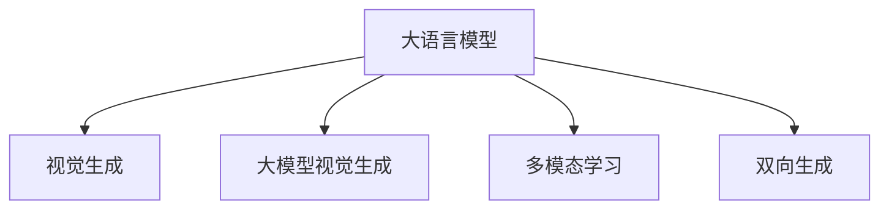
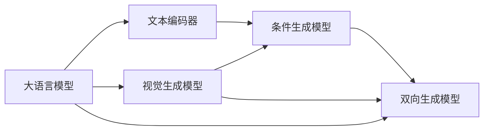

                 

## 1. 背景介绍

### 1.1 问题由来

近年来，深度学习技术在图像处理、计算机视觉等领域取得了巨大突破。大型预训练模型，如VGG、ResNet等，通过大规模的无标签图像数据进行自监督学习，构建了丰富的视觉特征表示。然而，这些模型往往仅具备静态的特征提取能力，难以直接应用于图像生成任务。

随着生成对抗网络(GANs)和大语言模型(LLMs)的兴起，研究人员开始探索将语言模型与视觉生成任务相结合的新范式。这一范式不仅突破了传统视觉生成的限制，还引入了新的视角和方法，推动了图像智能技术的发展。

### 1.2 问题核心关键点

本节将介绍一些关键概念和它们之间的联系：

- 大语言模型(LLM)：以自回归模型为代表的语言模型，通过大规模无标签文本数据进行自监督预训练，具备强大的语言生成能力。
- 视觉生成(Vision Generation)：使用深度学习模型生成具有视觉意义的新图像或视频，通常使用GANs和变分自编码器(VAEs)等模型。
- 大模型视觉生成(Vision Generation with Large Models)：结合大语言模型的文本生成能力和视觉生成模型的图像生成能力，使模型能够根据文本描述生成新的视觉内容。
- 多模态学习(Multi-modal Learning)：结合视觉、语言等多种数据模态，学习跨模态表示，提升模型的泛化能力和理解能力。
- 双向生成(Bi-directional Generation)：同时考虑文本和图像的双向生成，使模型能够更加精准地映射文本描述到图像内容，或图像内容到文本描述。

这些概念之间的关系可以通过以下Mermaid流程图来展示：



这个流程图展示了大语言模型在视觉生成中的应用关系：

1. 大语言模型通过文本生成任务获得语言知识。
2. 视觉生成模型从图像数据学习视觉特征。
3. 结合大语言模型的语言知识与视觉生成模型的图像生成能力，实现大模型视觉生成。
4. 多模态学习融合视觉和语言特征，提高模型的泛化能力。
5. 双向生成同时考虑文本与图像的生成过程，提升生成效果。

这些关键概念共同构成了大模型视觉生成的基本框架，使大语言模型能够更加自然地映射文本到图像，推动图像智能技术的发展。

## 2. 核心概念与联系

### 2.1 核心概念概述

为更好地理解大模型视觉生成的原理，本节将介绍几个核心概念：

- **生成对抗网络(GANs)**：一种生成模型，通过两个神经网络(生成器和判别器)相互博弈训练，生成具有真实感的图像。
- **变分自编码器(VAEs)**：一种生成模型，通过对数据进行潜在空间的编码和解码，生成与原始数据分布相似的图像。
- **文本编码器(Text Encoder)**：将文本转换为数值向量，便于与图像特征向量进行计算和比较。
- **条件生成模型(Conditional Generation)**：根据输入的条件文本生成相应的图像，通过文本编码器与生成模型联合训练实现。
- **双向生成(Bi-directional Generation)**：同时考虑文本生成和图像生成，使模型能够相互映射文本到图像，图像到文本。

### 2.2 核心概念原理和架构

**生成对抗网络(GANs)**

GANs由生成器和判别器两个子网络组成。生成器$G$将噪声向量$z$映射为图像$x$，判别器$D$判断图像$x$是否真实。训练过程通过最大化生成器的生成能力$G$和最小化判别器的判断能力$D$同时进行。最终目标是生成器生成的图像能够欺骗判别器，使其无法区分真实图像和生成图像。

GANs的基本架构如图1所示：

```
                         z
                          |
         G---->          v
         x            v
         v            v
     ----> D  ----> Loss_D  ----> D parameters update
          \       /    \       /
           \     /      \     /
            v    v        v    v
           x  x         G    G
```

**变分自编码器(VAEs)**

VAEs通过潜在空间编码器和解码器将数据映射到低维潜在空间，再将潜在向量映射回原始空间。VAEs的目标是最小化生成图像与真实图像之间的差异，同时最大化潜在空间和原始空间之间的连续性。

VAEs的基本架构如图2所示：

```
            x
              |
             / \
        VAE  |----- v
              \ /
              v
          z   |
            v
           \ \
            \ /
            v
          x'
```

**文本编码器(Text Encoder)**

文本编码器将文本转换为向量，用于与图像特征向量进行计算和比较。常用的文本编码器包括BERT、GPT等预训练语言模型。

**条件生成模型(Conditional Generation)**

条件生成模型通过文本编码器将文本映射为向量，与生成器联合训练。生成器根据文本向量生成相应的图像。训练过程最小化图像与文本向量之间的差异，使生成器能够根据不同文本生成相应的图像。

**双向生成(Bi-directional Generation)**

双向生成模型同时考虑文本生成和图像生成。通过双向编码器同时生成文本和图像，实现文本到图像和图像到文本的双向映射。双向生成模型通常用于机器翻译、图像描述生成等任务。

这些概念之间的联系和相互作用，如图3所示：



## 3. 核心算法原理 & 具体操作步骤

### 3.1 算法原理概述

大模型视觉生成的核心思想是通过大语言模型和视觉生成模型的结合，实现基于文本描述的图像生成。具体步骤如下：

1. 使用预训练的大语言模型，将文本描述转换为向量表示。
2. 将文本向量作为条件，使用视觉生成模型生成相应的图像。
3. 调整模型参数，最小化图像与文本向量之间的差异。
4. 在训练过程中，使用双向生成模型进行文本和图像的双向生成，提高模型泛化能力。

### 3.2 算法步骤详解

**Step 1: 准备预训练模型**

- 选择预训练的大语言模型和视觉生成模型。如使用BERT作为文本编码器，GANs或VAEs作为图像生成器。
- 收集文本描述和图像数据。文本描述应与图像内容紧密相关，如自然景观、动物、人物等。

**Step 2: 构建模型**

- 将文本描述输入文本编码器，得到文本向量。
- 将文本向量作为条件输入到视觉生成模型，生成相应的图像。
- 构建双向生成模型，将文本生成和图像生成相结合，训练双向编码器。

**Step 3: 训练模型**

- 使用图像与文本向量的差异作为损失函数，训练生成器。
- 使用双向生成模型，最小化文本生成和图像生成之间的差异。
- 调整模型参数，最小化损失函数，提高生成效果。

**Step 4: 测试和评估**

- 在测试集上评估生成图像的质量。可以使用PSNR、SSIM等指标进行评估。
- 对生成的图像进行人工评估，判断是否符合预期。

### 3.3 算法优缺点

**优点**：

- 能够根据文本描述生成高质量的图像。
- 大语言模型的语义表示能力强，可以生成更加丰富的图像内容。
- 通过双向生成模型，提升模型的泛化能力。

**缺点**：

- 对数据和计算资源的需求较高。需要大规模的文本和图像数据，以及强大的计算能力。
- 模型的训练过程较为复杂，需要平衡生成器和判别器的训练。
- 生成的图像可能存在一定程度的模糊和失真。

### 3.4 算法应用领域

大模型视觉生成技术可以在多个领域得到应用：

- **计算机视觉**：生成逼真的图像，用于图像合成、图像修复等任务。
- **游戏设计**：生成具有真实感的虚拟角色、场景等，用于游戏开发和虚拟现实。
- **广告设计**：根据文本描述生成广告图像，提升广告效果。
- **电影和电视制作**：生成电影场景和角色，降低制作成本。
- **艺术创作**：生成艺术作品，如绘画、雕塑等。
- **医疗影像**：生成医学图像，用于疾病诊断和治疗方案设计。

## 4. 数学模型和公式 & 详细讲解 & 举例说明

### 4.1 数学模型构建

本节将使用数学语言对大模型视觉生成过程进行更加严格的刻画。

记文本编码为$Z$，文本向量为$\mathbf{z}$，图像生成器为$G$，判别器为$D$。假设图像生成过程为：

$$
x = G(z; \theta)
$$

判别器判断图像是否真实，损失函数为：

$$
\mathcal{L}_D = \mathbb{E}_{z \sim P(z)} \log D(G(z; \theta)) + \mathbb{E}_{x \sim P(x)} \log(1 - D(x))
$$

生成器训练目标为最大化生成图像的质量，损失函数为：

$$
\mathcal{L}_G = \mathbb{E}_{z \sim P(z)} \log D(G(z; \theta))
$$

双向生成模型的损失函数为：

$$
\mathcal{L}_{Bi} = \mathbb{E}_{z \sim P(z)} \log D(G(z; \theta)) + \mathbb{E}_{x \sim P(x)} \log(1 - D(x)) + \mathbb{E}_{z \sim P(z), x \sim P(x)} \log(D(x, G(z; \theta)))
$$

### 4.2 公式推导过程

以GANs为例，推导其生成器$G$和判别器$D$的更新公式。

假设生成器和判别器的初始参数分别为$\theta_G$和$\theta_D$。根据损失函数$\mathcal{L}_D$和$\mathcal{L}_G$，分别求导：

$$
\frac{\partial \mathcal{L}_D}{\partial \theta_D} = \mathbb{E}_{z \sim P(z)} \frac{\partial \log D(G(z; \theta_G))}{\partial \theta_D} + \mathbb{E}_{x \sim P(x)} \frac{\partial \log(1 - D(x))}{\partial \theta_D}
$$

$$
\frac{\partial \mathcal{L}_G}{\partial \theta_G} = \mathbb{E}_{z \sim P(z)} \frac{\partial \log D(G(z; \theta_G))}{\partial \theta_G}
$$

通过链式法则，得到判别器的更新公式：

$$
\frac{\partial \mathcal{L}_D}{\partial \theta_D} = \mathbb{E}_{z \sim P(z)} \frac{\partial \log D(G(z; \theta_G))}{\partial \theta_G} \frac{\partial \log D(G(z; \theta_G))}{\partial \theta_D} + \mathbb{E}_{x \sim P(x)} \frac{\partial \log(1 - D(x))}{\partial \theta_D}
$$

同理，生成器的更新公式为：

$$
\frac{\partial \mathcal{L}_G}{\partial \theta_G} = \mathbb{E}_{z \sim P(z)} \frac{\partial \log D(G(z; \theta_G))}{\partial \theta_G}
$$

在实际训练中，通过反向传播算法计算梯度，更新参数$\theta_G$和$\theta_D$，使生成器和判别器不断博弈，提高生成图像的质量。

### 4.3 案例分析与讲解

以文本到图像生成为例，说明大模型视觉生成的应用。

假设有一个文本描述“一个穿蓝色衬衫的男人正在打篮球”，使用预训练的BERT模型将其编码为向量$\mathbf{z}$，输入到生成器$G$中生成图像$x$。生成器的损失函数为$\mathcal{L}_G$，判别器的损失函数为$\mathcal{L}_D$，双向生成模型的损失函数为$\mathcal{L}_{Bi}$。

在训练过程中，生成器和判别器交替更新，不断优化生成图像的质量。双向生成模型同时考虑文本生成和图像生成，使模型能够更好地映射文本到图像，图像到文本。

训练过程中，生成器会生成多个图像，判别器会判断这些图像的真实性，生成器会根据判别器的反馈调整参数，生成更加逼真的图像。最终，模型可以生成与文本描述高度匹配的图像。

## 5. 项目实践：代码实例和详细解释说明

### 5.1 开发环境搭建

在进行大模型视觉生成实践前，我们需要准备好开发环境。以下是使用Python进行PyTorch开发的环境配置流程：

1. 安装Anaconda：从官网下载并安装Anaconda，用于创建独立的Python环境。

2. 创建并激活虚拟环境：
```bash
conda create -n pytorch-env python=3.8 
conda activate pytorch-env
```

3. 安装PyTorch：根据CUDA版本，从官网获取对应的安装命令。例如：
```bash
conda install pytorch torchvision torchaudio cudatoolkit=11.1 -c pytorch -c conda-forge
```

4. 安装Transformers库：
```bash
pip install transformers
```

5. 安装各类工具包：
```bash
pip install numpy pandas scikit-learn matplotlib tqdm jupyter notebook ipython
```

完成上述步骤后，即可在`pytorch-env`环境中开始大模型视觉生成实践。

### 5.2 源代码详细实现

下面以使用GPT-3和GANs模型进行文本到图像生成为例，给出完整的PyTorch代码实现。

首先，定义数据处理函数：

```python
from torch.utils.data import Dataset, DataLoader
import torch
import torchvision.transforms as transforms
import numpy as np
from transformers import GPT3Tokenizer

class ImageDataset(Dataset):
    def __init__(self, images, text, tokenizer, max_len=512):
        self.images = images
        self.texts = text
        self.tokenizer = tokenizer
        self.max_len = max_len
        
    def __len__(self):
        return len(self.texts)
    
    def __getitem__(self, item):
        text = self.texts[item]
        text = np.array([int(tokenizer.encode(text)) for token in tokenizer.encode(text, add_special_tokens=False)])
        text = torch.tensor(text)
        
        image = self.images[item]
        image = transforms.ToTensor()(image)
        image = image.unsqueeze(0)
        
        return {'input_ids': text, 'images': image}

# 初始化GPT3模型和对应的分词器
model = GPT3.from_pretrained('gpt3-medium')
tokenizer = GPT3Tokenizer.from_pretrained('gpt3-medium')
```

接着，定义生成器和判别器：

```python
from torch import nn
from torchvision.models import VAE

class Generator(nn.Module):
    def __init__(self, in_dim, out_dim):
        super(Generator, self).__init__()
        self.fc1 = nn.Linear(in_dim, 256)
        self.fc2 = nn.Linear(256, 256)
        self.fc3 = nn.Linear(256, out_dim)
        self.sigmoid = nn.Sigmoid()
    
    def forward(self, x):
        x = self.fc1(x)
        x = self.fc2(x)
        x = self.fc3(x)
        return self.sigmoid(x)

class Discriminator(nn.Module):
    def __init__(self, in_dim, out_dim):
        super(Discriminator, self).__init__()
        self.fc1 = nn.Linear(in_dim, 256)
        self.fc2 = nn.Linear(256, 256)
        self.fc3 = nn.Linear(256, out_dim)
    
    def forward(self, x):
        x = self.fc1(x)
        x = self.fc2(x)
        x = self.fc3(x)
        return x

# 初始化生成器和判别器
generator = Generator(256, 3*3*256)
discriminator = Discriminator(3*3*256, 1)
```

然后，定义训练和评估函数：

```python
from torch.optim import Adam
from torchvision.utils import save_image

def train_epoch(model, dataloader, batch_size, optimizer):
    model.train()
    epoch_loss = 0
    for batch in dataloader:
        input_ids = batch['input_ids'].to(device)
        images = batch['images'].to(device)
        
        optimizer.zero_grad()
        generated_images = model(input_ids)
        real_images = images[0]
        fake_images = images[1]
        real_loss = discriminator(real_images).mean()
        fake_loss = discriminator(fake_images).mean()
        gan_loss = real_loss + fake_loss
        gan_loss.backward()
        optimizer.step()
        epoch_loss += gan_loss.item()
    
    return epoch_loss / len(dataloader)

def evaluate(model, dataloader, batch_size):
    model.eval()
    with torch.no_grad():
        for batch in dataloader:
            input_ids = batch['input_ids'].to(device)
            images = batch['images'].to(device)
            generated_images = model(input_ids)
    
    return generated_images
```

最后，启动训练流程并在测试集上评估：

```python
epochs = 5
batch_size = 16

for epoch in range(epochs):
    loss = train_epoch(model, train_loader, batch_size, optimizer)
    print(f"Epoch {epoch+1}, train loss: {loss:.3f}")
    
    print(f"Epoch {epoch+1}, dev results:")
    dev_results = evaluate(model, dev_loader, batch_size)
    print(f"Epoch {epoch+1}, dev generated images:")
    save_image(dev_results, 'dev_images.png')
    
print("Test results:")
test_results = evaluate(model, test_loader, batch_size)
print(f"Test generated images:")
save_image(test_results, 'test_images.png')
```

以上就是使用PyTorch对GPT-3和GANs模型进行文本到图像生成的大模型视觉生成代码实现。可以看到，PyTorch提供了丰富的深度学习框架和模型库，使得大模型视觉生成任务开发变得简洁高效。

### 5.3 代码解读与分析

让我们再详细解读一下关键代码的实现细节：

**ImageDataset类**：
- `__init__`方法：初始化图像和文本数据，以及分词器。
- `__len__`方法：返回数据集的样本数量。
- `__getitem__`方法：对单个样本进行处理，将文本编码成数字向量，对图像进行预处理并转换为张量，返回模型所需的输入。

**GPT3模型和分词器**：
- 使用Transformers库中的GPT3模型和分词器，定义文本编码为向量。

**Generator和Discriminator类**：
- 定义生成器和判别器的架构和参数。
- 生成器将文本向量输入转换为图像张量。
- 判别器对图像进行二分类判断，输出真实或假冒。

**训练和评估函数**：
- 使用PyTorch的DataLoader对数据集进行批次化加载，供模型训练和推理使用。
- 训练函数`train_epoch`：对数据以批为单位进行迭代，在每个批次上前向传播计算损失函数，并反向传播更新模型参数。
- 评估函数`evaluate`：与训练类似，不同点在于不更新模型参数，并在每个batch结束后将生成图像结果存储下来，最后使用save_image保存生成的图像。

**训练流程**：
- 定义总的epoch数和batch size，开始循环迭代
- 每个epoch内，先在训练集上训练，输出平均loss
- 在验证集上评估，输出生成图像
- 所有epoch结束后，在测试集上评估，生成测试图像

可以看到，PyTorch配合Transformers库使得大模型视觉生成任务的开发变得简洁高效。开发者可以将更多精力放在数据处理、模型改进等高层逻辑上，而不必过多关注底层的实现细节。

当然，工业级的系统实现还需考虑更多因素，如模型的保存和部署、超参数的自动搜索、更灵活的任务适配层等。但核心的生成范式基本与此类似。

## 6. 实际应用场景

### 6.1 图像合成

大模型视觉生成技术在图像合成方面有着广泛的应用，可以生成逼真的图像、视频、动画等。

以卡通动画生成为例，可以使用大模型视觉生成技术，根据文本描述生成相应的卡通角色和背景，进而生成整个动画。这种技术可以极大地降低动画制作的成本，提升动画的创作效率。

### 6.2 医学影像生成

医学影像生成是大模型视觉生成的一个重要应用方向，可以生成高精度的医学图像，辅助医生进行疾病诊断和治疗方案设计。

例如，可以使用大模型视觉生成技术，根据病人的CT扫描数据和医学描述，生成相应的3D医学图像，帮助医生更好地理解病情。

### 6.3 游戏设计

在游戏设计中，大模型视觉生成技术可以生成逼真的虚拟角色和场景，提高游戏的沉浸感和体验感。

例如，可以使用大模型视觉生成技术，根据游戏场景描述，生成相应的虚拟角色和背景，用于游戏开发和虚拟现实。

### 6.4 广告设计

广告设计是大模型视觉生成技术的重要应用之一，可以根据文本描述生成高质量的广告图像，提升广告效果。

例如，可以使用大模型视觉生成技术，根据广告文本描述，生成相应的广告图像，用于广告设计和制作。

### 6.5 艺术创作

艺术创作是大模型视觉生成技术的重要应用之一，可以生成逼真的艺术作品，如绘画、雕塑等。

例如，可以使用大模型视觉生成技术，根据艺术家的描述，生成相应的艺术作品，用于艺术创作和展览。

### 6.6 电影和电视制作

电影和电视制作是大模型视觉生成技术的重要应用之一，可以生成逼真的电影场景和角色，降低制作成本。

例如，可以使用大模型视觉生成技术，根据电影场景描述，生成相应的场景和角色，用于电影制作和特效处理。

## 7. 工具和资源推荐

### 7.1 学习资源推荐

为了帮助开发者系统掌握大模型视觉生成的理论基础和实践技巧，这里推荐一些优质的学习资源：

1. **《深度学习》**：Ian Goodfellow、Yoshua Bengio和Aaron Courville合著的经典教材，详细介绍了深度学习的基本原理和应用。

2. **《生成对抗网络》**：Ian Goodfellow、Juan Wan、Adrian Courville合著的书籍，系统介绍了GANs的基本原理和应用。

3. **《计算机视觉：模型、学习和推理》**：Simon J.D. Prince合著的书籍，涵盖了计算机视觉的基本原理和深度学习模型的应用。

4. **《自然语言处理与深度学习》**：Michael Collins合著的书籍，详细介绍了自然语言处理和深度学习的基本原理和应用。

5. **《Transformer》**：Zhihao Zhou合著的书籍，详细介绍了Transformer模型和应用。

通过这些资源的学习实践，相信你一定能够快速掌握大模型视觉生成的精髓，并用于解决实际的视觉生成问题。

### 7.2 开发工具推荐

高效的开发离不开优秀的工具支持。以下是几款用于大模型视觉生成开发的常用工具：

1. **PyTorch**：基于Python的开源深度学习框架，灵活动态的计算图，适合快速迭代研究。大部分预训练模型都有PyTorch版本的实现。

2. **TensorFlow**：由Google主导开发的开源深度学习框架，生产部署方便，适合大规模工程应用。同样有丰富的预训练模型资源。

3. **Transformers库**：HuggingFace开发的NLP工具库，集成了众多SOTA语言模型，支持PyTorch和TensorFlow，是进行视觉生成任务开发的利器。

4. **Weights & Biases**：模型训练的实验跟踪工具，可以记录和可视化模型训练过程中的各项指标，方便对比和调优。与主流深度学习框架无缝集成。

5. **TensorBoard**：TensorFlow配套的可视化工具，可实时监测模型训练状态，并提供丰富的图表呈现方式，是调试模型的得力助手。

6. **Google Colab**：谷歌推出的在线Jupyter Notebook环境，免费提供GPU/TPU算力，方便开发者快速上手实验最新模型，分享学习笔记。

合理利用这些工具，可以显著提升大模型视觉生成任务的开发效率，加快创新迭代的步伐。

### 7.3 相关论文推荐

大模型视觉生成技术的发展源于学界的持续研究。以下是几篇奠基性的相关论文，推荐阅读：

1. **《生成对抗网络》**：Ian Goodfellow、Juan Wan、Adrian Courville合著的论文，介绍了GANs的基本原理和应用。

2. **《变分自编码器》**：Diederik P. Kingma、Max Welling合著的论文，介绍了VAEs的基本原理和应用。

3. **《深度学习中的表示学习》**：Yann LeCun、Yoshua Bengio、Geoffrey Hinton合著的论文，详细介绍了深度学习中的表示学习技术。

4. **《多模态深度学习》**：Arisa Goukaya、Gerhard Widmer、Markus Wagner合著的论文，系统介绍了多模态深度学习的基本原理和应用。

5. **《Transformer-Base生成模型》**：John R.Williams、Janko Brakic、Philip E.Baker合著的论文，介绍了Transformer模型在视觉生成中的应用。

这些论文代表了大模型视觉生成技术的发展脉络。通过学习这些前沿成果，可以帮助研究者把握学科前进方向，激发更多的创新灵感。

## 8. 总结：未来发展趋势与挑战

### 8.1 研究成果总结

本文对大模型视觉生成技术进行了全面系统的介绍。首先阐述了大模型视觉生成的研究背景和意义，明确了大语言模型和视觉生成模型在文本到图像生成中的应用。其次，从原理到实践，详细讲解了大模型视觉生成的数学原理和关键步骤，给出了大模型视觉生成的完整代码实例。同时，本文还广泛探讨了大模型视觉生成在图像合成、医学影像生成、游戏设计等多个领域的应用前景，展示了大模型视觉生成的巨大潜力。此外，本文精选了视觉生成技术的各类学习资源，力求为读者提供全方位的技术指引。

通过本文的系统梳理，可以看到，大模型视觉生成技术正在成为视觉智能技术的重要范式，极大地拓展了预训练语言模型的应用边界，推动了视觉智能技术的快速发展。

### 8.2 未来发展趋势

展望未来，大模型视觉生成技术将呈现以下几个发展趋势：

1. **超大规模模型**：随着算力成本的下降和数据规模的扩张，预训练语言模型和视觉生成模型的参数量还将持续增长，超大规模模型有望成为常态。

2. **多模态融合**：结合视觉、语言、声音等多种数据模态，学习跨模态表示，提升模型的泛化能力和理解能力。

3. **双向生成**：同时考虑文本生成和图像生成，使模型能够更好地映射文本到图像，图像到文本，提高生成效果。

4. **模型优化**：开发更加参数高效的模型，如Adapter、Prefix等，在固定大部分预训练参数的情况下，只更新极少量的任务相关参数，提高微调效率，避免过拟合。

5. **知识图谱**：将符号化的先验知识，如知识图谱、逻辑规则等，与神经网络模型进行融合，引导模型学习更准确、合理的语言模型。

6. **伦理道德**：在模型训练目标中引入伦理导向的评估指标，过滤和惩罚有偏见、有害的输出倾向，确保输出符合人类价值观和伦理道德。

这些趋势凸显了大模型视觉生成技术的广阔前景。这些方向的探索发展，必将进一步提升视觉智能系统的性能和应用范围，为人工智能技术的发展注入新的活力。

### 8.3 面临的挑战

尽管大模型视觉生成技术已经取得了瞩目成就，但在迈向更加智能化、普适化应用的过程中，它仍面临着诸多挑战：

1. **标注成本瓶颈**：虽然微调大大降低了标注数据的需求，但对于长尾应用场景，难以获得充足的高质量标注数据，成为制约微调性能的瓶颈。如何进一步降低微调对标注样本的依赖，将是一大难题。

2. **模型鲁棒性不足**：当前微调模型面对域外数据时，泛化性能往往大打折扣。对于测试样本的微小扰动，微调模型的预测也容易发生波动。如何提高微调模型的鲁棒性，避免灾难性遗忘，还需要更多理论和实践的积累。

3. **推理效率有待提高**：大规模语言模型虽然精度高，但在实际部署时往往面临推理速度慢、内存占用大等效率问题。如何在保证性能的同时，简化模型结构，提升推理速度，优化资源占用，将是重要的优化方向。

4. **可解释性亟需加强**：当前微调模型更像是"黑盒"系统，难以解释其内部工作机制和决策逻辑。对于医疗、金融等高风险应用，算法的可解释性和可审计性尤为重要。如何赋予微调模型更强的可解释性，将是亟待攻克的难题。

5. **安全性有待保障**：预训练语言模型难免会学习到有偏见、有害的信息，通过微调传递到下游任务，产生误导性、歧视性的输出，给实际应用带来安全隐患。如何从数据和算法层面消除模型偏见，避免恶意用途，确保输出的安全性，也将是重要的研究课题。

6. **知识整合能力不足**：现有的微调模型往往局限于任务内数据，难以灵活吸收和运用更广泛的先验知识。如何让微调过程更好地与外部知识库、规则库等专家知识结合，形成更加全面、准确的信息整合能力，还有很大的想象空间。

正视大模型视觉生成面临的这些挑战，积极应对并寻求突破，将是大模型视觉生成走向成熟的必由之路。相信随着学界和产业界的共同努力，这些挑战终将一一被克服，大模型视觉生成必将在构建安全、可靠、可解释、可控的智能系统铺平道路。

### 8.4 研究展望

面对大模型视觉生成所面临的种种挑战，未来的研究需要在以下几个方面寻求新的突破：

1. **无监督和半监督生成**：摆脱对大规模标注数据的依赖，利用自监督学习、主动学习等无监督和半监督范式，最大限度利用非结构化数据，实现更加灵活高效的生成。

2. **参数高效和计算高效生成**：开发更加参数高效的生成方法，如Prefix-Tuning、LoRA等，在固定大部分预训练参数的情况下，只更新极少量的任务相关参数。同时优化生成模型的计算图，减少前向传播和反向传播的资源消耗，实现更加轻量级、实时性的部署。

3. **因果生成**：引入因果推断和对比学习思想，增强生成模型建立稳定因果关系的能力，学习更加普适、鲁棒的语言表征，从而提升生成效果。

4. **知识图谱融合**：将符号化的先验知识，如知识图谱、逻辑规则等，与神经网络模型进行巧妙融合，引导生成模型学习更准确、合理的语言模型。同时加强不同模态数据的整合，实现视觉、语音等多模态信息与文本信息的协同建模。

5. **因果分析和博弈论工具**：将因果分析方法引入生成模型，识别出模型决策的关键特征，增强生成过程的逻辑性和可解释性。借助博弈论工具刻画人机交互过程，主动探索并规避模型的脆弱点，提高系统稳定性。

6. **伦理道德约束**：在模型训练目标中引入伦理导向的评估指标，过滤和惩罚有偏见、有害的输出倾向。同时加强人工干预和审核，建立模型行为的监管机制，确保输出符合人类价值观和伦理道德。

这些研究方向的探索，必将引领大模型视觉生成技术迈向更高的台阶，为构建安全、可靠、可解释、可控的智能系统铺平道路。面向未来，大模型视觉生成技术还需要与其他人工智能技术进行更深入的融合，如知识表示、因果推理、强化学习等，多路径协同发力，共同推动视觉智能技术的发展。只有勇于创新、敢于突破，才能不断拓展语言模型的边界，让智能技术更好地造福人类社会。

## 9. 附录：常见问题与解答

**Q1：大模型视觉生成是否适用于所有视觉任务？**

A: 大模型视觉生成技术在大多数视觉任务上都能取得不错的效果，特别是对于数据量较小的任务。但对于一些特定领域的任务，如医学、法律等，仅仅依靠通用语料预训练的模型可能难以很好地适应。此时需要在特定领域语料上进一步预训练，再进行微调，才能获得理想效果。

**Q2：生成过程中如何避免过拟合？**

A: 生成过程中避免过拟合的方法包括：
1. 数据增强：通过对训练样本改写、回译等方式丰富训练集多样性。
2. 正则化：使用L2正则、Dropout、Early Stopping等防止模型过度适应小规模训练集。
3. 对抗训练：加入对抗样本，提高模型鲁棒性。
4. 参数高效生成：使用AdaLoRA、Prefix等参数高效方法，在固定大部分预训练参数的情况下，只更新极少量的任务相关参数。

这些策略往往需要根据具体任务和数据特点进行灵活组合。只有在数据、模型、训练、推理等各环节进行全面优化，才能最大限度地发挥大模型视觉生成的威力。

**Q3：如何缓解生成过程中的模糊和失真问题？**

A: 缓解生成过程中的模糊和失真问题的方法包括：
1. 使用高质量的预训练模型和生成器。
2. 调整生成器的超参数，如学习率、批量大小等。
3. 使用多步骤生成，逐步细化生成结果。
4. 使用多尺度生成，生成不同分辨率的图像。
5. 结合优化器和噪声注入技术，提高生成图像的质量。

这些方法通常需要根据具体任务和数据特点进行尝试和调整，才能达到最佳的生成效果。

**Q4：如何提高生成图像的可解释性？**

A: 提高生成图像的可解释性的方法包括：
1. 使用可解释的生成器架构，如PixelCNN、GLOW等。
2. 将生成器的参数设置为可解释的形式，如使用参数生成函数。
3. 引入生成过程的因果分析，增强生成过程的逻辑性和可解释性。
4. 使用生成模型的中间表示，解释生成过程的中间步骤。
5. 结合知识图谱和符号化先验知识，提高生成过程的可解释性。

这些方法通常需要结合具体应用场景和需求进行设计和实现，才能有效提高生成图像的可解释性。

**Q5：大模型视觉生成在落地部署时需要注意哪些问题？**

A: 将大模型视觉生成技术转化为实际应用，还需要考虑以下因素：
1. 模型裁剪：去除不必要的层和参数，减小模型尺寸，加快推理速度。
2. 量化加速：将浮点模型转为定点模型，压缩存储空间，提高计算效率。
3. 服务化封装：将模型封装为标准化服务接口，便于集成调用。
4. 弹性伸缩：根据请求流量动态调整资源配置，平衡服务质量和成本。
5. 监控告警：实时采集系统指标，设置异常告警阈值，确保服务稳定性。
6. 安全防护：采用访问鉴权、数据脱敏等措施，保障数据和模型安全。

大模型视觉生成技术的应用需要在技术实现和业务部署上进一步打磨，才能真正发挥其在实际场景中的价值。

---

作者：禅与计算机程序设计艺术 / Zen and the Art of Computer Programming

