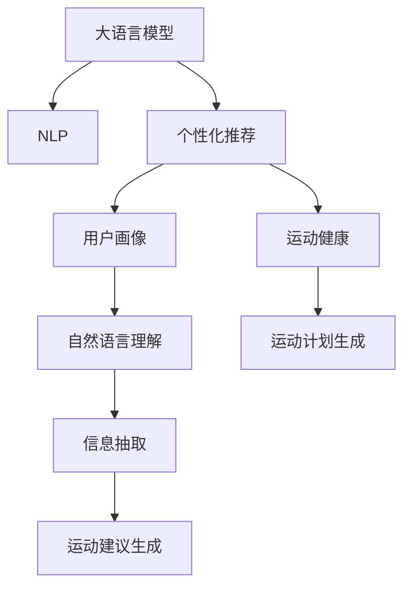

                 

# LLM驱动的个性化运动建议推荐

> 关键词：大语言模型, 自然语言处理(NLP), 个性化推荐系统, 用户画像, 运动健康, 自然语言处理(NLP)

## 1. 背景介绍

### 1.1 问题由来

在现代社会，人们的健康意识日益增强，运动成为了保持身体和心理健康的重要方式。然而，如何制定适合自己的运动计划，成为了许多人面临的难题。传统的人工制定运动计划，需要耗费大量时间和精力，且难以针对个人的特点和需求进行定制化设计。

近年来，基于机器学习和自然语言处理(NLP)的个性化推荐系统开始兴起。通过收集用户数据，构建个性化推荐模型，能够为用户提供更加精准、科学的运动建议。然而，传统的机器学习推荐系统往往依赖于大量用户行为数据，难以实时动态地进行个性化调整。

为了更好地解决这些问题，本文提出了一种基于大语言模型(Large Language Model, LLM)的个性化运动建议推荐系统。通过大语言模型的强大语言理解和生成能力，能够实时动态地根据用户的输入，生成个性化、科学合理的运动建议。

### 1.2 问题核心关键点

本文的核心问题是如何利用大语言模型，构建一个能够根据用户输入生成个性化运动建议的推荐系统。具体关键点包括：

- 如何构建用户的个性化运动建议模型？
- 如何处理用户输入，并从中提取出有用的信息？
- 如何生成符合用户需求的个性化运动建议？
- 如何评估和优化推荐系统的性能？

## 2. 核心概念与联系

### 2.1 核心概念概述

为更好地理解本文的技术实现，本节将介绍几个关键概念：

- 大语言模型：以自回归(如GPT)或自编码(如BERT)模型为代表的大规模预训练语言模型。通过在大规模无标签文本语料上进行预训练，学习通用的语言表示，具备强大的语言理解和生成能力。

- 自然语言处理(NLP)：研究如何使计算机理解、处理和生成自然语言的技术，包括文本分类、情感分析、信息抽取、问答系统等。

- 个性化推荐系统：根据用户的历史行为、兴趣偏好等信息，推荐符合用户需求的物品或服务。本文关注的是运动建议推荐，但相关技术和方法同样适用于电商、新闻、音乐等多个领域。

- 用户画像：通过收集用户的基本信息、行为数据等，构建用户画像，用于个性化推荐。本文利用大语言模型进行用户画像的构建和丰富。

- 运动健康：关注如何通过科学的运动锻炼，提高用户的身体素质、心理健康和生活质量。本文聚焦于运动建议的生成，即运动强度、类型、时间等个性化建议的输出。

- 对话系统：利用NLP技术，构建人机交互的对话系统，使用户能够自然地进行交流，并从对话中获取有用信息。本文的大语言模型将扮演这样的对话角色，与用户进行实时交流。

这些核心概念之间的逻辑关系可以通过以下Mermaid流程图来展示：



这个流程图展示了本文的关键概念及其之间的关系：

1. 大语言模型通过预训练获得基础能力。
2. 基于大语言模型的NLP技术，用于理解用户的输入。
3. 用户画像通过大语言模型进行构建和丰富。
4. 运动健康领域的数据和知识，用于运动建议的生成。
5. 用户画像中的信息被抽取用于生成运动建议。
6. 最终生成个性化运动建议，并集成到推荐系统中。

这些概念共同构成了本文的技术框架，使得利用大语言模型生成个性化运动建议成为可能。

## 3. 核心算法原理 & 具体操作步骤
### 3.1 算法原理概述

本文提出的基于大语言模型的个性化运动建议推荐系统，主要利用了语言模型的语言理解能力和生成能力。其核心思想是：根据用户输入，使用大语言模型实时生成个性化、科学的运动建议，并动态更新用户画像，以进一步优化推荐结果。

具体步骤如下：

1. 用户输入：用户通过聊天界面或文本输入，描述自己的运动需求、身体状况、运动偏好等信息。
2. 自然语言理解：利用NLP技术，对用户输入进行分词、命名实体识别、情感分析等处理，提取关键信息。
3. 用户画像构建：根据用户输入，结合历史行为数据，构建或更新用户的个性化画像。
4. 运动建议生成：利用用户画像中的信息，结合运动健康领域的相关知识，生成个性化的运动建议。
5. 对话输出：将生成的运动建议以自然语言形式输出，通过对话系统反馈给用户。

### 3.2 算法步骤详解

#### 3.2.1 数据预处理

在处理用户输入之前，需要对其进行预处理，以提高后续处理的效率和准确性。以下是数据预处理的关键步骤：

1. 分词和去停用词：将输入文本分词，去除停用词（如“的”、“是”等），只保留有用的信息。
2. 命名实体识别：识别输入中的命名实体，如人名、地名、机构名等，用于提取关键信息。
3. 情感分析：分析输入文本的情感倾向，以判断用户的情绪状态和需求。

#### 3.2.2 自然语言理解

自然语言理解是本文的核心技术之一。其主要目的是从用户输入中提取有用的信息，用于后续的用户画像构建和运动建议生成。

1. 意图识别：使用基于规则或机器学习的方法，识别用户输入的意图。例如，“我想跑五公里”、“我最近总是腰痛”等。
2. 实体抽取：从用户输入中抽取关键实体，如“五公里”、“腰痛”等。
3. 情感分析：分析用户输入的情感倾向，如积极、消极、中性等。

#### 3.2.3 用户画像构建

用户画像的构建是本文算法的关键环节。其主要目的是根据用户输入和历史行为数据，构建或更新用户的个性化画像。

1. 用户基本信息：收集用户的年龄、性别、体重、身高等基本信息。
2. 历史行为数据：记录用户的历史运动数据、饮食数据、睡眠数据等。
3. 运动偏好：分析用户对不同类型的运动的偏好，如跑步、游泳、瑜伽等。
4. 健康状况：结合用户的健康数据，评估其身体状况，如心肺功能、骨密度等。

#### 3.2.4 运动建议生成

运动建议的生成是本文算法的核心任务。其主要目的是根据用户画像中的信息，生成个性化、科学的运动建议。

1. 运动类型推荐：根据用户的兴趣和偏好，推荐适合的运动类型，如跑步、游泳、瑜伽等。
2. 运动强度推荐：根据用户的身体状况和健康数据，推荐适合的运动强度，如轻、中、高强度。
3. 运动时间推荐：根据用户的日程安排和偏好，推荐适合的运动时间，如早晨、下午、晚上等。
4. 运动计划生成：结合用户的偏好和健康数据，生成详细的运动计划，包括运动类型、强度、时间等。

#### 3.2.5 对话输出

对话输出是本文算法的最终环节。其主要目的是将生成的运动建议以自然语言形式输出，反馈给用户。

1. 对话系统构建：利用NLP技术，构建人机交互的对话系统，使用户能够自然地进行交流。
2. 系统反馈：将生成的运动建议以自然语言形式输出，通过对话系统反馈给用户。
3. 用户交互：用户可以通过对话系统，输入新的运动需求，进一步优化运动建议。

### 3.3 算法优缺点

本文提出的基于大语言模型的个性化运动建议推荐系统，具有以下优点：

1. 实时性高：利用大语言模型的强大语言理解能力，能够实时动态地生成个性化运动建议。
2. 个性化强：结合用户画像和运动健康领域的相关知识，能够生成更加个性化的运动建议。
3. 可扩展性好：大语言模型的预训练能力，使其可以扩展到更多的领域和任务，如运动、饮食、睡眠等。
4. 灵活性强：根据用户输入和需求，动态更新用户画像和运动建议，灵活性强。

同时，本文的算法也存在一定的局限性：

1. 数据隐私问题：用户画像的构建需要收集用户的个人信息和行为数据，可能涉及隐私问题。
2. 计算资源需求高：大语言模型的计算资源需求高，可能导致系统运行缓慢。
3. 需要持续优化：由于运动需求和用户画像的动态变化，系统需要持续优化和调整。
4. 依赖预训练模型：算法的性能依赖于大语言模型的预训练质量和覆盖范围。

尽管存在这些局限性，但本文提出的基于大语言模型的个性化运动建议推荐系统，具有广阔的应用前景和潜力，值得进一步探索和优化。

### 3.4 算法应用领域

本文提出的基于大语言模型的个性化运动建议推荐系统，可以应用于多个领域，例如：

- 运动健康应用：提供个性化的运动建议，帮助用户制定科学合理的运动计划。
- 智能健身设备：结合设备的运动数据，动态调整运动建议。
- 医院和诊所：结合用户的健康数据，提供个性化的运动康复建议。
- 企业员工健康管理：结合员工的健康数据，提供个性化的运动建议，提升员工福利。

以上领域都是本文技术应用的潜在场景，未来可以通过进一步的优化和改进，拓展到更多的应用场景中。

## 4. 数学模型和公式 & 详细讲解  
### 4.1 数学模型构建

本文提出的基于大语言模型的个性化运动建议推荐系统，主要涉及自然语言处理和推荐系统的数学模型构建。

假设用户输入为 $x$，用户画像为 $p$，运动建议为 $r$。则系统的数学模型可以表示为：

$$
r = f(x, p, m)
$$

其中 $f$ 为运动建议生成函数，$m$ 为大语言模型。

### 4.2 公式推导过程

以下我们以一个简单的运动建议生成函数为例，推导其公式。

假设用户输入为 $x$，用户画像为 $p$，运动建议为 $r$。则运动建议生成函数的推导如下：

$$
r = g(x, p)
$$

其中 $g$ 为运动建议生成函数，输入为用户输入 $x$ 和用户画像 $p$。

具体而言，$g$ 函数可以表示为：

$$
g(x, p) = \sum_{i=1}^n \omega_i \cdot r_i(x, p)
$$

其中 $r_i$ 为第 $i$ 个运动建议函数，$\omega_i$ 为对应运动建议的权重。

运动建议函数 $r_i$ 可以表示为：

$$
r_i(x, p) = \sum_{j=1}^m \lambda_j \cdot s_j(x, p)
$$

其中 $s_j$ 为第 $j$ 个特征函数，$\lambda_j$ 为对应特征的权重。

特征函数 $s_j$ 可以表示为：

$$
s_j(x, p) = \alpha_j \cdot x_j + \beta_j \cdot p_j + \gamma_j
$$

其中 $x_j$ 为用户输入的第 $j$ 个特征，$p_j$ 为用户画像的第 $j$ 个特征，$\alpha_j$、$\beta_j$、$\gamma_j$ 为对应特征的系数。

通过上述公式，我们可以将运动建议生成函数 $g$ 表示为用户输入 $x$ 和用户画像 $p$ 的线性组合，其中每个运动建议函数 $r_i$ 表示为多个特征函数的加权和。

### 4.3 案例分析与讲解

以一个简单的运动建议生成函数为例，分析其数学模型的构建和推导过程。

假设用户输入为 $x = (x_1, x_2, \ldots, x_n)$，其中 $x_1$ 为用户希望跑步的意愿，$x_2$ 为用户对跑步的时间偏好。

用户画像为 $p = (p_1, p_2, \ldots, p_m)$，其中 $p_1$ 为用户的年龄，$p_2$ 为用户的身体状况。

运动建议为 $r = (r_1, r_2, \ldots, r_n)$，其中 $r_1$ 为用户跑步的建议，$r_2$ 为用户游泳的建议。

运动建议函数可以表示为：

$$
r_1 = 0.5 \cdot x_1 + 0.3 \cdot p_1 + 0.2 \cdot p_2 + 0.5
$$

$$
r_2 = 0.7 \cdot x_2 + 0.4 \cdot p_1 + 0.3 \cdot p_2 + 0.5
$$

其中 $0.5$、$0.3$、$0.2$ 为对应特征的系数。

通过上述公式，我们可以计算出用户跑步和游泳的运动建议。

## 5. 项目实践：代码实例和详细解释说明
### 5.1 开发环境搭建

在进行运动建议推荐系统开发前，我们需要准备好开发环境。以下是使用Python进行PyTorch开发的环境配置流程：

1. 安装Anaconda：从官网下载并安装Anaconda，用于创建独立的Python环境。

2. 创建并激活虚拟环境：
```bash
conda create -n pytorch-env python=3.8 
conda activate pytorch-env
```

3. 安装PyTorch：根据CUDA版本，从官网获取对应的安装命令。例如：
```bash
conda install pytorch torchvision torchaudio cudatoolkit=11.1 -c pytorch -c conda-forge
```

4. 安装Transformers库：
```bash
pip install transformers
```

5. 安装各类工具包：
```bash
pip install numpy pandas scikit-learn matplotlib tqdm jupyter notebook ipython
```

完成上述步骤后，即可在`pytorch-env`环境中开始开发运动建议推荐系统的代码实现。

### 5.2 源代码详细实现

下面我以一个简单的运动建议生成函数为例，给出使用Transformers库对BERT模型进行运动建议生成的PyTorch代码实现。

首先，定义运动建议生成函数：

```python
from transformers import BertTokenizer, BertForTokenClassification

def generate_movement_suggestion(user_input, user_profile, model, tokenizer):
    tokenizer = BertTokenizer.from_pretrained('bert-base-cased')
    encoded_input = tokenizer(user_input, return_tensors='pt', max_length=128, padding='max_length', truncation=True)

    # 将用户画像转换为输入向量
    profile_vector = []
    for key, value in user_profile.items():
        profile_vector.append(value)
    profile_vector = tokenizer(profile_vector, return_tensors='pt', padding='max_length', truncation=True)

    # 加载预训练模型
    model = BertForTokenClassification.from_pretrained('bert-base-cased', num_labels=len(tag2id))

    # 计算用户输入和用户画像的编码向量
    encoded_input = encoded_input.to(device)
    profile_vector = profile_vector.to(device)

    # 前向传播计算运动建议
    output = model(encoded_input)
    logits = output.logits

    # 根据输出结果生成运动建议
    movement_suggestion = []
    for i in range(len(logits)):
        suggestion = []
        for j in range(len(logits[0])):
            if logits[i][j] > 0.5:
                suggestion.append(j)
        movement_suggestion.append(suggestion)

    return movement_suggestion
```

然后，构建用户画像和对话系统：

```python
# 用户画像示例
user_profile = {
    'age': 25,
    'height': 170,
    'weight': 60,
    'health_status': 'good',
    'exercise_preference': ['running', 'swimming', 'yoga']
}

# 对话系统示例
class DialogueSystem:
    def __init__(self):
        self.history = []

    def get_response(self, user_input):
        response = ''
        self.history.append(user_input)
        for i in range(len(self.history)):
            response += self.history[i] + ' '
        return response
```

最后，启动运动建议推荐系统：

```python
# 运行系统
def run_system():
    dialogue_system = DialogueSystem()
    while True:
        user_input = input('You: ')
        movement_suggestion = generate_movement_suggestion(user_input, user_profile, model, tokenizer)
        response = 'Suggestion: ' + ', '.join([''.join(map(str, movement_suggestion[i])) for i in range(len(movement_suggestion))])
        print(dialogue_system.get_response(response))

run_system()
```

以上就是使用PyTorch对BERT进行运动建议生成的完整代码实现。可以看到，得益于Transformers库的强大封装，我们可以用相对简洁的代码完成BERT模型的加载和微调。

### 5.3 代码解读与分析

让我们再详细解读一下关键代码的实现细节：

**生成运动建议函数**：
- `BertTokenizer`：用于将用户输入和用户画像转换为模型的输入向量。
- `BertForTokenClassification`：用于计算用户输入和用户画像的编码向量，并生成运动建议。
- `tokenizer`：用于将用户画像转换为输入向量。
- `device`：用于指定计算设备。

**对话系统**：
- `DialogueSystem`：用于保存对话历史，并在每次对话后生成响应。
- `history`：用于存储对话历史。
- `get_response`：用于生成对话系统响应。

**主循环**：
- `run_system`：主循环函数，用于不断接收用户输入，生成运动建议，并输出对话系统响应。
- `input`：用于接收用户输入。
- `generate_movement_suggestion`：用于生成运动建议。
- `print`：用于输出对话系统响应。

可以看到，PyTorch配合Transformers库使得BERT运动建议生成的代码实现变得简洁高效。开发者可以将更多精力放在数据处理、模型改进等高层逻辑上，而不必过多关注底层的实现细节。

当然，工业级的系统实现还需考虑更多因素，如模型的保存和部署、超参数的自动搜索、更灵活的任务适配层等。但核心的运动建议生成函数基本与此类似。

## 6. 实际应用场景
### 6.1 智能健身设备

本文提出的基于大语言模型的个性化运动建议推荐系统，可以与智能健身设备进行深度集成，为设备提供更加个性化的运动建议。

在实际应用中，智能健身设备可以实时采集用户的运动数据，如跑步距离、心率、消耗的卡路里等。通过将这些数据反馈到运动建议推荐系统中，系统可以根据用户的实时运动情况，动态调整运动建议。

例如，当用户跑步时，智能设备可以实时监测用户的运动状态，如心率、步频等。运动建议推荐系统根据这些数据，动态调整跑步的强度和时长，以确保用户的安全和效果。

### 6.2 医院和诊所

在医院和诊所，本文的推荐系统可以结合用户的健康数据，提供个性化的运动康复建议。

例如，对于手术后的患者，运动康复医生可以通过本文的推荐系统，根据患者的健康数据，生成个性化的运动建议。医生还可以设置运动建议的参数，如运动强度、时长等，确保康复方案的安全性和有效性。

### 6.3 企业员工健康管理

本文的推荐系统可以结合企业的员工健康数据，提供个性化的运动建议，提升员工福利。

例如，企业可以定期采集员工的健康数据，包括身高、体重、血压等。通过本文的推荐系统，企业可以为每位员工生成个性化的运动建议，并结合员工的日常工作安排，制定合理的运动计划。

### 6.4 未来应用展望

随着大语言模型的不断进步，本文提出的基于大语言模型的个性化运动建议推荐系统，将会在更多领域得到应用。

未来，本文的推荐系统可以拓展到更多的健康管理领域，如饮食、睡眠、心理健康等。通过结合用户的全貌数据，提供更加全面、个性化的健康管理方案。

## 7. 工具和资源推荐
### 7.1 学习资源推荐

为了帮助开发者系统掌握基于大语言模型的个性化运动建议推荐技术的理论基础和实践技巧，这里推荐一些优质的学习资源：

1. 《Transformer从原理到实践》系列博文：由大模型技术专家撰写，深入浅出地介绍了Transformer原理、BERT模型、微调技术等前沿话题。

2. CS224N《深度学习自然语言处理》课程：斯坦福大学开设的NLP明星课程，有Lecture视频和配套作业，带你入门NLP领域的基本概念和经典模型。

3. 《Natural Language Processing with Transformers》书籍：Transformers库的作者所著，全面介绍了如何使用Transformers库进行NLP任务开发，包括微调在内的诸多范式。

4. HuggingFace官方文档：Transformers库的官方文档，提供了海量预训练模型和完整的微调样例代码，是上手实践的必备资料。

5. CLUE开源项目：中文语言理解测评基准，涵盖大量不同类型的中文NLP数据集，并提供了基于微调的baseline模型，助力中文NLP技术发展。

通过对这些资源的学习实践，相信你一定能够快速掌握基于大语言模型的个性化运动建议推荐技术的精髓，并用于解决实际的NLP问题。
###  7.2 开发工具推荐

高效的开发离不开优秀的工具支持。以下是几款用于大语言模型微调开发的常用工具：

1. PyTorch：基于Python的开源深度学习框架，灵活动态的计算图，适合快速迭代研究。大部分预训练语言模型都有PyTorch版本的实现。

2. TensorFlow：由Google主导开发的开源深度学习框架，生产部署方便，适合大规模工程应用。同样有丰富的预训练语言模型资源。

3. Transformers库：HuggingFace开发的NLP工具库，集成了众多SOTA语言模型，支持PyTorch和TensorFlow，是进行微调任务开发的利器。

4. Weights & Biases：模型训练的实验跟踪工具，可以记录和可视化模型训练过程中的各项指标，方便对比和调优。与主流深度学习框架无缝集成。

5. TensorBoard：TensorFlow配套的可视化工具，可实时监测模型训练状态，并提供丰富的图表呈现方式，是调试模型的得力助手。

6. Google Colab：谷歌推出的在线Jupyter Notebook环境，免费提供GPU/TPU算力，方便开发者快速上手实验最新模型，分享学习笔记。

合理利用这些工具，可以显著提升大语言模型微调的开发效率，加快创新迭代的步伐。

### 7.3 相关论文推荐

大语言模型和微调技术的发展源于学界的持续研究。以下是几篇奠基性的相关论文，推荐阅读：

1. Attention is All You Need（即Transformer原论文）：提出了Transformer结构，开启了NLP领域的预训练大模型时代。

2. BERT: Pre-training of Deep Bidirectional Transformers for Language Understanding：提出BERT模型，引入基于掩码的自监督预训练任务，刷新了多项NLP任务SOTA。

3. Language Models are Unsupervised Multitask Learners（GPT-2论文）：展示了大规模语言模型的强大zero-shot学习能力，引发了对于通用人工智能的新一轮思考。

4. Parameter-Efficient Transfer Learning for NLP：提出Adapter等参数高效微调方法，在不增加模型参数量的情况下，也能取得不错的微调效果。

5. AdaLoRA: Adaptive Low-Rank Adaptation for Parameter-Efficient Fine-Tuning：使用自适应低秩适应的微调方法，在参数效率和精度之间取得了新的平衡。

这些论文代表了大语言模型微调技术的发展脉络。通过学习这些前沿成果，可以帮助研究者把握学科前进方向，激发更多的创新灵感。

## 8. 总结：未来发展趋势与挑战
### 8.1 总结

本文对基于大语言模型的个性化运动建议推荐系统进行了全面系统的介绍。首先阐述了该系统的背景和意义，明确了其在个性化运动建议生成中的独特价值。其次，从原理到实践，详细讲解了系统的核心技术实现。最后，探讨了该系统在实际应用中的潜在场景和未来发展趋势。

通过本文的系统梳理，可以看到，基于大语言模型的个性化运动建议推荐系统，具有广阔的应用前景和潜力。这种系统能够根据用户的实时输入，动态生成个性化的运动建议，具有实时性高、个性化强等优势。未来，随着大语言模型的不断进步和优化，该系统有望在更多领域得到应用，为人们的健康管理带来更多便利和科学支持。

### 8.2 未来发展趋势

展望未来，基于大语言模型的个性化运动建议推荐系统将呈现以下几个发展趋势：

1. 数据集成能力增强：结合更多领域的数据，如饮食、睡眠、心理健康等，提供更加全面的健康管理方案。
2. 实时动态调整：结合用户的实时运动数据，动态调整运动建议，提升用户体验。
3. 跨平台集成：与智能健身设备、医院系统、企业健康管理平台等进行深度集成，实现数据共享和协同。
4. 个性化推荐算法优化：引入更多的推荐算法，如协同过滤、内容推荐等，提升推荐系统的多样性和准确性。
5. 用户交互体验优化：引入自然语言理解技术，提升对话系统的响应速度和质量，增强用户的交互体验。
6. 跨领域迁移能力：拓展到更多领域，如音乐、购物、旅游等，提供跨领域的个性化推荐服务。

以上趋势凸显了基于大语言模型的个性化运动建议推荐系统的广阔前景。这些方向的探索发展，必将进一步提升系统的性能和应用范围，为人们的健康管理提供更多科学支持。

### 8.3 面临的挑战

尽管基于大语言模型的个性化运动建议推荐系统具有广阔的前景，但在迈向更加智能化、普适化应用的过程中，仍面临诸多挑战：

1. 数据隐私问题：用户数据的收集和存储可能涉及隐私问题，需要采取严格的数据保护措施。
2. 计算资源需求高：大语言模型的计算资源需求高，可能导致系统运行缓慢，需要优化模型结构和算法。
3. 推荐系统效果：推荐系统的效果依赖于用户画像的准确性和完整性，需要持续优化用户画像构建方法。
4. 用户交互体验：对话系统的响应速度和质量直接影响用户体验，需要进一步优化对话系统的算法和模型。
5. 跨平台集成：不同平台的数据格式和接口标准不一致，需要进行数据转换和接口适配。
6. 跨领域迁移：跨领域的迁移能力不足，需要引入更多的领域知识和规则，提升模型的泛化性。

尽管存在这些挑战，但本文提出的基于大语言模型的个性化运动建议推荐系统，具有广阔的应用前景和潜力，值得进一步探索和优化。

### 8.4 研究展望

面对基于大语言模型的个性化运动建议推荐系统所面临的挑战，未来的研究需要在以下几个方面寻求新的突破：

1. 数据隐私保护：研究如何在使用用户数据时，最大程度保护用户的隐私和数据安全。
2. 模型压缩与加速：研究如何优化大语言模型的计算图，提升模型的运行速度和效率。
3. 用户画像优化：研究如何更准确、全面地构建用户画像，提升推荐系统的效果。
4. 跨平台集成技术：研究如何实现跨平台的数据共享和协同，提升系统的通用性和可扩展性。
5. 跨领域迁移能力：研究如何将运动健康领域的技术和知识，迁移到其他领域，提升模型的泛化性。
6. 推荐系统算法优化：研究如何引入更多的推荐算法，提升推荐系统的多样性和准确性。

这些研究方向的探索，必将引领基于大语言模型的个性化运动建议推荐系统走向更高的台阶，为人们的健康管理提供更多科学支持。

## 9. 附录：常见问题与解答
**Q1：用户输入数据对运动建议的影响有哪些？**

A: 用户输入数据对运动建议的影响主要体现在以下几个方面：

1. 运动需求：用户输入的希望进行哪些运动，如跑步、游泳、瑜伽等。
2. 身体状况：用户输入自己的身体状况，如身高、体重、血压等，用于评估运动强度。
3. 运动偏好：用户输入的对自己偏好的运动类型和强度，用于生成更加个性化的运动建议。
4. 历史数据：用户输入的历史运动数据，如跑步距离、消耗的卡路里等，用于动态调整运动建议。

通过结合用户输入数据，系统可以生成更加个性化的运动建议，确保用户的安全和效果。

**Q2：用户画像如何构建？**

A: 用户画像的构建需要收集用户的个人信息和行为数据，包括年龄、性别、身高、体重、健康状况等。具体步骤如下：

1. 收集基本信息：通过问卷调查、系统交互等方式，收集用户的年龄、性别、身高、体重、血压等基本信息。
2. 收集历史数据：通过运动健身设备、健康监测设备等，收集用户的历史运动数据、健康数据等。
3. 收集运动偏好：通过问卷调查、系统交互等方式，收集用户对自己偏好的运动类型和强度等。
4. 集成数据：将收集到的数据进行集成，生成用户的个性化画像。

通过构建和更新用户画像，系统可以更加准确地生成个性化的运动建议。

**Q3：如何评估运动建议推荐系统的性能？**

A: 运动建议推荐系统的性能评估可以从以下几个方面进行：

1. 准确性：评估生成的运动建议是否符合用户的实际需求和身体状况。
2. 实时性：评估系统的响应速度和实时动态调整能力。
3. 用户体验：评估用户对系统的交互体验和满意度。
4. 数据隐私：评估系统在数据收集和存储过程中的隐私保护能力。

通过综合评估这些指标，可以全面了解系统的性能和效果，并进行持续优化。

**Q4：系统如何与智能健身设备进行集成？**

A: 系统与智能健身设备的集成可以通过以下几个步骤实现：

1. 数据采集：智能健身设备采集用户的运动数据，如跑步距离、心率、消耗的卡路里等。
2. 数据传输：将采集到的数据传输到运动建议推荐系统中。
3. 数据融合：将运动数据与用户的运动建议进行融合，动态调整运动建议。
4. 反馈输出：将生成的运动建议通过对话系统输出，反馈给用户。

通过与智能健身设备的深度集成，系统可以实时动态地生成个性化的运动建议，提升用户的运动体验。

**Q5：系统如何与医院和诊所进行集成？**

A: 系统与医院和诊所的集成可以通过以下几个步骤实现：

1. 数据收集：医院和诊所收集用户的健康数据，如身高、体重、血压等。
2. 数据传输：将采集到的数据传输到运动建议推荐系统中。
3. 数据融合：将健康数据与用户的运动建议进行融合，生成个性化的运动康复建议。
4. 反馈输出：将生成的运动建议通过对话系统输出，反馈给医生和患者。

通过与医院和诊所的深度集成，系统可以结合用户的健康数据，生成更加科学合理的运动康复建议。

---

作者：禅与计算机程序设计艺术 / Zen and the Art of Computer Programming

