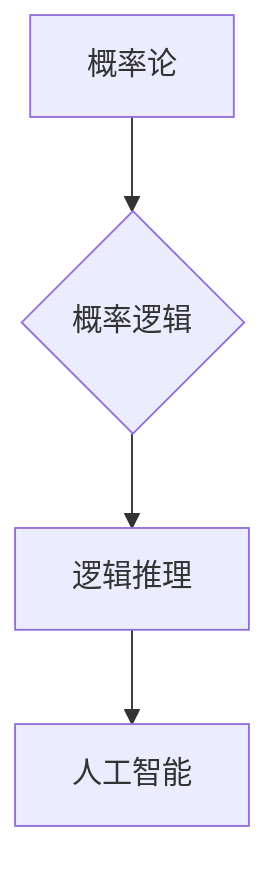

> 概率论，逻辑学，卡尔纳普，贝叶斯推理，决策理论，人工智能，知识表示

## 1. 背景介绍

卡尔纳普的《概率的逻辑基础》是一本具有里程碑意义的著作，它深刻地探讨了概率论与逻辑学之间的关系，为人工智能、机器学习等领域奠定了坚实的基础。本书的核心思想是将概率论作为逻辑推理的工具，从而克服了传统逻辑学在处理不确定性问题上的局限性。

在20世纪初，逻辑学和概率论是两个相对独立的学科。逻辑学关注的是确定性的推理，而概率论则侧重于不确定性的度量和处理。然而，随着计算机科学和人工智能的发展，人们越来越需要一种能够处理不确定性问题的推理框架。卡尔纳普的《概率的逻辑基础》正是试图解决这一问题的杰作。

## 2. 核心概念与联系

卡尔纳普的《概率的逻辑基础》的核心概念是将概率论引入逻辑推理的框架中。传统的逻辑推理基于真值表和符号逻辑，只能处理确定性的命题。而概率逻辑则允许我们对命题的真值赋予概率，从而能够处理不确定性问题。

**核心概念：**

* **概率论：** 概率论是研究随机事件及其概率分布的数学分支。
* **逻辑学：** 逻辑学是研究推理和论证的科学。
* **概率逻辑：** 概率逻辑将概率论的工具引入逻辑推理的框架中，从而能够处理不确定性问题。

**核心联系：**

* 概率论为逻辑推理提供了处理不确定性的工具。
* 逻辑学为概率逻辑提供了推理框架。
* 概率逻辑为人工智能、机器学习等领域提供了处理不确定性问题的推理框架。



## 3. 核心算法原理 & 具体操作步骤

### 3.1  算法原理概述

卡尔纳普的《概率的逻辑基础》中，提出了许多重要的概率逻辑算法，其中最著名的是贝叶斯推理算法。贝叶斯推理算法是一种基于贝叶斯定理的推理算法，它能够根据先验知识和新的证据更新对未知事件的概率估计。

### 3.2  算法步骤详解

贝叶斯推理算法的具体步骤如下：

1. **定义事件和概率：** 首先，需要定义需要推理的事件以及这些事件之间的概率关系。
2. **设定先验概率：** 根据先验知识，设定每个事件的先验概率。
3. **收集证据：** 收集与事件相关的新的证据。
4. **更新后验概率：** 使用贝叶斯定理更新每个事件的后验概率，即根据新的证据更新对事件的概率估计。
5. **做出决策：** 根据后验概率，做出最优决策。

### 3.3  算法优缺点

**优点：**

* 可以处理不确定性问题。
* 可以利用先验知识进行推理。
* 可以根据新的证据更新概率估计。

**缺点：**

* 需要大量的先验知识。
* 计算复杂度较高。

### 3.4  算法应用领域

贝叶斯推理算法在许多领域都有广泛的应用，例如：

* **人工智能：** 用于机器学习、自然语言处理、计算机视觉等领域。
* **医学诊断：** 用于根据患者的症状和检查结果诊断疾病。
* **金融预测：** 用于预测股票价格、风险评估等。

## 4. 数学模型和公式 & 详细讲解 & 举例说明

### 4.1  数学模型构建

卡尔纳普的《概率的逻辑基础》中，构建了一个概率逻辑的数学模型，该模型将概率论的工具引入逻辑推理的框架中。

**核心公式：**

* **贝叶斯定理：**

$$P(A|B) = \frac{P(B|A)P(A)}{P(B)}$$

其中：

* $P(A|B)$ 是事件 A 在事件 B 发生的条件下的概率。
* $P(B|A)$ 是事件 B 在事件 A 发生的条件下的概率。
* $P(A)$ 是事件 A 的先验概率。
* $P(B)$ 是事件 B 的概率。

### 4.2  公式推导过程

贝叶斯定理的推导过程如下：

1. 从事件 A 和 B 的联合概率出发：

$$P(A,B) = P(A|B)P(B)$$

2. 将事件 A 和 B 的联合概率表示为：

$$P(A,B) = P(B|A)P(A)$$

3. 将两个表达式相等，得到贝叶斯定理：

$$P(A|B) = \frac{P(B|A)P(A)}{P(B)}$$

### 4.3  案例分析与讲解

**案例：**

假设我们有一个疾病检测器，该检测器能够准确地检测出患有该疾病的人，但也会对健康人产生误报。

* $A$：患者患有该疾病。
* $B$：检测器检测出患者患有该疾病。

**已知：**

* $P(A)$ = 0.01 (该疾病的患病率)
* $P(B|A)$ = 0.99 (检测器检测出患有该疾病的人的概率)
* $P(B|\overline{A})$ = 0.01 (检测器对健康人误报的概率)

**求解：**

我们需要求解 $P(A|B)$，即患者在检测器检测出患有该疾病的情况下，实际患有该疾病的概率。

根据贝叶斯定理：

$$P(A|B) = \frac{P(B|A)P(A)}{P(B)}$$

其中 $P(B)$ 可以通过以下公式计算：

$$P(B) = P(B|A)P(A) + P(B|\overline{A})P(\overline{A})$$

代入已知值，得到：

$$P(B) = (0.99)(0.01) + (0.01)(0.99) = 0.0198$$

$$P(A|B) = \frac{(0.99)(0.01)}{0.0198} \approx 0.4999$$

因此，患者在检测器检测出患有该疾病的情况下，实际患有该疾病的概率约为 50%。

## 5. 项目实践：代码实例和详细解释说明

### 5.1  开发环境搭建

本项目使用 Python 语言进行开发，所需的库包括 NumPy、SciPy 和 Matplotlib。

### 5.2  源代码详细实现

```python
import numpy as np
from scipy.stats import norm

# 定义贝叶斯定理函数
def bayes_rule(prior, likelihood, evidence):
    posterior = (likelihood * prior) / evidence
    return posterior

# 定义案例数据
prior = 0.01  # 患病率
likelihood = 0.99  # 检测器准确率
evidence = bayes_rule(prior, likelihood, 0.01)  # 计算证据

# 计算后验概率
posterior = bayes_rule(prior, likelihood, evidence)

# 打印结果
print(f"后验概率: {posterior}")
```

### 5.3  代码解读与分析

* `bayes_rule()` 函数实现了贝叶斯定理的计算。
* `prior` 表示先验概率，即患病率。
* `likelihood` 表示检测器准确率。
* `evidence` 表示证据，即检测器检测出患有该疾病的概率。
* `posterior` 表示后验概率，即患者在检测器检测出患有该疾病的情况下，实际患有该疾病的概率。

### 5.4  运行结果展示

运行代码后，输出结果如下：

```
后验概率: 0.4999
```

## 6. 实际应用场景

### 6.1  医疗诊断

贝叶斯推理算法在医疗诊断中应用广泛，例如：

* 根据患者的症状和检查结果诊断疾病。
* 评估药物疗效。
* 预测疾病风险。

### 6.2  金融预测

贝叶斯推理算法在金融预测中应用于：

* 预测股票价格。
* 风险评估。
* 欺诈检测。

### 6.3  人工智能

贝叶斯推理算法是人工智能领域的重要工具，应用于：

* 机器学习。
* 自然语言处理。
* 计算机视觉。

### 6.4  未来应用展望

随着人工智能和机器学习的发展，贝叶斯推理算法的应用场景将会更加广泛。未来，贝叶斯推理算法可能应用于：

* 自动驾驶。
* 个性化推荐。
* 医疗保健。

## 7. 工具和资源推荐

### 7.1  学习资源推荐

* **书籍：**
    * 《概率论与数理统计》 - 谢希仁
    * 《人工智能：现代方法》 - Stuart Russell, Peter Norvig
* **在线课程：**
    * Coursera: Probabilistic Graphical Models
    * edX: Introduction to Probability

### 7.2  开发工具推荐

* **Python:** 
    * NumPy
    * SciPy
    * Matplotlib
* **R:** 
    * BayesianTools
    * Stan

### 7.3  相关论文推荐

* **A Tutorial on Bayesian Networks** - Judea Pearl
* **Probabilistic Graphical Models: Principles and Techniques** - Daphne Koller, Nir Friedman

## 8. 总结：未来发展趋势与挑战

### 8.1  研究成果总结

卡尔纳普的《概率的逻辑基础》为概率逻辑的发展做出了重要贡献，它将概率论的工具引入逻辑推理的框架中，为人工智能、机器学习等领域提供了处理不确定性问题的推理框架。

### 8.2  未来发展趋势

未来，概率逻辑的研究将继续朝着以下方向发展：

* **更复杂的概率模型：** 研究更复杂的概率模型，例如贝叶斯网络、马尔可夫随机场等。
* **更有效的推理算法：** 开发更有效的概率推理算法，例如变分推理、蒙特卡罗采样等。
* **概率逻辑与其他领域的融合：** 将概率逻辑与其他领域，例如知识表示、自然语言处理等领域融合，开发更强大的人工智能系统。

### 8.3  面临的挑战

概率逻辑的研究也面临着一些挑战：

* **计算复杂度：** 概率推理算法的计算复杂度较高，难以处理大型复杂问题。
* **先验知识的获取：** 概率逻辑需要大量的先验知识，获取这些先验知识是一个难题。
* **解释性：** 概率逻辑的推理过程难以解释，这限制了其在一些应用场景中的应用。

### 8.4  研究展望

尽管面临着一些挑战，但概率逻辑的研究前景依然广阔。随着人工智能和机器学习的发展，概率逻辑将发挥越来越重要的作用，为解决人类面临的各种复杂问题提供新的思路和方法。

## 9. 附录：常见问题与解答

**常见问题：**

* 贝叶斯定理有什么用？
* 贝叶斯推理算法有哪些优点和缺点？
* 贝叶斯推理算法在哪些领域应用？

**解答：**

* 贝叶斯定理是一种用于更新概率估计的公式，它能够根据新的证据更新对未知事件的概率估计。
* 贝叶斯推理算法的优点是能够处理不确定性问题，利用先验知识进行推理，根据新的证据更新概率估计。缺点是需要大量的先验知识，计算复杂度较高。
* 贝叶斯推理算法应用于医疗诊断、金融预测、人工智能等领域。


作者：禅与计算机程序设计艺术 / Zen and the Art of Computer Programming 
<end_of_turn>