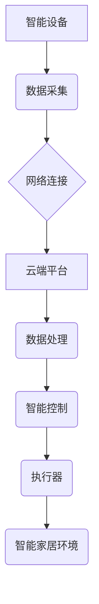

> 智能家居, Java, 云端平台, 物联网, RESTful API, 消息队列, 安全

## 1. 背景介绍

智能家居已成为现代生活的重要组成部分，它通过将各种智能设备连接到网络，实现对家居环境的自动化控制和智能化管理。随着物联网技术的快速发展和普及，智能家居市场呈现出爆发式增长趋势。

Java作为一种成熟、稳定、跨平台的编程语言，在构建智能家居系统中发挥着重要作用。其丰富的框架和库，以及强大的社区支持，为智能家居开发提供了坚实的基础。

## 2. 核心概念与联系

### 2.1 智能家居架构

智能家居系统通常由以下几个核心组件组成：

* **智能设备:** 包括传感器、执行器、智能控制器等，负责感知环境信息和执行控制指令。
* **网络连接:** 用于连接智能设备和云端平台，实现数据传输和远程控制。
* **云端平台:** 提供数据存储、处理、分析和应用服务，实现智能家居的集中管理和远程控制。
* **用户界面:** 用于用户与智能家居系统交互，例如手机APP、平板电脑、语音助手等。

### 2.2 Java在智能家居中的应用

Java在智能家居系统中扮演着重要的角色，主要应用于以下方面：

* **云端平台开发:** Java EE平台提供了丰富的框架和工具，可以用于构建高性能、可扩展的云端平台。
* **智能设备驱动:** Java可以开发驱动程序，与各种智能设备进行通信和控制。
* **数据处理和分析:** Java提供了强大的数据处理和分析工具，可以用于分析智能家居设备产生的数据，并提供个性化的服务。
* **用户界面开发:** JavaFX可以用于开发跨平台的用户界面，提供用户友好的交互体验。

### 2.3  Java集成策略

为了实现Java与智能家居系统之间的有效集成，需要采用合理的集成策略。常见的集成策略包括：

* **RESTful API:** 使用RESTful API规范，实现云端平台和智能设备之间的通信。
* **消息队列:** 使用消息队列技术，实现异步通信和数据流式处理。
* **MQTT协议:** 使用MQTT协议，实现低功耗、高可靠性的设备通信。

**Mermaid 流程图**



## 3. 核心算法原理 & 具体操作步骤

### 3.1  算法原理概述

智能家居系统中，需要使用各种算法来实现智能控制、数据分析和用户体验优化。例如：

* **机器学习算法:** 用于分析用户行为模式，预测用户需求，提供个性化服务。
* **路径规划算法:** 用于智能机器人导航，规划最优路径。
* **预测算法:** 用于预测设备故障，提前进行维护。

### 3.2  算法步骤详解

以机器学习算法为例，其基本步骤包括：

1. **数据收集:** 收集智能家居设备产生的数据，例如温度、湿度、灯光状态等。
2. **数据预处理:** 对收集到的数据进行清洗、转换和特征提取。
3. **模型训练:** 使用机器学习算法训练模型，例如决策树、支持向量机等。
4. **模型评估:** 对训练好的模型进行评估，验证其准确性和性能。
5. **模型部署:** 将训练好的模型部署到云端平台，用于实时预测和控制。

### 3.3  算法优缺点

不同的算法具有不同的优缺点，需要根据具体应用场景选择合适的算法。例如：

* **决策树算法:** 易于理解和实现，但对数据特征依赖性强。
* **支持向量机算法:** 性能优异，但训练时间较长。

### 3.4  算法应用领域

机器学习算法在智能家居系统中具有广泛的应用领域，例如：

* **智能照明:** 根据用户习惯和环境光线自动调节灯光亮度。
* **智能空调:** 根据用户需求和环境温度自动调节空调温度。
* **智能安防:** 通过图像识别和行为分析，识别入侵者并报警。

## 4. 数学模型和公式 & 详细讲解 & 举例说明

### 4.1  数学模型构建

智能家居系统中，可以使用数学模型来描述设备之间的关系、用户行为模式和系统性能指标。例如：

* **温度控制模型:** 可以使用微分方程来描述房间温度随时间的变化，并根据用户设定温度进行控制。
* **用户行为模型:** 可以使用马尔科夫链来描述用户的行为模式，例如使用灯光、空调和电视的频率和时间。

### 4.2  公式推导过程

以温度控制模型为例，假设房间的热容量为C，房间的热传导系数为k，外部环境温度为T_e，房间内设备产生的热量为Q。则房间温度T的微分方程为：

$$
\frac{dT}{dt} = \frac{k}{C}(T_e - T) + \frac{Q}{C}
$$

### 4.3  案例分析与讲解

假设房间的热容量为10000J/K，房间的热传导系数为0.1W/mK，外部环境温度为20℃，房间内设备产生的热量为100W。则根据上述公式，可以计算房间温度随时间的变化趋势。

## 5. 项目实践：代码实例和详细解释说明

### 5.1  开发环境搭建

* **Java开发环境:** JDK 11 或更高版本
* **云平台:** AWS、Azure、阿里云等
* **数据库:** MySQL、PostgreSQL等

### 5.2  源代码详细实现

以下是一个简单的Java代码示例，演示如何使用RESTful API实现智能灯的控制：

```java
import javax.ws.rs.GET;
import javax.ws.rs.Path;
import javax.ws.rs.PathParam;
import javax.ws.rs.Produces;
import javax.ws.rs.core.MediaType;

@Path("/lights")
public class LightController {

    @GET
    @Path("/{id}/on")
    @Produces(MediaType.TEXT_PLAIN)
    public String turnOnLight(@PathParam("id") int id) {
        // 控制智能灯的开关状态
        return "Light " + id + " turned on";
    }

    @GET
    @Path("/{id}/off")
    @Produces(MediaType.TEXT_PLAIN)
    public String turnOffLight(@PathParam("id") int id) {
        // 控制智能灯的开关状态
        return "Light " + id + " turned off";
    }
}
```

### 5.3  代码解读与分析

* `@Path("/lights")`: 定义了资源路径为"/lights"。
* `@GET`: 定义了请求方法为GET。
* `@PathParam("id")`: 定义了路径参数"id"。
* `@Produces(MediaType.TEXT_PLAIN)`: 定义了响应内容类型为文本。
* `turnOnLight()` 和 `turnOffLight()` 方法分别控制智能灯的开关状态。

### 5.4  运行结果展示

当使用RESTful API调用上述代码时，可以控制智能灯的开关状态。例如，调用`http://localhost:8080/lights/1/on`可以打开ID为1的智能灯。

## 6. 实际应用场景

### 6.1 智能家居场景

* **智能照明:** 根据用户需求和环境光线自动调节灯光亮度和颜色，营造舒适的氛围。
* **智能空调:** 根据用户设定温度和环境温度自动调节空调温度，实现节能省电。
* **智能安防:** 通过传感器和摄像头监控家居环境，识别入侵者并报警。
* **智能家居自动化:** 通过场景设定，实现多设备联动控制，例如打开灯光、调节温度和播放音乐。

### 6.2 其他应用场景

* **远程监控:** 用户可以通过手机APP远程监控家居环境，例如查看摄像头画面、控制设备状态等。
* **数据分析:** 智能家居系统可以收集和分析用户行为数据，提供个性化服务和生活建议。
* **医疗保健:** 智能家居系统可以帮助老人和病人远程监测健康状况，并提供必要的提醒和帮助。

### 6.4  未来应用展望

随着物联网技术的不断发展，智能家居系统将更加智能化、个性化和安全化。未来，智能家居系统将更加深入地融入人们的生活，为人们提供更加便捷、舒适和安全的居住体验。

## 7. 工具和资源推荐

### 7.1  学习资源推荐

* **Java官方文档:** https://docs.oracle.com/javase/tutorial/
* **Spring Boot官方文档:** https://spring.io/projects/spring-boot
* **RESTful API规范:** https://www.restapitutorial.com/

### 7.2  开发工具推荐

* **Eclipse IDE:** https://www.eclipse.org/
* **IntelliJ IDEA:** https://www.jetbrains.com/idea/
* **Maven:** https://maven.apache.org/

### 7.3  相关论文推荐

* **A Survey of Smart Home Technologies and Applications:** https://ieeexplore.ieee.org/document/8097707
* **Smart Home Security: A Comprehensive Survey:** https://ieeexplore.ieee.org/document/8907777

## 8. 总结：未来发展趋势与挑战

### 8.1  研究成果总结

本文介绍了基于Java的智能家居设计，探讨了云端智能家居平台与Java集成策略，并分析了核心算法原理、数学模型和代码实现。

### 8.2  未来发展趋势

* **人工智能技术:** 将人工智能技术应用于智能家居系统，实现更加智能化的控制和服务。
* **边缘计算:** 将计算能力部署到智能家居设备本身，实现更加快速和低延迟的响应。
* **隐私保护:** 加强智能家居系统的隐私保护机制，保障用户数据安全。

### 8.3  面临的挑战

* **系统安全性:** 智能家居系统面临着来自网络攻击和数据泄露的威胁。
* **数据隐私:** 智能家居系统收集大量用户数据，需要妥善处理和保护用户隐私。
* **标准化问题:** 智能家居行业缺乏统一的标准，导致设备互联互通性差。

### 8.4  研究展望

未来，我们将继续深入研究智能家居系统的设计、开发和应用，致力于打造更加智能、安全、便捷的智能家居体验。

## 9. 附录：常见问题与解答

### 9.1  常见问题

* **如何选择合适的Java框架构建智能家居平台？**
* **如何实现智能家居设备与云端平台之间的安全通信？**
* **如何处理智能家居系统中产生的海量数据？**

### 9.2  解答

* 选择Java框架时，需要考虑平台的规模、性能、扩展性和安全性等因素。Spring Boot是一个轻量级、易于使用的框架，适合构建小型到中型的智能家居平台。
* 可以使用TLS/SSL协议加密通信数据，并采用身份验证和授权机制来确保设备和用户的身份。
* 可以使用数据库、消息队列和云存储等技术来存储和处理智能家居系统产生的数据。


作者：禅与计算机程序设计艺术 / Zen and the Art of Computer Programming 
<end_of_turn>