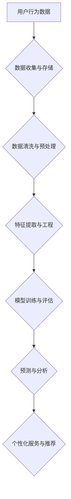

> 大数据分析，电商平台，用户行为，推荐系统，个性化服务，机器学习，深度学习

## 1. 背景介绍

随着电子商务的蓬勃发展，电商平台已成为人们购物、娱乐、社交的重要平台。用户行为数据作为电商平台的核心资产，蕴含着丰富的商业价值。通过对用户行为数据的分析，电商平台可以深入了解用户的需求、偏好和购物习惯，从而提供更精准、更个性化的服务，提升用户体验和商业效益。

然而，电商平台的用户行为数据呈海量、高维、实时变化的特点，传统的分析方法难以有效地挖掘其中的价值。大数据分析技术应运而生，为电商平台用户行为分析提供了强大的工具和手段。

## 2. 核心概念与联系

**2.1  大数据分析**

大数据分析是指利用大数据技术对海量数据进行收集、存储、处理、分析和挖掘，以发现隐藏的模式、趋势和规律，从而为决策提供支持。

**2.2  电商平台用户行为**

电商平台用户行为是指用户在电商平台上进行的所有活动，包括浏览商品、加入购物车、下单购买、评价商品、评论文章等。这些行为数据可以反映用户的兴趣、需求、购买习惯等信息。

**2.3  关系图**

大数据分析与电商平台用户行为分析之间存在着密切的联系。大数据分析技术可以帮助电商平台有效地收集、存储和处理海量用户行为数据，并通过各种分析方法挖掘其中的价值。

**2.4  Mermaid 流程图**



## 3. 核心算法原理 & 具体操作步骤

**3.1  算法原理概述**

在电商平台用户行为分析中，常用的算法包括：

* **协同过滤算法:** 基于用户的相似性或商品的相似性进行推荐。
* **基于内容的推荐算法:** 根据用户的历史行为和商品的特征进行推荐。
* **深度学习算法:** 利用深度神经网络对用户行为数据进行学习和预测。

**3.2  算法步骤详解**

以协同过滤算法为例，其具体步骤如下：

1. **数据收集:** 收集用户行为数据，例如用户对商品的评分、购买记录等。
2. **数据预处理:** 对数据进行清洗、去噪、缺失值处理等操作。
3. **用户相似度计算:** 计算用户之间的相似度，例如使用余弦相似度或皮尔逊相关系数。
4. **商品相似度计算:** 计算商品之间的相似度，例如使用余弦相似度或Jaccard系数。
5. **推荐生成:** 根据用户的相似用户或商品的相似商品进行推荐。

**3.3  算法优缺点**

* **优点:** 能够推荐用户可能感兴趣的商品，提高用户体验。
* **缺点:** 容易陷入冷启动问题，即对于新用户或新商品难以进行推荐。

**3.4  算法应用领域**

协同过滤算法广泛应用于电商平台的推荐系统、电影网站的电影推荐、音乐网站的音乐推荐等领域。

## 4. 数学模型和公式 & 详细讲解 & 举例说明

**4.1  数学模型构建**

协同过滤算法的数学模型可以表示为：

$$
r_{ui} = \sum_{j=1}^{N} w_{ij} r_{uj}
$$

其中：

* $r_{ui}$ 表示用户 $u$ 对商品 $i$ 的评分。
* $r_{uj}$ 表示用户 $u$ 对商品 $j$ 的评分。
* $w_{ij}$ 表示商品 $i$ 和商品 $j$ 之间的相似度。
* $N$ 表示所有商品的数量。

**4.2  公式推导过程**

该公式的推导过程基于以下假设：

* 用户对商品的评分具有某种规律性。
* 商品之间存在某种相似性。

**4.3  案例分析与讲解**

假设有两个用户 $u_1$ 和 $u_2$，他们都对商品 $i$ 和 $j$ 进行评分，评分结果如下：

* $r_{u_1i} = 5$
* $r_{u_1j} = 3$
* $r_{u_2i} = 4$
* $r_{u_2j} = 2$

如果我们假设商品 $i$ 和 $j$ 之间的相似度为 $0.8$，则可以使用上述公式计算用户 $u_1$ 对商品 $k$ 的评分预测值：

$$
r_{u_1k} = 0.8 \times 4 + 0.2 \times 2 = 3.6
$$

## 5. 项目实践：代码实例和详细解释说明

**5.1  开发环境搭建**

* 操作系统：Ubuntu 20.04
* Python 版本：3.8
* 必要的库：pandas, numpy, scikit-learn

**5.2  源代码详细实现**

```python
import pandas as pd
from sklearn.metrics.pairwise import cosine_similarity

# 加载用户行为数据
data = pd.read_csv('user_behavior.csv')

# 提取用户-商品评分矩阵
ratings_matrix = data.pivot_table(index='user_id', columns='product_id', values='rating')

# 计算用户相似度
user_similarity = cosine_similarity(ratings_matrix)

# 预测用户对商品的评分
def predict_rating(user_id, product_id):
    similar_users = user_similarity[user_id].argsort()[:-10:-1]  # 获取相似用户
    weighted_ratings = []
    for similar_user in similar_users:
        if ratings_matrix.loc[similar_user, product_id] is not None:
            weighted_ratings.append(ratings_matrix.loc[similar_user, product_id] * user_similarity[user_id][similar_user])
    return sum(weighted_ratings) / sum(user_similarity[user_id][similar_users])

# 示例预测
user_id = 1
product_id = 10
predicted_rating = predict_rating(user_id, product_id)
print(f'用户 {user_id} 对商品 {product_id} 的预测评分为: {predicted_rating}')
```

**5.3  代码解读与分析**

* 代码首先加载用户行为数据，并提取用户-商品评分矩阵。
* 然后使用余弦相似度计算用户之间的相似度。
* 预测用户对商品的评分时，首先获取用户相似用户，然后根据相似度加权平均用户的评分，得到预测评分。

**5.4  运行结果展示**

运行代码后，会输出用户对特定商品的预测评分。

## 6. 实际应用场景

**6.1  个性化推荐**

电商平台可以根据用户的历史行为和偏好，推荐个性化的商品，提高用户体验和转化率。

**6.2  商品分类与聚类**

通过分析用户行为数据，可以对商品进行分类和聚类，帮助用户更方便地查找和购买商品。

**6.3  用户画像分析**

通过分析用户的行为数据，可以构建用户画像，了解用户的兴趣、需求和消费习惯，为精准营销提供支持。

**6.4  未来应用展望**

随着大数据技术的不断发展，电商平台用户行为分析将更加深入和细致，能够提供更精准、更个性化的服务，例如：

* 基于用户的实时行为进行个性化推荐。
* 利用深度学习算法进行更精准的用户画像分析。
* 利用虚拟现实和增强现实技术提供更沉浸式的购物体验。

## 7. 工具和资源推荐

**7.1  学习资源推荐**

* 书籍：《Python数据科学手册》、《机器学习实战》
* 在线课程：Coursera、edX、Udacity

**7.2  开发工具推荐**

* Python
* pandas
* numpy
* scikit-learn
* TensorFlow
* PyTorch

**7.3  相关论文推荐**

* 《基于协同过滤的推荐系统》
* 《深度学习在电商推荐中的应用》

## 8. 总结：未来发展趋势与挑战

**8.1  研究成果总结**

本文介绍了大数据分析在电商平台用户行为分析中的应用，并探讨了常用的算法原理和实践案例。

**8.2  未来发展趋势**

未来，电商平台用户行为分析将更加注重以下方面：

* **实时性:** 利用流式数据处理技术，对用户的实时行为进行分析和预测。
* **个性化:** 利用深度学习算法，对用户的行为进行更精准的分析和预测，提供更个性化的服务。
* **跨平台:** 将用户行为数据整合到不同的平台，提供更全面的用户画像和分析结果。

**8.3  面临的挑战**

* **数据质量:** 用户行为数据往往存在噪声、缺失值等问题，需要进行有效的数据清洗和预处理。
* **隐私保护:** 用户行为数据包含用户的隐私信息，需要采取有效的措施保护用户的隐私。
* **算法复杂度:** 一些深度学习算法的复杂度较高，需要强大的计算资源和技术支持。

**8.4  研究展望**

未来，我们将继续深入研究大数据分析在电商平台用户行为分析中的应用，探索更先进的算法和技术，为电商平台提供更精准、更个性化的服务。

## 9. 附录：常见问题与解答

**9.1  问题:** 如何处理用户行为数据中的缺失值？

**9.2  解答:** 可以使用多种方法处理缺失值，例如：

* **删除缺失值:** 如果缺失值较少，可以删除包含缺失值的样本。
* **填充缺失值:** 可以使用均值、中位数或其他统计方法填充缺失值。
* **使用机器学习算法:** 可以使用机器学习算法预测缺失值。

**9.3  问题:** 如何保证用户行为数据的隐私安全？

**9.4  解答:** 可以采取以下措施保证用户行为数据的隐私安全：

* **数据脱敏:** 将用户敏感信息进行脱敏处理，例如替换真实姓名、身份证号码等信息。
* **数据加密:** 对用户行为数据进行加密存储和传输，防止数据泄露。
* **访问控制:** 对用户行为数据的访问进行控制，只允许授权人员访问。


作者：禅与计算机程序设计艺术 / Zen and the Art of Computer Programming 
<end_of_turn>