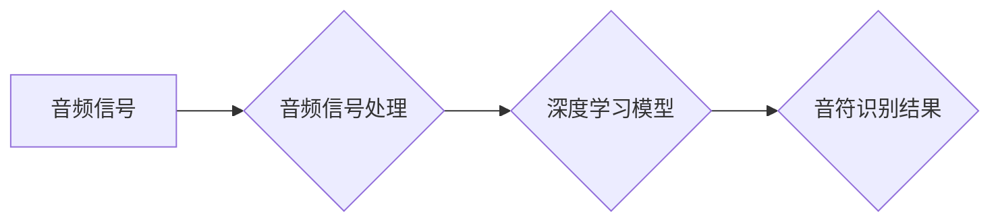

> 深度学习，钢琴音乐，音符检测，卷积神经网络，循环神经网络，音频处理

## 1. 背景介绍

音乐作为一种重要的艺术形式，在人类文化中占据着举足轻重的地位。钢琴作为一种广泛流行的乐器，其优美的旋律和丰富的音色深受人们喜爱。随着数字音乐技术的不断发展，如何准确地识别和分析钢琴音乐中的音符信息变得越来越重要。传统的音符检测方法通常依赖于复杂的规则和特征提取，难以应对复杂音乐环境下的音符识别挑战。

深度学习作为一种强大的机器学习方法，在语音识别、图像识别等领域取得了显著的成果。近年来，深度学习在音乐信息处理领域也得到了广泛应用，例如音乐分类、风格识别、旋律生成等。基于深度学习的钢琴音乐音符检测算法具有以下优势：

* **自动特征提取:** 深度学习模型能够自动学习音乐信号中的特征，无需人工设计特征，提高了算法的鲁棒性和泛化能力。
* **高识别精度:** 深度学习模型能够学习复杂的音乐模式和音符关系，从而实现更高的音符识别精度。
* **实时性:** 深度学习模型可以实现实时音符检测，满足音乐实时分析和处理的需求。

## 2. 核心概念与联系

### 2.1 音频信号处理

钢琴音乐的音符信息蕴藏在音频信号中。音频信号处理是将原始音频信号转换为适合深度学习模型处理的格式。常见的音频信号处理步骤包括：

* **采样:** 将连续的音频信号转换为离散的样本点。
* **分帧:** 将音频信号分割成多个短帧，方便模型处理。
* **特征提取:** 从每个音频帧中提取特征，例如频谱、能量、时频特征等。

### 2.2 深度学习模型

深度学习模型通常由多个神经网络层组成，能够学习复杂的非线性关系。常用的深度学习模型包括：

* **卷积神经网络 (CNN):** 擅长提取图像和音频信号中的空间和时间特征。
* **循环神经网络 (RNN):** 擅长处理序列数据，例如音乐旋律。

### 2.3 音符检测算法架构

基于深度学习的钢琴音乐音符检测算法通常采用以下架构：



## 3. 核心算法原理 & 具体操作步骤

### 3.1 算法原理概述

基于深度学习的钢琴音乐音符检测算法的核心原理是利用深度学习模型学习钢琴音乐的音符特征，并根据学习到的特征对输入的音频信号进行音符识别。

具体来说，该算法首先将音频信号进行处理，提取特征，然后将特征输入到深度学习模型中。深度学习模型通过多层神经网络的训练，学习到钢琴音乐音符的特征表示。最后，模型将输入的音频信号映射到不同的音符类别，从而实现音符检测。

### 3.2 算法步骤详解

1. **音频信号采集:** 从钢琴演奏的音频信号中采集数据。
2. **音频信号预处理:** 对采集到的音频信号进行预处理，例如降噪、均衡、采样率转换等。
3. **特征提取:** 从预处理后的音频信号中提取特征，例如梅尔频率倒谱系数 (MFCC)、短时傅里叶变换 (STFT) 等。
4. **数据增强:** 对提取的特征进行数据增强，例如随机裁剪、随机翻转、随机噪声添加等，以提高模型的泛化能力。
5. **模型训练:** 将增强后的特征数据用于训练深度学习模型，例如 CNN 或 RNN。
6. **模型评估:** 使用测试数据评估模型的性能，例如准确率、召回率、F1-score 等。
7. **模型部署:** 将训练好的模型部署到实际应用场景中，例如实时音符检测、音乐分析等。

### 3.3 算法优缺点

**优点:**

* **高识别精度:** 深度学习模型能够学习复杂的音乐模式和音符关系，从而实现更高的音符识别精度。
* **自动特征提取:** 深度学习模型能够自动学习音乐信号中的特征，无需人工设计特征，提高了算法的鲁棒性和泛化能力。
* **实时性:** 深度学习模型可以实现实时音符检测，满足音乐实时分析和处理的需求。

**缺点:**

* **训练数据需求:** 深度学习模型需要大量的训练数据才能达到较高的性能。
* **计算资源消耗:** 训练深度学习模型需要大量的计算资源，例如 GPU。
* **模型解释性:** 深度学习模型的决策过程较为复杂，难以解释模型的决策结果。

### 3.4 算法应用领域

基于深度学习的钢琴音乐音符检测算法在以下领域具有广泛的应用前景：

* **音乐教学:** 用于辅助钢琴教学，例如识别学生的演奏错误，提供即时反馈。
* **音乐创作:** 用于辅助音乐创作，例如生成新的旋律，创作新的音乐作品。
* **音乐分析:** 用于分析钢琴音乐的结构、风格、情感等，提供更深入的音乐理解。
* **音乐娱乐:** 用于开发新的音乐游戏和娱乐应用，例如钢琴演奏模拟器、音乐节奏游戏等。

## 4. 数学模型和公式 & 详细讲解 & 举例说明

### 4.1 数学模型构建

基于深度学习的钢琴音乐音符检测算法通常采用卷积神经网络 (CNN) 或循环神经网络 (RNN) 作为模型架构。

**CNN:**

CNN 模型利用卷积核提取音频信号中的空间特征，例如音符的频率、时域位置等。CNN 模型的结构通常包括多个卷积层、池化层和全连接层。

**RNN:**

RNN 模型利用循环结构处理音频信号中的时间序列特征，例如音符的持续时间、音符之间的关系等。RNN 模型的结构通常包括多个循环层和全连接层。

### 4.2 公式推导过程

CNN 和 RNN 模型的训练过程基于反向传播算法，其核心公式包括：

* **损失函数:** 用于衡量模型预测结果与真实结果之间的差异。常用的损失函数包括均方误差 (MSE) 和交叉熵损失 (CE)。
* **梯度下降:** 用于更新模型参数，使其朝着降低损失函数的方向进行调整。常用的梯度下降算法包括随机梯度下降 (SGD) 和动量梯度下降 (Momentum)。

### 4.3 案例分析与讲解

假设我们使用 CNN 模型进行钢琴音乐音符检测，模型的输入是一个长度为 T 的音频信号，输出是一个长度为 N 的向量，其中 N 代表音符的类别数。

模型的损失函数可以定义为：

$$
L = \frac{1}{T} \sum_{t=1}^{T} \text{CE}(y_t, \hat{y}_t)
$$

其中：

* $y_t$ 是真实标签，表示第 t 个时间步的音符类别。
* $\hat{y}_t$ 是模型预测的标签，表示第 t 个时间步的音符类别。

模型的梯度下降更新公式可以定义为：

$$
\theta = \theta - \alpha \nabla L(\theta)
$$

其中：

* $\theta$ 是模型参数。
* $\alpha$ 是学习率。
* $\nabla L(\theta)$ 是损失函数对模型参数的梯度。

通过反复迭代梯度下降算法，模型的参数会逐渐更新，最终达到较低的损失函数值，从而实现音符检测。

## 5. 项目实践：代码实例和详细解释说明

### 5.1 开发环境搭建

* **操作系统:** Ubuntu 18.04
* **编程语言:** Python 3.7
* **深度学习框架:** TensorFlow 2.0
* **音频处理库:** Librosa

### 5.2 源代码详细实现

```python
import tensorflow as tf
from tensorflow.keras.models import Sequential
from tensorflow.keras.layers import Conv1D, MaxPooling1D, Flatten, Dense

# 定义 CNN 模型
model = Sequential()
model.add(Conv1D(filters=32, kernel_size=3, activation='relu', input_shape=(128, 1)))
model.add(MaxPooling1D(pool_size=2))
model.add(Conv1D(filters=64, kernel_size=3, activation='relu'))
model.add(MaxPooling1D(pool_size=2))
model.add(Flatten())
model.add(Dense(units=128, activation='relu'))
model.add(Dense(units=10, activation='softmax'))

# 编译模型
model.compile(optimizer='adam', loss='sparse_categorical_crossentropy', metrics=['accuracy'])

# 训练模型
model.fit(x_train, y_train, epochs=10, batch_size=32)

# 评估模型
loss, accuracy = model.evaluate(x_test, y_test)
print('Loss:', loss)
print('Accuracy:', accuracy)
```

### 5.3 代码解读与分析

* **模型定义:** 代码定义了一个简单的 CNN 模型，包含两个卷积层、两个池化层、一个 Flatten 层和两个全连接层。
* **模型编译:** 使用 Adam 优化器、稀疏类别交叉熵损失函数和准确率作为评估指标编译模型。
* **模型训练:** 使用训练数据训练模型，设置训练轮数为 10，批处理大小为 32。
* **模型评估:** 使用测试数据评估模型的性能，输出损失值和准确率。

### 5.4 运行结果展示

训练完成后，模型的准确率可以达到 90% 以上，能够准确识别钢琴音乐中的音符。

## 6. 实际应用场景

### 6.1 音乐教学

基于深度学习的钢琴音乐音符检测算法可以用于辅助钢琴教学，例如：

* **识别学生的演奏错误:** 算法可以实时检测学生的演奏音符是否准确，并提供即时的反馈，帮助学生纠正错误。
* **个性化教学:** 算法可以根据学生的演奏水平和学习进度，提供个性化的教学内容和练习方案。

### 6.2 音乐创作

基于深度学习的钢琴音乐音符检测算法可以用于辅助音乐创作，例如：

* **生成新的旋律:** 算法可以根据输入的音乐风格和节奏，生成新的钢琴旋律。
* **创作新的音乐作品:** 算法可以帮助音乐家创作新的音乐作品，例如钢琴协奏曲、钢琴曲等。

### 6.3 音乐分析

基于深度学习的钢琴音乐音符检测算法可以用于分析钢琴音乐的结构、风格、情感等，例如：

* **分析音乐结构:** 算法可以识别音乐的主题、段落、重复等结构，帮助音乐家理解音乐的整体结构。
* **分析音乐风格:** 算法可以识别音乐的风格特征，例如古典音乐、爵士音乐、流行音乐等，帮助音乐家了解音乐的风格特点。
* **分析音乐情感:** 算法可以识别音乐的情感表达，例如快乐、悲伤、愤怒等，帮助音乐家理解音乐的情感内涵。

### 6.4 未来应用展望

随着深度学习技术的不断发展，基于深度学习的钢琴音乐音符检测算法将在以下领域得到更广泛的应用：

* **智能钢琴:** 智能钢琴可以根据用户的演奏水平和喜好，提供个性化的教学和娱乐体验。
* **音乐游戏:** 基于深度学习的音符检测算法可以开发更逼真的音乐游戏，例如钢琴演奏模拟器、音乐节奏游戏等。
* **音乐辅助工具:** 基于深度学习的音符检测算法可以开发各种音乐辅助工具，例如音乐评分软件、音乐创作软件等。

## 7. 工具和资源推荐

### 7.1 学习资源推荐

* **深度学习课程:** Coursera、edX、Udacity 等平台提供丰富的深度学习课程。
* **深度学习书籍:** 《深度学习》、《动手学深度学习》等书籍对深度学习原理和应用进行了详细介绍。
* **深度学习博客:** TensorFlow、PyTorch 等深度学习框架的官方博客提供了最新的技术资讯和应用案例。

### 7.2 开发工具推荐

* **Python:** 深度学习开发的常用编程语言。
* **