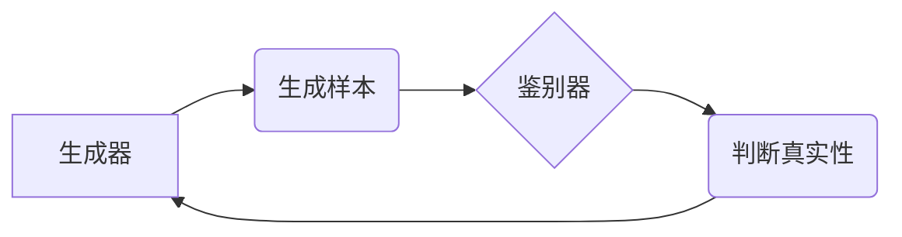

> 生成对抗网络 (GAN)，图像风格迁移，效果评价，评价指标，主观评价，客观评价

## 1. 背景介绍

图像风格迁移技术近年来备受关注，它能够将一种图像的风格迁移到另一幅图像上，创造出具有独特艺术效果的图像。这种技术在艺术创作、图像编辑、电影特效等领域有着广泛的应用前景。

生成对抗网络 (GAN) 作为一种强大的生成模型，在图像风格迁移领域取得了显著的成果。GAN 由一个生成器 (Generator) 和一个鉴别器 (Discriminator) 组成，它们在对抗博弈中相互竞争，最终生成逼真的图像。

然而，由于图像风格迁移任务的复杂性，如何客观地评价图像风格迁移的效果仍然是一个挑战。现有的评价方法主要分为主观评价和客观评价两类。主观评价依赖于人类的视觉判断，虽然能够反映图像的艺术性和美感，但其结果具有主观性，难以量化。客观评价则通过计算图像的特征差异、结构相似度等指标来评估图像风格迁移的效果，但这些指标往往难以完全捕捉到图像的艺术性和美感。

因此，建立一个全面、客观、有效的图像风格迁移效果评价体系是十分必要的。

## 2. 核心概念与联系

### 2.1 生成对抗网络 (GAN)

GAN 由 Ian Goodfellow 等人于 2014 年提出，是一种基于对抗博弈的生成模型。GAN 由两个神经网络组成：

* **生成器 (Generator):** 负责生成新的数据样本，例如图像。
* **鉴别器 (Discriminator):** 负责判断数据样本是真实数据还是生成数据。

生成器和鉴别器在对抗博弈中相互竞争。生成器试图生成逼真的数据样本，以欺骗鉴别器；而鉴别器则试图准确地识别真实数据和生成数据。

GAN 的训练过程可以看作是一个博弈过程：

1. 生成器生成一个新的数据样本。
2. 鉴别器对该样本进行判断，并给出真实性分数。
3. 根据鉴别器的反馈，生成器更新其参数，以生成更逼真的样本。
4. 鉴别器也根据生成器的输出进行更新，以提高其识别能力。

这个过程不断重复，直到生成器能够生成与真实数据几乎 indistinguishable 的样本。



### 2.2 图像风格迁移

图像风格迁移是指将一种图像的风格迁移到另一幅图像上，保留目标图像的内容，同时融入源图像的风格特征。

常见的图像风格迁移方法包括：

* **神经风格迁移:** 利用深度神经网络提取图像的风格特征，并将其应用于目标图像。
* **传统图像处理方法:** 利用图像滤波、纹理合成等传统图像处理技术实现风格迁移。

## 3. 核心算法原理 & 具体操作步骤

### 3.1 算法原理概述

基于生成对抗网络的图像风格迁移算法的核心思想是利用 GAN 的对抗训练机制，生成具有目标图像内容和源图像风格的合成图像。

具体来说，该算法通常包含以下几个步骤：

1. **特征提取:** 利用预训练的卷积神经网络提取源图像和目标图像的特征。
2. **风格损失函数:** 定义一个风格损失函数，用于衡量合成图像的风格与源图像风格之间的差异。
3. **内容损失函数:** 定义一个内容损失函数，用于衡量合成图像的内容与目标图像之间的差异。
4. **对抗损失函数:** 定义一个对抗损失函数，用于衡量生成器生成的图像是否能够欺骗鉴别器。
5. **训练过程:** 利用上述损失函数，训练生成器和鉴别器，最终生成具有目标图像内容和源图像风格的合成图像。

### 3.2 算法步骤详解

1. **数据准备:** 准备源图像和目标图像数据集。
2. **网络架构设计:** 设计生成器和鉴别器的网络架构。
3. **损失函数定义:** 定义风格损失函数、内容损失函数和对抗损失函数。
4. **模型训练:** 利用训练数据训练生成器和鉴别器，优化损失函数。
5. **图像生成:** 将目标图像作为输入，利用训练好的生成器生成具有目标图像内容和源图像风格的合成图像。

### 3.3 算法优缺点

**优点:**

* 可以生成具有高质量的风格迁移效果。
* 可以控制风格迁移的程度。

**缺点:**

* 训练过程复杂，需要大量的计算资源。
* 难以控制生成图像的细节。

### 3.4 算法应用领域

* **艺术创作:** 生成具有独特艺术风格的图像。
* **图像编辑:** 将图像风格迁移到其他风格，例如将照片风格迁移到油画风格。
* **电影特效:** 生成具有特定风格的场景和人物。

## 4. 数学模型和公式 & 详细讲解 & 举例说明

### 4.1 数学模型构建

**4.1.1 风格损失函数:**

风格损失函数用于衡量合成图像的风格与源图像风格之间的差异。常用的风格损失函数是基于 Gram矩阵的，它计算了图像特征图的协方差矩阵之间的差异。

假设源图像的特征图为 $X_s$, 合成图像的特征图为 $X_g$, 则风格损失函数可以表示为：

$$
L_{style} = \frac{1}{N} \sum_{i=1}^{N} ||G(X_s)_i - G(X_g)_i||^2
$$

其中，$G$ 是卷积神经网络，$N$ 是特征图的数量。

**4.1.2 内容损失函数:**

内容损失函数用于衡量合成图像的内容与目标图像之间的差异。常用的内容损失函数是基于像素值的，它计算了合成图像和目标图像之间的均方误差。

$$
L_{content} = \frac{1}{M} \sum_{i=1}^{M} ||F(X_t)_i - F(X_g)_i||^2
$$

其中，$F$ 是卷积神经网络，$X_t$ 是目标图像，$M$ 是像素的数量。

**4.1.3 对抗损失函数:**

对抗损失函数用于衡量生成器生成的图像是否能够欺骗鉴别器。常用的对抗损失函数是基于二分类交叉熵损失函数的。

$$
L_{adv} = - \log(D(G(X_t)))
$$

其中，$D$ 是鉴别器，$G$ 是生成器。

### 4.2 公式推导过程

上述公式的推导过程主要基于以下几个假设：

* 训练数据是独立同分布的。
* 生成器和鉴别器都是神经网络。
* 损失函数是可微分的。

### 4.3 案例分析与讲解

假设我们想要将梵高的风格迁移到一张风景照片上。

1. 我们首先需要选择一个预训练的卷积神经网络，例如 VGG19，作为特征提取网络。
2. 然后，我们使用 VGG19 的不同层提取源图像（梵高的画作）和目标图像（风景照片）的特征。
3. 我们定义风格损失函数，计算源图像和合成图像特征之间的差异。
4. 我们定义内容损失函数，计算目标图像和合成图像像素之间的差异。
5. 我们定义对抗损失函数，计算生成器生成的图像是否能够欺骗鉴别器。
6. 最后，我们利用上述损失函数，训练生成器和鉴别器，最终生成具有目标图像内容和梵高风格的合成图像。

## 5. 项目实践：代码实例和详细解释说明

### 5.1 开发环境搭建

* 操作系统：Windows/macOS/Linux
* Python 版本：3.6+
* 必要的库：TensorFlow/PyTorch、OpenCV、NumPy

### 5.2 源代码详细实现

```python
# 导入必要的库
import tensorflow as tf
from tensorflow.keras.layers import Input, Conv2D, MaxPooling2D, Flatten, Dense
from tensorflow.keras.models import Model

# 定义生成器网络
def build_generator(input_shape):
    # ...

# 定义鉴别器网络
def build_discriminator(input_shape):
    # ...

# 定义损失函数
def define_loss(real_output, fake_output):
    # ...

# 定义训练过程
def train(generator, discriminator, dataset):
    # ...

# 训练模型
generator = build_generator(input_shape)
discriminator = build_discriminator(input_shape)
train(generator, discriminator, dataset)
```

### 5.3 代码解读与分析

* **生成器网络:** 生成器网络负责生成具有目标图像内容和源图像风格的合成图像。
* **鉴别器网络:** 鉴别器网络负责判断图像是否为真实图像或生成图像。
* **损失函数:** 损失函数用于衡量生成器和鉴别器的性能。
* **训练过程:** 训练过程包括生成器和鉴别器的训练，以及损失函数的更新。

### 5.4 运行结果展示

运行代码后，可以生成具有目标图像内容和源图像风格的合成图像。

## 6. 实际应用场景

### 6.1 艺术创作

* 生成具有独特艺术风格的图像。
* 创作新的艺术作品。

### 6.2 图像编辑

* 将图像风格迁移到其他风格，例如将照片风格迁移到油画风格。
* 增强图像的艺术效果。

### 6.3 电影特效

* 生成具有特定风格的场景和人物。
* 提升电影特效的质量。

### 6.4 未来应用展望

* **个性化图像风格迁移:** 根据用户的喜好生成个性化的风格迁移效果。
* **跨域风格迁移:** 将不同领域风格迁移到其他领域，例如将绘画风格迁移到摄影。
* **动态图像风格迁移:** 生成具有动态风格变化的图像。

## 7. 工具和资源推荐

### 7.1 学习资源推荐

* **书籍:**
    * 《深度学习》
    * 《生成对抗网络》
* **在线课程:**
    * Coursera: 深度学习
    * Udacity: 生成对抗网络

### 7.2 开发工具推荐

* **TensorFlow:** 开源深度学习框架。
* **PyTorch:** 开源深度学习框架。
* **Keras:** 高级深度学习API。

### 7.3 相关论文推荐

* **Generative Adversarial Networks**
* **Image Style Transfer Using Convolutional Neural Networks**

## 8. 总结：未来发展趋势与挑战

### 8.1 研究成果总结

基于生成对抗网络的图像风格迁移技术取得了显著的成果，能够生成具有高质量的风格迁移效果。

### 8.2 未来发展趋势

* **提高生成图像的质量:** 探索新的网络架构和训练方法，以生成更逼真的图像。
* **增强风格迁移的控制性:** 开发新的方法，能够更精确地控制风格迁移的程度和方向。
* **拓展风格迁移的应用场景:** 将风格迁移技术应用于更多领域，例如视频风格迁移、3D模型风格迁移等。

### 8.3 面临的挑战

* **训练过程复杂:** 训练生成对抗网络需要大量的计算资源和时间。
* **难以控制生成图像的细节:** 生成图像的细节往往难以控制，可能出现模糊、失真等问题。
* **数据依赖性:** 生成对抗网络的性能依赖于训练数据的质量和数量。

### 8.4 研究展望

未来，我们将继续探索基于生成对抗网络的图像风格迁移技术，致力于提高生成图像的质量、增强风格迁移的控制性，并拓展其应用场景。


## 9. 附录：常见问题与解答

**Q1: 如何选择合适的风格迁移模型？**

**A1:** 选择合适的风格迁移模型需要根据具体的应用场景和需求进行选择。

**Q2: 如何控制风格迁移的程度？**

**A2:** 可以通过调整风格损失函数的权重来控制风格迁移的程度。

**Q3: 如何解决