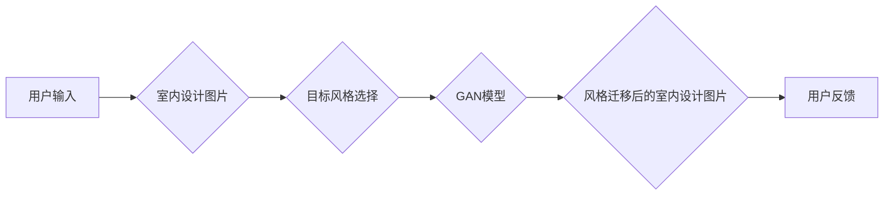

> 生成对抗网络 (GAN)，室内设计，风格迁移，图像生成，深度学习

## 1. 背景介绍

室内设计是一个充满创意和艺术性的领域，设计师需要根据客户的需求和喜好，将空间转化为舒适、美观、功能齐全的场所。然而，传统的室内设计流程往往耗时费力，需要设计师花费大量时间和精力进行草图绘制、模型制作和材料选择等工作。近年来，随着人工智能技术的快速发展，深度学习算法在图像生成、风格迁移等领域取得了突破性进展，为室内设计领域带来了新的机遇。

基于生成对抗网络 (GAN) 的室内设计风格迁移工具，能够帮助设计师快速、高效地实现室内空间风格的转换。该工具可以根据用户提供的室内设计图片和目标风格，生成符合目标风格的室内设计效果图，从而简化设计流程，提高设计效率。

## 2. 核心概念与联系

### 2.1 生成对抗网络 (GAN)

生成对抗网络 (GAN) 是一种由两个神经网络相互对抗的生成模型。GAN 由一个生成器 (Generator) 和一个鉴别器 (Discriminator) 组成。生成器负责生成新的数据样本，而鉴别器负责判断数据样本是真实数据还是生成数据。

生成器和鉴别器在对抗博弈中不断学习和改进。生成器试图生成越来越逼真的数据样本，而鉴别器试图识别越来越多的生成数据样本。最终，生成器能够生成与真实数据样本几乎 indistinguishable 的数据样本。

### 2.2 风格迁移

风格迁移是指将一种图像的风格迁移到另一幅图像上，保留目标图像的内容。例如，将梵高的绘画风格迁移到一张风景照片上，或者将现代艺术风格迁移到一张肖像照片上。

### 2.3 室内设计风格

室内设计风格是指室内空间的整体风格和氛围，通常由多种因素决定，例如建筑风格、家具风格、色彩搭配、装饰元素等。常见的室内设计风格包括现代简约、北欧风、中式古典、美式乡村等。

### 2.4 核心架构



## 3. 核心算法原理 & 具体操作步骤

### 3.1 算法原理概述

基于 GAN 的室内设计风格迁移工具，通常采用以下算法原理：

1. **特征提取:** 使用卷积神经网络 (CNN) 从输入的室内设计图片中提取特征，并将其表示为一个特征向量。

2. **风格编码:** 将目标风格的特征向量编码为一个风格向量。

3. **风格迁移:** 将提取的特征向量与风格向量进行融合，生成风格迁移后的特征向量。

4. **图像重建:** 使用解码器网络将风格迁移后的特征向量重建为风格迁移后的室内设计图片。

### 3.2 算法步骤详解

1. **数据准备:** 收集大量室内设计图片和对应的风格标签，并进行数据预处理，例如图像裁剪、尺寸调整、数据增强等。

2. **模型训练:** 使用 GAN 模型训练，训练过程中，生成器生成风格迁移后的室内设计图片，鉴别器判断图片的真实性。

3. **风格迁移:** 将用户提供的室内设计图片和目标风格输入到训练好的 GAN 模型中，模型会生成风格迁移后的室内设计图片。

4. **结果展示:** 将生成的风格迁移后的室内设计图片展示给用户，并提供用户反馈机制。

### 3.3 算法优缺点

**优点:**

* 可以实现高质量的风格迁移效果。
* 可以快速、高效地生成风格迁移后的室内设计图片。
* 可以根据用户的需求，灵活选择不同的风格进行迁移。

**缺点:**

* 需要大量的训练数据。
* 模型训练过程复杂，需要较高的计算资源。
* 可能会出现风格迁移效果不理想的情况，例如过度融合或风格失真。

### 3.4 算法应用领域

* 室内设计行业: 快速生成不同风格的室内设计效果图，帮助设计师进行创意探索和方案设计。
* 家居装修行业: 为用户提供个性化的家居装修方案，根据用户的喜好和风格需求，生成相应的装修效果图。
* 游戏开发行业: 为游戏场景生成不同风格的建筑和环境，丰富游戏场景的视觉效果。

## 4. 数学模型和公式 & 详细讲解 & 举例说明

### 4.1 数学模型构建

GAN 模型由两个神经网络组成：生成器 (G) 和鉴别器 (D)。

* **生成器 (G):** 接收噪声向量 z 作为输入，生成与真实数据样本相似的合成数据样本 x。

* **鉴别器 (D):** 接收数据样本 x 作为输入，判断 x 是真实数据样本还是合成数据样本。

### 4.2 公式推导过程

* **生成器损失函数:**

$$
L_G(G, D) = E_{z \sim p_z(z)}[ -log(D(G(z))) ]
$$

* **鉴别器损失函数:**

$$
L_D(D, G) = E_{x \sim p_{data}(x)}[log(D(x))] + E_{z \sim p_z(z)}[log(1 - D(G(z)))]
$$

其中:

* $p_z(z)$ 是噪声向量 z 的分布。
* $p_{data}(x)$ 是真实数据样本 x 的分布。

### 4.3 案例分析与讲解

假设我们想要将一张现代简约风格的室内设计图片迁移到北欧风风格。

1. 我们需要收集大量现代简约风格和北欧风风格的室内设计图片，并进行数据预处理。

2. 我们使用 GAN 模型训练，生成器学习生成北欧风风格的室内设计图片，鉴别器学习区分真实北欧风风格图片和生成图片。

3. 训练完成后，我们将用户提供的现代简约风格的室内设计图片输入到训练好的 GAN 模型中，模型会生成风格迁移后的北欧风风格的室内设计图片。

## 5. 项目实践：代码实例和详细解释说明

### 5.1 开发环境搭建

* 操作系统: Ubuntu 20.04
* Python 版本: 3.8
* 深度学习框架: TensorFlow 2.x

### 5.2 源代码详细实现

```python
# 生成器模型
def build_generator(input_shape):
    # ...

# 鉴别器模型
def build_discriminator(input_shape):
    # ...

# 训练循环
for epoch in range(num_epochs):
    # ...

# 风格迁移
def style_transfer(input_image, target_style):
    # ...
```

### 5.3 代码解读与分析

* 生成器模型负责生成风格迁移后的室内设计图片。
* 鉴别器模型负责判断图片的真实性。
* 训练循环中，生成器和鉴别器在对抗博弈中不断学习和改进。
* 风格迁移函数将用户提供的室内设计图片和目标风格输入到训练好的 GAN 模型中，生成风格迁移后的室内设计图片。

### 5.4 运行结果展示

* 展示风格迁移后的室内设计图片，并与原始图片进行对比。

## 6. 实际应用场景

### 6.1 室内设计公司

* 快速生成不同风格的室内设计效果图，帮助设计师进行创意探索和方案设计。
* 为客户提供个性化的家居装修方案，根据用户的喜好和风格需求，生成相应的装修效果图。

### 6.2 家具制造商

* 使用风格迁移技术，将家具设计风格迁移到不同的室内设计风格中，丰富家具产品线。
* 为客户提供个性化的家具定制服务，根据用户的喜好和风格需求，生成相应的家具设计方案。

### 6.3 游戏开发公司

* 为游戏场景生成不同风格的建筑和环境，丰富游戏场景的视觉效果。
* 为玩家提供个性化的游戏体验，根据玩家的喜好和风格需求，生成相应的游戏场景。

### 6.4 未来应用展望

* 结合虚拟现实 (VR) 和增强现实 (AR) 技术，实现沉浸式的室内设计体验。
* 利用人工智能技术，自动生成室内设计方案，并提供个性化的设计建议。
* 将风格迁移技术应用于其他领域，例如服装设计、艺术创作等。

## 7. 工具和资源推荐

### 7.1 学习资源推荐

* **书籍:**
    * 《深度学习》 - Ian Goodfellow, Yoshua Bengio, Aaron Courville
    * 《Generative Adversarial Networks》 - Ian Goodfellow
* **在线课程:**
    * Coursera: Deep Learning Specialization
    * Udacity: Deep Learning Nanodegree

### 7.2 开发工具推荐

* **深度学习框架:** TensorFlow, PyTorch
* **图像处理库:** OpenCV, Pillow
* **可视化工具:** Matplotlib, Seaborn

### 7.3 相关论文推荐

* **Generative Adversarial Networks** - Ian Goodfellow et al. (2014)
* **Style Transfer Using Convolutional Neural Networks** - Leon A. Gatys et al. (2015)
* **Deep Image Prior** -  A. Ulyanov et al. (2018)

## 8. 总结：未来发展趋势与挑战

### 8.1 研究成果总结

基于 GAN 的室内设计风格迁移工具，在图像生成、风格迁移等领域取得了显著进展，为室内设计行业带来了新的机遇。

### 8.2 未来发展趋势

* **更高质量的风格迁移效果:** 研究更先进的 GAN 模型架构和训练方法，提高风格迁移效果的质量和逼真度。
* **更灵活的风格迁移方式:** 研究能够支持多种风格迁移方式的工具，例如局部风格迁移、渐进式风格迁移等。
* **更个性化的室内设计体验:** 利用人工智能技术，根据用户的喜好和风格需求，自动生成个性化的室内设计方案。

### 8.3 面临的挑战

* **数据获取和标注:** 训练高质量的 GAN 模型需要大量的标注数据，数据获取和标注成本较高。
* **模型训练复杂度:** GAN 模型训练过程复杂，需要较高的计算资源和专业知识。
* **风格迁移效果的控制:** 难以完全控制风格迁移的效果，可能会出现风格过度融合或失真等问题。

### 8.4 研究展望

未来，我们将继续研究基于 GAN 的室内设计风格迁移工具，探索更先进的算法和技术，为室内设计行业提供更智能、更便捷、更个性化的解决方案。

## 9. 附录：常见问题与解答

* **Q1: 如何选择合适的 GAN 模型架构？**

* **A1:** 选择合适的 GAN 模型架构取决于具体的应用场景和数据特点。常见的 GAN 模型架构包括 DCGAN, CycleGAN, Pix2Pix 等。

* **Q2: 如何解决 GAN 模型训练不稳定问题？**

* **A2:** GAN 模型训练不稳定是常见的现象，可以通过调整学习率、使用更好的优化算法、增加训练数据等方法进行解决。

* **Q3: 如何评估风格迁移效果？**

* **A3:** 可以使用多种指标来评估风格迁移效果，例如感知质量评估 (PSNR)、结构相似度 (SSIM) 和用户主观评价等。


作者：禅与计算机程序设计艺术 / Zen and the Art of Computer Programming 
<end_of_turn>