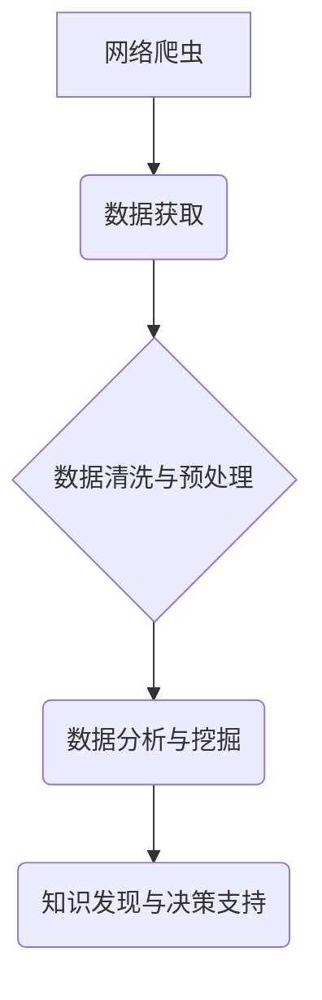

> 网络爬虫，数据分析，计算机岗位，人工智能，机器学习，数据科学，职业发展，未来趋势

## 1. 背景介绍

随着科技的飞速发展，人工智能、机器学习等新兴技术蓬勃发展，对计算机人才的需求量持续增长。而网络爬虫技术作为数据获取的重要手段，在数据分析、人工智能训练等领域发挥着越来越重要的作用。本文将基于网络爬虫与数据分析技术，对计算机岗位的前景进行深入分析，探讨未来发展趋势和挑战。

## 2. 核心概念与联系

**2.1 网络爬虫**

网络爬虫（Web Crawler）是一种自动访问和抓取网页内容的软件程序。它通过模拟用户的浏览行为，访问网站链接，获取网页文本、图片、视频等数据。网络爬虫广泛应用于搜索引擎、数据挖掘、市场调研等领域。

**2.2 数据分析**

数据分析是指通过收集、清洗、整理、分析和挖掘数据，以发现数据中的规律、趋势和价值。数据分析技术可以帮助企业更好地了解用户行为、市场趋势、产品性能等，从而做出更明智的决策。

**2.3 核心概念联系**

网络爬虫和数据分析是相互关联的两个重要技术。网络爬虫可以为数据分析提供数据源，而数据分析可以帮助我们更好地理解和利用爬取到的数据。



## 3. 核心算法原理 & 具体操作步骤

**3.1 算法原理概述**

网络爬虫的核心算法主要包括：

* **种子URL生成:** 爬虫从初始的种子URL开始，通过解析网页链接，获取新的URL。
* **URL过滤:** 爬虫会根据预设的规则过滤掉不需要抓取的URL，例如重复URL、恶意URL等。
* **网页抓取:** 爬虫使用HTTP协议访问网页，获取网页内容。
* **数据解析:** 爬虫使用正则表达式、HTML解析器等工具解析网页内容，提取目标数据。
* **数据存储:** 爬虫将抓取到的数据存储到数据库、文件等存储介质中。

**3.2 算法步骤详解**

1. **启动爬虫:** 设置爬虫的运行参数，例如目标网站、抓取深度、抓取频率等。
2. **生成种子URL:** 确定初始的种子URL，例如目标网站的主页URL。
3. **URL队列:** 将种子URL放入URL队列中，等待爬虫抓取。
4. **抓取网页:** 爬虫从URL队列中取出一个URL，访问该URL，获取网页内容。
5. **URL过滤:** 对抓取到的网页链接进行过滤，保留需要抓取的链接，并将它们放入URL队列中。
6. **数据解析:** 使用解析器解析网页内容，提取目标数据。
7. **数据存储:** 将提取到的数据存储到数据库或文件。
8. **重复步骤4-7:** 直到URL队列为空或达到抓取深度限制。

**3.3 算法优缺点**

**优点:**

* **自动化:** 网络爬虫可以自动抓取大量数据，节省人力成本。
* **效率高:** 爬虫可以并行抓取多个网页，提高抓取效率。
* **数据丰富:** 爬虫可以抓取各种类型的网页数据，例如文本、图片、视频等。

**缺点:**

* **容易被封锁:** 网站可能会对爬虫进行封锁，限制爬虫的访问频率或抓取范围。
* **数据质量问题:** 爬取到的数据可能存在格式错误、重复数据等问题，需要进行清洗和处理。
* **法律风险:** 爬取网站数据需要遵守相关法律法规，避免侵犯网站的版权或隐私。

**3.4 算法应用领域**

网络爬虫技术广泛应用于以下领域:

* **搜索引擎:** 用于抓取网页内容，构建索引，实现搜索功能。
* **数据挖掘:** 用于收集大量数据，用于分析和挖掘数据中的规律和趋势。
* **市场调研:** 用于收集竞争对手信息、用户行为数据等，帮助企业进行市场分析和决策。
* **价格监测:** 用于监控商品价格变化，帮助消费者找到优惠商品。
* **社交媒体分析:** 用于收集社交媒体数据，分析用户情绪、舆情等。

## 4. 数学模型和公式 & 详细讲解 & 举例说明

**4.1 数学模型构建**

网络爬虫的抓取效率可以利用数学模型进行评估。一个简单的模型可以是：

```latex
T = N * C
```

其中：

* $T$：爬虫抓取的时间
* $N$：需要抓取的网页数量
* $C$：抓取单个网页的时间

**4.2 公式推导过程**

该公式的推导过程如下：

* 爬虫抓取的时间等于需要抓取的网页数量乘以抓取单个网页的时间。

**4.3 案例分析与讲解**

假设我们需要抓取1000个网页，每个网页抓取时间为1秒，则爬虫抓取的时间为：

```latex
T = 1000 * 1 = 1000 秒
```

即爬虫需要1000秒才能抓取完所有网页。

## 5. 项目实践：代码实例和详细解释说明

**5.1 开发环境搭建**

* Python 3.x
* Requests 库
* Beautiful Soup 4 库
* Scrapy 库（可选）

**5.2 源代码详细实现**

```python
import requests
from bs4 import BeautifulSoup

# 目标网站URL
url = 'https://www.example.com'

# 发送HTTP请求获取网页内容
response = requests.get(url)

# 解析网页内容
soup = BeautifulSoup(response.content, 'html.parser')

# 提取目标数据
title = soup.find('title').text
links = [a['href'] for a in soup.find_all('a', href=True)]

# 打印结果
print('网页标题:', title)
print('网页链接:', links)
```

**5.3 代码解读与分析**

* 使用requests库发送HTTP请求获取网页内容。
* 使用BeautifulSoup库解析网页内容，提取目标数据。
* 提取网页标题和所有链接。
* 打印提取到的数据。

**5.4 运行结果展示**

运行代码后，将打印出目标网页的标题和所有链接。

## 6. 实际应用场景

**6.1 搜索引擎优化 (SEO)**

网络爬虫可以帮助搜索引擎抓取网站内容，提高网站在搜索结果中的排名。

**6.2 市场调研**

网络爬虫可以收集竞争对手信息、用户评论等数据，帮助企业进行市场调研和分析。

**6.3 价格监测**

网络爬虫可以监控商品价格变化，帮助消费者找到优惠商品。

**6.4 社交媒体分析**

网络爬虫可以收集社交媒体数据，分析用户情绪、舆情等，帮助企业了解用户需求和市场趋势。

**6.5 舆情监测**

网络爬虫可以抓取新闻、论坛、微博等平台的数据，监测舆情变化，帮助企业及时了解公众对品牌的看法和态度。

**6.6 未来应用展望**

随着人工智能、机器学习等技术的不断发展，网络爬虫技术将更加智能化、自动化，应用场景也将更加广泛。例如，可以利用机器学习算法自动识别和过滤垃圾数据，提高数据质量；可以利用自然语言处理技术分析网页文本内容，提取更丰富的知识信息。

## 7. 工具和资源推荐

**7.1 学习资源推荐**

* **书籍:**
    * 《网络爬虫实战》
    * 《Python网络爬虫》
* **在线课程:**
    * Coursera: Web Scraping with Python
    * Udemy: The Complete Web Scraping Bootcamp

**7.2 开发工具推荐**

* **Python:** 强大的编程语言，广泛用于网络爬虫开发。
* **Requests:** 用于发送HTTP请求的Python库。
* **Beautiful Soup 4:** 用于解析网页内容的Python库。
* **Scrapy:** 用于构建高性能网络爬虫框架的Python库。

**7.3 相关论文推荐**

* **Web Crawling and Indexing:** A Survey
* **Efficient Web Crawling with Adaptive Sampling**

## 8. 总结：未来发展趋势与挑战

**8.1 研究成果总结**

网络爬虫技术已经取得了显著的成果，广泛应用于各个领域。

**8.2 未来发展趋势**

* **智能化:** 利用人工智能、机器学习等技术，提高爬虫的智能化水平，例如自动识别和过滤垃圾数据、自动调整抓取策略。
* **自动化:** 利用自动化工具和平台，简化爬虫开发和维护过程。
* **可视化:** 提供更直观、易于理解的爬虫数据可视化工具。

**8.3 面临的挑战**

* **网站反爬机制:** 网站越来越完善的反爬机制，使得爬虫抓取变得更加困难。
* **数据质量问题:** 爬取到的数据可能存在格式错误、重复数据等问题，需要进行清洗和处理。
* **法律风险:** 爬取网站数据需要遵守相关法律法规，避免侵犯网站的版权或隐私。

**8.4 研究展望**

未来，网络爬虫技术将继续朝着智能化、自动化、可视化方向发展，并与人工智能、机器学习等技术深度融合，为数据分析、人工智能训练等领域提供更强大、更便捷的数据获取工具。

## 9. 附录：常见问题与解答

**9.1 如何避免被网站封锁？**

* 设置合理的抓取频率，避免频繁访问同一个网站。
* 使用代理IP，隐藏爬虫的真实IP地址。
* 添加User-Agent头信息，伪装成浏览器访问。
* 遵守网站的robots.txt协议，避免抓取敏感信息。

**9.2 如何处理爬取到的数据？**

* 清洗数据，去除重复数据、格式错误的数据。
* 转换数据格式，将数据转换为适合分析的格式。
* 存储数据，将数据存储到数据库或文件。

**9.3 网络爬虫合法吗？**

网络爬虫的合法性取决于爬取数据的目的和方式。

* 如果爬取数据用于个人学习或研究，一般来说是合法的。
* 如果爬取数据用于商业用途，需要遵守相关法律法规，例如网站的robots.txt协议、数据隐私保护法等。

**9.4 推荐一些爬虫工具？**

* **Scrapy:** 高性能的Python爬虫框架。
* **Beautiful Soup 4:** 用于解析网页内容的Python库。
* **Selenium:** 用于自动化浏览器操作的工具，可以模拟用户行为抓取数据。


作者：禅与计算机程序设计艺术 / Zen and the Art of Computer Programming 
<end_of_turn>