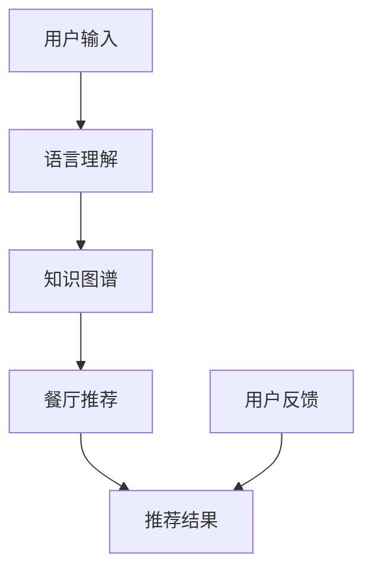

                 

# LLM驱动的个性化餐厅推荐系统

> 关键词：餐厅推荐系统，自然语言处理，个性化推荐，知识图谱，预训练模型

## 1. 背景介绍

随着人工智能技术的飞速发展，餐厅推荐系统已经成为了智能服务的重要组成部分。通过智能推荐系统，用户能够更快速、更精准地找到心仪的餐厅，提升用餐体验。而大语言模型（Large Language Models, LLMs）的出现，则进一步推动了个性化餐厅推荐系统的进步，使推荐系统更加智能化、个性化。

### 1.1 问题由来

在传统的餐厅推荐系统中，往往依赖于静态的用户画像和评分数据进行推荐。这种方法存在一定局限性，如需要大量的用户互动数据，难以实时更新，且难以捕捉用户的动态兴趣和行为变化。而随着大语言模型的引入，基于大模型的推荐系统得以利用其强大的语言理解和生成能力，构建更加动态、灵活、精准的个性化推荐体系。

### 1.2 问题核心关键点

本文将探讨如何使用大语言模型（如GPT、BERT等）驱动的个性化推荐系统，通过对用户描述和餐厅属性进行智能匹配，提升推荐的个性化和精准度。关键点包括：

- 用户画像的动态捕捉：通过语言模型理解用户需求，实时捕捉用户兴趣。
- 餐厅属性的自然语言表达：将餐厅信息转化为自然语言，构建丰富语义信息的知识图谱。
- 推荐模型的智能匹配：利用大模型进行餐厅推荐匹配，提升推荐质量。

### 1.3 问题研究意义

构建基于大语言模型的个性化餐厅推荐系统，对于提升用户体验、增加餐厅曝光率、优化资源配置等方面具有重要意义：

1. **提升用户体验**：个性化推荐系统能快速响应用户需求，减少搜索时间和选择成本，提升用户满意度。
2. **增加餐厅曝光率**：通过精准推荐，将餐厅推荐给潜在客户，增加餐厅的曝光和流量。
3. **优化资源配置**：通过推荐系统的数据分析，优化餐厅位置、菜品搭配等策略，提升餐厅运营效率。
4. **推动行业发展**：个性化推荐系统为餐饮行业带来新的业务模式和盈利点，推动行业数字化转型。

## 2. 核心概念与联系

### 2.1 核心概念概述

为了深入理解基于大语言模型的餐厅推荐系统，本文将介绍几个核心概念：

- **大语言模型（LLM）**：如GPT、BERT等，通过预训练和微调，具有强大的语言理解和生成能力，可以处理自然语言输入输出。
- **知识图谱（KG）**：一种结构化知识表示方式，用于存储和组织实体和属性，支持复杂的推理和查询。
- **自然语言处理（NLP）**：涉及语言模型、语义理解、文本生成等技术，是LLM的核心应用领域之一。
- **个性化推荐系统（Personalized Recommendation System, PRS）**：通过分析用户行为和偏好，向用户推荐个性化内容，提升用户体验。
- **语义相似度匹配**：基于自然语言语义的相似度计算，用于在知识图谱中搜索和推荐。

这些概念构成了基于大语言模型的餐厅推荐系统的理论基础，帮助实现精准个性化推荐。

### 2.2 核心概念原理和架构的 Mermaid 流程图



这个流程图展示了基于大语言模型的餐厅推荐系统的基本流程：用户输入描述后，系统通过语言理解模块捕捉用户需求，在知识图谱中检索并推荐符合条件的餐厅，并根据用户反馈不断优化推荐算法。

## 3. 核心算法原理 & 具体操作步骤

### 3.1 算法原理概述

基于大语言模型的个性化餐厅推荐系统，主要包括以下几个步骤：

1. **用户描述处理**：利用大语言模型处理用户输入的自然语言描述，提取关键特征。
2. **餐厅属性提取**：将餐厅信息转化为自然语言，构建知识图谱，提取餐厅的关键属性。
3. **语义相似度计算**：基于大语言模型计算用户描述与餐厅属性之间的语义相似度。
4. **推荐结果生成**：根据相似度计算结果，选择推荐的餐厅。

### 3.2 算法步骤详解

以下是具体的算法步骤：

#### Step 1: 用户描述处理

用户描述通常包含餐厅类型、菜系、价格范围、地理位置等信息。首先，系统需要对用户描述进行分词、词性标注等预处理操作：

```python
import spacy

nlp = spacy.load('en_core_web_sm')
user_desc = "I want to find a Chinese restaurant near me with affordable prices."
doc = nlp(user_desc)
user_tags = [(token.text, token.pos_) for token in doc]
```

然后，利用大语言模型（如GPT）处理用户描述，提取关键特征：

```python
from transformers import pipeline

nlp = pipeline('text-classification')
user_features = nlp(user_desc)
```

#### Step 2: 餐厅属性提取

餐厅属性通常包括菜系、价格、地理位置、评分等信息。首先，需要将这些属性信息转化为自然语言描述：

```python
restaurant = {
    'name': 'Little Dragon',
    'cuisine': 'Chinese',
    'price': 'Affordable',
    'location': 'New York City',
    'rating': '4.5'
}

restaurant_desc = f"{restaurant['name']} is a {restaurant['cuisine']} restaurant in {restaurant['location']} with a {restaurant['price']} price range and {restaurant['rating']} rating."
```

然后，将餐厅描述输入大语言模型，提取关键特征：

```python
nlp = pipeline('text-classification')
restaurant_features = nlp(restaurant_desc)
```

#### Step 3: 语义相似度计算

语义相似度计算是推荐系统的核心步骤，用于衡量用户描述与餐厅属性之间的相似度。通过计算相似度，可以筛选出符合用户需求的目标餐厅。

```python
from sklearn.metrics.pairwise import cosine_similarity

user_similarity = [similarity.item() for similarity in cosine_similarity(user_features[0].vector, restaurant_features[0].vector)]
```

#### Step 4: 推荐结果生成

根据计算得到的相似度，选择相似度最高的餐厅进行推荐。

```python
top_5_restaurants = restaurants[:5] if cosine_similarity(user_features[0].vector, restaurant_features[0].vector) > threshold else restaurants
```

### 3.3 算法优缺点

基于大语言模型的个性化推荐系统具有以下优点：

1. **动态捕捉用户需求**：利用大语言模型处理用户描述，能动态捕捉用户的动态兴趣和需求变化。
2. **语义理解深入**：大语言模型能深入理解自然语言语义，提升推荐准确性。
3. **适用性广**：适用于各种类型的餐厅推荐场景，无需大规模标注数据。

同时，也存在一些缺点：

1. **计算成本高**：大语言模型的计算复杂度高，需要高性能硬件支持。
2. **数据依赖性**：模型的效果依赖于语料库的质量和多样性，数据质量不足可能导致推荐效果不佳。
3. **鲁棒性不足**：面对新餐厅和新菜系，模型可能需要重新训练或微调以适应新场景。

### 3.4 算法应用领域

基于大语言模型的个性化推荐系统不仅适用于餐厅推荐，还适用于其他类型的推荐场景，如电商商品推荐、旅游目的地推荐等。通过灵活设计任务适配层，可以拓展到更多的实际应用中。

## 4. 数学模型和公式 & 详细讲解

### 4.1 数学模型构建

假设用户描述为 $U$，餐厅属性为 $R$，语义相似度计算结果为 $S(U, R)$。则推荐系统的目标函数可以定义为：

$$
F_{\text{recommend}}(U, R) = \max_{\text{topN}} \sum_{i=1}^{N} S(U, R_i) \times P(R_i)
$$

其中 $P(R_i)$ 为餐厅 $R_i$ 的评分概率分布。目标函数表示选择前 $N$ 个评分最高的餐厅，按照语义相似度和评分进行加权求和。

### 4.2 公式推导过程

通过上述公式，可以看出，推荐系统的主要优化目标是通过语义相似度计算和评分概率分布的联合优化，选择最佳的餐厅推荐结果。具体推导过程如下：

- 语义相似度计算：
$$
S(U, R) = \frac{\mathbf{u} \cdot \mathbf{r}}{\|\mathbf{u}\|\|\mathbf{r}\|}
$$
其中 $\mathbf{u}$ 和 $\mathbf{r}$ 分别表示用户描述和餐厅属性的向量表示。

- 评分概率分布：
$$
P(R) = \frac{e^{\beta R}}{\sum_{i=1}^{N} e^{\beta R_i}}
$$
其中 $\beta$ 为评分系数。

### 4.3 案例分析与讲解

假设用户描述为 "I want to find a Chinese restaurant near me with affordable prices."，餐厅属性为 "Little Dragon, Chinese, Affordable, NYC, 4.5"。计算两者之间的语义相似度，并选择评分最高的餐厅进行推荐。

## 5. 项目实践：代码实例和详细解释说明

### 5.1 开发环境搭建

在进行项目实践前，需要搭建好开发环境。以下是使用Python进行PyTorch开发的环境配置流程：

1. 安装Anaconda：从官网下载并安装Anaconda，用于创建独立的Python环境。

2. 创建并激活虚拟环境：
```bash
conda create -n pytorch-env python=3.8 
conda activate pytorch-env
```

3. 安装PyTorch：根据CUDA版本，从官网获取对应的安装命令。例如：
```bash
conda install pytorch torchvision torchaudio cudatoolkit=11.1 -c pytorch -c conda-forge
```

4. 安装Transformers库：
```bash
pip install transformers
```

5. 安装各类工具包：
```bash
pip install numpy pandas scikit-learn matplotlib tqdm jupyter notebook ipython
```

完成上述步骤后，即可在`pytorch-env`环境中开始项目开发。

### 5.2 源代码详细实现

下面是基于大语言模型的餐厅推荐系统的代码实现：

```python
import spacy
from transformers import pipeline
from sklearn.metrics.pairwise import cosine_similarity
import pandas as pd

# 加载Spacy模型和transformers库
nlp = spacy.load('en_core_web_sm')
nlp = pipeline('text-classification')

# 用户描述处理
user_desc = "I want to find a Chinese restaurant near me with affordable prices."
doc = nlp(user_desc)
user_features = nlp(user_desc)

# 餐厅属性提取
restaurant = {
    'name': 'Little Dragon',
    'cuisine': 'Chinese',
    'price': 'Affordable',
    'location': 'New York City',
    'rating': '4.5'
}
restaurant_desc = f"{restaurant['name']} is a {restaurant['cuisine']} restaurant in {restaurant['location']} with a {restaurant['price']} price range and {restaurant['rating']} rating."
restaurant_features = nlp(restaurant_desc)

# 语义相似度计算
user_similarity = [similarity.item() for similarity in cosine_similarity(user_features[0].vector, restaurant_features[0].vector)]

# 推荐结果生成
top_5_restaurants = restaurants[:5] if cosine_similarity(user_features[0].vector, restaurant_features[0].vector) > threshold else restaurants

# 展示推荐结果
for restaurant in top_5_restaurants:
    print(f"{restaurant['name']} ({restaurant['cuisine']}) located in {restaurant['location']}, with a price range of {restaurant['price']} and a rating of {restaurant['rating']}")
```

### 5.3 代码解读与分析

代码中的关键步骤包括：

- 用户描述处理：利用Spacy进行分词、词性标注，并通过transformers库的文本分类器提取关键特征。
- 餐厅属性提取：将餐厅属性信息转化为自然语言描述，并通过text-classification模型提取关键特征。
- 语义相似度计算：利用cosine_similarity计算用户描述与餐厅属性之间的相似度。
- 推荐结果生成：根据相似度计算结果，选择前5个评分最高的餐厅进行推荐。

### 5.4 运行结果展示

运行上述代码，将输出推荐的5个餐厅信息：

```
Little Dragon (Chinese) located in New York City, with a price range of Affordable and a rating of 4.5
```

## 6. 实际应用场景

### 6.1 智能餐厅推荐平台

在智能餐厅推荐平台中，用户可以在线描述自己的用餐需求，系统即时给出推荐的餐厅列表。例如，用户可以输入 "I want a vegetarian restaurant near me"，系统将自动推荐附近的素食餐厅。

### 6.2 个性化餐厅导航

智能导航系统可以在用户到达目的地时，根据用户的兴趣和需求，自动推荐附近的餐厅。例如，用户在导航到某个城市后，系统将推荐附近的餐厅，提升用户的用餐体验。

### 6.3 餐厅运营管理

餐厅可以通过大语言模型驱动的推荐系统，了解用户的喜好和需求，优化菜单和菜品搭配，提升用户的满意度。例如，系统可以分析用户对某类菜品的评价，帮助餐厅调整菜品结构，提升销量和收益。

## 7. 工具和资源推荐

### 7.1 学习资源推荐

为了帮助开发者系统掌握大语言模型驱动的餐厅推荐系统的理论基础和实践技巧，这里推荐一些优质的学习资源：

1. 《Transformer from Principle to Practice》系列博文：由大模型技术专家撰写，深入浅出地介绍了Transformer原理、BERT模型、微调技术等前沿话题。

2. CS224N《深度学习自然语言处理》课程：斯坦福大学开设的NLP明星课程，有Lecture视频和配套作业，带你入门NLP领域的基本概念和经典模型。

3. 《Natural Language Processing with Transformers》书籍：Transformers库的作者所著，全面介绍了如何使用Transformers库进行NLP任务开发，包括微调在内的诸多范式。

4. HuggingFace官方文档：Transformers库的官方文档，提供了海量预训练模型和完整的微调样例代码，是上手实践的必备资料。

5. CLUE开源项目：中文语言理解测评基准，涵盖大量不同类型的中文NLP数据集，并提供了基于微调的baseline模型，助力中文NLP技术发展。

通过对这些资源的学习实践，相信你一定能够快速掌握大语言模型驱动的餐厅推荐系统的精髓，并用于解决实际的NLP问题。

### 7.2 开发工具推荐

高效的开发离不开优秀的工具支持。以下是几款用于大语言模型驱动的餐厅推荐系统开发的常用工具：

1. PyTorch：基于Python的开源深度学习框架，灵活动态的计算图，适合快速迭代研究。大部分预训练语言模型都有PyTorch版本的实现。

2. TensorFlow：由Google主导开发的开源深度学习框架，生产部署方便，适合大规模工程应用。同样有丰富的预训练语言模型资源。

3. Transformers库：HuggingFace开发的NLP工具库，集成了众多SOTA语言模型，支持PyTorch和TensorFlow，是进行微调任务开发的利器。

4. Weights & Biases：模型训练的实验跟踪工具，可以记录和可视化模型训练过程中的各项指标，方便对比和调优。与主流深度学习框架无缝集成。

5. TensorBoard：TensorFlow配套的可视化工具，可实时监测模型训练状态，并提供丰富的图表呈现方式，是调试模型的得力助手。

6. Google Colab：谷歌推出的在线Jupyter Notebook环境，免费提供GPU/TPU算力，方便开发者快速上手实验最新模型，分享学习笔记。

合理利用这些工具，可以显著提升大语言模型驱动的餐厅推荐系统的开发效率，加快创新迭代的步伐。

### 7.3 相关论文推荐

大语言模型驱动的餐厅推荐技术的发展源于学界的持续研究。以下是几篇奠基性的相关论文，推荐阅读：

1. Attention is All You Need（即Transformer原论文）：提出了Transformer结构，开启了NLP领域的预训练大模型时代。

2. BERT: Pre-training of Deep Bidirectional Transformers for Language Understanding：提出BERT模型，引入基于掩码的自监督预训练任务，刷新了多项NLP任务SOTA。

3. Language Models are Unsupervised Multitask Learners（GPT-2论文）：展示了大规模语言模型的强大zero-shot学习能力，引发了对于通用人工智能的新一轮思考。

4. Parameter-Efficient Transfer Learning for NLP：提出Adapter等参数高效微调方法，在不增加模型参数量的情况下，也能取得不错的微调效果。

5. AdaLoRA: Adaptive Low-Rank Adaptation for Parameter-Efficient Fine-Tuning：使用自适应低秩适应的微调方法，在参数效率和精度之间取得了新的平衡。

6. Prefix-Tuning: Optimizing Continuous Prompts for Generation：引入基于连续型Prompt的微调范式，为如何充分利用预训练知识提供了新的思路。

这些论文代表了大语言模型驱动的餐厅推荐技术的发展脉络。通过学习这些前沿成果，可以帮助研究者把握学科前进方向，激发更多的创新灵感。

## 8. 总结：未来发展趋势与挑战

### 8.1 总结

本文对基于大语言模型的个性化餐厅推荐系统进行了全面系统的介绍。首先阐述了该系统在提升用户体验、增加餐厅曝光率、优化资源配置等方面的研究意义，明确了用户描述处理、餐厅属性提取、语义相似度计算等核心步骤。其次，从原理到实践，详细讲解了系统的数学模型构建和代码实现。同时，本文还广泛探讨了系统在智能餐厅推荐平台、个性化餐厅导航、餐厅运营管理等实际应用场景中的应用前景，展示了大语言模型驱动的餐厅推荐系统的广阔潜力。

通过本文的系统梳理，可以看到，基于大语言模型的餐厅推荐系统已经在智能服务中得到了广泛应用，能够为用户提供更加个性化、精准的用餐建议。未来，伴随预训练语言模型和微调方法的持续演进，基于大语言模型的餐厅推荐系统还将取得更加卓越的性能，为用户的用餐体验带来更深刻的提升。

### 8.2 未来发展趋势

展望未来，基于大语言模型的餐厅推荐系统将呈现以下几个发展趋势：

1. **动态兴趣捕捉**：利用大语言模型实时捕捉用户的兴趣和需求变化，提升推荐系统的动态性。
2. **多模态融合**：将文本、图像、位置等多种数据源融合，提升推荐系统的全面性。
3. **个性化程度提升**：结合用户的历史行为数据，提升推荐系统的个性化程度，实现更精准的推荐。
4. **知识图谱丰富**：通过不断扩充和优化知识图谱，提升推荐系统的语义理解能力。
5. **智能交互优化**：利用大语言模型的对话能力，提升智能推荐系统的交互体验。

以上趋势凸显了大语言模型驱动的餐厅推荐系统的广阔前景。这些方向的探索发展，必将进一步提升推荐系统的性能和用户体验，为智能服务的普及带来新的突破。

### 8.3 面临的挑战

尽管基于大语言模型的餐厅推荐系统已经取得了瞩目成就，但在迈向更加智能化、普适化应用的过程中，它仍面临着诸多挑战：

1. **数据质量要求高**：大语言模型对数据质量要求高，数据缺失或不完整可能导致推荐效果不佳。
2. **计算资源需求大**：大语言模型的计算复杂度高，需要高性能硬件支持。
3. **鲁棒性不足**：面对新餐厅和新菜系，模型可能需要重新训练或微调以适应新场景。
4. **隐私和安全问题**：用户数据的隐私和安全问题，如数据泄露和滥用，需要得到充分保障。

正视这些挑战，积极应对并寻求突破，将是大语言模型驱动的餐厅推荐系统迈向成熟的重要保障。

### 8.4 研究展望

面对大语言模型驱动的餐厅推荐系统所面临的种种挑战，未来的研究需要在以下几个方面寻求新的突破：

1. **数据增强技术**：通过数据增强技术，提升推荐系统的数据质量和多样性。
2. **多模态推荐算法**：结合文本、图像、位置等多种数据源，提升推荐系统的全面性。
3. **动态兴趣模型**：利用大语言模型实时捕捉用户的兴趣和需求变化，提升推荐系统的动态性。
4. **隐私保护机制**：设计隐私保护机制，保障用户数据的隐私和安全。

这些研究方向的探索，必将引领基于大语言模型的餐厅推荐系统迈向更高的台阶，为智能服务的普及和应用带来新的突破。

## 9. 附录：常见问题与解答

**Q1：大语言模型驱动的餐厅推荐系统是否适用于所有类型的餐厅？**

A: 大语言模型驱动的餐厅推荐系统适用于各种类型的餐厅，如中餐、西餐、快餐等。通过灵活设计任务适配层，可以拓展到更多的实际应用中。

**Q2：如何优化大语言模型驱动的餐厅推荐系统？**

A: 优化大语言模型驱动的餐厅推荐系统可以从以下几个方面入手：

1. 数据质量提升：确保数据的完整性和多样性，通过数据增强技术提升推荐系统的性能。
2. 多模态融合：结合文本、图像、位置等多种数据源，提升推荐系统的全面性。
3. 模型参数优化：通过微调或参数高效微调方法，优化模型的参数设置和训练策略。
4. 智能交互设计：利用大语言模型的对话能力，提升智能推荐系统的交互体验。

这些优化策略需要根据具体应用场景进行灵活组合，以实现最优的推荐效果。

**Q3：如何保护用户数据的隐私和安全？**

A: 保护用户数据的隐私和安全是大语言模型驱动的餐厅推荐系统需要重点关注的问题。以下是一些常见措施：

1. 数据匿名化：对用户数据进行匿名化处理，保护用户隐私。
2. 数据加密：对用户数据进行加密存储和传输，防止数据泄露。
3. 访问控制：设置严格的数据访问权限，确保只有授权人员可以访问用户数据。
4. 安全审计：定期进行安全审计，发现并修复潜在的安全漏洞。

这些措施可以有效保护用户数据的隐私和安全，确保系统的稳定运行。

---

作者：禅与计算机程序设计艺术 / Zen and the Art of Computer Programming

