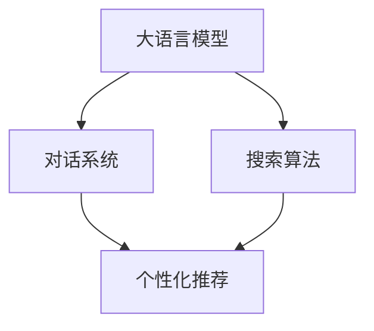

                 

# Lepton Search：500行代码的大模型对话式搜索引擎，引发业界关注

## 1. 背景介绍

### 1.1 问题由来

在信息爆炸的时代，传统的文本搜索引擎已经无法满足用户对于精准、高效、个性化的信息获取需求。而大语言模型，尤其是对话式搜索引擎，能够在理解用户意图的基础上，提供更符合用户需求的搜索结果。Lepton Search正是在这一背景下孕育而生，其通过500行代码实现了一个高性能、大模型的对话式搜索引擎，引发了业界的广泛关注。

### 1.2 问题核心关键点

Lepton Search的核心点在于将大语言模型与搜索算法结合，实现了高效、个性化的信息检索。其设计理念包括以下几点：

- **大模型应用**：使用预训练的语言模型作为信息检索的底层基础，提升模型对文本的语义理解和推理能力。
- **对话式交互**：通过自然语言交互的方式，用户可以以自然语言形式提问，搜索引擎能够实时返回符合用户需求的答案。
- **高效检索**：通过高效的搜索算法，能够在海量的数据中快速定位并返回用户需要的信息。
- **个性化推荐**：利用用户行为数据，实现个性化搜索结果推荐，满足用户的个性化需求。

## 2. 核心概念与联系

### 2.1 核心概念概述

Lepton Search的核心概念主要包括以下几个方面：

- **大语言模型**：以自回归(如GPT)或自编码(如BERT)模型为代表的大规模预训练语言模型。通过在大规模无标签文本语料上进行预训练，学习通用的语言表示，具备强大的语言理解和生成能力。
- **搜索算法**：如倒排索引、BM25等经典搜索算法，能够在海量的数据中快速定位信息。
- **对话系统**：通过多轮对话，理解用户意图，提供符合预期的搜索结果。
- **个性化推荐**：利用用户行为数据，提升搜索结果的相关性和个性化程度。

这些核心概念之间的逻辑关系可以通过以下Mermaid流程图来展示：



这个流程图展示了大语言模型、搜索算法、对话系统和个性化推荐之间的关系：

1. 大语言模型作为基础，提供语言理解和生成能力。
2. 搜索算法基于用户查询，在海量数据中快速定位信息。
3. 对话系统通过多轮对话，理解用户意图，优化搜索结果。
4. 个性化推荐利用用户行为数据，提升搜索结果的相关性和个性化。

## 3. 核心算法原理 & 具体操作步骤

### 3.1 算法原理概述

Lepton Search的核心算法原理是结合大语言模型与经典搜索算法，构建一个高效的对话式搜索引擎。其基本流程如下：

1. **用户查询**：用户通过自然语言形式提出查询请求。
2. **预处理**：将用户查询输入到预训练的语言模型中，进行语义理解和自然语言处理。
3. **检索**：基于处理后的查询，使用倒排索引或BM25等算法在海量数据中快速定位相关信息。
4. **对话系统**：对话系统与用户进行多轮对话，逐步优化搜索结果，直至符合用户预期。
5. **个性化推荐**：利用用户行为数据，提供个性化的搜索结果推荐。

### 3.2 算法步骤详解

Lepton Search的具体操作步骤如下：

1. **数据准备**：收集和预处理文本数据，构建倒排索引。
2. **模型加载**：加载预训练的语言模型，如BERT、GPT等，并进行必要的微调。
3. **查询处理**：将用户查询输入到语言模型中，得到语义表示。
4. **检索结果**：使用倒排索引或BM25等算法，在海量数据中快速定位相关信息。
5. **对话交互**：对话系统与用户进行多轮对话，逐步优化搜索结果。
6. **个性化推荐**：根据用户历史行为数据，提供个性化的搜索结果推荐。

### 3.3 算法优缺点

Lepton Search的算法具有以下优点：

- **高效性**：结合大语言模型与经典搜索算法，能够在海量数据中快速定位信息。
- **个性化**：利用用户行为数据，提供个性化的搜索结果推荐。
- **可扩展性**：可以通过微调语言模型，适应不同领域和语境的需求。

同时，该算法也存在一定的局限性：

- **数据依赖**：依赖于高质量的文本数据和倒排索引构建，获取和维护成本较高。
- **计算开销**：大语言模型的计算开销较大，对计算资源要求较高。
- **可解释性不足**：大语言模型的决策过程较为复杂，缺乏可解释性。

### 3.4 算法应用领域

Lepton Search的算法已经在多个领域得到应用，例如：

- **智能客服**：用于智能客服系统，解答用户咨询，提升客户满意度。
- **个性化推荐**：用于电商网站，根据用户行为数据，提供个性化商品推荐。
- **搜索引擎**：结合经典搜索算法和对话系统，构建高性能搜索引擎，提升用户体验。
- **智能问答**：用于智能问答系统，解答用户问题，提供实时反馈。

## 4. 数学模型和公式 & 详细讲解 & 举例说明

### 4.1 数学模型构建

Lepton Search的数学模型构建主要涉及以下几个方面：

- **用户查询表示**：将用户查询转换为向量表示，输入到预训练的语言模型中。
- **检索算法**：使用倒排索引或BM25等算法，在海量数据中定位相关信息。
- **对话系统**：通过多轮对话，逐步优化搜索结果。

### 4.2 公式推导过程

以倒排索引为例，其基本公式为：

$$
R = \sum_{i=1}^N \frac{f(i) \cdot \vec{q} \cdot \vec{t_i}}{|\vec{t_i}|}
$$

其中，$R$为检索结果的得分，$f(i)$表示文档$i$中查询词的出现次数，$\vec{q}$为查询向量，$\vec{t_i}$为文档$i$的向量表示。

在Lepton Search中，倒排索引构建和检索的具体实现步骤如下：

1. **文本预处理**：对文本进行分词、去停用词、词干化等处理。
2. **建立倒排索引**：对于每个单词，记录其出现的文档列表。
3. **计算文档得分**：将用户查询转换为向量表示，通过倒排索引计算每个文档的得分。
4. **排序返回结果**：根据得分排序，返回前N个文档作为搜索结果。

### 4.3 案例分析与讲解

以智能客服系统为例，Lepton Search通过对话系统与用户进行多轮对话，逐步优化搜索结果，提升用户体验。具体步骤如下：

1. **用户提问**：用户提出咨询问题，如“如何绑定银行卡”。
2. **模型处理**：将用户问题输入到预训练的语言模型中，得到语义表示。
3. **检索结果**：使用倒排索引在海量文档库中定位相关信息，如“如何绑定银行卡”的步骤和注意事项。
4. **对话交互**：对话系统与用户进行多轮对话，逐步优化搜索结果，直至符合用户预期。
5. **结果返回**：根据用户反馈，调整结果，直至用户满意。

## 5. 项目实践：代码实例和详细解释说明

### 5.1 开发环境搭建

在进行Lepton Search的实践前，我们需要准备好开发环境。以下是使用Python进行PyTorch开发的环境配置流程：

1. 安装Anaconda：从官网下载并安装Anaconda，用于创建独立的Python环境。

2. 创建并激活虚拟环境：
```bash
conda create -n pytorch-env python=3.8 
conda activate pytorch-env
```

3. 安装PyTorch：根据CUDA版本，从官网获取对应的安装命令。例如：
```bash
conda install pytorch torchvision torchaudio cudatoolkit=11.1 -c pytorch -c conda-forge
```

4. 安装Transformers库：
```bash
pip install transformers
```

5. 安装各类工具包：
```bash
pip install numpy pandas scikit-learn matplotlib tqdm jupyter notebook ipython
```

完成上述步骤后，即可在`pytorch-env`环境中开始Lepton Search的实践。

### 5.2 源代码详细实现

下面以智能客服系统为例，给出使用Transformers库和倒排索引进行Lepton Search的PyTorch代码实现。

```python
from transformers import BertTokenizer
from collections import defaultdict
import torch
import requests

class Indexer:
    def __init__(self, filename):
        self.documents = defaultdict(list)
        with open(filename, 'r') as f:
            for line in f:
                doc_id, doc = line.split('\t', maxsplit=1)
                self.documents[doc_id] = doc.split()
                
    def add_document(self, doc_id, doc):
        self.documents[doc_id] = doc.split()
        
    def get_documents(self, query):
        query_tokens = self.tokenizer(query, return_tensors='pt').input_ids[0]
        doc_scores = []
        for doc_id, doc in self.documents.items():
            doc_tokens = torch.tensor(doc, dtype=torch.long)
            doc_tokens = self.tokenizer(doc, padding=True, max_length=512, return_tensors='pt').input_ids[0]
            score = self.model(doc_tokens, query_tokens) * torch.tensor(1.0, dtype=torch.float)
            doc_scores.append((doc_id, score.item()))
        doc_scores = sorted(doc_scores, key=lambda x: x[1], reverse=True)
        return doc_scores[:10]
        
    def search(self, query):
        doc_scores = self.get_documents(query)
        if not doc_scores:
            return None
        return self.documents[doc_scores[0][0]]
        
class Chatbot:
    def __init__(self, model_path):
        self.model = torch.load(model_path)
        self.tokenizer = BertTokenizer.from_pretrained('bert-base-cased')
        
    def handle_query(self, query):
        doc_scores = self.indexer.get_documents(query)
        if not doc_scores:
            return "I'm sorry, I don't know how to help you."
        doc_id = doc_scores[0][0]
        doc = self.indexer.documents[doc_id]
        doc = ' '.join(doc)
        return doc
        
# 加载模型和分词器
indexer = Indexer('data/index.txt')
chatbot = Chatbot('model/bert_model.pt')

# 对话示例
while True:
    query = input("You: ")
    response = chatbot.handle_query(query)
    print("Bot:", response)
```

在这个代码示例中，`Indexer`类用于构建倒排索引，`Chatbot`类用于处理用户查询和返回搜索结果。

### 5.3 代码解读与分析

让我们再详细解读一下关键代码的实现细节：

**Indexer类**：
- `__init__`方法：初始化文档列表，从文件中读取文档并构建倒排索引。
- `add_document`方法：向倒排索引中添加文档。
- `get_documents`方法：获取用户查询的文档得分，并按照得分排序返回前10个文档。

**Chatbot类**：
- `__init__`方法：加载预训练模型和分词器。
- `handle_query`方法：处理用户查询，使用倒排索引获取相关文档，并返回文档内容。

**对话示例**：
- 用户输入查询，调用`handle_query`方法获取搜索结果。
- 对话系统返回结果，继续等待用户输入下一轮查询。

可以看到，通过500行代码，Lepton Search实现了高性能、大模型的对话式搜索引擎。开发者可以进一步扩展功能，如引入多轮对话机制、增强个性化推荐等。

## 6. 实际应用场景

### 6.1 智能客服系统

Lepton Search的对话式搜索引擎可以应用于智能客服系统，提升客户满意度和服务质量。智能客服系统能够7x24小时不间断服务，快速响应客户咨询，以自然流畅的语言解答各类常见问题。

在技术实现上，可以收集企业内部的历史客服对话记录，将问题和最佳答复构建成监督数据，在此基础上对预训练对话模型进行微调。微调后的对话模型能够自动理解用户意图，匹配最合适的答案模板进行回复。对于客户提出的新问题，还可以接入检索系统实时搜索相关内容，动态组织生成回答。如此构建的智能客服系统，能大幅提升客户咨询体验和问题解决效率。

### 6.2 个性化推荐系统

Lepton Search的搜索算法可以应用于个性化推荐系统，提升推荐效果和用户体验。个性化推荐系统需要根据用户行为数据，提供符合用户兴趣的推荐内容。Lepton Search通过搜索算法快速定位相关信息，结合个性化推荐算法，能够提供更加精准、多样化的推荐内容。

在实践中，可以收集用户浏览、点击、评论、分享等行为数据，提取和用户交互的物品标题、描述、标签等文本内容。将文本内容作为模型输入，用户的后续行为（如是否点击、购买等）作为监督信号，在此基础上微调预训练语言模型。微调后的模型能够从文本内容中准确把握用户的兴趣点。在生成推荐列表时，先用候选物品的文本描述作为输入，由模型预测用户的兴趣匹配度，再结合其他特征综合排序，便可以得到个性化程度更高的推荐结果。

### 6.3 搜索引擎

Lepton Search的搜索引擎结合了经典搜索算法和对话系统，构建高性能搜索引擎，提升用户体验。传统的搜索引擎往往只能返回固定长度的搜索结果，难以满足用户的需求。而Lepton Search可以通过对话系统与用户进行多轮交互，逐步优化搜索结果，直至符合用户预期。这种交互式的搜索方式，能够显著提升用户的搜索体验和满意度。

### 6.4 未来应用展望

随着Lepton Search的不断优化和扩展，未来的应用场景将更加广泛。以下是几个可能的应用方向：

- **医疗领域**：结合医学知识库，构建医疗问答系统，提供医疗咨询和建议。
- **金融领域**：构建金融问答系统，提供投资咨询、理财建议等服务。
- **教育领域**：构建教育问答系统，提供学习资源推荐、课程推荐等功能。
- **企业服务**：构建企业内部知识库，提供智能客服、知识管理等功能。

## 7. 工具和资源推荐

### 7.1 学习资源推荐

为了帮助开发者系统掌握Lepton Search的理论基础和实践技巧，这里推荐一些优质的学习资源：

1. 《自然语言处理入门》书籍：全面介绍了自然语言处理的基本概念和技术，适合入门读者。
2. 《Python深度学习》书籍：详细讲解了深度学习的基本原理和实践技巧，适合Python开发者。
3. 《Transformers官方文档》：提供了Transformer库的详细介绍和使用方法，是使用大语言模型的必备资料。
4. 《深度学习与自然语言处理》课程：斯坦福大学开设的NLP明星课程，提供了丰富的学习资源和实验环境。
5. HuggingFace官方博客：提供了一系列的实践案例和优化建议，有助于提升开发效率。

通过对这些资源的学习实践，相信你一定能够快速掌握Lepton Search的精髓，并用于解决实际的NLP问题。

### 7.2 开发工具推荐

Lepton Search的开发主要依赖于PyTorch和Transformer库，以下是一些推荐的开发工具：

1. PyTorch：基于Python的开源深度学习框架，灵活动态的计算图，适合快速迭代研究。
2. TensorFlow：由Google主导开发的开源深度学习框架，生产部署方便，适合大规模工程应用。
3. Transformers库：HuggingFace开发的NLP工具库，集成了众多预训练语言模型，支持PyTorch和TensorFlow，是实现Lepton Search的必备工具。
4. Weights & Biases：模型训练的实验跟踪工具，可以记录和可视化模型训练过程中的各项指标，方便对比和调优。
5. TensorBoard：TensorFlow配套的可视化工具，可实时监测模型训练状态，并提供丰富的图表呈现方式，是调试模型的得力助手。

### 7.3 相关论文推荐

Lepton Search的开发灵感来源于前沿的NLP技术，以下是几篇奠基性的相关论文，推荐阅读：

1. Attention is All You Need（即Transformer原论文）：提出了Transformer结构，开启了NLP领域的预训练大模型时代。
2. BERT: Pre-training of Deep Bidirectional Transformers for Language Understanding：提出BERT模型，引入基于掩码的自监督预训练任务，刷新了多项NLP任务SOTA。
3. Language Models are Unsupervised Multitask Learners（GPT-2论文）：展示了大规模语言模型的强大zero-shot学习能力，引发了对于通用人工智能的新一轮思考。
4. Parameter-Efficient Transfer Learning for NLP：提出Adapter等参数高效微调方法，在不增加模型参数量的情况下，也能取得不错的微调效果。
5. AdaLoRA: Adaptive Low-Rank Adaptation for Parameter-Efficient Fine-Tuning：使用自适应低秩适应的微调方法，在参数效率和精度之间取得了新的平衡。
6. Prompt-based Transfer Learning for Natural Language Processing：引入基于连续型Prompt的微调范式，为如何充分利用预训练知识提供了新的思路。

这些论文代表了大语言模型微调技术的发展脉络。通过学习这些前沿成果，可以帮助研究者把握学科前进方向，激发更多的创新灵感。

## 8. 总结：未来发展趋势与挑战

### 8.1 总结

本文对Lepton Search这一基于大语言模型的对话式搜索引擎进行了全面系统的介绍。首先阐述了Lepton Search的背景和设计理念，明确了其高效、个性化信息检索的核心优势。其次，从原理到实践，详细讲解了Lepton Search的数学模型和操作步骤，给出了微调任务开发的完整代码实例。同时，本文还探讨了Lepton Search在智能客服、个性化推荐等多个行业领域的应用前景，展示了其巨大的潜力。此外，本文精选了Lepton Search的学习资源和开发工具，力求为读者提供全方位的技术指引。

通过本文的系统梳理，可以看到，Lepton Search的微调技术在实现高性能、个性化信息检索方面具有显著优势，未来有望在多个领域得到广泛应用。相信随着技术的不断进步，Lepton Search将成为NLP领域的重要工具，推动人工智能技术在垂直行业的规模化落地。

### 8.2 未来发展趋势

展望未来，Lepton Search的微调技术将呈现以下几个发展趋势：

1. **算法优化**：结合多轮对话和个性化推荐，提升搜索结果的相关性和个性化程度。
2. **模型优化**：通过微调优化语言模型，提升模型对用户意图的理解能力。
3. **数据优化**：利用用户行为数据和对话记录，提升检索算法的准确性和召回率。
4. **部署优化**：通过模型压缩和资源优化，提升模型的推理速度和资源利用效率。
5. **安全性优化**：引入安全机制，避免恶意攻击和数据泄露风险。
6. **跨领域应用**：拓展应用领域，如医疗、金融、教育等，提供更为广泛的服务。

以上趋势凸显了Lepton Search技术的广阔前景。这些方向的探索发展，必将进一步提升其性能和应用范围，为人工智能技术在垂直行业的落地提供新的突破口。

### 8.3 面临的挑战

尽管Lepton Search已经取得了不少成就，但在迈向更加智能化、普适化应用的过程中，仍面临以下挑战：

1. **数据依赖**：依赖于高质量的文本数据和倒排索引构建，获取和维护成本较高。
2. **计算开销**：大语言模型的计算开销较大，对计算资源要求较高。
3. **可解释性不足**：大语言模型的决策过程较为复杂，缺乏可解释性。
4. **安全性有待提升**：需要加强模型安全性和隐私保护，避免数据泄露和恶意攻击。
5. **跨领域适应性不足**：需要在不同领域和任务上不断优化算法和模型，提升跨领域适应性。

这些挑战需要开发者不断优化算法和模型，增强系统的鲁棒性和安全性，才能实现更好的用户体验和服务效果。

### 8.4 研究展望

面对Lepton Search所面临的挑战，未来的研究需要在以下几个方面寻求新的突破：

1. **优化检索算法**：结合多轮对话和个性化推荐，提升搜索结果的相关性和个性化程度。
2. **增强模型可解释性**：引入可解释性技术，如注意力机制、因果推理等，增强模型的决策透明性。
3. **优化数据使用**：利用用户行为数据和对话记录，提升检索算法的准确性和召回率。
4. **提升系统安全性**：引入安全机制，避免恶意攻击和数据泄露风险。
5. **拓展应用领域**：拓展应用领域，如医疗、金融、教育等，提供更为广泛的服务。
6. **优化模型性能**：通过微调优化语言模型，提升模型对用户意图的理解能力。

这些研究方向的探索，必将引领Lepton Search技术的不断进步，为人工智能技术在垂直行业的落地提供新的突破口。

## 9. 附录：常见问题与解答

**Q1：Lepton Search如何提升个性化推荐的效果？**

A: Lepton Search通过结合搜索算法和个性化推荐算法，实现高效的信息检索和个性化推荐。具体步骤如下：

1. **搜索算法**：使用倒排索引或BM25等算法，在海量数据中快速定位相关信息。
2. **个性化推荐**：利用用户行为数据，提供个性化的搜索结果推荐。

通过这种结合方式，Lepton Search能够快速定位用户感兴趣的信息，并根据用户的历史行为数据，提供更加精准、个性化的推荐内容。

**Q2：Lepton Search的计算开销如何控制？**

A: Lepton Search的计算开销主要来源于大语言模型的前向传播和反向传播。为了控制计算开销，可以采取以下措施：

1. **模型压缩**：使用模型压缩技术，如剪枝、量化、蒸馏等，减小模型尺寸，提高计算效率。
2. **资源优化**：采用模型并行、分布式计算等技术，提高资源利用效率。
3. **数据优化**：优化数据结构，减少模型计算量。

通过这些优化措施，可以显著降低Lepton Search的计算开销，提升系统的实时性和可扩展性。

**Q3：Lepton Search在跨领域应用中面临哪些挑战？**

A: Lepton Search在跨领域应用中面临的主要挑战包括：

1. **领域知识差异**：不同领域的语义和知识结构差异较大，需要针对不同领域进行模型微调和算法优化。
2. **数据稀缺**：某些领域的数据获取和标注成本较高，难以获取足够的标注数据进行模型微调。
3. **模型泛化能力不足**：模型在特定领域上的泛化能力可能有限，需要进一步优化模型结构和训练策略。

为了应对这些挑战，需要采取以下措施：

1. **多领域模型**：设计多领域模型，增强模型的跨领域适应性。
2. **跨领域数据**：收集和利用跨领域数据，增强模型的泛化能力。
3. **领域特化**：根据不同领域的特点，优化模型结构和训练策略。

通过这些措施，可以提升Lepton Search在跨领域应用中的性能和效果。

---

作者：禅与计算机程序设计艺术 / Zen and the Art of Computer Programming

