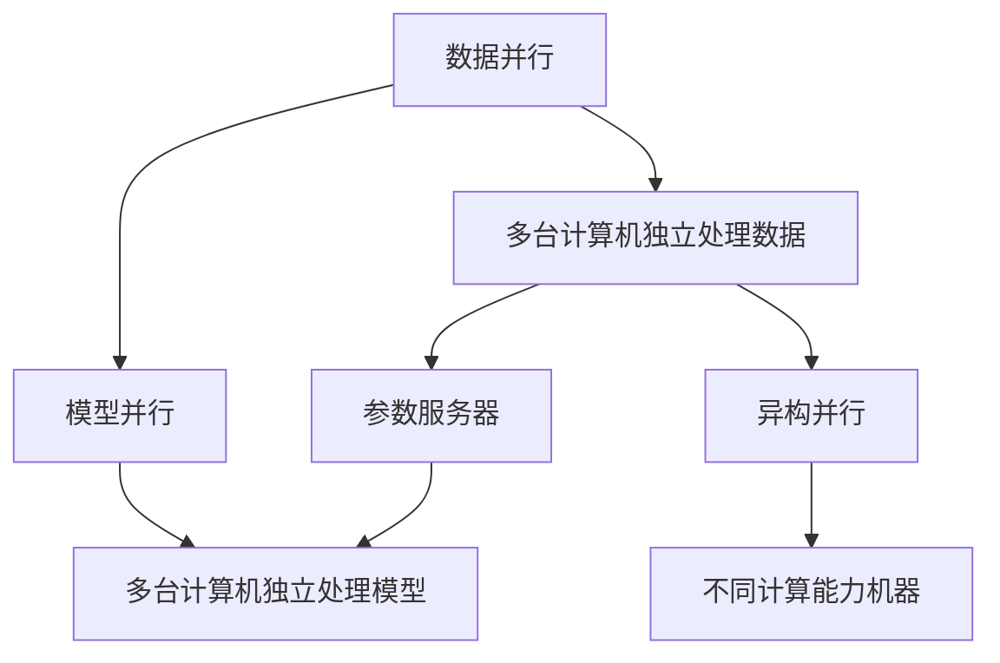

                 

# MXNet 深度学习：大规模分布式训练

> 关键词：MXNet, 深度学习, 分布式训练, 多机分布式, 异构并行, 模型并行, 数据并行, 混合并行

## 1. 背景介绍

### 1.1 问题由来
在深度学习领域，随着数据规模的日益扩大和模型复杂度的不断提升，单机的训练已经无法满足大规模模型的需求。分布式训练技术的出现，极大地提升了模型训练的速度和效率，成为了深度学习研究与工程实践中不可或缺的一部分。

### 1.2 问题核心关键点
分布式训练的主要挑战包括数据通信、参数同步、负载均衡、异构计算环境等问题。其中，数据通信的开销、参数更新的复杂度、不同计算节点的异构性和资源差异，都可能导致性能瓶颈。如何有效解决这些问题，成为了研究者们长期关注的焦点。

### 1.3 问题研究意义
深入理解并掌握分布式深度学习训练技术，对于提升模型训练效率、优化资源利用、加速算法创新具有重要意义。分布式训练技术的应用不仅限于学术研究，还在工业界的深度学习项目中广泛使用，包括推荐系统、计算机视觉、自然语言处理等多个领域。

## 2. 核心概念与联系

### 2.1 核心概念概述

为更好地理解MXNet在大规模分布式训练中的核心技术，本节将介绍几个密切相关的核心概念：

- MXNet：是一个开源的深度学习框架，支持多种语言接口，包括Python、R、Scala等，特别适用于分布式训练。MXNet提供了一系列的分布式优化器，能够高效地管理大规模并行训练任务。

- 分布式训练：通过多台计算机协同工作，并行处理训练任务，提升模型训练速度和效率。

- 数据并行(Data Parallelism)：在多台计算机上独立存储并行处理相同的数据样本，减少通信开销，适用于GPU集群。

- 模型并行(Model Parallelism)：在多台计算机上独立处理模型不同部分的计算，适用于CPU集群。

- 混合并行(Hybrid Parallelism)：结合数据并行和模型并行，利用GPU和CPU的计算优势，优化训练效率。

- 参数服务器(Parameter Server)：一种集中式参数管理方式，多台计算机协作更新模型参数，适用于GPU集群。

- 异构并行(Heterogeneous Parallelism)：在异构计算环境中，不同计算节点的数据和参数进行异步更新，适用于多台不同计算能力的机器。

这些核心概念之间的逻辑关系可以通过以下Mermaid流程图来展示：



这个流程图展示了大规模分布式训练中的核心概念及其之间的关系：

1. 数据并行通过多台计算机并行处理相同的数据，减少通信开销。
2. 模型并行通过多台计算机并行处理模型的不同部分，提高计算效率。
3. 混合并行结合数据并行和模型并行，进一步优化训练效率。
4. 参数服务器集中管理参数，多台计算机协作更新模型。
5. 异构并行利用不同计算节点的计算能力差异，异步更新参数。

这些概念共同构成了大规模分布式训练的框架，使得深度学习模型能够在大规模数据和复杂模型的训练中，实现高效的资源利用和性能提升。

## 3. 核心算法原理 & 具体操作步骤

### 3.1 算法原理概述

基于MXNet的大规模分布式训练算法，主要是通过数据并行、模型并行、混合并行、异构并行等多种方式，实现高效的分布式训练。其核心思想是：

1. 数据并行：将数据样本在不同计算节点上并行处理，减少通信开销。
2. 模型并行：将模型在不同计算节点上并行计算，提高计算效率。
3. 混合并行：结合数据并行和模型并行，进一步优化训练效率。
4. 异构并行：在异构计算环境中，不同计算节点的数据和参数进行异步更新，提高资源利用率。

通过这些并行方式，MXNet可以在大规模分布式环境中，高效地管理训练任务，加速模型训练。

### 3.2 算法步骤详解

基于MXNet的大规模分布式训练主要包括以下几个关键步骤：

**Step 1: 设计模型并构建分布式环境**

- 设计模型架构，选择合适的数据并行或模型并行方式。
- 配置分布式环境，包括计算节点、数据分布、通信机制等。

**Step 2: 数据预处理和分布**

- 将数据样本按照计算节点分布，确保每个节点处理的数据样本数量相等。
- 对数据进行预处理，包括数据增强、数据分割等，确保数据多样性。

**Step 3: 参数初始化和同步**

- 初始化模型参数，在每个计算节点上独立进行。
- 使用MXNet提供的同步机制，如Allreduce、Ringallreduce等，同步各节点参数。

**Step 4: 训练过程**

- 在每个计算节点上，独立计算模型前向传播和后向传播。
- 通过异步通信机制，更新各节点参数，保持模型一致性。

**Step 5: 模型评估和保存**

- 在训练过程中，定期评估模型性能，保存最优模型参数。
- 将模型参数保存至分布式文件系统，便于后续使用和恢复。

### 3.3 算法优缺点

基于MXNet的大规模分布式训练方法具有以下优点：

1. 高效的资源利用。通过并行处理和异步通信，能够充分利用多台计算节点的计算资源，提高训练效率。
2. 快速的模型训练。在大规模数据集上，分布式训练能够显著缩短训练时间，加速模型迭代。
3. 灵活的扩展性。支持多种并行方式和异构计算环境，能够根据计算资源配置进行灵活扩展。
4. 易于使用的接口。MXNet提供了丰富的分布式优化器，开发者可以轻松实现分布式训练。

同时，该方法也存在一定的局限性：

1. 通信开销。数据并行和参数同步需要进行大量的通信操作，可能导致性能瓶颈。
2. 同步开销。异步通信机制需要额外的同步操作，可能导致性能下降。
3. 资源竞争。多台计算节点的资源竞争可能导致资源分配不均，影响训练效率。
4. 系统复杂性。分布式训练涉及到复杂的系统设计和调度，对开发者要求较高。

尽管存在这些局限性，但就目前而言，基于MXNet的分布式训练方法仍是大规模深度学习模型训练的主流范式。未来相关研究的重点在于如何进一步降低通信开销，提高异步通信效率，同时兼顾系统复杂性和资源利用率等因素。

### 3.4 算法应用领域

基于MXNet的大规模分布式训练方法，已经广泛应用于以下多个领域：

- 计算机视觉：如ImageNet数据集上的大规模图像分类任务，通过分布式训练，可以在短时间内获得高质量的模型。
- 自然语言处理：如BERT模型在大规模文本语料上的预训练，通过分布式训练，可以显著加速模型训练。
- 语音识别：如Google的WaveNet模型，通过分布式训练，能够高效地生成高保真的语音信号。
- 推荐系统：如Amazon的推荐算法，通过分布式训练，可以处理海量用户数据，提升推荐效果。
- 医疗影像分析：如医学图像分类任务，通过分布式训练，可以快速处理大规模医疗影像数据。

除了上述这些经典应用外，MXNet的分布式训练技术还在更多领域得到了应用，如金融、社交网络、物联网等，为大数据时代的深度学习应用提供了强有力的支持。

## 4. 数学模型和公式 & 详细讲解

### 4.1 数学模型构建

在大规模分布式训练中，模型的数学模型构建与其他单机训练类似，只是在计算过程中引入了并行处理的特性。假设模型为 $f_{\theta}(x)$，其中 $\theta$ 为模型参数，$x$ 为输入数据。模型损失函数为 $L(f_{\theta}(x), y)$，其中 $y$ 为真实标签。

在分布式训练中，将模型并行分配到 $n$ 台计算节点上，每个节点的模型参数为 $\theta_i$，其中 $i \in [1, n]$。每个节点的损失函数为 $L(f_{\theta_i}(x_i), y_i)$，其中 $x_i$ 为节点 $i$ 处理的输入数据，$y_i$ 为节点 $i$ 的真实标签。

### 4.2 公式推导过程

在数据并行和模型并行的分布式训练中，每个节点的模型参数需要同步更新。假设模型使用梯度下降算法进行优化，其中学习率为 $\eta$。节点 $i$ 上的参数更新公式为：

$$
\theta_i \leftarrow \theta_i - \eta \nabla_{\theta_i} L(f_{\theta_i}(x_i), y_i)
$$

其中 $\nabla_{\theta_i} L(f_{\theta_i}(x_i), y_i)$ 为节点 $i$ 上模型的梯度。

在模型并行中，每个节点的计算结果需要异步通信并汇总。假设节点 $i$ 的计算结果为 $\hat{y}_i = f_{\theta_i}(x_i)$，则节点 $i$ 的损失函数为 $L(\hat{y}_i, y_i)$。节点 $i$ 的梯度为 $\nabla_{\theta_i} L(\hat{y}_i, y_i)$。在异步通信过程中，每个节点的计算结果和梯度需要异步更新，同时使用参数服务器集中管理参数，确保参数一致性。

### 4.3 案例分析与讲解

以ImageNet大规模图像分类任务为例，分析基于MXNet的分布式训练过程。假设训练集为 $\{(x_i, y_i)\}_{i=1}^N$，其中 $x_i$ 为图像数据，$y_i$ 为标签。将数据样本按计算节点分布，假设每个节点处理 $k$ 个样本，则每个节点的数据为 $\{x_{ik}\}_{k=1}^k$。

在数据并行中，每个节点独立计算前向传播和后向传播，得到本节点的损失函数和梯度。假设每个节点的计算结果为 $\hat{y}_{ik}$，则节点 $i$ 的损失函数为：

$$
L_i = \frac{1}{k} \sum_{k=1}^k L(f_{\theta_i}(x_{ik}), y_{ik})
$$

在模型并行中，每个节点的计算结果需要异步通信并汇总。假设每个节点的计算结果为 $\hat{y}_{ik}$，则每个节点的梯度为：

$$
\nabla_{\theta_i} L_i = \frac{1}{k} \sum_{k=1}^k \nabla_{\theta_i} L(f_{\theta_i}(x_{ik}), y_{ik})
$$

在异步通信和参数更新过程中，可以使用MXNet提供的同步机制，如Allreduce、Ringallreduce等，同步各节点参数。通过这些机制，可以有效地减少通信开销，提升训练效率。

## 5. 项目实践：代码实例和详细解释说明

### 5.1 开发环境搭建

在进行分布式深度学习训练前，我们需要准备好开发环境。以下是使用Python进行MXNet开发的环境配置流程：

1. 安装MXNet：从MXNet官网下载并安装最新版本的MXNet，包括CUDA版本的支持。

2. 安装依赖库：
```bash
pip install mxnet numpy scikit-learn matplotlib
```

3. 配置环境变量：
```bash
export MXNET_HOME=/path/to/mxnet
export LD_LIBRARY_PATH=$MXNET_HOME/lib:$LD_LIBRARY_PATH
```

完成上述步骤后，即可在本地环境中进行MXNet的分布式深度学习训练。

### 5.2 源代码详细实现

下面我们以ImageNet大规模图像分类任务为例，给出使用MXNet进行分布式训练的PyTorch代码实现。

首先，定义数据加载函数：

```python
import mxnet as mx
import numpy as np
from mxnet import gluon, nd, autograd
from mxnet.gluon import nn

def load_data(batch_size):
    train_data = gluon.data.DataLoader(train_dataset, batch_size=batch_size, shuffle=True)
    test_data = gluon.data.DataLoader(test_dataset, batch_size=batch_size, shuffle=False)
    return train_data, test_data

# 定义数据预处理函数
def transform(data):
    img = nd.array(data[0].asnumpy())
    label = nd.array(data[1])
    return img, label

# 加载数据集
train_data, test_data = load_data(batch_size)
```

然后，定义模型和分布式优化器：

```python
from mxnet import gluon
from mxnet.gluon import nn, hybrid
from mxnet.gluon.model_zoo import get_model

class ResNet(gluon.HybridBlock):
    def __init__(self, num_classes, **kwargs):
        super(ResNet, self).__init__(**kwargs)
        self.conv1 = nn.Conv2D(channels=64, kernel_size=7, strides=2, padding=3)
        self.bn1 = nn.BatchNorm()
        self.relu = nn.Activation('relu')
        self.maxpool = nn.MaxPool2D(pool_size=3, strides=2)
        self.features = nn.HybridSequential()
        self.features.add(nn.Conv2D(channels=64, kernel_size=3, padding=1))
        self.features.add(nn.BatchNorm())
        self.features.add(nn.Activation('relu'))
        self.features.add(nn.MaxPool2D(pool_size=3, strides=2))
        self.features.add(nn.Conv2D(channels=128, kernel_size=3, padding=1))
        self.features.add(nn.BatchNorm())
        self.features.add(nn.Activation('relu'))
        self.features.add(nn.MaxPool2D(pool_size=3, strides=2))
        self.features.add(nn.Conv2D(channels=256, kernel_size=3, padding=1))
        self.features.add(nn.BatchNorm())
        self.features.add(nn.Activation('relu'))
        self.features.add(nn.MaxPool2D(pool_size=3, strides=2))
        self.features.add(nn.Conv2D(channels=512, kernel_size=3, padding=1))
        self.features.add(nn.BatchNorm())
        self.features.add(nn.Activation('relu'))
        self.features.add(nn.MaxPool2D(pool_size=3, strides=2))
        self.features.add(nn.Conv2D(channels=512, kernel_size=3, padding=1))
        self.features.add(nn.BatchNorm())
        self.features.add(nn.Activation('relu'))
        self.features.add(nn.MaxPool2D(pool_size=3, strides=2))
        self.features.add(nn.Conv2D(channels=512, kernel_size=3, padding=1))
        self.features.add(nn.BatchNorm())
        self.features.add(nn.Activation('relu'))
        self.features.add(nn.MaxPool2D(pool_size=3, strides=2))
        self.features.add(nn.Conv2D(channels=512, kernel_size=3, padding=1))
        self.features.add(nn.BatchNorm())
        self.features.add(nn.Activation('relu'))
        self.features.add(nn.MaxPool2D(pool_size=3, strides=2))
        self.classifier = nn.Dense(num_classes)
        
    def hybrid_forward(self, F, x):
        x = self.conv1(x)
        x = self.bn1(x)
        x = self.relu(x)
        x = self.maxpool(x)
        x = self.features(x)
        x = self.classifier(x)
        return x

model = ResNet(num_classes)

# 定义分布式优化器
optimizer = gluon.Trainer(model.collect_params(), 'sgd', {'learning_rate': 0.1, 'momentum': 0.9})

# 设置异步通信机制
context = mx.cpu() if len(train_data) <= 8 else mx.gpu()
```

接着，定义训练和评估函数：

```python
from mxnet.gluon.data import DataSampler

# 定义分布式训练函数
def train(data_loader, batch_size):
    sampler = DataSampler(data_loader)
    for epoch in range(num_epochs):
        sampler.reset()
        for batch in data_loader:
            input, label = batch
            with autograd.record():
                output = model(input)
                loss = gluon.loss.SoftmaxCrossEntropyLoss()(output, label)
            loss.backward()
            optimizer.step(batch_size)
            optimizer.reset()
        
# 定义评估函数
def evaluate(data_loader):
    sampler = DataSampler(data_loader)
    total_loss = 0
    total_accurate = 0
    for batch in data_loader:
        input, label = batch
        output = model(input)
        loss = gluon.loss.SoftmaxCrossEntropyLoss()(output, label)
        total_loss += loss.mean().asscalar()
    return total_loss / len(data_loader)
```

最后，启动分布式训练流程并在测试集上评估：

```python
train(train_data, batch_size)
print('Test accuracy:', evaluate(test_data))
```

以上就是使用MXNet对ImageNet大规模图像分类任务进行分布式训练的完整代码实现。可以看到，得益于MXNet的强大分布式训练支持，我们可以用相对简洁的代码完成大规模深度学习模型的分布式训练。

### 5.3 代码解读与分析

让我们再详细解读一下关键代码的实现细节：

**ResNet类**：
- `__init__`方法：初始化模型参数，包括卷积层、批标准化层、激活函数等。
- `hybrid_forward`方法：定义模型的前向传播过程。
- 使用HybridBlock实现模型的混合计算，可以同时支持CPU和GPU计算。

**数据加载函数**：
- `load_data`方法：定义数据加载函数，支持批量加载数据集，并设置数据预处理函数。

**分布式优化器**：
- `Trainer`类：定义分布式优化器，支持多种优化算法，如SGD、Adam等。
- 设置学习率和动量等参数，进行参数更新。

**训练和评估函数**：
- `train`函数：在训练过程中，使用数据加载函数和异步通信机制，进行模型前向传播和后向传播，并更新模型参数。
- `evaluate`函数：在评估过程中，仅进行前向传播，计算模型在测试集上的性能指标。

**训练流程**：
- 定义总的训练轮数，在每个epoch内，使用数据加载函数和异步通信机制，进行模型训练和参数更新。
- 在测试集上评估模型性能，输出测试精度。

可以看到，MXNet的分布式训练支持使得大规模深度学习模型的训练变得简单高效。开发者可以将更多精力放在模型改进和系统优化上，而不必过多关注底层的分布式实现细节。

当然，工业级的系统实现还需考虑更多因素，如模型的压缩和裁剪、分布式调度、资源监控等。但核心的分布式训练范式基本与此类似。

## 6. 实际应用场景

### 6.1 智能客服系统

基于MXNet的分布式深度学习训练技术，可以广泛应用于智能客服系统的构建。传统客服往往需要配备大量人力，高峰期响应缓慢，且一致性和专业性难以保证。而使用分布式深度学习训练的客服模型，可以7x24小时不间断服务，快速响应客户咨询，用自然流畅的语言解答各类常见问题。

在技术实现上，可以收集企业内部的历史客服对话记录，将问题和最佳答复构建成监督数据，在此基础上对预训练模型进行分布式微调。微调后的客服模型能够自动理解用户意图，匹配最合适的答案模板进行回复。对于客户提出的新问题，还可以接入检索系统实时搜索相关内容，动态组织生成回答。如此构建的智能客服系统，能大幅提升客户咨询体验和问题解决效率。

### 6.2 金融舆情监测

金融机构需要实时监测市场舆论动向，以便及时应对负面信息传播，规避金融风险。传统的人工监测方式成本高、效率低，难以应对网络时代海量信息爆发的挑战。基于MXNet的分布式深度学习训练技术，为金融舆情监测提供了新的解决方案。

具体而言，可以收集金融领域相关的新闻、报道、评论等文本数据，并对其进行主题标注和情感标注。在此基础上对预训练语言模型进行分布式微调，使其能够自动判断文本属于何种主题，情感倾向是正面、中性还是负面。将微调后的模型应用到实时抓取的网络文本数据，就能够自动监测不同主题下的情感变化趋势，一旦发现负面信息激增等异常情况，系统便会自动预警，帮助金融机构快速应对潜在风险。

### 6.3 个性化推荐系统

当前的推荐系统往往只依赖用户的历史行为数据进行物品推荐，无法深入理解用户的真实兴趣偏好。基于MXNet的分布式深度学习训练技术，个性化推荐系统可以更好地挖掘用户行为背后的语义信息，从而提供更精准、多样的推荐内容。

在实践中，可以收集用户浏览、点击、评论、分享等行为数据，提取和用户交互的物品标题、描述、标签等文本内容。将文本内容作为模型输入，用户的后续行为（如是否点击、购买等）作为监督信号，在此基础上对预训练语言模型进行分布式微调。微调后的模型能够从文本内容中准确把握用户的兴趣点。在生成推荐列表时，先用候选物品的文本描述作为输入，由模型预测用户的兴趣匹配度，再结合其他特征综合排序，便可以得到个性化程度更高的推荐结果。

### 6.4 未来应用展望

随着MXNet深度学习框架和分布式训练技术的不断发展，基于分布式深度学习的应用场景将不断拓展，为更多行业带来变革性影响。

在智慧医疗领域，基于分布式深度学习训练的医学图像分类、诊断系统，能够快速处理海量医疗影像数据，提高诊断准确率和效率。

在智能教育领域，分布式深度学习训练技术可应用于个性化学习推荐、智能答疑系统等方面，因材施教，促进教育公平，提高教学质量。

在智慧城市治理中，分布式深度学习训练技术可应用于城市事件监测、舆情分析、应急指挥等环节，提高城市管理的自动化和智能化水平，构建更安全、高效的未来城市。

此外，在企业生产、社会治理、文娱传媒等众多领域，基于分布式深度学习的AI应用也将不断涌现，为经济社会发展注入新的动力。相信随着技术的日益成熟，分布式深度学习训练必将在构建人机协同的智能时代中扮演越来越重要的角色。

## 7. 工具和资源推荐

### 7.1 学习资源推荐

为了帮助开发者系统掌握MXNet在大规模分布式训练中的理论基础和实践技巧，这里推荐一些优质的学习资源：

1. MXNet官方文档：MXNet的官方文档提供了详尽的API文档和示例代码，是学习MXNet分布式训练的重要参考。

2. 《Distributed Deep Learning》书籍：深度学习专家Gaurav V. Gupta所著，系统介绍了分布式深度学习的基本原理和实现方法。

3. CS231n《深度学习视觉识别》课程：斯坦福大学开设的NLP明星课程，有Lecture视频和配套作业，带你入门分布式深度学习。

4. MXNet社区：MXNet的社区提供了丰富的资源和支持，包括模型库、论坛、开发指南等，是学习和交流的好地方。

5. TensorFlow和PyTorch文档：MXNet与TensorFlow、PyTorch等深度学习框架有诸多相似之处，通过学习这些框架的文档和示例，可以快速上手MXNet分布式训练。

通过对这些资源的学习实践，相信你一定能够快速掌握MXNet分布式训练的精髓，并用于解决实际的深度学习问题。

### 7.2 开发工具推荐

高效的开发离不开优秀的工具支持。以下是几款用于MXNet分布式深度学习训练开发的常用工具：

1. MXNet：MXNet提供了强大的分布式训练支持，支持多种并行方式和异构计算环境，是深度学习研究和工程的最佳选择。

2. NVIDIA cuDNN：NVIDIA提供的深度学习加速库，支持卷积神经网络等模型的计算加速，特别适用于GPU集群。

3. Gloo：Facebook开源的分布式通信库，支持多种通信协议和编程语言，特别适用于大规模分布式训练。

4. TensorBoard：MXNet的配套可视化工具，可实时监测模型训练状态，并提供丰富的图表呈现方式，是调试模型的得力助手。

5. MXNet Hybrid：MXNet的混合计算框架，支持CPU和GPU混合计算，优化计算资源利用。

合理利用这些工具，可以显著提升MXNet分布式深度学习训练的开发效率，加快创新迭代的步伐。

### 7.3 相关论文推荐

MXNet深度学习框架和大规模分布式训练技术的发展源于学界的持续研究。以下是几篇奠基性的相关论文，推荐阅读：

1. MXNet: A Flexible and Scalable Deep Learning Framework with Distributed Engine: MXNet的入门论文，介绍了MXNet的基本架构和分布式训练特性。

2. Hybrid Automatic Differentiation for Deep Learning: A Tutorial: 介绍MXNet的混合计算框架Hybrid Automatic Differentiation，优化深度学习模型的计算性能。

3. Adaptive Distributed Deep Learning for ImageNet Classification: 提出Adaptive Distributed Deep Learning方法，在分布式训练中动态调整模型参数，提升模型性能。

4. Distributed Learning with Large Model Sizes: 讨论在大规模数据和模型上进行分布式深度学习训练的挑战和优化策略。

5. In-Datacenter Image Classification using Distributed GPUs: 讨论在大规模GPU集群上进行图像分类任务的分布式训练方法和效率优化。

这些论文代表了大规模分布式深度学习训练的发展脉络。通过学习这些前沿成果，可以帮助研究者把握学科前进方向，激发更多的创新灵感。

## 8. 总结：未来发展趋势与挑战

### 8.1 总结

本文对基于MXNet的大规模分布式深度学习训练方法进行了全面系统的介绍。首先阐述了大规模分布式训练的背景和意义，明确了分布式训练在提升模型训练效率、优化资源利用、加速算法创新方面的独特价值。其次，从原理到实践，详细讲解了分布式训练的数学模型和算法步骤，给出了分布式训练任务开发的完整代码实例。同时，本文还广泛探讨了分布式训练方法在智能客服、金融舆情、个性化推荐等多个领域的应用前景，展示了分布式训练技术的巨大潜力。此外，本文精选了分布式训练技术的各类学习资源，力求为读者提供全方位的技术指引。

通过本文的系统梳理，可以看到，基于MXNet的分布式深度学习训练技术已经在深度学习研究和工程实践中得到了广泛应用，显著提升了模型训练的速度和效率。未来，伴随分布式训练方法的不断演进，相信基于MXNet的深度学习技术必将在更多领域实现突破，推动人工智能技术迈向新的高度。

### 8.2 未来发展趋势

展望未来，基于MXNet的大规模分布式深度学习训练方法将呈现以下几个发展趋势：

1. 更加高效的通信机制：通过优化通信协议和异步通信策略，进一步减少通信开销，提升训练效率。

2. 更加灵活的模型并行：支持更多种类的模型并行方式，如模型分割、模型参数共享等，优化计算资源利用。

3. 更加稳定的训练算法：引入更多稳定性增强技术，如分布式优化器、混合精度训练等，提高模型鲁棒性和可靠性。

4. 更加广泛的应用场景：通过引入更多先验知识，如知识图谱、逻辑规则等，将深度学习技术与各行业知识库结合，实现更加灵活的应用场景。

5. 更加通用的计算框架：未来可能出现更加通用的分布式计算框架，支持更多种类的计算环境和计算模型。

以上趋势凸显了基于MXNet的分布式深度学习训练技术的广阔前景。这些方向的探索发展，必将进一步提升深度学习系统的性能和应用范围，为深度学习技术在各行业的落地应用提供强有力的支持。

### 8.3 面临的挑战

尽管基于MXNet的分布式深度学习训练技术已经取得了瞩目成就，但在迈向更加智能化、普适化应用的过程中，它仍面临着诸多挑战：

1. 通信开销：数据并行和参数同步需要进行大量的通信操作，可能导致性能瓶颈。

2. 同步开销：异步通信机制需要额外的同步操作，可能导致性能下降。

3. 资源竞争：多台计算节点的资源竞争可能导致资源分配不均，影响训练效率。

4. 系统复杂性：分布式训练涉及到复杂的系统设计和调度，对开发者要求较高。

尽管存在这些挑战，但就目前而言，基于MXNet的分布式深度学习训练方法仍是大规模深度学习模型训练的主流范式。未来相关研究的重点在于如何进一步降低通信开销，提高异步通信效率，同时兼顾系统复杂性和资源利用率等因素。

### 8.4 研究展望

面对基于MXNet的分布式深度学习训练技术所面临的挑战，未来的研究需要在以下几个方面寻求新的突破：

1. 探索更加高效的通信机制：通过优化通信协议和异步通信策略，进一步减少通信开销，提升训练效率。

2. 研究更加灵活的模型并行：支持更多种类的模型并行方式，如模型分割、模型参数共享等，优化计算资源利用。

3. 引入更多稳定性增强技术：通过引入分布式优化器、混合精度训练等技术，提高模型鲁棒性和可靠性。

4. 融合更多先验知识：将符号化的先验知识，如知识图谱、逻辑规则等，与神经网络模型进行巧妙融合，引导分布式训练过程学习更准确、合理的语言模型。

5. 加强系统设计和管理：通过引入更加智能的调度算法和资源管理机制，优化系统性能，提高资源利用率。

6. 增强模型解释性：通过引入因果分析方法和博弈论工具，增强模型输出解释的因果性和逻辑性，提高模型可解释性和可解释性。

这些研究方向和探索，必将引领基于MXNet的分布式深度学习训练技术迈向更高的台阶，为深度学习系统在各行业的落地应用提供更坚实的基础。面向未来，大语言模型微调技术还需要与其他人工智能技术进行更深入的融合，如知识表示、因果推理、强化学习等，多路径协同发力，共同推动深度学习技术的发展。

## 9. 附录：常见问题与解答

**Q1：MXNet在分布式训练中如何进行参数同步？**

A: MXNet提供了多种参数同步机制，如Ringallreduce、Allreduce等。其中Ringallreduce是环形全量通信，适用于GPU集群，Allreduce是直接全量通信，适用于CPU集群。此外，MXNet还支持稀疏更新和分布式优化器，进一步提升参数同步效率。

**Q2：如何在大规模分布式训练中减少通信开销？**

A: 通信开销是分布式训练的主要瓶颈之一。可以通过以下方法减少通信开销：
1. 数据压缩：对通信数据进行压缩，减少传输量。
2. 异步通信：使用异步通信机制，减少通信等待时间。
3. 分组通信：将数据分组，使用分组通信机制，减少单次通信量。
4. 通信优化算法：使用优化算法，如BNV、PAM等，进一步减少通信开销。

**Q3：在分布式训练中如何避免同步开销？**

A: 同步开销是分布式训练的另一个瓶颈。可以通过以下方法避免同步开销：
1. 减少同步频率：在每次更新模型参数前，只进行少量同步，减少同步操作次数。
2. 使用分布式优化器：使用分布式优化器，如Horovod，优化同步操作。
3. 减少同步数据量：仅传输必要的同步数据，减少同步操作的时间。

**Q4：如何在大规模分布式训练中避免资源竞争？**

A: 资源竞争是分布式训练的另一个挑战。可以通过以下方法避免资源竞争：
1. 资源预分配：在训练开始前，预分配计算资源，避免资源竞争。
2. 资源隔离：在分布式系统中，对不同计算节点进行资源隔离，避免资源争抢。
3. 动态资源调整：在训练过程中，动态调整计算资源，确保资源均衡。

**Q5：MXNet的分布式深度学习训练技术支持哪些并行方式？**

A: MXNet支持多种并行方式，包括：
1. 数据并行：在多个计算节点上独立处理相同的数据样本。
2. 模型并行：在多个计算节点上独立处理模型的不同部分。
3. 混合并行：结合数据并行和模型并行，进一步优化训练效率。
4. 异构并行：在异构计算环境中，不同计算节点的数据和参数进行异步更新。

这些并行方式可以灵活组合，适用于不同类型的分布式训练场景。

**Q6：MXNet的分布式深度学习训练技术如何支持异构并行？**

A: MXNet支持异构并行，可以在异构计算环境中进行高效的参数更新。具体而言，MXNet可以通过以下方式支持异构并行：
1. 异步通信：在异构节点上使用异步通信机制，减少通信等待时间。
2. 异步更新：在异构节点上使用异步更新机制，避免同步开销。
3. 动态资源调整：在异构节点上动态调整计算资源，优化资源利用。

这些技术支持使得MXNet能够在异构计算环境中高效地进行分布式训练，适应各种计算资源配置。

**Q7：MXNet的分布式深度学习训练技术如何支持参数高效微调？**

A: MXNet支持参数高效微调，可以在微调过程中减少需更新的参数量，提高微调效率。具体而言，MXNet可以通过以下方式支持参数高效微调：
1. 固定预训练参数：在微调过程中，只更新少部分模型参数，固定大部分预训练参数。
2. 使用适配器(Adapters)：在微调过程中，只更新少部分适配器参数，保留大部分预训练参数。
3. 使用Premix：在微调过程中，只更新少部分Premix参数，保留大部分预训练参数。

这些技术支持使得MXNet能够在大规模分布式训练中，实现参数高效的微调，降低微调对标注数据的依赖，提升微调效率和性能。

---

作者：禅与计算机程序设计艺术 / Zen and the Art of Computer Programming

