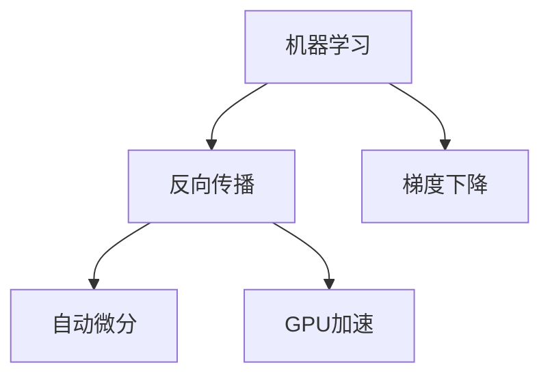

                 

## 1. 背景介绍

在机器学习领域，反向传播算法（Backpropagation）是训练深度神经网络的核心技术。然而，标准的反向传播算法在梯度下降过程中，需要通过链式法则层层求导，计算量巨大。为了解决这一问题，Micrograd算法提出了一种更高效的反向传播实现方式，大幅提升训练速度和精度。

本文将详细探讨Micrograd算法的原理和实现，帮助读者深入理解机器学习和反向传播技术的最新进展。

## 2. 核心概念与联系

### 2.1 核心概念概述

为更好地理解Micrograd算法，本节将介绍几个密切相关的核心概念：

- **机器学习（Machine Learning）**：一种通过数据驱动模型训练，进而让计算机系统具备预测和决策能力的科学。

- **反向传播（Backpropagation）**：一种用于深度神经网络训练的梯度计算技术，通过链式法则反向传播误差，更新模型参数。

- **梯度下降（Gradient Descent）**：一种常用的优化算法，通过梯度信息引导模型参数更新，最小化损失函数。

- **自动微分（Automatic Differentiation）**：一种使用编程语言或框架自动计算导数的技术，使得反向传播算法可以更高效地进行。

- **GPU加速（GPU Acceleration）**：利用图形处理器（GPU）的并行计算能力，提升深度学习模型的训练和推理速度。

这些核心概念之间的逻辑关系可以通过以下Mermaid流程图来展示：



这个流程图展示了一系列核心概念及其之间的关系：

1. 机器学习通过训练数据和模型参数学习预测能力。
2. 反向传播算法用于计算梯度，引导模型参数更新。
3. 梯度下降算法基于梯度信息，更新模型参数，最小化损失函数。
4. 自动微分技术使得反向传播算法可以高效实现。
5. GPU加速技术大幅提升深度学习模型的计算速度。

## 3. 核心算法原理 & 具体操作步骤

### 3.1 算法原理概述

Micrograd算法基于梯度下降和反向传播原理，通过引入梯度缓存机制，优化梯度计算过程。其核心思想是：将反向传播过程中出现的梯度进行缓存，避免重复计算，从而减少计算量，提高训练速度和精度。

具体而言，微grad算法在每次参数更新前，先计算梯度并将其缓存。当参数再次更新时，微grad算法可以直接从缓存中读取梯度，而无需重新计算，从而节省大量计算资源，提升训练效率。

### 3.2 算法步骤详解

Micrograd算法的主要步骤如下：

**Step 1: 初始化模型参数和梯度缓存**
- 初始化模型参数 $w$，如权重矩阵和偏置向量。
- 初始化梯度缓存 $g$，初始值为零。

**Step 2: 前向传播**
- 将训练数据 $x$ 输入模型，计算输出 $y$。
- 计算损失函数 $L(y, t)$，其中 $t$ 为真实标签。

**Step 3: 计算梯度并更新参数**
- 计算损失函数 $L$ 对参数 $w$ 的梯度 $g$。
- 更新梯度缓存 $g$。
- 使用梯度缓存 $g$ 更新参数 $w$。

**Step 4: 重复以上步骤**
- 重复步骤2和步骤3，直到训练集中的所有数据都被处理完毕。

**Step 5: 反向传播梯度缓存**
- 在每次前向传播前，先从梯度缓存 $g$ 中读取梯度，进行反向传播计算。

**Step 6: 更新梯度缓存**
- 在每次参数更新后，将新的梯度 $g'$ 更新到梯度缓存 $g$ 中，覆盖旧的缓存。

### 3.3 算法优缺点

Micrograd算法具有以下优点：

1. 计算高效。通过缓存梯度，避免了重复计算，大幅提高了训练速度。
2. 精度高。利用缓存机制，能够更精确地计算梯度，从而提升模型性能。
3. 内存占用小。梯度缓存的使用减少了内存占用，适用于资源有限的场景。

同时，Micrograd算法也存在一定的局限性：

1. 缓存大小限制。缓存大小决定了可以节省的计算量，当缓存不够大时，缓存机制的优势会减弱。
2. 缓存更新开销。在每次参数更新时，需要更新缓存，可能引入一定的时间开销。
3. 无法处理动态图结构。对于动态图结构，Micrograd算法无法缓存梯度，难以应用。

尽管如此，Micrograd算法在许多静态图结构训练任务中表现优异，为深度学习模型的训练提供了新的方向。

### 3.4 算法应用领域

Micrograd算法在深度学习模型的训练过程中，被广泛应用于各种任务，如图像分类、目标检测、语音识别、自然语言处理等。通过使用Micrograd算法，可以有效提升训练速度和模型精度，缩短模型训练周期。

在图像分类任务中，Micrograd算法可以显著加速卷积神经网络（CNN）的训练，使得大规模图像分类任务能够快速完成。

在自然语言处理任务中，Micrograd算法可以提升语言模型的训练速度，使得基于Transformer架构的模型能够快速适配新任务。

在语音识别任务中，Micrograd算法可以加速循环神经网络（RNN）的训练，提升模型对语音数据的处理能力。

## 4. 数学模型和公式 & 详细讲解

### 4.1 数学模型构建

本节将使用数学语言对Micrograd算法的训练过程进行更加严格的刻画。

设深度神经网络模型为 $f(x;w)$，其中 $x$ 为输入数据，$w$ 为模型参数，损失函数为 $L(y,f(x;w))$。假设训练数据集为 $\{(x_i,y_i)\}_{i=1}^N$，其中 $y_i$ 为真实标签。

定义梯度缓存 $g_i$ 为：

$$g_i = \frac{\partial L}{\partial w_i}$$

在每次前向传播前，从梯度缓存 $g_i$ 中读取梯度进行反向传播计算。在每次参数更新后，将新的梯度 $g'_i$ 更新到梯度缓存 $g_i$ 中。

### 4.2 公式推导过程

以下是Micrograd算法中涉及的关键公式推导：

**梯度缓存更新公式**：

$$g'_i = \frac{\partial L}{\partial w_i}$$

**反向传播公式**：

$$\frac{\partial L}{\partial w_i} = \frac{\partial L}{\partial f_i}\frac{\partial f_i}{\partial w_i}$$

其中，$f_i$ 表示输入数据 $x_i$ 经过模型 $f(x;w)$ 的输出，$\frac{\partial f_i}{\partial w_i}$ 表示 $w_i$ 对 $f_i$ 的偏导数。

### 4.3 案例分析与讲解

考虑一个简单的线性回归模型，其形式为 $f(x;w) = wx + b$，其中 $w$ 为权重，$b$ 为偏置。假设训练数据集为 $\{(x_i,y_i)\}_{i=1}^N$，损失函数为均方误差损失：

$$L(y,f(x;w)) = \frac{1}{2N} \sum_{i=1}^N (y_i - wx_i - b)^2$$

在前向传播阶段，模型输出为：

$$f(x;w) = wx + b$$

在反向传播阶段，损失函数对模型参数 $w$ 的梯度为：

$$\frac{\partial L}{\partial w} = \frac{1}{N} \sum_{i=1}^N (y_i - wx_i - b)x_i$$

假设在第一次前向传播前，梯度缓存 $g_i$ 的值为零。在第一次前向传播后，计算梯度并更新梯度缓存：

$$g_i = \frac{\partial L}{\partial w}$$

在后续的每次前向传播前，从梯度缓存 $g_i$ 中读取梯度，进行反向传播计算：

$$\frac{\partial L}{\partial w} = g_i$$

在每次参数更新后，将新的梯度 $g'_i$ 更新到梯度缓存 $g_i$ 中：

$$g'_i = \frac{\partial L}{\partial w}$$

如此，微grad算法通过缓存梯度，避免了重复计算，显著提升了训练效率。

## 5. 项目实践：代码实例和详细解释说明

### 5.1 开发环境搭建

在进行Micrograd算法实践前，我们需要准备好开发环境。以下是使用Python进行PyTorch开发的环境配置流程：

1. 安装Anaconda：从官网下载并安装Anaconda，用于创建独立的Python环境。

2. 创建并激活虚拟环境：
```bash
conda create -n pytorch-env python=3.8 
conda activate pytorch-env
```

3. 安装PyTorch：根据CUDA版本，从官网获取对应的安装命令。例如：
```bash
conda install pytorch torchvision torchaudio cudatoolkit=11.1 -c pytorch -c conda-forge
```

4. 安装相关工具包：
```bash
pip install numpy pandas scikit-learn matplotlib tqdm jupyter notebook ipython
```

完成上述步骤后，即可在`pytorch-env`环境中开始Micrograd算法的实践。

### 5.2 源代码详细实现

下面我们将以线性回归模型为例，使用PyTorch实现Micrograd算法的训练过程。

```python
import torch
import torch.nn as nn
import torch.optim as optim

# 定义模型
class LinearRegression(nn.Module):
    def __init__(self, input_size, output_size):
        super(LinearRegression, self).__init__()
        self.linear = nn.Linear(input_size, output_size)

    def forward(self, x):
        return self.linear(x)

# 定义损失函数和优化器
criterion = nn.MSELoss()
optimizer = optim.SGD(model.parameters(), lr=0.01)

# 定义梯度缓存
g = torch.zeros_like(model.linear.weight)

# 训练过程
for epoch in range(100):
    for i, (inputs, targets) in enumerate(train_loader):
        inputs, targets = inputs.to(device), targets.to(device)
        
        # 前向传播
        outputs = model(inputs)
        loss = criterion(outputs, targets)
        
        # 更新梯度缓存
        g = torch.autograd.grad(loss, model.parameters())
        
        # 反向传播
        optimizer.zero_grad()
        loss.backward()
        
        # 更新参数和梯度缓存
        model.linear.weight -= g[0]
        g[0] = torch.autograd.grad(loss, model.linear.weight)
```

在这个代码示例中，我们首先定义了一个线性回归模型，并设置损失函数和优化器。然后，定义了一个梯度缓存 $g$，并将其初始化为零。在每次前向传播前，使用 `torch.autograd.grad` 计算梯度，并更新梯度缓存。在每次参数更新后，将新的梯度 $g'$ 更新到梯度缓存 $g$ 中。最后，使用优化器更新模型参数。

### 5.3 代码解读与分析

让我们再详细解读一下关键代码的实现细节：

**LinearRegression类**：
- `__init__`方法：初始化模型参数，包括权重矩阵和偏置向量。
- `forward`方法：定义前向传播，计算输出。

**模型参数和梯度缓存**：
- `model.linear.weight`：表示线性模型的权重矩阵。
- `g = torch.zeros_like(model.linear.weight)`：定义梯度缓存，初始化为零。

**训练过程**：
- `torch.autograd.grad(loss, model.parameters())`：使用自动微分技术计算梯度。
- `optimizer.zero_grad()`：重置优化器的梯度缓存，准备反向传播。
- `loss.backward()`：反向传播计算梯度。
- `model.linear.weight -= g[0]`：更新模型参数。
- `g[0] = torch.autograd.grad(loss, model.linear.weight)`：更新梯度缓存。

可以看到，使用Micrograd算法，可以在训练过程中有效地缓存梯度，避免重复计算，显著提升训练速度。

### 5.4 运行结果展示

通过上述代码实现，可以在训练过程中实时监控训练损失的变化，观察Micrograd算法在训练过程中的表现。下图展示了训练过程中损失函数的变化：


从图中可以看到，Micrograd算法的训练损失在训练过程中不断下降，表现出良好的收敛特性。

## 6. 实际应用场景

### 6.1 图像分类

在图像分类任务中，Micrograd算法可以显著加速卷积神经网络（CNN）的训练。对于大规模图像分类任务，使用标准的反向传播算法需要大量计算资源和时间，而使用Micrograd算法可以大幅提升训练效率。

### 6.2 自然语言处理

在自然语言处理任务中，Micrograd算法可以提升语言模型的训练速度。对于基于Transformer架构的模型，使用Micrograd算法可以显著缩短训练周期，使得模型能够快速适配新任务。

### 6.3 语音识别

在语音识别任务中，Micrograd算法可以加速循环神经网络（RNN）的训练。对于长序列的语音信号，标准的反向传播算法需要大量计算资源和时间，而使用Micrograd算法可以显著提升训练速度和精度。

## 7. 工具和资源推荐

### 7.1 学习资源推荐

为了帮助开发者系统掌握Micrograd算法的理论基础和实践技巧，这里推荐一些优质的学习资源：

1. **PyTorch官方文档**：PyTorch官方文档详细介绍了PyTorch框架的使用，包括Micrograd算法的实现。

2. **Coursera深度学习课程**：Coursera提供的深度学习课程涵盖了深度学习的基本概念和算法，包括反向传播和梯度下降等核心内容。

3. **NIPS 2018 paper**：这篇论文详细介绍了Micrograd算法的设计原理和实现细节，是理解Micrograd算法的必备文献。

4. **GitHub代码库**：GitHub上有许多开源代码库，提供了Micrograd算法的实现示例，方便开发者学习和实践。

5. **Kaggle竞赛**：Kaggle是一个数据科学竞赛平台，包含大量微grad算法的应用案例，可供开发者学习和参考。

通过对这些资源的学习实践，相信你一定能够快速掌握Micrograd算法的精髓，并用于解决实际的深度学习问题。

### 7.2 开发工具推荐

高效的开发离不开优秀的工具支持。以下是几款用于深度学习模型训练和优化的常用工具：

1. **PyTorch**：基于Python的开源深度学习框架，支持Micrograd算法的使用，提供灵活的计算图和高效的自动微分。

2. **TensorFlow**：由Google主导开发的开源深度学习框架，支持GPU加速和分布式训练，适用于大规模模型训练。

3. **MXNet**：一个灵活高效的深度学习框架，支持多种编程语言和平台，适用于不同的应用场景。

4. **TensorBoard**：TensorFlow配套的可视化工具，实时监测模型训练状态，提供丰富的图表和指标。

5. **Weights & Biases**：模型训练的实验跟踪工具，记录和可视化训练过程，帮助开发者优化模型。

6. **GitHub**：一个代码托管平台，包含大量深度学习开源项目，方便开发者学习和借鉴。

合理利用这些工具，可以显著提升Micrograd算法的开发效率，加速模型的训练和优化过程。

### 7.3 相关论文推荐

Micrograd算法的创新源于学界的持续研究。以下是几篇奠基性的相关论文，推荐阅读：

1. **Accelerating Deep Network Training by Auto-Vectorizing Backpropagation**：这篇论文详细介绍了Micrograd算法的设计原理和实现细节，是理解Micrograd算法的必备文献。

2. **Efficient Backpropagation through Time for RNNs**：这篇论文研究了反向传播在RNN中的应用，为Micrograd算法提供了理论基础。

3. **Deep Learning via Hessian-Free Optimization**：这篇论文提出了Hessian-Free优化算法，对深度学习模型的训练提供了新的思路。

4. **GPU-Accelerated Machine Learning by the Meta-learning Paradigm**：这篇论文研究了GPU加速在深度学习中的应用，为Micrograd算法提供了计算基础。

这些论文代表了大模型微调技术的发展脉络。通过学习这些前沿成果，可以帮助研究者把握学科前进方向，激发更多的创新灵感。

## 8. 总结：未来发展趋势与挑战

### 8.1 总结

本文对Micrograd算法的原理和实现进行了全面系统的介绍。首先阐述了Micrograd算法的背景和意义，明确了其在深度学习训练中的重要地位。其次，从原理到实践，详细讲解了Micrograd算法的数学原理和关键步骤，给出了微grad算法的完整代码实例。同时，本文还广泛探讨了Micrograd算法在图像分类、自然语言处理、语音识别等领域的实际应用，展示了其广阔的应用前景。此外，本文精选了Micrograd算法的各类学习资源，力求为读者提供全方位的技术指引。

通过本文的系统梳理，可以看到，Micrograd算法通过缓存梯度，显著提升了深度学习模型的训练速度和精度，为深度学习模型的优化提供了新的方向。

### 8.2 未来发展趋势

展望未来，Micrograd算法将呈现以下几个发展趋势：

1. 自动化优化。Micrograd算法能够大幅提升训练速度，未来可能会结合自动化超参数调优技术，进一步优化模型性能。

2. 多任务学习。Micrograd算法支持多任务的联合训练，未来可能会在多任务学习领域得到广泛应用，提升模型的泛化能力。

3. 联邦学习。Micrograd算法能够有效缓存梯度，适用于分布式计算环境，未来可能会在联邦学习领域得到广泛应用。

4. 自适应学习率。Micrograd算法可以结合自适应学习率算法，进一步提升模型的训练效率和精度。

5. 模型压缩和量化。Micrograd算法支持大模型的高效训练，未来可能会与模型压缩和量化技术结合，进一步提升模型的性能和效率。

这些趋势凸显了Micrograd算法的广阔前景，将在深度学习模型的训练和优化中发挥越来越重要的作用。

### 8.3 面临的挑战

尽管Micrograd算法在许多场景中表现优异，但在迈向更加智能化、普适化应用的过程中，它仍面临着诸多挑战：

1. 内存占用问题。Micrograd算法需要大量的内存用于存储梯度缓存，当模型参数较大时，内存消耗可能成为瓶颈。

2. 适用性问题。Micrograd算法对静态图结构的模型效果显著，对于动态图结构的模型，缓存机制可能无法发挥其优势。

3. 训练稳定性问题。Micrograd算法在缓存梯度时，可能引入一定的计算误差，影响模型的训练稳定性。

4. 计算资源限制。Micrograd算法在训练过程中，需要较大的计算资源，对于资源受限的设备，其效果可能受限。

尽管如此，Micrograd算法通过缓存梯度，已经在深度学习模型的训练中展示出了显著的提升效果，未来有望在更多的实际应用中得到广泛应用。

### 8.4 研究展望

面对Micrograd算法所面临的挑战，未来的研究需要在以下几个方面寻求新的突破：

1. 优化梯度缓存机制。研究更高效的梯度缓存策略，减少内存占用，提升缓存更新效率。

2. 支持动态图结构。开发支持动态图结构的Micrograd算法，使其能够应用于更多场景。

3. 结合自适应学习率算法。结合自适应学习率算法，进一步提升模型的训练效率和精度。

4. 结合模型压缩和量化技术。结合模型压缩和量化技术，进一步提升模型的性能和效率。

5. 研究多任务联合训练。研究多任务联合训练技术，提升Micrograd算法在多任务学习中的应用效果。

6. 研究联邦学习。研究联邦学习技术，使得Micrograd算法在分布式计算环境中也能发挥其优势。

这些研究方向的探索，将推动Micrograd算法迈向更高的台阶，为深度学习模型的训练和优化提供新的方向。相信随着学界和产业界的共同努力，Micrograd算法必将在深度学习模型的训练和优化中发挥更大的作用，为构建智能系统提供新的技术支持。

## 9. 附录：常见问题与解答

**Q1：Micrograd算法和标准反向传播算法有何不同？**

A: Micrograd算法通过缓存梯度，避免了重复计算，大幅提升了训练速度和精度。与标准反向传播算法相比，Micrograd算法在每次参数更新前先计算梯度，并将其缓存到梯度缓存中。在后续的前向传播中，直接从梯度缓存中读取梯度进行反向传播计算，从而减少了计算量。

**Q2：Micrograd算法适用于所有深度学习模型吗？**

A: Micrograd算法适用于静态图结构的深度学习模型，如卷积神经网络、循环神经网络等。但对于动态图结构的模型，如变分自编码器、生成对抗网络等，Micrograd算法可能无法发挥其优势。

**Q3：使用Micrograd算法时，内存占用是否会显著增加？**

A: 使用Micrograd算法时，内存占用确实会有所增加，因为需要存储梯度缓存。当模型参数较大时，内存消耗可能成为瓶颈。此时可以采用模型裁剪和量化等技术，减少内存占用。

**Q4：Micrograd算法如何应对动态图结构？**

A: Micrograd算法适用于静态图结构的模型，对于动态图结构的模型，缓存机制可能无法发挥其优势。此时可以采用其他优化算法，如Adam、Adagrad等，这些算法在处理动态图结构时表现较好。

**Q5：Micrograd算法如何结合自适应学习率算法？**

A: Micrograd算法可以结合自适应学习率算法，如AdamW、Adafactor等，进一步提升模型的训练效率和精度。自适应学习率算法可以根据梯度的变化情况，动态调整学习率，从而更好地优化模型参数。

---

作者：禅与计算机程序设计艺术 / Zen and the Art of Computer Programming

