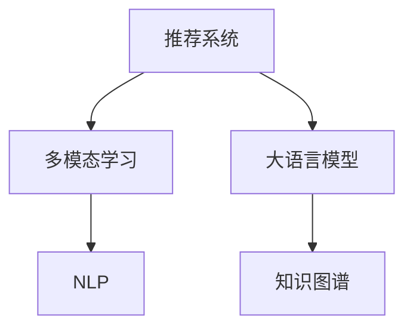

                 

# NLP技术在推荐系统的应用前景：大模型的潜力

> 关键词：推荐系统,大语言模型,自然语言处理(NLP),用户兴趣,知识图谱,多模态学习

## 1. 背景介绍

### 1.1 问题由来

在电商、新闻、视频、音乐等众多领域，推荐系统已经成为了提升用户体验、推动业务增长的重要手段。传统的推荐系统往往依赖于用户行为数据，采用协同过滤、基于内容的推荐等方法，挖掘用户历史偏好，以最大化用户体验。但随着用户需求和市场环境的不断变化，单一的用户行为数据越来越难以捕捉复杂的用户兴趣，推荐系统的精度和覆盖面面临瓶颈。

大语言模型的崛起，为推荐系统带来了全新的思路。结合NLP技术，利用大语言模型强大的语言理解能力和知识推理能力，推荐系统有望从单一的用户行为数据，向多维度的语义理解转变。借助语言模型，推荐系统不仅能够理解和匹配用户当下的需求，还能预判和引导用户未来的兴趣点。

### 1.2 问题核心关键点

大语言模型在推荐系统中的应用，核心在于其对用户输入的自然语言描述进行语义理解和知识提取，然后基于提取的信息进行更精准的推荐。关键点包括：

- 多模态数据融合：将用户行为数据和自然语言描述结合起来，提升推荐系统的全面性。
- 知识图谱整合：利用大语言模型的知识推理能力，将外部知识源与推荐系统集成，扩大推荐系统的知识边界。
- 个性化推荐：利用大语言模型对用户输入的自然语言理解，生成个性化的推荐结果。

## 2. 核心概念与联系

### 2.1 核心概念概述

为更好地理解大语言模型在推荐系统中的应用，本节将介绍几个密切相关的核心概念：

- 推荐系统(Recommender System)：通过算法向用户推荐物品的系统，旨在提升用户体验，增加用户粘性，提高业务收益。常见的推荐方法包括协同过滤、基于内容的推荐、混合推荐等。

- 大语言模型(Large Language Model, LLM)：以自回归(如GPT)或自编码(如BERT)模型为代表的大规模预训练语言模型。通过在大规模无标签文本语料上进行预训练，学习通用的语言表示，具备强大的语言理解和生成能力。

- 知识图谱(Knowledge Graph)：一种结构化的语义知识表示方式，将实体、属性和关系整合成图形结构，便于机器理解和推理。

- 多模态学习(Multimodal Learning)：融合多种数据模态(如文本、图像、音频等)进行学习的方法，提升模型的感知能力和泛化能力。

- 自然语言处理(Natural Language Processing, NLP)：涉及自然语言表示、理解、生成和推理的各类技术，是推荐系统获取用户语义信息的重要手段。

这些核心概念之间的逻辑关系可以通过以下Mermaid流程图来展示：



这个流程图展示了大语言模型、知识图谱和NLP技术在大语言模型推荐系统中的作用：

1. 推荐系统通过多模态学习，结合用户行为数据和自然语言描述，获得更全面的用户画像。
2. 大语言模型通过预训练和微调，学习语言的通用表示，并能够理解自然语言输入。
3. NLP技术用于解析和处理自然语言输入，提取语义信息。
4. 知识图谱提供结构化的语义信息，与推荐系统集成，进一步扩大推荐系统的知识边界。

## 3. 核心算法原理 & 具体操作步骤
### 3.1 算法原理概述

基于大语言模型和NLP技术的推荐系统，本质上是一种语义理解的推荐方法。其核心思想是：将用户输入的自然语言描述作为预训练语言模型的输入，提取用户兴趣点和偏好，然后基于提取的信息进行推荐。

具体地，假设推荐系统面对用户输入的自然语言描述 $d$，其中包含用户兴趣点 $p_1, p_2, \cdots, p_k$。推荐系统的目标是找到一个物品集 $I$，使得物品与用户兴趣点的匹配度最大。可以定义为：

$$
\max_{I} \sum_{i \in I} \sum_{k=1}^{K} a_k \cdot \cos(\theta_k, p_k)
$$

其中，$a_k$ 表示用户对 $p_k$ 的兴趣程度，$\theta_k$ 为第 $k$ 个兴趣点在预训练语言模型中的向量表示，$p_k$ 为输入的自然语言描述中的 $k$ 个兴趣点。

通过这种形式化的表达，推荐系统可以将自然语言描述转化为数值化的用户兴趣，从而找到最匹配的物品推荐。

### 3.2 算法步骤详解

基于大语言模型和NLP技术的推荐系统一般包括以下几个关键步骤：

**Step 1: 准备预训练模型和数据集**
- 选择合适的预训练语言模型 $M_{\theta}$ 作为初始化参数，如 BERT、GPT 等。
- 收集用户输入的自然语言描述数据集 $D=\{(d_i,y_i)\}_{i=1}^N, d_i \in \mathcal{D}, y_i \in \{0,1\}$，其中 $d_i$ 为自然语言描述，$y_i$ 为是否点击/购买等标注。

**Step 2: 设计任务适配层**
- 根据任务需求，设计适当的任务适配层。对于推荐任务，通常需要设计一个物品-兴趣点相似度计算模块，例如余弦相似度、欧几里得距离等。
- 对于点击率预测任务，通常使用二分类交叉熵损失函数。

**Step 3: 设置微调超参数**
- 选择合适的优化算法及其参数，如 AdamW、SGD 等，设置学习率、批大小、迭代轮数等。
- 设置正则化技术及强度，包括权重衰减、Dropout、Early Stopping等。
- 确定冻结预训练参数的策略，如仅微调顶层，或全部参数都参与微调。

**Step 4: 执行梯度训练**
- 将训练集数据分批次输入模型，前向传播计算损失函数。
- 反向传播计算参数梯度，根据设定的优化算法和学习率更新模型参数。
- 周期性在验证集上评估模型性能，根据性能指标决定是否触发 Early Stopping。
- 重复上述步骤直到满足预设的迭代轮数或 Early Stopping 条件。

**Step 5: 测试和部署**
- 在测试集上评估微调后模型 $M_{\hat{\theta}}$ 的性能，对比微调前后的精度提升。
- 使用微调后的模型对新用户输入的自然语言描述进行推理预测，集成到实际的应用系统中。
- 持续收集新的用户输入，定期重新微调模型，以适应数据分布的变化。

以上是基于大语言模型和NLP技术的推荐系统的一般流程。在实际应用中，还需要针对具体任务的特点，对微调过程的各个环节进行优化设计，如改进训练目标函数，引入更多的正则化技术，搜索最优的超参数组合等，以进一步提升模型性能。

### 3.3 算法优缺点

基于大语言模型和NLP技术的推荐系统具有以下优点：
1. 能够理解自然语言描述，提升推荐系统的语义理解能力。
2. 利用大语言模型丰富的知识表示，扩大推荐系统的知识边界。
3. 能够对用户输入进行多模态融合，提升推荐系统的全面性。
4. 通过知识图谱的集成，利用结构化信息进行推荐。
5. 能够自动获取新用户的输入信息，快速适应新用户。

同时，该方法也存在一定的局限性：
1. 对标注数据依赖较大。自然语言描述的标注工作量大，且数据质量难以保证。
2. 模型复杂度高。大语言模型参数量较大，推理速度较慢。
3. 可解释性不足。推荐系统的黑盒模型难以解释推荐依据。
4. 对抗攻击风险。自然语言描述可能被恶意篡改，影响推荐结果。

尽管存在这些局限性，但就目前而言，基于大语言模型和NLP技术的推荐系统仍是一种高效的推荐方法。未来相关研究的重点在于如何进一步降低对标注数据的依赖，提高模型的可解释性和鲁棒性，同时兼顾推荐效率和个性化程度。

### 3.4 算法应用领域

基于大语言模型和NLP技术的推荐系统在多个领域已经得到了应用，例如：

- 电商推荐：为用户推荐商品、优惠券、促销活动等。
- 视频推荐：为用户推荐影片、视频、短视频等。
- 音乐推荐：为用户推荐歌曲、专辑、艺人等。
- 新闻推荐：为用户推荐新闻文章、专题报道等。

除了这些经典领域外，大语言模型和NLP技术也被创新性地应用到更多场景中，如个性化推荐、内容生成、智能客服等，为推荐系统带来了新的突破。

## 4. 数学模型和公式 & 详细讲解 & 举例说明

### 4.1 数学模型构建

在推荐系统中，大语言模型用于解析和理解自然语言输入，生成用户兴趣点。数学上可以定义用户输入的自然语言描述 $d$ 为 $d=[w_1, w_2, \cdots, w_m]$，其中 $w_i$ 表示单词的词嵌入。假设大语言模型在 $d$ 上的语义表示为 $\boldsymbol{x} = [x_1, x_2, \cdots, x_n]$，则用户输入的兴趣点 $p_k$ 可以表示为：

$$
p_k = f_k(\boldsymbol{x})
$$

其中 $f_k$ 为预训练语言模型对用户输入的兴趣点 $p_k$ 进行抽取的函数。假设推荐系统需要推荐的物品集为 $I=\{i_1, i_2, \cdots, i_m\}$，物品 $i_j$ 的向量表示为 $\boldsymbol{y_j}$。推荐系统的目标是最大化物品与用户兴趣点的相似度：

$$
\max_{I} \sum_{i \in I} \sum_{k=1}^{K} \cos(\theta_k, p_k)
$$

其中 $\cos$ 为余弦相似度，$\theta_k$ 为第 $k$ 个兴趣点在预训练语言模型中的向量表示。

### 4.2 公式推导过程

以下我们以电商推荐为例，推导基于大语言模型的推荐模型公式。

假设推荐系统需要将用户输入的自然语言描述 $d$ 映射为物品集 $I$ 中的物品 $i_j$，用户输入的自然语言描述 $d=[w_1, w_2, \cdots, w_m]$ 和物品 $i_j$ 的向量表示 $\boldsymbol{y_j}$，目标为最大化物品与用户兴趣点的相似度：

$$
\max_{i_j} \cos(\theta_k, p_k)
$$

其中 $p_k$ 为从 $d$ 中抽取的用户兴趣点，$k$ 表示兴趣点的编号。

对于每个兴趣点 $p_k$，使用大语言模型进行向量表示的计算公式为：

$$
p_k = M_{\theta}(d) \cdot W_k
$$

其中 $M_{\theta}$ 为预训练语言模型，$W_k$ 为兴趣点 $p_k$ 的权重矩阵。

代入目标函数：

$$
\max_{i_j} \sum_{k=1}^{K} \cos(\theta_k, p_k) = \max_{i_j} \sum_{k=1}^{K} \cos(\theta_k, M_{\theta}(d) \cdot W_k)
$$

令 $W_k \cdot \theta_k = b_k$，则上式可进一步简化为：

$$
\max_{i_j} \sum_{k=1}^{K} \cos(b_k, M_{\theta}(d))
$$

在实际应用中，推荐系统通常将物品 $i_j$ 的向量表示 $\boldsymbol{y_j}$ 和用户兴趣点的向量表示 $b_k$ 进行匹配，选择与用户兴趣点最相似的物品进行推荐。

### 4.3 案例分析与讲解

以电商推荐为例，假设用户输入的自然语言描述为：“我想买一件黑色皮衣”，推荐系统需要根据该描述推荐相关的皮衣商品。使用大语言模型解析输入，提取用户兴趣点，可以生成如下向量表示：

$$
p_1 = [0.2, 0.3, 0.5, 0.1] \quad (黑色皮衣)
$$

推荐系统将用户兴趣点 $p_1$ 与物品集 $I$ 中的物品向量进行余弦相似度计算：

$$
\cos(p_1, \boldsymbol{y_j}) = \frac{p_1 \cdot \boldsymbol{y_j}}{\|\boldsymbol{y_j}\| \cdot \|p_1\|}
$$

最终选择与 $p_1$ 余弦相似度最高的物品进行推荐。

## 5. 项目实践：代码实例和详细解释说明
### 5.1 开发环境搭建

在进行推荐系统开发前，我们需要准备好开发环境。以下是使用Python进行TensorFlow开发的环境配置流程：

1. 安装Anaconda：从官网下载并安装Anaconda，用于创建独立的Python环境。

2. 创建并激活虚拟环境：
```bash
conda create -n tf-env python=3.8 
conda activate tf-env
```

3. 安装TensorFlow：根据CUDA版本，从官网获取对应的安装命令。例如：
```bash
conda install tensorflow -c pytorch -c conda-forge
```

4. 安装必要工具包：
```bash
pip install numpy pandas scikit-learn matplotlib tqdm jupyter notebook ipython
```

完成上述步骤后，即可在`tf-env`环境中开始推荐系统开发。

### 5.2 源代码详细实现

下面我们以电商推荐为例，给出使用TensorFlow进行推荐系统的PyTorch代码实现。

首先，定义推荐系统数据的处理函数：

```python
from tensorflow.keras.preprocessing.text import Tokenizer
from tensorflow.keras.preprocessing.sequence import pad_sequences
from tensorflow.keras.layers import Embedding, LSTM, Dense
import numpy as np

class RecommendationDataset:
    def __init__(self, texts, labels, tokenizer):
        self.texts = texts
        self.labels = labels
        self.tokenizer = tokenizer
        
    def __len__(self):
        return len(self.texts)
    
    def __getitem__(self, item):
        text = self.texts[item]
        label = self.labels[item]
        
        # 将文本进行分词和编码
        tokenized = self.tokenizer.texts_to_sequences([text])
        padded = pad_sequences(tokenized, maxlen=100)
        return {'input_ids': padded, 
                'labels': np.array([label])}
```

然后，定义模型和优化器：

```python
from tensorflow.keras.models import Model
from tensorflow.keras.optimizers import Adam

model = Model(inputs=embedding.input, outputs=predictions)

optimizer = Adam(lr=2e-4, decay=1e-6)
```

接着，定义训练和评估函数：

```python
from tensorflow.keras.callbacks import EarlyStopping

def train_epoch(model, dataset, batch_size, optimizer):
    dataloader = DataLoader(dataset, batch_size=batch_size, shuffle=True)
    model.train()
    epoch_loss = 0
    for batch in dataloader:
        input_ids = batch['input_ids'].numpy()
        labels = batch['labels']
        
        model.zero_grad()
        outputs = model(input_ids)
        loss = outputs.loss
        epoch_loss += loss.item()
        loss.backward()
        optimizer.step()
    return epoch_loss / len(dataloader)

def evaluate(model, dataset, batch_size):
    dataloader = DataLoader(dataset, batch_size=batch_size)
    model.eval()
    preds, labels = [], []
    with torch.no_grad():
        for batch in dataloader:
            input_ids = batch['input_ids']
            labels = batch['labels']
            outputs = model(input_ids)
            batch_preds = outputs.predictions.argmax(dim=1)
            batch_labels = labels.numpy()
            for pred, label in zip(batch_preds, batch_labels):
                preds.append(pred)
                labels.append(label)
                
    print(classification_report(labels, preds))
```

最后，启动训练流程并在测试集上评估：

```python
epochs = 10
batch_size = 16

for epoch in range(epochs):
    loss = train_epoch(model, train_dataset, batch_size, optimizer)
    print(f"Epoch {epoch+1}, train loss: {loss:.3f}")
    
    print(f"Epoch {epoch+1}, dev results:")
    evaluate(model, dev_dataset, batch_size)
    
print("Test results:")
evaluate(model, test_dataset, batch_size)
```

以上就是使用TensorFlow对电商推荐系统进行开发的完整代码实现。可以看到，得益于TensorFlow的强大封装，我们可以用相对简洁的代码完成电商推荐系统的构建。

### 5.3 代码解读与分析

让我们再详细解读一下关键代码的实现细节：

**RecommendationDataset类**：
- `__init__`方法：初始化文本、标签、分词器等关键组件。
- `__len__`方法：返回数据集的样本数量。
- `__getitem__`方法：对单个样本进行处理，将文本输入编码为token ids，进行定长padding，最终返回模型所需的输入。

**train_epoch函数**：
- 使用PyTorch的DataLoader对数据集进行批次化加载，供模型训练使用。
- 在每个epoch内，循环迭代训练数据，每个batch上进行前向传播计算loss，反向传播更新模型参数，并记录epoch平均loss。

**evaluate函数**：
- 同样使用PyTorch的DataLoader对数据集进行批次化加载，供模型评估使用。
- 在每个epoch结束时，在验证集上评估模型性能，输出分类指标。

**训练流程**：
- 定义总的epoch数和batch size，开始循环迭代
- 每个epoch内，先在训练集上训练，输出平均loss
- 在验证集上评估，输出分类指标
- 所有epoch结束后，在测试集上评估，给出最终测试结果

可以看到，TensorFlow配合PyTorch使得推荐系统构建的代码实现变得简洁高效。开发者可以将更多精力放在数据处理、模型改进等高层逻辑上，而不必过多关注底层的实现细节。

当然，工业级的系统实现还需考虑更多因素，如模型的保存和部署、超参数的自动搜索、更灵活的任务适配层等。但核心的推荐过程基本与此类似。

## 6. 实际应用场景
### 6.1 智能客服系统

基于大语言模型的电商推荐系统，可以广泛应用于智能客服系统的构建。传统客服往往需要配备大量人力，高峰期响应缓慢，且一致性和专业性难以保证。而使用电商推荐系统，可以根据用户的历史购买记录和浏览行为，推荐相关的产品和服务，从而提高客服响应速度和准确性。

在技术实现上，可以收集用户的历史购物行为数据，提取用户兴趣点，结合自然语言输入，使用电商推荐系统为用户推荐商品。智能客服系统可以实时监控用户的输入，动态调整推荐列表，提升用户满意度。

### 6.2 金融舆情监测

金融机构需要实时监测市场舆论动向，以便及时应对负面信息传播，规避金融风险。传统的人工监测方式成本高、效率低，难以应对网络时代海量信息爆发的挑战。基于电商推荐系统的金融舆情监测，为金融舆情监测提供了新的解决方案。

具体而言，可以收集金融领域相关的新闻、报道、评论等文本数据，并对其进行主题标注和情感标注。在此基础上对电商推荐系统进行微调，使其能够自动判断文本属于何种主题，情感倾向是正面、中性还是负面。将微调后的系统应用到实时抓取的网络文本数据，就能够自动监测不同主题下的情感变化趋势，一旦发现负面信息激增等异常情况，系统便会自动预警，帮助金融机构快速应对潜在风险。

### 6.3 个性化推荐系统

当前的推荐系统往往只依赖用户的历史行为数据进行物品推荐，无法深入理解用户的真实兴趣偏好。基于电商推荐系统的个性化推荐系统，可以更好地挖掘用户行为背后的语义信息，从而提供更精准、多样的推荐内容。

在实践中，可以收集用户浏览、点击、评论、分享等行为数据，提取和用户交互的物品标题、描述、标签等文本内容。将文本内容作为电商推荐系统的输入，用户的后续行为（如是否点击、购买等）作为监督信号，在此基础上微调电商推荐系统。微调后的模型能够从文本内容中准确把握用户的兴趣点。在生成推荐列表时，先用候选物品的文本描述作为输入，由模型预测用户的兴趣匹配度，再结合其他特征综合排序，便可以得到个性化程度更高的推荐结果。

### 6.4 未来应用展望

随着电商推荐系统和大语言模型的不断发展，基于电商推荐系统的推荐方法将在更多领域得到应用，为各行各业带来变革性影响。

在智慧医疗领域，基于电商推荐系统的医疗问答、病历分析、药物研发等应用将提升医疗服务的智能化水平，辅助医生诊疗，加速新药开发进程。

在智能教育领域，电商推荐系统可应用于作业批改、学情分析、知识推荐等方面，因材施教，促进教育公平，提高教学质量。

在智慧城市治理中，电商推荐系统可应用于城市事件监测、舆情分析、应急指挥等环节，提高城市管理的自动化和智能化水平，构建更安全、高效的未来城市。

此外，在企业生产、社会治理、文娱传媒等众多领域，基于电商推荐系统的推荐技术也将不断涌现，为传统行业数字化转型升级提供新的技术路径。相信随着技术的日益成熟，电商推荐系统必将在更广阔的应用领域大放异彩，深刻影响人类的生产生活方式。

## 7. 工具和资源推荐
### 7.1 学习资源推荐

为了帮助开发者系统掌握电商推荐系统的理论基础和实践技巧，这里推荐一些优质的学习资源：

1. 《深度学习推荐系统：原理与算法》系列博文：由大模型技术专家撰写，深入浅出地介绍了推荐系统的原理、算法和应用。

2. 《推荐系统实战》书籍：国内外知名专家所著，全面介绍了推荐系统从基础理论到实际应用的全过程，包括电商推荐系统的实战案例。

3. Coursera《Recommender Systems Specialization》课程：由斯坦福大学开设的推荐系统系列课程，涵盖推荐系统的基本概念、算法和工程实现，适合初学者和进阶者学习。

4. Kaggle《Recommender Systems》竞赛：提供推荐系统相关的竞赛数据集和样例代码，可实践电商推荐系统的实际应用。

5. GitHub上的开源推荐系统项目：如RecSys、TensorRec等，提供了丰富的电商推荐系统代码和文档，可参考学习。

通过对这些资源的学习实践，相信你一定能够快速掌握电商推荐系统的精髓，并用于解决实际的推荐问题。
###  7.2 开发工具推荐

高效的开发离不开优秀的工具支持。以下是几款用于电商推荐系统开发的常用工具：

1. TensorFlow：基于Python的开源深度学习框架，生产部署方便，适合大规模工程应用。推荐系统的主流实现包括TensorFlow、PyTorch等。

2. PyTorch：基于Python的开源深度学习框架，灵活动态的计算图，适合快速迭代研究。

3. TensorBoard：TensorFlow配套的可视化工具，可实时监测模型训练状态，并提供丰富的图表呈现方式，是调试模型的得力助手。

4. Weights & Biases：模型训练的实验跟踪工具，可以记录和可视化模型训练过程中的各项指标，方便对比和调优。与主流深度学习框架无缝集成。

5. Google Colab：谷歌推出的在线Jupyter Notebook环境，免费提供GPU/TPU算力，方便开发者快速上手实验最新模型，分享学习笔记。

合理利用这些工具，可以显著提升电商推荐系统的开发效率，加快创新迭代的步伐。

### 7.3 相关论文推荐

电商推荐系统和大语言模型的发展源于学界的持续研究。以下是几篇奠基性的相关论文，推荐阅读：

1. matrix factorization techniques for recommendation systems：介绍矩阵分解方法，通过将用户-物品评分矩阵分解为低维矩阵，计算用户和物品的隐含因子，从而推荐物品。

2. distributed collaborative filtering：介绍分布式协同过滤方法，通过并行计算，提高推荐系统的训练效率。

3. embeddings for collaborative filtering：介绍基于隐含语义建模的推荐方法，通过低维向量空间中的相似度计算，推荐物品。

4. attention and recurrent neural networks for recommendation systems：引入注意力机制和RNN，捕捉用户行为的时序特征，提升推荐系统的表现。

5. neural collaborative filtering：基于神经网络的协同过滤方法，通过学习隐含的神经元，捕捉用户和物品的表示，推荐物品。

这些论文代表了大语言模型和电商推荐系统的研究脉络。通过学习这些前沿成果，可以帮助研究者把握学科前进方向，激发更多的创新灵感。

## 8. 总结：未来发展趋势与挑战

### 8.1 总结

本文对基于大语言模型的电商推荐系统进行了全面系统的介绍。首先阐述了电商推荐系统的背景和重要性，明确了电商推荐系统在电商、金融、智能客服等多个领域的广泛应用。其次，从原理到实践，详细讲解了电商推荐系统的数学模型和关键步骤，给出了电商推荐系统的完整代码实现。同时，本文还广泛探讨了电商推荐系统的实际应用场景，展示了电商推荐系统的广阔前景。

通过本文的系统梳理，可以看到，基于大语言模型的电商推荐系统正在成为推荐系统的重要范式，极大地拓展了推荐系统的应用边界，催生了更多的落地场景。受益于大语言模型的强大语言理解能力和知识推理能力，电商推荐系统不仅能够理解用户的自然语言输入，还能结合外部知识源，扩大推荐系统的知识边界，提升推荐系统的全面性和准确性。未来，伴随大语言模型和电商推荐系统的不断发展，推荐系统必将在更多领域得到应用，为各行各业带来变革性影响。

### 8.2 未来发展趋势

展望未来，基于大语言模型的电商推荐系统将呈现以下几个发展趋势：

1. 模型规模持续增大。随着算力成本的下降和数据规模的扩张，电商推荐模型的参数量还将持续增长。超大规模电商推荐模型蕴含的丰富知识，有望支撑更加复杂多变的推荐任务。

2. 多模态学习日益普及。电商推荐系统将更加注重融合用户行为数据和自然语言描述，提升推荐系统的语义理解能力和全面性。

3. 知识图谱的整合。电商推荐系统将与知识图谱进行深度融合，利用结构化知识提升推荐系统的精准度和泛化能力。

4. 个性化推荐能力的提升。电商推荐系统将引入更多的先验知识，提升推荐系统的个性化程度，能够更好地适应不同用户的兴趣需求。

5. 实时性提升。电商推荐系统将利用分布式计算和大数据技术，实现实时推荐，提升用户体验。

6. 社会化推荐的发展。电商推荐系统将进一步融合用户社交网络信息，提升推荐系统的社交性。

7. 对抗攻击防范。电商推荐系统将引入对抗攻击技术，提升系统的鲁棒性。

这些趋势凸显了大语言模型在电商推荐系统中的应用前景。这些方向的探索发展，必将进一步提升电商推荐系统的性能和应用范围，为推荐系统的发展带来新的活力。

### 8.3 面临的挑战

尽管基于大语言模型的电商推荐系统已经取得了瞩目成就，但在迈向更加智能化、普适化应用的过程中，它仍面临着诸多挑战：

1. 标注成本瓶颈。虽然电商推荐系统对标注数据的依赖较传统推荐系统低，但仍需要大量的标注工作，且标注工作量大、质量难以保证。如何进一步降低对标注数据的依赖，将是一大难题。

2. 模型复杂度高。大语言模型和电商推荐模型的参数量较大，推理速度较慢。如何在保证性能的同时，优化模型结构，提升推理速度，优化资源占用，将是重要的优化方向。

3. 可解释性不足。电商推荐系统的黑盒模型难以解释推荐依据。如何赋予电商推荐系统更强的可解释性，将是亟待攻克的难题。

4. 数据分布变化。推荐系统需要在不同数据分布下进行微调，以适应数据分布的变化。如何设计动态微调策略，保持模型性能的稳定性和鲁棒性，也将是一个重要研究方向。

5. 对抗攻击风险。电商推荐系统可能面临恶意用户对输入的自然语言描述进行篡改，影响推荐结果。如何防范对抗攻击，提升系统的鲁棒性，也是必须考虑的问题。

6. 伦理道德问题。电商推荐系统可能会推荐有害或误导性的信息，侵害用户权益。如何在推荐系统中引入伦理道德约束，保护用户隐私和权益，将是一个重要的研究方向。

这些挑战凸显了大语言模型在电商推荐系统中的应用复杂性。研究者需要不断探索新的算法和技术，以应对这些挑战，推动电商推荐系统的不断发展。

### 8.4 研究展望

面对电商推荐系统和大语言模型面临的诸多挑战，未来的研究需要在以下几个方面寻求新的突破：

1. 探索无监督和半监督电商推荐方法。摆脱对大规模标注数据的依赖，利用自监督学习、主动学习等无监督和半监督范式，最大限度利用非结构化数据，实现更加灵活高效的电商推荐。

2. 研究参数高效和计算高效的电商推荐方法。开发更加参数高效的电商推荐方法，在固定大部分电商推荐参数的情况下，只更新极少量的任务相关参数。同时优化电商推荐模型的计算图，减少前向传播和反向传播的资源消耗，实现更加轻量级、实时性的部署。

3. 融合因果和对比学习范式。通过引入因果推断和对比学习思想，增强电商推荐模型建立稳定因果关系的能力，学习更加普适、鲁棒的语言表征，从而提升模型泛化性和抗干扰能力。

4. 引入更多先验知识。将符号化的先验知识，如知识图谱、逻辑规则等，与电商推荐模型进行巧妙融合，引导电商推荐过程学习更准确、合理的语言模型。同时加强不同模态数据的整合，实现视觉、语音等多模态信息与文本信息的协同建模。

5. 结合因果分析和博弈论工具。将因果分析方法引入电商推荐模型，识别出模型决策的关键特征，增强输出解释的因果性和逻辑性。借助博弈论工具刻画人机交互过程，主动探索并规避模型的脆弱点，提高系统稳定性。

6. 纳入伦理道德约束。在电商推荐模型的训练目标中引入伦理导向的评估指标，过滤和惩罚有偏见、有害的输出倾向。同时加强人工干预和审核，建立电商推荐模型的监管机制，确保推荐结果符合人类价值观和伦理道德。

这些研究方向的探索，必将引领电商推荐系统和大语言模型走向更高的台阶，为推荐系统的发展带来新的活力。面向未来，电商推荐系统和大语言模型还需要与其他人工智能技术进行更深入的融合，如知识表示、因果推理、强化学习等，多路径协同发力，共同推动电商推荐系统的发展。只有勇于创新、敢于突破，才能不断拓展电商推荐系统的边界，让智能技术更好地造福人类社会。

## 9. 附录：常见问题与解答

**Q1：电商推荐系统是否适用于所有电商场景？**

A: 电商推荐系统在大多数电商场景中都能取得不错的效果，特别是对于数据量较大的场景，如电商、视频、音乐等。但对于一些特定场景，如小众市场、垂直领域等，可能需要更多的定制化设计和优化。

**Q2：电商推荐系统对标注数据依赖较大，如何解决？**

A: 电商推荐系统对标注数据的依赖较大，但可以通过无监督和半监督学习范式，最大限度利用非结构化数据。例如，使用自监督学习任务，如预训练语言模型、文本生成等，从非标注数据中提取有用信息。

**Q3：电商推荐系统的计算资源消耗大，如何解决？**

A: 电商推荐系统计算资源消耗大，可以通过分布式计算和大数据技术，优化模型结构，减少前向传播和反向传播的资源消耗。例如，使用分布式深度学习框架，如TensorFlow、PyTorch等，实现模型的并行计算和资源共享。

**Q4：电商推荐系统的可解释性不足，如何解决？**

A: 电商推荐系统的可解释性不足，可以通过引入因果分析和博弈论工具，提升系统的可解释性。例如，将因果分析方法引入电商推荐模型，识别出模型决策的关键特征，增强输出解释的因果性和逻辑性。

**Q5：电商推荐系统面临对抗攻击风险，如何解决？**

A: 电商推荐系统面临对抗攻击风险，可以通过引入对抗训练技术，提升系统的鲁棒性。例如，在电商推荐模型中加入对抗样本，训练模型对对抗样本的鲁棒性。

这些问题的解答，展示了电商推荐系统在大规模电商场景中的应用前景和潜在挑战。面对未来的发展，电商推荐系统需要不断探索新的算法和技术，以应对这些挑战，推动电商推荐系统的不断发展。

---

作者：禅与计算机程序设计艺术 / Zen and the Art of Computer Programming

