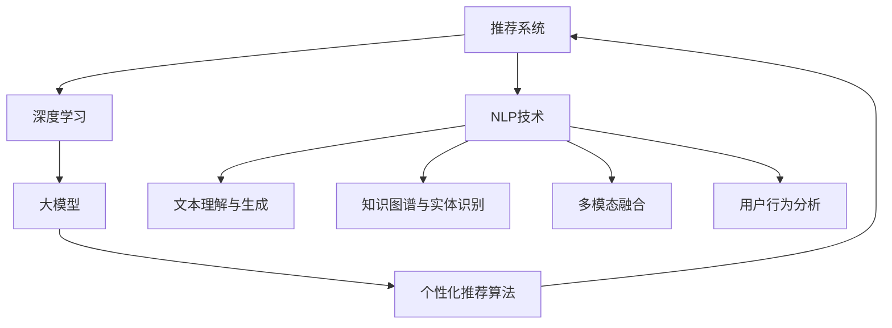

                 

# NLP技术在推荐系统的应用：大模型的潜力

> 关键词：自然语言处理(NLP),推荐系统,大模型,深度学习,用户行为分析,协同过滤,内容推荐,交互推荐,推荐算法

## 1. 背景介绍

### 1.1 问题由来
随着互联网技术的发展和智能设备的普及，信息过载成为了现代用户面临的主要问题。用户如何在大海般的信息中筛选出对自己有价值的资源，成为了许多企业和组织亟需解决的问题。推荐系统由此应运而生，通过对用户历史行为数据和资源特征进行建模分析，向用户推荐最符合其兴趣的资源。

自然语言处理(NLP)技术是推荐系统的一个重要组成部分。它通过对用户评论、标题、描述等文本数据的分析和挖掘，可以丰富推荐系统的信息维度，更好地理解用户的真实需求和兴趣。大模型的出现，更进一步提升了推荐系统的效果和泛化能力，使得NLP技术在推荐系统中的应用变得愈发重要。

### 1.2 问题核心关键点
大模型在推荐系统中的应用主要体现在以下几个方面：

1. **文本理解和生成**：利用大模型的预训练能力和微调技术，推荐系统可以从文本中提取用户兴趣，生成更个性化的推荐。
2. **知识图谱和实体识别**：通过大模型进行实体识别和知识图谱构建，推荐系统可以更准确地理解用户行为背后的语义信息。
3. **多模态融合**：结合图像、音频等多模态数据，大模型可以构建更加全面、多维度的用户画像。
4. **用户行为分析**：通过文本分析，大模型可以揭示用户行为的深层次模式，预测用户未来的行为趋势。
5. **个性化推荐算法**：大模型可以作为推荐算法的一部分，提高推荐系统的推荐效果和用户满意度。

目前，基于大模型的推荐系统已经在电商、新闻、音乐、视频等多个领域取得了显著的成果，成为了推荐系统的重要发展方向。

## 2. 核心概念与联系

### 2.1 核心概念概述

为了更好地理解基于大模型的推荐系统，本节将介绍几个核心概念及其相互联系：

- **推荐系统(Recommender System)**：通过分析用户历史行为和资源特征，自动为用户推荐最符合其兴趣的资源。
- **自然语言处理(NLP)**：利用计算机技术处理和理解自然语言，实现文本分析、文本生成等任务。
- **深度学习(Deep Learning)**：一类利用多层神经网络进行学习和决策的机器学习方法，大模型即一种深度学习模型。
- **大模型(Large Model)**：如BERT、GPT等，具有数十亿参数的预训练语言模型，具备强大的语言理解和生成能力。
- **协同过滤(Collaborative Filtering)**：推荐系统中最基础的推荐算法之一，基于用户和物品的相似度进行推荐。
- **内容推荐(Content-Based Recommendation)**：根据物品的属性特征进行推荐，适用于物品信息丰富的场景。
- **交互推荐(Explicit Feedback-Based Recommendation)**：利用用户显式反馈进行推荐，适用于高互动性的场景。

这些核心概念之间通过以下Mermaid流程图展示其联系：



从上述流程图可以看出，大模型在推荐系统中的应用主要体现在以下几个方面：

1. **利用NLP技术进行文本理解与生成**，提升推荐系统的个性化和多样性。
2. **通过知识图谱与实体识别**，增强推荐系统的语义理解和上下文关联。
3. **实现多模态融合**，构建更加全面、多维度的用户画像。
4. **进行用户行为分析**，揭示用户兴趣和行为模式，预测未来行为。
5. **个性化推荐算法**，利用大模型的预训练能力和微调技术，提高推荐系统的推荐效果。

这些核心概念相互联系，共同构成了大模型在推荐系统中的应用框架。

## 3. 核心算法原理 & 具体操作步骤
### 3.1 算法原理概述

基于大模型的推荐系统，其核心思想是利用预训练语言模型在大量文本数据上学习到的语言知识，通过微调等方式，将大模型应用于推荐系统中的各个环节，提升推荐系统的性能。

形式化地，假设推荐系统中的物品为 $I$，用户为 $U$，用户与物品的交互矩阵为 $R \in \{0,1\}^{N\times M}$，其中 $N$ 为用户数，$M$ 为物品数。假设大模型为 $M_{\theta}$，其中 $\theta$ 为模型参数。

推荐系统的目标是最小化用户与物品之间的交互误差，即：

$$
\mathop{\min}_{\theta} \sum_{i=1}^N \sum_{j=1}^M \mathcal{L}(R_{ij}, M_{\theta}(x_i))
$$

其中 $\mathcal{L}$ 为用户和物品之间交互误差的损失函数，$x_i$ 为用户 $i$ 的输入特征，$R_{ij}$ 为 $i$ 对 $j$ 的评分（可以是真实评分，也可以是预测评分）。

通过梯度下降等优化算法，推荐系统不断更新模型参数 $\theta$，最小化损失函数 $\mathcal{L}$，使得模型预测与真实评分尽量一致。

### 3.2 算法步骤详解

基于大模型的推荐系统一般包括以下几个关键步骤：

**Step 1: 准备数据集和模型**
- 准备推荐系统的训练数据集，包含用户-物品评分矩阵 $R$ 和用户特征向量 $x$。
- 选择合适的预训练语言模型 $M_{\theta}$ 作为初始化参数，如BERT、GPT等。

**Step 2: 添加任务适配层**
- 根据任务类型，在预训练模型顶层设计合适的输出层和损失函数。
- 对于评分预测任务，通常在顶层添加线性分类器或神经网络输出层，并以均方误差损失函数进行训练。

**Step 3: 设置微调超参数**
- 选择合适的优化算法及其参数，如 AdamW、SGD 等，设置学习率、批大小、迭代轮数等。
- 设置正则化技术及强度，包括权重衰减、Dropout、Early Stopping 等。
- 确定冻结预训练参数的策略，如仅微调顶层，或全部参数都参与微调。

**Step 4: 执行梯度训练**
- 将训练集数据分批次输入模型，前向传播计算损失函数。
- 反向传播计算参数梯度，根据设定的优化算法和学习率更新模型参数。
- 周期性在验证集上评估模型性能，根据性能指标决定是否触发 Early Stopping。
- 重复上述步骤直到满足预设的迭代轮数或 Early Stopping 条件。

**Step 5: 测试和部署**
- 在测试集上评估微调后模型 $M_{\hat{\theta}}$ 的性能，对比微调前后的推荐效果。
- 使用微调后的模型对新用户和新物品进行评分预测，集成到实际的应用系统中。

### 3.3 算法优缺点

基于大模型的推荐系统有以下优点：
1. 泛化能力强。大模型预训练于大规模无标签数据，具备较强的泛化能力，能够有效处理推荐系统中的长尾问题。
2. 个性化程度高。大模型可以分析文本特征，学习用户兴趣和行为模式，提供更加个性化的推荐。
3. 多模态融合能力强。大模型可以处理图像、音频等多模态数据，构建更加丰富的用户画像。
4. 跨领域迁移能力强。大模型可以在不同领域和数据分布上实现迁移学习，提升推荐系统的效果。

同时，该方法也存在一定的局限性：
1. 对数据质量要求高。大模型的预训练需要大量高质量数据，推荐系统的训练同样需要高质量的数据。
2. 计算资源消耗大。大模型的参数量庞大，训练和推理需要较大的计算资源。
3. 用户隐私风险。通过分析用户文本数据，可能会涉及用户隐私和数据安全问题。
4. 模型复杂度较高。大模型的结构和参数复杂，难以调试和解释。

尽管存在这些局限性，但大模型在推荐系统中的应用前景依然广阔，通过不断优化模型、算法和数据，未来将有望进一步提升推荐系统的效果和用户体验。

### 3.4 算法应用领域

大模型的推荐系统已经在电商、新闻、音乐、视频等多个领域得到了广泛的应用，具体包括：

- **电商推荐**：利用用户评论、商品描述等文本数据，结合用户行为数据，提供个性化商品推荐。
- **新闻推荐**：分析用户阅读记录和评论，推荐相关新闻文章和话题。
- **音乐推荐**：利用歌词、用户评论等多模态数据，推荐用户可能喜欢的音乐。
- **视频推荐**：分析视频标题、描述、标签等文本特征，推荐用户可能喜欢的视频内容。

除此之外，大模型还可以应用于更多场景中，如社交网络推荐、金融投资、教育培训等，为各行业带来变革性的影响。

## 4. 数学模型和公式 & 详细讲解  
### 4.1 数学模型构建

本节将使用数学语言对基于大模型的推荐系统进行更加严格的刻画。

假设推荐系统中的物品为 $I$，用户为 $U$，用户与物品的交互矩阵为 $R \in \{0,1\}^{N\times M}$，其中 $N$ 为用户数，$M$ 为物品数。假设大模型为 $M_{\theta}$，其中 $\theta$ 为模型参数。

定义模型 $M_{\theta}$ 在输入 $x$ 上的输出为 $y=M_{\theta}(x) \in \mathbb{R}^d$，其中 $d$ 为输出维度。假设模型 $M_{\theta}$ 在用户 $i$ 和物品 $j$ 上的预测评分为 $y_{ij}$，则推荐系统的目标是最小化用户和物品之间的交互误差，即：

$$
\mathop{\min}_{\theta} \sum_{i=1}^N \sum_{j=1}^M \mathcal{L}(R_{ij}, y_{ij})
$$

其中 $\mathcal{L}$ 为用户和物品之间交互误差的损失函数。以均方误差损失为例，定义为：

$$
\mathcal{L}(R_{ij}, y_{ij}) = \frac{1}{2}(R_{ij} - y_{ij})^2
$$

因此，推荐系统的损失函数为：

$$
\mathcal{L}(\theta) = \frac{1}{2} \sum_{i=1}^N \sum_{j=1}^M (R_{ij} - y_{ij})^2
$$

根据链式法则，损失函数对参数 $\theta_k$ 的梯度为：

$$
\frac{\partial \mathcal{L}(\theta)}{\partial \theta_k} = \sum_{i=1}^N \sum_{j=1}^M (R_{ij} - y_{ij}) \frac{\partial y_{ij}}{\partial \theta_k}
$$

其中 $\frac{\partial y_{ij}}{\partial \theta_k}$ 为模型在输入 $x_i$ 上的输出对参数 $\theta_k$ 的偏导数，可以通过自动微分技术高效计算。

在得到损失函数的梯度后，即可带入参数更新公式，完成模型的迭代优化。重复上述过程直至收敛，最终得到适应推荐任务的最优模型参数 $\theta^*$。

### 4.2 公式推导过程

以下我们以二分类任务为例，推导交叉熵损失函数及其梯度的计算公式。

假设模型 $M_{\theta}$ 在输入 $x$ 上的输出为 $\hat{y}=M_{\theta}(x) \in [0,1]$，表示物品 $j$ 被用户 $i$ 喜欢的概率。真实评分 $R_{ij} \in \{0,1\}$。则二分类交叉熵损失函数定义为：

$$
\mathcal{L}(R_{ij}, y_{ij}) = -[R_{ij}\log \hat{y} + (1-R_{ij})\log (1-\hat{y})]
$$

将其代入推荐系统的损失函数公式，得：

$$
\mathcal{L}(\theta) = \frac{1}{2} \sum_{i=1}^N \sum_{j=1}^M -[R_{ij}\log \hat{y}_{ij} + (1-R_{ij})\log (1-\hat{y}_{ij})]
$$

根据链式法则，损失函数对参数 $\theta_k$ 的梯度为：

$$
\frac{\partial \mathcal{L}(\theta)}{\partial \theta_k} = \frac{1}{2} \sum_{i=1}^N \sum_{j=1}^M (-R_{ij} + \hat{y}_{ij}) \frac{\partial \hat{y}_{ij}}{\partial \theta_k}
$$

其中 $\frac{\partial \hat{y}_{ij}}{\partial \theta_k}$ 为模型在输入 $x_i$ 上的输出对参数 $\theta_k$ 的偏导数，可以通过自动微分技术高效计算。

在得到损失函数的梯度后，即可带入参数更新公式，完成模型的迭代优化。重复上述过程直至收敛，最终得到适应推荐任务的最优模型参数 $\theta^*$。

## 5. 项目实践：代码实例和详细解释说明
### 5.1 开发环境搭建

在进行推荐系统开发前，我们需要准备好开发环境。以下是使用Python进行PyTorch开发的环境配置流程：

1. 安装Anaconda：从官网下载并安装Anaconda，用于创建独立的Python环境。

2. 创建并激活虚拟环境：
```bash
conda create -n pytorch-env python=3.8 
conda activate pytorch-env
```

3. 安装PyTorch：根据CUDA版本，从官网获取对应的安装命令。例如：
```bash
conda install pytorch torchvision torchaudio cudatoolkit=11.1 -c pytorch -c conda-forge
```

4. 安装Transformers库：
```bash
pip install transformers
```

5. 安装各类工具包：
```bash
pip install numpy pandas scikit-learn matplotlib tqdm jupyter notebook ipython
```

完成上述步骤后，即可在`pytorch-env`环境中开始推荐系统开发。

### 5.2 源代码详细实现

这里我们以电商推荐系统为例，给出使用Transformers库对BERT模型进行推荐系统微调的PyTorch代码实现。

首先，定义推荐系统的数据处理函数：

```python
from transformers import BertTokenizer
from torch.utils.data import Dataset
import torch

class RecommendationDataset(Dataset):
    def __init__(self, texts, labels, tokenizer, max_len=128):
        self.texts = texts
        self.labels = labels
        self.tokenizer = tokenizer
        self.max_len = max_len
        
    def __len__(self):
        return len(self.texts)
    
    def __getitem__(self, item):
        text = self.texts[item]
        label = self.labels[item]
        
        encoding = self.tokenizer(text, return_tensors='pt', max_length=self.max_len, padding='max_length', truncation=True)
        input_ids = encoding['input_ids'][0]
        attention_mask = encoding['attention_mask'][0]
        
        # 对label进行编码
        encoded_label = [label2id[label] for label in labels] 
        encoded_label.extend([label2id['0']] * (self.max_len - len(encoded_label)))
        labels = torch.tensor(encoded_label, dtype=torch.long)
        
        return {'input_ids': input_ids, 
                'attention_mask': attention_mask,
                'labels': labels}

# 标签与id的映射
label2id = {'0': 0, '1': 1}
id2label = {v: k for k, v in label2id.items()}

# 创建dataset
tokenizer = BertTokenizer.from_pretrained('bert-base-cased')

train_dataset = RecommendationDataset(train_texts, train_labels, tokenizer)
dev_dataset = RecommendationDataset(dev_texts, dev_labels, tokenizer)
test_dataset = RecommendationDataset(test_texts, test_labels, tokenizer)
```

然后，定义模型和优化器：

```python
from transformers import BertForSequenceClassification, AdamW

model = BertForSequenceClassification.from_pretrained('bert-base-cased', num_labels=len(label2id))

optimizer = AdamW(model.parameters(), lr=2e-5)
```

接着，定义训练和评估函数：

```python
from torch.utils.data import DataLoader
from tqdm import tqdm
from sklearn.metrics import classification_report

device = torch.device('cuda') if torch.cuda.is_available() else torch.device('cpu')
model.to(device)

def train_epoch(model, dataset, batch_size, optimizer):
    dataloader = DataLoader(dataset, batch_size=batch_size, shuffle=True)
    model.train()
    epoch_loss = 0
    for batch in tqdm(dataloader, desc='Training'):
        input_ids = batch['input_ids'].to(device)
        attention_mask = batch['attention_mask'].to(device)
        labels = batch['labels'].to(device)
        model.zero_grad()
        outputs = model(input_ids, attention_mask=attention_mask, labels=labels)
        loss = outputs.loss
        epoch_loss += loss.item()
        loss.backward()
        optimizer.step()
    return epoch_loss / len(dataloader)

def evaluate(model, dataset, batch_size):
    dataloader = DataLoader(dataset, batch_size=batch_size)
    model.eval()
    preds, labels = [], []
    with torch.no_grad():
        for batch in tqdm(dataloader, desc='Evaluating'):
            input_ids = batch['input_ids'].to(device)
            attention_mask = batch['attention_mask'].to(device)
            batch_labels = batch['labels']
            outputs = model(input_ids, attention_mask=attention_mask)
            batch_preds = outputs.logits.argmax(dim=2).to('cpu').tolist()
            batch_labels = batch_labels.to('cpu').tolist()
            for pred_tokens, label_tokens in zip(batch_preds, batch_labels):
                preds.append(pred_tokens[:len(label_tokens)])
                labels.append(label_tokens)
                
    print(classification_report(labels, preds))
```

最后，启动训练流程并在测试集上评估：

```python
epochs = 5
batch_size = 16

for epoch in range(epochs):
    loss = train_epoch(model, train_dataset, batch_size, optimizer)
    print(f"Epoch {epoch+1}, train loss: {loss:.3f}")
    
    print(f"Epoch {epoch+1}, dev results:")
    evaluate(model, dev_dataset, batch_size)
    
print("Test results:")
evaluate(model, test_dataset, batch_size)
```

以上就是使用PyTorch对BERT进行推荐系统微调的完整代码实现。可以看到，得益于Transformers库的强大封装，我们可以用相对简洁的代码完成BERT模型的加载和微调。

### 5.3 代码解读与分析

让我们再详细解读一下关键代码的实现细节：

**RecommendationDataset类**：
- `__init__`方法：初始化文本、标签、分词器等关键组件。
- `__len__`方法：返回数据集的样本数量。
- `__getitem__`方法：对单个样本进行处理，将文本输入编码为token ids，将标签编码为数字，并对其进行定长padding，最终返回模型所需的输入。

**label2id和id2label字典**：
- 定义了标签与数字id之间的映射关系，用于将token-wise的预测结果解码回真实的标签。

**训练和评估函数**：
- 使用PyTorch的DataLoader对数据集进行批次化加载，供模型训练和推理使用。
- 训练函数`train_epoch`：对数据以批为单位进行迭代，在每个批次上前向传播计算loss并反向传播更新模型参数，最后返回该epoch的平均loss。
- 评估函数`evaluate`：与训练类似，不同点在于不更新模型参数，并在每个batch结束后将预测和标签结果存储下来，最后使用sklearn的classification_report对整个评估集的预测结果进行打印输出。

**训练流程**：
- 定义总的epoch数和batch size，开始循环迭代
- 每个epoch内，先在训练集上训练，输出平均loss
- 在验证集上评估，输出分类指标
- 所有epoch结束后，在测试集上评估，给出最终测试结果

可以看到，PyTorch配合Transformers库使得BERT微调的代码实现变得简洁高效。开发者可以将更多精力放在数据处理、模型改进等高层逻辑上，而不必过多关注底层的实现细节。

当然，工业级的系统实现还需考虑更多因素，如模型的保存和部署、超参数的自动搜索、更灵活的任务适配层等。但核心的微调范式基本与此类似。

## 6. 实际应用场景
### 6.1 智能客服系统

智能客服系统可以利用大模型进行自然语言理解，通过微调提升系统对用户意图的理解能力。当用户输入问题时，系统能够快速准确地识别出用户的问题类型和具体需求，从而提供相应的解决方案。

具体实现中，可以收集企业内部的客服对话记录，将问题和最佳答复构建成监督数据，在此基础上对预训练对话模型进行微调。微调后的对话模型能够自动理解用户意图，匹配最合适的答案模板进行回复。对于客户提出的新问题，还可以接入检索系统实时搜索相关内容，动态组织生成回答。如此构建的智能客服系统，能大幅提升客户咨询体验和问题解决效率。

### 6.2 金融舆情监测

金融机构需要实时监测市场舆论动向，以便及时应对负面信息传播，规避金融风险。大模型可以通过微调进行情感分析和主题分类，分析网络文本中的情感倾向和话题焦点，识别异常舆情信息。

具体而言，可以收集金融领域相关的新闻、报道、评论等文本数据，并对其进行情感标注和主题标注。在此基础上对预训练语言模型进行微调，使其能够自动判断文本属于何种情感和主题。将微调后的模型应用到实时抓取的网络文本数据，就能够自动监测不同情感和主题的舆情变化趋势，一旦发现负面情感或敏感话题激增等异常情况，系统便会自动预警，帮助金融机构快速应对潜在风险。

### 6.3 个性化推荐系统

当前的推荐系统往往只依赖用户的历史行为数据进行物品推荐，无法深入理解用户的真实兴趣偏好。大模型可以结合文本数据，进行更全面的用户兴趣建模。

在实践中，可以收集用户浏览、点击、评论、分享等行为数据，提取和用户交互的物品标题、描述、标签等文本内容。将文本内容作为模型输入，用户的后续行为（如是否点击、购买等）作为监督信号，在此基础上微调预训练语言模型。微调后的模型能够从文本内容中准确把握用户的兴趣点。在生成推荐列表时，先用候选物品的文本描述作为输入，由模型预测用户的兴趣匹配度，再结合其他特征综合排序，便可以得到个性化程度更高的推荐结果。

### 6.4 未来应用展望

随着大模型的不断演进，基于大模型的推荐系统也将迎来新的发展机遇。未来，推荐系统将在以下几个方面得到提升：

1. **跨领域迁移能力增强**。大模型可以在不同领域和数据分布上实现迁移学习，提升推荐系统的效果。
2. **知识图谱与实体识别**。通过知识图谱与实体识别，推荐系统可以更准确地理解用户行为背后的语义信息。
3. **多模态融合**。结合图像、音频等多模态数据，推荐系统可以构建更加全面、多维度的用户画像。
4. **个性化推荐算法创新**。开发更加高效的推荐算法，如对抗训练、多任务学习等，提升推荐系统的效果。
5. **隐私保护与数据安全**。在推荐系统开发过程中，需要考虑用户隐私和数据安全问题，采取必要的保护措施。

总之，基于大模型的推荐系统将在智能客服、金融舆情、个性化推荐等多个领域发挥重要作用，为各行业带来变革性的影响。未来，随着技术的不断进步和应用场景的扩展，推荐系统将进一步提升用户体验，推动社会进步。

## 7. 工具和资源推荐
### 7.1 学习资源推荐

为了帮助开发者系统掌握大模型在推荐系统中的应用，这里推荐一些优质的学习资源：

1. 《Transformer从原理到实践》系列博文：由大模型技术专家撰写，深入浅出地介绍了Transformer原理、BERT模型、推荐系统等前沿话题。

2. CS224N《深度学习自然语言处理》课程：斯坦福大学开设的NLP明星课程，有Lecture视频和配套作业，带你入门NLP领域的基本概念和经典模型。

3. 《Natural Language Processing with Transformers》书籍：Transformers库的作者所著，全面介绍了如何使用Transformers库进行NLP任务开发，包括推荐系统的开发。

4. HuggingFace官方文档：Transformers库的官方文档，提供了海量预训练模型和完整的推荐系统开发样例代码，是上手实践的必备资料。

5. CLUE开源项目：中文语言理解测评基准，涵盖大量不同类型的中文NLP数据集，并提供了基于微调的推荐系统baseline模型，助力中文NLP技术发展。

通过对这些资源的学习实践，相信你一定能够快速掌握大模型在推荐系统中的应用精髓，并用于解决实际的NLP问题。
###  7.2 开发工具推荐

高效的开发离不开优秀的工具支持。以下是几款用于大模型推荐系统开发的常用工具：

1. PyTorch：基于Python的开源深度学习框架，灵活动态的计算图，适合快速迭代研究。大部分预训练语言模型都有PyTorch版本的实现。

2. TensorFlow：由Google主导开发的开源深度学习框架，生产部署方便，适合大规模工程应用。同样有丰富的预训练语言模型资源。

3. Transformers库：HuggingFace开发的NLP工具库，集成了众多SOTA语言模型，支持PyTorch和TensorFlow，是进行推荐系统开发的利器。

4. Weights & Biases：模型训练的实验跟踪工具，可以记录和可视化模型训练过程中的各项指标，方便对比和调优。与主流深度学习框架无缝集成。

5. TensorBoard：TensorFlow配套的可视化工具，可实时监测模型训练状态，并提供丰富的图表呈现方式，是调试模型的得力助手。

6. Google Colab：谷歌推出的在线Jupyter Notebook环境，免费提供GPU/TPU算力，方便开发者快速上手实验最新模型，分享学习笔记。

合理利用这些工具，可以显著提升大模型推荐系统的开发效率，加快创新迭代的步伐。

### 7.3 相关论文推荐

大模型在推荐系统中的应用源于学界的持续研究。以下是几篇奠基性的相关论文，推荐阅读：

1. Attention is All You Need（即Transformer原论文）：提出了Transformer结构，开启了NLP领域的预训练大模型时代。

2. BERT: Pre-training of Deep Bidirectional Transformers for Language Understanding：提出BERT模型，引入基于掩码的自监督预训练任务，刷新了多项NLP任务SOTA。

3. Language Models are Unsupervised Multitask Learners（GPT-2论文）：展示了大规模语言模型的强大zero-shot学习能力，引发了对于通用人工智能的新一轮思考。

4. Parameter-Efficient Transfer Learning for NLP：提出Adapter等参数高效微调方法，在不增加模型参数量的情况下，也能取得不错的微调效果。

5. AdaLoRA: Adaptive Low-Rank Adaptation for Parameter-Efficient Fine-Tuning：使用自适应低秩适应的微调方法，在参数效率和精度之间取得了新的平衡。

6. Parameter-Efficient Neural Machine Translation：提出BERT-PT模型，在机器翻译任务中实现了参数高效的微调方法，提高了翻译质量。

这些论文代表了大模型在推荐系统中的应用方向。通过学习这些前沿成果，可以帮助研究者把握学科前进方向，激发更多的创新灵感。

## 8. 总结：未来发展趋势与挑战

### 8.1 总结

本文对基于大模型的推荐系统进行了全面系统的介绍。首先阐述了大模型在推荐系统中的应用背景和意义，明确了大模型微调在提升推荐系统性能方面的重要作用。其次，从原理到实践，详细讲解了大模型的微调方法及其在推荐系统中的具体应用。同时，本文还广泛探讨了大模型推荐系统的实际应用场景，展示了其广阔的应用前景。

通过本文的系统梳理，可以看到，基于大模型的推荐系统已经在电商、新闻、音乐、视频等多个领域取得了显著的成果，成为了推荐系统的重要发展方向。未来，随着大模型的不断演进，推荐系统将在各个领域得到更广泛的应用，为各行业带来深刻的变革。

### 8.2 未来发展趋势

展望未来，大模型在推荐系统中的应用将呈现以下几个发展趋势：

1. **跨领域迁移能力增强**。大模型可以在不同领域和数据分布上实现迁移学习，提升推荐系统的效果。
2. **知识图谱与实体识别**。通过知识图谱与实体识别，推荐系统可以更准确地理解用户行为背后的语义信息。
3. **多模态融合**。结合图像、音频等多模态数据，推荐系统可以构建更加全面、多维度的用户画像。
4. **个性化推荐算法创新**。开发更加高效的推荐算法，如对抗训练、多任务学习等，提升推荐系统的效果。
5. **隐私保护与数据安全**。在推荐系统开发过程中，需要考虑用户隐私和数据安全问题，采取必要的保护措施。

这些趋势凸显了大模型在推荐系统中的应用前景。通过不断优化模型、算法和数据，未来将有望进一步提升推荐系统的效果和用户体验。

### 8.3 面临的挑战

尽管大模型在推荐系统中的应用前景广阔，但在迈向更加智能化、普适化应用的过程中，它仍面临着诸多挑战：

1. **数据质量瓶颈**。大模型的预训练需要大量高质量数据，推荐系统的训练同样需要高质量的数据。如何获取高质量的数据，是大模型应用中需要解决的重要问题。
2. **计算资源消耗大**。大模型的参数量庞大，训练和推理需要较大的计算资源。如何在有限的资源下训练出高效的大模型，是推荐系统开发中的重要难题。
3. **用户隐私风险**。通过分析用户文本数据，可能会涉及用户隐私和数据安全问题。如何在保护用户隐私的同时，提升推荐系统的效果，需要更多的研究。
4. **模型复杂度较高**。大模型的结构和参数复杂，难以调试和解释。如何在保证模型性能的同时，降低模型的复杂度，是一个重要的研究方向。

尽管存在这些挑战，但随着技术的不断进步和应用场景的扩展，大模型在推荐系统中的应用将越来越广泛，为各行业带来更高效、更个性化的服务体验。未来，通过持续优化模型、算法和数据，大模型推荐系统必将在各个领域发挥更加重要的作用。

### 8.4 研究展望

面对大模型在推荐系统中的应用挑战，未来的研究需要在以下几个方面寻求新的突破：

1. **数据增强与数据生成**。通过数据增强和数据生成技术，提升推荐系统的数据质量，缓解数据质量瓶颈。
2. **计算图优化与模型压缩**。开发更加高效的计算图优化和模型压缩技术，降低大模型的计算资源消耗，提升模型的推理效率。
3. **隐私保护技术**。开发隐私保护技术，如差分隐私、联邦学习等，在保护用户隐私的同时，提升推荐系统的性能。
4. **模型解释性与可解释性**。开发可解释性强的模型，通过可视化工具帮助用户理解推荐系统的决策过程。
5. **跨领域迁移学习**。开发跨领域迁移学习技术，提升推荐系统在不同领域上的泛化能力。

这些研究方向的探索，必将引领大模型推荐系统迈向更高的台阶，为推荐系统带来更强的适应性和更优的性能。未来，随着技术的不断进步和应用场景的扩展，大模型推荐系统必将在各个领域发挥更加重要的作用。

## 9. 附录：常见问题与解答

**Q1：推荐系统中的数据质量如何保证？**

A: 推荐系统中的数据质量至关重要，直接影响模型的训练效果。为了保证数据质量，可以采取以下措施：
1. 数据清洗：对数据进行去重、去噪、填补缺失值等预处理，保证数据的完整性和一致性。
2. 数据标注：确保标注数据的准确性和多样性，可以通过人工标注和众包标注相结合的方式。
3. 数据扩充：通过数据增强和数据生成技术，提升数据的多样性和丰富性，缓解数据稀疏问题。
4. 数据平衡：对数据进行采样平衡，避免数据分布不均衡导致模型偏向于某些类别。

**Q2：推荐系统中的用户隐私如何保护？**

A: 推荐系统在处理用户数据时，需要严格遵守隐私保护法规和标准，如GDPR、CCPA等。可以采取以下措施保护用户隐私：
1. 数据匿名化：对用户数据进行去标识化处理，保护用户隐私。
2. 差分隐私：在数据发布前加入噪声，确保数据匿名化处理的同时，仍能保留统计特性。
3. 联邦学习：在多方数据源中分布式训练模型，避免数据集中存储。
4. 安全多方计算：在多数据源之间进行安全计算，确保数据不泄露。

**Q3：推荐系统中的模型复杂度如何控制？**

A: 推荐系统中的模型复杂度较高，难以调试和解释。可以采取以下措施控制模型复杂度：
1. 模型压缩：使用模型压缩技术，如剪枝、量化等，减少模型的参数量和计算资源消耗。
2. 参数共享：采用共享参数的模型结构，降低模型的复杂度。
3. 模型简化：使用更简单的模型结构，如线性回归、逻辑回归等，降低模型的复杂度。
4. 模型解释性：开发可解释性强的模型，通过可视化工具帮助用户理解推荐系统的决策过程。

这些措施可以有效地控制模型复杂度，提升推荐系统的性能和可解释性。

**Q4：推荐系统中的计算资源如何优化？**

A: 推荐系统中的大模型参数量庞大，计算资源消耗大。可以采取以下措施优化计算资源：
1. 模型并行：采用模型并行技术，将模型分布在多台设备上进行并行计算。
2. 梯度积累：通过梯度积累技术，将多批次的小梯度合并为一个大的梯度，降低计算资源消耗。
3. 混合精度训练：使用混合精度训练技术，降低计算资源消耗，提高训练效率。
4. 模型压缩：使用模型压缩技术，如剪枝、量化等，减少模型的参数量和计算资源消耗。

这些措施可以有效地优化计算资源，提升推荐系统的训练效率和推理速度。

通过本文的系统梳理，可以看到，基于大模型的推荐系统已经在电商、新闻、音乐、视频等多个领域取得了显著的成果，成为了推荐系统的重要发展方向。未来，随着大模型的不断演进，推荐系统将在各个领域得到更广泛的应用，为各行业带来深刻的变革。

---

作者：禅与计算机程序设计艺术 / Zen and the Art of Computer Programming

