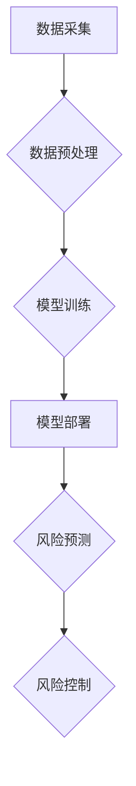

> 大模型，金融风控，机器学习，自然语言处理，风险识别，欺诈检测，信用评估

## 1. 背景介绍

金融风控是金融机构的核心业务之一，旨在识别和管理金融风险，保障金融机构的稳定运营和客户利益。传统的风控方法主要依赖于规则引擎和专家经验，但随着金融业务的复杂化和数据量的激增，传统方法已难以满足日益增长的需求。

近年来，深度学习和自然语言处理等人工智能技术取得了突破性进展，为金融风控提供了新的解决方案。大模型，作为人工智能领域的新兴技术，凭借其强大的学习能力和泛化能力，在金融风控领域展现出巨大的应用潜力。

## 2. 核心概念与联系

**2.1 大模型概述**

大模型是指参数规模庞大、训练数据海量的人工智能模型。与传统深度学习模型相比，大模型拥有更强的学习能力和泛化能力，能够处理更复杂的任务，并取得更优的性能。

**2.2 金融风控概述**

金融风控是指金融机构通过识别、评估和管理各种金融风险，以保障自身利益和客户利益的活动。常见的金融风险包括信用风险、市场风险、操作风险和法律风险等。

**2.3 大模型在金融风控中的应用**

大模型可以应用于金融风控的多个环节，例如：

* **风险识别:** 利用大模型分析海量金融数据，识别潜在的风险行为，例如欺诈交易、洗钱活动等。
* **风险评估:** 根据历史数据和客户特征，利用大模型对风险进行量化评估，为风险管理提供决策依据。
* **风险控制:** 根据风险评估结果，利用大模型制定相应的风险控制措施，例如设置交易限额、加强客户身份验证等。

**2.4 核心架构**



## 3. 核心算法原理 & 具体操作步骤

**3.1 算法原理概述**

大模型在金融风控中的应用主要基于以下核心算法：

* **机器学习:** 利用历史数据训练模型，学习风险特征，并进行风险预测。常见的机器学习算法包括逻辑回归、支持向量机、决策树、随机森林等。
* **深度学习:** 利用多层神经网络，学习更复杂的风险特征，并取得更优的预测性能。常见的深度学习算法包括卷积神经网络、循环神经网络等。
* **自然语言处理:** 利用自然语言处理技术，分析文本数据，例如客户交易记录、社交媒体评论等，提取风险相关信息。

**3.2 算法步骤详解**

1. **数据采集:** 收集金融数据，例如交易记录、客户信息、市场数据等。
2. **数据预处理:** 对数据进行清洗、转换、特征工程等处理，使其适合模型训练。
3. **模型训练:** 选择合适的算法，利用训练数据训练模型，并进行模型评估。
4. **模型部署:** 将训练好的模型部署到生产环境，用于风险预测。
5. **风险控制:** 根据模型预测结果，制定相应的风险控制措施。

**3.3 算法优缺点**

* **优点:**

    * 能够处理海量数据，识别复杂风险模式。
    * 具有较高的预测精度，能够有效降低风险损失。
    * 可以自动化风险管理流程，提高效率。

* **缺点:**

    * 需要大量的数据进行训练，数据质量对模型性能影响较大。
    * 模型解释性较差，难以理解模型的决策逻辑。
    * 模型需要定期更新，以适应不断变化的风险环境。

**3.4 算法应用领域**

* **欺诈检测:** 识别信用卡欺诈、网络支付欺诈等。
* **洗钱检测:** 识别洗钱活动，防止资金流向非法用途。
* **信用评估:** 评估客户的信用风险，为贷款审批提供依据。
* **风险管理:** 识别和管理各种金融风险，例如市场风险、操作风险等。

## 4. 数学模型和公式 & 详细讲解 & 举例说明

**4.1 数学模型构建**

在金融风控中，常用的数学模型包括：

* **逻辑回归模型:** 用于二分类问题，例如判断交易是否为欺诈。
* **支持向量机模型:** 用于分类和回归问题，例如识别客户信用风险等级。
* **决策树模型:** 用于分类和回归问题，例如预测客户违约概率。

**4.2 公式推导过程**

例如，逻辑回归模型的损失函数为：

$$
L(w) = -\frac{1}{N} \sum_{i=1}^{N} y_i \log(p_i) + (1-y_i) \log(1-p_i)
$$

其中：

* $w$ 为模型参数
* $N$ 为样本数量
* $y_i$ 为样本 $i$ 的真实标签
* $p_i$ 为模型预测样本 $i$ 的概率

**4.3 案例分析与讲解**

假设我们想要构建一个欺诈检测模型，可以使用逻辑回归模型。训练数据包括客户交易记录、客户信息等特征，以及是否为欺诈交易的标签。模型训练完成后，可以将新交易数据输入模型，预测其是否为欺诈交易。

## 5. 项目实践：代码实例和详细解释说明

**5.1 开发环境搭建**

* Python 3.x
* TensorFlow 或 PyTorch
* Jupyter Notebook

**5.2 源代码详细实现**

```python
import tensorflow as tf

# 定义模型结构
model = tf.keras.models.Sequential([
    tf.keras.layers.Dense(64, activation='relu', input_shape=(num_features,)),
    tf.keras.layers.Dense(1, activation='sigmoid')
])

# 编译模型
model.compile(optimizer='adam',
              loss='binary_crossentropy',
              metrics=['accuracy'])

# 训练模型
model.fit(X_train, y_train, epochs=10)

# 评估模型
loss, accuracy = model.evaluate(X_test, y_test)
print('Loss:', loss)
print('Accuracy:', accuracy)
```

**5.3 代码解读与分析**

* 代码首先定义了模型结构，包括输入层、隐藏层和输出层。
* 然后编译模型，指定优化器、损失函数和评价指标。
* 接着训练模型，使用训练数据进行模型训练。
* 最后评估模型，使用测试数据评估模型的性能。

**5.4 运行结果展示**

训练完成后，可以查看模型的损失值和准确率。

## 6. 实际应用场景

大模型在金融风控领域的应用场景广泛，例如：

* **银行:** 识别信用卡欺诈、洗钱活动、贷款违约风险等。
* **保险公司:** 评估客户风险等级、识别欺诈理赔等。
* **证券公司:** 识别市场风险、预测股票价格波动等。

**6.4 未来应用展望**

随着人工智能技术的不断发展，大模型在金融风控领域的应用将更加广泛和深入。例如：

* **个性化风控:** 根据客户的个体特征，制定个性化的风控策略。
* **实时风控:** 利用实时数据流，进行实时风险监测和预警。
* **智能风控:** 利用人工智能技术，自动学习和优化风控策略。

## 7. 工具和资源推荐

**7.1 学习资源推荐**

* **书籍:**
    * 深度学习
    * 自然语言处理
* **在线课程:**
    * Coursera
    * edX
    * Udacity

**7.2 开发工具推荐**

* **TensorFlow:** 开源深度学习框架
* **PyTorch:** 开源深度学习框架
* **Jupyter Notebook:** 用于代码编写和可视化分析的工具

**7.3 相关论文推荐**

* **BERT for Financial Text Classification**
* **Deep Learning for Fraud Detection**
* **A Survey of Deep Learning Applications in Finance**

## 8. 总结：未来发展趋势与挑战

**8.1 研究成果总结**

大模型在金融风控领域取得了显著的成果，例如提高了欺诈检测的准确率、降低了信用风险损失等。

**8.2 未来发展趋势**

未来，大模型在金融风控领域的应用将更加广泛和深入，例如个性化风控、实时风控、智能风控等。

**8.3 面临的挑战**

* 数据质量问题
* 模型解释性问题
* 监管合规问题

**8.4 研究展望**

未来研究方向包括：

* 开发更鲁棒、更安全的金融风控模型
* 提高模型的解释性，增强用户信任
* 研究大模型在金融风控领域的监管合规问题


## 9. 附录：常见问题与解答

**9.1 如何选择合适的模型？**

选择合适的模型取决于具体的应用场景和数据特点。例如，对于二分类问题，可以使用逻辑回归模型；对于多分类问题，可以使用支持向量机模型或决策树模型。

**9.2 如何处理数据质量问题？**

数据质量问题是影响模型性能的重要因素。可以采用数据清洗、数据转换、特征工程等方法来处理数据质量问题。

**9.3 如何提高模型的解释性？**

提高模型的解释性可以采用以下方法：

* 使用可解释性模型，例如决策树模型。
* 使用模型解释技术，例如SHAP值解释。
* 提供模型决策的透明度和可追溯性。


作者：禅与计算机程序设计艺术 / Zen and the Art of Computer Programming 
<end_of_turn>