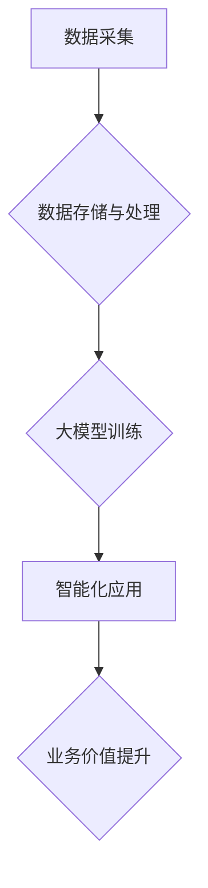

> 大模型、智能化、数字化、深度学习、Transformer、自然语言处理、计算机视觉、应用场景

## 1. 背景介绍

数字经济时代，数据已成为重要的生产要素，而数据驱动下的智能化应用成为经济社会发展的新引擎。近年来，深度学习技术取得了突破性进展，特别是大模型的出现，为智能化应用提供了强大的技术支撑。大模型是指参数规模庞大、训练数据海量、学习能力强的人工智能模型，其强大的泛化能力和适应性使其能够应用于广泛的领域，推动着智能化应用的快速发展。

传统的数字化转型主要侧重于数据收集、存储和分析，而大模型驱动的智能化则将数据转化为有价值的智能，赋予数据感知、理解和决策的能力。这标志着数字化转型迈向了一个新的阶段，从单纯的数据处理向智能化的应用方向发展。

## 2. 核心概念与联系

**2.1 大模型**

大模型是指参数规模庞大、训练数据海量、学习能力强的人工智能模型。其核心特点包括：

* **参数规模庞大:** 大模型通常拥有数十亿甚至数千亿个参数，这使得它们能够学习到更复杂的模式和关系。
* **训练数据海量:** 大模型的训练需要海量的数据，才能有效地学习和提升性能。
* **学习能力强:** 大模型能够学习到更抽象、更通用的知识，并应用于不同的任务和领域。

**2.2 智能化**

智能化是指赋予机器或系统类似人类的智能能力，例如感知、理解、决策和学习。智能化应用的核心是利用人工智能技术，模拟和增强人类的智能。

**2.3 数字化**

数字化是指将现实世界的信息和业务转化为数字形式，并通过数字技术进行处理和应用。数字化转型是企业和社会拥抱数字经济的关键，它涉及到各个方面，包括业务流程、组织结构、技术架构等。

**2.4 联系**

大模型是实现智能化的关键技术，而智能化是数字化的顶峰。大模型能够将数据转化为智能，赋予数字世界感知、理解和决策的能力，从而推动数字化的深度发展。

**2.5  Mermaid 流程图**



## 3. 核心算法原理 & 具体操作步骤

**3.1 算法原理概述**

大模型的训练主要基于深度学习算法，其中Transformer模型是近年来发展最快的模型架构之一。Transformer模型的核心特点是利用注意力机制，能够有效地捕捉文本序列中的长距离依赖关系，从而提升模型的理解和生成能力。

**3.2 算法步骤详解**

1. **数据预处理:** 将原始数据进行清洗、格式化和编码，使其能够被模型理解。
2. **模型构建:** 根据任务需求选择合适的Transformer模型架构，并设置模型参数。
3. **模型训练:** 使用训练数据训练模型，通过反向传播算法不断调整模型参数，使其能够准确地预测或生成目标输出。
4. **模型评估:** 使用测试数据评估模型的性能，并根据评估结果进行模型调优。
5. **模型部署:** 将训练好的模型部署到实际应用场景中，用于进行预测或生成任务。

**3.3 算法优缺点**

**优点:**

* 强大的泛化能力：能够应用于多种不同的任务和领域。
* 优秀的文本理解能力：能够捕捉文本序列中的长距离依赖关系，提升理解精度。
* 灵活的模型架构：可以根据任务需求进行调整和扩展。

**缺点:**

* 训练成本高：需要海量数据和强大的计算资源。
* 模型解释性差：难以理解模型的决策过程。
* 容易受到攻击：存在对抗样本攻击的风险。

**3.4 算法应用领域**

大模型在自然语言处理、计算机视觉、语音识别、机器翻译等领域都有广泛的应用，例如：

* **自然语言处理:** 文本生成、机器翻译、问答系统、情感分析等。
* **计算机视觉:** 图像识别、目标检测、图像分割等。
* **语音识别:** 语音转文本、语音助手等。
* **其他领域:** 药物研发、金融风险评估、个性化推荐等。

## 4. 数学模型和公式 & 详细讲解 & 举例说明

**4.1 数学模型构建**

Transformer模型的核心是注意力机制，其数学模型可以表示为：

$$
Attention(Q, K, V) = softmax(\frac{QK^T}{\sqrt{d_k}})V
$$

其中：

* $Q$：查询矩阵
* $K$：键矩阵
* $V$：值矩阵
* $d_k$：键向量的维度
* $softmax$：softmax函数

**4.2 公式推导过程**

注意力机制的目的是计算查询向量与键向量的相关性，并根据相关性对值向量进行加权求和。

1. 计算查询向量与每个键向量的点积，得到一个分数矩阵。
2. 对分数矩阵进行归一化，得到一个概率分布。
3. 将概率分布与值向量进行加权求和，得到最终的输出向量。

**4.3 案例分析与讲解**

例如，在机器翻译任务中，查询向量表示源语言的词语，键向量表示目标语言的词语，值向量表示目标语言的词语嵌入。注意力机制可以计算源语言词语与目标语言词语之间的相关性，并根据相关性选择合适的目标语言词语进行翻译。

## 5. 项目实践：代码实例和详细解释说明

**5.1 开发环境搭建**

* Python 3.7+
* PyTorch 1.7+
* CUDA 10.2+

**5.2 源代码详细实现**

```python
import torch
import torch.nn as nn

class Transformer(nn.Module):
    def __init__(self, vocab_size, embedding_dim, num_heads, num_layers):
        super(Transformer, self).__init__()
        self.embedding = nn.Embedding(vocab_size, embedding_dim)
        self.transformer_layers = nn.ModuleList([
            nn.TransformerEncoderLayer(embedding_dim, num_heads)
            for _ in range(num_layers)
        ])
        self.linear = nn.Linear(embedding_dim, vocab_size)

    def forward(self, x):
        x = self.embedding(x)
        for layer in self.transformer_layers:
            x = layer(x)
        x = self.linear(x)
        return x
```

**5.3 代码解读与分析**

* `__init__` 方法初始化模型参数，包括词嵌入层、Transformer编码器层和线性输出层。
* `forward` 方法定义模型的正向传播过程，将输入序列经过词嵌入层、Transformer编码器层和线性输出层，最终得到输出序列。

**5.4 运行结果展示**

训练好的模型可以用于各种自然语言处理任务，例如文本生成、机器翻译、问答系统等。

## 6. 实际应用场景

**6.1 自然语言处理**

* **文本生成:** 大模型可以用于生成各种类型的文本，例如小说、诗歌、新闻报道等。
* **机器翻译:** 大模型可以实现高质量的机器翻译，将一种语言翻译成另一种语言。
* **问答系统:** 大模型可以理解用户的问题，并从知识库中找到答案。
* **情感分析:** 大模型可以分析文本的情感倾向，例如正面、负面或中性。

**6.2 计算机视觉**

* **图像识别:** 大模型可以识别图像中的物体、场景和人物。
* **目标检测:** 大模型可以定位图像中的目标，并识别目标的类别。
* **图像分割:** 大模型可以将图像分割成不同的区域，例如前景和背景。

**6.3 语音识别**

* **语音转文本:** 大模型可以将语音转换为文本。
* **语音助手:** 大模型可以理解用户的语音指令，并执行相应的操作。

**6.4 未来应用展望**

大模型的应用场景还在不断扩展，未来将应用于更多领域，例如：

* **医疗保健:** 辅助诊断、预测疾病风险、个性化治疗方案。
* **教育:** 智能辅导、个性化学习路径、自动批改作业。
* **金融:** 风险评估、欺诈检测、个性化金融服务。

## 7. 工具和资源推荐

**7.1 学习资源推荐**

* **书籍:**
    * 《深度学习》
    * 《Transformer模型详解》
* **在线课程:**
    * Coursera: 深度学习
    * Udacity: 自然语言处理
* **博客:**
    * The Gradient
    * Towards Data Science

**7.2 开发工具推荐**

* **框架:** PyTorch, TensorFlow
* **库:** Hugging Face Transformers, OpenAI API

**7.3 相关论文推荐**

* 《Attention Is All You Need》
* 《BERT: Pre-training of Deep Bidirectional Transformers for Language Understanding》
* 《GPT-3: Language Models are Few-Shot Learners》

## 8. 总结：未来发展趋势与挑战

**8.1 研究成果总结**

近年来，大模型在人工智能领域取得了突破性进展，其强大的泛化能力和适应性使其能够应用于广泛的领域，推动着智能化应用的快速发展。

**8.2 未来发展趋势**

* **模型规模进一步扩大:** 随着计算资源的不断提升，大模型的规模将继续扩大，模型能力将进一步提升。
* **多模态学习:** 大模型将融合文本、图像、音频等多模态数据，实现更全面的智能感知和理解。
* **可解释性增强:** 研究人员将致力于提高大模型的可解释性，使其决策过程更加透明和可理解。

**8.3 面临的挑战**

* **训练成本高:** 大模型的训练需要海量数据和强大的计算资源，这对于资源有限的机构和个人来说是一个挑战。
* **模型安全:** 大模型容易受到攻击，例如对抗样本攻击，需要加强模型安全性的研究。
* **伦理问题:** 大模型的应用可能带来一些伦理问题，例如数据隐私、算法偏见等，需要进行深入的伦理探讨和规范。

**8.4 研究展望**

未来，大模型研究将继续朝着更强大、更安全、更可解释的方向发展，为人类社会带来更多福祉。

## 9. 附录：常见问题与解答

**9.1 如何选择合适的Transformer模型架构？**

选择合适的Transformer模型架构需要根据具体的任务需求和数据特点进行考虑。例如，对于文本生成任务，可以考虑使用GPT模型；对于机器翻译任务，可以考虑使用T5模型。

**9.2 如何训练大模型？**

训练大模型需要强大的计算资源和海量数据。可以使用云计算平台或高性能计算集群进行训练。

**9.3 如何评估大模型的性能？**

大模型的性能可以根据具体的任务需求进行评估。例如，对于文本生成任务，可以使用BLEU分数进行评估；对于机器翻译任务，可以使用METEOR分数进行评估。


作者：禅与计算机程序设计艺术 / Zen and the Art of Computer Programming 
<end_of_turn>