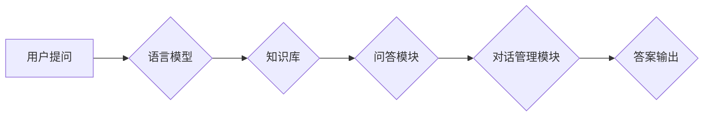

> 大模型、问答机器人、语言模型、Transformer、BERT、GPT、LLM、自然语言处理

## 1. 背景介绍

近年来，人工智能领域取得了令人瞩目的进展，其中自然语言处理（NLP）领域尤为突出。大模型问答机器人作为NLP领域的重要应用之一，在智能客服、教育辅助、信息检索等领域展现出巨大的潜力。

传统的问答系统主要依赖于规则引擎和知识库，难以处理复杂、开放式的自然语言问题。而大模型问答机器人则通过训练海量文本数据，学习语言的语义和结构，能够理解和生成更自然、更流畅的文本，从而实现更智能、更灵活的问答能力。

## 2. 核心概念与联系

大模型问答机器人主要由以下几个核心组件组成：

* **语言模型（Language Model）：** 负责理解和生成自然语言文本。
* **知识库（Knowledge Base）：** 存储着丰富的知识和事实信息。
* **问答模块（Question Answering Module）：** 负责根据用户的问题，从语言模型和知识库中获取答案。
* **对话管理模块（Dialogue Management Module）：** 负责管理对话流程，引导用户提问，并提供反馈。

**Mermaid 流程图：**



## 3. 核心算法原理 & 具体操作步骤

### 3.1  算法原理概述

大模型问答机器人的核心算法主要基于深度学习技术，特别是Transformer模型架构。Transformer模型能够有效捕捉文本序列中的长距离依赖关系，从而实现更准确的语言理解和生成。

### 3.2  算法步骤详解

1. **数据预处理：** 将文本数据进行清洗、分词、标记等预处理操作，使其能够被模型理解。
2. **模型训练：** 使用预处理后的数据训练Transformer模型，例如BERT、GPT等，使其能够学习语言的语义和结构。
3. **问答模块构建：** 基于训练好的语言模型，构建问答模块，使其能够根据用户的问题，从知识库中获取相关信息，并生成准确的答案。
4. **对话管理模块构建：** 基于对话管理策略，构建对话管理模块，使其能够引导用户提问，并提供反馈，从而实现更自然的对话体验。

### 3.3  算法优缺点

**优点：**

* 能够理解和生成更自然、更流畅的文本。
* 能够处理复杂、开放式的自然语言问题。
* 能够不断学习和改进，提升问答能力。

**缺点：**

* 训练成本高，需要海量数据和计算资源。
* 容易受到训练数据的影响，可能产生偏差或错误。
* 缺乏对真实世界知识的理解，难以回答一些需要常识推理的问题。

### 3.4  算法应用领域

大模型问答机器人具有广泛的应用领域，例如：

* **智能客服：** 自动回答用户常见问题，提高客服效率。
* **教育辅助：** 为学生提供个性化的学习辅导，解答学习疑问。
* **信息检索：** 根据用户查询，快速检索相关信息。
* **医疗诊断：** 辅助医生诊断疾病，提供医疗建议。

## 4. 数学模型和公式 & 详细讲解 & 举例说明

### 4.1  数学模型构建

大模型问答机器人的数学模型主要基于Transformer模型架构，其核心是注意力机制（Attention Mechanism）。注意力机制能够学习文本序列中不同词语之间的关系，从而更好地理解文本的语义。

### 4.2  公式推导过程

注意力机制的计算公式如下：

$$
\text{Attention}(Q, K, V) = \text{softmax}\left(\frac{Q K^T}{\sqrt{d_k}}\right) V
$$

其中：

* $Q$：查询矩阵
* $K$：键矩阵
* $V$：值矩阵
* $d_k$：键向量的维度
* $\text{softmax}$：softmax函数

### 4.3  案例分析与讲解

假设我们有一个句子“我爱吃苹果”，我们要计算“吃”这个词语与其他词语之间的注意力权重。

* $Q$：表示“吃”这个词语的查询向量。
* $K$：表示所有词语的键向量。
* $V$：表示所有词语的值向量。

通过计算$QK^T$，我们可以得到一个矩阵，每个元素代表“吃”这个词语与另一个词语之间的相关性。然后，使用softmax函数将这些元素归一化，得到每个词语与“吃”这个词语的注意力权重。

## 5. 项目实践：代码实例和详细解释说明

### 5.1  开发环境搭建

* Python 3.7+
* TensorFlow/PyTorch
* CUDA/cuDNN

### 5.2  源代码详细实现

```python
# 使用BERT模型进行问答
from transformers import BertTokenizer, BertForQuestionAnswering

# 加载预训练模型和分词器
tokenizer = BertTokenizer.from_pretrained('bert-base-uncased')
model = BertForQuestionAnswering.from_pretrained('bert-base-uncased')

# 定义输入文本和问题
context = "我爱吃苹果，苹果很甜。"
question = "苹果是什么味道的？"

# 将文本和问题转换为模型输入格式
inputs = tokenizer(context, question, return_tensors="pt")

# 使用模型进行预测
outputs = model(**inputs)

# 获取答案
start_logits = outputs.start_logits
end_logits = outputs.end_logits
start_index = torch.argmax(start_logits).item()
end_index = torch.argmax(end_logits).item()

# 将答案从文本中提取出来
answer = tokenizer.decode(tokenizer.convert_tokens_to_ids(tokenizer.convert_ids_to_tokens(context)[start_index:end_index+1]))

# 打印答案
print(f"答案：{answer}")
```

### 5.3  代码解读与分析

* 首先，我们加载预训练的BERT模型和分词器。
* 然后，我们将输入文本和问题转换为模型输入格式。
* 使用模型进行预测，得到答案的起始和结束位置。
* 最后，我们将答案从文本中提取出来，并打印出来。

### 5.4  运行结果展示

```
答案：甜
```

## 6. 实际应用场景

大模型问答机器人已经在多个领域得到了实际应用，例如：

* **智能客服：** 百度、阿里巴巴等公司都开发了基于大模型的问答机器人，用于处理用户常见问题，提高客服效率。
* **教育辅助：** 一些教育平台也利用大模型问答机器人，为学生提供个性化的学习辅导，解答学习疑问。
* **信息检索：** 搜索引擎也开始利用大模型问答机器人，提高搜索结果的准确性和相关性。

### 6.4  未来应用展望

随着大模型技术的不断发展，大模型问答机器人将在更多领域得到应用，例如：

* **医疗诊断：** 大模型问答机器人可以辅助医生诊断疾病，提供医疗建议。
* **法律咨询：** 大模型问答机器人可以解答用户关于法律法规的问题。
* **金融理财：** 大模型问答机器人可以提供个性化的理财建议。

## 7. 工具和资源推荐

### 7.1  学习资源推荐

* **书籍：**
    * 《深度学习》
    * 《自然语言处理》
* **在线课程：**
    * Coursera：自然语言处理
    * edX：深度学习
* **博客和网站：**
    * TensorFlow博客
    * PyTorch博客
    * Hugging Face

### 7.2  开发工具推荐

* **TensorFlow：** 开源深度学习框架
* **PyTorch：** 开源深度学习框架
* **Hugging Face Transformers：** 预训练模型库

### 7.3  相关论文推荐

* BERT: Pre-training of Deep Bidirectional Transformers for Language Understanding
* GPT: Generative Pre-trained Transformer
* XLNet: Generalized Autoregressive Pretraining for Language Understanding

## 8. 总结：未来发展趋势与挑战

### 8.1  研究成果总结

近年来，大模型问答机器人取得了显著进展，其问答能力不断提升，应用场景也越来越广泛。

### 8.2  未来发展趋势

* 模型规模和能力将继续提升，能够处理更复杂、更开放式的自然语言问题。
* 多模态问答将成为新的研究方向，能够理解和生成多种类型的媒体信息。
* 知识图谱和推理能力将被进一步融入问答系统，提升问答的准确性和可靠性。

### 8.3  面临的挑战

* 训练成本高，需要海量数据和计算资源。
* 容易受到训练数据的影响，可能产生偏差或错误。
* 缺乏对真实世界知识的理解，难以回答一些需要常识推理的问题。

### 8.4  研究展望

未来，大模型问答机器人将朝着更智能、更灵活、更可靠的方向发展，为人类社会带来更多便利和价值。

## 9. 附录：常见问题与解答

**Q1：大模型问答机器人与传统问答系统的区别是什么？**

**A1：** 传统问答系统主要依赖于规则引擎和知识库，难以处理复杂、开放式的自然语言问题。而大模型问答机器人则通过训练海量文本数据，学习语言的语义和结构，能够理解和生成更自然、更流畅的文本，从而实现更智能、更灵活的问答能力。

**Q2：大模型问答机器人的训练成本高吗？**

**A2：** 是的，大模型问答机器人的训练成本较高，需要海量数据和强大的计算资源。

**Q3：大模型问答机器人是否会产生偏差或错误？**

**A3：** 由于大模型问答机器人是基于训练数据学习的，因此可能会受到训练数据的影响，产生偏差或错误。

**Q4：大模型问答机器人是否能够理解真实世界知识？**

**A4：** 目前，大模型问答机器人对真实世界知识的理解还比较有限，难以回答一些需要常识推理的问题。


作者：禅与计算机程序设计艺术 / Zen and the Art of Computer Programming 
<end_of_turn>