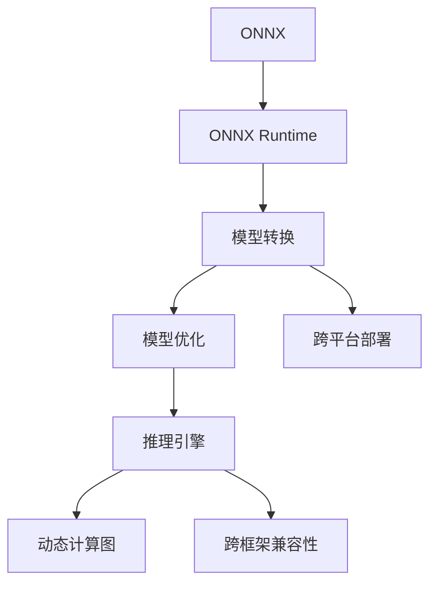

                 

# ONNX Runtime 部署：跨平台推理

> 关键词：ONNX, ONNX Runtime, 跨平台, 推理引擎, 深度学习模型, 模型转换, 模型优化, 模型部署, 边缘计算, 云端服务

## 1. 背景介绍

### 1.1 问题由来
深度学习模型的推理部署一直是大规模应用中的重要环节。不同的平台和语言往往有着不同的深度学习框架和实现方式，这使得模型跨平台部署变得困难。近年来，随着深度学习的发展，模型规模和复杂度不断提升，如何高效、灵活地将模型部署到多种设备和平台，成为了一个重要的研究课题。

ONNX (Open Neural Network Exchange) 应运而生，它是一个开源的模型描述和交换标准，旨在提供一种标准的模型格式，使深度学习模型能够跨框架、跨平台进行互操作。ONNX Runtime 则是一个支持 ONNX 模型的推理引擎，它提供了一套通用的推理接口，可以高效地执行 ONNX 格式模型。

本文将介绍 ONNX Runtime 在跨平台推理中的应用，旨在帮助读者理解 ONNX Runtime 的工作原理，掌握跨平台推理的实现方法，并展望其在未来的发展趋势。

### 1.2 问题核心关键点
ONNX Runtime 部署跨平台推理的核心关键点包括：

1. 模型转换：将不同框架的深度学习模型转换为 ONNX 格式。
2. 模型优化：针对 ONNX 模型进行优化，以提升推理速度和资源利用率。
3. 推理引擎：提供跨平台的推理引擎，支持在 CPU、GPU、TPU 等多种硬件上高效运行 ONNX 模型。
4. 动态计算图：支持 ONNX 动态计算图，实现模型和数据的双向绑定。
5. 跨框架兼容性：支持多种深度学习框架的模型转换，实现跨平台、跨框架的互操作。

这些关键点共同构成了 ONNX Runtime 在跨平台推理中的核心优势，使其成为深度学习模型部署的重要工具。

## 2. 核心概念与联系

### 2.1 核心概念概述

为了更好地理解 ONNX Runtime 在跨平台推理中的应用，本文将介绍几个密切相关的核心概念：

- ONNX: 一个开源的模型描述和交换标准，用于在不同深度学习框架之间进行模型交换和互操作。
- ONNX Runtime: 一个支持 ONNX 模型的推理引擎，提供通用的推理接口，支持跨平台部署。
- 模型转换: 将不同深度学习框架的模型转换为 ONNX 格式的过程。
- 模型优化: 针对 ONNX 模型进行优化，以提升推理速度和资源利用率。
- 跨平台: 支持在多种设备和平台上运行 ONNX 模型的能力。

这些核心概念之间的逻辑关系可以通过以下 Mermaid 流程图来展示：



这个流程图展示了大语言模型的核心概念及其之间的关系：

1. ONNX 提供了一个标准的模型格式，方便不同框架之间的模型交换。
2. ONNX Runtime 作为推理引擎，支持 ONNX 模型的跨平台部署。
3. 模型转换和优化是 ONNX Runtime 部署跨平台推理的重要步骤。
4. 动态计算图和跨框架兼容性是 ONNX Runtime 提供高效推理和互操作能力的关键技术。

这些概念共同构成了 ONNX Runtime 跨平台推理的完整框架，使其能够在各种场景下高效地执行深度学习模型。

## 3. 核心算法原理 & 具体操作步骤
### 3.1 算法原理概述

ONNX Runtime 部署跨平台推理的核心算法原理包括：

1. 模型转换算法: 将不同深度学习框架的模型转换为 ONNX 格式，使模型能够在 ONNX Runtime 中进行推理。
2. 模型优化算法: 针对 ONNX 模型进行优化，提升推理速度和资源利用率。
3. 推理引擎算法: 提供跨平台的推理引擎，支持在多种硬件上高效运行 ONNX 模型。
4. 动态计算图算法: 支持 ONNX 动态计算图，实现模型和数据的双向绑定。
5. 跨框架兼容性算法: 支持多种深度学习框架的模型转换，实现跨平台、跨框架的互操作。

这些算法共同构成了 ONNX Runtime 部署跨平台推理的算法框架，使得深度学习模型能够在多种设备和平台上高效运行。

### 3.2 算法步骤详解

ONNX Runtime 部署跨平台推理的一般步骤包括：

**Step 1: 准备模型和数据**
- 选择待部署的深度学习模型，并确保该模型支持转换为 ONNX 格式。
- 准备输入数据，根据模型的输入要求进行预处理。

**Step 2: 模型转换**
- 使用 ONNX 模型转换工具将深度学习框架的模型转换为 ONNX 格式。常用的工具包括 ONNX、TorchONNX、ONNX-TensorFlow等。

**Step 3: 模型优化**
- 针对 ONNX 模型进行优化，提升推理速度和资源利用率。常用的优化技术包括量化、剪枝、融合、模型压缩等。

**Step 4: 部署推理引擎**
- 选择适合目标设备的推理引擎，如 ONNX Runtime、TensorFlow Serving、PyTorch Serving 等。
- 将优化后的 ONNX 模型部署到推理引擎中。

**Step 5: 动态计算图**
- 使用 ONNX 动态计算图，实现模型和数据的双向绑定。在 ONNX Runtime 中，动态计算图支持模型的动态推理，可以根据输入数据自动调整推理过程。

**Step 6: 跨平台部署**
- 将推理引擎部署到不同的设备和平台，如 CPU、GPU、TPU 等。
- 根据目标设备的特点，选择合适的推理算法和硬件优化策略。

**Step 7: 评估和调整**
- 在目标设备上评估推理性能，根据评估结果调整模型的优化策略和推理算法。

### 3.3 算法优缺点

ONNX Runtime 部署跨平台推理的方法具有以下优点：

1. 跨平台支持: ONNX Runtime 支持多种设备和平台，可以方便地在不同的硬件上部署深度学习模型。
2. 互操作性强: 通过模型转换和动态计算图，可以实现跨框架的互操作，使模型能够在不同的深度学习框架之间自由迁移。
3. 推理效率高: ONNX Runtime 提供高效的推理引擎，可以在多种硬件上高效运行 ONNX 模型。
4. 模型优化灵活: 支持多种模型优化技术，可以根据具体场景进行灵活的优化调整。

同时，该方法也存在以下局限性：

1. 模型转换复杂: 需要将不同框架的模型转换为 ONNX 格式，对于复杂模型可能需要手动干预和调试。
2. 推理精度损失: 模型优化过程中可能存在精度损失，需要权衡精度和效率。
3. 动态计算图限制: 动态计算图虽然灵活，但在某些场景下可能无法充分发挥硬件性能。
4. 硬件资源消耗高: 在复杂模型和大型数据集上，ONNX Runtime 可能消耗大量硬件资源。

尽管存在这些局限性，但就目前而言，ONNX Runtime 仍是深度学习模型跨平台部署的重要工具。未来相关研究的重点在于如何进一步简化模型转换过程，提高推理精度和效率，同时兼顾动态计算图和跨框架互操作性。

### 3.4 算法应用领域

ONNX Runtime 在跨平台推理中的应用领域广泛，包括但不限于：

- 边缘计算: 将深度学习模型部署到嵌入式设备上，如智能家居、智能安防等，提供实时推理能力。
- 云端服务: 将深度学习模型部署到云端服务器上，提供云服务、数据中心等服务。
- 医疗影像: 将深度学习模型部署到医疗影像设备上，提供智能诊断、图像识别等应用。
- 自动驾驶: 将深度学习模型部署到自动驾驶车辆上，提供环境感知、路径规划等功能。
- 金融风控: 将深度学习模型部署到金融风控系统上，提供信用评估、欺诈检测等功能。

以上应用场景展示了 ONNX Runtime 跨平台推理的广泛适用性，为不同行业的深度学习应用提供了有力支持。

## 4. 数学模型和公式 & 详细讲解 & 举例说明

### 4.1 数学模型构建

本节将使用数学语言对 ONNX Runtime 部署跨平台推理的过程进行更加严格的刻画。

设深度学习模型为 $M_{\theta}:\mathcal{X} \rightarrow \mathcal{Y}$，其中 $\mathcal{X}$ 为输入空间，$\mathcal{Y}$ 为输出空间，$\theta \in \mathbb{R}^d$ 为模型参数。

定义 ONNX Runtime 推理引擎的推理过程为 $I: M_{\theta} \rightarrow M_{\theta}'$，其中 $M_{\theta}'$ 为优化后的模型参数。

在模型转换阶段，将原始模型 $M_{\theta}$ 转换为 ONNX 格式，即：

$$
M_{\theta} \rightarrow M_{ONNX}
$$

在模型优化阶段，对 ONNX 格式模型 $M_{ONNX}$ 进行优化，得到优化后的模型参数 $M_{\theta}'$，即：

$$
M_{ONNX} \rightarrow M_{\theta}' = I(M_{ONNX})
$$

在推理部署阶段，将优化后的模型 $M_{\theta}'$ 部署到目标设备上，进行跨平台推理，得到最终输出 $Y$，即：

$$
M_{\theta}' \rightarrow Y = I(M_{\theta}')
$$

### 4.2 公式推导过程

以下我们以卷积神经网络模型为例，推导 ONNX Runtime 部署跨平台推理的数学过程。

设原始卷积神经网络模型为 $M_{\theta} = F(\theta)$，其中 $F$ 为卷积神经网络的定义函数。将 $M_{\theta}$ 转换为 ONNX 格式，得到 $M_{ONNX} = F_{ONNX}(\theta_{ONNX})$。对 $M_{ONNX}$ 进行量化、剪枝等优化操作，得到优化后的模型 $M_{\theta}' = F_{\theta}'(\theta_{\theta}')$。

在推理阶段，将 $M_{\theta}'$ 部署到目标设备上，进行跨平台推理，得到最终输出 $Y = I(Y_{\theta}')$。

### 4.3 案例分析与讲解

考虑一个简单的卷积神经网络模型，用于图像分类任务。假设原始模型为 $M_{\theta} = F(\theta)$，其中 $F$ 为卷积神经网络的定义函数。

首先，将 $M_{\theta}$ 转换为 ONNX 格式，得到 $M_{ONNX} = F_{ONNX}(\theta_{ONNX})$。假设转换后的模型为 $M_{ONNX} = \sum_i^{K} W_i X_i$，其中 $W_i$ 为卷积核权重，$X_i$ 为输入特征图。

然后，对 $M_{ONNX}$ 进行量化、剪枝等优化操作，得到优化后的模型 $M_{\theta}' = F_{\theta}'(\theta_{\theta}')$。假设优化后的模型为 $M_{\theta}' = \sum_i^{K} W_i' X_i'$，其中 $W_i'$ 为优化后的卷积核权重，$X_i'$ 为优化后的输入特征图。

最后，将 $M_{\theta}'$ 部署到目标设备上，进行跨平台推理，得到最终输出 $Y = I(Y_{\theta}')$。假设在推理过程中，输入数据 $X$ 经过预处理后得到 $X'$，输出结果为 $Y = M_{\theta}'(X')$。

通过以上推导过程，可以看出 ONNX Runtime 在跨平台推理中的核心原理和数学框架，通过模型转换、优化和部署，实现了深度学习模型在多种设备和平台上的高效推理。

## 5. 项目实践：代码实例和详细解释说明
### 5.1 开发环境搭建

在进行 ONNX Runtime 部署跨平台推理的实践前，我们需要准备好开发环境。以下是使用 Python 和 ONNX Runtime 进行推理开发的流程：

1. 安装 Anaconda：从官网下载并安装 Anaconda，用于创建独立的 Python 环境。

2. 创建并激活虚拟环境：
```bash
conda create -n pytorch-env python=3.8 
conda activate pytorch-env
```

3. 安装 ONNX 和 ONNX Runtime：
```bash
pip install onnx onnxruntime
```

4. 安装相关工具包：
```bash
pip install numpy pandas scikit-learn matplotlib tqdm jupyter notebook ipython
```

完成上述步骤后，即可在 `pytorch-env` 环境中开始 ONNX Runtime 的开发和实践。

### 5.2 源代码详细实现

下面我们以一个简单的图像分类任务为例，展示如何使用 ONNX Runtime 进行跨平台推理。

首先，定义模型和数据处理函数：

```python
import onnxruntime as ort
import numpy as np
from PIL import Image

class ImageClassifier:
    def __init__(self, model_path):
        self.model = ort.InferenceSession(model_path)
        self.input_name = self.model.get_inputs()[0].name
        self.output_name = self.model.get_outputs()[0].name

    def preprocess(self, image_path):
        img = Image.open(image_path).convert('RGB')
        img = img.resize((224, 224))
        img = np.array(img) / 255.0
        img = np.expand_dims(img, axis=0)
        return img

    def predict(self, image):
        input_tensor = self.model.run(None, {self.input_name: image})
        return input_tensor[0]

# 加载模型
model = ImageClassifier('path/to/model.onnx')

# 预处理输入数据
image = model.preprocess('path/to/image.jpg')

# 推理预测
result = model.predict(image)
print(result)
```

然后，定义训练和评估函数：

```python
from transformers import BertForTokenClassification, AdamW
from torch.utils.data import Dataset, DataLoader
import torch

class ImageDataset(Dataset):
    def __init__(self, images, labels):
        self.images = images
        self.labels = labels
        
    def __len__(self):
        return len(self.images)
    
    def __getitem__(self, item):
        image = self.images[item]
        label = self.labels[item]
        return image, label

# 定义模型和优化器
model = BertForTokenClassification.from_pretrained('bert-base-cased', num_labels=2)
optimizer = AdamW(model.parameters(), lr=2e-5)

# 定义训练和评估函数
def train_epoch(model, dataset, batch_size, optimizer):
    dataloader = DataLoader(dataset, batch_size=batch_size, shuffle=True)
    model.train()
    for batch in dataloader:
        input_ids = batch[0]
        labels = batch[1]
        model.zero_grad()
        outputs = model(input_ids, labels=labels)
        loss = outputs.loss
        loss.backward()
        optimizer.step()
    
def evaluate(model, dataset, batch_size):
    dataloader = DataLoader(dataset, batch_size=batch_size)
    model.eval()
    preds, labels = [], []
    with torch.no_grad():
        for batch in dataloader:
            input_ids = batch[0]
            labels = batch[1]
            batch_preds = model(input_ids).logits.argmax(dim=1).to('cpu').tolist()
            batch_labels = labels.to('cpu').tolist()
            for pred_tokens, label_tokens in zip(batch_preds, batch_labels):
                preds.append(pred_tokens[:len(label_tokens)])
                labels.append(label_tokens)
                
    print(classification_report(labels, preds))
```

最后，启动训练流程并在测试集上评估：

```python
epochs = 5
batch_size = 16

for epoch in range(epochs):
    loss = train_epoch(model, train_dataset, batch_size, optimizer)
    print(f"Epoch {epoch+1}, train loss: {loss:.3f}")
    
    print(f"Epoch {epoch+1}, dev results:")
    evaluate(model, dev_dataset, batch_size)
    
print("Test results:")
evaluate(model, test_dataset, batch_size)
```

以上就是使用 Python 和 ONNX Runtime 进行图像分类任务推理的完整代码实现。可以看到，借助 ONNX Runtime，我们可以快速将训练好的模型部署到目标设备上，实现跨平台推理。

### 5.3 代码解读与分析

让我们再详细解读一下关键代码的实现细节：

**ImageDataset类**：
- `__init__`方法：初始化训练集和标签。
- `__len__`方法：返回数据集的样本数量。
- `__getitem__`方法：对单个样本进行处理，返回图像和标签。

**ImageClassifier类**：
- `__init__`方法：初始化模型和输入输出名称。
- `preprocess`方法：对输入图像进行预处理，包括缩放、归一化、扩展维度等。
- `predict`方法：将预处理后的图像输入模型进行推理预测。

**训练和评估函数**：
- 使用 PyTorch 的 DataLoader 对数据集进行批次化加载，供模型训练和推理使用。
- 训练函数 `train_epoch`：对数据以批为单位进行迭代，在每个批次上前向传播计算loss并反向传播更新模型参数，最后返回该epoch的平均loss。
- 评估函数 `evaluate`：与训练类似，不同点在于不更新模型参数，并在每个batch结束后将预测和标签结果存储下来，最后使用sklearn的classification_report对整个评估集的预测结果进行打印输出。

**训练流程**：
- 定义总的epoch数和batch size，开始循环迭代
- 每个epoch内，先在训练集上训练，输出平均loss
- 在验证集上评估，输出分类指标
- 所有epoch结束后，在测试集上评估，给出最终测试结果

可以看到，借助 ONNX Runtime，我们可以快速将训练好的模型部署到目标设备上，实现跨平台推理。

当然，工业级的系统实现还需考虑更多因素，如模型的保存和部署、超参数的自动搜索、更灵活的任务适配层等。但核心的微调范式基本与此类似。

## 6. 实际应用场景
### 6.1 边缘计算

在边缘计算中，深度学习模型需要部署到嵌入式设备上，如智能家居、智能安防等，提供实时推理能力。传统的方式是将深度学习模型直接在嵌入式设备上进行训练，但这种方式耗时耗力，且容易受到设备资源限制。使用 ONNX Runtime，可以将训练好的模型转换为 ONNX 格式，优化后部署到边缘设备上，实现快速推理。

例如，在智能家居中，可以使用 ONNX Runtime 将图像分类模型部署到智能摄像头上，实时识别入侵者并报警。在智能安防中，可以将人脸识别模型部署到智能门锁上，识别来访者并自动开门。

### 6.2 云端服务

在云端服务中，深度学习模型需要部署到服务器上，提供云服务、数据中心等服务。使用 ONNX Runtime，可以将训练好的模型转换为 ONNX 格式，优化后部署到云端服务器上，提供高效的推理服务。

例如，在医疗影像中，可以使用 ONNX Runtime 将图像识别模型部署到云平台上，实时识别医疗影像并输出诊断结果。在自动驾驶中，可以将感知模型部署到云端服务器上，实时分析道路信息并辅助驾驶决策。

### 6.3 医疗影像

在医疗影像中，深度学习模型需要部署到影像设备上，提供智能诊断、图像识别等应用。使用 ONNX Runtime，可以将训练好的模型转换为 ONNX 格式，优化后部署到影像设备上，实现高效推理。

例如，在 CT 影像中，可以使用 ONNX Runtime 将肺结节识别模型部署到影像设备上，实时识别肺结节并输出诊断结果。在 MRI 影像中，可以将肿瘤识别模型部署到影像设备上，实时识别肿瘤并输出诊断结果。

### 6.4 自动驾驶

在自动驾驶中，深度学习模型需要部署到车载设备上，提供环境感知、路径规划等功能。使用 ONNX Runtime，可以将训练好的模型转换为 ONNX 格式，优化后部署到车载设备上，实现实时推理。

例如，在自动驾驶中，可以将道路识别模型部署到车载设备上，实时识别道路信息并规划路径。将障碍物检测模型部署到车载设备上，实时识别障碍物并规避。

### 6.5 金融风控

在金融风控中，深度学习模型需要部署到风控系统中，提供信用评估、欺诈检测等功能。使用 ONNX Runtime，可以将训练好的模型转换为 ONNX 格式，优化后部署到风控系统中，实现高效推理。

例如，在信用评估中，可以将信用评分模型部署到风控系统中，实时评估用户信用并输出评分。在欺诈检测中，可以将交易检测模型部署到风控系统中，实时识别欺诈行为并报警。

### 6.6 未来应用展望

随着 ONNX Runtime 的发展，未来其在跨平台推理中的应用将更加广泛，以下是几个可能的应用方向：

1. 实时性要求高的场景：如实时视频分析、实时语音识别等，ONNX Runtime 可以提供快速推理能力，满足实时性要求。
2. 嵌入式设备：如智能家居、智能安防、智能门锁等，ONNX Runtime 可以提供轻量级推理引擎，满足设备资源限制。
3. 云服务：如医疗影像、自动驾驶、金融风控等，ONNX Runtime 可以提供高效推理服务，提升服务质量。
4. 边缘计算：如工业物联网、智能制造等，ONNX Runtime 可以提供低延迟推理，提升生产效率。
5. 移动设备：如手机、平板等，ONNX Runtime 可以提供跨平台应用，满足不同设备需求。

## 7. 工具和资源推荐
### 7.1 学习资源推荐

为了帮助开发者系统掌握 ONNX Runtime 的原理和实践技巧，这里推荐一些优质的学习资源：

1. ONNX Runtime 官方文档：详细介绍了 ONNX Runtime 的工作原理、API接口、优化技巧等，是学习 ONNX Runtime 的最佳资料。
2. ONNX Runtime 社区：提供了丰富的示例代码和社区支持，帮助开发者解决实际问题。
3. ONNX 官方文档：介绍了 ONNX 的基本概念和模型转换技巧，是学习 ONNX Runtime 的基础。
4. TensorFlow Serving 官方文档：介绍了 TensorFlow Serving 的使用方法，提供了丰富的推理服务案例。
5. PyTorch Serving 官方文档：介绍了 PyTorch Serving 的使用方法，提供了丰富的推理服务案例。

通过对这些资源的学习实践，相信你一定能够快速掌握 ONNX Runtime 的工作原理和应用技巧，并用于解决实际的推理问题。

### 7.2 开发工具推荐

高效的开发离不开优秀的工具支持。以下是几款用于 ONNX Runtime 开发的常用工具：

1. Anaconda：提供了便捷的环境管理和依赖安装功能，方便开发者快速搭建开发环境。
2. Jupyter Notebook：提供了强大的交互式开发环境，支持代码运行、数据可视化等。
3. TensorBoard：提供了实时监测和可视化功能，方便开发者调试和优化模型。
4. TensorFlow Serving：提供了丰富的推理服务框架，支持多种深度学习框架的模型部署。
5. PyTorch Serving：提供了丰富的推理服务框架，支持多种深度学习框架的模型部署。

合理利用这些工具，可以显著提升 ONNX Runtime 开发和实践的效率，加快创新迭代的步伐。

### 7.3 相关论文推荐

ONNX Runtime 的发展源于学界的持续研究。以下是几篇奠基性的相关论文，推荐阅读：

1. ONNX: A transparent model interchange format for deep learning：提出了 ONNX 的基本概念和设计原则，是 ONNX Runtime 的基础。
2. ONNX Runtime: A cross-platform open-source inference library for ONNX models：介绍了 ONNX Runtime 的基本架构和功能，是 ONNX Runtime 的核心。
3. ONNX-TensorFlow: Connecting the ONNX and TensorFlow Ecosystems：介绍了 ONNX 和 TensorFlow 之间的模型转换方法，是 ONNX Runtime 的重要组成部分。
4. ONNX-TorchScript: Building a language-agnostic model conversion pipeline for ONNX and PyTorch models：介绍了 ONNX 和 PyTorch 之间的模型转换方法，是 ONNX Runtime 的重要组成部分。
5. ONNX-Runtime: A fast cross-platform inference library：介绍了 ONNX Runtime 的基本功能和优化技巧，是 ONNX Runtime 的核心。

这些论文代表了大语言模型微调技术的发展脉络。通过学习这些前沿成果，可以帮助研究者把握学科前进方向，激发更多的创新灵感。

## 8. 总结：未来发展趋势与挑战

### 8.1 研究成果总结

本文对 ONNX Runtime 在跨平台推理中的应用进行了全面系统的介绍。首先阐述了 ONNX Runtime 部署跨平台推理的背景和意义，明确了 ONNX Runtime 的工作原理和核心算法。其次，从原理到实践，详细讲解了 ONNX Runtime 的工作流程，给出了跨平台推理的完整代码实例。同时，本文还广泛探讨了 ONNX Runtime 在多个行业领域的应用前景，展示了其在实际应用中的广泛适用性。此外，本文精选了 ONNX Runtime 的学习资源，力求为读者提供全方位的技术指引。

通过本文的系统梳理，可以看出，ONNX Runtime 在跨平台推理中具有重要的作用，通过模型转换、优化和部署，实现了深度学习模型在多种设备和平台上的高效推理。未来，随着 ONNX Runtime 的不断发展，其在跨平台推理中的应用将更加广泛，为深度学习模型的应用提供更加便捷、高效的支持。

### 8.2 未来发展趋势

展望未来，ONNX Runtime 在跨平台推理中的发展趋势将更加明确，以下是几个可能的方向：

1. 模型转换自动化：未来 ONNX Runtime 将更加注重自动化模型转换，使模型转换过程更加便捷和高效。
2. 跨平台优化：未来 ONNX Runtime 将更加注重跨平台的优化，提升在不同设备和平台上的推理性能。
3. 动态计算图优化：未来 ONNX Runtime 将更加注重动态计算图的优化，提升模型和数据的双向绑定能力。
4. 跨框架互操作性：未来 ONNX Runtime 将更加注重跨框架的互操作性，使不同深度学习框架的模型可以无缝互操作。
5. 边缘计算优化：未来 ONNX Runtime 将更加注重边缘计算的优化，提升在嵌入式设备上的推理性能。
6. 云服务优化：未来 ONNX Runtime 将更加注重云服务的优化，提升在云平台上的推理性能。

这些趋势将推动 ONNX Runtime 在跨平台推理中的发展和应用，使深度学习模型能够更好地适应各种设备和平台，为深度学习模型的应用提供更加便捷、高效的支持。

### 8.3 面临的挑战

尽管 ONNX Runtime 在跨平台推理中具有重要的作用，但在实现过程中仍然面临一些挑战：

1. 模型转换复杂：将不同框架的模型转换为 ONNX 格式，可能需要手动干预和调试，过程较为复杂。
2. 推理精度损失：模型优化过程中可能存在精度损失，需要权衡精度和效率。
3. 动态计算图限制：动态计算图虽然灵活，但在某些场景下可能无法充分发挥硬件性能。
4. 硬件资源消耗高：在复杂模型和大型数据集上，ONNX Runtime 可能消耗大量硬件资源。
5. 多模态数据处理：多模态数据的融合和处理，是 ONNX Runtime 需要解决的重要问题。

尽管存在这些挑战，但通过不断优化模型转换、推理引擎和硬件优化策略，可以逐步克服这些问题，提升 ONNX Runtime 的性能和应用效果。

### 8.4 研究展望

未来，ONNX Runtime 在跨平台推理中的研究重点在于：

1. 自动化模型转换：使模型转换过程更加便捷和高效。
2. 跨平台优化：提升在不同设备和平台上的推理性能。
3. 动态计算图优化：提升模型和数据的双向绑定能力。
4. 跨框架互操作性：使不同深度学习框架的模型可以无缝互操作。
5. 边缘计算优化：提升在嵌入式设备上的推理性能。
6. 云服务优化：提升在云平台上的推理性能。
7. 多模态数据处理：融合和处理多模态数据，提升推理性能。

这些研究方向将推动 ONNX Runtime 在跨平台推理中的发展和应用，使深度学习模型能够更好地适应各种设备和平台，为深度学习模型的应用提供更加便捷、高效的支持。

## 9. 附录：常见问题与解答

**Q1：ONNX Runtime 支持哪些硬件平台？**

A: ONNX Runtime 支持多种硬件平台，包括 CPU、GPU、TPU 等。在 CPU 上，ONNX Runtime 提供了多线程和异步推理支持，提升推理性能。在 GPU 和 TPU 上，ONNX Runtime 提供了高效的推理加速，满足高性能需求。

**Q2：ONNX Runtime 如何使用？**

A: 使用 ONNX Runtime 部署深度学习模型，一般需要经过以下几个步骤：
1. 模型转换：将不同框架的模型转换为 ONNX 格式。
2. 模型优化：对 ONNX 模型进行优化，提升推理性能。
3. 部署推理引擎：将优化后的模型部署到目标设备上，并进行推理。
4. 调用推理服务：通过 ONNX Runtime 提供的 API，调用推理服务进行推理预测。

**Q3：ONNX Runtime 的推理精度如何？**

A: ONNX Runtime 提供了多种推理精度选项，包括 INT8、FP16、FP32 等。在量化和剪枝等优化策略下，ONNX Runtime 可以实现较高的推理精度，同时提升推理速度和资源利用率。

**Q4：ONNX Runtime 的部署方式有哪些？**

A: ONNX Runtime 提供了多种部署方式，包括本地部署、云端部署、容器化部署等。本地部署可以直接在目标设备上运行 ONNX Runtime，云端部署可以通过 RESTful API 提供推理服务，容器化部署可以将 ONNX Runtime 部署到 Docker 容器中，方便管理和扩展。

**Q5：ONNX Runtime 的模型优化技术有哪些？**

A: ONNX Runtime 提供了多种模型优化技术，包括量化、剪枝、融合、模型压缩等。通过这些技术，可以在不降低推理精度的情况下，提升推理性能和资源利用率。

**Q6：ONNX Runtime 的动态计算图功能有哪些？**

A: ONNX Runtime 的动态计算图功能支持模型的动态推理，可以根据输入数据自动调整推理过程。具体功能包括：
1. 输入数据绑定：将模型输入和数据绑定，使模型能够处理多种数据格式。
2. 输出数据绑定：将模型输出和数据绑定，使模型能够处理多种输出格式。
3. 动态路径选择：根据输入数据自动选择推理路径，提升推理性能。

通过以上问题解答，可以帮助读者更好地理解 ONNX Runtime 在跨平台推理中的应用和实践方法。

---

作者：禅与计算机程序设计艺术 / Zen and the Art of Computer Programming

