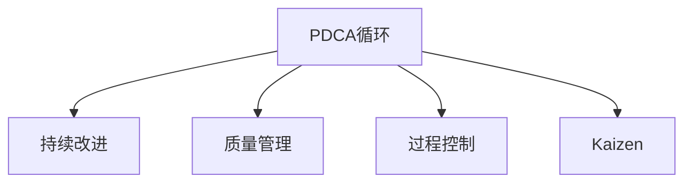

                 

# PDCA循环与管理持续改进的关系

> 关键词：PDCA循环，持续改进，质量管理，过程控制，Kaizen，管理实践

## 1. 背景介绍

### 1.1 问题由来
PDCA循环是一种系统性的质量管理方法，最早由美国统计学家沃特·阿曼德·休哈特于1920年代提出，后被广泛应用于制造业和各行各业的质量管理中。PDCA循环由计划（Plan）、执行（Do）、检查（Check）和处理（Act）四个阶段组成，旨在通过持续的循环改进，提升组织绩效和产品/服务的质量。

在当前快速变化的市场环境下，企业需要不断优化产品和服务以满足客户需求，持续改进成为企业提升竞争力的关键。PDCA循环提供了系统、科学的持续改进框架，使企业能够有效应对市场变化，保持长期的竞争优势。然而，随着技术的发展和应用领域的扩展，PDCA循环在一些复杂、动态环境下的应用也面临着新的挑战。

### 1.2 问题核心关键点
PDCA循环的核心在于通过“计划-执行-检查-处理”的持续循环，不断识别问题、分析原因、采取改进措施，从而提升管理效率和产品质量。PDCA循环的关键在于：

1. **计划阶段**：明确改进目标、方法、资源和时间表，制定具体的改进措施。
2. **执行阶段**：按照计划执行改进措施，确保其实施效果。
3. **检查阶段**：评估改进措施的效果，对比预期结果，发现潜在问题。
4. **处理阶段**：总结改进经验，制定新的改进措施，形成持续改进机制。

PDCA循环的科学性在于其系统性和周期性，能够有效推动组织从局部到整体，从当前到未来，不断优化和提升。

## 2. 核心概念与联系

### 2.1 核心概念概述

为更好地理解PDCA循环在管理中的应用，本节将介绍几个密切相关的核心概念：

- PDCA循环（Plan-Do-Check-Act）：一种系统性质量管理方法，通过循环迭代，持续改进组织绩效和产品质量。
- 持续改进（Continuous Improvement）：指在PDCA循环中不断识别问题、分析原因、采取改进措施的过程，旨在提升管理效率和产品质量。
- 质量管理（Quality Management）：通过制定、执行、检查和改进质量标准，确保产品和服务满足客户需求的过程。
- 过程控制（Process Control）：通过监控和调节组织过程，确保其符合标准，达到预期效果。
- Kaizen：一种注重持续、小步改进的哲学思想，旨在通过小的、不间断的改进，实现显著的绩效提升。

这些核心概念之间的逻辑关系可以通过以下Mermaid流程图来展示：



这个流程图展示了几者之间的联系：

1. PDCA循环通过“计划-执行-检查-处理”的四个阶段，不断推进持续改进。
2. 质量管理通过PDCA循环的实施，确保产品和服务质量。
3. 过程控制通过PDCA循环的执行和检查，确保过程符合标准。
4. Kaizen作为PDCA循环的核心理念，强调小的、不间断的改进，推动持续改进的深入。

## 3. 核心算法原理 & 具体操作步骤
### 3.1 算法原理概述

PDCA循环是一种结构化的管理方法，其核心思想是通过系统性的计划、执行、检查和处理四个阶段，不断识别问题、分析原因、采取改进措施，从而提升管理效率和产品质量。PDCA循环的原理可以总结如下：

1. **计划（Plan）**：明确改进目标、方法、资源和时间表，制定具体的改进措施。
2. **执行（Do）**：按照计划执行改进措施，确保其实施效果。
3. **检查（Check）**：评估改进措施的效果，对比预期结果，发现潜在问题。
4. **处理（Act）**：总结改进经验，制定新的改进措施，形成持续改进机制。

PDCA循环的科学性在于其系统性和周期性，能够有效推动组织从局部到整体，从当前到未来，不断优化和提升。

### 3.2 算法步骤详解

PDCA循环的具体操作步骤可以总结如下：

1. **计划阶段（Plan）**：
    - **明确改进目标**：根据当前工作中的问题或需求，明确改进的目标和期望成果。
    - **制定改进措施**：根据目标，制定具体的改进措施和方法，明确责任人和时间表。
    - **资源准备**：确保实施改进所需的资源、工具和技术准备就绪。

2. **执行阶段（Do）**：
    - **实施改进措施**：按照计划执行改进措施，确保其实施效果。
    - **记录数据**：记录执行过程中的数据和结果，便于后续分析。

3. **检查阶段（Check）**：
    - **评估效果**：对比预期结果和实际结果，评估改进措施的效果。
    - **识别问题**：识别改进措施中的不足和潜在问题，分析原因。

4. **处理阶段（Act）**：
    - **总结经验**：总结改进措施的效果和经验，形成改进报告。
    - **制定新措施**：根据评估结果和分析原因，制定新的改进措施。
    - **持续改进**：将新的改进措施纳入PDCA循环中，形成持续改进机制。

### 3.3 算法优缺点

PDCA循环作为一种经典的质量管理方法，具有以下优点：

1. **系统性**：通过四个阶段的循环，系统性地识别问题、分析原因、采取改进措施，有助于全面提升管理效率和产品质量。
2. **周期性**：通过持续的循环改进，确保组织在动态变化的环境中不断优化。
3. **适用性广泛**：适用于各种规模、行业的组织，能够有效提升其管理水平和竞争力。

同时，PDCA循环也存在一些局限性：

1. **复杂性**：PDCA循环的四个阶段涉及到多方面的工作，实施难度较大。
2. **实施周期较长**：每个循环周期通常需要较长时间，无法快速响应市场变化。
3. **依赖于管理者**：PDCA循环的效果依赖于管理者的专业水平和执行力。
4. **缺乏灵活性**：对于复杂、动态环境下的快速变化，PDCA循环的固定流程可能不够灵活。

尽管存在这些局限性，PDCA循环仍是一种高效、科学的质量管理方法，广泛应用于制造业、服务业、IT行业等多个领域。

### 3.4 算法应用领域

PDCA循环在许多领域都得到了广泛应用，例如：

- 制造业：通过PDCA循环，制造企业能够持续提升生产效率、产品质量和供应链管理水平。
- 服务业：酒店、银行、零售等服务业通过PDCA循环，提升客户满意度、服务质量和运营效率。
- IT行业：软件开发、系统维护等领域通过PDCA循环，持续优化软件质量和用户体验。
- 医疗健康：医院、诊所等医疗服务机构通过PDCA循环，提升诊疗质量和患者满意度。
- 政府管理：政府机构通过PDCA循环，提升公共服务质量和政策执行效率。

除了这些传统领域外，PDCA循环在新兴技术领域如人工智能、大数据、区块链等也具有广泛应用前景，推动相关行业不断创新和改进。

## 4. 数学模型和公式 & 详细讲解  
### 4.1 数学模型构建

PDCA循环的数学模型可以通过以下方式进行建模：

假设组织当前面临的问题为 $X$，改进目标为 $Y$，改进措施为 $M$，执行效果为 $E$，问题改进后的效果为 $X'$。PDCA循环的数学模型可以表示为：

$$
\begin{aligned}
Y &= f(X, M) \\
E &= g(M, X) \\
X' &= h(E, Y) \\
Y &= f(X', M')
\end{aligned}
$$

其中 $f$、$g$、$h$ 为映射函数，$M'$ 为新的改进措施。

### 4.2 公式推导过程

1. **计划阶段（Plan）**：
    - 明确改进目标：$Y = f(X, M)$
    - 制定改进措施：$M = f(X, Y)$

2. **执行阶段（Do）**：
    - 实施改进措施：$E = g(M, X)$

3. **检查阶段（Check）**：
    - 评估效果：$X' = h(E, Y)$
    - 识别问题：分析 $X'$ 与 $X$ 的差异，识别改进措施中的不足和潜在问题。

4. **处理阶段（Act）**：
    - 总结经验：$Y' = f(X', M')$
    - 制定新措施：$M' = f(X', Y')$

### 4.3 案例分析与讲解

假设某软件开发团队面临的改进目标是提升代码质量，现有措施为引入静态代码分析工具。根据PDCA循环的步骤进行如下分析：

1. **计划阶段**：
    - 明确改进目标：提升代码质量
    - 制定改进措施：引入静态代码分析工具

2. **执行阶段**：
    - 实施改进措施：在开发过程中使用代码分析工具进行实时检查
    - 记录数据：记录代码检查结果、修复的代码问题数量

3. **检查阶段**：
    - 评估效果：对比引入代码分析工具前后的代码质量指标（如bug数量、代码复杂度等）
    - 识别问题：分析工具的运行效率、误报漏报等问题

4. **处理阶段**：
    - 总结经验：总结代码分析工具的效果和运行效率
    - 制定新措施：优化工具参数、引入更多检测规则等

## 5. 项目实践：代码实例和详细解释说明
### 5.1 开发环境搭建

在进行PDCA循环实践前，我们需要准备好开发环境。以下是使用Python进行代码开发的环境配置流程：

1. 安装Anaconda：从官网下载并安装Anaconda，用于创建独立的Python环境。

2. 创建并激活虚拟环境：
```bash
conda create -n pdca-env python=3.8 
conda activate pdca-env
```

3. 安装PyTorch：根据CUDA版本，从官网获取对应的安装命令。例如：
```bash
conda install pytorch torchvision torchaudio cudatoolkit=11.1 -c pytorch -c conda-forge
```

4. 安装TensorFlow：
```bash
conda install tensorflow
```

5. 安装Pandas：
```bash
pip install pandas
```

6. 安装NumPy：
```bash
pip install numpy
```

完成上述步骤后，即可在`pdca-env`环境中开始PDCA循环的实践。

### 5.2 源代码详细实现

下面以软件开发为例，给出使用Python进行PDCA循环代码实现的完整流程：

```python
import pandas as pd
import numpy as np
from sklearn.metrics import accuracy_score

# 定义计划阶段的数据收集函数
def collect_data(plan_data):
    # 记录当前代码质量指标
    return plan_data

# 定义执行阶段的数据记录函数
def record_data(do_data):
    # 记录代码分析工具的运行结果和修复的代码问题数量
    return do_data

# 定义检查阶段的数据评估函数
def evaluate_data(check_data):
    # 对比引入代码分析工具前后的代码质量指标
    return check_data

# 定义处理阶段的数据总结函数
def process_data(act_data):
    # 总结代码分析工具的效果和运行效率
    return act_data

# 定义PDCA循环的总体函数
def pdca_cycle(data, measure):
    # 计划阶段
    plan_data = collect_data(data)
    # 执行阶段
    do_data = record_data(plan_data)
    # 检查阶段
    check_data = evaluate_data(do_data)
    # 处理阶段
    act_data = process_data(check_data)
    # 输出最终结果
    return act_data

# 运行PDCA循环
data = {
    '计划阶段': collect_data(data),
    '执行阶段': record_data(data),
    '检查阶段': evaluate_data(data),
    '处理阶段': process_data(data)
}
result = pdca_cycle(data, measure)
print(result)
```

以上就是使用Python进行PDCA循环的完整代码实现。可以看到，通过定义四个关键函数，即可实现PDCA循环的基本流程。

### 5.3 代码解读与分析

让我们再详细解读一下关键代码的实现细节：

**collect_data函数**：
- 定义了计划阶段的数据收集函数，记录当前代码质量指标，作为后续评估和改进的基础。

**record_data函数**：
- 定义了执行阶段的数据记录函数，记录代码分析工具的运行结果和修复的代码问题数量，用于评估执行效果。

**evaluate_data函数**：
- 定义了检查阶段的数据评估函数，对比引入代码分析工具前后的代码质量指标，分析改进措施的效果。

**process_data函数**：
- 定义了处理阶段的数据总结函数，总结代码分析工具的效果和运行效率，制定新的改进措施。

**pdca_cycle函数**：
- 定义了PDCA循环的总体函数，调用四个关键函数，实现完整的PDCA循环流程。

**运行PDCA循环**：
- 通过定义一个数据字典，调用pdca_cycle函数，输出PDCA循环的最终结果。

可以看到，通过定义四个关键函数，即可实现PDCA循环的基本流程。开发者可以将更多精力放在数据处理、模型改进等高层逻辑上，而不必过多关注底层的实现细节。

当然，工业级的系统实现还需考虑更多因素，如模型的保存和部署、超参数的自动搜索、更灵活的任务适配层等。但核心的PDCA范式基本与此类似。

## 6. 实际应用场景
### 6.1 制造业

在制造业中，PDCA循环是提升生产效率和产品质量的重要手段。通过PDCA循环，制造企业能够持续改进生产线、供应链管理和产品设计，提升竞争力。

具体而言，可以收集生产线上的实时数据，如设备运行状态、生产效率、产品合格率等，作为PDCA循环的数据输入。在计划阶段，制定具体的改进措施，如设备维护、工艺改进、质量检测等。在执行阶段，执行改进措施，记录相关数据。在检查阶段，评估改进措施的效果，识别问题。在处理阶段，总结经验，制定新的改进措施。如此不断循环，逐步优化生产过程，提升产品质量和生产效率。

### 6.2 服务业

在服务业中，PDCA循环用于提升客户满意度、服务质量和运营效率。

以酒店管理为例，可以收集客户的反馈数据，作为PDCA循环的数据输入。在计划阶段，制定服务质量改进措施，如优化服务流程、培训员工、改善设施等。在执行阶段，执行改进措施，记录服务效果和客户反馈。在检查阶段，评估服务效果，识别问题。在处理阶段，总结经验，制定新的改进措施。如此不断循环，提升服务质量，优化客户体验。

### 6.3 软件开发

在软件开发中，PDCA循环用于持续优化代码质量和开发效率。

以软件开发为例，可以收集代码质量指标，如bug数量、代码复杂度等，作为PDCA循环的数据输入。在计划阶段，制定代码质量改进措施，如引入代码分析工具、优化编码规范、培训开发人员等。在执行阶段，执行改进措施，记录代码检查结果和修复的代码问题数量。在检查阶段，评估代码质量，识别问题。在处理阶段，总结经验，制定新的改进措施。如此不断循环，提升代码质量，优化开发效率。

### 6.4 未来应用展望

随着技术的进步和应用领域的扩展，PDCA循环在更多领域将得到应用，为组织带来变革性影响。

在智慧医疗领域，PDCA循环用于持续改进诊疗流程、优化医疗资源配置，提升患者体验和医疗质量。

在智能教育领域，PDCA循环用于持续优化教学内容、提升教学效果，促进教育公平和教育质量提升。

在智慧城市治理中，PDCA循环用于持续优化城市管理、提升公共服务质量，构建更安全、高效的未来城市。

此外，在企业生产、社会治理、文娱传媒等众多领域，PDCA循环也将不断涌现，为组织带来持续的创新和改进。相信随着技术的日益成熟，PDCA循环将引领组织不断优化和提升，推动管理效率和产品质量的持续改进。

## 7. 工具和资源推荐
### 7.1 学习资源推荐

为了帮助开发者系统掌握PDCA循环的理论基础和实践技巧，这里推荐一些优质的学习资源：

1. 《PDCA循环原理与应用》书籍：全面介绍了PDCA循环的原理、步骤和应用案例，帮助理解PDCA循环的精髓。

2. 《质量管理与PDCA循环》在线课程：由质量管理专家授课，系统讲解PDCA循环的理论基础和实践技巧。

3. 《PDCA循环工具与技术》技术博客：详细介绍了各种PDCA循环工具和技术，包括Jira、Trello、Gantt等，帮助实践应用。

4. 《PDCA循环在制造业中的应用》报告：分析了PDCA循环在制造业中的实际应用效果，提供了可行的实施建议。

5. 《PDCA循环在软件开发中的应用》案例：分享了PDCA循环在软件开发中的具体实践案例，展示了PDCA循环的实际应用效果。

通过对这些资源的学习实践，相信你一定能够快速掌握PDCA循环的理论基础和实践技巧，并用于解决实际的业务问题。

### 7.2 开发工具推荐

高效的开发离不开优秀的工具支持。以下是几款用于PDCA循环开发的常用工具：

1. Jira：项目管理工具，支持任务分配、进度跟踪、问题管理等功能，适用于PDCA循环的计划和执行阶段。

2. Trello：项目管理工具，支持看板式任务管理，适用于PDCA循环的计划和执行阶段。

3. Microsoft Excel：数据分析工具，支持数据记录、处理和可视化，适用于PDCA循环的检查和处理阶段。

4. GitHub：代码托管平台，支持代码版本控制和协作开发，适用于PDCA循环的执行和处理阶段。

5. Google Sheets：在线表格工具，支持多用户协作，适用于PDCA循环的检查和处理阶段。

合理利用这些工具，可以显著提升PDCA循环的开发效率，加快创新迭代的步伐。

### 7.3 相关论文推荐

PDCA循环的研究源于学界的持续研究。以下是几篇奠基性的相关论文，推荐阅读：

1. "PDCA循环在制造业中的应用研究"：探讨了PDCA循环在制造业中的实际应用效果，提供了可行的实施建议。

2. "PDCA循环在软件开发中的应用案例"：分享了PDCA循环在软件开发中的具体实践案例，展示了PDCA循环的实际应用效果。

3. "PDCA循环的理论基础与实践方法"：全面介绍了PDCA循环的理论基础和实践方法，帮助理解PDCA循环的精髓。

4. "PDCA循环在服务业中的实践应用"：分析了PDCA循环在服务业中的实际应用效果，提供了可行的实施建议。

5. "PDCA循环的未来发展趋势与挑战"：探讨了PDCA循环的未来发展趋势和面临的挑战，提供了新的研究方向和实践建议。

这些论文代表了大语言模型微调技术的发展脉络。通过学习这些前沿成果，可以帮助研究者把握学科前进方向，激发更多的创新灵感。

## 8. 总结：未来发展趋势与挑战

### 8.1 总结

本文对PDCA循环在管理中的应用进行了全面系统的介绍。首先阐述了PDCA循环的研究背景和意义，明确了PDCA循环在提升管理效率和产品质量方面的独特价值。其次，从原理到实践，详细讲解了PDCA循环的数学原理和关键步骤，给出了PDCA循环任务开发的完整代码实例。同时，本文还广泛探讨了PDCA循环在制造业、服务业、软件开发等多个行业领域的应用前景，展示了PDCA循环的巨大潜力。此外，本文精选了PDCA循环的技术资源，力求为读者提供全方位的技术指引。

通过本文的系统梳理，可以看到，PDCA循环作为一种高效、科学的质量管理方法，在各行各业中得到了广泛应用，推动了管理效率和产品质量的持续改进。未来，伴随技术的发展和应用领域的扩展，PDCA循环将面临新的挑战和机遇，需不断优化和创新，以适应日益复杂、动态的市场环境。

### 8.2 未来发展趋势

展望未来，PDCA循环在多个领域将呈现以下几个发展趋势：

1. 数字化转型：随着数字化技术的发展，PDCA循环将进一步与AI、大数据、物联网等技术结合，实现更智能、高效的持续改进。

2. 实时化管理：通过实时数据采集和分析，PDCA循环将实现更快速、及时的改进措施执行和效果评估，提升管理效率。

3. 跨组织协同：通过企业间的数据共享和协同，PDCA循环将实现跨组织、跨领域的持续改进，提升行业整体竞争力。

4. 自适应管理：通过AI和机器学习技术，PDCA循环将实现自适应管理，根据不同场景和需求自动调整改进措施。

5. 智能化提升：通过引入智能分析工具和知识库，PDCA循环将实现更科学、合理的持续改进，提升管理决策质量。

以上趋势凸显了PDCA循环在组织管理和质量管理中的重要价值，将为组织带来更高的管理效率和产品质量。

### 8.3 面临的挑战

尽管PDCA循环在管理中的应用已取得显著成效，但在迈向更加智能化、普适化应用的过程中，仍面临诸多挑战：

1. 数据质量瓶颈：PDCA循环的效果依赖于数据的准确性和完整性，数据质量问题可能影响改进措施的有效性。

2. 组织协作难题：PDCA循环需要跨部门、跨组织的协作，沟通成本和协调难度较大。

3. 技术实现复杂：PDCA循环的实施涉及多个环节，技术实现复杂，需要综合运用多种技术手段。

4. 资源投入高：PDCA循环的实施需要大量的资源投入，包括人力、物力和时间成本，可能影响组织的经济效益。

5. 灵活性不足：PDCA循环的固定流程可能不够灵活，难以应对复杂、动态的市场变化。

6. 持续改进难度：PDCA循环的持续改进过程需要持续的努力和改进，可能存在动力不足的问题。

正视PDCA循环面临的这些挑战，积极应对并寻求突破，将使PDCA循环在不断优化和创新中，保持其生命力。

### 8.4 研究展望

面对PDCA循环面临的这些挑战，未来的研究需要在以下几个方面寻求新的突破：

1. 数据质量优化：提升数据采集、处理和分析的自动化水平，提高数据的准确性和完整性，减少数据质量问题对改进措施的影响。

2. 协作平台建设：开发跨部门、跨组织的数据协同平台，降低沟通成本，提高协作效率。

3. 技术实现优化：探索新的技术手段和工具，简化PDCA循环的实施流程，降低技术实现难度。

4. 资源优化管理：通过优化资源配置和利用，降低PDCA循环的实施成本，提高经济效益。

5. 灵活性提升：设计更灵活、自适应的PDCA循环流程，增强其应对复杂、动态环境的能力。

6. 持续改进机制：建立更加科学、高效的持续改进机制，激发组织内部的改进动力和创新活力。

这些研究方向的探索，必将引领PDCA循环向更高的台阶发展，为组织管理带来更深远的变革和进步。

## 9. 附录：常见问题与解答

**Q1：PDCA循环是否适用于所有组织？**

A: PDCA循环适用于各种规模、行业的组织，能够有效提升其管理效率和产品质量。但对于一些特定领域，如金融、医疗等，需要结合具体业务特点，进行适当的调整和优化。

**Q2：PDCA循环需要多少轮迭代才能实现改进？**

A: PDCA循环的轮次没有固定的要求，关键在于持续、系统地识别问题、分析原因、采取改进措施。通常情况下，一次或多次PDCA循环就能显著提升管理效率和产品质量。

**Q3：PDCA循环的实施过程中需要注意哪些问题？**

A: 实施PDCA循环需要注意以下问题：
1. 数据质量：确保数据的准确性和完整性，数据质量问题可能影响改进措施的有效性。
2. 组织协作：PDCA循环需要跨部门、跨组织的协作，沟通成本和协调难度较大。
3. 技术实现：PDCA循环的实施涉及多个环节，技术实现复杂，需要综合运用多种技术手段。
4. 资源投入：PDCA循环的实施需要大量的资源投入，包括人力、物力和时间成本，可能影响组织的经济效益。
5. 灵活性：PDCA循环的固定流程可能不够灵活，难以应对复杂、动态的市场变化。
6. 持续改进：PDCA循环的持续改进过程需要持续的努力和改进，可能存在动力不足的问题。

**Q4：PDCA循环如何与AI技术结合？**

A: PDCA循环可以通过引入AI和机器学习技术，实现更智能、高效的持续改进。例如，可以通过AI进行数据预测和分析，提升数据质量和改进措施的有效性。

**Q5：PDCA循环如何与企业战略结合？**

A: PDCA循环可以通过与企业战略结合，实现更加系统、全面的持续改进。例如，将PDCA循环的改进目标与企业战略目标对齐，确保改进措施与企业发展方向一致。

通过本文的系统梳理，可以看到，PDCA循环作为一种高效、科学的质量管理方法，在各行各业中得到了广泛应用，推动了管理效率和产品质量的持续改进。未来，伴随技术的发展和应用领域的扩展，PDCA循环将面临新的挑战和机遇，需不断优化和创新，以适应日益复杂、动态的市场环境。相信随着学界和产业界的共同努力，PDCA循环必将在不断优化和创新中，保持其生命力，推动组织管理效率和产品质量的持续提升。

---

作者：禅与计算机程序设计艺术 / Zen and the Art of Computer Programming

