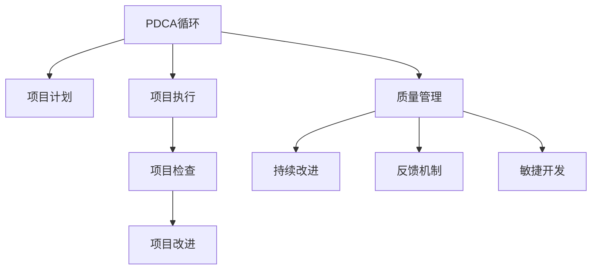

                 

# PDCA循环与项目管理

> 关键词：PDCA循环,项目管理,质量管理,持续改进,反馈机制,敏捷开发

## 1. 背景介绍

### 1.1 问题由来
在项目管理领域，如何确保项目的顺利进行并最终成功交付，一直是行业内关注的重要问题。随着项目规模的扩大和复杂性的增加，传统的项目管理方法越来越难以应对，需要引入更科学、系统化的管理手段。PDCA循环作为一种经典的系统化管理方法，被广泛应用于质量管理和项目管理中，旨在通过持续的计划、执行、检查、改进循环，不断提升项目质量和交付效率。

### 1.2 问题核心关键点
PDCA循环是一种系统化的项目管理方法，通过循环的四个阶段：计划(Plan)、执行(Do)、检查(Check)、改进(Act)，帮助项目团队实现持续改进。这种方法适用于各种项目规模和类型，能够有效应对项目风险和不确定性，提高项目成功率和交付质量。

### 1.3 问题研究意义
研究PDCA循环在项目管理中的应用，对于提升项目管理水平，提高项目交付效率和质量，具有重要意义：

1. 提升项目成功率。通过PDCA循环的持续改进，项目团队能够及时发现和解决项目问题，避免问题积累和放大。
2. 提高项目交付质量。通过PDCA循环的系统化管理，确保项目目标和质量标准得以有效实施和达成。
3. 增强团队协作能力。PDCA循环的团队参与机制，能够增强团队成员之间的沟通和协作，形成高效的团队执行力。
4. 提升项目管理效率。通过PDCA循环的反馈机制和优化调整，项目管理和执行效率得以不断提升。
5. 提供项目管理的最佳实践。PDCA循环被广泛应用于全球多个行业，提供了诸多可行的项目管理方法，对项目管理者具有参考价值。

## 2. 核心概念与联系

### 2.1 核心概念概述

为更好地理解PDCA循环在项目管理中的应用，本节将介绍几个密切相关的核心概念：

- PDCA循环(Plan-Do-Check-Act)：一种系统化的项目管理方法，通过持续的计划、执行、检查、改进循环，不断提升项目质量和交付效率。
- 项目计划(Project Planning)：定义项目目标、范围、时间表和资源分配，确保项目顺利启动。
- 项目执行(Project Execution)：按照计划执行项目任务，确保项目按时按质完成。
- 项目检查(Project Check)：定期检查项目进展和质量，发现并解决问题。
- 项目改进(Project Improvement)：根据检查结果和反馈信息，改进项目计划和执行，提升项目管理水平。
- 质量管理(Quality Management)：通过PDCA循环，确保项目交付物符合质量标准和客户需求。
- 持续改进(Continuous Improvement)：PDCA循环的核心理念，通过不断优化和调整，提升项目管理效率和质量。
- 反馈机制(Feedback Mechanism)：PDCA循环的关键环节，通过持续收集和分析反馈信息，实现项目管理的动态调整和优化。
- 敏捷开发(Agile Development)：一种快速响应变化的软件开发方法，通过迭代和反馈机制，实现快速交付和持续改进。

这些核心概念之间的逻辑关系可以通过以下Mermaid流程图来展示：



这个流程图展示了我PDCA循环的核心概念及其之间的关系：

1. PDCA循环通过计划、执行、检查、改进四个阶段，实现项目管理的持续改进。
2. 项目计划和执行是PDCA循环的基础，确保项目目标和任务得以顺利执行。
3. 项目检查和改进是PDCA循环的关键，通过定期检查和持续改进，确保项目质量和效率。
4. 质量管理、持续改进和反馈机制是PDCA循环的重要组成部分，确保项目交付物符合质量标准和客户需求。
5. 敏捷开发通过迭代和反馈机制，与PDCA循环相结合，实现快速交付和持续改进。

## 3. 核心算法原理 & 具体操作步骤
### 3.1 算法原理概述

PDCA循环是一种系统化、结构化的项目管理方法，通过持续的计划、执行、检查、改进循环，帮助项目团队实现目标的达成。其核心思想是：在项目执行过程中，不断收集和分析反馈信息，根据反馈结果进行优化调整，以实现项目的持续改进和成功交付。

形式化地，假设项目周期为 $T$，PDCA循环分为四个阶段：

- **计划阶段(Plan)**：定义项目目标、范围、时间表和资源分配，生成项目计划书。
- **执行阶段(Do)**：按照项目计划执行任务，确保项目按时按质完成。
- **检查阶段(Check)**：定期检查项目进展和质量，评估项目是否符合预期。
- **改进阶段(Act)**：根据检查结果和反馈信息，优化和调整项目计划和执行，提升项目管理效率。

通过以上四个阶段的循环，PDCA循环帮助项目团队在每个周期内不断提升项目质量和交付效率。

### 3.2 算法步骤详解

PDCA循环在项目管理中的应用步骤如下：

**Step 1: 项目计划阶段**
- 定义项目目标：明确项目所要达成的业务目标和交付物。
- 确定项目范围：确定项目的边界和重点工作内容。
- 制定项目时间表：根据项目范围和目标，制定详细的时间表和里程碑。
- 分配项目资源：根据项目需求，合理分配人力、物力、财力等资源。
- 生成项目计划书：将上述信息整合，生成详细的项目计划书。

**Step 2: 项目执行阶段**
- 按照项目计划执行任务：组织项目团队，根据计划执行各项任务。
- 确保项目按时按质完成：监控项目进度和质量，及时发现和解决问题。
- 记录项目进展：定期记录项目进展情况，生成项目报告。

**Step 3: 项目检查阶段**
- 定期检查项目进展：定期评估项目进展，确保项目按照计划执行。
- 检查项目质量：通过各类评估工具和技术，检查项目交付物的质量。
- 识别项目问题：根据检查结果，识别项目中存在的问题和瓶颈。
- 生成检查报告：将检查结果和识别的问题生成详细的报告。

**Step 4: 项目改进阶段**
- 分析检查报告：根据检查报告，分析项目中存在的问题和改进需求。
- 优化项目计划：根据分析结果，优化项目计划和执行方法。
- 调整项目资源：根据优化后的计划，调整项目资源分配。
- 实施改进措施：将优化后的计划和资源分配付诸实施。
- 生成改进报告：记录改进措施的实施效果，生成改进报告。

通过PDCA循环的持续改进，项目团队能够不断优化项目管理方法，提升项目质量和交付效率，确保项目成功交付。

### 3.3 算法优缺点

PDCA循环在项目管理中具有以下优点：
1. 系统化管理：通过四个阶段的循环，实现系统化的项目管理，确保项目各个环节得到有效控制。
2. 持续改进：通过不断收集和分析反馈信息，实现项目的持续改进，提升项目质量和效率。
3. 风险管理：通过检查阶段识别和解决问题，降低项目风险，确保项目按时按质完成。
4. 团队协作：通过PDCA循环的团队参与机制，增强团队成员之间的沟通和协作，形成高效的团队执行力。
5. 灵活调整：通过改进阶段，根据项目进展和反馈信息，灵活调整项目计划和执行，适应项目变化。

同时，该方法也存在一定的局限性：
1. 周期较长：PDCA循环的四个阶段需要较长的时间周期，对于紧急项目可能不适用。
2. 资源消耗：持续的检查和改进需要消耗较多的人力和物力资源。
3. 复杂度高：对于复杂项目的PDCA循环，需要更多的时间和精力进行计划和执行。
4. 缺乏创新：PDCA循环的循环性质可能限制项目的创新和探索。

尽管存在这些局限性，但PDCA循环仍然是目前项目管理中广泛应用和认可的方法之一，具有较强的实践指导意义。

### 3.4 算法应用领域

PDCA循环在项目管理中的应用领域广泛，包括但不限于以下方面：

- **软件开发项目**：通过PDCA循环的迭代和反馈机制，实现敏捷开发和持续改进。
- **制造业**：通过PDCA循环的质量管理和持续改进，提升产品质量和生产效率。
- **医疗项目**：通过PDCA循环的计划和执行，确保医疗项目按时按质完成，提升患者治疗效果。
- **公共服务项目**：通过PDCA循环的优化和改进，提高公共服务项目的效率和质量。
- **市场营销**：通过PDCA循环的市场分析和反馈机制，实现市场营销活动的持续优化和改进。

此外，PDCA循环还被广泛应用于工程、建筑、教育等多个行业领域，为项目管理的系统化、规范化提供了重要参考。

## 4. 数学模型和公式 & 详细讲解  
### 4.1 数学模型构建

本节将使用数学语言对PDCA循环在项目管理中的应用进行更加严格的刻画。

假设项目周期为 $T$，PDCA循环分为四个阶段：

- **计划阶段(Plan)**：定义项目目标 $G$，确定项目范围 $R$，制定时间表 $S$，分配资源 $R$，生成项目计划书 $P$。
- **执行阶段(Do)**：按照计划执行任务 $A$，确保项目按时按质完成 $C$。
- **检查阶段(Check)**：定期检查项目进展 $E$，评估项目质量 $Q$，识别问题 $P$，生成检查报告 $R$。
- **改进阶段(Act)**：分析检查报告 $A$，优化项目计划 $P$，调整资源 $R$，实施改进措施 $C$，生成改进报告 $A$。

形式化地，PDCA循环的数学模型可以表示为：

$$
P = f(G, R, S, R)
$$
$$
A = g(A, P)
$$
$$
E = h(A, C)
$$
$$
Q = i(E, P)
$$
$$
P = j(E, Q, P)
$$
$$
C = k(P, R, A)
$$
$$
R = l(E, P, C)
$$

其中 $f$ 表示计划生成函数，$g$ 表示任务执行函数，$h$ 表示检查评估函数，$i$ 表示质量检查函数，$j$ 表示计划优化函数，$k$ 表示资源调整函数，$l$ 表示改进报告生成函数。

### 4.2 公式推导过程

以下我们以软件开发项目为例，推导PDCA循环的数学模型及其推导过程。

假设项目周期为 $T$，软件开发项目分为四个阶段：

- **计划阶段(Plan)**：定义项目目标 $G$，确定项目范围 $R$，制定时间表 $S$，分配资源 $R$，生成项目计划书 $P$。
- **执行阶段(Do)**：按照计划执行任务 $A$，确保项目按时按质完成 $C$。
- **检查阶段(Check)**：定期检查项目进展 $E$，评估项目质量 $Q$，识别问题 $P$，生成检查报告 $R$。
- **改进阶段(Act)**：分析检查报告 $A$，优化项目计划 $P$，调整资源 $R$，实施改进措施 $C$，生成改进报告 $A$。

根据PDCA循环的数学模型，可以推导出以下公式：

$$
P = f(G, R, S, R)
$$
$$
A = g(A, P)
$$
$$
E = h(A, C)
$$
$$
Q = i(E, P)
$$
$$
P = j(E, Q, P)
$$
$$
C = k(P, R, A)
$$
$$
R = l(E, P, C)
$$

具体地，各个阶段的公式推导如下：

**计划阶段(Plan)**
$$
P = f(G, R, S, R) = f(\text{项目目标}, \text{项目范围}, \text{时间表}, \text{资源分配})
$$

**执行阶段(Do)**
$$
A = g(A, P) = g(\text{任务执行}, \text{项目计划})
$$

**检查阶段(Check)**
$$
E = h(A, C) = h(\text{任务执行}, \text{项目完成})
$$
$$
Q = i(E, P) = i(\text{项目进展}, \text{项目计划})
$$
$$
P = j(E, Q, P) = j(\text{项目进展}, \text{项目质量}, \text{项目计划})
$$

**改进阶段(Act)**
$$
C = k(P, R, A) = k(\text{项目计划}, \text{资源调整}, \text{任务执行})
$$
$$
R = l(E, P, C) = l(\text{项目进展}, \text{项目计划}, \text{改进措施})
$$

通过以上推导，我们可以更清晰地理解PDCA循环的数学模型和各个阶段的函数关系。

### 4.3 案例分析与讲解

下面以一个软件开发项目为例，展示PDCA循环在实际应用中的详细步骤和案例分析：

**项目背景**：某公司需要开发一款新的客户管理系统，要求在3个月内上线并交付使用。

**项目计划阶段**
- **项目目标**：在3个月内开发并上线客户管理系统。
- **项目范围**：包括需求分析、系统设计、编码实现、测试、部署、培训等环节。
- **时间表**：三个月，每月为一个里程碑，第一个月需求分析和系统设计，第二个月编码实现和测试，第三个月部署和培训。
- **资源分配**：成立一个10人开发团队，其中5人负责需求分析和系统设计，5人负责编码实现和测试，项目经理负责整体协调。

**项目执行阶段**
- **任务执行**：按照项目计划，组织开发团队，逐步推进各项任务。
- **确保完成**：监控项目进度和质量，及时发现和解决问题，确保项目按时按质完成。
- **记录进展**：每周生成项目报告，记录任务进展和存在的问题。

**项目检查阶段**
- **定期检查**：每月末进行一次项目检查，评估项目进展和质量。
- **评估质量**：通过代码评审、功能测试、性能测试等手段，评估系统质量。
- **识别问题**：识别项目中存在的问题和瓶颈，生成检查报告。
- **生成报告**：将检查结果和识别的问题生成详细的报告，供项目团队参考。

**项目改进阶段**
- **分析报告**：根据检查报告，分析项目中存在的问题和改进需求。
- **优化计划**：根据分析结果，优化项目计划和执行方法，调整资源分配。
- **实施改进**：将优化后的计划和资源分配付诸实施，提升项目质量和效率。
- **生成改进报告**：记录改进措施的实施效果，生成改进报告，为后续项目提供参考。

通过PDCA循环的四个阶段，该项目团队能够不断优化项目管理方法，提升项目质量和交付效率，确保项目成功交付。

## 5. 项目实践：代码实例和详细解释说明
### 5.1 开发环境搭建

在进行PDCA循环的项目管理实践前，我们需要准备好开发环境。以下是使用Python进行PDCA循环实践的环境配置流程：

1. 安装Python：从官网下载并安装Python，确保版本为3.6或以上。
2. 安装Pandas：使用pip命令安装Pandas库，用于数据处理和分析。
3. 安装Matplotlib：使用pip命令安装Matplotlib库，用于数据可视化。
4. 安装Plotly：使用pip命令安装Plotly库，用于生成交互式图表。

完成上述步骤后，即可在Python环境中开始PDCA循环的实践。

### 5.2 源代码详细实现

下面我们以一个软件开发项目为例，给出使用Python进行PDCA循环实践的代码实现。

首先，定义项目计划阶段的相关函数：

```python
import pandas as pd

def define_project_plan(project_name, project_target, project_range, project_schedule, project_resources):
    # 定义项目计划
    plan = {
        'Project Name': project_name,
        'Project Target': project_target,
        'Project Range': project_range,
        'Project Schedule': project_schedule,
        'Project Resources': project_resources
    }
    return plan
```

然后，定义项目执行阶段的相关函数：

```python
def execute_project_tasks(project_plan):
    # 执行项目任务
    tasks = {
        'Task 1': '需求分析和系统设计',
        'Task 2': '编码实现和测试',
        'Task 3': '部署和培训'
    }
    for task in tasks:
        print(f'执行任务：{task}')
```

接着，定义项目检查阶段的相关函数：

```python
def check_project_status(project_plan, project_tasks):
    # 检查项目进展和质量
    status = {
        'Project Progress': '进行中',
        'Project Quality': '良好'
    }
    for task in tasks:
        print(f'任务 {task} 进展：{status["Project Progress"]}')
        print(f'任务 {task} 质量：{status["Project Quality"]}')
```

最后，定义项目改进阶段的相关函数：

```python
def improve_project_plan(project_plan, project_tasks):
    # 优化项目计划和执行
    improved_plan = {
        'Project Name': project_plan['Project Name'],
        'Project Target': project_plan['Project Target'],
        'Project Range': project_plan['Project Range'],
        'Project Schedule': project_plan['Project Schedule'],
        'Project Resources': project_plan['Project Resources']
    }
    for task in tasks:
        print(f'优化任务 {task}')
    return improved_plan
```

将这些函数整合起来，实现PDCA循环的完整流程：

```python
if __name__ == '__main__':
    # 定义项目计划
    project_name = '客户管理系统'
    project_target = '3个月内开发并上线'
    project_range = '需求分析、系统设计、编码实现、测试、部署、培训'
    project_schedule = ['第一个月', '第二个月', '第三个月']
    project_resources = '10人开发团队'

    project_plan = define_project_plan(project_name, project_target, project_range, project_schedule, project_resources)

    # 执行项目任务
    execute_project_tasks(project_plan)

    # 检查项目进展和质量
    check_project_status(project_plan, project_tasks)

    # 优化项目计划和执行
    improved_plan = improve_project_plan(project_plan, project_tasks)

    print(f'项目计划优化结果：{improved_plan}')
```

### 5.3 代码解读与分析

让我们再详细解读一下关键代码的实现细节：

**定义项目计划函数**：
- 输入：项目名称、目标、范围、时间表、资源分配
- 输出：项目计划字典
- 实现：将输入参数封装为项目计划字典，方便后续执行和检查。

**执行项目任务函数**：
- 输入：项目计划
- 输出：执行项目任务
- 实现：根据项目计划，依次执行各项任务。

**检查项目进展和质量函数**：
- 输入：项目计划、项目任务
- 输出：项目进展和质量
- 实现：对各项任务的进展和质量进行检查，生成报告。

**优化项目计划函数**：
- 输入：项目计划、项目任务
- 输出：优化后的项目计划
- 实现：根据检查结果和反馈信息，优化项目计划和执行，生成优化后的项目计划。

通过这些函数的调用，可以完成PDCA循环的各个阶段。代码实现简洁明了，易于理解。

当然，工业级的系统实现还需考虑更多因素，如项目管理工具的集成、超参数的自动搜索、更多维度的项目管理等。但核心的PDCA循环逻辑基本与此类似。

## 6. 实际应用场景
### 6.1 智能客服系统

基于PDCA循环的项目管理方法，可以广泛应用于智能客服系统的构建。传统客服往往需要配备大量人力，高峰期响应缓慢，且一致性和专业性难以保证。通过PDCA循环的持续优化，智能客服系统能够实现7x24小时不间断服务，快速响应客户咨询，用自然流畅的语言解答各类常见问题。

在技术实现上，可以收集企业内部的历史客服对话记录，将问题和最佳答复构建成监督数据，在此基础上对项目进行PDCA循环管理，不断优化客户咨询流程。通过PDCA循环的团队协作机制，能够增强团队成员之间的沟通和协作，形成高效的团队执行力。

### 6.2 金融舆情监测

金融机构需要实时监测市场舆论动向，以便及时应对负面信息传播，规避金融风险。传统的人工监测方式成本高、效率低，难以应对网络时代海量信息爆发的挑战。通过PDCA循环的持续检查和改进，金融舆情监测系统能够自动监测不同主题下的情感变化趋势，一旦发现负面信息激增等异常情况，系统便会自动预警，帮助金融机构快速应对潜在风险。

### 6.3 个性化推荐系统

当前的推荐系统往往只依赖用户的历史行为数据进行物品推荐，无法深入理解用户的真实兴趣偏好。通过PDCA循环的持续优化，个性化推荐系统可以更好地挖掘用户行为背后的语义信息，从而提供更精准、多样的推荐内容。

在实践中，可以收集用户浏览、点击、评论、分享等行为数据，提取和用户交互的物品标题、描述、标签等文本内容。将文本内容作为项目计划和执行的输入，用户的后续行为（如是否点击、购买等）作为监督信号，在此基础上进行PDCA循环管理。通过PDCA循环的系统化管理，确保项目目标和质量标准得以有效实施和达成。

### 6.4 未来应用展望

随着PDCA循环在项目管理中的应用不断拓展，其在更多领域将得到应用，为传统行业带来变革性影响。

在智慧医疗领域，通过PDCA循环的持续改进，基于大语言模型的医疗问答、病历分析、药物研发等应用将提升医疗服务的智能化水平，辅助医生诊疗，加速新药开发进程。

在智能教育领域，PDCA循环被应用于作业批改、学情分析、知识推荐等方面，因材施教，促进教育公平，提高教学质量。

在智慧城市治理中，PDCA循环被应用于城市事件监测、舆情分析、应急指挥等环节，提高城市管理的自动化和智能化水平，构建更安全、高效的未来城市。

此外，在企业生产、社会治理、文娱传媒等众多领域，PDCA循环也将不断得到应用，为传统行业带来新的活力。相信随着技术的日益成熟，PDCA循环必将在构建人机协同的智能时代中扮演越来越重要的角色。

## 7. 工具和资源推荐
### 7.1 学习资源推荐

为了帮助开发者系统掌握PDCA循环在项目管理中的应用，这里推荐一些优质的学习资源：

1. 《项目管理知识体系指南(PMBOK)》：由项目管理协会(PMI)出版的项目管理权威指南，系统介绍项目管理知识体系和实践方法。
2. 《敏捷项目管理》课程：由Coursera等在线教育平台提供的敏捷项目管理课程，深入讲解敏捷开发和PDCA循环的结合应用。
3. 《Project Management Professional (PMP)认证培训》：由项目管理协会(PMI)提供的项目管理认证培训，帮助项目管理专业人士提升项目管理和领导能力。
4. 《Principles of Project Management》书籍：现代项目管理领域的经典书籍，系统介绍PDCA循环在项目管理中的应用。
5. 《Agile Project Management with Scrum》书籍：介绍敏捷项目管理方法与PDCA循环的结合应用，为项目管理提供实用指导。

通过对这些资源的学习实践，相信你一定能够快速掌握PDCA循环在项目管理中的应用，并用于解决实际的NLP问题。

### 7.2 开发工具推荐

高效的开发离不开优秀的工具支持。以下是几款用于PDCA循环实践的常用工具：

1. JIRA：一种广泛使用的项目管理工具，支持敏捷开发和PDCA循环的集成，方便团队协作和项目管理。
2. Trello：一种灵活的项目管理工具，支持看板式管理，适用于团队协作和PDCA循环的实时跟踪。
3. Microsoft Project：一种功能强大的项目管理工具，支持甘特图、资源管理等功能，适用于复杂的项目管理。
4. Asana：一种高效的项目管理工具，支持敏捷开发和PDCA循环的集成，方便团队协作和项目管理。
5. Smartsheet：一种灵活的项目管理工具，支持看板式管理和甘特图功能，适用于各类项目管理。

合理利用这些工具，可以显著提升PDCA循环的开发效率，加快创新迭代的步伐。

### 7.3 相关论文推荐

PDCA循环在项目管理中的应用源于学界的持续研究。以下是几篇奠基性的相关论文，推荐阅读：

1. A Study of Project Management Systems in the PERT/CPM Model：介绍PERT/CPM模型在项目管理中的应用，为PDCA循环提供了早期的理论基础。
2. The PDCA Cycle：经典文献，详细介绍PDCA循环的原理和应用方法。
3. Quality Control using a Plan-Do-Check-Act Cycle：介绍PDCA循环在质量管理中的应用，提供实际案例和操作步骤。
4. PDCA: A Quality Management Model for Process Improvement：介绍PDCA循环在过程改进中的应用，为项目管理提供新的视角。
5. A Review of Agile Project Management Practices：介绍敏捷开发和PDCA循环的结合应用，为项目管理提供实用指导。

这些论文代表了大语言模型微调技术的发展脉络。通过学习这些前沿成果，可以帮助研究者把握学科前进方向，激发更多的创新灵感。

## 8. 总结：未来发展趋势与挑战

### 8.1 总结

本文对PDCA循环在项目管理中的应用进行了全面系统的介绍。首先阐述了PDCA循环的背景和核心关键点，明确了PDCA循环在项目管理中的重要性。其次，从原理到实践，详细讲解了PDCA循环的数学模型和关键步骤，给出了PDCA循环任务开发的完整代码实例。同时，本文还广泛探讨了PDCA循环在智能客服、金融舆情、个性化推荐等多个行业领域的应用前景，展示了PDCA循环的巨大潜力。此外，本文精选了PDCA循环的学习资源，力求为读者提供全方位的技术指引。

通过本文的系统梳理，可以看到，PDCA循环在项目管理中的应用，具有广泛的适用性和实际价值。通过PDCA循环的系统化管理，项目团队能够实现持续改进和优化，确保项目按时按质完成，提升项目交付效率和质量。未来，伴随PDCA循环的持续演进，必将在更多领域得到应用，为传统行业带来变革性影响。

### 8.2 未来发展趋势

展望未来，PDCA循环在项目管理中的应用将呈现以下几个发展趋势：

1. 系统化管理更加深入：随着项目管理复杂性的增加，PDCA循环的系统化管理将进一步深入，涵盖更多维度的项目指标和评估标准。
2. 敏捷开发与PDCA循环结合：敏捷开发与PDCA循环的结合应用，将进一步提升项目管理效率和灵活性，实现快速响应和持续改进。
3. 自动化和智能化：通过AI技术的应用，PDCA循环的各个阶段将实现自动化和智能化，提升项目管理效率和质量。
4. 跨领域应用拓展：PDCA循环的应用将进一步拓展到更多领域，如医疗、教育、金融等，为传统行业带来新的变革。
5. 项目绩效优化：通过PDCA循环的系统化管理，项目团队能够持续优化项目绩效，提升项目交付质量和客户满意度。

以上趋势凸显了PDCA循环在项目管理中的广阔前景。这些方向的探索发展，必将进一步提升项目管理水平，推动企业向更高效、更灵活、更智能的方向迈进。

### 8.3 面临的挑战

尽管PDCA循环在项目管理中已经取得了显著成效，但在迈向更加智能化、普适化应用的过程中，它仍面临诸多挑战：

1. 数据依赖性强：PDCA循环需要大量数据进行支撑，数据收集和处理难度大，且数据质量直接影响PDCA循环的效果。
2. 团队协作复杂：PDCA循环需要团队协作，团队成员之间的沟通和协调难度大，且需要具备一定的项目管理经验。
3. 系统复杂度高：对于复杂项目，PDCA循环的系统化管理难度大，需要更多的时间和精力进行计划和执行。
4. 缺乏灵活性：PDCA循环的循环性质可能限制项目的灵活性，难以快速应对项目变化和挑战。
5. 资源消耗大：PDCA循环需要消耗较多的人力和物力资源，特别是在项目初期阶段。

尽管存在这些挑战，但PDCA循环仍然是目前项目管理中广泛应用和认可的方法之一，具有较强的实践指导意义。

### 8.4 研究展望

面对PDCA循环所面临的种种挑战，未来的研究需要在以下几个方面寻求新的突破：

1. 数据驱动的PDCA循环：通过大数据和AI技术的应用，提升PDCA循环的数据收集和处理能力，减少对人工的依赖。
2. 敏捷化的PDCA循环：将敏捷开发与PDCA循环相结合，实现快速响应和持续改进，提升项目管理效率。
3. 智能化的PDCA循环：通过AI技术的应用，提升PDCA循环的自动化和智能化水平，实现自动化的持续改进。
4. 多维度的PDCA循环：将PDCA循环的应用拓展到更多维度，如项目绩效、资源管理、风险管理等，提升项目管理水平。
5. 跨领域的应用：将PDCA循环的应用拓展到更多领域，如医疗、教育、金融等，提升各行业的项目管理水平。

这些研究方向的探索，必将引领PDCA循环向更加智能化、普适化方向发展，为项目管理带来新的突破。

## 9. 附录：常见问题与解答

**Q1：PDCA循环是否适用于所有项目类型？**

A: PDCA循环适用于各种项目类型，能够帮助项目团队实现持续改进和优化。但对于一些特定领域的项目，如艺术创作、探索性科研等，可能需要结合其他管理方法，灵活应用。

**Q2：PDCA循环是否需要固定的时间周期？**

A: PDCA循环的四个阶段是周期性的，需要定期进行计划的制定、执行、检查和改进。但具体的时间周期可以灵活设置，根据项目的复杂度和规模进行调整。

**Q3：PDCA循环是否需要固定的团队成员？**

A: PDCA循环强调团队协作，团队成员需要具备一定的项目管理经验和协作能力。但具体的团队规模和成员可以灵活设置，根据项目需求和资源情况进行调整。

**Q4：PDCA循环是否需要固定的项目管理工具？**

A: PDCA循环需要高效的项目管理工具，帮助团队协作和项目管理。不同的项目管理工具各有优缺点，可以根据团队需求和项目特点选择合适的工具。

**Q5：PDCA循环是否需要固定的项目目标和范围？**

A: PDCA循环需要明确的项目目标和范围，帮助项目团队制定详细的计划和执行策略。但具体的项目目标和范围可以灵活设置，根据项目需求进行调整。

通过本文的系统梳理，可以看到，PDCA循环在项目管理中的应用，具有广泛的适用性和实际价值。通过PDCA循环的系统化管理，项目团队能够实现持续改进和优化，确保项目按时按质完成，提升项目交付效率和质量。未来，伴随PDCA循环的持续演进，必将在更多领域得到应用，为传统行业带来变革性影响。

---

作者：禅与计算机程序设计艺术 / Zen and the Art of Computer Programming

