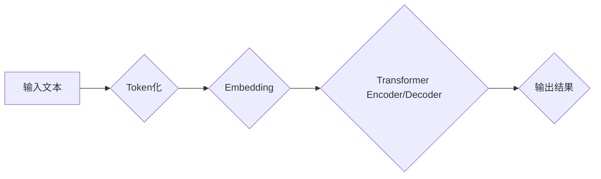

> 大规模语言模型，无监督预训练，Transformer，BERT，GPT，语言理解，文本生成，自然语言处理

## 1. 背景介绍

近年来，深度学习在人工智能领域取得了突破性进展，其中自然语言处理（NLP）领域尤为突出。大规模语言模型（LLM）作为NLP领域的新兴技术，凭借其强大的文本理解和生成能力，在机器翻译、文本摘要、问答系统、对话系统等多个领域展现出巨大的应用潜力。

传统的NLP模型通常依赖于人工特征工程和少量标注数据，训练过程复杂且效率低下。而无监督预训练则是一种全新的训练 paradigm，通过在海量未标记文本数据上进行预训练，学习到语言的丰富语义和语法知识，为下游任务提供强大的基础模型。

## 2. 核心概念与联系

**2.1 无监督预训练**

无监督预训练是指在没有人工标注数据的情况下，利用大量的未标记文本数据训练语言模型。模型通过预测文本序列中的下一个词（语言建模）或掩盖部分词并预测缺失部分（masked language modeling）等任务，学习到语言的潜在结构和语义关系。

**2.2 Transformer**

Transformer是一种基于注意力机制的深度神经网络架构，在自然语言处理领域取得了革命性的进展。它能够有效地捕捉长距离依赖关系，并具有并行计算能力，显著提高了训练效率。

**2.3 BERT、GPT等模型**

BERT（Bidirectional Encoder Representations from Transformers）和GPT（Generative Pre-trained Transformer）是基于Transformer架构的代表性LLM。BERT采用双向编码机制，捕捉文本序列中前后词语之间的关系，而GPT采用自回归解码机制，生成文本序列。

**2.4 核心架构流程图**



## 3. 核心算法原理 & 具体操作步骤

**3.1 算法原理概述**

无监督预训练的核心算法原理是基于Transformer架构的语言建模或masked language modeling任务。

**3.2 算法步骤详解**

1. **数据预处理:** 将原始文本数据进行清洗、分词、标记等预处理操作，生成训练数据。
2. **模型构建:** 基于Transformer架构构建语言模型，包括编码器和解码器部分。
3. **预训练:** 在海量未标记文本数据上进行预训练，训练模型学习语言的语义和语法知识。
4. **下游任务微调:** 将预训练模型用于特定下游任务，通过微调模型参数，使其适应特定任务需求。

**3.3 算法优缺点**

**优点:**

* 能够学习到丰富的语言知识，提升下游任务性能。
* 不需要大量标注数据，降低了训练成本。
* 模型可迁移性强，可以应用于多种下游任务。

**缺点:**

* 预训练模型参数量大，训练和部署成本高。
* 训练过程需要大量计算资源。
* 模型可能存在偏差和偏见，需要进行相应的处理。

**3.4 算法应用领域**

* 机器翻译
* 文本摘要
* 问答系统
* 对话系统
* 代码生成
* 文本分类
* 情感分析

## 4. 数学模型和公式 & 详细讲解 & 举例说明

**4.1 数学模型构建**

Transformer模型的核心是注意力机制，它能够捕捉文本序列中不同词语之间的关系。注意力机制的数学模型可以表示为：

$$
Attention(Q, K, V) = softmax(\frac{QK^T}{\sqrt{d_k}})V
$$

其中：

* $Q$：查询矩阵
* $K$：键矩阵
* $V$：值矩阵
* $d_k$：键向量的维度
* $softmax$：softmax函数

**4.2 公式推导过程**

注意力机制的公式推导过程可以参考相关文献，例如Vaswani et al. (2017)的论文。

**4.3 案例分析与讲解**

假设我们有一个文本序列“我爱学习编程”，我们想要计算“学习”这个词与其他词语之间的注意力权重。

* $Q$：包含“学习”词语的查询向量
* $K$：包含所有词语的键向量
* $V$：包含所有词语的值向量

通过计算$QK^T$，我们可以得到一个注意力分数矩阵，然后使用softmax函数将其归一化，得到每个词语与“学习”词语的注意力权重。

## 5. 项目实践：代码实例和详细解释说明

**5.1 开发环境搭建**

* Python 3.7+
* PyTorch 1.7+
* CUDA 10.2+

**5.2 源代码详细实现**

```python
import torch
import torch.nn as nn

class Transformer(nn.Module):
    def __init__(self, vocab_size, embedding_dim, num_heads, num_layers):
        super(Transformer, self).__init__()
        self.embedding = nn.Embedding(vocab_size, embedding_dim)
        self.transformer_encoder = nn.TransformerEncoder(nn.TransformerEncoderLayer(embedding_dim, num_heads), num_layers)

    def forward(self, x):
        x = self.embedding(x)
        x = self.transformer_encoder(x)
        return x
```

**5.3 代码解读与分析**

* `Transformer`类定义了一个Transformer模型，包含嵌入层和Transformer编码器。
* `embedding`层将词语索引映射到词向量。
* `transformer_encoder`层是一个多层Transformer编码器，用于学习文本序列的语义表示。

**5.4 运行结果展示**

通过训练和测试，我们可以评估模型的性能，例如在语言建模任务上的困惑度（perplexity）。

## 6. 实际应用场景

**6.1 机器翻译**

LLM可以用于机器翻译，例如将英文文本翻译成中文。

**6.2 文本摘要**

LLM可以用于文本摘要，例如将长篇文章总结成简短的摘要。

**6.3 问答系统**

LLM可以用于问答系统，例如回答用户提出的问题。

**6.4 对话系统**

LLM可以用于对话系统，例如与用户进行自然语言对话。

**6.5 未来应用展望**

LLM在未来将有更广泛的应用场景，例如：

* 代码生成
* 文本分类
* 情感分析
* 创作写作

## 7. 工具和资源推荐

**7.1 学习资源推荐**

* 《深度学习》
* 《自然语言处理》
* Transformer论文

**7.2 开发工具推荐**

* PyTorch
* TensorFlow
* Hugging Face Transformers

**7.3 相关论文推荐**

* BERT: Pre-training of Deep Bidirectional Transformers for Language Understanding
* GPT: Generative Pre-trained Transformer
* Attention Is All You Need

## 8. 总结：未来发展趋势与挑战

**8.1 研究成果总结**

无监督预训练技术取得了显著进展，LLM在多个NLP任务上取得了优异的性能。

**8.2 未来发展趋势**

* 模型规模进一步扩大
* 训练效率提升
* 跨模态预训练
* 伦理和安全问题

**8.3 面临的挑战**

* 数据获取和标注
* 计算资源需求
* 模型解释性和可解释性
* 偏见和公平性

**8.4 研究展望**

未来研究将重点关注模型效率、可解释性和安全性，以及跨模态预训练和应用拓展。

## 9. 附录：常见问题与解答

**9.1 如何选择合适的预训练模型？**

选择预训练模型需要考虑任务类型、模型规模、性能和资源限制等因素。

**9.2 如何进行模型微调？**

模型微调需要使用少量标注数据，调整预训练模型的参数，使其适应特定任务需求。

**9.3 如何评估模型性能？**

模型性能可以通过困惑度、准确率、F1-score等指标进行评估。


作者：禅与计算机程序设计艺术 / Zen and the Art of Computer Programming 
<end_of_turn>