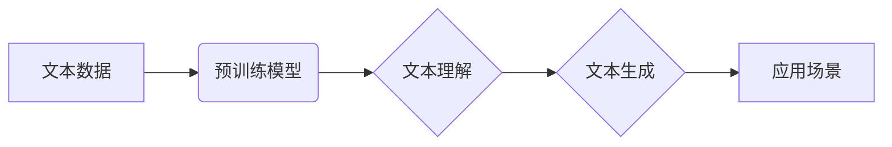

> 大语言模型、自然语言处理、Transformer、BERT、GPT、应用场景、开发实践

## 1. 背景介绍

近年来，人工智能（AI）技术取得了飞速发展，其中大语言模型（LLM）作为一种重要的AI应用，展现出强大的潜力，在自然语言处理（NLP）领域取得了突破性进展。LLM能够理解和生成人类语言，具备广泛的应用场景，例如文本生成、机器翻译、问答系统、代码生成等。

随着LLM技术的不断成熟，其应用场景也日益广泛，从学术研究到商业应用，LLM正在改变着我们与信息交互的方式。然而，对于初学者来说，LLM的原理、架构和应用方式可能较为复杂，需要深入了解才能有效地利用其强大的功能。

本指南旨在为初学者提供一个入门级的LLM应用指南，涵盖LLM的基本概念、核心算法原理、开发实践以及实际应用场景等方面，帮助读者快速了解LLM，并能够将其应用于实际项目中。

## 2. 核心概念与联系

**2.1 大语言模型 (LLM)**

大语言模型是指能够处理和生成大量文本数据的深度学习模型。它们通常基于Transformer架构，拥有大量的参数，通过训练海量文本数据，学习语言的语法、语义和上下文关系。

**2.2 自然语言处理 (NLP)**

自然语言处理是指计算机理解、处理和生成人类语言的技术。NLP的任务包括文本分类、情感分析、机器翻译、问答系统等。LLM是NLP领域的重要应用，能够有效地解决许多NLP问题。

**2.3 Transformer 架构**

Transformer是一种新型的神经网络架构，专门设计用于处理序列数据，例如文本。它引入了注意力机制，能够捕捉文本中的长距离依赖关系，从而提高了模型的性能。

**2.4 BERT、GPT 等模型**

BERT（Bidirectional Encoder Representations from Transformers）和GPT（Generative Pre-trained Transformer）是基于Transformer架构的著名LLM，它们在许多NLP任务上取得了优异的成绩。BERT是一种双向编码模型，能够理解文本的上下文关系；GPT是一种生成式模型，能够生成流畅的文本。

**2.5 应用场景**

LLM在以下领域具有广泛的应用场景：

* 文本生成：小说、诗歌、剧本、新闻报道等。
* 机器翻译：将一种语言翻译成另一种语言。
* 问答系统：回答用户提出的问题。
* 代码生成：自动生成代码。
* 聊天机器人：与用户进行自然语言对话。

**2.6 Mermaid 流程图**



## 3. 核心算法原理 & 具体操作步骤

### 3.1 算法原理概述

LLM的核心算法原理是基于深度学习的Transformer架构，它通过多层编码器和解码器结构，学习文本的语义和上下文关系。

* **编码器:** 负责将输入文本序列编码成固定长度的向量表示，捕捉文本的语义信息。
* **解码器:** 负责根据编码后的向量表示生成输出文本序列。

Transformer架构的核心创新在于引入注意力机制，能够捕捉文本中的长距离依赖关系，提高模型的理解能力。

### 3.2 算法步骤详解

1. **数据预处理:** 将文本数据进行清洗、分词、标记等预处理操作，使其能够被模型理解。
2. **模型训练:** 使用预训练模型或从头训练模型，通过训练海量文本数据，学习语言的语法、语义和上下文关系。
3. **模型评估:** 使用测试数据评估模型的性能，例如准确率、困惑度等指标。
4. **模型部署:** 将训练好的模型部署到实际应用场景中，例如API接口、嵌入式系统等。

### 3.3 算法优缺点

**优点:**

* 能够处理和生成大量文本数据。
* 具有强大的语言理解和生成能力。
* 在许多NLP任务上取得了优异的成绩。

**缺点:**

* 训练成本高，需要大量的计算资源和数据。
* 模型参数量大，部署成本较高。
* 容易受到训练数据偏差的影响。

### 3.4 算法应用领域

LLM在以下领域具有广泛的应用场景：

* 文本生成：小说、诗歌、剧本、新闻报道等。
* 机器翻译：将一种语言翻译成另一种语言。
* 问答系统：回答用户提出的问题。
* 代码生成：自动生成代码。
* 聊天机器人：与用户进行自然语言对话。

## 4. 数学模型和公式 & 详细讲解 & 举例说明

### 4.1 数学模型构建

LLM的数学模型通常基于Transformer架构，其核心是注意力机制和多头注意力机制。

**4.1.1 注意力机制**

注意力机制能够捕捉文本中的长距离依赖关系，提高模型的理解能力。注意力机制的计算公式如下：

$$
Attention(Q, K, V) = softmax(\frac{QK^T}{\sqrt{d_k}})V
$$

其中：

* $Q$：查询矩阵
* $K$：键矩阵
* $V$：值矩阵
* $d_k$：键向量的维度
* $softmax$：softmax函数

**4.1.2 多头注意力机制**

多头注意力机制是将多个注意力机制并行执行，能够捕捉不同类型的文本关系。多头注意力机制的计算公式如下：

$$
MultiHead(Q, K, V) = Concat(head_1, head_2, ..., head_h)W^O
$$

其中：

* $head_i$：第i个注意力头的输出
* $h$：注意力头的数量
* $W^O$：输出权重矩阵

### 4.2 公式推导过程

注意力机制的公式推导过程如下：

1. 计算查询矩阵 $Q$ 与键矩阵 $K$ 的点积，并进行归一化处理。
2. 应用softmax函数，得到注意力权重。
3. 将注意力权重与值矩阵 $V$ 进行加权求和，得到注意力输出。

多头注意力机制的公式推导过程如下：

1. 将输入矩阵 $Q$、$K$、$V$ 分成多个子矩阵，每个子矩阵对应一个注意力头。
2. 对每个注意力头执行注意力机制计算。
3. 将所有注意力头的输出进行拼接，并应用输出权重矩阵 $W^O$ 进行线性变换，得到最终的输出。

### 4.3 案例分析与讲解

**案例:**

假设我们有一个句子 "The cat sat on the mat"，我们使用注意力机制来计算每个词对其他词的注意力权重。

**分析:**

注意力权重会表明每个词对其他词的关注程度。例如，"cat" 会对 "sat" 和 "on" 具有较高的注意力权重，因为它们是描述 "cat" 行为的关键词。

**讲解:**

注意力机制能够捕捉句子中的语义关系，帮助模型理解文本的上下文信息。

## 5. 项目实践：代码实例和详细解释说明

### 5.1 开发环境搭建

* Python 3.7+
* TensorFlow 或 PyTorch 深度学习框架
* CUDA 和 cuDNN (可选，用于GPU加速)

### 5.2 源代码详细实现

```python
# 使用 TensorFlow 实现简单的文本生成模型

import tensorflow as tf

# 定义模型结构
model = tf.keras.Sequential([
    tf.keras.layers.Embedding(input_dim=vocab_size, output_dim=embedding_dim),
    tf.keras.layers.LSTM(units=lstm_units),
    tf.keras.layers.Dense(units=vocab_size, activation='softmax')
])

# 编译模型
model.compile(optimizer='adam', loss='sparse_categorical_crossentropy', metrics=['accuracy'])

# 训练模型
model.fit(x_train, y_train, epochs=epochs)

# 生成文本
text = "The quick brown fox"
for _ in range(10):
    predictions = model.predict(tf.expand_dims(text, 0))
    predicted_index = tf.argmax(predictions[0]).numpy()
    text += tokenizer.index_word[predicted_index]
```

### 5.3 代码解读与分析

* **Embedding 层:** 将单词转换为稠密的向量表示。
* **LSTM 层:** 学习文本序列的上下文信息。
* **Dense 层:** 将 LSTM 输出转换为概率分布，预测下一个单词。
* **训练过程:** 使用训练数据训练模型，优化模型参数。
* **文本生成:** 使用训练好的模型，根据输入文本预测下一个单词，并生成新的文本序列。

### 5.4 运行结果展示

运行代码后，将生成一段基于输入文本的新的文本序列。

## 6. 实际应用场景

### 6.1 文本生成

LLM可以用于生成各种类型的文本，例如：

* **小说、诗歌、剧本:** 创作具有创意和情感的文本内容。
* **新闻报道、文章:** 自动生成新闻报道、博客文章等内容。
* **广告文案、营销材料:** 生成吸引人的广告文案和营销材料。

### 6.2 机器翻译

LLM可以用于将一种语言翻译成另一种语言，例如：

* **网页翻译:** 将网页内容翻译成目标语言。
* **文档翻译:** 将文档翻译成目标语言。
* **实时翻译:** 将语音或文本实时翻译成目标语言。

### 6.3 问答系统

LLM可以用于构建问答系统，例如：

* **聊天机器人:** 与用户进行自然语言对话，回答用户的问题。
* **知识问答系统:** 回答用户关于特定主题的问题。
* **搜索引擎:** 理解用户搜索意图，并返回相关结果。

### 6.4 代码生成

LLM可以用于自动生成代码，例如：

* **代码补全:** 根据代码上下文自动补全代码。
* **代码生成:** 根据自然语言描述自动生成代码。
* **代码翻译:** 将代码从一种编程语言翻译成另一种编程语言。

### 6.5 其他应用场景

LLM还可以应用于其他领域，例如：

* **语音识别:** 将语音转换为文本。
* **文本摘要:** 生成文本的简短摘要。
* **情感分析:** 分析文本的情感倾向。

### 6.6 未来应用展望

随着LLM技术的不断发展，其应用场景将更加广泛，例如：

* **个性化教育:** 根据学生的学习情况提供个性化的学习内容和辅导。
* **医疗诊断:** 辅助医生进行疾病诊断和治疗方案制定。
* **法律服务:** 自动分析法律文件，提供法律建议。

## 7. 工具和资源推荐

### 7.1 学习资源推荐

* **书籍:**
    * 《深度学习》 by Ian Goodfellow, Yoshua Bengio, and Aaron Courville
    * 《自然语言处理》 by Dan Jurafsky and James H. Martin
* **在线课程:**
    * Coursera: Natural Language Processing Specialization
    * Udacity: Deep Learning Nanodegree
* **博客和网站:**
    * TensorFlow Blog: https://blog.tensorflow.org/
    * PyTorch Blog: https://pytorch.org/blog/
    * Hugging Face: https://huggingface.co/

### 7.2 开发工具推荐

* **TensorFlow:** https://www.tensorflow.org/
* **PyTorch:** https://pytorch.org/
* **Hugging Face Transformers:** https://huggingface.co/transformers/

### 7.3 相关论文推荐

* **BERT: Pre-training of Deep Bidirectional Transformers for Language Understanding**
* **GPT: Generative Pre-trained Transformer**
* **Attention Is All You Need**

## 8. 总结：未来发展趋势与挑战

### 8.1 研究成果总结

LLM在自然语言处理领域取得了显著的进展，能够处理和生成复杂文本，并在许多应用场景中展现出强大的能力。

### 8.2 未来发展趋势

* **模型规模和性能提升:** 随着计算资源的不断发展，LLM模型规模将进一步扩大，性能将得到进一步提升。
* **多模态LLM:** 将文本