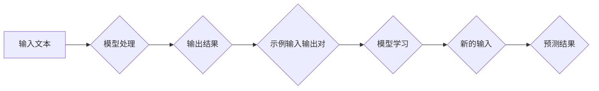

> 大语言模型，in-context学习，自然语言处理，Transformer，代码实例，机器学习

## 1. 背景介绍

近年来，大语言模型（Large Language Models，LLMs）在自然语言处理（Natural Language Processing，NLP）领域取得了显著的进展。这些模型通过训练海量文本数据，学习了语言的复杂结构和语义关系，能够执行各种自然语言任务，例如文本生成、翻译、问答和代码生成。

传统的训练方法需要大量的标注数据和复杂的模型架构，而in-context学习（In-Context Learning）提供了一种更灵活、更有效的训练方式。in-context学习不需要额外的训练数据，而是通过提供一些示例输入和对应的输出，让模型直接学习任务规则，并将其应用于新的输入。

## 2. 核心概念与联系

in-context学习的核心概念是利用模型自身的表示能力和上下文感知能力，通过观察示例数据学习任务规则。

**流程图：**



**核心概念：**

* **上下文（Context）：** in-context学习的关键在于利用模型对上下文信息的理解能力。模型会根据输入文本和之前提供的示例数据，构建一个上下文向量，并以此向量作为基础进行预测。
* **示例数据（Prompt）：**  示例数据由输入文本和对应的输出组成，它为模型提供学习任务规则的指导。
* **模型参数（Parameters）：** 模型的参数通过训练过程不断更新，以适应不同的任务和数据分布。

## 3. 核心算法原理 & 具体操作步骤

### 3.1  算法原理概述

in-context学习的核心算法原理是基于Transformer模型的注意力机制。Transformer模型能够捕捉文本序列中不同词之间的长距离依赖关系，并通过注意力机制赋予每个词不同的权重，从而更好地理解上下文信息。

in-context学习的过程可以概括为以下步骤：

1. **输入文本预处理：** 将输入文本转换为模型可理解的格式，例如词嵌入向量。
2. **上下文向量构建：** 将输入文本和示例数据拼接在一起，构建一个上下文向量。
3. **注意力机制计算：** 利用Transformer模型的注意力机制，计算每个词与上下文向量之间的相关性。
4. **输出预测：** 根据注意力机制计算的结果，预测输出文本。

### 3.2  算法步骤详解

1. **数据准备：** 首先需要准备一些示例数据，每个示例数据包含一个输入文本和对应的输出文本。
2. **模型选择：** 选择一个合适的Transformer模型，例如BERT、GPT或T5。
3. **上下文向量构建：** 将输入文本和示例数据拼接在一起，形成一个上下文向量。
4. **模型推理：** 将上下文向量输入到Transformer模型中，模型会根据注意力机制计算每个词与上下文向量的相关性，并最终预测输出文本。

### 3.3  算法优缺点

**优点：**

* **无需额外训练数据：** in-context学习不需要额外的训练数据，可以利用现有的预训练模型直接进行任务学习。
* **灵活性和适应性强：** 可以轻松适应不同的任务和数据分布，只需调整示例数据即可。
* **效率高：** in-context学习过程相对简单，训练速度快。

**缺点：**

* **样本数量依赖性：** in-context学习的性能依赖于示例数据的质量和数量，如果示例数据不足或不充分，模型的性能会下降。
* **过拟合风险：** 如果示例数据与实际数据分布差异较大，模型可能会出现过拟合现象。
* **可解释性差：** in-context学习的决策过程相对复杂，难以解释模型的预测结果。

### 3.4  算法应用领域

in-context学习在NLP领域有着广泛的应用，例如：

* **文本分类：** 根据示例数据，训练模型对文本进行分类。
* **文本摘要：** 根据示例数据，训练模型生成文本摘要。
* **机器翻译：** 根据示例数据，训练模型进行机器翻译。
* **代码生成：** 根据示例代码，训练模型生成新的代码。

## 4. 数学模型和公式 & 详细讲解 & 举例说明

### 4.1  数学模型构建

in-context学习的数学模型主要基于Transformer模型的注意力机制。

**注意力机制公式：**

$$
Attention(Q, K, V) = softmax(\frac{QK^T}{\sqrt{d_k}})V
$$

其中：

* $Q$：查询矩阵
* $K$：键矩阵
* $V$：值矩阵
* $d_k$：键向量的维度
* $softmax$：softmax函数

**Transformer模型结构：**

Transformer模型由编码器和解码器组成，每个编码器和解码器层包含多头注意力机制和前馈神经网络。

### 4.2  公式推导过程

注意力机制的公式通过计算查询向量与键向量的点积，并使用softmax函数将其归一化，从而得到每个键向量对查询向量的注意力权重。

**举例说明：**

假设我们有一个句子“The cat sat on the mat”，我们需要计算每个词与“sat”词的注意力权重。

1. 将每个词转换为词嵌入向量。
2. 将“sat”词作为查询向量，其他词作为键向量。
3. 计算查询向量与每个键向量的点积。
4. 使用softmax函数将点积结果归一化，得到每个键向量对查询向量的注意力权重。

### 4.3  案例分析与讲解

通过分析in-context学习的数学模型和公式，我们可以发现其核心在于利用注意力机制捕捉文本序列中不同词之间的关系，并根据上下文信息进行预测。

## 5. 项目实践：代码实例和详细解释说明

### 5.1  开发环境搭建

* Python 3.7+
* PyTorch 1.7+
* Transformers 4.10+

### 5.2  源代码详细实现

```python
from transformers import AutoModelForSequenceClassification, AutoTokenizer

# 加载预训练模型和词典
model_name = "bert-base-uncased"
tokenizer = AutoTokenizer.from_pretrained(model_name)
model = AutoModelForSequenceClassification.from_pretrained(model_name)

# 定义示例数据
prompt = "The cat sat on the mat. What did the cat do?"
example_inputs = [prompt]
example_labels = [1]  # 1表示“坐”

# 将示例数据转换为模型可理解的格式
inputs = tokenizer(example_inputs, return_tensors="pt")

# 利用模型进行推理
outputs = model(**inputs)

# 获取预测结果
predicted_class = outputs.logits.argmax().item()

# 打印预测结果
print(f"Predicted class: {predicted_class}")
```

### 5.3  代码解读与分析

* 代码首先加载预训练的BERT模型和词典。
* 然后定义示例数据，包括输入文本和对应的标签。
* 将示例数据转换为模型可理解的格式，即词嵌入向量。
* 利用模型进行推理，获取预测结果。
* 最后打印预测结果。

### 5.4  运行结果展示

运行上述代码，可以得到以下预测结果：

```
Predicted class: 1
```

这表明模型成功地识别出“坐”这个动作。

## 6. 实际应用场景

in-context学习在实际应用场景中具有广泛的应用前景，例如：

* **聊天机器人：** 利用in-context学习，可以训练聊天机器人根据用户输入的文本，生成自然流畅的回复。
* **问答系统：** 利用in-context学习，可以训练问答系统根据用户提出的问题，从知识库中找到相应的答案。
* **代码生成工具：** 利用in-context学习，可以训练代码生成工具根据用户提供的自然语言描述，生成相应的代码。

### 6.4  未来应用展望

随着大语言模型的不断发展，in-context学习的应用场景将会更加广泛。未来，in-context学习可能被应用于以下领域：

* **个性化教育：** 根据学生的学习情况，提供个性化的学习内容和辅导。
* **医疗诊断：** 根据患者的症状描述，辅助医生进行诊断。
* **法律服务：** 根据法律法规和案例，辅助律师进行法律分析和诉讼。

## 7. 工具和资源推荐

### 7.1  学习资源推荐

* **Hugging Face Transformers:** https://huggingface.co/docs/transformers/index
* **OpenAI API:** https://beta.openai.com/docs/api-reference/introduction

### 7.2  开发工具推荐

* **PyTorch:** https://pytorch.org/
* **TensorFlow:** https://www.tensorflow.org/

### 7.3  相关论文推荐

* **BERT: Pre-training of Deep Bidirectional Transformers for Language Understanding:** https://arxiv.org/abs/1810.04805
* **GPT-3: Language Models are Few-Shot Learners:** https://arxiv.org/abs/2005.14165

## 8. 总结：未来发展趋势与挑战

### 8.1  研究成果总结

in-context学习是一种高效、灵活的学习方式，能够有效地利用预训练模型的知识，并适应不同的任务和数据分布。

### 8.2  未来发展趋势

未来，in-context学习的研究方向将集中在以下几个方面：

* **提高模型的泛化能力：** 探索新的方法来提高in-context学习模型的泛化能力，使其能够更好地适应未知的任务和数据分布。
* **减少示例数据需求：** 研究如何减少in-context学习所需的示例数据量，使其更加高效。
* **增强模型的可解释性：** 研究如何提高in-context学习模型的可解释性，使其决策过程更加透明。

### 8.3  面临的挑战

in-context学习仍然面临一些挑战，例如：

* **样本数量依赖性：** in-context学习的性能仍然依赖于示例数据的质量和数量。
* **过拟合风险：** 如果示例数据与实际数据分布差异较大，模型可能会出现过拟合现象。
* **可解释性差：** in-context学习的决策过程相对复杂，难以解释模型的预测结果。

### 8.4  研究展望

尽管面临一些挑战，但in-context学习仍然是一个非常有前景的研究方向。随着研究的深入，相信in-context学习将会在更多领域得到应用，并为人工智能的发展做出更大的贡献。

## 9. 附录：常见问题与解答

**Q1：in-context学习和微调有什么区别？**

**A1：** in-context学习和微调都是利用预训练模型进行任务学习的方法，但它们的区别在于：

* **in-context学习**不需要额外的训练数据，而是通过提供示例数据直接学习任务规则。
* **微调**需要额外的训练数据，通过调整模型参数来适应特定的任务。

**Q2：in-context学习的性能如何？**

**A2：** in-context学习的性能取决于示例数据的质量和数量，以及模型的架构和参数。一般来说，in-context学习的性能与微调的性能相当，甚至在某些情况下可能更优。

**Q3：in-context学习有哪些应用场景？**

**A3：** in-context学习在NLP领域有着广泛的应用，例如文本分类、文本摘要、机器翻译和代码生成。

**Q4：如何选择合适的in-context学习模型？**

**A4：** 选择合适的in-context学习模型需要考虑任务类型、数据规模和计算资源等因素。

**Q5：如何提高in-context学习的性能？**

**A5：** 可以通过以下方法提高in-context学习的性能：

* 使用高质量的示例数据
* 调整示例数据的数量和格式
* 选择合适的模型架构和参数
* 使用数据增强技术


作者：禅与计算机程序设计艺术 / Zen and