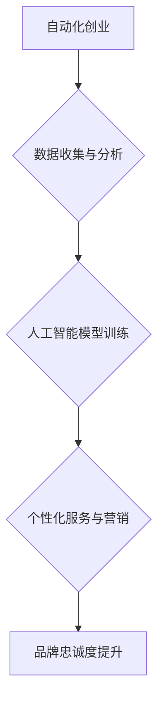

> 自动化创业，品牌忠诚度，客户关系管理，数据分析，人工智能，机器学习，个性化体验，自动化营销

## 1. 背景介绍

在当今数字化时代，创业者面临着前所未有的机遇和挑战。自动化技术正在迅速发展，为创业者提供了构建高效、可扩展业务模式的强大工具。然而，在追求自动化效率的同时，创业者也必须关注品牌忠诚度的建设，因为品牌忠诚度是企业长期可持续发展的关键因素。

传统意义上的品牌忠诚度建立在人与人之间的情感连接之上，而自动化创业的本质是通过技术手段实现高效的客户服务和营销。那么，如何在自动化创业中建立品牌忠诚度呢？

## 2. 核心概念与联系

品牌忠诚度是指消费者对特定品牌的持续偏好和购买意愿。在自动化创业中，品牌忠诚度的建立需要结合数据分析、人工智能和机器学习等技术，实现对客户需求的精准洞察和个性化服务。

**核心概念：**

* **自动化创业：** 利用自动化技术，提高运营效率，降低成本，实现规模化发展。
* **品牌忠诚度：** 消费者对特定品牌的持续偏好和购买意愿。
* **数据分析：** 收集、分析客户行为数据，洞察客户需求和偏好。
* **人工智能：** 利用机器学习算法，实现对客户行为的预测和个性化推荐。
* **机器学习：** 通过算法训练，使系统能够从数据中学习，并做出预测或决策。

**核心架构：**



## 3. 核心算法原理 & 具体操作步骤

### 3.1  算法原理概述

在自动化创业中，建立品牌忠诚度的核心算法主要基于机器学习技术，包括以下几种：

* **聚类算法：** 将客户根据他们的行为、偏好等特征进行分组，以便针对不同客户群体的需求提供个性化服务。
* **推荐算法：** 基于客户的历史行为和偏好，推荐他们可能感兴趣的产品或服务，提高客户的购买意愿。
* **预测算法：** 利用历史数据预测客户未来的行为，例如 churn rate（流失率）, 提前采取措施挽留客户。

### 3.2  算法步骤详解

**以推荐算法为例，其具体操作步骤如下：**

1. **数据收集：** 收集客户的购买历史、浏览记录、评价等数据。
2. **数据预处理：** 对收集到的数据进行清洗、转换和特征提取，以便算法能够有效地进行训练。
3. **模型训练：** 选择合适的推荐算法模型，例如协同过滤、内容过滤等，并利用训练数据进行模型训练。
4. **模型评估：** 使用测试数据评估模型的性能，例如准确率、召回率等指标。
5. **模型部署：** 将训练好的模型部署到线上环境，为用户提供个性化的产品或服务推荐。

### 3.3  算法优缺点

**推荐算法的优缺点：**

* **优点：**

    * 可以提供个性化的产品或服务推荐，提高客户的购买意愿。
    * 可以帮助企业了解客户的兴趣和需求，从而改进产品和服务。
    * 可以提高营销活动的效率，降低营销成本。

* **缺点：**

    * 需要大量的训练数据，否则模型的性能会下降。
    * 可能存在冷启动问题，即对于新用户或新产品，模型无法提供准确的推荐。
    * 可能存在推荐偏差问题，例如推荐算法可能倾向于推荐一些热门的产品或服务，而忽略一些优质但不太受欢迎的产品或服务。

### 3.4  算法应用领域

推荐算法广泛应用于各个领域，例如：

* **电商平台：** 为用户推荐商品。
* **视频网站：** 为用户推荐视频。
* **音乐平台：** 为用户推荐音乐。
* **社交媒体：** 为用户推荐朋友和内容。

## 4. 数学模型和公式 & 详细讲解 & 举例说明

### 4.1  数学模型构建

推荐算法通常使用协同过滤或内容过滤等数学模型。

**协同过滤模型：**

* **用户-物品评分矩阵：** 将用户和物品作为矩阵的行和列，每个单元格表示用户对物品的评分。
* **相似度计算：** 计算用户之间的相似度或物品之间的相似度，例如余弦相似度。
* **推荐预测：** 根据用户或物品的相似度，预测用户对物品的评分。

**内容过滤模型：**

* **物品特征向量：** 将物品的特征表示为向量，例如物品的类别、价格、描述等。
* **用户兴趣向量：** 将用户的兴趣表示为向量，例如用户喜欢的类别、价格范围等。
* **相似度计算：** 计算物品特征向量和用户兴趣向量的相似度。
* **推荐预测：** 根据相似度，推荐用户可能感兴趣的物品。

### 4.2  公式推导过程

**余弦相似度公式：**

$$
\text{相似度} = \frac{\mathbf{u} \cdot \mathbf{v}}{\|\mathbf{u}\| \|\mathbf{v}\|}
$$

其中：

* $\mathbf{u}$ 和 $\mathbf{v}$ 是两个向量的表示。
* $\mathbf{u} \cdot \mathbf{v}$ 是两个向量的点积。
* $\|\mathbf{u}\|$ 和 $\|\mathbf{v}\|$ 是两个向量的模长。

### 4.3  案例分析与讲解

**案例：**

假设有一个电商平台，用户购买历史数据如下：

| 用户 | 商品A | 商品B | 商品C |
|---|---|---|---|
| 用户1 | 5 | 3 | 4 |
| 用户2 | 4 | 5 | 2 |
| 用户3 | 3 | 2 | 5 |

我们可以使用协同过滤算法计算用户之间的相似度，并根据相似度推荐商品。例如，用户1和用户2的相似度较高，因此我们可以推荐用户1可能感兴趣的商品B给用户2。

## 5. 项目实践：代码实例和详细解释说明

### 5.1  开发环境搭建

* **操作系统：** Linux 或 macOS
* **编程语言：** Python
* **库依赖：** scikit-learn, pandas, numpy

### 5.2  源代码详细实现

```python
import pandas as pd
from sklearn.metrics.pairwise import cosine_similarity

# 加载用户-物品评分数据
data = pd.read_csv('ratings.csv')

# 计算用户之间的余弦相似度
user_similarity = cosine_similarity(data.T)

# 获取用户1的相似用户
similar_users = user_similarity[0].argsort()[:-6:-1]

# 获取用户1可能感兴趣的商品
recommended_items = data.iloc[similar_users, :].mean().sort_values(ascending=False)

# 打印推荐结果
print(recommended_items)
```

### 5.3  代码解读与分析

* **数据加载：** 使用 pandas 库加载用户-物品评分数据。
* **相似度计算：** 使用 scikit-learn 库的 cosine_similarity 函数计算用户之间的余弦相似度。
* **相似用户获取：** 根据用户1的相似度排序，获取其相似用户。
* **推荐商品：** 根据相似用户的评分，计算用户1可能感兴趣的商品的平均评分，并排序。
* **结果打印：** 打印推荐结果。

### 5.4  运行结果展示

运行代码后，将输出用户1可能感兴趣的商品列表，以及每个商品的平均评分。

## 6. 实际应用场景

### 6.1  电商平台

* **个性化商品推荐：** 根据用户的购买历史、浏览记录等数据，推荐用户可能感兴趣的商品。
* **精准营销：** 根据用户的兴趣和需求，推送个性化的广告和促销信息。
* **客户关系管理：** 分析用户的行为数据，识别潜在的流失客户，并采取措施挽留。

### 6.2  社交媒体平台

* **个性化内容推荐：** 根据用户的兴趣和行为，推荐用户可能感兴趣的内容，例如文章、视频、图片等。
* **好友推荐：** 根据用户的兴趣和社交关系，推荐用户可能认识的朋友。
* **社区运营：** 分析用户的行为数据，了解用户的兴趣和需求，并提供相应的服务和活动。

### 6.3  在线教育平台

* **个性化学习推荐：** 根据用户的学习进度和成绩，推荐用户可能感兴趣的课程和学习资源。
* **智能辅导：** 利用人工智能技术，为用户提供个性化的学习辅导。
* **学习效果评估：** 分析用户的学习行为数据，评估用户的学习效果，并提供相应的建议。

### 6.4  未来应用展望

随着人工智能技术的不断发展，品牌忠诚度建设在自动化创业中的应用将更加广泛和深入。例如：

* **更精准的个性化推荐：** 利用深度学习等更先进的算法，实现更精准的个性化推荐。
* **更智能的客户服务：** 利用自然语言处理等技术，实现更智能的客户服务，例如自动回复客户咨询、提供个性化解决方案等。
* **更有效的营销活动：** 利用数据分析和机器学习，优化营销活动，提高营销效率。

## 7. 工具和资源推荐

### 7.1  学习资源推荐

* **书籍：**
    * 《推荐系统实践》
    * 《机器学习》
    * 《深度学习》
* **在线课程：**
    * Coursera
    * edX
    * Udacity

### 7.2  开发工具推荐

* **Python：** 广泛应用于机器学习和数据分析领域。
* **scikit-learn：** Python 的机器学习库，提供各种算法和工具。
* **pandas：** Python 的数据分析库，用于数据处理和分析。
* **numpy：** Python 的数值计算库，用于数值计算和矩阵操作。

### 7.3  相关论文推荐

* **Collaborative Filtering for Implicit Feedback Datasets**
* **Matrix Factorization Techniques for Recommender Systems**
* **Deep Learning for Recommender Systems**

## 8. 总结：未来发展趋势与挑战

### 8.1  研究成果总结

自动化创业为品牌忠诚度的建设提供了新的机遇和挑战。通过数据分析、人工智能和机器学习等技术，企业可以实现对客户需求的精准洞察和个性化服务，从而提升品牌忠诚度。

### 8.2  未来发展趋势

* **更精准的个性化推荐：** 利用深度学习等更先进的算法，实现更精准的个性化推荐。
* **更智能的客户服务：** 利用自然语言处理等技术，实现更智能的客户服务，例如自动回复客户咨询、提供个性化解决方案等。
* **更有效的营销活动：** 利用数据分析和机器学习，优化营销活动，提高营销效率。

### 8.3  面临的挑战

* **数据隐私保护：** 在收集和使用客户数据时，需要充分考虑数据隐私保护问题。
* **算法公平性：** 算法模型可能存在偏差，导致不公平的结果，需要不断改进算法模型，确保算法公平性。
* **技术可解释性：** 一些深度学习算法的决策过程难以解释，需要提高算法的可解释性，以便更好地理解算法的决策机制。

### 8.4  研究展望

未来，品牌忠诚度建设在自动化创业中的研究将更加深入和广泛，例如：

* 研究更有效的品牌忠诚度度量方法。
* 研究不同行业和场景下品牌忠诚度建设的最佳实践。
* 研究人工智能技术在品牌忠诚度建设中的应用场景。

## 9. 附录：常见问题与解答

**常见问题：**

* 如何收集高质量的客户数据？
* 如何选择合适的推荐算法模型？
* 如何评估推荐算法的性能？
* 如何解决算法偏差问题？

**解答：**

* 可以通过用户调查、问卷调查、网站分析等方式收集客户数据。
* 可以根据具体业务场景和数据特点选择