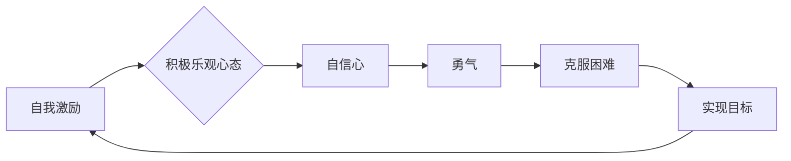

> 自我激励，积极乐观，心态，程序员，技术人员，压力，效率，幸福

## 1. 背景介绍

在当今科技飞速发展的时代，程序员和技术人员肩负着构建未来世界的重任。然而，这份工作也伴随着巨大的压力和挑战。长时间的代码编写、不断变化的技术环境、紧迫的项目deadline，都可能导致技术人员感到疲惫、焦虑、甚至失去动力。如何保持积极乐观的心态，持续保持自我激励，成为技术人员不断提升自我、实现职业成功的关键。

## 2. 核心概念与联系

**2.1 自我激励的本质**

自我激励是一种内在的驱动力，它源于个体对自身目标和价值观的追求。它不是外在的奖励或惩罚，而是来自内心深处的渴望和信念。

**2.2 积极乐观心态的构建**

积极乐观的心态是指对未来充满希望和信心，能够在面对挑战时保持冷静和乐观，并相信自己能够克服困难。它是一种思维方式，需要通过不断的练习和调整来培养。

**2.3 自我激励与积极乐观心态的联系**

自我激励和积极乐观心态相互促进，形成良性循环。积极乐观的心态能够增强个体的自信心和勇气，从而更有动力去追求目标，实现自我激励。而自我激励则能够帮助个体克服困难，保持积极乐观的心态。

**Mermaid 流程图**



## 3. 核心算法原理 & 具体操作步骤

**3.1 算法原理概述**

自我激励和积极乐观心态的构建并非一蹴而就，需要像算法一样，循序渐进地进行。我们可以将其分解为以下几个步骤：

**3.2 算法步骤详解**

1. **目标设定:** 明确自己的目标和价值观，并将其分解成可实现的小目标。
2. **计划制定:** 制定详细的计划，并设定合理的期限。
3. **行动执行:** 坚持执行计划，并不断调整策略。
4. **反馈机制:** 定期回顾自己的进展，并根据反馈进行调整。
5. **正向思维:** 培养积极乐观的心态，关注自己的优势和成就。
6. **情绪管理:** 学会控制自己的情绪，避免负面情绪影响工作和生活。
7. **自我关爱:** 保证充足的睡眠、健康饮食和适度的运动，照顾好自己的身心健康。

**3.3 算法优缺点**

* **优点:** 
    * 能够帮助个体提高效率和成就感。
    * 能够增强个体的自信心和勇气。
    * 能够帮助个体更好地应对压力和挑战。
* **缺点:** 
    * 需要持续的努力和坚持。
    * 需要不断调整和优化。
    * 并非适用于所有情况。

**3.4 算法应用领域**

* **个人成长:** 提升自我效能，实现个人目标。
* **职业发展:** 提高工作效率，获得职业成功。
* **团队合作:** 增强团队凝聚力，提高团队绩效。
* **生活平衡:** 更好地平衡工作和生活，提升生活质量。

## 4. 数学模型和公式 & 详细讲解 & 举例说明

**4.1 数学模型构建**

我们可以用一个简单的数学模型来描述自我激励和积极乐观心态之间的关系：

```latex
M = f(I, O)
```

其中：

* $M$ 代表个体的自我激励水平。
* $I$ 代表个体的内在驱动力，例如目标、价值观、信念等。
* $O$ 代表个体的外部环境，例如工作压力、社会支持等。

**4.2 公式推导过程**

这个模型表明，个体的自我激励水平取决于其内在驱动力和外部环境的相互作用。

* 当个体的内在驱动力强，外部环境支持时，自我激励水平较高。
* 当个体的内在驱动力弱，外部环境压力大时，自我激励水平较低。

**4.3 案例分析与讲解**

例如，一个程序员设定了明确的目标，并相信自己能够实现目标，这代表其内在驱动力强。如果工作环境良好，同事支持，这代表外部环境支持。在这种情况下，程序员的自我激励水平较高，更容易保持积极乐观的心态，并取得成功。

反之，如果程序员的目标不明确，缺乏自信，工作压力大，同事不支持，则其自我激励水平较低，更容易感到焦虑和沮丧。

## 5. 项目实践：代码实例和详细解释说明

**5.1 开发环境搭建**

为了更好地理解自我激励和积极乐观心态的构建，我们可以将其视为一个软件项目，并使用代码来实现。

**5.2 源代码详细实现**

```python
# 自我激励程序

def set_goal(goal):
  """设定目标"""
  print(f"目标已设定为：{goal}")

def plan_action(goal):
  """制定行动计划"""
  print(f"正在制定实现{goal}的行动计划...")

def execute_plan():
  """执行行动计划"""
  print("正在执行行动计划...")

def review_progress():
  """回顾进度"""
  print("正在回顾进度...")

def positive_thinking():
  """培养积极乐观的心态"""
  print("保持积极乐观的心态，相信自己能够成功！")

# 主程序
if __name__ == "__main__":
  goal = input("请输入你的目标：")
  set_goal(goal)
  plan_action(goal)
  execute_plan()
  review_progress()
  positive_thinking()
```

**5.3 代码解读与分析**

这段代码模拟了自我激励和积极乐观心态的构建过程。

* `set_goal()` 函数用于设定目标。
* `plan_action()` 函数用于制定行动计划。
* `execute_plan()` 函数用于执行行动计划。
* `review_progress()` 函数用于回顾进度。
* `positive_thinking()` 函数用于培养积极乐观的心态。

**5.4 运行结果展示**

当运行这段代码时，用户需要输入自己的目标，程序会根据输入的目标，模拟设定目标、制定行动计划、执行行动计划、回顾进度和培养积极乐观心态的过程。

## 6. 实际应用场景

**6.1 程序员的自我激励**

程序员经常面临着复杂的代码问题、紧迫的项目deadline和不断变化的技术环境。如何保持自我激励，才能持续保持高效率的工作状态。

* **设定明确的目标:** 明确自己的职业目标，并将其分解成可实现的小目标。
* **制定学习计划:** 制定学习新技术和技能的计划，并坚持执行。
* **积极参与开源项目:** 通过参与开源项目，可以学习到新的知识和技能，并获得成就感。
* **与同行交流:** 与其他程序员交流经验，互相学习，可以获得支持和鼓励。

**6.2 技术人员的积极乐观心态**

技术人员需要面对不断变化的技术环境和挑战。保持积极乐观的心态，才能更好地应对压力和挑战。

* **关注自己的优势:** 相信自己的能力，并专注于自己的优势领域。
* **保持学习的热情:** 对新技术保持好奇心，不断学习和探索。
* **学会控制情绪:** 当遇到困难时，不要轻易放弃，保持冷静和乐观。
* **享受工作带来的乐趣:** 找到工作中的乐趣，并从中获得满足感。

**6.4 未来应用展望**

随着人工智能技术的不断发展，自我激励和积极乐观心态的构建将更加智能化和个性化。未来，我们可以期待看到更多基于人工智能的工具和平台，帮助人们更好地管理自己的情绪，提升自我效能，实现个人目标。

## 7. 工具和资源推荐

**7.1 学习资源推荐**

* **书籍:**
    * 《高效能人士的七个习惯》
    * 《积极心理学》
    * 《思维导图》
* **网站:**
    * TED Talks
    * Coursera
    * Udemy

**7.2 开发工具推荐**

* **番茄工作法计时器:** 帮助集中注意力，提高工作效率。
* **思维导图软件:** 帮助整理思路，设定目标。
* **情绪管理APP:** 帮助监测和管理情绪。

**7.3 相关论文推荐**

* **Self-Motivation and Goal Setting: A Review of the Literature**
* **The Role of Positive Psychology in Enhancing Self-Efficacy**
* **The Impact of Mindfulness on Stress and Well-Being**

## 8. 总结：未来发展趋势与挑战

**8.1 研究成果总结**

通过对自我激励和积极乐观心态的研究，我们发现它们对个体成长、职业发展和生活质量都具有重要意义。

**8.2 未来发展趋势**

未来，自我激励和积极乐观心态的构建将更加智能化和个性化。人工智能技术将被应用于开发更精准、更有效的自我激励工具和平台。

**8.3 面临的挑战**

* 如何更好地理解个体差异，开发个性化的自我激励方案。
* 如何确保人工智能工具的安全性、可靠性和隐私性。
* 如何引导人们正确使用自我激励工具，避免过度依赖。

**8.4 研究展望**

未来，我们将继续深入研究自我激励和积极乐观心态的构建机制，开发更有效的工具和方法，帮助人们更好地管理自己的情绪，提升自我效能，实现个人目标。

## 9. 附录：常见问题与解答

**9.1 如何克服自我怀疑？**

自我怀疑是每个人都会遇到的问题，关键在于如何正确面对和克服它。可以尝试以下方法：

* **识别负面想法:** 当你感到自我怀疑时，先试着识别出具体的负面想法。
* **挑战负面想法:** 质疑这些负面想法的真实性，并用积极的证据来反驳它们。
* **专注于自己的优势:** 记住自己的优点和成就，并相信自己能够克服困难。

**9.2 如何保持积极乐观的心态？**

保持积极乐观的心态需要持续的练习和调整。可以尝试以下方法：

* **感恩练习:** 每天记录下三件让你感到感恩的事情。
* **正向自我暗示:** 经常对自己说一些积极的肯定句。
* **关注积极的方面:** 当遇到困难时，尽量关注积极的方面，并寻找解决问题的办法。


作者：禅与计算机程序设计艺术 / Zen and the Art of Computer Programming 
<end_of_turn>