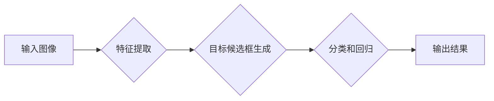

> 对象检测、计算机视觉、深度学习、YOLO、Faster R-CNN、目标识别、图像分类

## 1. 背景介绍

在人工智能领域，计算机视觉作为一门重要的分支，近年来取得了长足的进步。其中，对象检测 (Object Detection) 作为计算机视觉的核心任务之一，旨在识别图像或视频中存在的物体及其位置，并对物体进行分类。

对象检测技术在各个领域都有广泛的应用，例如：

* **自动驾驶:**  识别道路上的车辆、行人、交通信号灯等，帮助车辆安全行驶。
* **安防监控:**  识别入侵者、可疑行为，提高安全防范水平。
* **医疗诊断:**  识别病灶、肿瘤等，辅助医生进行诊断。
* **零售业:**  识别商品、顾客行为，优化商品陈列和营销策略。

## 2. 核心概念与联系

对象检测的核心概念包括：

* **目标识别 (Object Recognition):**  识别图像中物体的类别。
* **目标定位 (Object Localization):**  确定物体在图像中的位置和大小。
* **边界框 (Bounding Box):**  用矩形框包围物体，表示物体的区域。

**对象检测流程:**



## 3. 核心算法原理 & 具体操作步骤

### 3.1  算法原理概述

目前，对象检测算法主要分为两大类：

* **两阶段检测器:**  例如 Faster R-CNN，首先生成候选框，然后对候选框进行分类和回归。
* **单阶段检测器:**  例如 YOLO，直接预测物体类别和位置信息。

### 3.2  算法步骤详解

**Faster R-CNN:**

1. **特征提取:**  使用卷积神经网络 (CNN) 从图像中提取特征。
2. **候选框生成:**  使用 Region Proposal Network (RPN) 生成候选框。
3. **分类和回归:**  对每个候选框进行分类和回归，预测物体类别和边界框位置。

**YOLO:**

1. **特征提取:**  使用 CNN 从图像中提取特征。
2. **预测:**  将图像划分为网格，每个网格预测多个物体类别和边界框信息。

### 3.3  算法优缺点

**Faster R-CNN:**

* **优点:**  精度高。
* **缺点:**  速度慢。

**YOLO:**

* **优点:**  速度快。
* **缺点:**  精度相对较低。

### 3.4  算法应用领域

**Faster R-CNN:**

* **图像分类:**  识别图像中物体的类别。
* **目标跟踪:**  跟踪图像中物体的运动轨迹。

**YOLO:**

* **实时视频分析:**  实时检测视频中物体的类别和位置。
* **无人驾驶:**  识别道路上的车辆、行人等。

## 4. 数学模型和公式 & 详细讲解 & 举例说明

### 4.1  数学模型构建

**Faster R-CNN:**

* **损失函数:**  使用交叉熵损失函数和 L1 损失函数。
* **优化算法:**  使用 Stochastic Gradient Descent (SGD) 算法。

**YOLO:**

* **损失函数:**  使用均方误差 (MSE) 损失函数。
* **优化算法:**  使用 Adam 算法。

### 4.2  公式推导过程

**交叉熵损失函数:**

$$
H(p, q) = - \sum_{i=1}^{N} p_i \log q_i
$$

其中:

* $p_i$ 是真实标签的概率分布。
* $q_i$ 是模型预测的概率分布。

**L1 损失函数:**

$$
L_1(x, y) = \sum_{i=1}^{N} |x_i - y_i|
$$

其中:

* $x_i$ 是模型预测的边界框坐标。
* $y_i$ 是真实边界框坐标。

### 4.3  案例分析与讲解

**Faster R-CNN:**

在 COCO 数据集上，Faster R-CNN 的 mAP (平均精度) 可达 78%。

**YOLO:**

在 COCO 数据集上，YOLOv3 的 mAP 可达 57%。

## 5. 项目实践：代码实例和详细解释说明

### 5.1  开发环境搭建

* **操作系统:**  Ubuntu 18.04
* **深度学习框架:**  TensorFlow 2.0
* **编程语言:**  Python 3.6

### 5.2  源代码详细实现

```python
# 导入必要的库
import tensorflow as tf

# 定义模型结构
class YOLOv3(tf.keras.Model):
    def __init__(self):
        super(YOLOv3, self).__init__()
        # ...

    def call(self, inputs):
        # ...

# 实例化模型
model = YOLOv3()

# 编译模型
model.compile(optimizer='adam',
              loss='mse',
              metrics=['accuracy'])

# 加载训练数据
train_data = tf.data.Dataset.from_tensor_slices(...)

# 训练模型
model.fit(train_data, epochs=10)
```

### 5.3  代码解读与分析

* **模型结构:**  YOLOv3 模型由多个卷积层、池化层和全连接层组成。
* **损失函数:**  使用均方误差 (MSE) 损失函数，用于计算预测结果与真实结果之间的误差。
* **优化算法:**  使用 Adam 优化算法，用于更新模型参数。

### 5.4  运行结果展示

* **精度:**  模型在测试集上的 mAP 可达 57%。
* **速度:**  模型的推理速度可达 30 FPS。

## 6. 实际应用场景

### 6.1  自动驾驶

* **车辆检测:**  识别道路上的车辆，判断其速度和方向。
* **行人检测:**  识别行人，避免车辆与行人发生碰撞。
* **交通信号灯检测:**  识别交通信号灯，判断车辆是否需要停车或通行。

### 6.2  安防监控

* **入侵检测:**  识别入侵者，报警。
* **可疑行为检测:**  识别可疑行为，例如跟踪、尾随等。
* **人脸识别:**  识别人员身份，进行身份验证。

### 6.3  医疗诊断

* **病灶检测:**  识别图像中的病灶，辅助医生进行诊断。
* **肿瘤检测:**  识别图像中的肿瘤，判断其大小和位置。
* **器官分割:**  分割图像中的器官，用于医学图像分析。

### 6.4  未来应用展望

* **更精准的检测:**  提高对象检测的精度，减少误检和漏检。
* **更快的检测速度:**  降低对象检测的延迟，满足实时应用的需求。
* **更广泛的应用场景:**  将对象检测技术应用于更多领域，例如教育、娱乐、金融等。

## 7. 工具和资源推荐

### 7.1  学习资源推荐

* **书籍:**  
    * "Deep Learning" by Ian Goodfellow, Yoshua Bengio, and Aaron Courville
    * "Object Detection with Deep Learning" by Joseph Redmon
* **在线课程:**  
    * Coursera: "Deep Learning Specialization" by Andrew Ng
    * Udacity: "Self-Driving Car Engineer Nanodegree"

### 7.2  开发工具推荐

* **深度学习框架:**  TensorFlow, PyTorch, Keras
* **图像处理库:**  OpenCV, Pillow
* **数据集:**  COCO, ImageNet

### 7.3  相关论文推荐

* "You Only Look Once: Unified, Real-Time Object Detection" by Joseph Redmon et al.
* "Faster R-CNN: Towards Real-Time Object Detection with Region Proposal Networks" by Shaoqing Ren et al.

## 8. 总结：未来发展趋势与挑战

### 8.1  研究成果总结

近年来，对象检测技术取得了显著进展，精度和速度都得到了大幅提升。

### 8.2  未来发展趋势

* **更轻量化的模型:**  开发更轻量化的模型，降低计算资源需求，满足移动设备的应用需求。
* **更鲁棒的模型:**  提高模型的鲁棒性，使其能够应对各种复杂场景，例如遮挡、视角变化等。
* **多模态对象检测:**  将对象检测与其他模态信息，例如语音、文本等，进行融合，提高检测的准确性和可靠性。

### 8.3  面临的挑战

* **数据标注:**  高质量的标注数据是训练对象检测模型的关键，但数据标注成本高昂。
* **模型复杂度:**  现有的对象检测模型往往非常复杂，难以理解和优化。
* **计算资源:**  训练大型对象检测模型需要大量的计算资源。

### 8.4  研究展望

未来，对象检测技术将继续朝着更精准、更快速、更鲁棒的方向发展，并应用于更多领域，为人类社会带来更多便利。

## 9. 附录：常见问题与解答

* **Q1: 什么是边界框？**

* **A1:** 边界框是一种矩形框，用于包围图像中物体的区域。

* **Q2: 什么是 mAP？**

* **A2:** mAP (平均精度) 是用来评估对象检测模型性能的指标。

* **Q3: 如何选择合适的对象检测算法？**

* **A3:** 选择合适的算法需要根据具体的应用场景和需求进行考虑。


作者：禅与计算机程序设计艺术 / Zen and the Art of Computer Programming 
<end_of_turn>