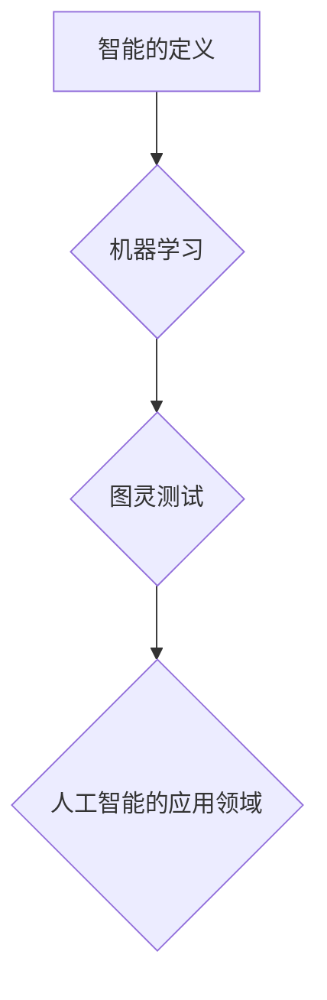

> 人工智能，达特茅斯会议，图灵测试，机器学习，深度学习，计算机科学，人工智能发展

## 1. 背景介绍

1956年，美国达特茅斯学院举办了一场具有里程碑意义的学术会议，被誉为人工智能（Artificial Intelligence，简称AI）的诞生地。这场会议汇集了当时世界各地的计算机科学家、数学家、逻辑学家和心理学家，共同探讨了如何让机器像人类一样思考和学习。

当时，计算机技术刚刚起步，人们对人工智能的理解还非常模糊。然而，会议上提出的许多概念和思想，至今仍然是人工智能研究的核心。

## 2. 核心概念与联系

达特茅斯会议上，人工智能的核心概念被明确提出，并形成了一个初步的理论框架。

**2.1  智能的定义**

会议上，人们试图对“智能”进行定义，并将其与机器学习联系起来。当时，人们普遍认为，智能是指能够理解语言、解决问题、学习新知识和做出决策的能力。

**2.2  机器学习**

机器学习是人工智能的一个重要分支，它旨在让机器能够从数据中学习，并根据学习到的知识进行预测或决策。达特茅斯会议上，一些学者提出了机器学习的早期概念，并开始探索如何让机器能够从经验中学习。

**2.3  图灵测试**

英国数学家艾伦·图灵提出了著名的“图灵测试”，用来评估机器是否具有智能。图灵测试的标准是：如果一个人通过与机器的文字对话，无法判断出机器是人还是机器，那么机器就能够被认为具有某种程度的智能。

**2.4  人工智能的应用领域**

达特茅斯会议上，人们还探讨了人工智能的潜在应用领域，包括：

* 自动化
* 医疗诊断
* 科学研究
* 游戏

**2.5  Mermaid 流程图**



## 3. 核心算法原理 & 具体操作步骤

### 3.1  算法原理概述

达特茅斯会议上，虽然没有提出具体的机器学习算法，但一些学者提出了启发性的思想，为后来的机器学习算法发展奠定了基础。例如，

* **符号主义方法:** 这种方法试图用符号和规则来模拟人类的思维过程。
* **连接主义方法:** 这种方法试图模拟大脑神经网络的结构和功能。

### 3.2  算法步骤详解

虽然达特茅斯会议上没有详细阐述具体的机器学习算法步骤，但我们可以根据后来的发展，推测当时的学者可能考虑过以下步骤：

1. **数据收集:** 收集大量相关数据，作为机器学习的训练素材。
2. **数据预处理:** 对收集到的数据进行清洗、转换和格式化，使其适合机器学习算法的处理。
3. **模型选择:** 选择合适的机器学习算法模型，根据任务需求和数据特点进行选择。
4. **模型训练:** 使用训练数据训练机器学习模型，使其能够学习数据中的规律和模式。
5. **模型评估:** 使用测试数据评估模型的性能，并根据评估结果进行模型调整和优化。
6. **模型部署:** 将训练好的模型部署到实际应用场景中，用于进行预测或决策。

### 3.3  算法优缺点

达特茅斯会议上提出的机器学习思想，虽然没有具体的算法，但其优缺点可以概括如下：

**优点:**

* **自动化:** 机器学习可以自动化许多任务，提高效率和准确性。
* **数据驱动:** 机器学习算法可以从数据中学习，不断改进和优化。
* **适应性强:** 机器学习算法可以适应不断变化的数据环境。

**缺点:**

* **数据依赖:** 机器学习算法需要大量数据进行训练，否则性能会下降。
* **解释性差:** 一些机器学习算法的决策过程难以解释，难以理解其背后的逻辑。
* **偏见问题:** 如果训练数据存在偏见，机器学习模型也会产生偏见。

### 3.4  算法应用领域

达特茅斯会议上提出的机器学习思想，为人工智能的广泛应用奠定了基础。

* **自然语言处理:** 机器翻译、语音识别、文本生成等。
* **计算机视觉:** 图像识别、物体检测、图像分类等。
* **推荐系统:** 产品推荐、内容推荐、个性化服务等。
* **医疗诊断:** 疾病预测、影像分析、药物研发等。

## 4. 数学模型和公式 & 详细讲解 & 举例说明

### 4.1  数学模型构建

机器学习算法通常基于数学模型进行构建，这些模型可以用来描述数据之间的关系，并进行预测或决策。

例如，线性回归模型可以用来预测连续变量的值，其数学模型如下：

$$y = mx + c$$

其中，y是预测值，x是输入变量，m是斜率，c是截距。

### 4.2  公式推导过程

机器学习算法的训练过程通常涉及到公式推导和优化过程。例如，线性回归模型的训练过程，需要通过最小化预测误差来确定模型参数m和c。

可以使用梯度下降算法来优化模型参数，其核心思想是不断调整参数，使其朝着最小化误差的方向移动。

### 4.3  案例分析与讲解

假设我们想要预测房屋价格，可以使用线性回归模型进行建模。

我们可以收集房屋面积、房间数量、地理位置等数据，作为输入变量，并将其与房屋价格作为输出变量进行训练。

通过训练模型，我们可以得到一个线性回归方程，用于预测新的房屋价格。

## 5. 项目实践：代码实例和详细解释说明

### 5.1  开发环境搭建

为了实现机器学习项目，需要搭建相应的开发环境。

常用的开发环境包括：

* Python语言环境
* 机器学习库（例如Scikit-learn、TensorFlow、PyTorch）
* 数据处理工具（例如Pandas、NumPy）

### 5.2  源代码详细实现

以下是一个使用Python语言和Scikit-learn库实现线性回归模型的代码示例：

```python
from sklearn.linear_model import LinearRegression
from sklearn.model_selection import train_test_split
import pandas as pd

# 加载数据
data = pd.read_csv('house_data.csv')

# 分割数据
X = data[['area', 'rooms']]
y = data['price']
X_train, X_test, y_train, y_test = train_test_split(X, y, test_size=0.2, random_state=42)

# 创建线性回归模型
model = LinearRegression()

# 训练模型
model.fit(X_train, y_train)

# 预测测试数据
y_pred = model.predict(X_test)

# 评估模型性能
from sklearn.metrics import mean_squared_error
mse = mean_squared_error(y_test, y_pred)
print(f'Mean Squared Error: {mse}')
```

### 5.3  代码解读与分析

这段代码首先加载了房屋数据，然后将数据分割为训练集和测试集。

接着，创建了一个线性回归模型，并使用训练集进行模型训练。

最后，使用测试集进行模型预测，并计算模型的性能指标，例如均方误差。

### 5.4  运行结果展示

运行这段代码后，会输出模型的均方误差值，该值越小，模型的预测性能越好。

## 6. 实际应用场景

### 6.1  医疗诊断

机器学习可以用于辅助医生进行疾病诊断，例如根据患者的症状、病史和检查结果，预测疾病的可能性。

### 6.2  金融风险评估

机器学习可以用于评估金融风险，例如预测客户的信用风险、欺诈风险等。

### 6.3  个性化推荐

机器学习可以用于提供个性化的产品推荐、内容推荐等服务，例如根据用户的浏览历史和购买记录，推荐相关的商品或内容。

### 6.4  未来应用展望

随着人工智能技术的不断发展，机器学习将在更多领域得到应用，例如：

* 自动驾驶
* 机器人
* 药物研发
* 教育

## 7. 工具和资源推荐

### 7.1  学习资源推荐

* **在线课程:** Coursera、edX、Udacity等平台提供丰富的机器学习课程。
* **书籍:** 《机器学习》 (周志华)、《深度学习》 (Ian Goodfellow) 等。
* **博客和网站:** Towards Data Science、Machine Learning Mastery 等。

### 7.2  开发工具推荐

* **Python:** 机器学习的常用编程语言。
* **Scikit-learn:** Python机器学习库。
* **TensorFlow:** 深度学习框架。
* **PyTorch:** 深度学习框架。

### 7.3  相关论文推荐

* **《AIMA: Artificial Intelligence: A Modern Approach》** (Stuart Russell, Peter Norvig)
* **《Deep Learning》** (Ian Goodfellow, Yoshua Bengio, Aaron Courville)
* **《The Master Algorithm》** (Pedro Domingos)

## 8. 总结：未来发展趋势与挑战

### 8.1  研究成果总结

达特茅斯会议开启了人工智能的时代，为人工智能的发展奠定了基础。

近年来，人工智能取得了长足的进步，特别是深度学习技术的突破，使得人工智能在各个领域得到了广泛应用。

### 8.2  未来发展趋势

未来，人工智能的发展趋势包括：

* **更强大的计算能力:** 更强大的计算能力将推动人工智能算法的复杂性和性能的提升。
* **更丰富的训练数据:** 更丰富的训练数据将使人工智能模型更加智能和准确。
* **更广泛的应用场景:** 人工智能将应用于更多领域，例如医疗、教育、金融等。

### 8.3  面临的挑战

人工智能的发展也面临着一些挑战，例如：

* **伦理问题:** 人工智能的应用可能会带来伦理问题，例如算法偏见、隐私泄露等。
* **安全问题:** 人工智能系统可能被恶意攻击，导致安全风险。
* **可解释性问题:** 一些人工智能算法的决策过程难以解释，难以理解其背后的逻辑。

### 8.4  研究展望

未来，人工智能研究需要关注以下几个方面：

* **解决伦理问题:** 确保人工智能的应用符合伦理道德规范。
* **提高安全性和可靠性:** 增强人工智能系统的安全性和可靠性，防止恶意攻击和意外事故。
* **提高可解释性:** 研究更可解释的人工智能算法，使其决策过程更加透明和可理解。

## 9. 附录：常见问题与解答

### 9.1  什么是人工智能？

人工智能是指让机器能够像人类一样思考和学习的能力。

### 9.2  机器学习是什么？

机器学习是人工智能的一个重要分支，它旨在让机器能够从数据中学习，并根据学习到的知识进行预测或决策。

### 9.3  达特茅斯会议对人工智能发展有何影响？

达特茅斯会议被誉为人工智能的诞生地，它为人工智能的发展奠定了基础，并促进了人工智能研究的蓬勃发展。

### 9.4  人工智能有哪些应用领域？

人工智能的应用领域非常广泛，包括医疗诊断、金融风险评估、个性化推荐、自动驾驶、机器人等。

### 9.5  人工智能的未来发展趋势是什么？

人工智能的未来发展趋势包括更强大的计算能力、更丰富的训练数据、更广泛的应用场景等。


作者：禅与计算机程序设计艺术 / Zen and the Art of Computer Programming 
<end_of_turn>