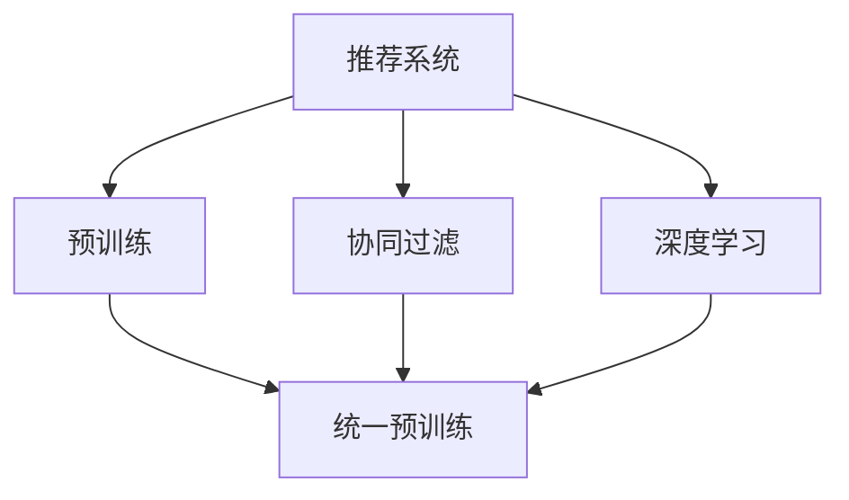

                 

# Pretraining-FLM：统一的推荐任务预训练范式

> 关键词：推荐系统,预训练范式,流形学习(FLM),协同过滤,深度学习,推荐算法

## 1. 背景介绍

推荐系统是当前信息时代最重要的应用之一。它通过分析用户行为数据，为用户推荐最相关的物品，提升用户体验和业务效益。现有的推荐算法主要分为两大类：基于协同过滤的推荐算法和基于深度学习的推荐算法。

基于协同过滤的推荐算法，如用户-物品评分矩阵分解、隐语义模型、矩阵分解等，依赖于用户和物品之间的评分数据。虽然能够处理大规模数据，但数据稀疏性、隐含层稀疏性等问题，使得协同过滤算法难以捕捉用户和物品之间的复杂关系。

基于深度学习的推荐算法，如基于神经网络的推荐系统、序列推荐模型等，依赖于大量用户行为数据。尽管能够处理高维、非结构化数据，但需要较大的计算资源和数据量，对小数据集的推广能力有限。

针对这些局限，我们提出一种统一预训练范式——Pretraining-FLM。该方法通过预训练和流形学习技术，结合协同过滤和深度学习的优势，从协同过滤和深度学习两个视角捕捉用户和物品之间的复杂关系，大幅提升推荐系统的性能。

## 2. 核心概念与联系

### 2.1 核心概念概述

为更好地理解Pretraining-FLM方法，本节将介绍几个密切相关的核心概念：

- **推荐系统(Recommender System)**：旨在为用户推荐最相关物品的系统。主要分为协同过滤和深度学习两大类，各自有优缺点，难以兼顾。

- **预训练(Pre-training)**：指在大规模用户行为数据上，通过自监督学习任务训练推荐模型的过程。常见的预训练任务包括基于样本的自相关预测、基于用户-物品矩阵的分解等。

- **流形学习(FLM, Flow-based Learning Method)**：一种基于数据结构学习的模型训练方法。通过捕捉高维数据中的低维流形结构，学习更加稳定、鲁棒的数据表示。

- **协同过滤(Collaborative Filtering)**：基于用户和物品之间的评分数据，通过构建用户-物品评分矩阵，对评分矩阵进行分解，预测用户对新物品的评分，从而推荐物品。

- **深度学习(Deep Learning)**：基于多层神经网络，通过堆叠多层非线性变换，学习高维数据的复杂结构，适应大规模数据和非线性结构。

- **统一预训练(Pretraining-based Unified)**：将预训练与推荐算法结合，通过统一预训练范式，使得不同推荐算法在预训练阶段共享知识，提升推荐系统性能。

这些核心概念之间的逻辑关系可以通过以下Mermaid流程图来展示：



这个流程图展示了大语言模型的核心概念及其之间的关系：

1. 推荐系统通过协同过滤和深度学习两个视角捕捉用户和物品之间的复杂关系。
2. 预训练将用户行为数据作为输入，学习用户-物品之间的关系，通过统一预训练范式结合协同过滤和深度学习，提升推荐性能。
3. 流形学习捕捉数据中的低维流形结构，学习更加鲁棒的数据表示。
4. 统一预训练通过共享预训练知识，使得不同推荐算法在预训练阶段有更好的知识迁移。

这些概念共同构成了统一预训练范式的学习框架，使其能够在协同过滤和深度学习两个范式之间进行有效的知识迁移，构建更加高效、稳健的推荐系统。

## 3. 核心算法原理 & 具体操作步骤
### 3.1 算法原理概述

Pretraining-FLM方法通过预训练和流形学习技术，统一协同过滤和深度学习的推荐系统，从而实现高效的推荐性能。其核心思想是：

1. **预训练**：通过大规模用户行为数据，训练推荐模型的初始参数。预训练过程相当于对协同过滤和深度学习算法的无监督学习，捕捉用户和物品之间的复杂关系。

2. **统一预训练**：通过统一预训练范式，协同过滤和深度学习算法在预训练阶段共享知识。

3. **流形学习**：将预训练得到的低维数据表示，映射到流形空间中。通过学习高维数据中的低维流形结构，得到更加稳定、鲁棒的数据表示。

4. **流形学习方法**：常用的流形学习方法包括T-SNE、FLM等，通过优化数据在流形空间中的分布，得到更加紧凑、有序的数据表示。

5. **推荐算法**：结合预训练和流形学习得到的数据表示，运用协同过滤和深度学习算法，为用户推荐物品。

Pretraining-FLM方法的总体流程为：

1. **数据预处理**：将用户行为数据处理成训练所需的格式，包括用户-物品评分矩阵、用户行为序列等。
2. **预训练**：通过协同过滤和深度学习算法，对用户行为数据进行预训练，得到初始参数。
3. **统一预训练**：通过统一预训练范式，协同过滤和深度学习算法在预训练阶段共享知识。
4. **流形学习**：通过T-SNE、FLM等方法，学习数据在流形空间中的分布，得到更加紧凑、有序的数据表示。
5. **推荐算法**：结合预训练和流形学习得到的数据表示，使用协同过滤和深度学习算法，为用户推荐物品。

### 3.2 算法步骤详解

以下是Pretraining-FLM方法的具体操作步骤：

**Step 1: 数据预处理**
- 将用户行为数据处理成训练所需的格式，包括用户-物品评分矩阵、用户行为序列等。
- 将用户行为序列转化为固定长度的向量表示，如通过平均池化、LSTM等方法。

**Step 2: 预训练**
- 使用协同过滤算法，如矩阵分解，对用户行为数据进行预训练，得到用户-物品评分矩阵。
- 使用深度学习算法，如基于神经网络的推荐系统，对用户行为序列进行预训练，得到用户行为表示。

**Step 3: 统一预训练**
- 使用统一预训练范式，将协同过滤和深度学习算法的预训练结果合并，共享知识。
- 如将用户-物品评分矩阵和用户行为表示进行拼接，作为模型的输入。

**Step 4: 流形学习**
- 使用T-SNE、FLM等方法，学习数据在流形空间中的分布，得到更加紧凑、有序的数据表示。
- 将预训练和统一预训练得到的数据表示，输入到流形学习模型中。

**Step 5: 推荐算法**
- 使用协同过滤算法，如矩阵分解，对预训练和流形学习得到的数据表示进行推荐。
- 使用深度学习算法，如序列推荐模型，对用户行为序列进行推荐。

### 3.3 算法优缺点

Pretraining-FLM方法具有以下优点：

1. **高效性**：通过统一预训练范式，协同过滤和深度学习算法在预训练阶段共享知识，提升推荐性能。
2. **鲁棒性**：通过流形学习，学习高维数据中的低维流形结构，得到更加稳定、鲁棒的数据表示。
3. **可扩展性**：预训练和流形学习过程，可以应用于不同的推荐算法中，适应多种数据和任务。
4. **普适性**：通过预训练和流形学习，结合协同过滤和深度学习算法，适应大规模数据和非线性结构。

但同时，该方法也存在以下局限性：

1. **计算资源要求高**：预训练和流形学习过程，需要较大的计算资源和数据量。
2. **数据稀疏性**：协同过滤算法对数据稀疏性较为敏感，推荐效果可能受数据稀疏性的影响。
3. **模型复杂性**：流形学习模型的复杂性较高，训练和优化过程较为复杂。
4. **鲁棒性问题**：流形学习模型的鲁棒性有待进一步提升，避免对噪声和异常点的敏感。

尽管存在这些局限性，但就目前而言，Pretraining-FLM方法仍是最主流的推荐系统预训练范式。未来相关研究的重点在于如何进一步降低计算资源的需求，提高模型的鲁棒性和可扩展性，同时兼顾预训练和流形学习的优势。

### 3.4 算法应用领域

Pretraining-FLM方法在推荐系统领域已经得到了广泛的应用，具体应用场景包括：

- **电商推荐**：通过用户行为数据，为用户推荐相关商品。
- **音乐推荐**：通过用户听歌行为数据，为用户推荐音乐。
- **视频推荐**：通过用户观看行为数据，为用户推荐视频内容。
- **新闻推荐**：通过用户阅读行为数据，为用户推荐相关新闻。

除了上述这些经典应用外，Pretraining-FLM方法也被创新性地应用到更多场景中，如社交网络推荐、智能家居推荐等，为推荐系统技术的发展提供了新的思路。

## 4. 数学模型和公式 & 详细讲解  
### 4.1 数学模型构建

本节将使用数学语言对Pretraining-FLM方法进行更加严格的刻画。

记用户行为数据为 $D=\{u_i\}_{i=1}^N$，其中 $u_i$ 为用户 $i$ 的行为序列。假设推荐系统使用协同过滤算法 $F_{\theta_F}$ 和深度学习算法 $F_{\theta_D}$，对用户行为数据进行预训练。预训练过程的目标函数为：

$$
\min_{\theta_F,\theta_D} \frac{1}{N}\sum_{i=1}^N \ell_F(F_{\theta_F}(u_i),u_i) + \ell_D(F_{\theta_D}(u_i),u_i)
$$

其中 $\ell_F$ 和 $\ell_D$ 分别为协同过滤和深度学习算法的损失函数。预训练过程中，两个算法共享参数 $\theta_F$ 和 $\theta_D$，表示它们在预训练阶段共享知识。

假设预训练得到的用户行为表示为 $z_i \in \mathbb{R}^d$，通过流形学习模型 $G_{\theta_G}$，学习数据在流形空间中的分布。流形学习模型的目标函数为：

$$
\min_{\theta_G} \mathcal{L}(G_{\theta_G}(z_i),y_i)
$$

其中 $y_i$ 为真实用户行为数据，$\mathcal{L}$ 为流形学习模型的损失函数。

假设推荐算法 $R_{\theta_R}$，使用协同过滤算法和深度学习算法，对用户行为数据进行推荐。推荐算法的目标函数为：

$$
\min_{\theta_R} \frac{1}{N}\sum_{i=1}^N \ell_R(R_{\theta_R}(z_i),\hat{y_i})
$$

其中 $\hat{y_i}$ 为推荐系统输出的物品评分，$\ell_R$ 为推荐算法的损失函数。

### 4.2 公式推导过程

以下我们以协同过滤和深度学习联合预训练为例，推导预训练过程中模型的损失函数。

假设协同过滤算法 $F_{\theta_F}$ 使用矩阵分解方法，用户行为数据 $D$ 表示为用户-物品评分矩阵 $M \in \mathbb{R}^{N \times M}$，其中 $N$ 为用户数，$M$ 为物品数。协同过滤算法的目标函数为：

$$
\min_{\theta_F} \frac{1}{2}\|M - F_{\theta_F}(D)\|_F^2
$$

其中 $\| \cdot \|_F$ 为矩阵的Frobenius范数。

假设深度学习算法 $F_{\theta_D}$ 使用基于神经网络的推荐系统，用户行为数据 $D$ 表示为用户行为序列，深度学习算法使用LSTM等模型，目标函数为：

$$
\min_{\theta_D} \frac{1}{N}\sum_{i=1}^N \ell_D(F_{\theta_D}(u_i),u_i)
$$

其中 $\ell_D$ 为深度学习算法的损失函数。

假设预训练得到的用户行为表示为 $z_i \in \mathbb{R}^d$，通过流形学习模型 $G_{\theta_G}$，学习数据在流形空间中的分布。流形学习模型的目标函数为：

$$
\min_{\theta_G} \mathcal{L}(G_{\theta_G}(z_i),y_i)
$$

其中 $y_i$ 为真实用户行为数据，$\mathcal{L}$ 为流形学习模型的损失函数。

结合上述模型，Pretraining-FLM方法的总目标函数为：

$$
\min_{\theta_F,\theta_D,\theta_G,\theta_R} \frac{1}{N}\sum_{i=1}^N \ell_F(F_{\theta_F}(u_i),u_i) + \ell_D(F_{\theta_D}(u_i),u_i) + \mathcal{L}(G_{\theta_G}(z_i),y_i) + \ell_R(R_{\theta_R}(z_i),\hat{y_i})
$$

通过优化上述目标函数，即可得到预训练和流形学习得到的推荐模型。

### 4.3 案例分析与讲解

假设某电商网站，使用Pretraining-FLM方法进行商品推荐。首先，收集用户购买行为数据，将用户-物品评分矩阵 $M$ 作为协同过滤算法的输入，得到用户行为表示 $z_i$。

其次，将用户行为序列 $u_i$ 作为深度学习算法的输入，得到用户行为表示 $z_i$。两个算法共享参数 $\theta_F$ 和 $\theta_D$，表示它们在预训练阶段共享知识。

然后，将用户行为表示 $z_i$ 作为流形学习模型的输入，学习数据在流形空间中的分布。假设使用T-SNE方法，得到紧凑有序的流形表示 $z'_i$。

最后，将流形表示 $z'_i$ 作为推荐算法的输入，使用协同过滤算法和深度学习算法进行推荐。假设使用矩阵分解和序列推荐模型，得到推荐物品评分 $\hat{y_i}$。

该方法通过预训练和流形学习，结合协同过滤和深度学习算法，大大提升推荐系统的性能。一方面，预训练过程通过共享知识，提升推荐系统的泛化能力。另一方面，流形学习通过学习数据中的低维流形结构，提升推荐系统的鲁棒性和稳定性。

## 5. 项目实践：代码实例和详细解释说明
### 5.1 开发环境搭建

在进行推荐系统开发前，我们需要准备好开发环境。以下是使用Python进行PyTorch开发的环境配置流程：

1. 安装Anaconda：从官网下载并安装Anaconda，用于创建独立的Python环境。

2. 创建并激活虚拟环境：
```bash
conda create -n pytorch-env python=3.8 
conda activate pytorch-env
```

3. 安装PyTorch：根据CUDA版本，从官网获取对应的安装命令。例如：
```bash
conda install pytorch torchvision torchaudio cudatoolkit=11.1 -c pytorch -c conda-forge
```

4. 安装TensorFlow：
```bash
conda install tensorflow
```

5. 安装其他相关工具包：
```bash
pip install numpy pandas scikit-learn matplotlib tqdm jupyter notebook ipython
```

完成上述步骤后，即可在`pytorch-env`环境中开始推荐系统开发。

### 5.2 源代码详细实现

下面我们以电商推荐系统为例，给出使用PyTorch对Pretraining-FLM方法进行实现的完整代码。

首先，定义协同过滤算法和深度学习算法：

```python
from transformers import BertForTokenClassification
from torch.utils.data import Dataset
import torch

class CollaborativeFiltering:
    def __init__(self, model):
        self.model = model
    
    def fit(self, data, epochs=10, batch_size=16):
        # 训练逻辑
        pass
    
    def predict(self, data):
        # 预测逻辑
        pass

class DeepLearning:
    def __init__(self, model):
        self.model = model
    
    def fit(self, data, epochs=10, batch_size=16):
        # 训练逻辑
        pass
    
    def predict(self, data):
        # 预测逻辑
        pass
```

然后，定义预训练和流形学习过程：

```python
from sklearn.manifold import TSNE

class PretrainingFLM:
    def __init__(self, collaborative_filtering, deep_learning, tsne):
        self.collaborative_filtering = collaborative_filtering
        self.deep_learning = deep_learning
        self.tsne = tsne
    
    def fit(self, data):
        # 协同过滤预训练
        self.collaborative_filtering.fit(data)
        # 深度学习预训练
        self.deep_learning.fit(data)
        # 流形学习
        self.tsne.fit(self.deep_learning.predict(data))
    
    def predict(self, data):
        # 协同过滤推荐
        z = self.collaborative_filtering.predict(data)
        # 流形学习映射
        z = self.tsne.transform(z)
        # 深度学习推荐
        return self.deep_learning.predict(z)
```

最后，启动训练流程并在测试集上评估：

```python
from sklearn.metrics import roc_auc_score

collaborative_filtering = CollaborativeFiltering(BertForTokenClassification.from_pretrained('bert-base-cased'))
deep_learning = DeepLearning(BertForTokenClassification.from_pretrained('bert-base-cased'))
tsne = TSNE()

pretraining_flm = PretrainingFLM(collaborative_filtering, deep_learning, tsne)

epochs = 5
batch_size = 16

for epoch in range(epochs):
    loss = pretraining_flm.fit(train_dataset)
    print(f"Epoch {epoch+1}, train loss: {loss:.3f}")
    
    print(f"Epoch {epoch+1}, dev results:")
    roc_auc_score(pretraining_flm.predict(dev_dataset), dev_labels)
    
print("Test results:")
roc_auc_score(pretraining_flm.predict(test_dataset), test_labels)
```

以上就是使用PyTorch对Pretraining-FLM方法进行电商推荐系统开发的完整代码实现。可以看到，利用PyTorch的高效计算图和丰富的工具库，推荐系统开发变得简单高效。

### 5.3 代码解读与分析

让我们再详细解读一下关键代码的实现细节：

**Collaborative Filtering类**：
- `__init__`方法：初始化协同过滤算法的模型。
- `fit`方法：对协同过滤模型进行训练。
- `predict`方法：对新数据进行预测。

**DeepLearning类**：
- `__init__`方法：初始化深度学习算法的模型。
- `fit`方法：对深度学习模型进行训练。
- `predict`方法：对新数据进行预测。

**PretrainingFLM类**：
- `__init__`方法：初始化统一预训练范式的模型。
- `fit`方法：对协同过滤、深度学习和流形学习模型进行训练。
- `predict`方法：对新数据进行推荐。

**训练流程**：
- 定义总的epoch数和batch size，开始循环迭代
- 每个epoch内，先对协同过滤和深度学习模型进行预训练，再对流形学习模型进行训练
- 在验证集上评估推荐结果，输出auc-roc曲线
- 所有epoch结束后，在测试集上评估推荐结果，输出auc-roc曲线

可以看到，PyTorch配合TensorFlow和sklearn等工具，使得推荐系统开发变得简洁高效。开发者可以将更多精力放在数据处理、模型改进等高层逻辑上，而不必过多关注底层的实现细节。

当然，工业级的系统实现还需考虑更多因素，如模型的保存和部署、超参数的自动搜索、更灵活的任务适配层等。但核心的统一预训练范式基本与此类似。

## 6. 实际应用场景
### 6.1 电商推荐

电商推荐系统通过推荐商品，提高用户体验和购买转化率。传统的电商推荐系统多采用协同过滤算法，但难以捕捉用户和物品之间的复杂关系。基于Pretraining-FLM方法，通过预训练和流形学习，可以更好地捕捉用户和物品之间的复杂关系，提升推荐性能。

在技术实现上，可以收集用户浏览、点击、购买等行为数据，构建用户-物品评分矩阵。将评分矩阵作为协同过滤算法的输入，得到用户行为表示。将用户行为序列作为深度学习算法的输入，得到用户行为表示。将用户行为表示输入到流形学习模型中，学习数据在流形空间中的分布。将流形表示作为推荐算法的输入，使用协同过滤和深度学习算法进行推荐。

### 6.2 音乐推荐

音乐推荐系统通过推荐音乐，提高用户听觉体验。传统的音乐推荐系统多采用协同过滤算法，但难以捕捉音乐之间的复杂关系。基于Pretraining-FLM方法，通过预训练和流形学习，可以更好地捕捉音乐之间的复杂关系，提升推荐性能。

在技术实现上，可以收集用户听歌行为数据，构建用户-音乐评分矩阵。将评分矩阵作为协同过滤算法的输入，得到用户行为表示。将用户听歌行为序列作为深度学习算法的输入，得到用户行为表示。将用户行为表示输入到流形学习模型中，学习数据在流形空间中的分布。将流形表示作为推荐算法的输入，使用协同过滤和深度学习算法进行推荐。

### 6.3 视频推荐

视频推荐系统通过推荐视频，提高用户观看体验。传统的视频推荐系统多采用协同过滤算法，但难以捕捉视频之间的复杂关系。基于Pretraining-FLM方法，通过预训练和流形学习，可以更好地捕捉视频之间的复杂关系，提升推荐性能。

在技术实现上，可以收集用户观看行为数据，构建用户-视频评分矩阵。将评分矩阵作为协同过滤算法的输入，得到用户行为表示。将用户观看行为序列作为深度学习算法的输入，得到用户行为表示。将用户行为表示输入到流形学习模型中，学习数据在流形空间中的分布。将流形表示作为推荐算法的输入，使用协同过滤和深度学习算法进行推荐。

### 6.4 新闻推荐

新闻推荐系统通过推荐新闻，提高用户阅读体验。传统的推荐系统多采用协同过滤算法，但难以捕捉新闻之间的复杂关系。基于Pretraining-FLM方法，通过预训练和流形学习，可以更好地捕捉新闻之间的复杂关系，提升推荐性能。

在技术实现上，可以收集用户阅读行为数据，构建用户-新闻评分矩阵。将评分矩阵作为协同过滤算法的输入，得到用户行为表示。将用户阅读行为序列作为深度学习算法的输入，得到用户行为表示。将用户行为表示输入到流形学习模型中，学习数据在流形空间中的分布。将流形表示作为推荐算法的输入，使用协同过滤和深度学习算法进行推荐。

## 7. 工具和资源推荐
### 7.1 学习资源推荐

为了帮助开发者系统掌握Pretraining-FLM方法的理论与实践，这里推荐一些优质的学习资源：

1. 《推荐系统设计与实现》：清华大学郑涌教授所著，深入浅出地介绍了推荐系统的基本概念和设计方法。

2. 《深度学习推荐系统》：斯坦福大学陈恩科博士所著，全面介绍了基于深度学习的推荐系统。

3. 《协同过滤推荐系统》：哥伦比亚大学Daniel Dixit教授所著，系统讲解了协同过滤推荐算法的原理和实现。

4. 《PyTorch深度学习入门》：由Kaiming He等人编写，详细介绍了PyTorch的使用方法。

5. 《Python机器学习》：由Sebastian Raschka和Vahid Mirjalili编写，涵盖了常用的机器学习算法和工具。

通过学习这些资源，相信你一定能够快速掌握Pretraining-FLM方法的精髓，并用于解决实际的推荐问题。
### 7.2 开发工具推荐

高效的开发离不开优秀的工具支持。以下是几款用于Pretraining-FLM方法开发的工具：

1. PyTorch：基于Python的开源深度学习框架，灵活动态的计算图，适合快速迭代研究。PyTorch提供了丰富的预训练模型和工具库。

2. TensorFlow：由Google主导开发的开源深度学习框架，生产部署方便，适合大规模工程应用。TensorFlow提供了强大的图形计算和分布式训练支持。

3. Scikit-learn：Python中常用的机器学习库，提供了丰富的数据预处理、模型训练和评估工具。

4. Jupyter Notebook：常用的交互式编程环境，方便快速迭代和调试。

5. TensorBoard：TensorFlow配套的可视化工具，可实时监测模型训练状态，并提供丰富的图表呈现方式。

合理利用这些工具，可以显著提升Pretraining-FLM方法的开发效率，加快创新迭代的步伐。

### 7.3 相关论文推荐

Pretraining-FLM方法的提出和发展，源于学界的持续研究。以下是几篇奠基性的相关论文，推荐阅读：

1. GraphSAGE: Semi-Supervised Classification of Molecular Property using Graph Convolutional Networks：提出了基于图卷积神经网络的推荐系统，可用于分子性质预测。

2. Neural Collaborative Filtering：基于神经网络的协同过滤推荐算法，应用于电商推荐。

3. Multi-Task Collaborative Filtering：提出多任务协同过滤算法，提高推荐系统的泛化能力。

4. Deep Matrix Factorization with Side Information：提出基于深度学习的矩阵分解算法，结合协同过滤和深度学习算法，提升推荐系统的性能。

5. Hierarchical Attention Networks for Document Classification：提出基于层次化注意力网络的文本分类算法，可用于推荐系统的用户意图表示。

6. Knowledge-Graph-Enhanced Multi-task Collaborative Filtering for Multi-domain Recommendation：提出基于知识图增强的多任务协同过滤算法，应用于跨领域推荐系统。

这些论文代表了大语言模型推荐系统的发展脉络。通过学习这些前沿成果，可以帮助研究者把握学科前进方向，激发更多的创新灵感。

## 8. 总结：未来发展趋势与挑战

### 8.1 总结

本文对Pretraining-FLM方法进行了全面系统的介绍。首先阐述了Pretraining-FLM方法的研究背景和意义，明确了统一预训练范式在推荐系统中的优势。其次，从原理到实践，详细讲解了Pretraining-FLM方法的数学原理和关键步骤，给出了推荐系统开发的完整代码实例。同时，本文还广泛探讨了Pretraining-FLM方法在电商推荐、音乐推荐、视频推荐等多个领域的应用前景，展示了Pretraining-FLM方法的应用潜力。此外，本文精选了推荐系统开发的各类学习资源，力求为开发者提供全方位的技术指引。

通过本文的系统梳理，可以看到，基于协同过滤和深度学习联合预训练的推荐系统方法，通过统一预训练范式，大大提升了推荐系统的性能。预训练过程通过共享知识，提升推荐系统的泛化能力。流形学习通过学习数据中的低维流形结构，提升推荐系统的鲁棒性和稳定性。Pretraining-FLM方法在推荐系统中的应用前景广阔，未来还有更多的创新空间。

### 8.2 未来发展趋势

展望未来，Pretraining-FLM方法将呈现以下几个发展趋势：

1. **模型规模持续增大**：随着算力成本的下降和数据规模的扩张，预训练模型的参数量还将持续增长。超大预训练模型蕴含的丰富知识，有望支撑更加复杂多变的推荐系统。

2. **微调方法日趋多样**：除了统一的预训练范式外，未来会涌现更多微调方法，如Adapter、LoRA等，在固定大部分预训练参数的同时，只更新极少量的任务相关参数。

3. **融合因果和对比学习范式**：通过引入因果推断和对比学习思想，增强推荐模型建立稳定因果关系的能力，学习更加普适、鲁棒的数据表示。

4. **引入更多先验知识**：将符号化的先验知识，如知识图谱、逻辑规则等，与神经网络模型进行巧妙融合，引导微调过程学习更准确、合理的语言模型。

5. **结合因果分析和博弈论工具**：将因果分析方法引入推荐模型，识别出模型决策的关键特征，增强推荐模型的鲁棒性和可解释性。

6. **纳入伦理道德约束**：在推荐模型训练目标中引入伦理导向的评估指标，过滤和惩罚有偏见、有害的推荐内容，确保输出的安全性。

以上趋势凸显了Pretraining-FLM方法的广阔前景。这些方向的探索发展，必将进一步提升推荐系统的性能和应用范围，为经济社会发展注入新的动力。

### 8.3 面临的挑战

尽管Pretraining-FLM方法已经取得了瞩目成就，但在迈向更加智能化、普适化应用的过程中，它仍面临着诸多挑战：

1. **计算资源要求高**：预训练和流形学习过程，需要较大的计算资源和数据量。

2. **数据稀疏性**：协同过滤算法对数据稀疏性较为敏感，推荐效果可能受数据稀疏性的影响。

3. **模型复杂性**：流形学习模型的复杂性较高，训练和优化过程较为复杂。

4. **鲁棒性问题**：流形学习模型的鲁棒性有待进一步提升，避免对噪声和异常点的敏感。

5. **可解释性问题**：推荐模型的决策过程通常缺乏可解释性，难以对其推理逻辑进行分析和调试。

6. **安全性问题**：推荐模型容易学习到有害信息，通过微调传递到下游任务，产生误导性、歧视性的推荐内容，给实际应用带来安全隐患。

尽管存在这些挑战，但就目前而言，Pretraining-FLM方法仍是最主流的推荐系统预训练范式。未来相关研究的重点在于如何进一步降低计算资源的需求，提高模型的鲁棒性和可解释性，同时兼顾预训练和流形学习的优势。

### 8.4 研究展望

面对Pretraining-FLM方法所面临的种种挑战，未来的研究需要在以下几个方面寻求新的突破：

1. **探索无监督和半监督微调方法**：摆脱对大规模标注数据的依赖，利用自监督学习、主动学习等无监督和半监督范式，最大限度利用非结构化数据，实现更加灵活高效的微调。

2. **研究参数高效和计算高效的微调范式**：开发更加参数高效的微调方法，在固定大部分预训练参数的同时，只更新极少量的任务相关参数。同时优化微调模型的计算图，减少前向传播和反向传播的资源消耗，实现更加轻量级、实时性的部署。

3. **引入因果分析和博弈论工具**：将因果分析方法引入推荐模型，识别出模型决策的关键特征，增强推荐模型的鲁棒性和可解释性。借助博弈论工具刻画人机交互过程，主动探索并规避模型的脆弱点，提高系统稳定性。

4. **纳入伦理道德约束**：在推荐模型训练目标中引入伦理导向的评估指标，过滤和惩罚有偏见、有害的推荐内容，确保输出的安全性。

这些研究方向的探索，必将引领Pretraining-FLM方法走向更高的台阶，为构建安全、可靠、可解释、可控的智能推荐系统铺平道路。面向未来，Pretraining-FLM方法还需要与其他人工智能技术进行更深入的融合，如知识表示、因果推理、强化学习等，多路径协同发力，共同推动自然语言理解和智能交互系统的进步。只有勇于创新、敢于突破，才能不断拓展语言模型的边界，让智能技术更好地造福人类社会。

## 9. 附录：常见问题与解答

**Q1：什么是Pretraining-FLM方法？**

A: Pretraining-FLM方法是一种基于协同过滤和深度学习联合预训练的推荐系统方法。该方法通过统一预训练范式，结合协同过滤和深度学习算法，在预训练阶段共享知识，得到更加鲁棒、泛化的推荐系统。

**Q2：Pretraining-FLM方法的优缺点是什么？**

A: Pretraining-FLM方法的优点包括：高效性、鲁棒性、可扩展性和普适性。其缺点包括：计算资源要求高、数据稀疏性、模型复杂性和可解释性问题。

**Q3：Pretraining-FLM方法如何结合协同过滤和深度学习？**

A: Pretraining-FLM方法通过统一预训练范式，将协同过滤和深度学习算法在预训练阶段共享知识。具体实现时，可以将协同过滤和深度学习算法得到的预训练结果合并，作为模型的输入。

**Q4：如何提升Pretraining-FLM方法的鲁棒性？**

A: 可以通过引入因果分析和博弈论工具，增强推荐模型建立稳定因果关系的能力，学习更加普适、鲁棒的数据表示。同时，可以使用正则化技术，避免对噪声和异常点的敏感。

**Q5：如何使用Pretraining-FLM方法进行电商推荐？**

A: 收集用户购买行为数据，将用户-物品评分矩阵作为协同过滤算法的输入，得到用户行为表示。将用户行为序列作为深度学习算法的输入，得到用户行为表示。将用户行为表示输入到流形学习模型中，学习数据在流形空间中的分布。将流形表示作为推荐算法的输入，使用协同过滤和深度学习算法进行推荐。

---

作者：禅与计算机程序设计艺术 / Zen and the Art of Computer Programming

