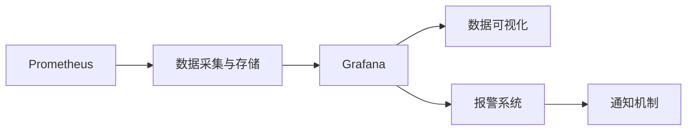

                 

# Prometheus+Grafana监控系统搭建

> 关键词：Prometheus, Grafana, 监控系统, 报警, 仪表盘, 数据可视化

## 1. 背景介绍

在现代企业的IT运维中，监控系统扮演着至关重要的角色。它不仅能够及时发现系统问题，预防潜在风险，还能为决策提供实时的数据支持。本文将介绍一种高效、灵活的监控系统搭建方案，使用Prometheus和Grafana，以帮助IT团队更好地监控和管理其IT基础设施。

## 2. 核心概念与联系

### 2.1 核心概念概述

为了更好地理解Prometheus+Grafana监控系统的构建原理和应用场景，我们先介绍几个关键概念：

- **Prometheus**：一种开源的、高性能的系统监控工具，支持对各种数据源进行数据收集和存储。
- **Grafana**：一个流行的开源开源数据可视化平台，可以与Prometheus等数据源无缝集成，实现实时数据可视化。
- **报警**：监控系统中的一种机制，当系统检测到异常时，立即通过邮件、短信等方式通知相关人员，以便及时处理。
- **仪表盘**：Grafana中的可视化工具，可以快速展示和分析监控数据，帮助IT团队更好地理解系统运行状态。
- **数据可视化**：将监控数据通过图表、曲线、地图等形式呈现，帮助决策者更直观地理解系统状态和趋势。

这些核心概念构成了Prometheus+Grafana监控系统的基础，通过它们的协同工作，我们可以实现全面、高效的IT监控和分析。

### 2.2 核心概念原理和架构的 Mermaid 流程图



这个流程图展示了Prometheus和Grafana之间的数据流动关系。Prometheus负责从各个数据源中收集数据，并将其存储在本地或远程的存储系统中；Grafana则通过API从Prometheus获取数据，并在仪表盘中展示。当系统检测到异常时，报警系统将触发，并通过各种通知机制告知相关人员。

## 3. 核心算法原理 & 具体操作步骤

### 3.1 算法原理概述

Prometheus+Grafana监控系统的核心算法原理可以简要概述为：

1. **数据采集**：使用Prometheus对IT基础设施进行全面的数据收集，包括系统性能指标、服务响应时间、数据库操作等。
2. **数据存储**：将采集到的数据存储在本地或远程的存储系统中，支持高效的查询和分析。
3. **数据可视化**：使用Grafana将存储的数据通过仪表盘展示出来，支持自定义的数据筛选、查询和展示。
4. **报警机制**：当系统检测到异常时，通过报警系统及时通知相关人员，确保问题得到快速处理。

### 3.2 算法步骤详解

构建Prometheus+Grafana监控系统的一般步骤如下：

**Step 1: 准备数据源**
- 确定需要监控的IT基础设施，包括服务器、数据库、应用等。
- 为每个数据源设置Prometheus Exporter，以便Prometheus可以收集数据。
- 配置Prometheus从各个Exporter收集数据，并将其存储在本地或远程的存储系统中。

**Step 2: 配置Grafana**
- 安装Grafana并创建管理员账户。
- 在Grafana中配置数据源，连接到Prometheus存储系统。
- 创建仪表盘，选择合适的面板类型（如图表、仪表盘、地图等），设置数据查询。

**Step 3: 设置报警规则**
- 在Prometheus中创建报警规则，设置监控指标和告警阈值。
- 配置报警通知机制，如邮件、短信、钉钉等。
- 设置报警触发条件和告警周期，确保告警的及时性和准确性。

**Step 4: 测试和部署**
- 在测试环境中验证监控系统各组件的配置和数据流。
- 在生产环境中部署Prometheus和Grafana，确保监控数据的实时性和可靠性。
- 定期更新数据源和报警规则，确保监控系统的持续有效。

### 3.3 算法优缺点

Prometheus+Grafana监控系统的主要优点包括：

- **灵活性高**：支持多种数据源和Prometheus Exporter，能够适应各种IT基础设施。
- **可视化效果好**：Grafana的仪表盘支持丰富的图表和自定义展示，便于理解和分析。
- **可扩展性强**：可以通过添加更多的Prometheus Exporter和Grafana仪表盘，逐步扩展监控系统的功能。
- **报警机制可靠**：设置灵活的告警规则和通知机制，确保问题能够及时得到处理。

缺点则主要包括：

- **配置复杂**：需要手动配置各个组件和规则，对于缺乏经验的用户可能有一定的学习成本。
- **数据量大**：Prometheus的存储系统需要足够的硬件资源来处理大规模数据。
- **数据安全**：监控数据的安全性需要特别关注，以防止数据泄露和滥用。

### 3.4 算法应用领域

Prometheus+Grafana监控系统在IT运维中得到了广泛应用，主要涵盖以下领域：

- **服务器监控**：监控服务器的CPU、内存、磁盘等性能指标，确保服务器运行稳定。
- **网络监控**：监控网络的延迟、带宽、流量等指标，及时发现网络故障。
- **数据库监控**：监控数据库的连接数、事务处理时间、错误数等指标，保障数据库的高可用性和性能。
- **应用监控**：监控应用的响应时间、请求处理时间等指标，优化应用性能。
- **安全监控**：监控系统的日志、异常事件等，防范安全威胁。

此外，Prometheus+Grafana还广泛应用于云计算环境中的监控，如AWS、Azure等云平台，帮助企业更好地管理其云资源。

## 4. 数学模型和公式 & 详细讲解 & 举例说明

### 4.1 数学模型构建

Prometheus+Grafana监控系统的数学模型主要围绕以下几个方面构建：

- **数据采集模型**：定义数据采集的频率和样本时间间隔，如每5秒收集一次数据。
- **数据存储模型**：设置数据的保留策略，如保留7天的历史数据。
- **数据可视化模型**：定义仪表盘上的图表类型、数据源和查询。
- **报警模型**：设置监控指标、告警阈值和通知条件。

### 4.2 公式推导过程

以服务器CPU监控为例，公式推导过程如下：

设CPU使用率为$x$，告警阈值为$t$，告警周期为$T$，则报警条件为：

$$
\text{报警} = 
\begin{cases} 
1 & \text{如果} x > t \text{且} x > x_{\text{历史}} \text{且} t-T < x < t \\
0 & \text{其他情况}
\end{cases}
$$

其中$x_{\text{历史}}$为前$t-T$秒内的CPU使用率。

### 4.3 案例分析与讲解

假设某服务器CPU使用率超过90%，且连续2分钟都处于高负载状态，需要发出告警。则告警规则可以设置为：

```yaml
# Alert rule file
apiVersion: v1
expr: (cpu > 90) && (cpu > previous(90) * 0.9)
for: 2m
labels:
  severity: "critical"
  component: "cpu"
```

以上规则表示，当CPU使用率超过90%，且连续2分钟都超过历史90%，则发出告警，标签信息包括告警的严重程度和监控对象。

## 5. 项目实践：代码实例和详细解释说明

### 5.1 开发环境搭建

在搭建Prometheus+Grafana监控系统前，需要先准备好开发环境，具体步骤如下：

1. **安装Prometheus**：
```bash
sudo apt update
sudo apt install prometheus
```

2. **配置Prometheus**：
```bash
sudo nano /etc/prometheus/prometheus.yml
```

3. **安装Grafana**：
```bash
sudo apt install grafana
```

4. **启动Prometheus和Grafana**：
```bash
sudo systemctl start prometheus-server
sudo systemctl start grafana-server
```

### 5.2 源代码详细实现

以下是使用Python和Prometheus API进行数据采集和可视化的代码实现：

```python
from prometheus_client import Gauge, register

# 定义一个Prometheus Gauge
cpu_usage = Gauge('cpu_usage', 'CPU使用率', ['node'])

# 更新Gauge值
def update_cpu_usage(node, value):
    cpu_usage.labels(node).set(value)

# 使用Grafana仪表盘
from grafana import GrafanaAPI

api = GrafanaAPI('http://localhost:3000', 'admin', 'admin')
api.create_dashboard(name='CPU监控', panels=[{'chartType': 'graph', 'gridPos': {'h': 8, 'w': 12}, 'id': 1, 'panels': [{'query': 'sum(rate(node_cpu_usage_total{node="*"}[1m])) / sum(node_cpu_cores{node="*"})', 'type': 'graph', 'title': 'CPU使用率', 'xaxis': {'type': 'time'}}]})
```

以上代码首先使用Prometheus的Gauge对象定义了CPU使用率的Gauge，并在更新函数中更新其值。然后，使用Grafana的API创建了一个名为“CPU监控”的仪表盘，并配置了一个图表，展示所有节点的CPU使用率。

### 5.3 代码解读与分析

代码实现中，我们使用Prometheus的Gauge对象来记录CPU使用率，并定义了更新函数来定期更新该值。在Grafana仪表盘中，我们通过API创建了一个包含单个图表的仪表盘，该图表展示了所有节点的CPU使用率。

需要注意的是，代码中的`node_cpu_usage_total`和`node_cpu_cores`是Prometheus内置的查询对象，用于获取CPU使用率和核心数。在实际应用中，我们需要根据具体的数据源和监控对象进行调整。

### 5.4 运行结果展示

启动Prometheus和Grafana后，我们可以通过浏览器访问Grafana仪表盘，查看CPU使用率的实时监控和历史数据。在Prometheus的Web界面，可以查看配置的规则和报警信息，确保监控系统的正常运行。

## 6. 实际应用场景

### 6.1 智能运维中心

在智能运维中心，使用Prometheus+Grafana监控系统能够实现全面、实时的IT监控和分析。智能运维中心通常包括多个数据源，如服务器、网络、数据库、应用等。通过配置相应的Prometheus Exporter和Grafana仪表盘，可以实时监控各数据源的状态，及时发现并解决问题。

### 6.2 云平台监控

云平台如AWS、Azure等通常提供丰富的监控数据，包括云资源的使用情况、性能指标、安全事件等。使用Prometheus+Grafana监控系统，可以实时监控云平台中的各种资源，并根据需要进行报警和处理。

### 6.3 网络监控

在网络监控中，Prometheus+Grafana监控系统可以实时监控网络延迟、带宽、流量等指标，帮助网络管理员及时发现网络故障，优化网络配置，保障网络稳定性和可靠性。

### 6.4 数据中心监控

数据中心通常包含多个服务器、存储设备、网络设备等，通过Prometheus+Grafana监控系统，可以全面监控数据中心的各个组成部分，保障数据中心的稳定运行。

## 7. 工具和资源推荐

### 7.1 学习资源推荐

为了帮助IT团队更好地学习和使用Prometheus+Grafana监控系统，推荐以下学习资源：

1. **Prometheus官方文档**：包含Prometheus的配置、数据收集、报警机制等详细的文档和示例。
2. **Grafana官方文档**：包含Grafana的安装、配置、仪表盘创建等详细的文档和教程。
3. **《Prometheus权威指南》**：一本详细介绍Prometheus使用和配置的书籍，适合初学者和进阶用户。
4. **《Grafana实战》**：一本详细介绍Grafana使用和配置的书籍，适合初学者和进阶用户。

### 7.2 开发工具推荐

以下是几款常用的开发工具，有助于提升Prometheus+Grafana监控系统的开发效率：

1. **Prometheus Exporter**：用于将IT基础设施的数据收集到Prometheus。
2. **Grafana Dashboard**：用于创建和配置Grafana仪表盘，实现数据可视化。
3. **Alertmanager**：用于处理和发送Prometheus报警信息，支持多种通知渠道。
4. **Visualizer**：用于可视化Prometheus的数据，帮助分析和理解数据流。

### 7.3 相关论文推荐

为了深入理解Prometheus+Grafana监控系统的原理和应用，推荐以下几篇相关论文：

1. **《Prometheus: A Time Series Database for Cloud Systems》**：介绍了Prometheus的核心设计和实现原理，适合了解Prometheus的核心算法。
2. **《Grafana: A Unified Performance and Analytics Platform for Every Application》**：介绍了Grafana的核心功能和架构，适合了解Grafana的核心算法。
3. **《Prometheus and Grafana in the Enterprise》**：介绍了一家企业如何使用Prometheus和Grafana进行IT监控，适合学习实际应用案例。

## 8. 总结：未来发展趋势与挑战

### 8.1 研究成果总结

本文介绍了Prometheus+Grafana监控系统的搭建方法，涵盖数据采集、数据存储、数据可视化、报警机制等核心组件，并通过具体的代码实例展示了其实际应用。通过本文的介绍，读者可以全面了解Prometheus+Grafana监控系统的构建原理和使用方法，并应用于实际IT运维场景。

### 8.2 未来发展趋势

展望未来，Prometheus+Grafana监控系统的发展趋势如下：

1. **多云监控**：随着云平台的普及，Prometheus+Grafana监控系统将支持跨云平台的监控和数据集成。
2. **大数据集成**：未来将支持对大数据系统的监控，如Hadoop、Spark等。
3. **自动化配置**：通过自动化配置工具，减少手动配置的复杂性和错误率。
4. **人工智能应用**：引入人工智能技术，如异常检测、预测分析等，提升监控系统的智能化水平。

### 8.3 面临的挑战

尽管Prometheus+Grafana监控系统已经广泛应用于IT运维中，但在实际应用中仍面临以下挑战：

1. **配置复杂**：Prometheus+Grafana的配置较为复杂，需要手动配置各个组件和规则，对缺乏经验的用户可能有一定的学习成本。
2. **数据量大**：Prometheus的存储系统需要足够的硬件资源来处理大规模数据。
3. **数据安全**：监控数据的安全性需要特别关注，以防止数据泄露和滥用。

### 8.4 研究展望

未来的研究可以围绕以下几个方向展开：

1. **简化配置流程**：开发自动化配置工具，简化Prometheus+Grafana的配置流程，降低用户的入门门槛。
2. **优化存储系统**：引入分布式存储系统，优化Prometheus的存储能力，处理大规模数据。
3. **增强数据安全**：采用数据加密、访问控制等措施，保障监控数据的安全性和隐私性。
4. **引入AI技术**：引入异常检测、预测分析等人工智能技术，提升监控系统的智能化水平。

通过这些研究方向的探索，Prometheus+Grafana监控系统将变得更加强大和可靠，为IT运维提供更全面的支持。

## 9. 附录：常见问题与解答

**Q1：Prometheus+Grafana监控系统是否适用于所有IT基础设施？**

A: Prometheus+Grafana监控系统适用于绝大多数IT基础设施，包括服务器、网络、数据库、应用等。但是，对于一些特殊的数据源和监控对象，可能需要定制化的Prometheus Exporter和Grafana仪表盘。

**Q2：如何使用Prometheus+Grafana监控系统进行云平台监控？**

A: 对于云平台如AWS、Azure等，可以直接通过云平台提供的API和SDK集成Prometheus+Grafana监控系统。具体步骤如下：
1. 在云平台中启用监控和日志服务，获取相应的数据接口。
2. 配置Prometheus的Exporter，从云平台获取监控数据。
3. 在Grafana中创建仪表盘，展示云平台的监控数据。
4. 设置报警规则，及时发现并处理云平台中的异常情况。

**Q3：如何优化Prometheus+Grafana监控系统的性能？**

A: 为了优化Prometheus+Grafana监控系统的性能，可以采取以下措施：
1. 优化数据收集和存储流程，减少延迟和资源消耗。
2. 使用分布式存储系统，处理大规模数据。
3. 设置合理的告警阈值和告警周期，减少不必要的告警。
4. 使用缓存技术，提升数据的读取速度。

**Q4：如何保障Prometheus+Grafana监控系统的数据安全？**

A: 为了保障Prometheus+Grafana监控系统的数据安全，可以采取以下措施：
1. 使用数据加密技术，保护监控数据的传输和存储。
2. 设置访问控制策略，限制数据访问权限。
3. 定期审计和监控，发现和处理数据泄露和安全事件。

总之，Prometheus+Grafana监控系统是IT运维中不可或缺的工具，通过合理配置和使用，可以实时监控和管理IT基础设施，确保系统的高可用性和可靠性。

