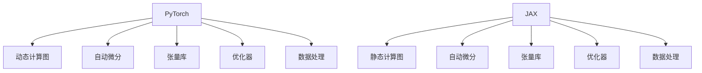

                 

## 1. 背景介绍

深度学习技术在过去十年中得到了飞速发展，许多框架如雨后春笋般涌现，其中最受欢迎的当属PyTorch和JAX。本文将深入探讨这两个框架的核心原理、优势和实际应用，并比较它们在学术研究和工业界的地位，以帮助开发者更好地选择合适的工具进行深度学习开发。

## 2. 核心概念与联系

### 2.1 核心概念概述

为了理解PyTorch和JAX，我们先介绍一些核心概念：

- **深度学习框架**：为开发者提供了一个实现深度神经网络的编程框架，提供了高效的计算图自动微分、优化器、数据处理等功能。
- **自动微分**：深度学习中常用的优化算法如梯度下降依赖于计算图求导，自动微分技术能自动生成计算图，大大减少了手动推导梯度的复杂性。
- **张量库**：深度学习中的核心数据结构，支持高效的矩阵运算。
- **动态计算图**：PyTorch的一大特色，与静态图框架不同，它允许程序员按顺序编写操作，能够灵活处理变长输入和动态计算图。
- **静态计算图**：JAX采用的计算图模型，静态图在计算前就确定了整个计算图，适用于高性能计算和分布式训练。

### 2.2 核心概念原理和架构的 Mermaid 流程图



## 3. 核心算法原理 & 具体操作步骤

### 3.1 算法原理概述

深度学习框架的核心算法是自动微分，用于计算模型参数的梯度。自动微分依赖于计算图，即通过构建计算图，自动计算每一步的梯度。在PyTorch中，计算图是动态的，可以随时修改；在JAX中，计算图是静态的，需要在计算前就确定。

深度学习框架的另一个重要算法是优化器，用于调整模型参数以最小化损失函数。主流优化器如Adam、SGD等依赖于自动微分和计算图。

### 3.2 算法步骤详解

- **模型定义**：使用框架提供的API定义神经网络结构，如TensorFlow的Keras API、PyTorch的nn模块等。
- **数据加载**：通过数据集API或Pandas、NumPy等库加载数据，并对数据进行预处理，如归一化、截断、分批等。
- **前向传播**：通过计算图进行前向传播，得到模型输出。
- **损失计算**：计算模型输出与真实标签的误差，如交叉熵、均方误差等。
- **反向传播**：根据误差计算梯度，并使用优化器更新模型参数。
- **迭代训练**：重复执行前向传播、损失计算和反向传播步骤，直至收敛。

### 3.3 算法优缺点

- **优点**：
  - PyTorch：动态图灵活，易于调试和实现，社区活跃，生态丰富。
  - JAX：静态图性能优秀，分布式训练高效，支持类型系统，与Numpy无缝集成。

- **缺点**：
  - PyTorch：静态图性能较弱，编译效率低，不适合大规模分布式训练。
  - JAX：学习曲线陡峭，API较复杂，不如PyTorch易用。

### 3.4 算法应用领域

PyTorch和JAX在学术界和工业界都有广泛的应用：

- **学术研究**：PyTorch由于其易用性和灵活性，成为许多研究者的首选框架，常用于新的模型架构开发和算法实验。
- **工业应用**：JAX由于其高性能和可扩展性，成为许多大型企业如Google、Deepmind的首选框架，用于生产级的深度学习模型部署和优化。

## 4. 数学模型和公式 & 详细讲解 & 举例说明

### 4.1 数学模型构建

我们以线性回归为例，构建一个简单的数学模型：

$$ y = \theta^T X + b $$

其中 $y$ 是输出，$X$ 是输入，$\theta$ 是模型参数，$b$ 是偏置项。

### 4.2 公式推导过程

假设损失函数为均方误差：

$$ L(\theta) = \frac{1}{2N} \sum_{i=1}^N (y_i - \theta^T x_i - b)^2 $$

求导得到梯度：

$$ \frac{\partial L(\theta)}{\partial \theta} = -\frac{1}{N} X^T (y - \theta^T x - b) $$

### 4.3 案例分析与讲解

在实际应用中，模型定义通常通过框架API完成：

```python
import torch
import torch.nn as nn
import torch.optim as optim

# 定义模型
class LinearModel(nn.Module):
    def __init__(self, input_dim, output_dim):
        super(LinearModel, self).__init__()
        self.linear = nn.Linear(input_dim, output_dim)
    
    def forward(self, x):
        return self.linear(x)

# 加载数据
X_train = torch.randn(100, 10)
y_train = torch.randn(100, 1)

# 定义模型和优化器
model = LinearModel(10, 1)
optimizer = optim.SGD(model.parameters(), lr=0.01)

# 前向传播和损失计算
output = model(X_train)
loss = nn.MSELoss()(output, y_train)

# 反向传播和参数更新
loss.backward()
optimizer.step()
```

## 5. 项目实践：代码实例和详细解释说明

### 5.1 开发环境搭建

- **Python环境**：确保Python 3.6或以上版本，并安装了pip。
- **PyTorch**：使用pip安装，命令为 `pip install torch torchvision torchaudio`。
- **JAX**：使用pip安装，命令为 `pip install jax jaxlib`. 需要配置JAX的GPU版本和平台。
- **Numpy**：需要与JAX无缝集成，确保安装最新的Numpy版本。

### 5.2 源代码详细实现

#### 5.2.1 PyTorch

```python
import torch
import torch.nn as nn
import torch.optim as optim
from torch.utils.data import TensorDataset, DataLoader

# 定义模型
class LinearModel(nn.Module):
    def __init__(self, input_dim, output_dim):
        super(LinearModel, self).__init__()
        self.linear = nn.Linear(input_dim, output_dim)
    
    def forward(self, x):
        return self.linear(x)

# 加载数据
X_train = torch.randn(100, 10)
y_train = torch.randn(100, 1)

# 定义模型和优化器
model = LinearModel(10, 1)
optimizer = optim.SGD(model.parameters(), lr=0.01)

# 数据处理
train_dataset = TensorDataset(X_train, y_train)
train_loader = DataLoader(train_dataset, batch_size=10, shuffle=True)

# 前向传播和损失计算
for epoch in range(100):
    for data, target in train_loader:
        output = model(data)
        loss = nn.MSELoss()(output, target)
        optimizer.zero_grad()
        loss.backward()
        optimizer.step()
```

#### 5.2.2 JAX

```python
import jax
from jax import jit, grad, random
from jax.nn import linear_model

# 定义模型
def model(X, y, weight_init_key, weight_update_key):
    keys = random.split(weight_init_key, 2)
    w_init, b_init = weight_init(keys)
    w, b = jax.nn.optimizer_step(b_init, w_init, (X, y))
    return linear_model.Linear(w, b)

# 加载数据
X_train = jnp.array(X_train)
y_train = jnp.array(y_train)

# 定义模型和优化器
w_init_key, b_init_key = random.split(random.PRNGKey(0))
model = model(X_train, y_train, w_init_key, b_init_key)

# 前向传播和损失计算
output = model(X_train)
loss = 0.5 * np.mean((y_train - output)**2)

# 反向传播和参数更新
grad_loss = grad(loss)
grad_loss = grad_loss(model(X_train))
model = jax.nn.optimizer_step(model, grad_loss, X_train, y_train)
```

### 5.3 代码解读与分析

#### 5.3.1 PyTorch

- `nn.Linear`：定义线性层，输入维度为10，输出维度为1。
- `optim.SGD`：定义随机梯度下降优化器，学习率为0.01。
- `DataLoader`：加载训练数据，采用小批量随机梯度下降。

#### 5.3.2 JAX

- `jax.nn.optimizer_step`：定义优化器步骤，用于更新参数。
- `linear_model.Linear`：定义线性模型，返回参数。
- `grad`：定义自动微分，返回梯度函数。

## 6. 实际应用场景

### 6.1 图像分类

深度学习在图像分类任务上表现优异，如LeNet、AlexNet、ResNet等经典模型，通过PyTorch和JAX可以方便地实现图像分类。

### 6.2 自然语言处理

自然语言处理任务如文本分类、语言模型、机器翻译等，PyTorch和JAX同样适用。

### 6.3 强化学习

强化学习中，如深度Q网络(DQN)、策略梯度等算法，PyTorch和JAX都能高效实现。

## 7. 工具和资源推荐

### 7.1 学习资源推荐

- **PyTorch官方文档**：详细介绍了PyTorch的使用方法、API和最佳实践。
- **JAX官方文档**：详细介绍了JAX的使用方法、API和最佳实践。
- **Deep Learning with PyTorch**：经典教材，全面介绍了PyTorch的使用和深度学习算法。
- **Hands-On Machine Learning with Scikit-Learn, Keras, and TensorFlow**：经典教材，全面介绍了机器学习和深度学习的原理和实现。

### 7.2 开发工具推荐

- **PyTorch**：灵活的动态图框架，适合研究和实验。
- **JAX**：高效的静态图框架，适合生产部署和分布式训练。
- **Numpy**：与JAX无缝集成的数值计算库，用于处理和操作数组。
- **TensorFlow**：强大的静态图框架，适合大规模部署。

### 7.3 相关论文推荐

- **Attention is All You Need**：介绍Transformer模型，是深度学习的重要里程碑。
- **Optimization in Deep Learning**：综述了深度学习中的优化算法。
- **Deep Learning in NLP**：综述了自然语言处理中的深度学习应用。

## 8. 总结：未来发展趋势与挑战

### 8.1 未来发展趋势

- **PyTorch**：随着动态图的性能优化和分布式训练的增强，PyTorch在未来仍将是深度学习研究和实验的重要工具。
- **JAX**：随着静态图的优化和分布式训练的支持，JAX将逐步成为深度学习大规模部署的首选框架。

### 8.2 面临的挑战

- **PyTorch**：动态图性能和分布式训练效率需要进一步提升，以应对更大规模的深度学习任务。
- **JAX**：需要进一步优化API和文档，降低学习曲线，提高易用性。

### 8.3 研究展望

- **PyTorch**：需要探索更高效的分布式训练策略和自动混合精度计算。
- **JAX**：需要探索更好的模型压缩和优化方法，以提高模型性能和可解释性。

## 9. 附录：常见问题与解答

**Q1：为什么PyTorch和JAX都支持自动微分？**

A: 自动微分是深度学习中的核心算法之一，依赖于计算图。PyTorch和JAX都提供高效的自动微分实现，能够自动生成计算图并计算每一步的梯度。

**Q2：如何选择PyTorch和JAX？**

A: 如果需要进行研究和实验，PyTorch由于其灵活性和易用性是首选。如果需要进行大规模部署和分布式训练，JAX由于其高性能和可扩展性是首选。

**Q3：如何使用JAX进行分布式训练？**

A: JAX的分布式训练依赖于`jax.distributed`模块，可以通过TPU集群进行分布式训练。具体步骤包括定义参数服务器和计算任务，并在TPU集群上进行同步训练。

**Q4：如何使用JAX进行模型压缩和优化？**

A: JAX支持动态计算图，可以通过优化器如Adam、SGD等进行模型压缩和优化。同时JAX支持JAX-PRIME工具，能够进行高效的模型压缩和优化。

---

作者：禅与计算机程序设计艺术 / Zen and the Art of Computer Programming

