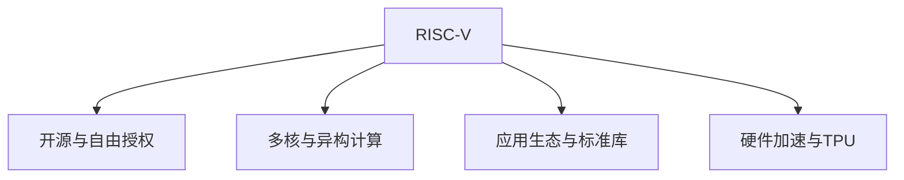

                 

# RISC-V：开源指令集架构的未来

> 关键词：RISC-V, 指令集, 开源, 低功耗, 多核, 应用生态, 硬件加速

## 1. 背景介绍

### 1.1 问题由来
随着芯片计算能力的不断提升，对指令集架构(ISA)的需求也日益增多。传统x86和ARM指令集架构虽然成熟稳定，但授权成本高昂，且存在多核扩展和异构计算的瓶颈。随着开源硬件的兴起，开源指令集架构RISC-V被越来越多的公司和研究机构看好。RISC-V以其开源、自由授权和灵活性著称，正在逐渐构建起自己的生态系统，成为下一代计算架构的重要候选。

### 1.2 问题核心关键点
RISC-V作为一项新兴的指令集架构，其核心优势在于：

- **开源与自由授权**：RISC-V的商业授权无需支付高额的版税，且硬件设计者可以自由使用和修改其指令集，不受厂商限制。
- **灵活性与可定制性**：RISC-V指令集架构灵活，支持多种变体，可适应不同应用场景和硬件平台。
- **低功耗与高效率**：RISC-V设计理念追求高效率和低功耗，特别适合物联网、嵌入式和移动设备等领域。

这些特点使得RISC-V成为未来计算架构的理想选择，对现有x86和ARM架构提出了挑战。

## 2. 核心概念与联系

### 2.1 核心概念概述

为更好地理解RISC-V的未来发展方向，本节将介绍几个密切相关的核心概念：

- **RISC-V指令集架构**：一种精简的、开放源代码的指令集架构，由加州大学伯克利分校开发，旨在支持多样化的计算应用。
- **自由授权与开源**：RISC-V指令集的商业授权采用开源许可，开发者可以自由使用、修改和发布自己的硬件实现。
- **多核与异构计算**：RISC-V天然支持多核并行和异构计算，能够在低功耗和高效能之间找到平衡。
- **应用生态与标准库**：RISC-V社区已经构建起丰富的软件生态，包括操作系统、编译器和标准库等，支持RISC-V架构的应用。
- **硬件加速与TPU**：RISC-V逐渐被用于定制化的硬件加速器，如Tensor Processing Unit(TPU)等，提升特定任务的计算效率。

这些核心概念之间的逻辑关系可以通过以下Mermaid流程图来展示：



这个流程图展示了大语言模型的核心概念及其之间的关系：

1. RISC-V通过开源授权和灵活设计，能够快速适应各种硬件平台和应用场景。
2. 多核与异构计算使得RISC-V在并行和混合计算中具有优势，适合高性能计算任务。
3. 应用生态和标准库支持RISC-V的广泛应用，提供了丰富的工具链和框架。
4. 硬件加速与TPU使RISC-V在特定任务中表现出色，优化计算性能。

这些概念共同构成了RISC-V的未来发展框架，使其能够在各种计算应用中发挥重要作用。

## 3. 核心算法原理 & 具体操作步骤
### 3.1 算法原理概述

RISC-V指令集架构的设计原则主要包括精简指令集、单周期执行和硬件加速等。其核心思想是通过简化指令集和优化硬件设计，以实现更高的计算效率和更低的功耗。

### 3.2 算法步骤详解

RISC-V指令集架构的设计和实现通常包括以下几个关键步骤：

**Step 1: 设计指令集**
- 确定指令集的基本结构，包括数据类型、操作码、寻址方式等。
- 设计各指令的基本功能，如算术运算、逻辑运算、分支控制等。
- 考虑多核支持、中断处理、异常处理等特性。

**Step 2: 硬件设计**
- 根据指令集设计硬件逻辑，包括CPU、缓存、寄存器等组件。
- 考虑多核并行、互连、内存管理等复杂问题，确保系统稳定高效。
- 使用RTL(寄存器传输级)设计工具，进行硬件逻辑的详细实现。

**Step 3: 软件支持**
- 开发和优化操作系统、编译器、标准库等软件工具。
- 确保软件工具与硬件设计相兼容，实现高效的软件执行。
- 推动RISC-V生态系统的完善，支持更多的应用场景。

**Step 4: 测试与验证**
- 在测试平台上运行RISC-V架构的模拟和硬件实现。
- 使用模拟器和硬件测试平台验证指令集的正确性和硬件的可靠性。
- 进行性能评估和功耗测试，优化硬件设计。

**Step 5: 标准化与推广**
- 与行业组织合作，推动RISC-V标准的制定和推广。
- 建立RISC-V社区，鼓励开发者参与开源硬件项目。
- 通过硬件加速器和商业化产品，推广RISC-V架构的应用。

### 3.3 算法优缺点

RISC-V指令集架构的优点包括：
1. **开源与自由授权**：降低了硬件开发的成本，鼓励更多企业参与开源社区。
2. **灵活性与可定制性**：支持多种变体，适合不同的硬件平台和应用场景。
3. **低功耗与高效率**：设计理念追求高效和低功耗，特别适合嵌入式和物联网应用。
4. **多核与异构计算**：天然支持多核并行和异构计算，适合高性能计算任务。

同时，RISC-V也存在一些局限性：
1. **生态系统尚在构建**：虽然已有丰富的软件生态，但与x86和ARM相比，仍不够成熟和完善。
2. **硬件设计复杂**：设计多核系统和异构计算系统，需要更多的专业知识和经验。
3. **应用领域有限**：虽然RISC-V适用于很多领域，但大规模应用还需更多商业化产品支持。
4. **社区支持不足**：与成熟的ARM和x86社区相比，RISC-V社区的活跃度和贡献度仍需提升。

尽管存在这些局限性，但RISC-V通过持续的社区贡献和硬件厂商的支持，正在逐步扩大其应用范围，并构建起广泛的应用生态。

### 3.4 算法应用领域

RISC-V指令集架构已经在许多领域得到了广泛应用，涵盖计算、存储、网络、安全等诸多方面，例如：

- **计算与存储**：用于设计高性能计算节点和存储服务器，支持云计算和大数据处理。
- **网络与通信**：用于构建高性能网络交换机和路由器，支持5G通信和边缘计算。
- **安全与隐私**：用于开发安全芯片和隐私保护设备，支持物联网和智能家居。
- **嵌入式与移动设备**：用于设计低功耗、高性能的嵌入式系统，支持物联网和可穿戴设备。
- **人工智能与机器学习**：用于设计专用加速器，支持深度学习和大规模数据处理。

除了这些经典应用外，RISC-V还被创新性地应用于更多领域，如量子计算、生物医学、科学研究等，为计算技术带来新的突破。

## 4. 数学模型和公式 & 详细讲解
### 4.1 数学模型构建

RISC-V指令集架构的数学模型主要基于微程序设计和数据流分析。这里以RISC-V RV32I为例，简要介绍其基本结构。

假设RISC-V RV32I指令集包含32个通用寄存器$r0, r1, ..., r31$，基本的指令集结构包括：

- **数据类指令**：如加法、减法、乘法、除法等基本算术运算。
- **控制类指令**：如分支、跳转、中断处理等控制流操作。
- **内存类指令**：如读写内存、内存映射等数据访问操作。
- **系统调用指令**：如操作系统服务调用等系统调用操作。

这些指令通过微程序进行编码，构成微程序控制逻辑，实现指令执行。

### 4.2 公式推导过程

RISC-V RV32I指令集的设计基于精简指令集(RISC)的原则，每个指令执行周期内只完成一个基本操作。这里以加法指令为例，推导其执行流程。

假设两个寄存器$r_1, r_2$进行加法操作，生成的结果存入$r_3$：

1. **指令读取**：读取加法指令和操作数，构成微程序执行逻辑。

2. **数据处理**：读取$r_1$和$r_2$的值，执行加法操作，生成结果。

3. **寄存器写入**：将结果写入$r_3$，完成加法指令的执行。

这一过程可以简单表示为：

$$
\text{RISC-V RV32I} = \{I_{ADD}, M_{R1, R2, R3}\}
$$

其中，$I_{ADD}$表示加法指令，$M_{R1, R2, R3}$表示读取$r_1$、$r_2$、$r_3$的值，执行加法操作，将结果写入$r_3$。

### 4.3 案例分析与讲解

以RISC-V RV32I指令集为例，分析其在嵌入式系统中的应用场景。

假设设计一个低功耗、高性能的嵌入式系统，用于物联网数据采集和传输。系统基于RISC-V RV32I架构，包含一个主处理器、若干外围接口和存储单元。

1. **处理器设计**：
   - 使用RISC-V RV32I指令集，设计高性能的处理器核心。
   - 采用多核并行设计，提高数据处理速度。
   - 优化硬件逻辑，降低功耗。

2. **外围接口设计**：
   - 设计各种外设接口，如Wi-Fi、蓝牙、传感器等。
   - 实现数据采集和传输功能，支持多种通信协议。
   - 优化接口设计，降低功耗。

3. **存储单元设计**：
   - 设计高速、低功耗的存储单元，如Flash和DDR内存。
   - 实现数据缓存和存储管理，优化访问效率。
   - 优化存储管理算法，减少能量损耗。

通过以上设计，可以实现高性能、低功耗的物联网系统，充分发挥RISC-V RV32I架构的优势。

## 5. 项目实践：代码实例和详细解释说明
### 5.1 开发环境搭建

在进行RISC-V项目实践前，我们需要准备好开发环境。以下是使用LLVM和Chisel等工具搭建RISC-V开发环境的流程：

1. 安装LLVM：从官网下载并安装LLVM编译器，用于RISC-V指令集的编译和调试。

2. 安装Chisel：从官网下载并安装Chisel硬件设计工具，用于硬件逻辑的描述和仿真。

3. 安装Xilinx Zynq开发平台：如果采用FPGA硬件验证，需要安装Xilinx Zynq开发平台，包含相关开发工具和驱动。

4. 安装RTL设计工具：安装Xilinx Vivado、Synopsys DesignWare等RTL设计工具，用于硬件逻辑的详细实现。

完成上述步骤后，即可在安装的环境中开始RISC-V硬件设计实践。

### 5.2 源代码详细实现

下面我们以RISC-V RV32I为例，给出一个简单的RISC-V硬件设计的PyRTL代码实现。

```python
class RV32I:
    def __init__(self):
        self.registers = [0] * 32  # 32个通用寄存器

    def read_register(self, reg_id):
        return self.registers[reg_id]

    def write_register(self, reg_id, value):
        self.registers[reg_id] = value

    def add(self, reg1, reg2, reg3):
        self.write_register(reg3, self.read_register(reg1) + self.read_register(reg2))
```

在上述代码中，定义了一个简单的RISC-V RV32I处理器，包含32个通用寄存器。通过read_register和write_register方法，实现了寄存器读取和写入功能。同时，实现了一个简单的加法指令，将两个寄存器相加，结果存入第三个寄存器。

### 5.3 代码解读与分析

让我们再详细解读一下关键代码的实现细节：

**RV32I类**：
- `__init__`方法：初始化32个通用寄存器。
- `read_register`方法：读取指定寄存器的值。
- `write_register`方法：写入指定寄存器的值。
- `add`方法：实现加法指令，将两个寄存器的值相加，结果存入第三个寄存器。

这些方法共同构成了RISC-V RV32I处理器的基本功能，实现了一个简单的加法指令。在实际硬件设计中，这些方法会被映射为微程序逻辑，实现指令的详细执行。

**FPGA验证流程**：
- 使用Chisel工具，将PyRTL代码转换成硬件逻辑设计。
- 使用Xilinx Zynq开发平台，将设计转换成FPGA验证平台。
- 在FPGA上运行测试，验证RV32I处理器的正确性和性能。

通过以上流程，即可验证RISC-V RV32I处理器的功能和性能，进一步优化硬件设计。

## 6. 实际应用场景
### 6.1 嵌入式系统

RISC-V架构在嵌入式系统中的应用前景广阔。由于RISC-V的低功耗和高效能特点，非常适合应用于资源受限的物联网和嵌入式设备。

在实际应用中，可以将RISC-V RV32I处理器集成到嵌入式系统主板中，支持各种传感器和通信模块。系统可以实时采集环境数据，进行数据处理和分析，并通过Wi-Fi、蓝牙等无线通信模块将数据传输到云端。这种设计可以构建出高性能、低功耗的物联网解决方案，广泛应用在智能家居、智能工厂、智慧城市等领域。

### 6.2 服务器与数据中心

随着云计算和大数据处理需求的增加，服务器与数据中心的计算需求也在不断提升。RISC-V架构的灵活性和高效性，使其能够适应各种高性能计算任务。

在实际应用中，可以将RISC-V RV32I处理器集成到高性能服务器中，支持多核并行和异构计算。系统可以处理大规模数据集，进行复杂算法和机器学习计算，提升云计算和大数据处理能力。这种设计可以构建出高性能、高可靠性的服务器与数据中心，广泛应用在人工智能、科学计算、大数据处理等领域。

### 6.3 移动设备和智能手机

RISC-V架构的灵活性和可定制性，使其能够适应各种移动设备和智能手机的需求。

在实际应用中，可以将RISC-V RV32I处理器集成到移动设备和智能手机中，支持各种应用程序和操作系统。系统可以进行实时数据处理和分析，提升用户体验。这种设计可以构建出高性能、低功耗的移动设备和智能手机，广泛应用在便携式计算、可穿戴设备、物联网等领域。

### 6.4 未来应用展望

随着RISC-V架构的不断完善和推广，未来其在计算领域的应用前景将更加广阔。以下是几个可能的未来应用场景：

1. **量子计算**：RISC-V架构的灵活性和可定制性，使其能够支持量子计算中的专用硬件加速器。通过优化量子计算中的计算任务，提高量子计算的效率和性能。

2. **生物医学**：RISC-V架构的高效性和低功耗特点，使其能够支持生物医学中的实时数据处理和分析。通过优化生物医学中的算法和计算任务，提升生物医学研究的效率和精度。

3. **科学研究**：RISC-V架构的灵活性和可定制性，使其能够支持科学研究中的复杂计算任务。通过优化科学研究中的计算任务，提升科学研究的效率和精度。

4. **虚拟现实**：RISC-V架构的高效性和低功耗特点，使其能够支持虚拟现实中的实时渲染和数据处理。通过优化虚拟现实中的计算任务，提升虚拟现实应用的效率和体验。

5. **人工智能与机器学习**：RISC-V架构的多核并行和异构计算能力，使其能够支持人工智能和机器学习中的复杂计算任务。通过优化人工智能和机器学习中的计算任务，提升人工智能和机器学习应用的效率和性能。

## 7. 工具和资源推荐
### 7.1 学习资源推荐

为了帮助开发者系统掌握RISC-V硬件设计的原理和实践技巧，这里推荐一些优质的学习资源：

1. 《RISC-V Architecture Guide》：RISC-V基金会官方指南，详细介绍了RISC-V指令集架构的各个方面。

2. 《RISC-V Hardware Design》：一本针对RISC-V硬件设计的书籍，涵盖RISC-V指令集架构和硬件设计的各个方面。

3. 《RISC-V System Design》：一本针对RISC-V系统设计的书籍，涵盖RISC-V指令集架构和系统设计的各个方面。

4. 《RISC-V Prototyping with Chisel and Xilinx Zynq》：一本针对RISC-V硬件验证的书籍，使用Chisel和Xilinx Zynq平台进行RISC-V硬件设计的实践。

5. 《RISC-V Debugging with LLVM and Chisel》：一本针对RISC-V调试的书籍，使用LLVM和Chisel工具进行RISC-V指令集架构的调试和验证。

通过对这些资源的学习实践，相信你一定能够快速掌握RISC-V硬件设计的精髓，并用于解决实际的硬件设计问题。

### 7.2 开发工具推荐

高效的开发离不开优秀的工具支持。以下是几款用于RISC-V硬件设计开发的常用工具：

1. LLVM：开源的编译器基础设施，支持RISC-V指令集的编译和调试。

2. Chisel：开源的硬件设计工具，支持RISC-V指令集架构的设计和验证。

3. Xilinx Zynq：Xilinx提供的FPGA开发平台，支持RISC-V RV32I处理器的硬件验证。

4. Vivado：Xilinx提供的RTL设计工具，支持RISC-V指令集架构的设计和验证。

5. DesignWare：Synopsys提供的RTL设计工具，支持RISC-V指令集架构的设计和验证。

合理利用这些工具，可以显著提升RISC-V硬件设计的开发效率，加快创新迭代的步伐。

### 7.3 相关论文推荐

RISC-V架构的发展源于学界的持续研究。以下是几篇奠基性的相关论文，推荐阅读：

1. "RISC-V: A New IEEE Standard for Instruction Set Architectures"：RISC-V基金会发布的指令集架构标准，详细介绍了RISC-V指令集架构的设计和特点。

2. "The RISC-V Instruction Set Architecture Manual"：RISC-V基金会发布的官方文档，详细介绍了RISC-V指令集架构的各个方面。

3. "A Survey of RISC-V Hardware Architectures"：一篇综述论文，总结了当前RISC-V硬件架构的研究成果和趋势。

4. "RISC-V Performance Modeling and Optimization"：一篇针对RISC-V性能优化研究的论文，详细介绍了RISC-V指令集架构的性能分析和优化方法。

5. "RISC-V Security and Privacy"：一篇关于RISC-V安全与隐私研究的论文，详细介绍了RISC-V指令集架构在安全与隐私方面的应用和挑战。

这些论文代表了大语言模型微调技术的发展脉络。通过学习这些前沿成果，可以帮助研究者把握学科前进方向，激发更多的创新灵感。

## 8. 总结：未来发展趋势与挑战

### 8.1 总结

本文对RISC-V指令集架构的未来进行了全面系统的介绍。首先阐述了RISC-V作为新兴指令集架构的研究背景和意义，明确了其开源、自由授权和灵活性等优势。其次，从原理到实践，详细讲解了RISC-V硬件设计的数学模型和关键步骤，给出了硬件设计任务开发的完整代码实例。同时，本文还广泛探讨了RISC-V架构在嵌入式系统、服务器与数据中心、移动设备和智能手机等多个领域的应用前景，展示了其广阔的发展空间。此外，本文精选了RISC-V硬件设计的各类学习资源，力求为读者提供全方位的技术指引。

通过本文的系统梳理，可以看到，RISC-V指令集架构正在成为计算架构的重要候选，对现有x86和ARM架构提出了新的挑战。未来，伴随RISC-V架构的不断完善和推广，其应用领域将更加广泛，有望在计算领域产生重大影响。

### 8.2 未来发展趋势

展望未来，RISC-V架构将呈现以下几个发展趋势：

1. **生态系统完善**：RISC-V社区和厂商将进一步完善其生态系统，推动更多的软件工具和硬件平台支持。

2. **多核与异构计算**：RISC-V架构将支持更多类型的并行计算和异构计算，提升计算性能和效率。

3. **硬件加速器**：RISC-V架构将被用于更多类型的硬件加速器，支持高效计算任务。

4. **物联网与嵌入式**：RISC-V架构将在物联网和嵌入式领域得到广泛应用，提升资源受限设备的计算能力。

5. **高性能计算**：RISC-V架构将被用于高性能计算和数据中心，支持大规模数据处理和计算任务。

6. **移动与可穿戴**：RISC-V架构将被用于移动设备和可穿戴设备，提升设备的计算能力和用户体验。

以上趋势凸显了RISC-V架构的广阔前景，这些方向的探索发展，必将进一步提升其应用范围和性能，推动计算技术的进步。

### 8.3 面临的挑战

尽管RISC-V架构已经取得了一定进展，但在迈向更加智能化、普适化应用的过程中，它仍面临诸多挑战：

1. **生态系统不完善**：尽管已有丰富的软件生态，但与x86和ARM相比，仍不够成熟和完善。

2. **硬件设计复杂**：设计多核系统和异构计算系统，需要更多的专业知识和经验。

3. **应用领域有限**：虽然RISC-V适用于很多领域，但大规模应用还需更多商业化产品支持。

4. **社区支持不足**：与成熟的ARM和x86社区相比，RISC-V社区的活跃度和贡献度仍需提升。

尽管存在这些挑战，但RISC-V通过持续的社区贡献和厂商的支持，正在逐步构建起广泛的应用生态，逐步扩大其应用范围。

### 8.4 未来突破

面对RISC-V架构所面临的挑战，未来的研究需要在以下几个方面寻求新的突破：

1. **推动生态系统完善**：与行业组织和厂商合作，推动RISC-V标准的制定和推广，吸引更多开发者参与开源社区。

2. **优化硬件设计**：开发更加灵活、高效的多核和异构计算系统，提升硬件设计的可扩展性和可定制性。

3. **拓展应用领域**：推动RISC-V架构在更多领域的应用，如量子计算、生物医学、科学研究等，探索更多应用场景。

4. **增强社区支持**：建立RISC-V社区，鼓励开发者参与开源硬件项目，提供更多的学习资源和工具支持。

5. **提升计算性能**：优化硬件加速器和专用计算任务，提升RISC-V架构的计算性能和效率。

这些研究方向的探索，必将引领RISC-V架构向更高的台阶发展，为计算技术带来新的突破。面向未来，RISC-V架构需要在硬件设计、软件生态和应用场景等多个维度协同发力，才能真正实现计算技术的普适化和智能化。总之，RISC-V架构的不断完善和推广，将带来计算技术的革命性变革，推动计算技术向更广阔的领域迈进。

## 9. 附录：常见问题与解答

**Q1：RISC-V与x86和ARM指令集架构相比，有哪些优势？**

A: RISC-V指令集架构具有以下优势：

1. **开源与自由授权**：RISC-V的商业授权采用开源许可，降低了硬件开发的成本，鼓励更多企业参与开源社区。

2. **灵活性与可定制性**：RISC-V指令集架构灵活，支持多种变体，适合不同的硬件平台和应用场景。

3. **低功耗与高效率**：RISC-V设计理念追求高效和低功耗，特别适合嵌入式和物联网应用。

4. **多核与异构计算**：RISC-V天然支持多核并行和异构计算，适合高性能计算任务。

这些优势使得RISC-V架构在资源受限的嵌入式和物联网领域具有显著的优势。

**Q2：RISC-V架构在计算领域的应用前景如何？**

A: RISC-V架构在计算领域具有广阔的应用前景：

1. **嵌入式系统**：RISC-V的低功耗和高效能特点，使其能够应用于资源受限的物联网和嵌入式设备。

2. **服务器与数据中心**：RISC-V的高效性和低功耗特点，使其能够支持高性能计算任务。

3. **移动设备和智能手机**：RISC-V的灵活性和可定制性，使其能够适应各种移动设备和智能手机的需求。

4. **量子计算**：RISC-V架构的灵活性和可定制性，使其能够支持量子计算中的专用硬件加速器。

5. **生物医学与科学研究**：RISC-V的高效性和低功耗特点，使其能够支持生物医学中的实时数据处理和分析。

6. **虚拟现实与人工智能**：RISC-V的多核并行和异构计算能力，使其能够支持虚拟现实和人工智能中的复杂计算任务。

**Q3：如何优化RISC-V硬件设计？**

A: 优化RISC-V硬件设计需要综合考虑以下几个方面：

1. **优化指令集架构**：通过优化指令集架构，减少不必要的指令和复杂度，提高指令执行效率。

2. **设计多核系统**：采用多核并行设计，提高系统的计算能力和并发性。

3. **优化数据流设计**：通过优化数据流设计，减少数据依赖和缓存命中，提高系统的访问效率。

4. **降低功耗**：通过优化电路设计和工艺技术，降低硬件的功耗和能量损耗。

5. **提升性能**：通过优化硬件加速器和专用计算任务，提升系统的计算性能和效率。

通过以上优化，可以显著提升RISC-V硬件设计的性能和效率，满足不同应用场景的需求。

**Q4：RISC-V架构与现有x86和ARM架构相比，有哪些劣势？**

A: RISC-V架构相对于现有x86和ARM架构，存在以下劣势：

1. **生态系统不完善**：RISC-V社区和厂商还需要更多的时间和投入来完善其生态系统。

2. **硬件设计复杂**：设计多核系统和异构计算系统，需要更多的专业知识和经验。

3. **应用领域有限**：虽然RISC-V适用于很多领域，但大规模应用还需更多商业化产品支持。

4. **社区支持不足**：与成熟的ARM和x86社区相比，RISC-V社区的活跃度和贡献度仍需提升。

尽管存在这些劣势，但RISC-V架构通过持续的社区贡献和厂商的支持，正在逐步构建起广泛的应用生态，逐步扩大其应用范围。

**Q5：如何推动RISC-V生态系统的完善？**

A: 推动RISC-V生态系统的完善需要从以下几个方面入手：

1. **标准化与规范化**：与行业组织和厂商合作，推动RISC-V标准的制定和推广，吸引更多开发者参与开源社区。

2. **社区建设和参与**：建立RISC-V社区，鼓励开发者参与开源硬件项目，提供更多的学习资源和工具支持。

3. **商业化产品支持**：推动RISC-V架构在更多领域的应用，如量子计算、生物医学、科学研究等，探索更多应用场景。

4. **硬件加速器支持**：开发更多类型的硬件加速器，支持高效计算任务，提升RISC-V架构的计算性能和效率。

通过以上措施，可以推动RISC-V生态系统的完善，加速其在计算领域的应用推广。

---

作者：禅与计算机程序设计艺术 / Zen and the Art of Computer Programming

