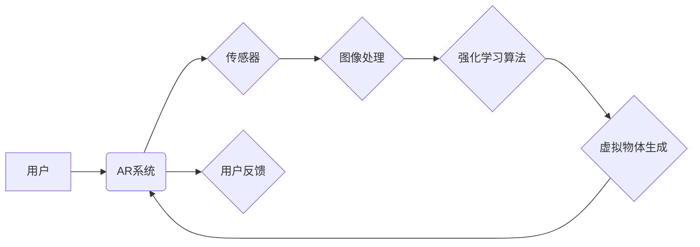

> 强化学习，增强现实，AR，深度学习，机器人控制，交互体验

## 1. 背景介绍

增强现实（AR）技术正在迅速发展，它将虚拟信息叠加到现实世界中，为用户提供更加沉浸式和交互式的体验。AR应用场景广泛，涵盖游戏、教育、医疗、零售等领域。然而，传统的AR系统通常依赖于预先定义的规则和场景，缺乏灵活性，难以应对复杂和动态的环境。

强化学习（RL）作为一种机器学习方法，能够通过与环境交互学习最优策略，具有强大的适应性和泛化能力。将RL与AR技术相结合，可以赋予AR系统更强的智能和自主性，使其能够更好地理解用户意图，提供更个性化和自然的交互体验。

## 2. 核心概念与联系

**2.1 AR技术概述**

增强现实（AR）技术是指在现实世界中叠加虚拟信息，以增强用户对现实世界的感知和理解。AR系统通常由以下几个关键组件组成：

* **传感器:** 用于获取现实世界的信息，例如摄像头、麦克风、陀螺仪等。
* **图像处理模块:** 对传感器获取的图像进行处理，识别物体、场景等信息。
* **渲染引擎:** 生成虚拟物体和信息，并将其叠加到现实世界图像中。
* **用户界面:** 用于用户与AR系统交互，例如手势识别、语音识别等。

**2.2 强化学习概述**

强化学习（RL）是一种机器学习方法，其核心思想是通过与环境交互，学习最优策略以最大化奖励。RL系统由以下几个关键组件组成：

* **智能体 (Agent):** 与环境交互的实体，根据环境状态采取行动。
* **环境 (Environment):** 智能体所处的外部世界，会根据智能体的行动产生新的状态和奖励。
* **状态 (State):** 环境的当前状态，描述了环境中所有相关信息。
* **动作 (Action):** 智能体可以采取的行动，会改变环境的状态。
* **奖励 (Reward):** 环境对智能体采取的行动给予的反馈，可以是正向奖励或负向惩罚。
* **策略 (Policy):** 智能体根据当前状态选择动作的规则。

**2.3 AR与RL的结合**

将RL与AR技术相结合，可以使AR系统具备更强的智能和自主性。例如，RL算法可以帮助AR系统：

* **理解用户意图:** 通过观察用户的行为和交互，RL算法可以学习用户的意图，并提供更精准的响应。
* **个性化体验:** RL算法可以根据用户的喜好和需求，定制个性化的AR体验。
* **动态场景适应:** RL算法可以帮助AR系统适应复杂和动态的环境，例如自动调整虚拟物体的位置和大小，以保持最佳的视觉效果。

**2.4  核心架构**



## 3. 核心算法原理 & 具体操作步骤

**3.1 算法原理概述**

在AR领域，常用的RL算法包括Q学习、SARSA、Deep Q-Network (DQN)等。这些算法的核心思想是通过不断与环境交互，学习一个策略，使得智能体在环境中获得最大的累积奖励。

**3.2 算法步骤详解**

以Q学习为例，其算法步骤如下：

1. 初始化Q表，Q(s,a)表示在状态s下采取动作a的期望奖励。
2. 智能体观察当前环境状态s。
3. 根据策略选择动作a。
4. 执行动作a，观察环境状态s'和获得奖励r。
5. 更新Q表：Q(s,a) = Q(s,a) + α[r + γmaxQ(s',a') - Q(s,a)]，其中α是学习率，γ是折扣因子。
6. 重复步骤2-5，直到达到终止条件。

**3.3 算法优缺点**

* **优点:** 
    * 能够学习复杂的策略。
    * 适应性强，能够应对动态环境。
    * 能够实现个性化体验。
* **缺点:** 
    * 训练时间长，需要大量的样本数据。
    * 容易陷入局部最优解。
    * 对于高维状态空间，计算量大。

**3.4 算法应用领域**

* **机器人控制:** RL算法可以帮助机器人学习自主导航、抓取物体等技能。
* **游戏AI:** RL算法可以训练游戏中的AI对手，使其更加智能和具有挑战性。
* **推荐系统:** RL算法可以根据用户的行为和喜好，推荐更精准的商品或内容。

## 4. 数学模型和公式 & 详细讲解 & 举例说明

**4.1 数学模型构建**

在RL中，我们通常使用马尔可夫决策过程（MDP）来建模环境和智能体之间的交互。MDP由以下几个要素组成：

* 状态空间 S：环境可能存在的全部状态。
* 动作空间 A：智能体可以采取的所有动作。
* 转移概率 P(s',r|s,a)：在状态s下采取动作a，转移到状态s'，获得奖励r的概率。
* 奖励函数 R(s,a)：在状态s下采取动作a获得的奖励。
* 策略 π(a|s)：在状态s下选择动作a的概率分布。

**4.2 公式推导过程**

Q学习算法的目标是学习一个Q函数，Q(s,a)，表示在状态s下采取动作a的期望累积奖励。Q函数的更新公式如下：

$$Q(s,a) = Q(s,a) + \alpha [r + \gamma \max_{a'} Q(s',a') - Q(s,a)]$$

其中：

* α：学习率，控制着学习速率。
* γ：折扣因子，控制着未来奖励的权重。
* r：在状态s下采取动作a获得的奖励。
* s'：执行动作a后进入的状态。
* a'：在状态s'下采取的动作。

**4.3 案例分析与讲解**

假设有一个简单的AR游戏，玩家需要控制一个虚拟角色在虚拟场景中移动，收集金币。

* 状态空间 S：玩家角色的位置和金币的数量。
* 动作空间 A：向上、向下、向左、向右四个方向移动。
* 转移概率 P(s',r|s,a)：取决于玩家角色的移动方向和场景的障碍物。
* 奖励函数 R(s,a)：收集金币获得正向奖励，撞到障碍物获得负向奖励。
* 策略 π(a|s)：根据Q函数选择最优的动作。

通过Q学习算法，玩家角色可以学习最优的移动策略，从而收集更多的金币。

## 5. 项目实践：代码实例和详细解释说明

**5.1 开发环境搭建**

* Python 3.x
* TensorFlow 或 PyTorch 深度学习框架
* Opencv 图像处理库
* ARKit 或 ARCore AR开发平台

**5.2 源代码详细实现**

```python
import tensorflow as tf

# 定义Q函数
Q_network = tf.keras.Sequential([
    tf.keras.layers.Dense(64, activation='relu', input_shape=(state_size,)),
    tf.keras.layers.Dense(64, activation='relu'),
    tf.keras.layers.Dense(action_size)
])

# 定义损失函数和优化器
loss_fn = tf.keras.losses.MeanSquaredError()
optimizer = tf.keras.optimizers.Adam(learning_rate=0.001)

# 训练Q网络
for episode in range(num_episodes):
    state = env.reset()
    done = False
    while not done:
        # 选择动作
        action = tf.argmax(Q_network(state)).numpy()
        # 执行动作
        next_state, reward, done, _ = env.step(action)
        # 更新Q值
        with tf.GradientTape() as tape:
            target_q = reward + gamma * tf.reduce_max(Q_network(next_state))
            loss = loss_fn(target_q, Q_network(state)[action])
        gradients = tape.gradient(loss, Q_network.trainable_variables)
        optimizer.apply_gradients(zip(gradients, Q_network.trainable_variables))
        state = next_state

# 保存训练好的Q网络
Q_network.save('trained_q_network.h5')

```

**5.3 代码解读与分析**

* 代码首先定义了Q网络，这是一个多层感知机，用于估计在每个状态下采取每个动作的期望奖励。
* 然后定义了损失函数和优化器，用于训练Q网络。
* 训练过程是一个循环，在每个循环中，智能体与环境交互，根据Q网络的输出选择动作，并根据环境的反馈更新Q网络的参数。
* 最后，训练好的Q网络可以被保存下来，用于在新的环境中进行预测。

**5.4 运行结果展示**

训练好的Q网络可以用于控制AR角色在虚拟场景中移动，收集金币。通过观察角色的行为，可以验证Q网络是否已经学习到最优策略。

## 6. 实际应用场景

**6.1 AR游戏**

RL算法可以用于训练游戏中的AI对手，使其更加智能和具有挑战性。例如，在AR游戏中，RL算法可以帮助训练虚拟角色，使其能够根据玩家的行动做出更合理的反应，从而提高游戏的趣味性和可玩性。

**6.2 AR教育**

RL算法可以用于开发个性化的AR教育体验。例如，RL算法可以根据学生的学习进度和理解程度，调整AR内容的难度和内容，从而提高学生的学习效率和兴趣。

**6.3 AR医疗**

RL算法可以用于辅助医生进行手术和诊断。例如，RL算法可以帮助医生学习更精准的手术操作，或者根据患者的病历和影像数据，预测疾病的风险和发展趋势。

**6.4 未来应用展望**

随着AR技术的不断发展，RL算法在AR领域的应用前景十分广阔。未来，RL算法可能被用于：

* 更逼真的AR虚拟角色交互
* 更智能的AR场景生成和定制
* 更个性化的AR体验
* 更安全的AR应用

## 7. 工具和资源推荐

**7.1 学习资源推荐**

* **书籍:**
    * Reinforcement Learning: An Introduction by Richard S. Sutton and Andrew G. Barto
    * Deep Reinforcement Learning Hands-On by Maxim Lapan
* **在线课程:**
    * Coursera: Reinforcement Learning Specialization by David Silver
    * Udacity: Deep Reinforcement Learning Nanodegree

**7.2 开发工具推荐**

* **AR开发平台:** ARKit (iOS), ARCore (Android)
* **深度学习框架:** TensorFlow, PyTorch
* **图像处理库:** OpenCV

**7.3 相关论文推荐**

* Deep Reinforcement Learning for Augmented Reality Applications
* Learning to Play Atari with Deep Reinforcement Learning
* Proximal Policy Optimization Algorithms

## 8. 总结：未来发展趋势与挑战

**8.1 研究成果总结**

近年来，RL算法在AR领域的应用取得了显著进展，例如在AR游戏、AR教育、AR医疗等领域取得了成功应用。RL算法能够赋予AR系统更强的智能和自主性，为用户提供更沉浸式和交互式的体验。

**8.2 未来发展趋势**

* **更强大的RL算法:** 研究人员将继续开发更强大的RL算法，例如基于深度学习的RL算法，以解决更复杂的任务。
* **更丰富的AR应用场景:** RL算法将被应用到更多AR应用场景中，例如AR导航、AR购物、AR设计等。
* **更个性化的AR体验:** RL算法将被用于定制