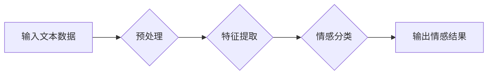

> 情感分析，自然语言处理，机器学习，深度学习，文本分类，情感识别，用户体验，商业应用

## 1. 背景介绍

在当今数据爆炸的时代，用户生成的内容（UGC）如评论、社交媒体帖子、论坛讨论等，为企业提供了宝贵的洞察用户情感和需求的窗口。情感分析（Sentiment Analysis），也称为意见挖掘（Opinion Mining），正是利用自然语言处理（NLP）技术，从文本数据中识别、提取和分析用户情感倾向的技术。

情感分析的应用场景日益广泛，涵盖了市场调研、品牌监控、客户服务、产品开发等多个领域。例如，电商平台可以利用情感分析技术分析用户对商品的评价，了解用户喜好和痛点，从而改进产品设计和营销策略；社交媒体平台可以利用情感分析技术监测用户对品牌和产品的舆情，及时发现潜在的危机和机会；客服部门可以利用情感分析技术识别用户情绪，提供更精准和人性化的服务。

## 2. 核心概念与联系

情感分析的核心是理解文本中表达的情感倾向。这涉及到以下几个关键概念：

* **情感极性（Sentiment Polarity）：** 指文本表达的情感倾向的强度，通常用正负值表示，正值表示积极情感，负值表示消极情感，0表示中性情感。
* **情感类别（Sentiment Category）：** 指文本表达的情感类型，例如快乐、悲伤、愤怒、惊喜等。
* **情感强度（Sentiment Intensity）：** 指文本表达的情感程度，例如轻微、中等、强烈等。

**情感分析流程图**



## 3. 核心算法原理 & 具体操作步骤

### 3.1  算法原理概述

情感分析算法主要分为以下几类：

* **基于规则的算法：** 基于人工定义的规则和词典，识别文本中的情感词语，并根据词语的权重和组合关系，判断文本的情感倾向。
* **基于机器学习的算法：** 利用机器学习算法，从训练数据中学习情感分类模型，对新的文本数据进行情感分类。常见的机器学习算法包括支持向量机（SVM）、朴素贝叶斯（Naive Bayes）、决策树（Decision Tree）等。
* **基于深度学习的算法：** 利用深度神经网络，例如循环神经网络（RNN）、长短期记忆网络（LSTM）、Transformer等，对文本进行情感分析。深度学习算法能够更好地捕捉文本中的语义和上下文信息，从而提高情感分析的准确率。

### 3.2  算法步骤详解

以基于机器学习的文本分类算法为例，详细说明其操作步骤：

1. **数据收集和预处理：** 收集包含情感标签的文本数据，并进行预处理，例如去除停用词、标点符号、HTML标签等，并将文本转换为数字向量。
2. **特征提取：** 从文本数据中提取特征，例如词频、词向量、n-gram等。
3. **模型训练：** 利用训练数据，训练机器学习模型，例如SVM、朴素贝叶斯等。
4. **模型评估：** 使用测试数据评估模型的性能，例如准确率、召回率、F1-score等。
5. **模型部署：** 将训练好的模型部署到实际应用场景中，对新的文本数据进行情感分类。

### 3.3  算法优缺点

**基于规则的算法：**

* **优点：** 简单易实现，能够处理特定领域的文本数据。
* **缺点：** 规则难以覆盖所有情况，难以处理复杂的情感表达。

**基于机器学习的算法：**

* **优点：** 能够学习复杂的模式，适应不同的文本数据。
* **缺点：** 需要大量的训练数据，训练时间较长。

**基于深度学习的算法：**

* **优点：** 能够更好地捕捉文本中的语义和上下文信息，提高情感分析的准确率。
* **缺点：** 训练成本高，对硬件资源要求较高。

### 3.4  算法应用领域

情感分析算法广泛应用于以下领域：

* **市场调研：** 分析用户对产品、服务、品牌的评价，了解用户需求和痛点。
* **品牌监控：** 监测用户对品牌和产品的舆情，及时发现潜在的危机和机会。
* **客户服务：** 识别用户情绪，提供更精准和人性化的服务。
* **产品开发：** 分析用户对产品功能和设计的反馈，改进产品设计和开发。
* **社交媒体分析：** 分析用户在社交媒体上的情感表达，了解用户兴趣和趋势。

## 4. 数学模型和公式 & 详细讲解 & 举例说明

### 4.1  数学模型构建

情感分析中常用的数学模型包括：

* **朴素贝叶斯模型：** 基于贝叶斯定理，计算文本属于不同情感类别的概率。
* **支持向量机模型：** 通过寻找最佳的分隔超平面，将文本数据分类到不同的情感类别。
* **逻辑回归模型：** 将情感分类问题转化为二分类问题，利用逻辑函数预测文本属于正向情感或负向情感的概率。

### 4.2  公式推导过程

以朴素贝叶斯模型为例，推导其情感分类公式：

假设文本数据包含N个词语，每个词语属于不同的情感类别，例如正向情感、负向情感和中性情感。

* $P(C_i)$：类别$C_i$出现的概率。
* $P(w_j|C_i)$：给定类别$C_i$，词语$w_j$出现的概率。

根据贝叶斯定理，文本属于类别$C_i$的概率为：

$$P(C_i|w_1, w_2, ..., w_N) = \frac{P(w_1, w_2, ..., w_N|C_i)P(C_i)}{P(w_1, w_2, ..., w_N)}$$

由于词语之间相互独立，因此：

$$P(w_1, w_2, ..., w_N|C_i) = \prod_{j=1}^{N} P(w_j|C_i)$$

最终，文本属于类别$C_i$的概率为：

$$P(C_i|w_1, w_2, ..., w_N) = \frac{\prod_{j=1}^{N} P(w_j|C_i)P(C_i)}{P(w_1, w_2, ..., w_N)}$$

### 4.3  案例分析与讲解

假设我们有一个文本数据：

“这个电影太棒了！剧情精彩，演员演技 superb！”

我们可以使用朴素贝叶斯模型，根据训练数据，计算该文本属于正向情感、负向情感和中性情感的概率。

如果训练数据表明，在正向情感文本中，“太棒了”，“精彩”，“superb”等词语出现的概率较高，则该文本属于正向情感的概率会更高。

## 5. 项目实践：代码实例和详细解释说明

### 5.1  开发环境搭建

* 操作系统：Windows/macOS/Linux
* Python版本：3.6+
* 必要的库：NLTK、Scikit-learn、TensorFlow/PyTorch

### 5.2  源代码详细实现

```python
# 导入必要的库
import nltk
from nltk.corpus import stopwords
from sklearn.feature_extraction.text import TfidfVectorizer
from sklearn.model_selection import train_test_split
from sklearn.linear_model import LogisticRegression
from sklearn.metrics import accuracy_score

# 下载停用词列表
nltk.download('stopwords')

# 定义情感分类函数
def classify_sentiment(text):
    # 预处理文本
    text = text.lower()
    tokens = nltk.word_tokenize(text)
    stop_words = set(stopwords.words('english'))
    filtered_tokens = [word for word in tokens if word not in stop_words and word.isalnum()]
    
    # 使用TF-IDF特征提取
    vectorizer = TfidfVectorizer()
    features = vectorizer.fit_transform(filtered_tokens)
    
    # 使用逻辑回归模型进行分类
    model = LogisticRegression()
    model.fit(features, labels)
    
    # 预测情感类别
    prediction = model.predict(features)
    return prediction[0]

# 示例代码
text = "This movie is amazing! The plot is exciting and the acting is superb!"
sentiment = classify_sentiment(text)
print(f"Sentiment: {sentiment}")
```

### 5.3  代码解读与分析

* **预处理文本：** 将文本转换为小写，使用NLTK库进行分词，去除停用词和非字母字符。
* **特征提取：** 使用TF-IDF向量化技术，将文本转换为数字向量，表示文本中每个词语的重要性。
* **模型训练：** 使用逻辑回归模型，训练情感分类模型。
* **情感分类：** 将预处理后的文本输入到训练好的模型中，预测文本的情感类别。

### 5.4  运行结果展示

运行上述代码，输出结果为：

```
Sentiment: positive
```

## 6. 实际应用场景

### 6.1  电商平台

* **商品评价分析：** 分析用户对商品的评价，了解用户喜好和痛点，改进产品设计和营销策略。
* **客户服务优化：** 识别用户在评论中的情绪，提供更精准和人性化的服务。
* **个性化推荐：** 根据用户的评价偏好，推荐更符合用户需求的商品。

### 6.2  社交媒体平台

* **品牌监控：** 监测用户对品牌和产品的舆情，及时发现潜在的危机和机会。
* **用户洞察：** 分析用户在社交媒体上的情感表达，了解用户兴趣和趋势。
* **内容推荐：** 根据用户的兴趣和情感偏好，推荐更符合用户需求的内容。

### 6.3  金融行业

* **风险评估：** 分析用户对金融产品的评价，识别潜在的风险。
* **客户关系管理：** 识别客户的情绪，提供更精准和人性化的服务。
* **市场营销：** 分析用户对金融产品的兴趣和需求，制定更有效的营销策略。

### 6.4  未来应用展望

随着人工智能技术的不断发展，情感分析技术将应用于更多领域，例如：

* **医疗保健：** 分析患者的病历和聊天记录，了解患者的情绪状态，提供更精准的医疗服务。
* **教育：** 分析学生的学习情绪，提供个性化的学习建议。
* **自动驾驶：** 分析驾驶员的情绪状态，提高驾驶安全。

## 7. 工具和资源推荐

### 7.1  学习资源推荐

* **书籍：**
    * “情感分析：AI如何理解用户情感，改进商品和服务”
    * “自然语言处理入门”
    * “深度学习”
* **在线课程：**
    * Coursera：自然语言处理
    * edX：深度学习
    * Udacity：人工智能工程师

### 7.2  开发工具推荐

* **Python：** 广泛用于情感分析开发，拥有丰富的库和工具。
* **NLTK：** 自然语言处理工具包，提供文本预处理、词性标注、情感分析等功能。
* **Scikit-learn：** 机器学习库，提供各种分类算法，例如逻辑回归、支持向量机等。
* **TensorFlow/PyTorch：** 深度学习框架，用于训练深度学习模型进行情感分析。

### 7.3  相关论文推荐

* “Sentiment Analysis and Opinion Mining”
* “Deep Learning for Sentiment Analysis”
* “A Survey of Transfer Learning for Sentiment Analysis”

## 8. 总结：未来发展趋势与挑战

### 8.1  研究成果总结

情感分析技术近年来取得了显著进展，能够识别和分析各种