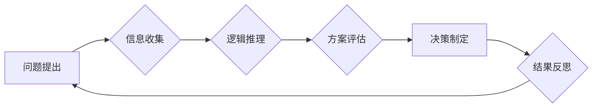

> 
> 1. 批判性思维
> 2. 逻辑推理
> 3. 算法设计
> 4. 问题解决
> 5. 创新思维
> 6. 技术决策
> 7. 编程实践

## 1. 背景介绍

在当今科技日新月异的时代，信息爆炸和技术迭代的速度令人眼花缭乱。面对海量数据和复杂问题，仅仅依靠经验和直觉已经无法满足需求。批判性思维（Critical Thinking）作为一种重要的认知能力，在科技领域显得尤为重要。它指代一种能够系统地分析、评估和解决问题的能力，能够识别信息中的偏差和谬误，并做出理性的判断和决策。

对于程序员、软件架构师、CTO等技术人员而言，批判性思维是必不可少的技能。它不仅能够帮助他们更高效地解决技术难题，还能促进创新思维，提升团队协作效率，并做出更明智的技术决策。

## 2. 核心概念与联系

批判性思维的核心概念包括：

* **逻辑推理：** 运用逻辑规则和推理方法，从已知信息出发，推导新的结论。
* **信息辨别：** 能够识别信息来源的可靠性，区分事实和观点，识别信息中的偏差和误导。
* **问题分析：** 将复杂问题分解成更小的子问题，识别问题的根源和关键因素。
* **方案评估：** 能够评估不同方案的优缺点，选择最优的解决方案。
* **反思与总结：** 反思自己的思维过程，识别自己的认知偏差，不断改进自己的批判性思维能力。

**Mermaid 流程图：**



## 3. 核心算法原理 & 具体操作步骤

### 3.1  算法原理概述

在计算机科学领域，算法是解决特定问题的指令序列。批判性思维在算法设计和优化过程中发挥着重要作用。

* **问题分析：** 首先需要对问题进行深入分析，明确问题的本质、边界条件和目标。
* **算法设计：** 根据问题特点，设计出合理的算法方案，并考虑算法的效率、稳定性和可读性。
* **算法测试：** 对设计出的算法进行测试，验证其正确性和效率，并根据测试结果进行改进。

### 3.2  算法步骤详解

以排序算法为例，其核心步骤包括：

1. **选择排序算法：** 比较相邻元素，将较大的元素移到末尾。
2. **循环迭代：** 重复步骤1，直到整个数组有序。
3. **时间复杂度分析：** 选择排序算法的时间复杂度为O(n^2)，效率较低。

### 3.3  算法优缺点

选择排序算法的优点：

* 实现简单，易于理解。
* 稳定性较好，相同元素的相对顺序不会改变。

缺点：

* 时间复杂度较高，效率较低。

### 3.4  算法应用领域

选择排序算法应用于：

* 数据排序
* 数据分析
* 算法研究

## 4. 数学模型和公式 & 详细讲解 & 举例说明

### 4.1  数学模型构建

在算法设计和分析中，数学模型可以帮助我们更清晰地描述算法的运行过程和性能。例如，时间复杂度可以用数学公式来表示，例如：

$$T(n) = O(n^2)$$

其中，T(n)表示算法的时间复杂度，n表示输入数据的大小。

### 4.2  公式推导过程

时间复杂度公式的推导过程通常需要分析算法的执行次数和数据访问次数。例如，选择排序算法的执行次数与输入数据大小的平方成正比，因此其时间复杂度为O(n^2)。

### 4.3  案例分析与讲解

以冒泡排序算法为例，其时间复杂度为O(n^2)。

**算法步骤：**

1. 比较相邻元素，如果顺序错误，则交换位置。
2. 重复步骤1，直到整个数组有序。

**时间复杂度分析：**

* 最坏情况：需要进行n-1轮比较，每轮比较需要进行n-1次交换。
* 总共执行次数为： (n-1) * (n-1) = O(n^2)

## 5. 项目实践：代码实例和详细解释说明

### 5.1  开发环境搭建

使用Python语言进行代码实现，需要安装Python环境和相关库。

### 5.2  源代码详细实现

```python
def selection_sort(arr):
    n = len(arr)
    for i in range(n):
        min_idx = i
        for j in range(i+1, n):
            if arr[min_idx] > arr[j]:
                min_idx = j
        arr[i], arr[min_idx] = arr[min_idx], arr[i]
    return arr

# 测试代码
arr = [64, 25, 12, 22, 11]
sorted_arr = selection_sort(arr)
print("排序后的数组:", sorted_arr)
```

### 5.3  代码解读与分析

* `selection_sort(arr)`函数接收一个数组`arr`作为输入。
* 外层循环`for i in range(n)`遍历数组，每次选择一个元素作为最小值。
* 内层循环`for j in range(i+1, n)`比较当前最小值与后续元素，更新最小值索引。
* 最后交换当前元素与最小值，实现排序。

### 5.4  运行结果展示

```
排序后的数组: [11, 12, 22, 25, 64]
```

## 6. 实际应用场景

批判性思维在软件开发、产品设计、技术决策等多个方面都有着广泛的应用场景。

### 6.1  软件开发

* **问题分析：** 理解用户需求，分析软件功能需求，识别潜在问题。
* **算法设计：** 选择合适的算法解决问题，并进行性能分析和优化。
* **代码审查：** 审查代码质量，识别潜在的bug和安全漏洞。
* **测试用例设计：** 设计合理的测试用例，确保软件功能正确性和稳定性。

### 6.2  产品设计

* **用户研究：** 通过用户调研和分析，了解用户需求和痛点。
* **产品原型设计：** 设计产品原型，并进行用户测试和迭代优化。
* **产品决策：** 基于数据分析和用户反馈，做出合理的决策。

### 6.3  技术决策

* **技术选型：** 评估不同技术方案的优缺点，选择最合适的方案。
* **风险评估：** 识别技术风险，并制定相应的应对措施。
* **技术趋势分析：** 关注技术发展趋势，并进行技术预判和规划。

### 6.4  未来应用展望

随着人工智能、大数据等技术的快速发展，批判性思维在未来将发挥更加重要的作用。

* **自动化决策：** 人工智能系统需要具备批判性思维能力，才能做出更智能和合理的决策。
* **数据分析：** 大数据时代，需要具备批判性思维能力，才能有效地分析和解读海量数据。
* **创新驱动：** 批判性思维是推动科技创新的关键因素，能够帮助我们发现新的问题和解决方案。

## 7. 工具和资源推荐

### 7.1  学习资源推荐

* **书籍：**
    * 《批判性思维》
    * 《思考，快与慢》
    * 《有效的学习》
* **在线课程：**
    * Coursera: Critical Thinking
    * edX: Introduction to Critical Thinking

### 7.2  开发工具推荐

* **代码编辑器：** VS Code, Sublime Text, Atom
* **版本控制系统：** Git, GitHub
* **调试工具：** GDB, pdb

### 7.3  相关论文推荐

* **论文：**
    * "A Framework for Critical Thinking in Software Engineering"
    * "The Role of Critical Thinking in Software Development"

## 8. 总结：未来发展趋势与挑战

### 8.1  研究成果总结

批判性思维在科技领域的重要性日益凸显，研究成果表明，批判性思维能够提高算法设计效率、提升软件质量、促进创新思维。

### 8.2  未来发展趋势

未来，批判性思维的研究将更加注重：

* **人工智能与批判性思维的融合：** 研究如何将批判性思维融入人工智能系统，使其能够更智能地分析和决策。
* **批判性思维的量化评估：** 开发更有效的工具和方法，对批判性思维能力进行量化评估。
* **批判性思维的教育与培养：** 探索更有效的教育方法，培养学生的批判性思维能力。

### 8.3  面临的挑战

* **批判性思维的复杂性：** 批判性思维是一个复杂的认知能力，难以用简单的模型或算法来描述。
* **批判性思维的培养难度：** 批判性思维需要长期积累和实践，难以通过短期培训来提高。
* **批判性思维的应用场景多样性：** 批判性思维在不同的领域和场景下，需要不同的应用方法和策略。

### 8.4  研究展望

未来，我们将继续深入研究批判性思维在科技领域的应用，探索其更广泛的应用场景和潜在价值。


## 9. 附录：常见问题与解答

**问题：** 如何提高批判性思维能力？

**解答：**

* **多阅读：** 阅读不同领域的书籍和文章，接触不同的观点和信息。
* **多思考：** 对所读所闻的内容进行深入思考，分析其逻辑性和合理性。
* **多提问：** 不断提出问题，挑战既有观点，寻求更深入的理解。
* **多实践：** 通过实际项目和案例，锻炼批判性思维能力。

**问题：** 批判性思维与创造性思维有什么关系？

**解答：** 批判性思维和创造性思维是相互补充的。批判性思维能够帮助我们识别问题和分析问题，而创造性思维能够帮助我们提出新的解决方案。

**问题：** 批判性思维在软件开发中的应用有哪些？

**解答：** 批判性思维在软件开发中的应用非常广泛，例如：

* **需求分析：** 理解用户需求，识别潜在问题。
* **算法设计：** 选择合适的算法解决问题，并进行性能分析和优化。
* **代码审查：** 审查代码质量，识别潜在的bug和安全漏洞。
* **测试用例设计：** 设计合理的测试用例，确保软件功能正确性和稳定性。


作者：禅与计算机程序设计艺术 / Zen and the Art of Computer Programming 
<end_of_turn>