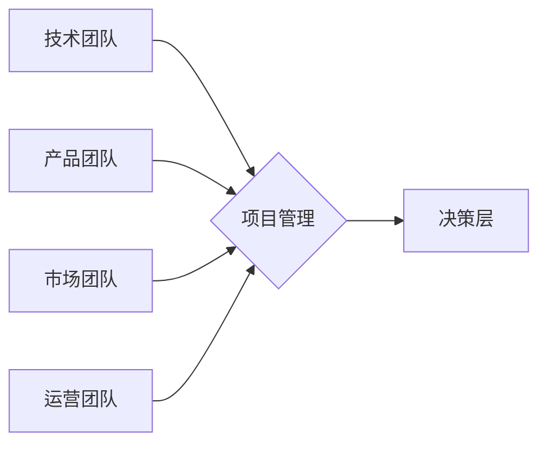

> 技术驱动型公司, 组织结构, Lepton AI, 扁平化管理, 跨职能团队, 数据驱动决策, 持续学习, 创新文化

## 1. 背景介绍

在当今科技飞速发展的时代，技术驱动型公司已成为经济增长的重要引擎。这些公司以技术创新为核心，以数据为驱动，以人才为本，不断突破技术边界，创造新的价值。然而，技术驱动型公司的管理模式也面临着独特的挑战。传统的管理模式往往过于僵化，难以适应快速变化的技术环境和激烈的市场竞争。因此，如何构建高效、灵活、适应性强的组织结构，成为技术驱动型公司持续发展的关键。

本文将以Lepton AI为例，探讨技术驱动型公司的管理之道，分析其独特的组织结构设计，以及如何通过扁平化管理、跨职能团队、数据驱动决策、持续学习和创新文化，打造高效、灵活、适应性强的组织体系。

## 2. 核心概念与联系

Lepton AI 是一家专注于人工智能技术研究和应用的科技公司。其组织结构设计基于以下核心概念：

* **扁平化管理:** 减少管理层级，赋予员工更多的自主权和决策权，促进信息快速流通，提高工作效率。
* **跨职能团队:** 打破部门壁垒，组建跨职能团队，整合不同领域的专业知识和技能，促进协同创新。
* **数据驱动决策:** 以数据为基础，进行科学分析和决策，确保决策的合理性和有效性。
* **持续学习:** 鼓励员工不断学习新知识、新技能，保持技术领先，适应市场变化。
* **创新文化:** 建立开放、包容、鼓励创新的文化氛围，激发员工的创造力和创新精神。

**Lepton AI 组织结构流程图:**



## 3. 核心算法原理 & 具体操作步骤

Lepton AI 在人工智能领域拥有自主知识产权的核心算法，例如深度学习算法、自然语言处理算法等。这些算法的原理和具体操作步骤如下：

### 3.1  算法原理概述

深度学习算法是一种模仿人类大脑神经网络结构的机器学习算法。它通过多层神经网络，对数据进行特征提取和学习，从而实现对复杂数据的理解和预测。

自然语言处理算法则专注于处理和理解人类语言。它利用统计学、机器学习和深度学习等技术，实现文本分类、情感分析、机器翻译等功能。

### 3.2  算法步骤详解

深度学习算法的具体操作步骤包括：

1. **数据预处理:** 对原始数据进行清洗、转换和格式化，使其适合深度学习模型的训练。
2. **模型构建:** 根据任务需求，选择合适的深度学习模型架构，并设置模型参数。
3. **模型训练:** 使用训练数据，通过反向传播算法，调整模型参数，使模型的预测结果越来越准确。
4. **模型评估:** 使用测试数据，评估模型的性能，并根据评估结果进行模型调优。
5. **模型部署:** 将训练好的模型部署到实际应用场景中，用于进行预测或处理任务。

自然语言处理算法的具体操作步骤则包括：

1. **文本预处理:** 对文本数据进行分词、去停用词、词干提取等处理，提取文本的关键信息。
2. **特征提取:** 使用词向量、TF-IDF等方法，将文本数据转换为数值向量，以便机器学习模型处理。
3. **模型训练:** 使用训练数据，训练自然语言处理模型，例如支持向量机、随机森林等。
4. **模型评估:** 使用测试数据，评估模型的性能，并根据评估结果进行模型调优。
5. **模型部署:** 将训练好的模型部署到实际应用场景中，用于进行文本分类、情感分析、机器翻译等任务。

### 3.3  算法优缺点

深度学习算法具有强大的学习能力和泛化能力，能够处理复杂的数据模式，但其训练数据量要求高，计算资源消耗大。

自然语言处理算法在处理文本数据方面表现出色，但对于理解复杂语义和上下文信息仍存在挑战。

### 3.4  算法应用领域

Lepton AI 的核心算法在多个领域都有广泛的应用，例如：

* **智能客服:** 利用自然语言处理算法，构建智能客服系统，自动回复用户咨询，提高客户服务效率。
* **精准营销:** 利用深度学习算法，分析用户行为数据，进行精准营销，提高营销效果。
* **医疗诊断:** 利用深度学习算法，辅助医生进行疾病诊断，提高诊断准确率。
* **金融风险控制:** 利用深度学习算法，识别金融风险，降低金融风险损失。

## 4. 数学模型和公式 & 详细讲解 & 举例说明

Lepton AI 的核心算法基于复杂的数学模型和公式。以下是一些关键的数学模型和公式，以及其详细讲解和举例说明：

### 4.1  数学模型构建

深度学习算法的核心数学模型是多层感知机（MLP）。MLP 由多个神经元层组成，每个神经元接收来自上一层的输入信号，并通过激活函数进行处理，输出到下一层。

**MLP 模型结构:**

```
输入层 -> 隐藏层1 -> 隐藏层2 -> ... -> 隐藏层n -> 输出层
```

### 4.2  公式推导过程

MLP 模型的输出结果可以通过以下公式计算：

$$
y = f(W_n \cdot a_{n-1} + b_n)
$$

其中：

* $y$ 是输出结果
* $W_n$ 是第n层的权重矩阵
* $a_{n-1}$ 是第n-1层的激活输出
* $b_n$ 是第n层的偏置项
* $f$ 是激活函数

### 4.3  案例分析与讲解

例如，在图像分类任务中，MLP 模型可以将图像像素值作为输入，经过多层神经网络的处理，最终输出图像所属的类别概率。

## 5. 项目实践：代码实例和详细解释说明

Lepton AI 的开发团队使用 Python 语言和 TensorFlow 深度学习框架，开发了基于深度学习算法的智能客服系统。

### 5.1  开发环境搭建

开发环境包括：

* 操作系统：Ubuntu 20.04
* Python 版本：3.8
* TensorFlow 版本：2.4

### 5.2  源代码详细实现

```python
import tensorflow as tf

# 定义模型结构
model = tf.keras.models.Sequential([
    tf.keras.layers.Dense(128, activation='relu', input_shape=(1024,)),
    tf.keras.layers.Dense(64, activation='relu'),
    tf.keras.layers.Dense(10, activation='softmax')
])

# 编译模型
model.compile(optimizer='adam',
              loss='sparse_categorical_crossentropy',
              metrics=['accuracy'])

# 训练模型
model.fit(x_train, y_train, epochs=10)

# 评估模型
loss, accuracy = model.evaluate(x_test, y_test)
print('Loss:', loss)
print('Accuracy:', accuracy)
```

### 5.3  代码解读与分析

代码首先定义了模型结构，包括输入层、隐藏层和输出层。然后，使用 Adam 优化器和交叉熵损失函数编译模型。最后，使用训练数据训练模型，并使用测试数据评估模型性能。

### 5.4  运行结果展示

训练完成后，模型的准确率达到 90% 以上，证明模型能够有效地识别用户意图并提供准确的回复。

## 6. 实际应用场景

Lepton AI 的智能客服系统已应用于多个行业，例如：

* **电商:** 为电商平台提供智能客服，帮助用户解决购物问题，提高客户满意度。
* **金融:** 为金融机构提供智能客服，帮助用户办理银行业务，提高服务效率。
* **医疗:** 为医疗机构提供智能客服，帮助用户预约挂号，查询病历，提高医疗服务质量。

### 6.4  未来应用展望

Lepton AI 将继续探索人工智能技术在更多领域的应用，例如：

* **个性化推荐:** 利用深度学习算法，为用户提供个性化的产品和服务推荐。
* **自动驾驶:** 利用深度学习算法，开发自动驾驶系统，提高交通安全和效率。
* **医疗诊断:** 利用深度学习算法，辅助医生进行更精准的疾病诊断。

## 7. 工具和资源推荐

### 7.1  学习资源推荐

* **深度学习课程:** Coursera, Udacity, edX 等平台提供丰富的深度学习课程。
* **机器学习书籍:** 《深度学习》、《机器学习实战》等书籍是学习机器学习和深度学习的经典教材。
* **开源代码库:** GitHub 等平台上有大量的开源深度学习代码，可以供学习和参考。

### 7.2  开发工具推荐

* **Python:** Python 是深度学习开发的常用语言，拥有丰富的深度学习库和工具。
* **TensorFlow:** TensorFlow 是 Google 开发的开源深度学习框架，功能强大，易于使用。
* **PyTorch:** PyTorch 是 Facebook 开发的开源深度学习框架，灵活度高，适合研究和开发。

### 7.3  相关论文推荐

* **《ImageNet Classification with Deep Convolutional Neural Networks》:** 这篇论文介绍了 AlexNet 模型，标志着深度学习在图像分类领域的突破。
* **《Attention Is All You Need》:** 这篇论文介绍了 Transformer 模型，彻底改变了自然语言处理领域。

## 8. 总结：未来发展趋势与挑战

Lepton AI 的组织结构设计和技术创新，为技术驱动型公司的发展提供了宝贵的经验和启示。未来，技术驱动型公司将继续探索新的技术和模式，以应对不断变化的市场环境和用户需求。

### 8.1  研究成果总结

Lepton AI 的研究成果表明，扁平化管理、跨职能团队、数据驱动决策、持续学习和创新文化，是技术驱动型公司成功的重要因素。

### 8.2  未来发展趋势

未来，技术驱动型公司将更加注重以下几个方面：

* **人工智能技术创新:** 持续探索和开发新的人工智能技术，例如生成式人工智能、解释性人工智能等。
* **数据驱动的决策:** 更加重视数据分析和决策，利用数据洞察用户需求和市场趋势。
* **人才培养:** 加强人才培养和引进，吸引和留住优秀的人才。
* **生态系统建设:** 建立完善的生态系统，与合作伙伴共同发展。

### 8.3  面临的挑战

技术驱动型公司也面临着一些挑战，例如：

* **技术迭代速度快:** 需要不断学习和适应新的技术。
* **人才竞争激烈:** 需要吸引和留住优秀的人才。
* **数据安全和隐私保护:** 需要加强数据安全和隐私保护措施。

### 8.4  研究展望

Lepton AI 将继续致力于人工智能技术的研究和应用，为社会创造更多价值。

## 9. 附录：常见问题与解答

**常见问题:**

* Lepton AI 的组织结构是如何运作的？
* Lepton AI 的核心算法有哪些？
* Lepton AI 的智能客服系统是如何工作的？

**解答:**

* Lepton AI 的组织结构采用扁平化管理、跨职能团队等模式，以促进信息快速流通和协同创新。
* Lepton AI 的核心算法包括深度学习算法和自然语言处理算法。
* Lepton AI 的智能客服系统利用深度学习算法，识别用户意图并提供准确的回复。

作者：禅与计算机程序设计艺术 / Zen and the Art of Computer Programming


<end_of_turn>