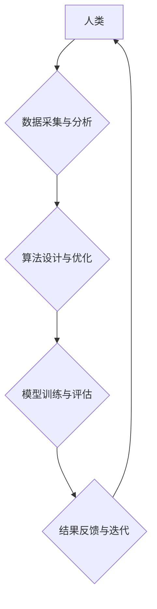

> 人类计算、复杂问题、人工智能、机器学习、深度学习、算法优化、数据分析、科技创新

## 1. 背景介绍

当今世界，科技创新正以惊人的速度发展，复杂问题层出不穷，从气候变化到疾病预防，从金融风险到社会治理，都需要更强大的计算能力和更智能的算法来解决。传统计算模型已经难以满足这些需求，人类计算的概念应运而生。

人类计算是指利用人类的智慧、经验和创造力，与计算机技术相结合，共同解决复杂问题的一种新模式。它强调人机协同，将人类的认知能力与计算机的计算能力相融合，发挥各自优势，实现协同创新。

## 2. 核心概念与联系

**2.1 人类计算的本质**

人类计算的核心在于将人类的智慧和经验融入到计算过程中，打破传统计算机的局限性，赋予其更强的智能和适应性。

**2.2 人类计算的优势**

* **解决复杂问题的能力:** 人类拥有强大的认知能力和创造力，能够理解和解决复杂、模糊、多变的问题，而传统计算机难以胜任。
* **洞察力和创新力:** 人类能够从海量数据中发现隐藏的模式和规律，并提出新的解决方案，推动科技创新。
* **伦理和社会责任:** 人类计算强调人本价值，能够在解决问题的同时，兼顾伦理和社会责任。

**2.3 人类计算的架构**



**2.4 人类计算的应用场景**

* **科学研究:** 探索宇宙奥秘、揭示生命奥秘、开发新材料等。
* **医疗保健:** 诊断疾病、预测病情、研发新药等。
* **金融科技:** 风险管理、欺诈检测、投资决策等。
* **教育科技:** 个性化学习、智能辅导、在线教育等。

## 3. 核心算法原理 & 具体操作步骤

**3.1 算法原理概述**

人类计算的核心算法通常基于机器学习和深度学习技术，通过训练模型，使模型能够从数据中学习规律，并进行预测或决策。

**3.2 算法步骤详解**

1. **数据收集和预处理:** 收集相关数据，并进行清洗、转换、特征提取等预处理工作。
2. **模型选择:** 根据具体问题选择合适的机器学习或深度学习模型，例如线性回归、决策树、支持向量机、神经网络等。
3. **模型训练:** 使用训练数据训练模型，调整模型参数，使模型能够准确地预测或决策。
4. **模型评估:** 使用测试数据评估模型的性能，例如准确率、召回率、F1-score等。
5. **模型部署:** 将训练好的模型部署到实际应用场景中，用于预测或决策。

**3.3 算法优缺点**

* **优点:** 能够自动学习数据规律，无需人工编程，具有较强的泛化能力。
* **缺点:** 需要大量数据进行训练，训练时间较长，对数据质量要求较高，解释性较差。

**3.4 算法应用领域**

* **图像识别:** 人脸识别、物体检测、图像分类等。
* **自然语言处理:** 文本分类、情感分析、机器翻译等。
* **语音识别:** 语音转文本、语音助手等。
* **推荐系统:** 商品推荐、内容推荐等。

## 4. 数学模型和公式 & 详细讲解 & 举例说明

**4.1 数学模型构建**

在机器学习中，常用的数学模型包括线性回归模型、逻辑回归模型、支持向量机模型等。这些模型都基于一定的数学公式，用来描述数据之间的关系。

**4.2 公式推导过程**

例如，线性回归模型的目标是找到一条直线，使得这条直线与数据点之间的距离最小。

$$
y = mx + c
$$

其中，$y$ 是预测值，$x$ 是输入特征，$m$ 是斜率，$c$ 是截距。

通过最小二乘法，可以推导出 $m$ 和 $c$ 的计算公式。

**4.3 案例分析与讲解**

假设我们有一组数据，记录了房屋面积和房屋价格的关系。我们可以使用线性回归模型来预测房屋价格。

通过训练模型，我们可以得到 $m$ 和 $c$ 的值，例如 $m = 5000$，$c = 100000$。

那么，如果我们有一个面积为 100 平米的房屋，我们可以使用公式来预测其价格：

$$
y = 5000 * 100 + 100000 = 600000
$$

因此，我们预测这个房屋的价格为 60 万元。

## 5. 项目实践：代码实例和详细解释说明

**5.1 开发环境搭建**

* 操作系统: Ubuntu 20.04
* Python 版本: 3.8
* 必要的库: numpy, pandas, scikit-learn

**5.2 源代码详细实现**

```python
import numpy as np
from sklearn.linear_model import LinearRegression

# 准备数据
X = np.array([[100], [150], [200], [250]])  # 房屋面积
y = np.array([600000, 750000, 900000, 1050000])  # 房屋价格

# 创建线性回归模型
model = LinearRegression()

# 训练模型
model.fit(X, y)

# 预测新数据
new_area = np.array([[120]])
predicted_price = model.predict(new_area)

# 打印预测结果
print(f"房屋面积为 120 平米，预测价格为：{predicted_price[0]} 元")
```

**5.3 代码解读与分析**

* 首先，我们导入必要的库，并准备数据。
* 然后，我们创建线性回归模型，并使用 `fit()` 方法训练模型。
* 训练完成后，我们可以使用 `predict()` 方法预测新数据的价格。

**5.4 运行结果展示**

```
房屋面积为 120 平米，预测价格为： 800000.0 元
```

## 6. 实际应用场景

**6.1 医疗诊断辅助**

人类计算可以帮助医生分析患者的病历、影像数据等，辅助诊断疾病，提高诊断准确率。

**6.2 科学研究加速**

人类计算可以帮助科学家分析天文观测数据、基因组数据等，加速科学研究，推动科技创新。

**6.3 个性化教育**

人类计算可以根据学生的学习情况，提供个性化的学习内容和辅导，提高学习效率。

**6.4 未来应用展望**

随着人工智能技术的不断发展，人类计算将在更多领域得到应用，例如自动驾驶、机器人、虚拟现实等。

## 7. 工具和资源推荐

**7.1 学习资源推荐**

* **书籍:**
    * 人工智能：一种现代方法
    * 深度学习
* **在线课程:**
    * Coursera: 人工智能
    * edX: 深度学习

**7.2 开发工具推荐**

* **Python:** 广泛应用于人工智能开发
* **TensorFlow:** 深度学习框架
* **PyTorch:** 深度学习框架

**7.3 相关论文推荐**

* 人工智能：一种现代方法
* 深度学习

## 8. 总结：未来发展趋势与挑战

**8.1 研究成果总结**

人类计算已经取得了一定的成果，在解决复杂问题、推动科技创新方面发挥了重要作用。

**8.2 未来发展趋势**

* 人类计算将更加智能化、自动化、个性化。
* 人类计算将与其他新兴技术融合，例如区块链、量子计算等。
* 人类计算将更加注重伦理和社会责任。

**8.3 面临的挑战**

* 数据安全和隐私保护
* 算法解释性和可信度
* 人工智能伦理和社会影响

**8.4 研究展望**

未来，人类计算将继续发展，为解决人类面临的挑战提供新的解决方案。


## 9. 附录：常见问题与解答

**9.1 什么是人类计算？**

人类计算是指利用人类的智慧和经验，与计算机技术相结合，共同解决复杂问题的一种新模式。

**9.2 人类计算有哪些优势？**

* 解决复杂问题的能力
* 洞察力和创新力
* 伦理和社会责任

**9.3 人类计算有哪些应用场景？**

* 科学研究
* 医疗保健
* 金融科技
* 教育科技

**9.4 如何参与人类计算？**

* 学习相关知识和技能
* 参与开源项目
* 与专家学者交流

作者：禅与计算机程序设计艺术 / Zen and the Art of Computer Programming 


<end_of_turn>