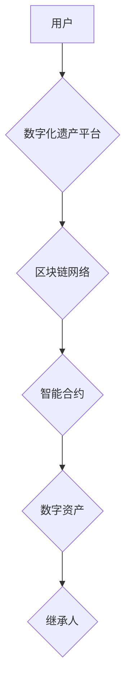

> 数字遗产，虚拟继承，区块链，智能合约，数字资产，永续传承，数据安全，隐私保护

## 1. 背景介绍

随着数字化时代的到来，人类的生活、工作、娱乐等各个方面都与数字世界紧密相连。我们积累了大量的数字资产，包括社交媒体账号、电子文档、加密货币、虚拟物品等。这些数字资产对于我们来说具有重要的个人价值和经济价值。然而，随着时间的推移，这些数字资产面临着以下挑战：

* **数据遗失：** 由于硬件故障、软件崩溃、网络攻击等原因，数字资产可能被永久丢失。
* **继承问题：**  现有的法律法规对于数字资产的继承问题尚未有明确的规定，导致数字资产在继承过程中存在争议和困难。
* **隐私保护：**  数字资产往往包含个人隐私信息，如果这些信息被泄露或滥用，将造成严重的后果。

为了解决这些问题，**数字化遗产虚拟继承**应运而生。它利用区块链技术、智能合约等先进技术，为数字资产的永续传承提供了一种全新的解决方案。

## 2. 核心概念与联系

**数字化遗产**是指个人在数字化生活中积累的所有数字资产，包括但不限于：

* **社交媒体账号：** Facebook、Twitter、Instagram 等社交平台上的账号和数据。
* **电子文档：** 电子邮件、文档、照片、视频等电子文件。
* **加密货币：** 比特币、以太坊等加密货币。
* **虚拟物品：** 游戏道具、虚拟土地、NFT 等虚拟物品。

**虚拟继承**是指利用技术手段，实现对数字化遗产的管理、传承和分配。

**区块链技术**是一种分布式账本技术，它可以确保数据的安全、透明和不可篡改。

**智能合约**是一种自动执行的合约，它可以根据预先设定的规则自动执行交易。

**数字化遗产虚拟继承**的核心概念是将数字化遗产存储在区块链网络中，并使用智能合约来管理和分配这些资产。

**核心架构：**



## 3. 核心算法原理 & 具体操作步骤

### 3.1  算法原理概述

数字化遗产虚拟继承的核心算法原理是基于区块链技术的不可篡改性和透明性，以及智能合约的自动执行能力。

* **数据加密和存储：** 用户的数字化遗产会被加密存储在区块链网络中，确保数据的安全性和不可篡改性。
* **智能合约部署：** 用户可以根据自己的意愿，编写智能合约来指定数字化遗产的继承规则和分配方式。
* **自动执行和分配：** 当用户离世或达到预设条件时，智能合约会自动执行，将数字化遗产分配给指定的继承人。

### 3.2  算法步骤详解

1. **用户注册：** 用户注册数字化遗产平台，并创建自己的账户。
2. **资产上传：** 用户将自己的数字化遗产上传到平台，并进行加密存储。
3. **智能合约编写：** 用户根据自己的意愿，编写智能合约来指定数字化遗产的继承规则和分配方式。
4. **智能合约部署：** 用户将智能合约部署到区块链网络中。
5. **继承人指定：** 用户可以指定多个继承人，并为每个继承人设置不同的继承比例。
6. **触发条件设定：** 用户可以设定触发智能合约执行的条件，例如用户离世、特定日期、特定事件发生等。
7. **资产分配：** 当触发条件满足时，智能合约会自动执行，将数字化遗产按照预设的规则分配给指定的继承人。

### 3.3  算法优缺点

**优点：**

* **安全可靠：** 基于区块链技术的加密存储和智能合约的自动执行，确保数字化遗产的安全性和可靠性。
* **透明公正：** 智能合约的执行过程是公开透明的，避免了人为干预和争议。
* **高效便捷：** 智能合约的自动执行，简化了数字化遗产的继承流程，提高了效率。

**缺点：**

* **技术门槛：** 智能合约的编写和部署需要一定的技术知识和经验。
* **法律法规：** 目前，对于数字化遗产的法律法规尚未完善，存在一定的法律风险。
* **用户认知：** 用户对数字化遗产虚拟继承的认知度还比较低，需要进行更多的宣传和教育。

### 3.4  算法应用领域

数字化遗产虚拟继承的应用领域非常广泛，包括：

* **个人财富管理：** 个人可以利用数字化遗产虚拟继承平台，管理和传承自己的数字化资产。
* **企业资产管理：** 企业可以利用数字化遗产虚拟继承平台，管理和传承企业的知识产权、数据资产等。
* **文化遗产保护：** 数字化遗产虚拟继承可以帮助保护和传承文化遗产，例如历史文献、艺术作品等。

## 4. 数学模型和公式 & 详细讲解 & 举例说明

### 4.1  数学模型构建

数字化遗产虚拟继承的数学模型可以基于概率论和博弈论。

* **概率论：** 用于计算数字化遗产的遗失概率、继承概率等。
* **博弈论：** 用于分析不同继承人之间的利益博弈，并制定合理的分配方案。

### 4.2  公式推导过程

假设有n个继承人，每个继承人对数字化遗产的期望价值为$v_i$，则可以构建一个多目标优化问题：

$$
\max \sum_{i=1}^{n} w_i v_i
$$

其中，$w_i$是第i个继承人的权重，用于反映其对数字化遗产的优先级。

### 4.3  案例分析与讲解

例如，假设有两个继承人，A和B，对数字化遗产的期望价值分别为$v_A=100$和$v_B=50$。如果我们设定A的权重为$w_A=0.7$，B的权重为$w_B=0.3$，则可以计算出数字化遗产的最佳分配方案：

$$
\max (0.7 \times 100 + 0.3 \times 50) = 95
$$

因此，最佳分配方案是将数字化遗产的70%分配给A，30%分配给B。

## 5. 项目实践：代码实例和详细解释说明

### 5.1  开发环境搭建

* **编程语言：** Solidity
* **区块链平台：** Ethereum
* **开发工具：** Remix IDE

### 5.2  源代码详细实现

```solidity
pragma solidity ^0.8.0;

contract DigitalInheritance {

    address public owner;
    mapping(address => uint256) public inheritanceShares;

    constructor() {
        owner = msg.sender;
    }

    function setInheritanceShare(address beneficiary, uint256 share) public {
        require(msg.sender == owner, "Only the owner can set inheritance shares.");
        inheritanceShares[beneficiary] = share;
    }

    function distributeAssets() public {
        require(msg.sender == owner, "Only the owner can distribute assets.");
        // ... 
    }
}
```

### 5.3  代码解读与分析

* **合约定义：** 定义了一个名为`DigitalInheritance`的智能合约。
* **变量声明：** 声明了合约的`owner`变量，用于存储合约的创建者地址，以及`inheritanceShares`映射，用于存储每个受益人的继承比例。
* **构造函数：** 在合约部署时，将合约的创建者地址设置为`owner`。
* **`setInheritanceShare`函数：** 允许合约的创建者设置每个受益人的继承比例。
* **`distributeAssets`函数：** 用于在触发条件满足时，将合约中的资产分配给指定的受益人。

### 5.4  运行结果展示

当合约部署到区块链网络中后，用户可以通过智能合约的接口来设置继承比例和触发资产分配。

## 6. 实际应用场景

数字化遗产虚拟继承可以应用于以下场景：

* **个人财富管理：** 个人可以利用数字化遗产虚拟继承平台，管理和传承自己的社交媒体账号、电子文档、加密货币等资产。
* **企业资产管理：** 企业可以利用数字化遗产虚拟继承平台，管理和传承企业的知识产权、数据资产等。
* **文化遗产保护：** 数字化遗产虚拟继承可以帮助保护和传承文化遗产，例如历史文献、艺术作品等。

### 6.4  未来应用展望

随着区块链技术的不断发展，数字化遗产虚拟继承将会有更广泛的应用场景，例如：

* **数字身份管理：** 利用数字化遗产虚拟继承平台，可以实现数字身份的永续传承，保障个人信息的安全和隐私。
* **数字艺术品交易：** 数字化遗产虚拟继承可以帮助艺术家管理和传承自己的数字艺术品，并实现更便捷的交易。
* **虚拟世界资产管理：** 在虚拟世界中，用户可以利用数字化遗产虚拟继承平台，管理和传承自己的虚拟资产，例如虚拟土地、虚拟物品等。

## 7. 工具和资源推荐

### 7.1  学习资源推荐

* **区块链技术入门书籍：** 《区块链：从入门到实践》
* **智能合约开发教程：** Solidity 官方文档
* **数字化遗产相关研究论文：** IEEE Xplore、ACM Digital Library

### 7.2  开发工具推荐

* **Remix IDE：** 在线 Solidity 智能合约开发环境
* **Truffle Suite：** 智能合约测试和部署工具
* **Ganache：** 本地区块链测试环境

### 7.3  相关论文推荐

* **Digital Inheritance: A Blockchain-Based Approach to Managing and Transferring Digital Assets**
* **The Future of Digital Assets: Legal and Ethical Considerations for Digital Inheritance**

## 8. 总结：未来发展趋势与挑战

### 8.1  研究成果总结

数字化遗产虚拟继承是一个新兴的领域，近年来取得了显著的进展。区块链技术和智能合约为数字化遗产的永续传承提供了技术基础，并为解决数字化遗产继承问题提供了新的解决方案。

### 8.2  未来发展趋势

* **技术创新：** 将继续探索新的技术方案，例如零知识证明、隐私计算等，以提高数字化遗产虚拟继承的安全性、隐私性和效率。
* **法律法规完善：** 随着数字化遗产虚拟继承的应用越来越广泛，需要制定相应的法律法规，规范其发展和应用。
* **用户普及：** 需要加强对用户进行宣传和教育，提高用户对数字化遗产虚拟继承的认知度和接受度。

### 8.3  面临的挑战

* **技术复杂性：** 智能合约的编写和部署需要一定的技术知识和经验，这对普通用户来说有一定的门槛。
* **法律法规不完善：** 目前，对于数字化遗产的法律法规尚未完善，存在一定的法律风险。
* **用户认知度低：** 用户对数字化遗产虚拟继承的认知度还比较低，需要进行更多的宣传和教育。

### 8.4  研究展望

未来，数字化遗产虚拟继承将继续是一个重要的研究方向。我们将继续探索新的技术方案，完善法律法规，提高用户认知度，推动数字化遗产虚拟继承的健康发展。

## 9. 附录：常见问题与解答

**1. 数字化遗产虚拟继承的安全性如何保证？**

数字化遗产虚拟继承基于区块链技术的加密存储和智能合约的自动执行，确保了数据的安全性和可靠性。

**2. 数字化遗产虚拟继承的法律法规如何保障？**

目前，对于数字化遗产的法律法规尚未完善，需要制定相应的法律法规，规范其发展和应用。

**3. 如何使用数字化遗产虚拟继承平台？**

用户需要注册数字化遗产平台，上传自己的数字化资产，并编写智能合约来指定继承规则。

**4. 数字化遗产虚拟继承的费用如何？**

数字化遗产虚拟继承平台的费用会根据平台的具体情况而有所不同，用户需要咨询平台方了解具体的费用标准。


作者：禅与计算机程序设计艺术 / Zen and the Art