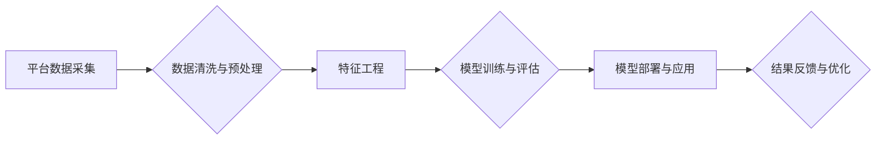

> 平台经济, 数据分析, 数据应用, 研究方法, 算法模型, 案例分析, 平台数据, 用户行为, 

## 1. 背景介绍

平台经济作为一种新型的经济模式，以其连接用户和提供商，创造价值和促进交易的方式，迅速崛起并成为全球经济的重要组成部分。从出行、餐饮到教育、娱乐，平台经济已渗透到人们生活的方方面面。 

数据是平台经济的核心驱动力。平台通过收集、分析和利用用户行为、交易记录、商品信息等海量数据，可以洞察用户需求、优化服务、提升运营效率，并为用户提供个性化体验。因此，数据分析在平台经济中的应用研究具有重要的理论意义和现实价值。

## 2. 核心概念与联系

**2.1 平台经济**

平台经济是指通过搭建线上平台，连接用户和提供商，并通过撮合交易、提供服务、创造价值等方式，实现经济效益的商业模式。

**2.2 数据分析**

数据分析是指对数据进行收集、清洗、整理、分析和挖掘，以发现数据中的规律、趋势和价值，并为决策提供支持的过程。

**2.3 数据应用**

数据应用是指将数据分析的结果应用于实际业务场景，以提升运营效率、优化用户体验、创造新的商业价值。

**2.4 数据分析在平台经济中的应用**

平台经济的数据分析应用涵盖了多个领域，例如：

* **用户行为分析:** 通过分析用户访问、浏览、购买等行为，了解用户需求、偏好和行为模式，为个性化推荐、精准营销提供数据支持。
* **商品推荐分析:** 通过分析用户购买历史、浏览记录、评价等数据，推荐用户可能感兴趣的商品，提高转化率。
* **运营效率优化:** 通过分析平台运营数据，例如用户增长、活跃度、留存率等，优化平台运营策略，提高平台效率。
* **风险控制:** 通过分析用户行为、交易记录等数据，识别潜在的风险行为，降低平台风险。

**2.5 数据分析方法**

常用的数据分析方法包括：

* **描述性分析:** 对数据进行汇总、统计、图表展示，描述数据的基本特征。
* **探索性分析:** 通过数据挖掘、聚类等技术，发现数据中的隐藏规律和模式。
* **预测性分析:** 利用机器学习等算法，预测未来事件的发生概率或趋势。
* **因果分析:** 通过实验、回归分析等方法，探究变量之间的因果关系。

**2.6 数据分析技术**

常用的数据分析技术包括：

* **数据挖掘:** 从海量数据中发现隐藏的模式和规律。
* **机器学习:** 利用算法训练模型，实现数据预测、分类、聚类等功能。
* **深度学习:** 利用多层神经网络，实现更复杂的模式识别和数据分析。
* **大数据技术:** 处理海量数据的技术，例如 Hadoop、Spark 等。

**2.7 数据安全与隐私保护**

在进行数据分析时，需要关注数据安全和隐私保护问题，确保数据的合法性和安全性。

**Mermaid 流程图**



## 3. 核心算法原理 & 具体操作步骤

### 3.1  算法原理概述

数据分析在平台经济中的应用，通常涉及到以下核心算法：

* **推荐算法:** 基于用户行为、商品特征等数据，推荐用户可能感兴趣的商品或服务。常见的推荐算法包括协同过滤、内容过滤、基于知识图谱的推荐等。
* **分类算法:** 将数据划分为不同的类别。常见的分类算法包括逻辑回归、决策树、支持向量机等。
* **聚类算法:** 将数据按照相似性进行分组。常见的聚类算法包括K-means、层次聚类等。
* **预测算法:** 利用历史数据预测未来事件的发生概率或趋势。常见的预测算法包括线性回归、时间序列分析、机器学习等。

### 3.2  算法步骤详解

以推荐算法为例，详细说明其步骤：

1. **数据收集:** 收集用户行为数据、商品信息数据等。
2. **数据预处理:** 清洗、转换、格式化数据，使其适合算法训练。
3. **特征工程:** 从原始数据中提取特征，例如用户评分、购买历史、商品类别等，这些特征可以帮助算法更好地理解用户和商品。
4. **模型训练:** 选择合适的推荐算法，利用训练数据训练模型。
5. **模型评估:** 使用测试数据评估模型的性能，例如准确率、召回率等。
6. **模型部署:** 将训练好的模型部署到线上环境，用于实时推荐。
7. **结果反馈与优化:** 收集用户反馈，分析推荐效果，并根据反馈进行模型优化。

### 3.3  算法优缺点

不同的算法具有不同的优缺点，需要根据实际应用场景选择合适的算法。

* **协同过滤:** 优点：能够发现用户之间的隐性关联，推荐个性化商品。缺点：数据稀疏问题，冷启动问题。
* **内容过滤:** 优点：能够根据商品特征进行推荐，避免数据稀疏问题。缺点：推荐结果可能过于单一，缺乏个性化。
* **基于知识图谱的推荐:** 优点：能够利用知识图谱中的语义信息，进行更精准的推荐。缺点：知识图谱构建成本高。

### 3.4  算法应用领域

推荐算法广泛应用于电商平台、社交媒体、视频网站等平台，用于推荐商品、内容、用户等。

## 4. 数学模型和公式 & 详细讲解 & 举例说明

### 4.1  数学模型构建

推荐算法的数学模型通常基于用户-商品交互矩阵，该矩阵表示用户对商品的评分或购买行为。

**用户-商品交互矩阵:**

```
| 用户 | 商品1 | 商品2 | 商品3 |
|---|---|---|---|
| 用户1 | 5 | 3 | 4 |
| 用户2 | 4 | 5 | 2 |
| 用户3 | 3 | 4 | 5 |
```

其中，每个单元格表示用户对商品的评分或购买行为，例如 5 表示用户对商品评分为 5， 0 表示用户没有购买该商品。

### 4.2  公式推导过程

协同过滤算法的原理是基于用户之间的相似性或商品之间的相似性进行推荐。

**用户相似度计算公式:**

$$
Sim(u_i, u_j) = \frac{\sum_{k=1}^{n} r_{i,k} * r_{j,k}}{\sqrt{\sum_{k=1}^{n} r_{i,k}^2} * \sqrt{\sum_{k=1}^{n} r_{j,k}^2}}
$$

其中：

* $Sim(u_i, u_j)$ 表示用户 $u_i$ 和 $u_j$ 的相似度。
* $r_{i,k}$ 表示用户 $u_i$ 对商品 $k$ 的评分或购买行为。
* $n$ 表示商品总数。

**商品相似度计算公式:**

$$
Sim(i, j) = \frac{\sum_{u=1}^{m} r_{u,i} * r_{u,j}}{\sqrt{\sum_{u=1}^{m} r_{u,i}^2} * \sqrt{\sum_{u=1}^{m} r_{u,j}^2}}
$$

其中：

* $Sim(i, j)$ 表示商品 $i$ 和 $j$ 的相似度。
* $r_{u,i}$ 表示用户 $u$ 对商品 $i$ 的评分或购买行为。
* $m$ 表示用户总数。

### 4.3  案例分析与讲解

假设用户 A 和用户 B 都对商品 1 和商品 2 给出了高评分，则根据用户相似度计算公式，我们可以得出用户 A 和用户 B 相似度较高。因此，我们可以推荐用户 B 可能感兴趣的商品，例如用户 A 购买过的商品 3。

## 5. 项目实践：代码实例和详细解释说明

### 5.1  开发环境搭建

* 操作系统：Windows/macOS/Linux
* Python 版本：3.6+
* 必要的库：pandas, numpy, scikit-learn, matplotlib

### 5.2  源代码详细实现

```python
import pandas as pd
from sklearn.metrics.pairwise import cosine_similarity

# 加载用户-商品交互数据
data = pd.read_csv('user_item_data.csv')

# 构建用户-商品交互矩阵
user_item_matrix = data.pivot_table(index='user_id', columns='item_id', values='rating')

# 计算用户相似度
user_similarity = cosine_similarity(user_item_matrix)

# 获取用户 A 的相似用户
user_a_id = 1
similar_users = user_similarity[user_a_id].argsort()[:-6:-1]  # 排序获取相似用户

# 推荐给用户 A 的商品
recommended_items = []
for similar_user in similar_users:
    user_b_ratings = user_item_matrix.loc[similar_user].fillna(0)  # 填充缺失值
    user_a_ratings = user_item_matrix.loc[user_a_id].fillna(0)
    diff_ratings = user_b_ratings - user_a_ratings
    recommended_items.extend(diff_ratings[diff_ratings > 0].index)

# 去重并输出推荐商品
recommended_items = list(set(recommended_items))
print(f'推荐给用户 {user_a_id} 的商品：{recommended_items}')
```

### 5.3  代码解读与分析

* 代码首先加载用户-商品交互数据，并构建用户-商品交互矩阵。
* 然后，使用余弦相似度计算用户之间的相似度。
* 接着，根据用户 A 的相似用户，推荐用户 A 可能感兴趣的商品。
* 最后，输出推荐商品列表。

### 5.4  运行结果展示

运行代码后，会输出一个包含推荐商品的列表。

## 6. 实际应用场景

### 6.1  电商平台

* **商品推荐:** 根据用户的浏览历史、购买记录等数据，推荐用户可能感兴趣的商品。
* **个性化营销:** 根据用户的兴趣爱好、消费习惯等数据，进行精准营销，提高转化率。
* **库存管理:** 通过分析商品销售数据，预测未来商品需求，优化库存管理。

### 6.2  社交媒体平台

* **内容推荐:** 根据用户的兴趣爱好、关注用户等数据，推荐用户可能感兴趣的内容。
* **用户匹配:** 根据用户的兴趣爱好、社交关系等数据，匹配用户进行社交互动。
* **广告投放:** 根据用户的兴趣爱好、行为数据等，精准投放广告，提高广告效果。

### 6.3  出行平台

* **路线推荐:** 根据用户的出发地、目的地、时间等数据，推荐最优的出行路线。
* **车辆匹配:** 根据用户的出行需求、车辆类型等数据，匹配合适的车辆。
* **价格预测:** 通过分析历史出行数据，预测未来出行价格，帮助用户选择合适的出行时间。

### 6.4  未来应用展望

随着数据量的不断增长和算法技术的不断进步，数据分析在平台经济中的应用将更加广泛和深入。未来，数据分析将被应用于更多领域，例如：

* **个性化服务:** 提供更加个性化的服务，满足用户的个性化需求。
* **智能决策:** 利用数据分析结果，辅助平台决策，提高决策效率。
* **风险控制:** 利用数据分析识别潜在的风险行为，降低平台风险。

## 7. 工具和资源推荐

### 7.1  学习资源推荐

* **书籍:**
    * 《数据挖掘：概念与技术》
    * 《机器学习》
    * 《深度学习》
* **在线课程:**
    * Coursera: 数据科学、机器