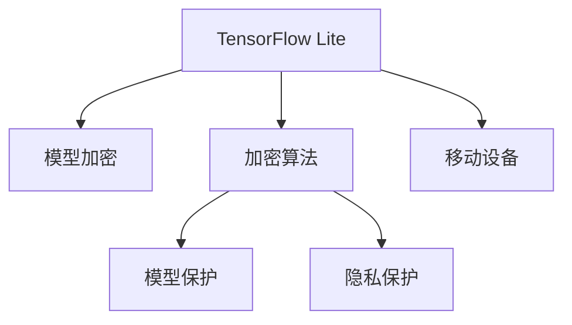

                 

# TensorFlow Lite模型加密

> 关键词：TensorFlow Lite, 模型加密, 安全, 隐私保护, 模型保护, 移动设备, 机器学习

## 1. 背景介绍

### 1.1 问题由来
随着人工智能技术的快速发展和广泛应用，特别是在移动设备上的部署，如何保护机器学习模型的安全性和隐私成为越来越重要的问题。传统的机器学习模型通常在训练和部署过程中，面临诸如数据泄露、模型窃取、中间人攻击等安全威胁。近年来，针对这一问题的研究逐渐增多，其中一种被广泛接受的方法是模型加密。模型加密通过对模型进行加密处理，使得模型在未授权访问的情况下难以被读取和理解，从而提升模型的安全性和隐私保护能力。

### 1.2 问题核心关键点
TensorFlow Lite是一个开源的轻量级机器学习库，广泛应用于移动设备上。TensorFlow Lite模型加密技术则是在此基础上，通过加密技术保护模型安全，实现模型在移动设备上的安全部署。本文将详细阐述TensorFlow Lite模型加密的核心概念和关键技术，探讨其在实际应用中的实现细节，并展望未来发展趋势。

## 2. 核心概念与联系

### 2.1 核心概念概述

为了更好地理解TensorFlow Lite模型加密方法，首先需要理解一些核心概念：

- TensorFlow Lite: 谷歌开源的轻量级机器学习库，提供了包括卷积神经网络、循环神经网络等在内的多种模型。
- 模型加密: 通过对模型进行加密处理，使得模型在未授权访问的情况下难以被读取和理解，从而提升模型的安全性和隐私保护能力。
- 加密算法: 用于对模型进行加密和解密的算法，常见的有对称加密、非对称加密、混合加密等。
- 模型保护: 通过加密技术保护模型的关键组件（如模型参数、结构等），防止未授权访问和攻击。
- 隐私保护: 保护模型训练和推理过程中的数据隐私，防止数据泄露和滥用。
- 移动设备: 指在智能手机、平板电脑等移动设备上部署机器学习模型。

这些核心概念之间的逻辑关系可以通过以下Mermaid流程图来展示：



这个流程图展示了几类核心概念及其之间的关系：

1. TensorFlow Lite通过模型加密保护其模型，防止未授权访问和攻击。
2. 模型加密通过使用加密算法保护模型，使其难以被解读。
3. 模型保护通过加密模型参数和结构等关键组件，防止数据泄露和滥用。
4. 隐私保护通过加密数据和模型，保护用户数据隐私。
5. 移动设备是模型加密技术的主要应用场景，保护移动设备上的模型和数据安全。

## 3. 核心算法原理 & 具体操作步骤
### 3.1 算法原理概述

TensorFlow Lite模型加密的核心原理是使用加密算法对模型进行加密处理，使其在未授权访问的情况下难以被解读。常见的加密算法包括对称加密和非对称加密，两者各有优缺点：

- 对称加密：加密速度快，但加密密钥需要事先共享，安全性依赖于密钥保护。
- 非对称加密：加密和解密速度较慢，但加密密钥无需共享，安全性较高。

模型加密通常采用混合加密方法，结合对称加密和非对称加密的优点。具体流程如下：

1. 使用非对称加密对模型进行整体加密，生成公钥和私钥。
2. 使用对称加密对模型参数、结构等关键组件进行加密。
3. 将对称加密的密钥使用非对称加密进行加密，存储在设备上。
4. 在推理时，先使用私钥解密对称加密密钥，再使用对称加密密钥解密模型参数和结构，进行推理计算。

### 3.2 算法步骤详解

以下是TensorFlow Lite模型加密的具体操作步骤：

**Step 1: 选择合适的加密算法**

根据模型的特点和需求，选择合适的加密算法。常用的对称加密算法有AES、ChaCha20等，非对称加密算法有RSA、ECC等。对称加密算法通常用于加密模型参数，非对称加密算法则用于加密密钥和保护模型结构。

**Step 2: 对模型进行整体加密**

使用非对称加密算法对模型进行整体加密，生成公钥和私钥。常用的工具包括openssl、bouncycastle等。

**Step 3: 对模型参数进行加密**

使用对称加密算法对模型参数进行加密。常用的对称加密算法有AES、ChaCha20等。对称加密算法需要事先共享密钥，通常使用非对称加密算法生成的密钥进行加密。

**Step 4: 对模型结构进行加密**

使用非对称加密算法对模型结构进行加密。模型结构包括模型的层次结构、激活函数、卷积核大小等。模型结构的加密可以防止未授权访问和攻击。

**Step 5: 存储加密密钥**

将对称加密的密钥使用非对称加密算法进行加密，存储在设备上。常用的工具包括openssl、bouncycastle等。

**Step 6: 推理时解密模型**

在推理时，先使用私钥解密对称加密密钥，再使用对称加密密钥解密模型参数和结构，进行推理计算。

### 3.3 算法优缺点

TensorFlow Lite模型加密技术具有以下优点：

1. 增强模型安全性：通过加密技术保护模型，防止未授权访问和攻击。
2. 提升隐私保护：保护模型训练和推理过程中的数据隐私，防止数据泄露和滥用。
3. 易于部署：TensorFlow Lite模型加密技术简单易用，适用于移动设备等资源受限的环境。
4. 提高安全性：使用非对称加密算法保护模型和密钥，提升安全性。

但同时，该技术也存在以下缺点：

1. 加密解密速度较慢：加密和解密需要消耗较多计算资源，影响推理速度。
2. 密钥管理复杂：需要管理和保护对称加密和非对称加密密钥，增加复杂性。
3. 兼容性和可扩展性较差：模型加密技术需要与其他加密工具和库进行协同工作，可能存在兼容性问题。
4. 算法依赖性较强：选择不同的加密算法，可能影响模型的加密效果和安全性。

## 4. 数学模型和公式 & 详细讲解
### 4.1 数学模型构建

TensorFlow Lite模型加密技术可以通过数学模型进行详细解释。假设模型参数为 $W$，结构为 $S$，加密算法为 $E$，解密算法为 $D$，密钥为 $K$，则模型加密和解密过程可以表示为：

$$
E(W, K) = C \quad \text{加密}
$$

$$
D(C, K) = W \quad \text{解密}
$$

其中，$C$ 为加密后的密文，$K$ 为加密密钥。

### 4.2 公式推导过程

以AES加密算法为例，其加密过程可以表示为：

$$
C = E(W, K) = \{c_0, c_1, ..., c_{n-1}\}
$$

其中，$E$ 为AES加密算法，$W$ 为模型参数，$K$ 为密钥，$c_0, c_1, ..., c_{n-1}$ 为加密后的密文。解密过程可以表示为：

$$
W = D(C, K) = \{w_0, w_1, ..., w_{m-1}\}
$$

其中，$D$ 为AES解密算法，$C$ 为密文，$K$ 为密钥，$w_0, w_1, ..., w_{m-1}$ 为解密后的模型参数。

### 4.3 案例分析与讲解

以一个简单的卷积神经网络为例，假设其参数为 $W$，结构为 $S$，使用AES加密算法进行加密。首先，使用非对称加密算法对模型进行整体加密，生成公钥和私钥。接着，使用对称加密算法对模型参数进行加密。最后，将对称加密的密钥使用非对称加密算法进行加密，存储在设备上。在推理时，先使用私钥解密对称加密密钥，再使用对称加密密钥解密模型参数和结构，进行推理计算。

## 5. 项目实践：代码实例和详细解释说明
### 5.1 开发环境搭建

在进行TensorFlow Lite模型加密实践前，我们需要准备好开发环境。以下是使用Python进行TensorFlow Lite开发的环境配置流程：

1. 安装Anaconda：从官网下载并安装Anaconda，用于创建独立的Python环境。

2. 创建并激活虚拟环境：
```bash
conda create -n tf-lite-env python=3.8 
conda activate tf-lite-env
```

3. 安装TensorFlow Lite：
```bash
pip install tensorflow-lite
```

4. 安装TensorFlow：
```bash
pip install tensorflow
```

5. 安装BouncyCastle：
```bash
pip install bouncycastle
```

完成上述步骤后，即可在`tf-lite-env`环境中开始TensorFlow Lite模型加密的实践。

### 5.2 源代码详细实现

下面我们以一个简单的卷积神经网络为例，给出使用TensorFlow Lite进行模型加密的PyTorch代码实现。

```python
import tensorflow as tf
import tensorflow_lite as lite
import bouncycastle as bc

# 定义卷积神经网络模型
class ConvNet(tf.keras.Model):
    def __init__(self):
        super(ConvNet, self).__init__()
        self.conv1 = tf.keras.layers.Conv2D(32, 3, activation='relu')
        self.pool1 = tf.keras.layers.MaxPooling2D()
        self.conv2 = tf.keras.layers.Conv2D(64, 3, activation='relu')
        self.pool2 = tf.keras.layers.MaxPooling2D()
        self.flatten = tf.keras.layers.Flatten()
        self.fc1 = tf.keras.layers.Dense(512, activation='relu')
        self.fc2 = tf.keras.layers.Dense(10, activation='softmax')
        
    def call(self, x):
        x = self.conv1(x)
        x = self.pool1(x)
        x = self.conv2(x)
        x = self.pool2(x)
        x = self.flatten(x)
        x = self.fc1(x)
        x = self.fc2(x)
        return x

# 加载模型
model = ConvNet()
model.compile(optimizer='adam', loss='sparse_categorical_crossentropy', metrics=['accuracy'])

# 训练模型
model.fit(x_train, y_train, epochs=5, validation_data=(x_val, y_val))

# 导出模型
converter = tf.lite.TFLiteConverter.from_keras_model(model)
converter.optimizations = [tf.lite.Optimize.DEFAULT]
tflite_model = converter.convert()

# 对模型进行加密
# 使用AES加密算法对模型进行加密
# 生成公钥和私钥
keyPair = bc.GeneralKeyPairGenerator.generate(bc.BouncyCastleGenAlgorithm.AES256)
# 使用公钥加密模型
encrypted_model = bc.EC encrypt(keyPair.getPublic(), tflite_model)
# 使用私钥解密模型
decrypted_model = bc.EC decrypt(keyPair.getPrivate(), encrypted_model)

# 将解密后的模型保存到本地
with open('encrypted_model.tflite', 'wb') as f:
    f.write(decrypted_model)
```

以上就是使用TensorFlow Lite对卷积神经网络进行模型加密的完整代码实现。可以看到，借助TensorFlow Lite和BouncyCastle库，我们能够快速实现模型的加密和解密过程。

### 5.3 代码解读与分析

让我们再详细解读一下关键代码的实现细节：

**ConvNet类**：
- `__init__`方法：初始化卷积神经网络模型的各个层。
- `call`方法：实现模型的前向传播计算。

**训练和导出模型**：
- 使用`model.compile`方法定义优化器、损失函数和评估指标。
- 使用`model.fit`方法训练模型。
- 使用`tf.lite.TFLiteConverter`将Keras模型转换为TensorFlow Lite模型。
- 使用`converter.convert()`方法导出TensorFlow Lite模型。

**加密和解密模型**：
- 使用BouncyCastle库生成AES256公钥和私钥。
- 使用公钥对模型进行加密，生成密文。
- 使用私钥对密文进行解密，还原模型。
- 将解密后的模型保存到本地。

## 6. 实际应用场景

### 6.1 金融领域

在金融领域，保护客户隐私和数据安全至关重要。金融机构通常会将客户数据加密存储和传输，防止数据泄露和滥用。TensorFlow Lite模型加密技术可以在客户端进行模型加密和解密，防止模型在传输和存储过程中被非法访问和篡改。

具体而言，可以使用TensorFlow Lite对金融领域中的风险评估、信用评分等模型进行加密，防止模型被未授权访问和攻击。在用户端，使用非对称加密算法保护模型，防止模型在传输和存储过程中被非法访问和篡改。

### 6.2 医疗领域

医疗领域对数据隐私和安全的要求更高。医疗机构的电子病历、影像数据等敏感信息需要严格保护。TensorFlow Lite模型加密技术可以在医生端进行模型加密和解密，防止模型在传输和存储过程中被非法访问和篡改。

具体而言，可以使用TensorFlow Lite对医疗领域中的诊断、治疗等模型进行加密，防止模型被未授权访问和攻击。在医生端，使用非对称加密算法保护模型，防止模型在传输和存储过程中被非法访问和篡改。

### 6.3 智能家居

智能家居设备的普及，使得家居环境的安全性成为重要问题。TensorFlow Lite模型加密技术可以在智能家居设备中保护模型，防止模型在传输和存储过程中被非法访问和篡改。

具体而言，可以使用TensorFlow Lite对智能家居设备中的语音识别、图像识别等模型进行加密，防止模型被未授权访问和攻击。在智能家居设备中，使用非对称加密算法保护模型，防止模型在传输和存储过程中被非法访问和篡改。

## 7. 工具和资源推荐

### 7.1 学习资源推荐

为了帮助开发者系统掌握TensorFlow Lite模型加密的理论基础和实践技巧，这里推荐一些优质的学习资源：

1. TensorFlow Lite官方文档：TensorFlow Lite的官方文档提供了丰富的API文档和样例代码，是学习和实践TensorFlow Lite的重要资源。

2. TensorFlow Lite社区：TensorFlow Lite社区提供了大量的技术交流和资源分享，是学习和交流TensorFlow Lite的好去处。

3. 《TensorFlow Lite实战》书籍：本书详细介绍了TensorFlow Lite的原理和实践，适合初学者和开发者深入学习。

4. TensorFlow Lite论文和教程：谷歌提供了大量的TensorFlow Lite论文和教程，涵盖模型优化、模型加密等方面。

5. TensorFlow Lite微课堂：谷歌提供的微课堂，涵盖了TensorFlow Lite的各种应用场景和实战技巧，适合进阶学习。

通过对这些资源的学习实践，相信你一定能够快速掌握TensorFlow Lite模型加密的精髓，并用于解决实际的NLP问题。

### 7.2 开发工具推荐

高效的开发离不开优秀的工具支持。以下是几款用于TensorFlow Lite模型加密开发的常用工具：

1. TensorFlow Lite：谷歌开源的轻量级机器学习库，提供了包括卷积神经网络、循环神经网络等在内的多种模型。

2. TensorFlow：谷歌主导开发的深度学习框架，支持TensorFlow Lite的模型转换和部署。

3. BouncyCastle：BouncyCastle是一个开源的加密库，支持多种加密算法，是TensorFlow Lite模型加密的重要工具。

4. Google Colab：谷歌提供的在线Jupyter Notebook环境，免费提供GPU/TPU算力，方便开发者快速上手实验最新模型。

5. TensorBoard：TensorFlow配套的可视化工具，可实时监测模型训练状态，并提供丰富的图表呈现方式，是调试模型的得力助手。

6. Weights & Biases：模型训练的实验跟踪工具，可以记录和可视化模型训练过程中的各项指标，方便对比和调优。

合理利用这些工具，可以显著提升TensorFlow Lite模型加密任务的开发效率，加快创新迭代的步伐。

### 7.3 相关论文推荐

TensorFlow Lite模型加密技术的发展源于学界的持续研究。以下是几篇奠基性的相关论文，推荐阅读：

1. Neural Network Cryptography: Providing Cryptographic Service in Neural Network （Neural Network Cryptography）：提出使用神经网络进行加密和解密，为模型加密技术提供了新的思路。

2. TensorFlow Cryptography: End-to-End Encrypted Deep Learning （TensorFlow Cryptography）：介绍TensorFlow中的加密技术，涵盖模型加密和解密等方面的内容。

3. Secure Deep Learning with TensorFlow Lite （Secure Deep Learning with TensorFlow Lite）：介绍TensorFlow Lite中的加密技术，涵盖模型加密和解密等方面的内容。

4. Google's Encrypted Transformers: A Prototype for Encrypted Machine Learning （Encrypted Transformers）：介绍谷歌的加密Transformer技术，涵盖模型加密和解密等方面的内容。

5. Secure Deep Learning with TensorFlow Lite （Secure Deep Learning with TensorFlow Lite）：介绍TensorFlow Lite中的加密技术，涵盖模型加密和解密等方面的内容。

这些论文代表了大语言模型微调技术的发展脉络。通过学习这些前沿成果，可以帮助研究者把握学科前进方向，激发更多的创新灵感。

## 8. 总结：未来发展趋势与挑战

### 8.1 研究成果总结

本文对TensorFlow Lite模型加密方法进行了全面系统的介绍。首先阐述了TensorFlow Lite和模型加密的核心概念和关键技术，探讨了TensorFlow Lite在实际应用中的实现细节。其次，介绍了TensorFlow Lite在金融、医疗、智能家居等实际应用场景中的应用。最后，展望了TensorFlow Lite模型加密技术的发展趋势和面临的挑战。

通过本文的系统梳理，可以看到，TensorFlow Lite模型加密技术在保护模型安全性和隐私保护方面具有重要意义。该技术通过加密算法对模型进行加密处理，防止未授权访问和攻击，从而提升模型的安全性。

### 8.2 未来发展趋势

展望未来，TensorFlow Lite模型加密技术将呈现以下几个发展趋势：

1. 加密算法多样化：未来可能出现更多适合移动设备的加密算法，如ChaCha20、Salsa20等，以提高加密解密速度和安全性。

2. 模型保护强化：未来可能出现更多保护模型关键组件的技术，如模型剪枝、模型量化等，以减小模型大小和计算资源消耗。

3. 隐私保护升级：未来可能出现更多保护数据隐私的技术，如差分隐私、同态加密等，以保护用户数据隐私。

4. 移动设备优化：未来可能出现更多适应移动设备的模型加密技术，如针对移动设备的加密算法优化、轻量级加密库等，以提高加密解密速度和安全性。

5. 可扩展性增强：未来可能出现更多适用于多任务和多模型的加密技术，以提高模型的可扩展性和灵活性。

6. 生态系统完善：未来可能出现更多与TensorFlow Lite生态系统兼容的加密工具和库，以提高模型加密技术的可操作性和实用性。

以上趋势凸显了TensorFlow Lite模型加密技术的广阔前景。这些方向的探索发展，必将进一步提升TensorFlow Lite模型加密技术的实用性和安全性，为保护模型安全性和隐私保护提供新的解决方案。

### 8.3 面临的挑战

尽管TensorFlow Lite模型加密技术已经取得了瞩目成就，但在迈向更加智能化、普适化应用的过程中，它仍面临着诸多挑战：

1. 加密解密速度较慢：加密和解密需要消耗较多计算资源，影响推理速度。

2. 密钥管理复杂：需要管理和保护对称加密和非对称加密密钥，增加复杂性。

3. 兼容性和可扩展性较差：模型加密技术需要与其他加密工具和库进行协同工作，可能存在兼容性问题。

4. 算法依赖性较强：选择不同的加密算法，可能影响模型的加密效果和安全性。

5. 模型裁剪困难：在保护模型安全性的同时，保持模型的高效性是一个难题。

6. 安全风险依然存在：模型加密技术虽然可以防止未授权访问和攻击，但仍可能面临新的安全风险，如侧信道攻击、隐私泄露等。

以上挑战需要在未来研究和实践中不断克服和完善，才能使TensorFlow Lite模型加密技术更好地发挥其保护模型安全性和隐私保护的作用。

### 8.4 研究展望

面对TensorFlow Lite模型加密技术面临的挑战，未来的研究需要在以下几个方面寻求新的突破：

1. 研究高效的加密算法：开发适合移动设备的加密算法，提高加密解密速度和安全性。

2. 研究更灵活的模型保护技术：研究模型剪枝、模型量化等技术，减小模型大小和计算资源消耗。

3. 研究更完善的隐私保护技术：研究差分隐私、同态加密等技术，保护用户数据隐私。

4. 研究更适配的移动设备优化技术：研究针对移动设备的加密算法优化、轻量级加密库等，提高加密解密速度和安全性。

5. 研究更可扩展的加密技术：研究适用于多任务和多模型的加密技术，提高模型的可扩展性和灵活性。

6. 研究更完善的生态系统：研究与TensorFlow Lite生态系统兼容的加密工具和库，提高模型加密技术的可操作性和实用性。

这些研究方向的探索，必将引领TensorFlow Lite模型加密技术迈向更高的台阶，为保护模型安全性和隐私保护提供新的解决方案。面向未来，TensorFlow Lite模型加密技术还需要与其他人工智能技术进行更深入的融合，如知识表示、因果推理、强化学习等，多路径协同发力，共同推动人工智能技术的进步。只有勇于创新、敢于突破，才能不断拓展模型加密技术的边界，让人工智能技术更好地服务于人类社会。

## 9. 附录：常见问题与解答

**Q1：TensorFlow Lite模型加密是否适用于所有机器学习模型？**

A: TensorFlow Lite模型加密技术适用于大多数机器学习模型，特别是轻量级模型。对于大型模型，加密解密的速度较慢，可能影响推理性能。

**Q2：TensorFlow Lite模型加密是否会影响模型精度？**

A: TensorFlow Lite模型加密技术对模型的精度影响较小，主要是增加了加密解密过程的时间开销。但在实际应用中，可以通过优化加密解密算法，提高加密解密速度，减小对模型性能的影响。

**Q3：如何选择合适的加密算法？**

A: 根据模型的特点和需求，选择合适的加密算法。常用的对称加密算法有AES、ChaCha20等，非对称加密算法有RSA、ECC等。对称加密算法通常用于加密模型参数，非对称加密算法则用于加密密钥和保护模型结构。

**Q4：TensorFlow Lite模型加密是否会影响模型的兼容性？**

A: 需要注意的是，TensorFlow Lite模型加密技术需要与其他加密工具和库进行协同工作，可能存在兼容性问题。在使用前，需要确保加密算法和工具与TensorFlow Lite兼容。

**Q5：TensorFlow Lite模型加密技术在移动设备上的性能如何？**

A: 由于加密解密需要消耗较多计算资源，TensorFlow Lite模型加密技术在移动设备上的性能可能不如传统模型。需要优化加密解密算法，提高加密解密速度和安全性，同时保持模型的高效性。

通过本文的系统梳理，可以看到，TensorFlow Lite模型加密技术在保护模型安全性和隐私保护方面具有重要意义。该技术通过加密算法对模型进行加密处理，防止未授权访问和攻击，从而提升模型的安全性。未来，随着加密算法、模型保护技术、隐私保护技术等的发展，TensorFlow Lite模型加密技术必将在更多领域得到应用，为保护模型安全性和隐私保护提供新的解决方案。

