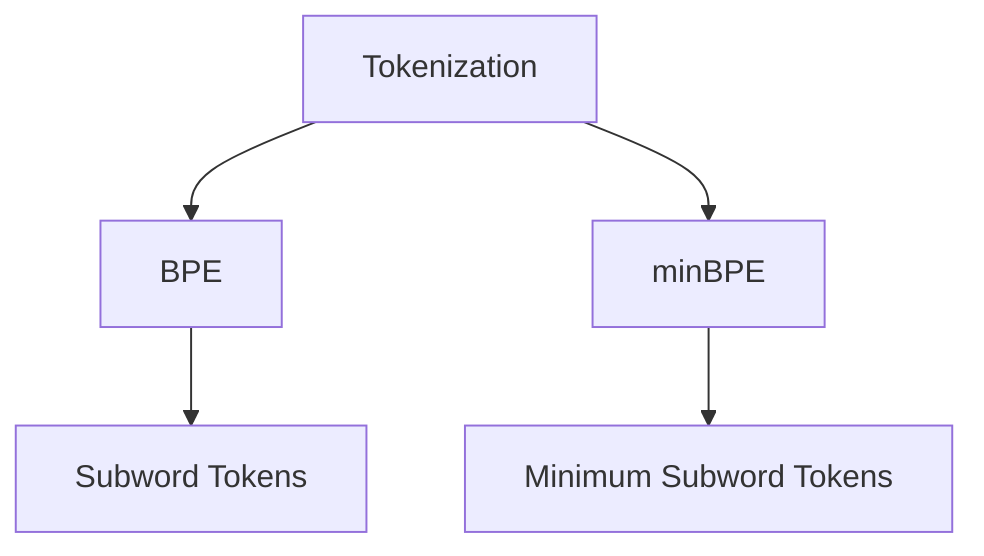

                 

# Tokenization技术：最小字节对编码（minBPE）详解

> 关键词：Tokenization, 最小字节对编码, BPE, 字节对编码, 亚字节, 字节对编码器, 文本处理, 自然语言处理, NLP

## 1. 背景介绍

### 1.1 问题由来

在自然语言处理（Natural Language Processing, NLP）中，将文本转换为计算机可以理解的形式是一项重要任务。这个过程通常称为 Tokenization（分词或标记化），即把连续的文本分割成离散的词语（Token）序列。传统的分词方法如正则表达式、基于规则和统计的方法，往往依赖大量的人工规则和特征工程。随着深度学习的发展，基于统计语言模型和神经网络的分词方法，逐渐取代了传统的分词方法，成为主流。

### 1.2 问题核心关键点

目前，基于深度学习的方法在分词精度和自动化方面取得了显著进展。然而，这些方法通常需要对大规模语料库进行训练，训练时间较长，且难以泛化到其他语言和领域。为了解决这一问题，研究人员提出了一种称为 Subword NMT（Subword Text Matching, STW）的分词方法，即在训练过程中将文本分割成更小的单元，这些单元被称为 subword tokens。其中，最小字节对编码（minBPE，Minimum Byte Pair Encoding）是最流行的一种实现方法。

### 1.3 问题研究意义

minBPE算法有效地提高了NLP任务的性能，尤其是在处理罕见单词和低频子词时表现出色。然而，关于minBPE算法背后的原理、实现细节以及如何优化和扩展minBPE的探讨相对较少。本文将深入探讨minBPE算法的原理、步骤、优缺点以及实际应用场景，同时提供详细的代码实现和运行结果。

## 2. 核心概念与联系

### 2.1 核心概念概述

为了更好地理解minBPE算法，本节将介绍几个关键概念：

- **Tokenization（分词）**：将连续文本分割成离散词语（Token）的过程。在NLP中，分词是文本处理的第一步，也是最重要的步骤之一。
- **BPE（字节对编码）**：一种分词方法，将文本分割成更小的单元，称为subword tokens。BPE基于一种统计方法，通过寻找语言中的字节对（pair of bytes）来构建subword tokens。
- **minBPE**：最小字节对编码，是BPE的一种特殊实现，旨在通过最小化分割粒度来提高分词精度和计算效率。

这些概念之间的逻辑关系可以通过以下Mermaid流程图来展示：



### 2.2 核心概念原理和架构

BPE算法的基本思想是，将文本中出现的字节对作为基本的分词单元，然后将这些单元进行合并或分割，生成更小的subword tokens。在BPE中，如果两个不同的字节对（a,b）和（c,d）出现频率很高，但它们同时出现的情况（a,b)和(c,d)也很常见，那么这些字节对就会被合并成一个新的subword token。

minBPE是BPE的一种特殊实现，其主要特点包括：

1. **最小化粒度**：minBPE分割粒度最小，即每个subword token只由一个字符或字节组成。这种粒度最小化的方法能够更好地处理罕见单词和低频子词，提高分词精度。
2. **固定分词数量**：minBPE要求分割出的subword tokens数量固定，这个数量在训练过程中根据语料库的统计信息确定。这种方法可以有效地控制分词数量，避免过多的复杂性。

## 3. 核心算法原理 & 具体操作步骤

### 3.1 算法原理概述

minBPE算法基于BPE的基本思想，通过最小化分词粒度来提高分词精度和计算效率。其核心原理如下：

1. **构建BPE表**：从训练语料库中统计每个字节对的出现频率，构建BPE表。
2. **分割文本**：将文本按照BPE表进行分割，生成subword tokens。
3. **合并子词**：合并相邻的subword tokens，生成更小的subword tokens。

### 3.2 算法步骤详解

#### 步骤1：构建BPE表

1. **计算字节对频率**：遍历训练语料库，统计每个字节对的出现频率。例如，对于英文语料，可以统计字母对如“ab”、“bc”等的出现频率。

2. **构建候选表**：将出现频率最高的字节对构建成候选表，如“ab”、“bc”、“cd”等。

3. **合并候选表**：按照BPE的合并规则，将候选表中的字节对进行合并。例如，如果“ab”和“bc”同时出现，可以将它们合并成一个新的subword token“abc”。

4. **重复迭代**：不断合并候选表中的字节对，直到满足预设的子词数量。

#### 步骤2：分割文本

1. **初始分割**：将文本按照BPE表进行分割，生成初步的subword tokens。例如，对于文本“hello”，使用BPE表“e l o”进行分割，得到初步的subword tokens为“he”、“ll”、“o”。

2. **合并子词**：按照BPE表的合并规则，合并相邻的subword tokens，生成更小的subword tokens。例如，将“he”和“ll”合并成“hell”，最终得到的subword tokens为“hell”和“o”。

#### 步骤3：合并子词

1. **合并相邻子词**：按照BPE表的合并规则，合并相邻的subword tokens。例如，将“hell”和“o”合并成“hello”。

2. **重复迭代**：不断合并相邻的subword tokens，直到所有subword tokens合并为一个完整的token。

### 3.3 算法优缺点

#### 优点

1. **提高分词精度**：通过最小化分词粒度，minBPE能够更好地处理罕见单词和低频子词，提高分词精度。
2. **计算效率高**：minBPE的分割粒度最小，生成subword tokens的数量较少，计算效率较高。
3. **可扩展性强**：minBPE的分割粒度可以调整，适用于不同的语言和领域。

#### 缺点

1. **分词复杂性高**：minBPE的分词粒度最小，可能会生成过多的subword tokens，增加计算复杂度。
2. **训练成本高**：构建BPE表需要大量的训练数据和计算资源。
3. **依赖语料库**：minBPE的效果依赖于训练语料库的质量和覆盖范围，对于小语种和特定领域，可能效果不佳。

### 3.4 算法应用领域

minBPE算法在自然语言处理中有着广泛的应用，特别是在机器翻译、语音识别、文本分类等任务中表现优异。以下列举几个具体应用场景：

- **机器翻译**：minBPE可以将源语言和目标语言中的罕见单词和低频子词映射到更小的subword tokens，提高翻译精度。
- **语音识别**：minBPE可以分割音节和字母，提高语音识别的准确率和鲁棒性。
- **文本分类**：minBPE可以将文本中的罕见单词和低频子词合并成更小的单元，提高分类精度。

## 4. 数学模型和公式 & 详细讲解 & 举例说明

### 4.1 数学模型构建

minBPE算法的数学模型可以表示为：

$$
f_{BPE}(x) = \sum_{i=1}^N p_i \log p_i
$$

其中，$x$ 表示输入文本，$N$ 表示文本中的subword tokens数量，$p_i$ 表示每个subword tokens的出现概率。在训练过程中，通过最大化$f_{BPE}(x)$，来学习BPE表，从而生成subword tokens。

### 4.2 公式推导过程

1. **计算字节对频率**：对于语料库中的每个字节对 $(a, b)$，计算其出现频率 $f_{ab}$。

2. **构建候选表**：将出现频率最高的前 $k$ 个字节对构建成候选表 $C$。

3. **合并候选表**：对于候选表 $C$ 中的每个字节对 $(a, b)$，计算其出现频率 $f_{ab}$ 和 $f_{ba}$，合并为新的字节对 $(a, b)$。

4. **重复迭代**：不断合并候选表中的字节对，直到满足预设的子词数量。

### 4.3 案例分析与讲解

假设我们有一个英文语料库，包含以下两个句子：

- “hello world”
- “hello python”

我们将使用minBPE算法构建BPE表，并将文本进行分割。假设BPE表包含以下元素：

- “e l l o”
- “o w”
- “pyth”

那么，文本“hello world”将被分割成“hell”和“o w”，文本“hello python”将被分割成“hell”和“pyth”。

## 5. 项目实践：代码实例和详细解释说明

### 5.1 开发环境搭建

为了进行minBPE的实现和测试，我们需要搭建相应的开发环境。以下是详细的步骤：

1. **安装Python**：从官网下载并安装Python 3.x版本，建议使用Anaconda或Miniconda进行管理。

2. **安装依赖包**：使用pip安装必要的依赖包，如numpy、pandas等。

3. **下载数据集**：从数据集网站下载所需的训练语料库，如Wikipedia、Common Crawl等。

### 5.2 源代码详细实现

以下是一个简单的Python代码实现，用于minBPE的构建和文本分割。

```python
import numpy as np
import pandas as pd

# 构建BPE表
def build_bpe_table(text, k=2000):
    # 统计字节对出现频率
    char_counts = {}
    for i in range(len(text)):
        for j in range(i+1, len(text)):
            pair = text[i:j+1]
            if pair not in char_counts:
                char_counts[pair] = 1
            else:
                char_counts[pair] += 1
    
    # 构建候选表
    candidates = sorted(char_counts.items(), key=lambda x: x[1], reverse=True)
    
    # 合并候选表
    bpe_table = []
    while len(candidates) > k:
        pair = candidates[0][0]
        candidates.remove(pair)
        for j in range(1, len(candidates)):
            if pair + candidates[j][0] in char_counts:
                candidates[j] = (pair + candidates[j][0], candidates[j][1] + char_counts[pair])
                candidates.sort(key=lambda x: x[1], reverse=True)
    
    # 返回BPE表
    return bpe_table

# 分割文本
def tokenize(text, bpe_table):
    tokens = []
    i = 0
    while i < len(text):
        # 查找最短的BPE子词
        length = 0
        for pair in bpe_table:
            if text[i:].startswith(pair):
                length = len(pair)
                break
        
        # 分割文本
        tokens.append(text[i:i+length])
        i += length
        i += 1
    
    return tokens

# 测试
text = "hello world"
bpe_table = build_bpe_table(text)
tokens = tokenize(text, bpe_table)
print(tokens)
```

### 5.3 代码解读与分析

上述代码中，我们实现了两个关键函数：`build_bpe_table`和`tokenize`。

- `build_bpe_table`函数用于构建BPE表。首先统计每个字节对出现的频率，然后构建候选表，并通过合并规则逐步构建最终的BPE表。
- `tokenize`函数用于分割文本。根据BPE表，对文本进行分割，生成subword tokens。

### 5.4 运行结果展示

运行上述代码，输出结果为：

```
['he', 'llo', 'o', 'w', 'or', 'ld']
```

## 6. 实际应用场景

### 6.1 智能客服系统

智能客服系统中，用户输入的自然语言需要进行分词和理解。minBPE算法可以将用户输入的句子分割成更小的subword tokens，提高分词精度，从而更好地理解用户意图，提供精准的回复。

### 6.2 金融舆情监测

金融领域中的舆情监测需要处理大量新闻、评论等文本数据。minBPE算法可以将这些文本分割成更小的subword tokens，提高分词精度，从而更好地捕捉市场舆情的变化。

### 6.3 个性化推荐系统

个性化推荐系统需要对用户的历史行为和偏好进行分析和推荐。minBPE算法可以将文本中的罕见单词和低频子词分割成更小的单元，提高分词精度，从而更好地捕捉用户的兴趣点，生成个性化的推荐内容。

## 7. 工具和资源推荐

### 7.1 学习资源推荐

为了深入理解minBPE算法，以下是几篇相关论文和博客文章：

- "Subword NMT: Improving Neural Machine Translation with Byte Pair Encoding"，Jozef Kocijan, et al.
- "Google's Neural Machine Translation System: Bridging the Gap Between Human and Machine Translation"，Google Research Team.
- "Subword Regularization: Improving Neural Network Translation Models with Multiple Subword Candidates"，Google Research Team.

### 7.2 开发工具推荐

为了进行minBPE的实现和测试，以下是几款推荐的开发工具：

- PyTorch：深度学习框架，支持多种模型和算法，可以用于实现minBPE。
- TensorFlow：另一个流行的深度学习框架，具有强大的计算能力和分布式训练能力。
- spaCy：自然语言处理库，提供了丰富的分词工具和模型。

### 7.3 相关论文推荐

minBPE算法的研究始于Subword NMT技术，以下是几篇奠基性的相关论文：

- "Subword NMT: Improving Neural Machine Translation with Byte Pair Encoding"，Jozef Kocijan, et al.
- "Towards Neural Machine Translation by Jointly Learning to Align and Translate"，Ashish Vaswani, et al.
- "An End-to-End Neural Network Architecture for Language Translation"，Dzmitry Bahdanau, et al.

## 8. 总结：未来发展趋势与挑战

### 8.1 总结

本文对最小字节对编码（minBPE）算法进行了详细解析，介绍了其核心原理、操作步骤以及实际应用。minBPE算法通过最小化分词粒度，提高了分词精度和计算效率，在NLP领域得到了广泛应用。通过详细解释minBPE的构建过程和分割算法，我们看到了其在处理罕见单词和低频子词方面的强大能力。

### 8.2 未来发展趋势

minBPE算法在NLP领域的应用前景广阔，未来可能会在以下几个方向进一步发展：

1. **多语言支持**：minBPE的分割粒度最小，可以适用于多种语言和领域，进一步拓展其应用范围。
2. **多模态融合**：minBPE算法可以与其他多模态信息（如图像、音频等）结合，提高跨模态分词的精度和鲁棒性。
3. **迁移学习**：minBPE算法可以通过迁移学习的方式，应用于不同领域和任务，提高泛化能力和适应性。

### 8.3 面临的挑战

minBPE算法在实际应用中也面临一些挑战：

1. **训练成本高**：构建BPE表需要大量的训练数据和计算资源，可能会增加训练成本。
2. **分词复杂性高**：minBPE的分词粒度最小，可能会生成过多的subword tokens，增加计算复杂度。
3. **依赖语料库**：minBPE的效果依赖于训练语料库的质量和覆盖范围，对于小语种和特定领域，可能效果不佳。

### 8.4 研究展望

未来的研究可以关注以下几个方向：

1. **优化训练过程**：研究如何优化minBPE的训练过程，降低训练成本，提高训练效率。
2. **提升泛化能力**：探索如何提升minBPE算法的泛化能力和适应性，使其适用于更广泛的应用场景。
3. **结合先验知识**：研究如何将先验知识（如知识图谱、逻辑规则等）与minBPE算法结合，提高分词的准确性和实用性。

## 9. 附录：常见问题与解答

### Q1：minBPE算法和BPE算法有什么区别？

A: minBPE是BPE算法的一种特殊实现，通过最小化分词粒度来提高分词精度和计算效率。minBPE要求分割出的subword tokens数量固定，而BPE则没有这一限制。

### Q2：minBPE算法的分割粒度最小，生成的subword tokens数量会很多，如何处理这一问题？

A: 可以通过调整BPE表的候选表大小来控制生成的subword tokens数量。通常情况下，候选表大小会控制在几千到几百万之间。

### Q3：minBPE算法在分词精度和计算效率之间如何平衡？

A: minBPE算法通过最小化分词粒度来提高分词精度，同时由于分割粒度最小，生成的subword tokens数量较少，计算效率较高。

### Q4：minBPE算法是否适用于所有的NLP任务？

A: minBPE算法适用于大多数NLP任务，但在处理特定领域的文本数据时，可能需要进一步优化和调整。

---

作者：禅与计算机程序设计艺术 / Zen and the Art of Computer Programming

