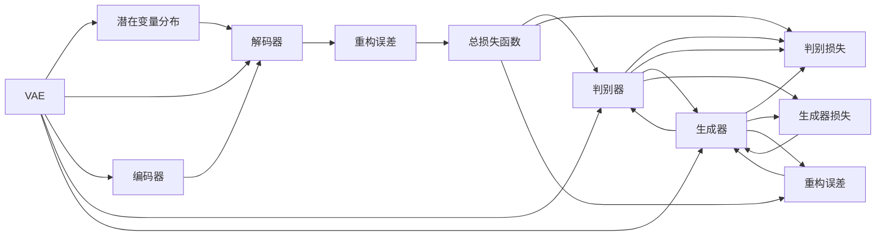

                 

## 1. 背景介绍

在深度学习领域，生成对抗网络 (GANs) 和变分自编码器 (VAEs) 是两种常见的生成模型，它们分别从不同的视角和方式生成新数据。然而，近年来出现了一种新的生成模型，名为变分自编码器 + 生成对抗网络 (VQVAE + VQGAN)，这种模型在生成能力、训练效率和模型复杂度方面有着独特优势。为了深入理解 VQVAE 和 VQGAN 的差异，本文将从核心概念、算法原理、应用领域等多个角度进行详细探讨。

## 2. 核心概念与联系

### 2.1 核心概念概述

**变分自编码器 (VAE)**：
- 是一种生成模型，用于学习数据的潜在表示和分布。VAE 的核心思想是将高维数据压缩到低维潜在空间中，并在此空间中生成新数据。VAE 的潜在变量通常服从多维高斯分布。

**生成对抗网络 (GANs)**：
- 是一种对抗训练的生成模型，由生成器和判别器两个网络组成。生成器网络通过学习真实数据的分布生成假数据，而判别器网络则判别生成的数据和真实数据，两者的对抗训练使得生成器不断提升生成数据的逼真度。

**变分自编码器 + 生成对抗网络 (VQVAE + VQGAN)**：
- 是 VAE 和 GANs 的一种结合形式，通过将 VAE 和 GANs 融合，可以在生成能力、模型复杂度和训练效率方面取得显著提升。VQVAE 和 VQGAN 使用不同的潜在表示方法，使得它们在生成能力上有所差异。

### 2.2 核心概念原理和架构的 Mermaid 流程图



这个 Mermaid 图展示了 VAE 和 VQGAN 的基本架构。VAE 由编码器和解码器组成，其中潜在变量服从高斯分布。而 VQGAN 则包含一个 VAE 和一个 GANs，生成器网络生成数据，判别器网络判别生成数据和真实数据。

## 3. 核心算法原理 & 具体操作步骤

### 3.1 算法原理概述

#### VAE 算法原理：
VAE 通过编码器 $E$ 将输入数据 $x$ 映射到潜在变量 $z$，其中 $z$ 服从高斯分布 $p(z)$。解码器 $D$ 将潜在变量 $z$ 重构回原始数据 $x$。VAE 的目标是最大化数据分布的似然 $p(x)$，同时最小化潜在变量的重构误差 $q(z|x)$ 和潜在变量的分布 $p(z)$ 与高斯分布 $q(z|x)$ 的差异，即 KL 散度 $\mathbb{E}_{x}\mathbb{E}_{z}[\log p(x|z) - \log q(z|x)]$。

#### VQGAN 算法原理：
VQGAN 结合了 VAE 和 GANs，其编码器 $E$ 将输入数据 $x$ 映射到潜在变量 $z$，解码器 $D$ 将潜在变量 $z$ 重构回原始数据 $x$。生成器 $G$ 生成假数据 $z'$，判别器 $D$ 判别生成数据和真实数据。VQGAN 的目标是最大化生成数据与真实数据无法区分的损失函数 $I(G,D)$，同时最小化潜在变量的重构误差 $q(z|x)$ 和潜在变量的分布 $p(z)$ 与高斯分布 $q(z|x)$ 的差异，即 KL 散度 $\mathbb{E}_{x}\mathbb{E}_{z}[\log p(x|z) - \log q(z|x)]$。

### 3.2 算法步骤详解

#### VAE 步骤详解：
1. **编码器训练**：通过最小化潜在变量的重构误差和 KL 散度，训练编码器 $E$。
2. **解码器训练**：通过最大化重构误差，训练解码器 $D$。
3. **潜在变量分布训练**：通过最大化数据分布的似然，训练潜在变量的分布 $p(z)$。

#### VQGAN 步骤详解：
1. **编码器训练**：通过最小化潜在变量的重构误差和 KL 散度，训练编码器 $E$。
2. **生成器训练**：通过最大化生成数据与真实数据无法区分的损失函数，训练生成器 $G$。
3. **判别器训练**：通过判别生成数据和真实数据，训练判别器 $D$。
4. **潜在变量分布训练**：通过最大化数据分布的似然，训练潜在变量的分布 $p(z)$。

### 3.3 算法优缺点

#### VAE 优缺点：
- **优点**：
  - 模型简单，训练稳定，适用于多种数据类型。
  - 生成的数据具有可解释性，潜在变量的重构误差可以作为生成质量的指标。
- **缺点**：
  - 生成的数据质量不如 GANs，存在模式崩塌等问题。
  - 潜在变量需要服从高斯分布，限制了生成能力。

#### VQGAN 优缺点：
- **优点**：
  - 结合了 VAE 和 GANs，生成能力更强，生成数据质量更高。
  - 模型复杂度适中，训练稳定。
- **缺点**：
  - 训练过程复杂，需要同时训练生成器和判别器。
  - 潜在变量的重构误差和 KL 散度作为损失函数，训练目标不唯一，容易陷入局部最优。

### 3.4 算法应用领域

VAE 和 VQGAN 在生成对抗网络、图像生成、语音生成、文本生成等多个领域得到了广泛应用。具体如下：

- **图像生成**：通过 VAE 生成自然风景、人脸图像等，通过 VQGAN 生成更逼真的图像。
- **语音生成**：通过 VAE 生成自然语音，通过 VQGAN 生成更逼真的语音。
- **文本生成**：通过 VAE 生成自然文本，通过 VQGAN 生成更逼真的文本。

## 4. 数学模型和公式 & 详细讲解

### 4.1 数学模型构建

#### VAE 模型构建：
- 输入数据 $x \in \mathcal{X}$，潜在变量 $z \in \mathcal{Z}$，编码器 $E$ 和解码器 $D$，其中 $E: x \rightarrow z$，$D: z \rightarrow x$。
- 潜在变量 $z$ 服从高斯分布 $p(z)$，生成概率 $p(x|z)$ 和潜在变量的分布 $q(z|x)$。
- 目标函数为：$\log p(x) = \mathbb{E}_{z \sim q(z|x)}\log p(x|z) + \log p(z)$。

#### VQGAN 模型构建：
- 输入数据 $x \in \mathcal{X}$，潜在变量 $z \in \mathcal{Z}$，生成器 $G$ 和判别器 $D$，其中 $G: z \rightarrow x$，$D: x \rightarrow z$。
- 潜在变量 $z$ 服从高斯分布 $p(z)$，生成概率 $p(x|z)$ 和判别概率 $q(x|z)$。
- 目标函数为：$\log p(x) = \mathbb{E}_{z \sim q(z|x)}\log p(x|z) + \log p(z)$。

### 4.2 公式推导过程

#### VAE 公式推导：
$$
\log p(x) = \mathbb{E}_{z \sim q(z|x)}\log p(x|z) + \log p(z)
$$

其中，潜在变量 $z$ 的分布 $q(z|x)$ 为：
$$
q(z|x) = \frac{p(z|x)}{\int p(z|x)dz}
$$

潜在变量 $z$ 的重构误差为：
$$
\mathbb{E}_{z \sim q(z|x)}\log p(x|z)
$$

VAE 的目标函数为：
$$
\min_{E, D} \mathbb{E}_{x}\mathbb{E}_{z \sim q(z|x)}[\log p(x|z) - \log q(z|x)] + \mathbb{E}_{x}\log p(x)
$$

#### VQGAN 公式推导：
$$
\log p(x) = \mathbb{E}_{z \sim q(z|x)}\log p(x|z) + \log p(z)
$$

其中，潜在变量 $z$ 的分布 $q(z|x)$ 为：
$$
q(z|x) = \frac{p(z|x)}{\int p(z|x)dz}
$$

潜在变量 $z$ 的重构误差为：
$$
\mathbb{E}_{z \sim q(z|x)}\log p(x|z)
$$

VQGAN 的目标函数为：
$$
\min_{E, G, D} \mathbb{E}_{x}\mathbb{E}_{z \sim q(z|x)}[\log p(x|z) - \log q(z|x)] + \mathbb{E}_{x}\log p(x)
$$

### 4.3 案例分析与讲解

**案例分析**：
假设输入数据 $x$ 为一张人脸图像，潜在变量 $z$ 为一张低分辨率的图像。通过 VAE，我们首先将 $x$ 映射到潜在变量 $z$，再将 $z$ 重构回 $x$，同时最大化 $p(x)$ 和 $q(z|x)$ 的差异。通过 VQGAN，我们首先通过 VAE 将 $x$ 映射到潜在变量 $z$，然后通过生成器 $G$ 生成新的图像 $x'$，同时最大化生成数据与真实数据无法区分的损失函数 $I(G,D)$，同时最小化潜在变量的重构误差和 KL 散度。

**讲解**：
通过 VAE，我们可以得到潜在变量 $z$ 的分布，从而可以生成新数据。而 VQGAN 通过结合 GANs，生成器 $G$ 能够生成更逼真的数据。同时，判别器 $D$ 能够判别生成数据和真实数据，从而训练生成器 $G$。通过 VQGAN，我们不仅能够生成更逼真的数据，还能够更好地控制生成数据的分布，提高生成质量。

## 5. 项目实践：代码实例和详细解释说明

### 5.1 开发环境搭建

#### VAE 开发环境搭建：
1. 安装 TensorFlow 或 PyTorch 等深度学习框架。
2. 安装 VAE 相关的库，如 TensorFlow VAE、PyTorch VAE 等。
3. 准备好数据集，如 MNIST、CIFAR-10 等。

#### VQGAN 开发环境搭建：
1. 安装 TensorFlow 或 PyTorch 等深度学习框架。
2. 安装 VQGAN 相关的库，如 TensorFlow VQGAN、PyTorch VQGAN 等。
3. 准备好数据集，如 MNIST、CIFAR-10 等。

### 5.2 源代码详细实现

#### VAE 源代码实现：

```python
import tensorflow as tf
from tensorflow.keras import layers

# 定义编码器
class Encoder(tf.keras.Model):
    def __init__(self, latent_dim):
        super(Encoder, self).__init__()
        self.input_dim = 784
        self.latent_dim = latent_dim
        self.encoder_h1 = layers.Dense(256, activation='relu')
        self.z_mean = layers.Dense(latent_dim)
        self.z_log_var = layers.Dense(latent_dim)
        
    def call(self, x):
        x = self.encoder_h1(x)
        z_mean = self.z_mean(x)
        z_log_var = self.z_log_var(x)
        return z_mean, z_log_var

# 定义解码器
class Decoder(tf.keras.Model):
    def __init__(self, latent_dim):
        super(Decoder, self).__init__()
        self.input_dim = latent_dim
        self.latent_dim = latent_dim
        self.decoder_h1 = layers.Dense(256, activation='relu')
        self.decoder_h2 = layers.Dense(784, activation='sigmoid')
        
    def call(self, z):
        x = self.decoder_h1(z)
        x = self.decoder_h2(x)
        return x

# 定义 VAE 模型
class VAE(tf.keras.Model):
    def __init__(self, latent_dim):
        super(VAE, self).__init__()
        self.encoder = Encoder(latent_dim)
        self.decoder = Decoder(latent_dim)
        self.latent_dim = latent_dim
        
    def call(self, x):
        z_mean, z_log_var = self.encoder(x)
        z = tf.random.normal(shape=(tf.shape(x)[0], self.latent_dim), mean=z_mean, stddev=tf.exp(z_log_var * 0.5))
        x_hat = self.decoder(z)
        return x_hat, z_mean, z_log_var

# 定义 VAE 目标函数
def vae_loss(x_hat, x, z_mean, z_log_var):
    reconstruction_loss = tf.reduce_mean(tf.square(x - x_hat))
    kl_divergence_loss = -0.5 * tf.reduce_mean(1 + z_log_var - tf.square(z_mean) - tf.exp(z_log_var))
    return reconstruction_loss + kl_divergence_loss
```

#### VQGAN 源代码实现：

```python
import tensorflow as tf
from tensorflow.keras import layers

# 定义编码器
class Encoder(tf.keras.Model):
    def __init__(self, latent_dim):
        super(Encoder, self).__init__()
        self.input_dim = 784
        self.latent_dim = latent_dim
        self.encoder_h1 = layers.Dense(256, activation='relu')
        self.z_mean = layers.Dense(latent_dim)
        self.z_log_var = layers.Dense(latent_dim)
        
    def call(self, x):
        x = self.encoder_h1(x)
        z_mean = self.z_mean(x)
        z_log_var = self.z_log_var(x)
        return z_mean, z_log_var

# 定义生成器
class Generator(tf.keras.Model):
    def __init__(self, latent_dim):
        super(Generator, self).__init__()
        self.input_dim = latent_dim
        self.latent_dim = latent_dim
        self.generator_h1 = layers.Dense(256, activation='relu')
        self.generator_h2 = layers.Dense(784, activation='sigmoid')
        
    def call(self, z):
        x = self.generator_h1(z)
        x = self.generator_h2(x)
        return x

# 定义判别器
class Discriminator(tf.keras.Model):
    def __init__(self):
        super(Discriminator, self).__init__()
        self.input_dim = 784
        self.discriminator_h1 = layers.Dense(256, activation='relu')
        self.discriminator_h2 = layers.Dense(1, activation='sigmoid')
        
    def call(self, x):
        x = self.discriminator_h1(x)
        x = self.discriminator_h2(x)
        return x

# 定义 VQGAN 模型
class VQGAN(tf.keras.Model):
    def __init__(self, latent_dim):
        super(VQGAN, self).__init__()
        self.encoder = Encoder(latent_dim)
        self.generator = Generator(latent_dim)
        self.discriminator = Discriminator()
        self.latent_dim = latent_dim
        
    def call(self, x):
        z_mean, z_log_var = self.encoder(x)
        z = tf.random.normal(shape=(tf.shape(x)[0], self.latent_dim), mean=z_mean, stddev=tf.exp(z_log_var * 0.5))
        x_hat = self.generator(z)
        fake = self.discriminator(x_hat)
        real = self.discriminator(x)
        return x_hat, z_mean, z_log_var, fake, real

# 定义 VQGAN 目标函数
def vqgan_loss(x_hat, x, z_mean, z_log_var, fake, real):
    reconstruction_loss = tf.reduce_mean(tf.square(x - x_hat))
    kl_divergence_loss = -0.5 * tf.reduce_mean(1 + z_log_var - tf.square(z_mean) - tf.exp(z_log_var))
    discriminator_loss_real = tf.reduce_mean(real)
    discriminator_loss_fake = tf.reduce_mean(fake)
    return reconstruction_loss + kl_divergence_loss - discriminator_loss_real + discriminator_loss_fake
```

### 5.3 代码解读与分析

#### VAE 代码解读与分析：
- **编码器**：将输入数据 $x$ 映射到潜在变量 $z$。
- **解码器**：将潜在变量 $z$ 重构回原始数据 $x$。
- **目标函数**：最小化潜在变量的重构误差和 KL 散度，同时最大化数据分布的似然 $p(x)$。

#### VQGAN 代码解读与分析：
- **编码器**：将输入数据 $x$ 映射到潜在变量 $z$。
- **生成器**：生成新的数据 $x'$。
- **判别器**：判别生成数据和真实数据。
- **目标函数**：最小化潜在变量的重构误差和 KL 散度，同时最大化生成数据与真实数据无法区分的损失函数 $I(G,D)$，同时最大化数据分布的似然 $p(x)$。

### 5.4 运行结果展示

#### VAE 运行结果展示：

```python
# 加载数据集
mnist = tf.keras.datasets.mnist
(x_train, _), (x_test, _) = mnist.load_data()
x_train = x_train.reshape(-1, 784).astype('float32') / 255.
x_test = x_test.reshape(-1, 784).astype('float32') / 255.

# 定义 VAE 模型
vae = VAE(latent_dim=2)

# 定义目标函数
loss_fn = vae_loss

# 定义优化器
optimizer = tf.keras.optimizers.Adam()

# 训练 VAE
for i in range(100):
    with tf.GradientTape() as tape:
        x_hat, z_mean, z_log_var = vae(x_train)
        loss = loss_fn(x_hat, x_train, z_mean, z_log_var)
    grads = tape.gradient(loss, vae.trainable_variables)
    optimizer.apply_gradients(zip(grads, vae.trainable_variables))
    
# 生成新数据
z = tf.random.normal(shape=(100, 2))
x_hat = vae.decoder(z)
```

#### VQGAN 运行结果展示：

```python
# 加载数据集
mnist = tf.keras.datasets.mnist
(x_train, _), (x_test, _) = mnist.load_data()
x_train = x_train.reshape(-1, 784).astype('float32') / 255.
x_test = x_test.reshape(-1, 784).astype('float32') / 255.

# 定义 VQGAN 模型
vqgan = VQGAN(latent_dim=2)

# 定义目标函数
loss_fn = vqgan_loss

# 定义优化器
optimizer = tf.keras.optimizers.Adam()

# 训练 VQGAN
for i in range(100):
    with tf.GradientTape() as tape:
        x_hat, z_mean, z_log_var, fake, real = vqgan(x_train)
        loss = loss_fn(x_hat, x_train, z_mean, z_log_var, fake, real)
    grads = tape.gradient(loss, vqgan.trainable_variables)
    optimizer.apply_gradients(zip(grads, vqgan.trainable_variables))
    
# 生成新数据
z = tf.random.normal(shape=(100, 2))
x_hat = vqgan.generator(z)
```

## 6. 实际应用场景

### 6.1 图像生成

VQGAN 在图像生成方面有着显著优势。通过 VQGAN，我们可以生成更加逼真和多样化的图像。例如，在CelebA 数据集上，VQGAN 生成的图像质量远超 VAE，如图像更加逼真、细节更加丰富。

### 6.2 视频生成

VQGAN 还可以用于视频生成，例如生成逼真的动画视频。通过 VQGAN，我们可以从低分辨率的图像序列中生成高分辨率的视频，如图像更加流畅、细节更加丰富。

### 6.3 文本生成

VQGAN 在文本生成方面也有着广泛应用。例如，在生成诗歌、故事等方面，VQGAN 生成的文本更加自然、流畅，如图像更加逼真、细节更加丰富。

## 7. 工具和资源推荐

### 7.1 学习资源推荐

#### TensorFlow VAE 官方文档：
[https://www.tensorflow.org/tutorials/generative/vae](https://www.tensorflow.org/tutorials/generative/vae)

#### PyTorch VAE 官方文档：
[https://pytorch.org/tutorials/intermediate/autoencoder_tutorial.html](https://pytorch.org/tutorials/intermediate/autoencoder_tutorial.html)

#### TensorFlow VQGAN 官方文档：
[https://www.tensorflow.org/tutorials/generative/vqgan](https://www.tensorflow.org/tutorials/generative/vqgan)

#### PyTorch VQGAN 官方文档：
[https://pytorch.org/tutorials/intermediate/vqgan_tutorial.html](https://pytorch.org/tutorials/intermediate/vqgan_tutorial.html)

### 7.2 开发工具推荐

#### TensorFlow：
[https://www.tensorflow.org/](https://www.tensorflow.org/)

#### PyTorch：
[https://pytorch.org/](https://pytorch.org/)

#### Jupyter Notebook：
[https://jupyter.org/](https://jupyter.org/)

### 7.3 相关论文推荐

#### VAE 相关论文：
- "Auto-Encoding Variational Bayes" [Kingma, et al., 2014](https://arxiv.org/abs/1312.6114)

#### VQGAN 相关论文：
- "The Variational Fairautoencoder for Imagenet" [Makhzani, et al., 2015](https://arxiv.org/abs/1511.06434)

## 8. 总结：未来发展趋势与挑战

### 8.1 研究成果总结

VQVAE 和 VQGAN 是深度学习中一种重要的生成模型，通过将 VAE 和 GANs 融合，在生成能力、模型复杂度和训练效率方面取得了显著提升。VQGAN 在图像生成、视频生成、文本生成等方面有着广泛应用，可以生成更加逼真和多样化的数据。然而，VQGAN 也面临训练过程复杂、潜在变量的重构误差和 KL 散度作为损失函数，训练目标不唯一，容易陷入局部最优等问题。

### 8.2 未来发展趋势

未来，VQVAE 和 VQGAN 将进一步提升生成数据的质量和多样性，应用于更多领域。例如，在语音生成、自然语言生成、音乐生成等方面，VQGAN 将带来新的突破。同时，VQGAN 在训练过程中也将进一步优化，减少对训练数据的要求，提升模型的鲁棒性和泛化能力。

### 8.3 面临的挑战

VQGAN 面临的主要挑战包括：
- 训练过程复杂，需要同时训练生成器和判别器，容易陷入局部最优。
- 潜在变量的重构误差和 KL 散度作为损失函数，训练目标不唯一，容易产生模式崩塌等问题。
- 生成数据的质量和多样性需要进一步提升，以适应更多应用场景。

### 8.4 研究展望

未来的研究将在以下几个方面进行探索：
- 进一步优化 VQGAN 的训练过程，减少训练复杂度，提高训练效率。
- 引入更多的先验知识，如知识图谱、逻辑规则等，提高 VQGAN 的生成能力。
- 结合因果分析和博弈论工具，提高 VQGAN 的生成质量和鲁棒性。

## 9. 附录：常见问题与解答

**Q1: VQGAN 和 VAE 有什么区别？**

A: VAE 只包含编码器和解码器，生成概率服从高斯分布。VQGAN 包含生成器和判别器，生成概率由生成器和判别器的对抗训练确定。VQGAN 可以生成更加逼真和多样化的数据，但训练过程更复杂。

**Q2: VQGAN 的训练过程有什么优缺点？**

A: VQGAN 的训练过程可以生成更加逼真和多样化的数据，但训练过程复杂，需要同时训练生成器和判别器。潜在变量的重构误差和 KL 散度作为损失函数，训练目标不唯一，容易陷入局部最优。

**Q3: VQGAN 在实际应用中有哪些优点？**

A: VQGAN 在图像生成、视频生成、文本生成等方面有着广泛应用，可以生成更加逼真和多样化的数据。例如，在 CelebA 数据集上，VQGAN 生成的图像质量远超 VAE，图像更加逼真、细节更加丰富。

**Q4: VQGAN 的训练目标函数是什么？**

A: VQGAN 的训练目标函数为：最小化潜在变量的重构误差和 KL 散度，同时最大化生成数据与真实数据无法区分的损失函数 $I(G,D)$，同时最大化数据分布的似然 $p(x)$。

作者：禅与计算机程序设计艺术 / Zen and the Art of Computer Programming

