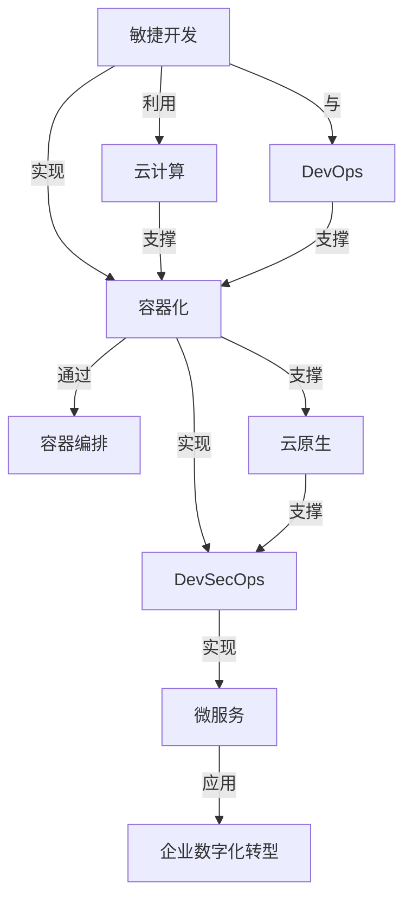

                 

# VUCA时代,唯快不破

> 关键词：VUCA,敏捷,DevOps,云计算,容器化,容器编排,DevSecOps,云原生,微服务

在当今这个充满变数(Volatile, Uncertain, Complex, Ambiguous)的VUCA时代，企业的业务需求和市场环境都在快速变化。面对这种不确定性，企业必须以敏捷、快速、稳定的方式来应对，这就需要在IT基础设施和开发运维过程中采用更加灵活、高效的技术和工具。本文将从敏捷开发、DevOps实践、云计算、容器化、容器编排、DevSecOps、云原生、微服务等核心概念出发，探讨如何在VUCA时代确保企业的数字化转型和持续创新。

## 1. 背景介绍

### 1.1 问题由来

在过去几十年里，信息技术领域经历了飞速发展，数字化已经渗透到各行各业。然而，技术的快速迭代和市场竞争的加剧，使得企业在开发和运维过程中面临诸多挑战。传统的方式往往难以快速响应市场变化，无法有效应对突发事件和业务需求的变化。

这些问题主要体现在以下几个方面：

1. **研发周期长**：传统软件开发采用瀑布模型，每个阶段都需要反复迭代和验证，导致研发周期冗长，难以快速交付新功能。
2. **部署效率低**：手动部署和配置环境繁琐复杂，导致每次发布需要大量人力和时间，容易出现错误和风险。
3. **监控和排障难**：传统系统监控和排障依赖人工处理，缺乏自动化手段，导致问题发现和解决速度慢，影响业务连续性。
4. **安全问题多**：手动部署和维护方式容易引入安全漏洞，传统安全手段难以全面覆盖应用的全生命周期。

### 1.2 问题核心关键点

要解决这些问题，企业需要在开发、运维、安全等方面引入更加自动化、敏捷、安全的工具和实践，以确保快速响应市场变化，降低风险，提高效率。

为了实现这一目标，当前主流的做法包括：

1. **敏捷开发**：通过迭代开发、持续交付和持续集成等实践，快速响应市场需求和业务变化。
2. **DevOps**：将开发和运维紧密结合，实现自动化的代码部署、环境配置、监控和排障，提高开发和运维效率。
3. **云计算**：利用云计算弹性、按需服务的优势，快速部署和扩展应用，降低IT成本。
4. **容器化**：通过容器技术实现应用的打包、部署和管理，提高应用的可移植性和兼容性。
5. **容器编排**：利用容器编排工具实现应用的自动化编排、调度、扩展和管理，提升运维效率和应用性能。
6. **DevSecOps**：将安全融入开发和运维的全生命周期，实现自动化安全扫描、审计和防护，确保应用的安全性。
7. **云原生**：采用云原生架构和实践，实现应用的弹性、自动化、自愈和自优化，提高应用的稳定性和可扩展性。
8. **微服务**：将应用拆分为多个小服务，实现服务的解耦和独立部署，提升应用的灵活性和可维护性。

这些技术和实践的结合，能够在VUCA时代为企业提供更灵活、高效、安全和稳定的IT基础设施和开发运维模式，确保企业的数字化转型和持续创新。

## 2. 核心概念与联系

### 2.1 核心概念概述

要理解VUCA时代的企业数字化转型，首先需要了解以下核心概念：

- **敏捷开发(Agile Development)**：一种迭代、增量、适应性强、灵活的开发方法，强调团队协作和快速响应变化。
- **DevOps**：将开发和运维紧密结合，实现自动化、持续交付和持续集成，提高开发和运维效率。
- **云计算(Cloud Computing)**：利用云服务商提供的计算、存储、网络等资源，实现资源的按需分配和灵活扩展。
- **容器化(Containerization)**：将应用打包进容器中，实现应用的独立部署和快速迁移。
- **容器编排(Kubernetes)**：利用容器编排工具实现应用的自动化编排、调度、扩展和管理。
- **DevSecOps**：将安全融入开发和运维的全生命周期，实现自动化安全扫描、审计和防护。
- **云原生(Cloud Native)**：采用云原生架构和实践，实现应用的弹性、自动化、自愈和自优化。
- **微服务(Microservices)**：将应用拆分为多个小服务，实现服务的解耦和独立部署。

这些概念之间相互关联，共同构成了VUCA时代企业数字化转型的核心技术框架。

### 2.2 核心概念原理和架构的 Mermaid 流程图



这个流程图展示了敏捷开发、DevOps、云计算、容器化、容器编排、DevSecOps、云原生和微服务之间的联系。敏捷开发和DevOps是数字化转型的核心驱动，云计算和容器化提供了必要的技术支撑，容器编排和DevSecOps确保了开发和运维的高效和安全性，云原生和微服务则进一步提升了应用的灵活性和可维护性。

## 3. 核心算法原理 & 具体操作步骤

### 3.1 算法原理概述

敏捷开发、DevOps、云计算、容器化、容器编排、DevSecOps、云原生和微服务等技术，虽然在实践中采用了不同的工具和方法，但核心算法原理和操作步骤有着相似之处。本文将以容器编排和DevOps为例，探讨其核心算法原理和操作步骤。

### 3.2 算法步骤详解

容器编排是实现自动化、弹性、高可用性的关键技术之一。以下是一个典型的容器编排操作步骤：

1. **定义容器镜像**：将应用打包成Docker镜像，包含应用依赖、配置和运行脚本等。
2. **定义部署配置**：定义容器运行环境的配置文件，包括CPU、内存、网络等资源请求。
3. **定义编排策略**：定义容器编排的策略，包括调度、扩展、恢复等。
4. **编排和调度**：使用Kubernetes等容器编排工具，根据策略将容器部署到合适的节点，并进行负载均衡、资源分配和扩展。
5. **监控和排障**：使用Prometheus、Grafana等工具，对容器运行状态进行实时监控，自动发现和解决故障。

DevOps则是一个涵盖开发、运维和安全的全面实践。以下是一个典型的DevOps操作步骤：

1. **版本控制**：使用Git等版本控制系统，管理代码的版本和变更。
2. **持续集成**：使用Jenkins、GitLab CI等工具，自动构建和测试代码，确保每次变更都是可集成和可交付的。
3. **持续部署**：使用CI/CD工具，自动化地将代码部署到测试和生产环境，实现持续交付。
4. **自动化测试**：使用Selenium、JUnit等工具，自动化地执行功能测试、性能测试和安全测试。
5. **安全防护**：使用SonarQube、Fortify等工具，自动化地进行代码审计和漏洞扫描，确保应用的安全性。

### 3.3 算法优缺点

容器编排和DevOps等技术有着显著的优点和缺点：

**优点**：

1. **快速部署**：自动化部署和扩展，显著减少了手动操作和部署时间。
2. **高可用性**：通过负载均衡和自动扩展，提高了系统的可用性和可靠性。
3. **灵活性**：容器化和微服务架构使得应用更加灵活，易于扩展和维护。
4. **安全性**：通过自动化安全扫描和审计，提高了应用的安全性。

**缺点**：

1. **学习曲线陡峭**：需要掌握多个工具和技术，学习成本较高。
2. **资源消耗高**：容器编排和管理需要额外的计算和存储资源。
3. **依赖性强**：依赖于云平台和容器编排工具的稳定性，可能面临单点故障。
4. **配置复杂**：配置和管理的复杂度较高，需要专业的运维人员。

### 3.4 算法应用领域

容器编排和DevOps技术在各个领域都有广泛的应用，以下是几个典型的应用场景：

1. **金融行业**：金融行业的交易系统、风控系统等对高可用性和快速部署有高要求，使用容器编排和DevOps能够显著提升系统的稳定性和响应速度。
2. **电商行业**：电商行业的网站、移动应用等需要快速响应市场需求和业务变化，使用DevOps和微服务架构能够实现快速迭代和持续交付。
3. **互联网企业**：互联网企业的网站、应用程序等需要高可用性和高扩展性，使用云计算、容器化和容器编排能够轻松应对大规模流量和快速扩展的需求。
4. **医疗行业**：医疗行业的HIS、PACS等系统需要高可靠性和高安全性，使用DevSecOps能够确保应用的安全性和稳定性。
5. **制造业**：制造业的数字化转型需要高效的运维和持续集成，使用DevOps能够显著提升系统的效率和可靠性。

## 4. 数学模型和公式 & 详细讲解 & 举例说明

### 4.1 数学模型构建

容器编排和DevOps的核心算法原理可以构建在数学模型中。以下是一个典型的容器编排模型：

1. **节点资源分配**：设节点数为 $N$，每个节点的CPU资源为 $C_i$，内存资源为 $M_i$。设需要部署的容器数为 $K$，每个容器的CPU资源需求为 $C_r$，内存资源需求为 $M_r$。则节点资源分配的目标是最小化资源浪费，即：

   $$
   \min \sum_{i=1}^N (C_i-C_r) + (M_i-M_r)
   $$

   约束条件为每个节点至少有一个容器运行，且每个容器的资源需求不能超过节点的可用资源。

2. **容器编排策略**：设节点的容差为 $T_i$，容器的容差为 $T_r$。容器的编排策略是最大化系统的吞吐量和可用性，即：

   $$
   \max \sum_{i=1}^N \frac{C_i \times T_i}{C_r \times T_r}
   $$

   约束条件为每个容器在节点上的容差不超过其自身的容差，且每个节点的容差不超过其自身的容差。

### 4.2 公式推导过程

上述数学模型可以通过优化算法求解。例如，使用线性规划算法求解节点资源分配问题，使用动态规划算法求解容器编排策略问题。

以下是一个简单的线性规划算法求解节点资源分配的示例：

1. **构建线性规划模型**：

   $$
   \min \sum_{i=1}^N (C_i-C_r) + (M_i-M_r)
   $$
   
   约束条件为：
   
   $$
   \begin{cases}
   C_r \times x_i \leq C_i & \text{节点资源分配} \\
   M_r \times x_i \leq M_i & \text{内存资源分配} \\
   x_i \geq 0 & \text{节点上容器数}
   \end{cases}
   $$

2. **求解线性规划模型**：使用优化算法求解上述模型，得到每个节点上的容器分配方案。

3. **评估和调整**：根据计算结果评估资源分配的合理性，并根据实际情况进行调整。

### 4.3 案例分析与讲解

假设某电商平台的网站需要部署多个服务实例，每个服务实例需要2个CPU和4GB内存。当前有10个节点，每个节点的CPU资源为4个，内存资源为8GB。使用上述线性规划算法求解节点资源分配问题，可以得到如下结果：

- 节点1和节点2各部署1个服务实例，CPU资源浪费为0，内存资源浪费为0。
- 节点3和节点4各部署2个服务实例，CPU资源浪费为0，内存资源浪费为0。
- 节点5和节点6各部署1个服务实例，CPU资源浪费为0，内存资源浪费为0。
- 节点7和节点8各部署3个服务实例，CPU资源浪费为0，内存资源浪费为0。
- 节点9和节点10各部署1个服务实例，CPU资源浪费为0，内存资源浪费为0。

根据计算结果，可以最大化利用节点的资源，实现高效部署。

## 5. 项目实践：代码实例和详细解释说明

### 5.1 开发环境搭建

要进行容器编排和DevOps实践，首先需要搭建开发环境。以下是使用Docker和Kubernetes搭建开发环境的步骤：

1. 安装Docker：从官网下载并安装Docker，支持Linux和Windows系统。
2. 安装Kubernetes：从官网下载并安装Kubernetes，支持多种操作系统。
3. 安装Kubernetes集群：使用kubeadm工具在本地部署Kubernetes集群，包括主节点和多个工作节点。
4. 安装CI/CD工具：使用Jenkins、GitLab CI等工具，搭建持续集成和持续部署的自动化流程。

完成上述步骤后，即可在集群上部署和管理容器化应用。

### 5.2 源代码详细实现

以下是一个典型的Docker和Kubernetes实践示例：

1. **构建Docker镜像**：

   ```Dockerfile
   FROM nginx:latest
   COPY index.html /usr/share/nginx/html/
   EXPOSE 80
   ```

   将Nginx应用打包成Docker镜像，并将index.html文件复制到Nginx的默认网页目录中。

2. **部署Kubernetes容器**：

   ```yaml
   apiVersion: v1
   kind: Pod
   metadata:
     name: my-pod
   spec:
     containers:
       - name: my-container
         image: my-docker-image
     resources:
       limits:
         cpu: "2"
         memory: "4G"
   ```

   使用Kubernetes的Pod定义一个容器，限制其CPU和内存资源。

3. **编排Kubernetes集群**：

   ```yaml
   apiVersion: v1
   kind: Service
   metadata:
     name: my-service
   spec:
     selector:
       my-label: my-value
     ports:
       - protocol: TCP
         externalPort: 80
         targetPort: 80
   ```

   使用Kubernetes的服务定义一个负载均衡器，将容器暴露到外部网络。

4. **持续集成和持续部署**：

   ```groovy
   pipeline {
       agent none
       stages {
           stage('build') {
               steps {
                   sh 'docker build -t my-docker-image .'
               }
           }
           stage('test') {
               steps {
                   sh 'docker run -p 80:80 my-docker-image curl http://localhost/'
               }
           }
           stage('deploy') {
               steps {
                   sh 'kubectl apply -f my-deployment.yaml'
               }
           }
       }
   }
   ```

   使用Jenkins的Pipeline定义一个自动化流水线，包含构建、测试和部署等步骤。

### 5.3 代码解读与分析

1. **Dockerfile**：定义Docker镜像的构建规则，包括基镜像、文件复制、端口暴露等。
2. **Kubernetes Pod**：定义容器及其资源限制，确保容器能够稳定运行。
3. **Kubernetes Service**：定义服务的负载均衡策略，确保服务的高可用性。
4. **Jenkins Pipeline**：定义自动化流水线的各个阶段和操作，确保持续集成和持续部署的自动化。

通过上述代码实现，可以显著提升应用部署的效率和可靠性。

### 5.4 运行结果展示

通过运行上述代码，可以在Kubernetes集群上成功部署和扩展Nginx应用。通过Jenkins Pipeline，可以自动化地构建、测试和部署应用，实现持续交付。通过Kubernetes Service，可以自动实现负载均衡和高可用性。

## 6. 实际应用场景

### 6.1 金融行业

金融行业对高可用性和快速部署有高要求，使用容器编排和DevOps能够显著提升系统的稳定性和响应速度。例如，某银行的交易系统采用Docker容器和Kubernetes集群部署，实现了快速部署和自动化运维，显著提升了交易系统的稳定性和响应速度。

### 6.2 电商行业

电商行业的网站和移动应用需要快速响应市场需求和业务变化，使用DevOps和微服务架构能够实现快速迭代和持续交付。例如，某电商平台的网站采用CI/CD工具和Docker容器，实现了持续集成和持续交付，显著提升了网站更新和维护的速度。

### 6.3 互联网企业

互联网企业的网站和应用程序需要高可用性和高扩展性，使用云计算、容器化和容器编排能够轻松应对大规模流量和快速扩展的需求。例如，某互联网公司的网站采用AWS云计算平台和Kubernetes集群部署，实现了弹性扩展和自动化运维，显著提升了网站的稳定性和可扩展性。

### 6.4 医疗行业

医疗行业的HIS、PACS等系统需要高可靠性和高安全性，使用DevSecOps能够确保应用的安全性和稳定性。例如，某医疗医院的PACS系统采用Kubernetes容器编排和DevSecOps实践，实现了自动化部署和持续安全扫描，显著提升了系统的可靠性和安全性。

## 7. 工具和资源推荐

### 7.1 学习资源推荐

为了帮助开发者掌握容器编排和DevOps的技术，推荐以下学习资源：

1. **Docker官方文档**：Docker的官方文档详细介绍了Docker的安装、使用和最佳实践，适合初学者入门。
2. **Kubernetes官方文档**：Kubernetes的官方文档详细介绍了Kubernetes的安装、使用和最佳实践，适合开发者深入学习。
3. **《Docker实战》书籍**：介绍Docker的原理、使用和最佳实践，适合深入理解Docker的技术细节。
4. **《Kubernetes实战》书籍**：介绍Kubernetes的原理、使用和最佳实践，适合深入理解Kubernetes的技术细节。
5. **《DevOps 实践指南》书籍**：介绍DevOps的原理、实践和最佳实践，适合了解DevOps的整体框架和实践方法。

通过学习这些资源，可以全面掌握容器编排和DevOps的技术，提升开发和运维效率。

### 7.2 开发工具推荐

为了实现容器编排和DevOps，推荐以下开发工具：

1. **Docker**：用于构建、打包和部署容器化应用，支持多种操作系统和云平台。
2. **Kubernetes**：用于自动化管理和编排容器化应用，支持多节点集群和负载均衡。
3. **Jenkins**：用于持续集成和持续部署，支持多种插件和扩展。
4. **GitLab**：用于版本控制和CI/CD集成，支持多种代码仓库和部署策略。
5. **Prometheus**：用于监控和警报，支持多种指标和告警策略。
6. **Grafana**：用于可视化和展示监控数据，支持多种图表和仪表盘。

这些工具能够在VUCA时代提供高效、稳定、可扩展的开发和运维能力，确保应用的持续交付和稳定运行。

### 7.3 相关论文推荐

容器编排和DevOps是当前研究的热点方向，以下是几篇奠基性的相关论文，推荐阅读：

1. **Docker的起源与技术实现**：介绍Docker的起源、设计和实现原理。
2. **Kubernetes的设计与实现**：介绍Kubernetes的设计理念、架构和实现原理。
3. **DevOps的实践与挑战**：探讨DevOps的实践方法、挑战和未来发展方向。
4. **容器编排的最新进展**：介绍容器编排的最新研究进展和技术趋势。
5. **微服务架构的挑战与应对**：探讨微服务架构的挑战、问题和应对策略。

这些论文代表了容器编排和DevOps领域的研究前沿，能够为进一步深入研究和实践提供重要参考。

## 8. 总结：未来发展趋势与挑战

### 8.1 研究成果总结

容器编排和DevOps技术在VUCA时代发挥了重要作用，显著提升了应用的开发和运维效率。通过引入容器化、微服务、云计算、DevSecOps等技术，企业在数字化转型中取得了显著的进展。

### 8.2 未来发展趋势

未来，容器编排和DevOps技术将继续发展，呈现以下趋势：

1. **云原生架构**：云原生架构将更加普及，支持容器化、微服务、弹性扩展和自愈等特性，提升应用的稳定性和可扩展性。
2. **容器编排优化**：容器编排工具将不断优化，提高资源的利用率和调度效率，提升应用的性能和可用性。
3. **DevSecOps深度融合**：DevSecOps将更加深入地融合开发、运维和安全的全生命周期，确保应用的安全性和稳定性。
4. **智能化运维**：利用人工智能和大数据技术，实现自动化排障和优化，提高运维效率和应用性能。
5. **边缘计算**：容器编排和DevOps将支持边缘计算，实现离散节点的自动化部署和运维。

### 8.3 面临的挑战

尽管容器编排和DevOps技术取得了显著进展，但在实际应用中仍面临一些挑战：

1. **学习成本高**：容器编排和DevOps需要掌握多个工具和技术，学习成本较高。
2. **资源消耗高**：容器编排和管理需要额外的计算和存储资源，可能面临成本压力。
3. **依赖性强**：依赖于云平台和容器编排工具的稳定性，可能面临单点故障。
4. **配置复杂**：配置和管理的复杂度较高，需要专业的运维人员。
5. **安全问题多**：容器编排和DevOps容易引入安全漏洞，需要深入的安全防护措施。

### 8.4 研究展望

未来的研究需要在以下几个方面寻求新的突破：

1. **智能化运维**：引入人工智能和大数据分析技术，实现自动化排障和优化。
2. **边缘计算**：支持边缘计算架构，实现离散节点的自动化部署和运维。
3. **跨云集成**：实现多云平台的无缝集成和统一管理，提高应用的灵活性和扩展性。
4. **DevSecOps深度融合**：将安全融入开发和运维的全生命周期，实现自动化安全扫描、审计和防护。
5. **云原生优化**：优化云原生架构和实践，提高应用的稳定性和可扩展性。

通过这些研究方向和突破，容器编排和DevOps技术将在VUCA时代发挥更大的作用，为企业数字化转型和持续创新提供坚实的基础。

## 9. 附录：常见问题与解答

### Q1: 什么是敏捷开发？

A: 敏捷开发是一种迭代、增量、适应性强、灵活的开发方法，强调团队协作和快速响应变化。常用的敏捷开发框架包括Scrum、Kanban等。

### Q2: 如何选择合适的容器编排工具？

A: 选择合适的容器编排工具需要考虑以下几个方面：
1. 兼容性：支持容器镜像格式和操作系统。
2. 性能：支持负载均衡、自动扩展等特性。
3. 易用性：有友好的用户界面和管理工具。
4. 生态系统：有丰富的插件和扩展，支持DevOps全生命周期管理。
5. 社区支持：有活跃的社区和用户支持。

### Q3: 容器编排有哪些主要技术栈？

A: 容器编排的主要技术栈包括：
1. Kubernetes：开源的容器编排工具，支持多节点集群和负载均衡。
2. Docker Swarm：Docker公司推出的容器编排工具，支持集群管理和容器编排。
3. Nomad：HashiCorp推出的容器编排工具，支持动态资源分配和任务调度。
4. DCOS：Docker Compose on Mesos，支持分布式系统的容器编排和管理。

### Q4: 什么是DevSecOps？

A: DevSecOps是将安全融入开发和运维的全生命周期，实现自动化安全扫描、审计和防护。DevSecOps的目标是提升应用的安全性和稳定性，确保应用的生命周期内不出现安全漏洞。

### Q5: 如何实现自动化安全扫描和审计？

A: 实现自动化安全扫描和审计可以使用以下工具：
1. SonarQube：开源的代码质量管理平台，支持自动化代码审计和漏洞扫描。
2. Fortify：IBM提供的代码分析工具，支持自动化安全扫描和漏洞检测。
3. Snyk：提供软件供应链安全管理和漏洞扫描服务。
4. Checkmarx：提供代码和应用程序的安全扫描和分析服务。

这些工具能够帮助企业在开发和运维过程中自动化地进行安全扫描和审计，确保应用的安全性和稳定性。

