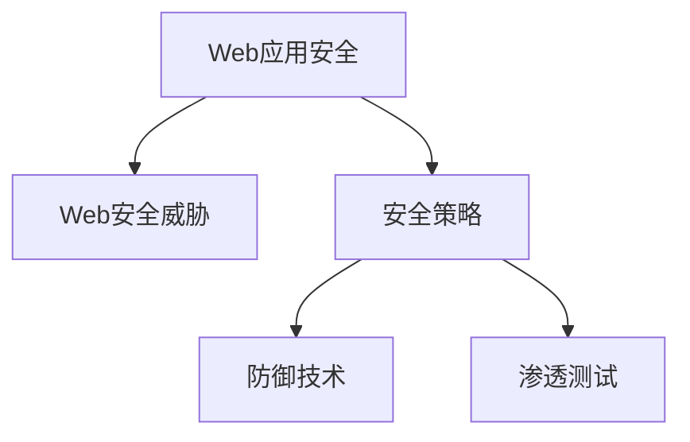

                 

# Web 安全策略实施：保护网站和应用程序免受威胁

> 关键词：Web安全,威胁防护,安全策略,应用程序安全,防御技术

## 1. 背景介绍

### 1.1 问题由来
随着互联网的普及和信息技术的快速发展，Web应用已成为人们日常工作、生活和娱乐的重要工具。然而，与此同时，Web应用也面临着越来越多的安全威胁。这些威胁不仅影响用户的数据安全和隐私，还可能导致严重的经济损失和信誉损害。

Web应用的安全威胁主要包括：SQL注入、XSS攻击、CSRF攻击、DDoS攻击、身份认证和授权问题等。这些问题不仅存在于Web应用开发的各个环节，而且随着时间的推移，黑客攻击手段不断翻新，使得Web安全问题愈发复杂和难以预测。

因此，制定和实施有效的Web安全策略，保护网站和应用程序免受威胁，成为每一位开发者和安全人员的共同责任。本文将从核心概念、算法原理、操作步骤、项目实践、应用场景等方面，系统介绍Web安全策略的实施方法，旨在帮助开发者和运维人员提升Web应用的安全防护水平。

## 2. 核心概念与联系

### 2.1 核心概念概述

为更好地理解Web安全策略的实施方法，本节将介绍几个密切相关的核心概念：

- **Web应用安全（Web Application Security）**：指通过技术手段和流程管理，保护Web应用程序免受各种安全威胁的侵害。Web应用安全的核心目标是保证数据完整性、可用性和机密性。

- **Web安全威胁（Web Security Threats）**：指企图破坏Web应用程序安全的各种攻击行为，包括SQL注入、XSS攻击、CSRF攻击、DDoS攻击等。这些威胁通常利用Web应用的安全漏洞，实施恶意行为。

- **安全策略（Security Strategy）**：指为达到特定的安全目标，所采取的一系列措施和流程。Web安全策略的核心是对Web应用进行多层次、全方位的安全防护。

- **防御技术（Defense Technologies）**：指用于实现安全策略的各种技术手段，如防火墙、入侵检测系统（IDS）、Web应用防火墙（WAF）、加密技术、访问控制等。这些技术手段可帮助防御Web应用面临的各种安全威胁。

- **渗透测试（Penetration Testing）**：指通过模拟黑客攻击行为，检测Web应用的安全漏洞，并提供修复建议的过程。渗透测试是提升Web应用安全防护的重要手段。

这些核心概念之间的逻辑关系可以通过以下Mermaid流程图来展示：



这个流程图展示了一系列核心概念之间的逻辑关系：Web应用安全策略的制定和实施，依赖于对Web安全威胁的识别和评估，而防御技术的应用和渗透测试的实施，则是为了实现安全策略。

## 3. 核心算法原理 & 具体操作步骤

### 3.1 算法原理概述

Web安全策略的实施，本质上是一个多层次、多维度的防护系统。其核心思想是：通过技术手段和流程管理，构建一个多层次、多维度的防护体系，对Web应用进行全方位的安全防护。

形式化地，假设Web应用的安全策略为 $S$，防御技术集为 $D$，渗透测试结果为 $T$。则Web安全策略的构建过程可以表示为：

$$
S = \mathop{\arg\max}_{S} \sum_{i=1}^N [S_i \times f_i] \quad \text{subject to} \quad f_i \leq F_i
$$

其中 $S_i$ 为第 $i$ 个安全策略的权重，$f_i$ 为第 $i$ 个策略实现的效果，$F_i$ 为第 $i$ 个策略的最大可能实现效果。

在实施过程中，首先根据Web应用的安全需求和威胁评估结果，选择合适的防御技术 $D$ 并设计相应的渗透测试方案。然后，通过逐步实施和优化，不断调整安全策略 $S$，以提升Web应用的整体安全防护水平。

### 3.2 算法步骤详解

Web安全策略的实施步骤包括以下几个关键环节：

**Step 1: 安全需求分析**
- 分析Web应用的安全需求，明确要保护的数据、业务和用户，评估威胁等级和频率。
- 确定安全策略的目标，如数据完整性、可用性、机密性等。

**Step 2: 威胁评估**
- 收集和分析Web应用面临的各种安全威胁，如SQL注入、XSS攻击、CSRF攻击等。
- 评估威胁对Web应用的影响和脆弱点，确定潜在攻击者的目标和攻击手段。

**Step 3: 防御技术选择**
- 根据威胁评估结果，选择适合的防御技术，如防火墙、WAF、加密技术、访问控制等。
- 评估不同防御技术的成本和效果，选择合适的技术组合。

**Step 4: 策略设计**
- 设计具体的安全策略，包括访问控制、身份认证、数据加密、日志审计等。
- 确定策略的优先级和实施顺序，制定实施计划。

**Step 5: 防御技术部署**
- 根据策略设计，部署防御技术，配置相应的参数和规则。
- 定期进行安全更新和维护，确保防御技术的有效性。

**Step 6: 渗透测试**
- 定期进行渗透测试，模拟黑客攻击行为，检测安全漏洞。
- 根据渗透测试结果，优化和完善安全策略。

**Step 7: 监控和响应**
- 实时监控Web应用的安全状态，及时发现和响应安全事件。
- 建立应急响应机制，快速处理安全威胁。

以上步骤是一个循环的过程，需要不断调整和优化，以应对不断变化的安全威胁。

### 3.3 算法优缺点

Web安全策略的实施方法具有以下优点：

1. **多层次防护**：通过选择多种防御技术，构建多层次的安全防护体系，降低单个防护技术的失效风险。
2. **动态更新**：定期进行渗透测试和安全评估，及时发现和修复安全漏洞，提升Web应用的安全防护能力。
3. **流程化管理**：通过明确的安全策略和详细的实施步骤，确保Web安全防护的规范性和一致性。
4. **可扩展性**：在不断变化的威胁环境中，可以灵活调整和扩展安全策略，满足新的安全需求。

同时，该方法也存在一定的局限性：

1. **技术复杂度**：实施Web安全策略需要多种技术手段和复杂流程，对技术和人员要求较高。
2. **成本投入**：实施Web安全策略需要投入大量的时间和金钱，尤其是在大规模应用中。
3. **误报和漏报**：防护技术可能存在误报和漏报问题，需要人工审核和手动验证。
4. **人为因素**：安全策略的实施和优化依赖于人工决策，可能受到人为因素的影响。

尽管存在这些局限性，但就目前而言，Web安全策略的实施方法仍然是Web应用安全防护的主流范式。未来相关研究的重点在于如何进一步简化技术实现，降低成本，提升防护效果，同时兼顾可扩展性和易用性。

### 3.4 算法应用领域

Web安全策略的实施方法在Web应用开发的各个环节都有广泛应用，例如：

- **Web应用开发**：在开发过程中，通过代码审计、安全测试等手段，识别和修复潜在的安全漏洞。
- **Web应用部署**：在部署过程中，通过防火墙、WAF、DDoS防护等技术，提升Web应用的安全防护能力。
- **Web应用维护**：在维护过程中，通过渗透测试、日志审计等手段，发现和修复新的安全漏洞。
- **Web应用监控**：通过实时监控系统，及时发现和响应安全威胁，保障Web应用的安全稳定。

除了上述这些经典应用外，Web安全策略的实施方法还广泛应用于Web应用的安全评估、安全培训、安全意识提升等方面，为Web应用的安全防护提供了全面的保障。

## 4. 数学模型和公式 & 详细讲解 & 举例说明

### 4.1 数学模型构建

为了更好地理解Web安全策略的实施方法，本节将使用数学语言对Web安全策略的构建过程进行更加严格的刻画。

设Web应用的安全策略为 $S$，防御技术集为 $D=\{d_1, d_2, ..., d_n\}$，渗透测试结果为 $T=\{t_1, t_2, ..., t_m\}$，其中 $t_i$ 表示第 $i$ 次渗透测试的结果，包括发现的漏洞数量和等级。

定义安全策略 $S$ 在防御技术 $d_j$ 上的效果为 $f_{Sd_j}$，在渗透测试 $t_i$ 上的效果为 $f_{St_i}$，则安全策略的效果为：

$$
F(S) = \sum_{i=1}^m [f_{St_i}] + \sum_{j=1}^n [f_{Sd_j}]
$$

其中 $f_{St_i}$ 和 $f_{Sd_j}$ 表示安全策略 $S$ 在渗透测试 $t_i$ 和防御技术 $d_j$ 上的效果。

在实施过程中，需要通过优化 $S$，使得 $F(S)$ 最大化，即：

$$
S^* = \mathop{\arg\max}_{S} F(S)
$$

### 4.2 公式推导过程

以下我们以Web应用防火墙（WAF）为例，推导其对Web应用防护效果的影响。

假设Web应用在未部署WAF前，被攻击的成功率为 $P_0$，部署WAF后，成功率为 $P_1$。则WAF对Web应用防护效果为：

$$
F_{WAF} = P_0 - P_1
$$

设WAF的防护效果为 $f_{WAF}$，则有：

$$
f_{WAF} = P_0 - P_1 = F_{WAF}
$$

在实际应用中，WAF的防护效果 $f_{WAF}$ 可能受到多种因素的影响，如攻击类型、攻击频率、攻击载荷等。因此，需要对WAF的防护效果进行量化，通常采用基于规则的防护模式和基于机器学习的防护模式。

基于规则的防护模式，根据攻击特征和行为，制定一系列防护规则。当攻击行为符合某条规则时，WAF就会拦截该攻击。基于机器学习的防护模式，通过训练模型学习攻击行为特征，实现更精准的防护。

### 4.3 案例分析与讲解

**案例一：SQL注入防护**
- 安全需求：保护Web应用的后台数据，防止SQL注入攻击。
- 威胁评估：SQL注入攻击可能导致数据泄露和篡改。
- 防御技术：部署WAF，配置SQL注入防护规则。
- 策略设计：设置访问控制、定期审计日志。
- 渗透测试：模拟SQL注入攻击，发现漏洞。
- 响应措施：修补漏洞，更新WAF规则。

**案例二：XSS防护**
- 安全需求：保护Web应用的客户界面，防止XSS攻击。
- 威胁评估：XSS攻击可能导致窃取用户Cookie、劫持用户会话。
- 防御技术：部署WAF，配置XSS防护规则。
- 策略设计：设置输入验证、输出编码。
- 渗透测试：模拟XSS攻击，发现漏洞。
- 响应措施：修补漏洞，更新WAF规则。

通过以上案例，可以看到，Web安全策略的实施是一个多层次、多维度的过程，需要综合考虑各种安全威胁和防护手段，不断优化和调整策略，以提升Web应用的安全防护能力。

## 5. 项目实践：代码实例和详细解释说明

### 5.1 开发环境搭建

在进行Web安全策略实施实践前，我们需要准备好开发环境。以下是使用Python进行Flask开发的环境配置流程：

1. 安装Anaconda：从官网下载并安装Anaconda，用于创建独立的Python环境。

2. 创建并激活虚拟环境：
```bash
conda create -n flask-env python=3.8 
conda activate flask-env
```

3. 安装Flask：
```bash
conda install flask
```

4. 安装Flask-WTF、Flask-Login等扩展：
```bash
pip install flask-wtf flask-login
```

5. 安装SQLAlchemy：
```bash
pip install sqlalchemy
```

6. 安装WTForms：
```bash
pip install wtforms
```

完成上述步骤后，即可在`flask-env`环境中开始Web安全策略实施实践。

### 5.2 源代码详细实现

下面是一个简单的Web应用示例，展示如何使用Flask-WTF、Flask-Login、SQLAlchemy和WTForms进行Web应用开发，并实施基本的Web安全策略。

首先，定义用户模型和数据模型：

```python
from flask_sqlalchemy import SQLAlchemy
from flask_login import UserMixin, LoginManager
from werkzeug.security import generate_password_hash, check_password_hash

db = SQLAlchemy()

class User(db.Model, UserMixin):
    id = db.Column(db.Integer, primary_key=True)
    username = db.Column(db.String(50), unique=True, nullable=False)
    email = db.Column(db.String(120), unique=True, nullable=False)
    password = db.Column(db.String(60), nullable=False)

    def __init__(self, username, email, password):
        self.username = username
        self.email = email
        self.password = generate_password_hash(password)

    def check_password(self, password):
        return check_password_hash(self.password, password)

@login_manager.user_loader
def load_user(user_id):
    return User.query.get(int(user_id))

class Post(db.Model):
    id = db.Column(db.Integer, primary_key=True)
    title = db.Column(db.String(120), nullable=False)
    body = db.Column(db.Text, nullable=False)
    user_id = db.Column(db.Integer, db.ForeignKey('user.id'), nullable=False)

    def __init__(self, title, body, user):
        self.title = title
        self.body = body
        self.user = user
```

然后，定义Web应用路由和控制器：

```python
from flask import Flask, render_template, redirect, url_for
from flask_login import login_user, logout_user, login_required, current_user

app = Flask(__name__)
app.config['SECRET_KEY'] = 'your-secret-key'
db.init_app(app)
login_manager = LoginManager(app)

@app.route('/')
@login_required
def index():
    posts = Post.query.all()
    return render_template('index.html', posts=posts)

@app.route('/login', methods=['GET', 'POST'])
def login():
    if current_user.is_authenticated:
        return redirect(url_for('index'))
    if request.method == 'POST':
        username = request.form['username']
        password = request.form['password']
        user = User.query.filter_by(username=username).first()
        if user and user.check_password(password):
            login_user(user)
            return redirect(url_for('index'))
    return render_template('login.html')

@app.route('/logout')
def logout():
    logout_user()
    return redirect(url_for('index'))

@app.route('/register', methods=['GET', 'POST'])
def register():
    if current_user.is_authenticated:
        return redirect(url_for('index'))
    if request.method == 'POST':
        username = request.form['username']
        email = request.form['email']
        password = request.form['password']
        user = User(username, email, password)
        db.session.add(user)
        db.session.commit()
        return redirect(url_for('login'))
    return render_template('register.html')

@app.route('/post', methods=['GET', 'POST'])
@login_required
def post():
    if request.method == 'POST':
        title = request.form['title']
        body = request.form['body']
        post = Post(title, body, current_user)
        db.session.add(post)
        db.session.commit()
        return redirect(url_for('index'))
    return render_template('post.html')
```

接着，定义登录和注册页面：

```html
<!-- login.html -->
<form method="POST">
    <div>
        <label>Username:</label>
        <input type="text" name="username">
    </div>
    <div>
        <label>Password:</label>
        <input type="password" name="password">
    </div>
    <button type="submit">Login</button>
</form>

<!-- register.html -->
<form method="POST">
    <div>
        <label>Username:</label>
        <input type="text" name="username">
    </div>
    <div>
        <label>Email:</label>
        <input type="email" name="email">
    </div>
    <div>
        <label>Password:</label>
        <input type="password" name="password">
    </div>
    <button type="submit">Register</button>
</form>

<!-- index.html -->
<h1>Welcome</h1>
<ul>
    
    <li>{{ post.title }} - {{ post.body }} - {{ post.user.username }}</li>
    
</ul>
<a href="{{ url_for('post') }}">New Post</a>
```

最后，启动Flask应用并实现基本的安全策略：

```python
if __name__ == '__main__':
    app.run(debug=True)
```

### 5.3 代码解读与分析

让我们再详细解读一下关键代码的实现细节：

**User模型**：
- 定义了用户的基本信息，包括用户名、邮箱、密码等属性。
- 实现了用户模型的验证方法，用于验证密码的正确性。

**login_manager**：
- 通过Flask-Login扩展，实现了用户的认证和授权功能。

**index、login、logout、register、post路由**：
- 定义了Web应用的路由和控制器，实现了用户登录、注册、发布文章等功能。
- 使用了Flask-WTF扩展，实现了表单验证功能，防止用户提交非法数据。
- 使用了SQLAlchemy扩展，实现了数据库操作，保证了数据的安全性和完整性。

**Flask应用启动**：
- 启动Flask应用，使Web应用能够正常运行。

可以看到，Flask框架结合WTForms、SQLAlchemy等扩展，使得Web应用的安全策略实施变得相对简单和高效。开发者可以根据具体需求，灵活选择和组合不同的扩展，实现更加复杂的Web应用安全防护。

## 6. 实际应用场景

### 6.1 电子商务平台

电子商务平台面临着多种安全威胁，如SQL注入、XSS攻击、DDoS攻击、信用卡盗刷等。因此，实施Web安全策略，保护电子商务平台的数据和用户信息，至关重要。

具体而言，可以采用以下措施：

1. 部署Web应用防火墙（WAF），拦截常见的攻击行为。
2. 实施数据加密和访问控制，防止数据泄露和未授权访问。
3. 定期进行渗透测试和安全审计，发现和修复安全漏洞。
4. 建立应急响应机制，快速处理安全事件。

通过以上措施，可以显著提升电子商务平台的安全防护水平，保障用户的财产安全和个人隐私。

### 6.2 医疗健康系统

医疗健康系统涉及到大量的个人健康信息，如病历、诊断报告等。这些信息一旦被泄露或篡改，将对患者和医院造成严重的损失。因此，实施Web安全策略，保护医疗健康系统的安全，非常必要。

具体而言，可以采用以下措施：

1. 部署入侵检测系统（IDS），实时监控系统安全状态。
2. 实施数据加密和访问控制，防止数据泄露和未授权访问。
3. 定期进行渗透测试和安全审计，发现和修复安全漏洞。
4. 建立应急响应机制，快速处理安全事件。

通过以上措施，可以确保医疗健康系统的数据安全和系统稳定，保护患者的隐私和权益。

### 6.3 金融服务系统

金融服务系统涉及到用户的个人财务信息，如账户余额、交易记录等。这些信息一旦被泄露或篡改，将对用户的财产安全造成严重威胁。因此，实施Web安全策略，保护金融服务系统的安全，非常必要。

具体而言，可以采用以下措施：

1. 部署网络防火墙，防止网络攻击和数据泄露。
2. 实施数据加密和访问控制，防止数据泄露和未授权访问。
3. 定期进行渗透测试和安全审计，发现和修复安全漏洞。
4. 建立应急响应机制，快速处理安全事件。

通过以上措施，可以确保金融服务系统的数据安全和系统稳定，保护用户的财产安全和个人隐私。

### 6.4 未来应用展望

随着Web应用技术的不断发展，Web安全策略的实施也将面临更多的挑战和机遇。未来，Web安全策略的实施将向以下几个方向发展：

1. **自动化防护**：通过机器学习和人工智能技术，实现自动化的Web安全防护，提升防护效果和效率。
2. **云安全**：在云平台中部署Web应用，利用云安全技术，提供更加灵活和高效的Web安全防护。
3. **区块链技术**：利用区块链技术，确保Web应用数据的安全性和不可篡改性。
4. **跨平台防护**：在多个平台中部署Web应用，实现跨平台的安全防护，保障数据和系统的安全。
5. **零信任架构**：通过零信任架构，实现最小权限访问和细粒度安全控制，提升Web应用的安全性。

这些方向的探索和实践，必将推动Web安全策略的不断发展和完善，为Web应用的安全防护带来新的突破。

## 7. 工具和资源推荐

### 7.1 学习资源推荐

为了帮助开发者系统掌握Web安全策略的实施方法，这里推荐一些优质的学习资源：

1. **《Web安全攻防手册》**：系统介绍Web应用的安全漏洞和防护方法，适合初学者和中级开发者。
2. **《Web安全技术白皮书》**：深入分析Web应用的安全威胁和防护技术，适合高级开发者和安全专家。
3. **《网络安全原理与实践》**：全面讲解网络安全的原理和技术，涵盖Web应用安全、入侵检测、数据加密等方面。
4. **《Web应用安全指南》**：详细介绍Web应用的安全需求和防护措施，适合Web开发者和运维人员。
5. **《Web安全实战》**：提供实用的Web安全防护案例和实践经验，适合实战型开发者。

通过对这些资源的学习，相信你一定能够系统掌握Web安全策略的实施方法，提升Web应用的安全防护水平。

### 7.2 开发工具推荐

高效的开发离不开优秀的工具支持。以下是几款用于Web安全策略实施开发的常用工具：

1. **Flask**：轻量级的Web框架，支持Python开发，灵活易用。
2. **SQLAlchemy**：Python ORM框架，支持SQL数据库操作，安全可靠。
3. **Flask-WTF**：表单验证扩展，支持Web表单的安全防护。
4. **Flask-Login**：用户认证扩展，支持用户登录和授权。
5. **OWASP ZAP**：Web应用安全测试工具，支持渗透测试和安全评估。
6. **Nessus**：网络安全扫描工具，支持漏洞检测和修复建议。

合理利用这些工具，可以显著提升Web安全策略实施的开发效率，加快创新迭代的步伐。

### 7.3 相关论文推荐

Web安全策略的实施方法在学界和产业界都得到了广泛的研究和应用。以下是几篇具有代表性的相关论文，推荐阅读：

1. **Web应用防火墙技术研究**：介绍Web应用防火墙的原理、实现和应用，探讨其对Web应用防护效果的影响。
2. **基于机器学习的Web安全防护**：利用机器学习技术，提升Web应用的安全防护能力，研究基于规则和基于机器学习的防护模式。
3. **Web应用渗透测试方法**：详细分析Web应用渗透测试的流程和工具，研究渗透测试在Web安全策略实施中的应用。
4. **Web应用安全策略构建**：探讨Web应用安全策略的构建方法，研究不同安全策略的优先级和实施顺序。
5. **Web应用零信任架构**：研究零信任架构在Web应用安全防护中的应用，提升Web应用的安全性和可靠性。

这些论文代表了Web安全策略实施方法的研究方向和前沿成果，可以帮助研究者把握学科前进方向，激发更多的创新灵感。

## 8. 总结：未来发展趋势与挑战

### 8.1 总结

本文对Web安全策略的实施方法进行了全面系统的介绍。首先阐述了Web应用面临的安全威胁和防护需求，明确了Web安全策略的核心目标。其次，从核心概念到算法原理，再到具体操作步骤，详细讲解了Web安全策略的实施过程。最后，从项目实践到实际应用，提供了具体的案例分析和代码实例，帮助开发者理解和掌握Web安全策略的实施方法。

通过本文的系统梳理，可以看到，Web安全策略的实施方法正在成为Web应用安全防护的主流范式，极大地提升了Web应用的安全防护能力。未来，随着Web应用技术的不断发展和安全威胁的不断演变，Web安全策略的实施方法将面临更多的挑战和机遇，需要不断优化和创新，才能满足不断变化的安全需求。

### 8.2 未来发展趋势

Web安全策略的实施方法将呈现以下几个发展趋势：

1. **自动化和智能化**：通过机器学习和人工智能技术，实现自动化的Web安全防护，提升防护效果和效率。
2. **云安全**：在云平台中部署Web应用，利用云安全技术，提供更加灵活和高效的Web安全防护。
3. **区块链技术**：利用区块链技术，确保Web应用数据的安全性和不可篡改性。
4. **跨平台防护**：在多个平台中部署Web应用，实现跨平台的安全防护，保障数据和系统的安全。
5. **零信任架构**：通过零信任架构，实现最小权限访问和细粒度安全控制，提升Web应用的安全性。

这些趋势凸显了Web安全策略实施方法的发展方向，将为Web应用的安全防护带来新的突破和创新。

### 8.3 面临的挑战

尽管Web安全策略的实施方法已经取得了一定的成就，但在迈向更加智能化、普适化应用的过程中，仍然面临诸多挑战：

1. **技术复杂度**：实施Web安全策略需要多种技术手段和复杂流程，对技术和人员要求较高。
2. **成本投入**：实施Web安全策略需要投入大量的时间和金钱，尤其是在大规模应用中。
3. **误报和漏报**：防护技术可能存在误报和漏报问题，需要人工审核和手动验证。
4. **人为因素**：安全策略的实施和优化依赖于人工决策，可能受到人为因素的影响。

尽管存在这些挑战，但Web安全策略的实施方法仍然是Web应用安全防护的主流范式。未来相关研究的重点在于如何进一步简化技术实现，降低成本，提升防护效果，同时兼顾可扩展性和易用性。

### 8.4 研究展望

面向未来，Web安全策略的实施方法需要在以下几个方面寻求新的突破：

1. **自动化防护**：通过机器学习和人工智能技术，实现自动化的Web安全防护，提升防护效果和效率。
2. **云安全**：在云平台中部署Web应用，利用云安全技术，提供更加灵活和高效的Web安全防护。
3. **区块链技术**：利用区块链技术，确保Web应用数据的安全性和不可篡改性。
4. **跨平台防护**：在多个平台中部署Web应用，实现跨平台的安全防护，保障数据和系统的安全。
5. **零信任架构**：通过零信任架构，实现最小权限访问和细粒度安全控制，提升Web应用的安全性。

这些研究方向的探索和实践，必将推动Web安全策略的不断发展和完善，为Web应用的安全防护带来新的突破。

## 9. 附录：常见问题与解答

**Q1：Web安全策略的实施需要哪些技术手段？**

A: Web安全策略的实施需要多种技术手段，包括Web应用防火墙（WAF）、入侵检测系统（IDS）、数据加密、访问控制、渗透测试等。这些技术手段可以共同构建一个多层次、多维度的防护体系，有效应对各种安全威胁。

**Q2：如何选择适合的Web应用防火墙（WAF）？**

A: 选择合适的WAF需要考虑多个因素，包括攻击类型、攻击频率、攻击载荷等。常见的主流WAF包括ModSecurity、AWS WAF、Cloudflare WAF等，需要根据具体需求进行选择和配置。

**Q3：如何实现Web应用的自动渗透测试？**

A: 利用工具如OWASP ZAP、Burp Suite等，可以自动进行Web应用的渗透测试，发现安全漏洞。这些工具提供了丰富的攻击类型和扫描规则，可以根据需要进行配置和调整。

**Q4：如何实现Web应用的数据加密？**

A: 常见的Web应用数据加密方法包括SSL/TLS加密、AES加密、RSA加密等。利用SSL/TLS协议，可以保障数据在传输过程中的安全。利用AES、RSA等算法，可以对数据进行加密保护，防止未授权访问和数据泄露。

**Q5：如何实施Web应用的访问控制？**

A: 实现Web应用的访问控制，通常需要设计合理的权限管理体系，如RBAC、ABAC等。利用Web框架中的用户认证和授权机制，可以实现细粒度的访问控制，防止未授权访问和数据泄露。

这些问题的解答，可以帮助开发者更好地理解和实施Web安全策略，提升Web应用的安全防护水平。

---

作者：禅与计算机程序设计艺术 / Zen and the Art of Computer Programming

