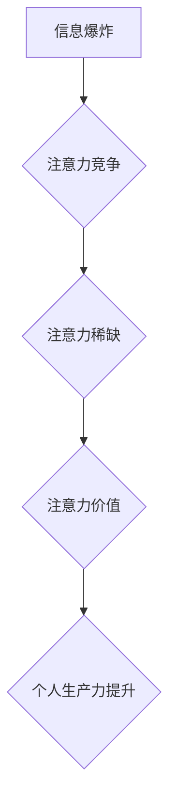

>  注意力经济, 个人生产力, 深度工作, 认知偏差, 时间管理, 数字工具

## 1. 背景介绍

在当今信息爆炸的时代，我们每天都被来自各个方向的海量信息所包围。电子邮件、社交媒体、新闻推送、即时通讯软件等等，无时无刻不在争夺着我们的注意力。这种注意力被不断分割和分散的状态，被称为“注意力经济”。

注意力经济的核心概念是，注意力是一种稀缺资源，而能够有效地获取和利用注意力的人，能够在竞争中获得优势。个人生产力，即一个人在单位时间内完成工作量，与注意力经济有着密切的联系。

## 2. 核心概念与联系

### 2.1 注意力经济

注意力经济是指在信息时代，注意力成为一种稀缺资源，而能够有效地获取和利用注意力的人，能够在竞争中获得优势。

**核心原理：**

* **注意力稀缺：** 人类大脑的注意力资源有限，无法同时处理大量信息。
* **注意力竞争：** 各种信息来源都在争夺我们的注意力。
* **注意力价值：** 拥有和控制注意力的人，能够获得信息、知识和资源的优势。

**架构图：**



### 2.2 个人生产力

个人生产力是指一个人在单位时间内完成工作量。它受多种因素影响，包括：

* **时间管理：** 如何有效地规划和分配时间。
* **专注力：** 如何集中注意力，排除干扰。
* **效率工具：** 如何利用工具和技术提高工作效率。
* **认知能力：** 如何有效地学习、记忆和思考。

**核心联系：**

注意力是个人生产力的关键要素。只有集中注意力，才能有效地完成工作。注意力经济的本质是，如何更好地管理和利用注意力，从而提高个人生产力。

## 3. 核心算法原理 & 具体操作步骤

### 3.1 算法原理概述

注意力机制是一种模仿人类注意力机制的算法，它能够帮助模型专注于输入数据中最重要的部分。

**核心原理：**

* **注意力权重：** 为每个输入元素分配一个权重，表示其重要程度。
* **加权求和：** 根据注意力权重，对输入元素进行加权求和，得到最终的输出。

### 3.2 算法步骤详解

1. **计算注意力权重：** 使用一个注意力函数，计算每个输入元素的注意力权重。
2. **加权求和：** 根据注意力权重，对输入元素进行加权求和，得到最终的输出。

### 3.3 算法优缺点

**优点：**

* 可以有效地提高模型的性能。
* 可以帮助模型理解输入数据的语义。
* 可以解释模型的决策过程。

**缺点：**

* 计算复杂度较高。
* 需要大量的训练数据。

### 3.4 算法应用领域

注意力机制在自然语言处理、计算机视觉、机器翻译等领域都有广泛的应用。

## 4. 数学模型和公式 & 详细讲解 & 举例说明

### 4.1 数学模型构建

注意力机制的数学模型可以表示为：

$$
\text{Attention}(Q, K, V) = \text{softmax}\left(\frac{Q K^T}{\sqrt{d_k}}\right) V
$$

其中：

* $Q$：查询矩阵
* $K$：键矩阵
* $V$：值矩阵
* $d_k$：键向量的维度
* $\text{softmax}$：softmax函数

### 4.2 公式推导过程

注意力机制的公式推导过程可以分为以下几个步骤：

1. 计算查询向量 $Q$ 和键向量 $K$ 的点积。
2. 对点积结果进行归一化，得到注意力权重。
3. 使用注意力权重对值向量 $V$ 进行加权求和，得到最终的输出。

### 4.3 案例分析与讲解

例如，在机器翻译任务中，可以使用注意力机制来帮助模型关注源语言句子中与目标语言句子相关的部分。

## 5. 项目实践：代码实例和详细解释说明

### 5.1 开发环境搭建

* Python 3.x
* TensorFlow 或 PyTorch

### 5.2 源代码详细实现

```python
import tensorflow as tf

# 定义注意力机制
def attention_layer(inputs, key, value, mask=None):
    # 计算注意力权重
    scores = tf.matmul(inputs, key, transpose_b=True) / tf.math.sqrt(tf.cast(key.shape[-1], tf.float32))
    if mask is not None:
        scores += (mask * -1e9)
    attention_weights = tf.nn.softmax(scores, axis=-1)
    # 加权求和
    context_vector = tf.matmul(attention_weights, value)
    return context_vector

# 示例代码
inputs = tf.random.normal([10, 512])
key = tf.random.normal([10, 512])
value = tf.random.normal([10, 512])
context_vector = attention_layer(inputs, key, value)
```

### 5.3 代码解读与分析

* `attention_layer` 函数定义了注意力机制的实现。
* `scores` 计算了查询向量和键向量的点积，并进行归一化。
* `attention_weights` 使用 softmax 函数计算注意力权重。
* `context_vector` 使用注意力权重对值向量进行加权求和。

### 5.4 运行结果展示

运行上述代码，可以得到一个 `context_vector` tensor，表示注意力机制的输出。

## 6. 实际应用场景

### 6.1 深度工作

注意力机制可以帮助人们专注于重要的任务，排除干扰，提高深度工作效率。

### 6.2 信息筛选

注意力机制可以帮助人们快速筛选大量信息，找到最相关的关键信息。

### 6.3 个性化推荐

注意力机制可以帮助平台根据用户的兴趣和偏好，提供个性化的推荐。

### 6.4 未来应用展望

注意力机制在未来将有更广泛的应用，例如：

* **增强现实 (AR) 和虚拟现实 (VR) **：帮助用户在虚拟环境中更有效地感知和交互。
* **自动驾驶 **：帮助车辆更好地理解周围环境，做出更安全的决策。
* **医疗诊断 **：帮助医生更快、更准确地诊断疾病。

## 7. 工具和资源推荐

### 7.1 学习资源推荐

* **书籍:**
    * 《深度学习》
    * 《自然语言处理》
* **在线课程:**
    * Coursera
    * edX
* **博客:**
    * TensorFlow Blog
    * PyTorch Blog

### 7.2 开发工具推荐

* **TensorFlow:** 开源深度学习框架
* **PyTorch:** 开源深度学习框架
* **Jupyter Notebook:** 用于深度学习开发的交互式笔记本

### 7.3 相关论文推荐

* **Attention Is All You Need**
* **BERT: Pre-training of Deep Bidirectional Transformers for Language Understanding**

## 8. 总结：未来发展趋势与挑战

### 8.1 研究成果总结

注意力机制是近年来深度学习领域取得的重要成果之一，它为模型理解和处理复杂数据提供了新的思路。

### 8.2 未来发展趋势

* **更有效的注意力机制:** 研究更有效的注意力机制，提高模型的性能和效率。
* **自适应注意力机制:** 研究能够根据不同任务和数据自动调整注意力机制的模型。
* **多模态注意力机制:** 研究能够处理多种模态数据的注意力机制，例如文本、图像、音频等。

### 8.3 面临的挑战

* **计算复杂度:** 现有的注意力机制计算复杂度较高，难以应用于大规模数据。
* **可解释性:** 注意力机制的决策过程难以解释，这限制了其在一些领域应用的推广。
* **数据依赖性:** 注意力机制需要大量的训练数据，这在一些领域难以获得。

### 8.4 研究展望

未来，注意力机制的研究将继续深入，并应用于更多领域，为人工智能的发展做出更大的贡献。

## 9. 附录：常见问题与解答

### 9.1 什么是注意力机制？

注意力机制是一种模仿人类注意力机制的算法，它能够帮助模型专注于输入数据中最重要的部分。

### 9.2 注意力机制的应用场景有哪些？

注意力机制在自然语言处理、计算机视觉、机器翻译等领域都有广泛的应用。

### 9.3 注意力机制的优缺点是什么？

注意力机制的优点是能够有效地提高模型的性能，帮助模型理解输入数据的语义，并可以解释模型的决策过程。缺点是计算复杂度较高，需要大量的训练数据。


作者：禅与计算机程序设计艺术 / Zen and the Art of Computer Programming 
<end_of_turn>