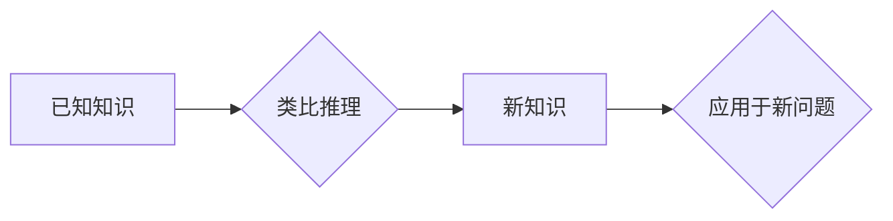

> 洞察力、类比、知识图谱、人工智能、机器学习、深度学习、认知科学、创新

## 1. 背景介绍

在瞬息万变的科技时代，知识的积累和应用显得尤为重要。然而，人类的认知能力有限，难以有效地处理海量信息并从中提取有价值的洞察。如何突破知识的限制，提升洞察力和创新能力，成为当今科技发展的重要课题。

类比思维作为一种强大的认知工具，能够帮助我们建立联系、发现模式和推导新知识。它允许我们从已知的领域迁移经验，应用于未知的领域，从而拓展知识边界。近年来，人工智能和机器学习的快速发展为类比思维的实现提供了新的可能性。

## 2. 核心概念与联系

**2.1 类比思维的本质**

类比思维是一种将两个或多个事物之间的相似之处进行比较和映射的过程。它涉及到以下几个关键要素：

* **相似性:** 类比需要找到两个事物之间存在某种相似性，无论是结构、功能、性质还是意义等方面。
* **映射:** 将一个事物的特征映射到另一个事物，从而建立联系和关系。
* **推导:** 基于类比关系，推导新的知识或解决新的问题。

**2.2 类比思维与知识图谱**

知识图谱是一种结构化的知识表示形式，它将知识表示为实体、关系和属性之间的网络结构。类比思维与知识图谱有着密切的联系。

* **知识图谱提供类比的基础:** 知识图谱中的实体和关系可以作为类比的基准，帮助我们发现相似性和建立映射关系。
* **类比思维丰富知识图谱:** 通过类比思维，我们可以将已有的知识扩展到新的领域，丰富知识图谱的内容和结构。

**2.3 类比思维与人工智能**

人工智能领域近年来取得了显著进展，特别是深度学习技术的突破，为类比思维的实现提供了新的技术支撑。

* **深度学习模型的泛化能力:** 深度学习模型能够从海量数据中学习到复杂的模式和关系，从而提高类比推理的能力。
* **知识图谱嵌入:** 将知识图谱中的实体和关系嵌入到低维向量空间中，使得类比推理更加高效和准确。

**Mermaid 流程图**



## 3. 核心算法原理 & 具体操作步骤

**3.1 算法原理概述**

类比推理算法的核心是找到两个或多个事物之间的相似性，并根据这些相似性推导新的知识或解决新的问题。常见的类比推理算法包括：

* **基于规则的类比推理:** 基于事先定义的规则和知识库，通过逻辑推理进行类比。
* **基于距离的类比推理:** 将实体和关系嵌入到向量空间中，利用距离度量来衡量相似性，并进行类比推理。
* **基于神经网络的类比推理:** 利用深度学习模型学习类比关系，并进行类比推理。

**3.2 算法步骤详解**

以基于距离的类比推理算法为例，其具体步骤如下：

1. **构建知识图谱:** 将已有的知识表示为实体、关系和属性之间的网络结构。
2. **实体和关系嵌入:** 将知识图谱中的实体和关系嵌入到低维向量空间中，使得类比推理更加高效和准确。
3. **计算相似度:** 利用距离度量（例如欧氏距离、余弦相似度等）计算两个实体或关系之间的相似度。
4. **进行类比推理:** 根据相似度进行类比推理，推导新的知识或解决新的问题。

**3.3 算法优缺点**

* **优点:**

    * 能够处理复杂的关系和模式。
    * 具有较强的泛化能力。
    * 可以从海量数据中学习到丰富的类比知识。

* **缺点:**

    * 需要大量的训练数据。
    * 算法的复杂度较高。
    * 类比推理的结果可能存在一定的误差。

**3.4 算法应用领域**

类比推理算法在许多领域都有广泛的应用，例如：

* **自然语言处理:** 理解文本中的隐含含义、进行文本生成和翻译。
* **计算机视觉:** 识别物体、场景和行为。
* **推荐系统:** 根据用户的历史行为和偏好，推荐相关的商品或服务。
* **医疗诊断:** 基于患者的症状和病史，辅助医生进行诊断。

## 4. 数学模型和公式 & 详细讲解 & 举例说明

**4.1 数学模型构建**

假设我们有一个知识图谱，其中包含实体 $E$ 和关系 $R$。我们可以将实体和关系表示为向量，分别为 $e_i$ 和 $r_j$，其中 $i$ 和 $j$ 分别表示实体和关系的索引。

**4.2 公式推导过程**

基于距离的类比推理算法通常利用余弦相似度来衡量实体或关系之间的相似性。余弦相似度的计算公式如下：

$$
\text{cosine similarity}(e_i, e_j) = \frac{e_i \cdot e_j}{||e_i|| ||e_j||}
$$

其中，$e_i \cdot e_j$ 表示 $e_i$ 和 $e_j$ 的点积，$||e_i||$ 和 $||e_j||$ 分别表示 $e_i$ 和 $e_j$ 的模长。

**4.3 案例分析与讲解**

例如，我们有一个知识图谱，其中包含实体 "猫"、"狗"、"哺乳动物" 和关系 "是"。我们可以将这些实体和关系嵌入到向量空间中，并计算它们之间的余弦相似度。

* "猫" 和 "狗" 之间的余弦相似度较高，因为它们都是哺乳动物。
* "猫" 和 "哺乳动物" 之间的余弦相似度也较高，因为 "猫" 是一个哺乳动物。

基于这些相似度，我们可以进行类比推理，例如推断 "狗" 也是一个哺乳动物。

## 5. 项目实践：代码实例和详细解释说明

**5.1 开发环境搭建**

* Python 3.x
* TensorFlow 或 PyTorch
* Jupyter Notebook

**5.2 源代码详细实现**

```python
import numpy as np
from sklearn.metrics.pairwise import cosine_similarity

# 构建知识图谱
entities = ["猫", "狗", "哺乳动物"]
relations = ["是"]
entity_embeddings = np.random.rand(len(entities), 10)  # 实体嵌入
relation_embeddings = np.random.rand(len(relations), 10)  # 关系嵌入

# 计算实体之间的余弦相似度
similarity_matrix = cosine_similarity(entity_embeddings)

# 进行类比推理
query_entity = "猫"
target_entity = "哺乳动物"
similar_entities = np.argsort(similarity_matrix[entities.index(query_entity), :])[::-1]
top_k_similar_entities = similar_entities[:3]

print(f"与 '{query_entity}' 最相似的实体是: {entities[top_k_similar_entities]}")
```

**5.3 代码解读与分析**

* 首先，我们构建了一个简单的知识图谱，包含实体和关系。
* 然后，我们为每个实体和关系生成随机的向量嵌入。
* 利用 scikit-learn 库中的 `cosine_similarity` 函数计算实体之间的余弦相似度。
* 最后，我们根据查询实体和目标实体之间的相似度，找到与查询实体最相似的实体。

**5.4 运行结果展示**

运行上述代码，会输出与 "猫" 最相似的实体，例如 "狗"、"哺乳动物" 等。

## 6. 实际应用场景

类比思维在许多实际应用场景中发挥着重要作用，例如：

* **药物研发:** 通过类比已知的药物和疾病的关系，预测新的药物组合和治疗方案。
* **材料科学:** 通过类比已知的材料特性，设计新的材料和结构。
* **金融分析:** 通过类比历史市场数据，预测未来的市场趋势。

**6.4 未来应用展望**

随着人工智能和机器学习技术的不断发展，类比思维的应用场景将更加广泛。未来，类比思维将被应用于更多领域，例如：

* **个性化教育:** 根据学生的学习风格和知识水平，提供个性化的学习内容和教学方法。
* **创意设计:** 通过类比已有的设计作品，激发新的创意和设计方案。
* **科学发现:** 通过类比已知的科学规律，探索新的科学现象和理论。

## 7. 工具和资源推荐

**7.1 学习资源推荐**

* **书籍:**
    * 《认知科学导论》
    * 《人工智能：现代方法》
    * 《深度学习》
* **在线课程:**
    * Coursera: 人工智能
    * edX: 深度学习
    * Udacity: 机器学习工程师

**7.2 开发工具推荐**

* **Python:** 广泛应用于人工智能和机器学习领域。
* **TensorFlow:** Google 开发的开源深度学习框架。
* **PyTorch:** Facebook 开发的开源深度学习框架。

**7.3 相关论文推荐**

* **《基于知识图谱的类比推理》**
* **《深度学习中的类比推理》**
* **《类比思维与人工智能》**

## 8. 总结：未来发展趋势与挑战

**8.1 研究成果总结**

近年来，类比思维的研究取得了显著进展，特别是深度学习技术的应用为类比推理提供了新的技术支撑。

**8.2 未来发展趋势**

未来，类比思维的研究将朝着以下几个方向发展：

* **更强大的类比推理模型:** 开发能够处理更复杂关系和模式的类比推理模型。
* **更有效的类比推理算法:** 提高类比推理的效率和准确性。
* **更广泛的应用场景:** 将类比思维应用于更多领域，例如个性化教育、创意设计和科学发现。

**8.3 面临的挑战**

类比思维的研究仍然面临着一些挑战，例如：

* **类比推理的解释性:** 难以解释深度学习模型进行类比推理的过程。
* **类比推理的鲁棒性:** 类比推理模型对噪声和异常数据敏感。
* **类比推理的泛化能力:** 类比推理模型难以泛化到新的领域和任务。

**8.4 研究展望**

未来，我们需要继续探索类比思维的本质，开发更强大、更有效的类比推理模型，并将其应用于更多领域，从而推动人工智能的进步和人类社会的进步。

## 9. 附录：常见问题与解答

**9.1 什么是类比思维？**

类比思维是一种将两个或多个事物之间的相似之处进行比较和映射的过程，从而发现模式、推导新知识或解决新问题。

**9.2 类比思维与人工智能有什么关系？**

人工智能领域近年来取得了显著进展，特别是深度学习技术的突破，为类比思维的实现提供了新的技术支撑。

**9.3 类比思维有哪些应用场景？**

类比思维在许多领域都有广泛的应用，例如自然语言处理、计算机视觉、推荐系统和医疗诊断。

**9.4 如何学习类比思维？**

可以通过阅读相关书籍、参加在线课程和研究相关论文来学习类比思维。

作者：禅与计算机程序设计艺术 / Zen and the Art of Computer Programming


<end_of_turn>